# full.php 示例详解

<cite>
**本文档中引用的文件**
- [full.php](file://example/full.php)
- [StateManager.php](file://src/State/StateManager.php)
- [GridBuilder.php](file://src/Components/GridBuilder.php)
- [MultilineEntryBuilder.php](file://src/Components/MultilineEntryBuilder.php)
- [RadioBuilder.php](file://src/Components/RadioBuilder.php)
- [SpinboxBuilder.php](file://src/Components/SpinboxBuilder.php)
- [SliderBuilder.php](file://src/Components/SliderBuilder.php)
- [ComboboxBuilder.php](file://src/Components/ComboboxBuilder.php)
- [ButtonBuilder.php](file://src/Components/ButtonBuilder.php)
- [EntryBuilder.php](file://src/Components/EntryBuilder.php)
- [CheckboxBuilder.php](file://src/Components/CheckboxBuilder.php)
- [Builder.php](file://src/Builder.php)
</cite>

## 目录
1. [项目概述](#项目概述)
2. [项目结构分析](#项目结构分析)
3. [核心架构设计](#核心架构设计)
4. [多层级容器嵌套结构](#多层级容器嵌套结构)
5. [控件类型与配置详解](#控件类型与配置详解)
6. [StateManager 状态管理机制](#statemanager-状态管理机制)
7. [批量数据读取实现](#批量数据读取实现)
8. [表单重置功能实现](#表单重置功能实现)
9. [性能优化策略](#性能优化策略)
10. [界面布局与交互流程](#界面布局与交互流程)
11. [最佳实践总结](#最佳实践总结)

## 项目概述

full.php 是 libuiBuilder 库中的一个完整示例文件，展示了如何构建复杂的 GUI 界面。该示例演示了多种控件类型的组合使用，包括输入类、选择类、数值类和按钮类控件，以及它们之间的层次化布局结构。

### 主要特性
- **多层级容器嵌套**：采用 vbox → hbox → grid 的嵌套结构
- **多样化控件类型**：涵盖输入、选择、数值、按钮等各类控件
- **状态管理机制**：通过 StateManager 实现组件间的数据共享
- **事件驱动编程**：支持各种控件的事件回调处理
- **批量操作功能**：提供表单数据获取和重置功能

## 项目结构分析

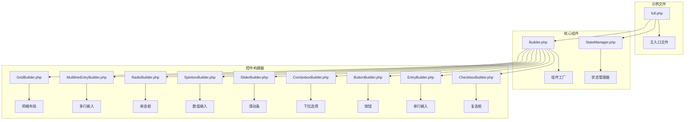

**图表来源**
- [full.php](file://example/full.php#L1-L180)
- [Builder.php](file://src/Builder.php#L1-L153)
- [StateManager.php](file://src/State/StateManager.php#L1-L91)

**章节来源**
- [full.php](file://example/full.php#L1-L180)
- [Builder.php](file://src/Builder.php#L1-L153)

## 核心架构设计

libuiBuilder 采用了分层架构设计，主要包含以下层次：

### 架构层次图

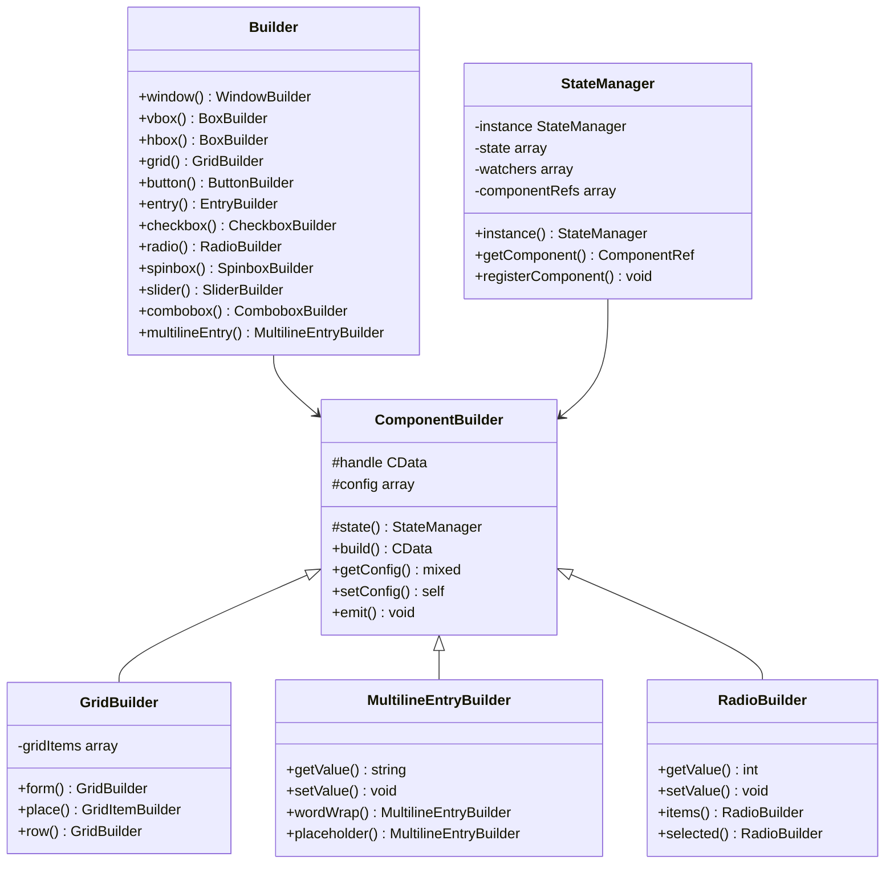

**图表来源**
- [Builder.php](file://src/Builder.php#L27-L152)
- [StateManager.php](file://src/State/StateManager.php#L8-L91)
- [GridBuilder.php](file://src/Components/GridBuilder.php#L9-L120)

## 多层级容器嵌套结构

full.php 展示了典型的三层嵌套结构：vbox → hbox → grid，这种设计提供了灵活的布局控制能力。

### 嵌套结构分析

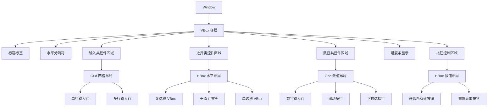

**图表来源**
- [full.php](file://example/full.php#L19-L177)

### 容器类型与用途

| 容器类型 | 用途 | 特点 |
|---------|------|------|
| VBox | 垂直布局容器 | 子元素按垂直方向排列，适合表单整体布局 |
| HBox | 水平布局容器 | 子元素按水平方向排列，适合并列控件组 |
| Grid | 网格布局容器 | 支持行列精确定位，适合表单字段对齐 |

**章节来源**
- [full.php](file://example/full.php#L19-L177)

## 控件类型与配置详解

### 输入类控件

#### 单行输入控件 (Entry)
- **配置参数**：
  - `id`: 'singleLineInput'
  - `placeholder`: '输入文本'
  - `text`: 初始文本内容

#### 多行输入控件 (MultilineEntry)
- **配置参数**：
  - `id`: 'multiLineInput'
  - `placeholder`: '输入多行文本...'
  - `wordWrap`: true（自动换行）
  - `text`: 初始文本内容

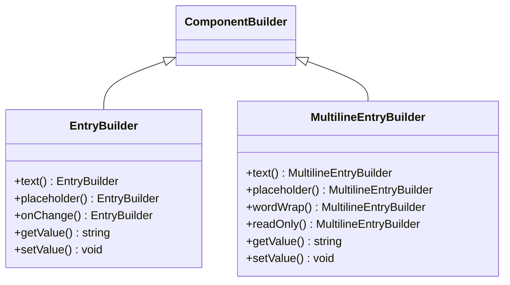

**图表来源**
- [EntryBuilder.php](file://src/Components/EntryBuilder.php#L9-L80)
- [MultilineEntryBuilder.php](file://src/Components/MultilineEntryBuilder.php#L9-L86)

### 选择类控件

#### 复选框控件 (Checkbox)
- **配置参数**：
  - `id`: 'checkbox1', 'checkbox2', 'checkbox3'
  - `text`: 选项文本
  - `checked`: 默认选中状态

#### 单选框控件 (Radio)
- **配置参数**：
  - `id`: 'radioGroup'
  - `items`: ['选项A', '选项B', '选项C']
  - `selected`: 默认选中索引
  - `onSelected`: 选择回调函数

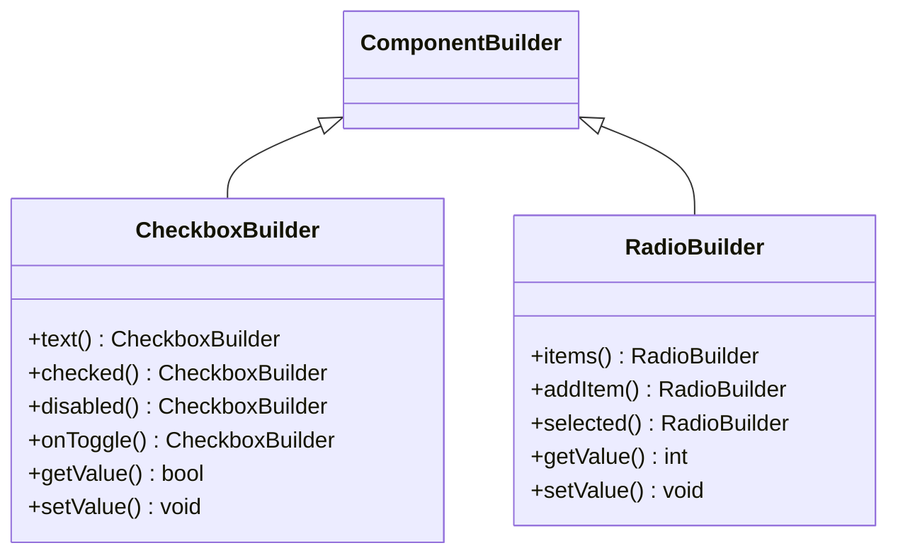

**图表来源**
- [CheckboxBuilder.php](file://src/Components/CheckboxBuilder.php#L9-L97)
- [RadioBuilder.php](file://src/Components/RadioBuilder.php#L9-L80)

### 数值类控件

#### 数字输入控件 (Spinbox)
- **配置参数**：
  - `id`: 'spinboxInput'
  - `range`: (0, 100)
  - `value`: 50

#### 滑动条控件 (Slider)
- **配置参数**：
  - `id`: 'sliderInput'
  - `range`: (0, 100)
  - `value`: 30
  - `onChange`: 滑动回调函数

#### 下拉选择控件 (Combobox)
- **配置参数**：
  - `id`: 'comboboxInput'
  - `items`: ['选择...', '北京', '上海', '广州', '深圳']
  - `selected`: 0

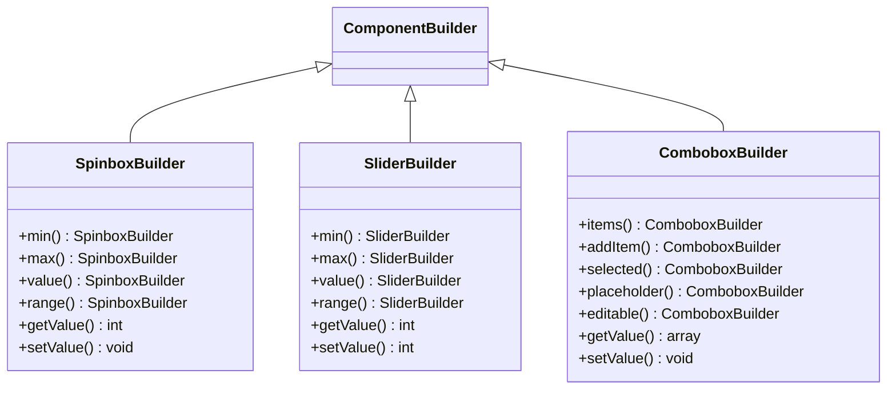

**图表来源**
- [SpinboxBuilder.php](file://src/Components/SpinboxBuilder.php#L9-L78)
- [SliderBuilder.php](file://src/Components/SliderBuilder.php#L9-L78)
- [ComboboxBuilder.php](file://src/Components/ComboboxBuilder.php#L10-L258)

### 按钮控件

#### 获取所有值按钮
- **功能**：收集表单中所有控件的当前值
- **实现方式**：通过 StateManager::getComponent 获取组件实例

#### 重置表单按钮
- **功能**：重置所有控件到初始状态
- **实现方式**：统一调用各个控件的 setValue 方法

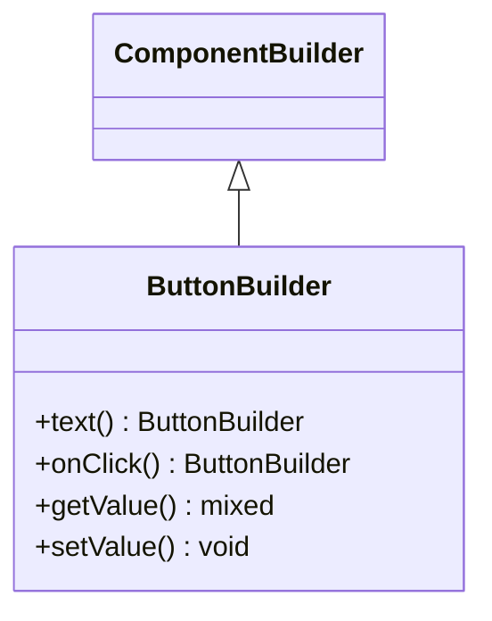

**图表来源**
- [ButtonBuilder.php](file://src/Components/ButtonBuilder.php#L9-L48)

**章节来源**
- [full.php](file://example/full.php#L26-L176)

## StateManager 状态管理机制

StateManager 是整个应用的状态管理中心，负责组件间的通信和数据共享。

### 状态管理架构

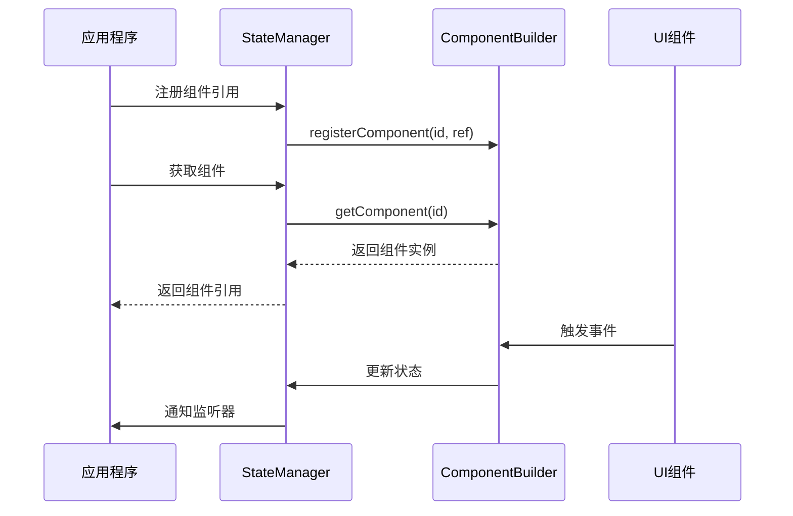

**图表来源**
- [StateManager.php](file://src/State/StateManager.php#L78-L82)

### 核心功能

| 功能 | 方法 | 描述 |
|------|------|------|
| 组件注册 | `registerComponent()` | 将组件ID与实例关联 |
| 组件获取 | `getComponent()` | 通过ID获取组件实例 |
| 状态设置 | `set()` | 设置全局状态值 |
| 状态获取 | `get()` | 获取全局状态值 |
| 批量更新 | `update()` | 批量更新多个状态 |

### 组件引用管理

StateManager 使用 `componentRefs` 数组维护所有已注册组件的引用，确保可以通过ID快速访问任何组件实例。

**章节来源**
- [StateManager.php](file://src/State/StateManager.php#L1-L91)

## 批量数据读取实现

'获取所有值' 按钮展示了如何通过 StateManager 批量读取表单数据的最佳实践。

### 数据读取流程

```mermaid
flowchart TD
A[点击获取所有值按钮] --> B[初始化输出格式]
B --> C[获取单行输入值]
C --> D[获取多行输入值]
D --> E[获取复选框值]
E --> F[获取数字输入值]
F --> G[获取滑动条值]
G --> H[获取下拉选择值]
H --> I[格式化输出结果]
I --> J[显示到控制台]
C --> C1[StateManager::getComponent('singleLineInput')]
C1 --> C2[getValue() 方法]
D --> D1[StateManager::getComponent('multiLineInput')]
D1 --> D2[getValue() 方法]
E --> E1[StateManager::getComponent('checkbox1/2/3')]
E1 --> E2[getValue() 方法]
F --> F1[StateManager::getComponent('spinboxInput')]
F1 --> F2[getValue() 方法]
G --> G1[StateManager::getComponent('sliderInput')]
G1 --> G2[getValue() 方法]
H --> H1[StateManager::getComponent('comboboxInput')]
H1 --> H2[getValue() 方法]
```

**图表来源**
- [full.php](file://example/full.php#L126-L158)

### 代码实现模式

```php
// 获取单行输入值
$singleLineValue = $stateManager->getComponent('singleLineInput')?->getValue() ?? 'N/A';

// 获取多行输入值  
$multiLineValue = $stateManager->getComponent('multiLineInput')?->getValue() ?? 'N/A';

// 获取复选框值
$checkbox1Value = $stateManager->getComponent('checkbox1')?->getValue() ?? false;
$checkbox2Value = $stateManager->getComponent('checkbox2')?->getValue() ?? false;
$checkbox3Value = $stateManager->getComponent('checkbox3')?->getValue() ?? false;

// 获取数值控件值
$spinboxValue = $stateManager->getComponent('spinboxInput')?->getValue() ?? 'N/A';
$sliderValue = $stateManager->getComponent('sliderInput')?->getValue() ?? 'N/A';

// 获取下拉选择值
$comboboxValue = $stateManager->getComponent('comboboxInput')?->getValue();
$comboboxText = is_array($comboboxValue) ? ($comboboxValue['item'] ?? 'N/A') : 'N/A';
```

### 错误处理机制

- 使用空合并运算符 (`??`) 提供默认值
- 使用 null 安全运算符 (`?->`) 防止未注册组件导致的错误
- 对于复杂对象（如 Combobox），进行类型检查和属性访问

**章节来源**
- [full.php](file://example/full.php#L126-L158)

## 表单重置功能实现

'重置表单' 按钮展示了如何统一重置所有控件到初始状态。

### 重置流程

```mermaid
flowchart TD
A[点击重置表单按钮] --> B[清空文本输入]
B --> C[重置复选框状态]
C --> D[重置数值控件]
D --> E[重置下拉选择]
E --> F[显示重置完成消息]
B --> B1[setStateManager::getComponent('singleLineInput')->setValue('')]
B --> B2[setStateManager::getComponent('multiLineInput')->setValue('')]
C --> C1[setStateManager::getComponent('checkbox1')->setValue(false)]
C --> C2[setStateManager::getComponent('checkbox2')->setValue(false)]
C --> C3[setStateManager::getComponent('checkbox3')->setValue(false)]
D --> D1[setStateManager::getComponent('spinboxInput')->setValue(50)]
D --> D2[setStateManager::getComponent('sliderInput')->setValue(30)]
E --> E1[setStateManager::getComponent('comboboxInput')->setValue(0)]
```

**图表来源**
- [full.php](file://example/full.php#L163-L175)

### 统一重置策略

```php
// 重置所有控件值
$stateManager->getComponent('singleLineInput')?->setValue('');
$stateManager->getComponent('multiLineInput')?->setValue('');
$stateManager->getComponent('checkbox1')?->setValue(false);
$stateManager->getComponent('checkbox2')?->setValue(false);
$stateManager->getComponent('checkbox3')?->setValue(false);
$stateManager->getComponent('spinboxInput')?->setValue(50);
$stateManager->getComponent('sliderInput')?->setValue(30);
$stateManager->getComponent('comboboxInput')?->setValue(0);
```

### 重置策略特点

1. **一致性**：所有控件使用相同的重置方法
2. **完整性**：覆盖所有类型的控件
3. **简洁性**：使用链式调用减少代码量
4. **健壮性**：使用 null 安全运算符防止错误

**章节来源**
- [full.php](file://example/full.php#L163-L175)

## 性能优化策略

### 避免重复查询组件

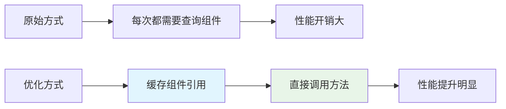

### 优化建议

| 优化策略 | 实现方式 | 性能收益 |
|---------|----------|----------|
| 缓存组件引用 | 通过 StateManager.getComponent() 获取后保存 | 减少重复查询开销 |
| 批量操作 | 使用数组循环处理多个控件 | 减少函数调用次数 |
| 延迟加载 | 按需创建和注册组件 | 降低内存占用 |
| 事件节流 | 合理设置事件回调频率 | 减少CPU占用 |

### 最佳实践代码模式

```php
// 推荐：缓存组件引用
$inputComponent = $stateManager->getComponent('singleLineInput');
if ($inputComponent) {
    $value = $inputComponent->getValue();
    // 使用缓存的引用进行操作
}

// 避免：重复查询组件
$value1 = $stateManager->getComponent('input')?->getValue();
$value2 = $stateManager->getComponent('input')?->getValue(); // 冗余查询
```

## 界面布局与交互流程

### 视觉层次结构

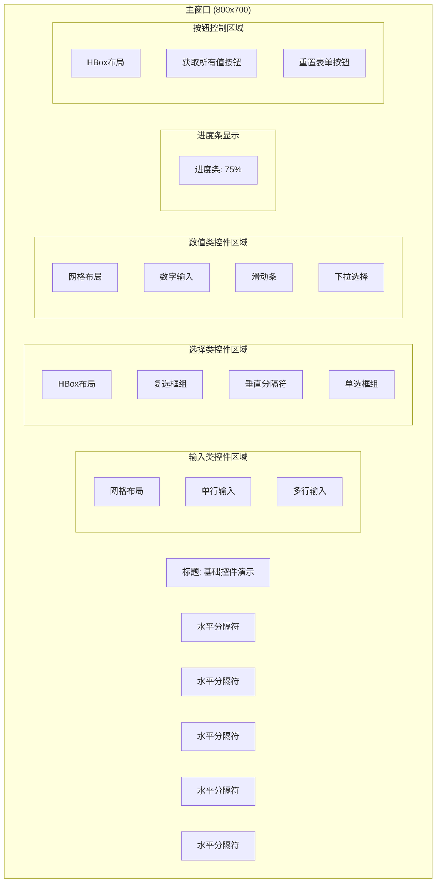

**图表来源**
- [full.php](file://example/full.php#L14-L177)

### 交互流程分析

#### 用户操作流程

1. **浏览阶段**：用户查看各种控件的外观和基本功能
2. **输入阶段**：用户在输入类控件中输入数据
3. **选择阶段**：用户通过选择类控件设置选项
4. **调整阶段**：用户使用数值类控件调节参数
5. **验证阶段**：用户点击"获取所有值"按钮验证数据
6. **重置阶段**：用户点击"重置表单"按钮恢复初始状态

#### 控件响应机制

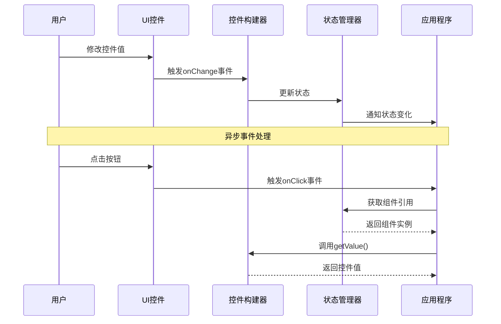

**图表来源**
- [full.php](file://example/full.php#L126-L175)

### 布局设计原则

1. **层次分明**：通过分隔符区分不同功能区域
2. **对齐一致**：使用网格布局确保字段对齐
3. **间距合理**：适当的内边距和外边距
4. **响应式设计**：支持窗口大小调整

**章节来源**
- [full.php](file://example/full.php#L1-L180)

## 最佳实践总结

### 代码组织原则

1. **模块化设计**：每个控件类型独立封装
2. **链式调用**：提供流畅的配置接口
3. **事件驱动**：支持异步事件处理
4. **状态管理**：集中管理组件状态

### 开发建议

1. **组件命名**：使用有意义的ID便于状态管理
2. **错误处理**：始终考虑组件未注册的情况
3. **性能优化**：避免重复查询组件引用
4. **用户体验**：提供清晰的反馈和提示

### 扩展性考虑

1. **插件架构**：支持自定义控件类型
2. **主题系统**：支持界面样式定制
3. **国际化**：支持多语言界面
4. **可访问性**：遵循无障碍设计原则

通过 full.php 示例，我们可以看到 libuiBuilder 提供了一个完整而灵活的 GUI 开发框架，它不仅简化了控件的创建和配置，还提供了强大的状态管理和事件处理机制，为构建复杂的桌面应用程序奠定了坚实的基础。