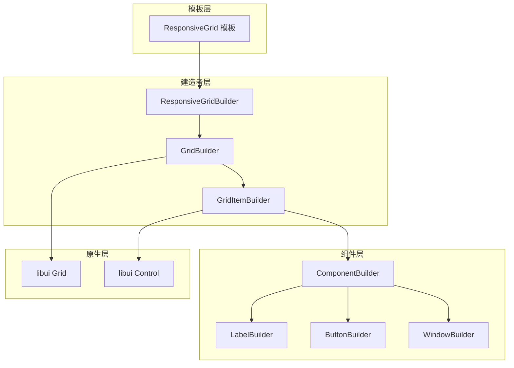
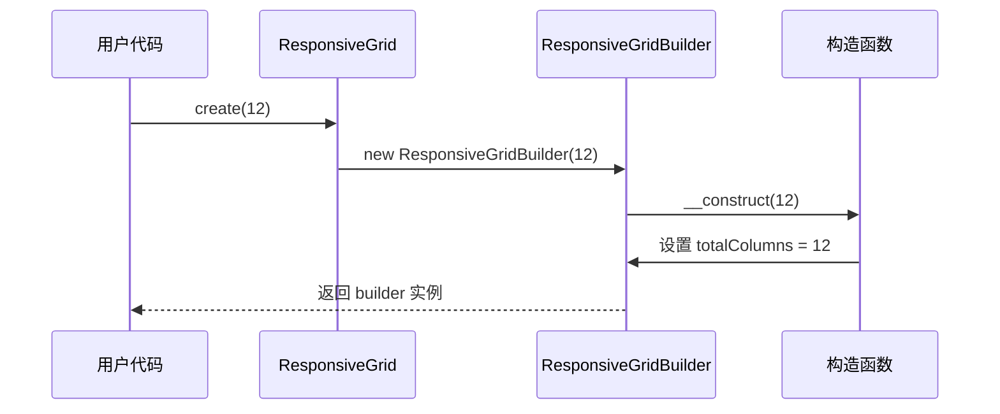
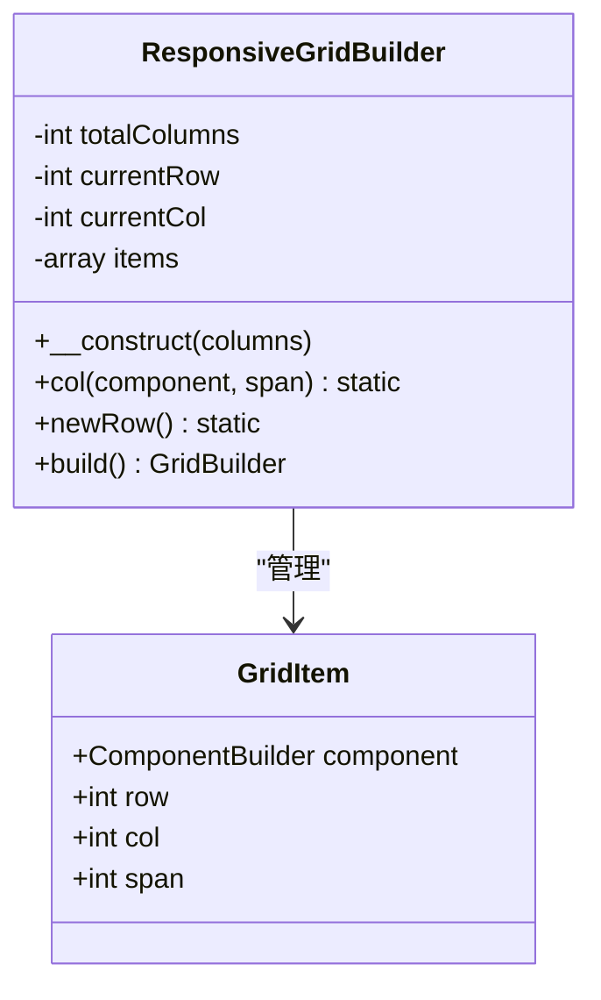
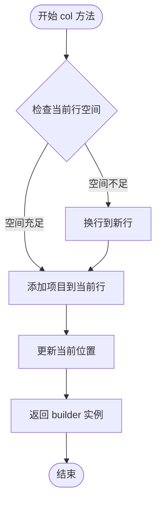
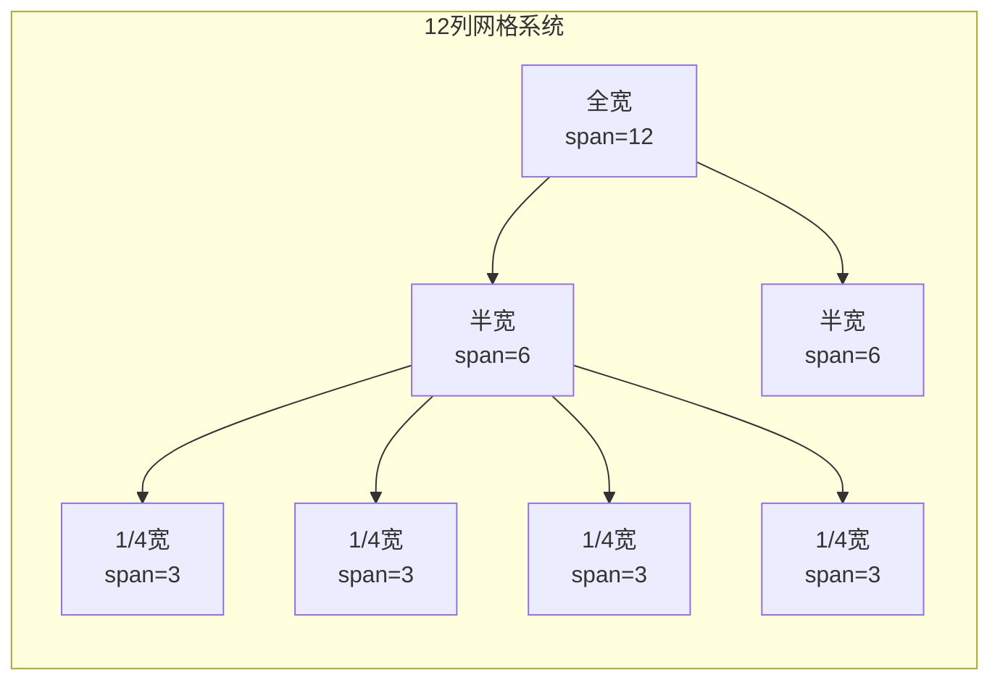
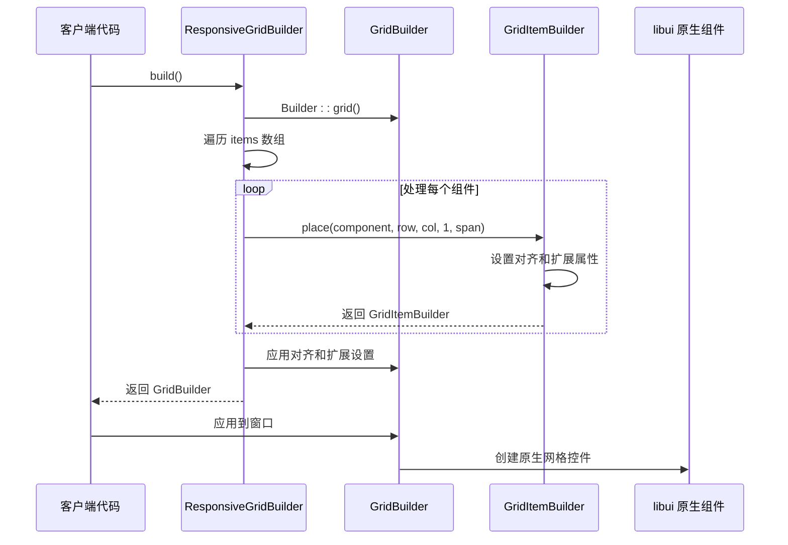
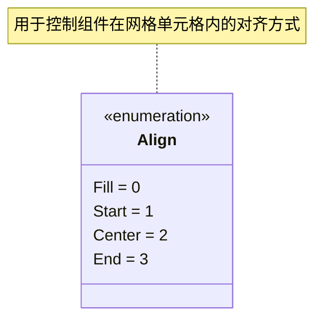
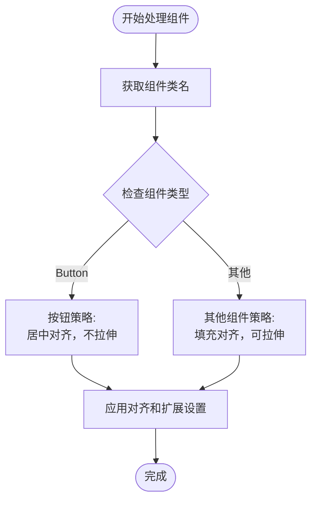

# responseGrid.php 示例详解

<cite>
**本文档引用的文件**
- [responseGrid.php](file://example/responseGrid.php)
- [ResponsiveGrid.php](file://src/Templates/ResponsiveGrid.php)
- [ResponsiveGridBuilder.php](file://src/ResponsiveGridBuilder.php)
- [Builder.php](file://src/Builder.php)
- [GridBuilder.php](file://src/Components/GridBuilder.php)
- [GridItemBuilder.php](file://src/Components/GridItemBuilder.php)
- [Align.php](file://vendor/kingbes/libui/src/Align.php)
</cite>

## 目录
1. [项目概述](#项目概述)
2. [响应式网格设计理念](#响应式网格设计理念)
3. [核心架构分析](#核心架构分析)
4. [ResponsiveGrid 类详解](#responsivegrid-类详解)
5. [ResponsiveGridBuilder 实现机制](#responsivegridbuilder-实现机制)
6. [列宽分配系统](#列宽分配系统)
7. [布局构建流程](#布局构建流程)
8. [对齐与扩展策略](#对齐与扩展策略)
9. [扩展开发指南](#扩展开发指南)
10. [最佳实践建议](#最佳实践建议)

## 项目概述

libuiBuilder 是一个基于 PHP 的 GUI 应用程序构建框架，提供了丰富的组件和布局系统。其中的 `responseGrid.php` 示例展示了响应式网格布局的强大功能，通过灵活的列宽分配和自动换行机制，实现了适应不同屏幕尺寸的动态界面设计。

## 响应式网格设计理念

响应式网格布局是现代用户界面设计的重要组成部分，它能够根据容器大小自动调整布局结构，确保在各种设备上都能提供良好的用户体验。libuiBuilder 的响应式网格系统具有以下核心特点：

### 设计原则

1. **模块化架构**：采用模板模式和建造者模式，将布局逻辑与具体实现分离
2. **灵活的列宽系统**：支持任意列数的网格系统，便于适应不同的布局需求
3. **智能换行机制**：当当前行空间不足时自动换行，无需手动管理布局
4. **组件对齐优化**：针对不同类型组件提供专门的对齐和扩展策略

### 核心优势

- **易用性**：提供简洁的链式调用 API
- **灵活性**：支持自定义列数、间距和响应规则
- **性能优化**：智能的空间管理和组件复用
- **兼容性**：与 libui 原生组件无缝集成

## 核心架构分析

libuiBuilder 的响应式网格系统采用了分层架构设计，从上到下包含模板层、建造者层和组件层：



**图表来源**
- [ResponsiveGrid.php](file://src/Templates/ResponsiveGrid.php#L8-L13)
- [ResponsiveGridBuilder.php](file://src/ResponsiveGridBuilder.php#L7-L17)
- [GridBuilder.php](file://src/Components/GridBuilder.php#L9-L12)

**章节来源**
- [ResponsiveGrid.php](file://src/Templates/ResponsiveGrid.php#L1-L14)
- [ResponsiveGridBuilder.php](file://src/ResponsiveGridBuilder.php#L1-L82)

## ResponsiveGrid 类详解

`ResponsiveGrid` 类作为模板类，提供了简洁的静态工厂方法来创建响应式网格实例。它的设计遵循了简单工厂模式，为用户提供了一个统一的入口点。

### 创建方法分析



**图表来源**
- [ResponsiveGrid.php](file://src/Templates/ResponsiveGrid.php#L10-L12)
- [ResponsiveGridBuilder.php](file://src/ResponsiveGridBuilder.php#L14-L17)

### 关键特性

1. **默认列数**：支持 12 列网格系统，默认参数为 12
2. **灵活配置**：允许用户指定任意列数的网格系统
3. **链式调用**：返回的 builder 实例支持方法链式调用
4. **类型安全**：使用强类型声明确保参数正确性

**章节来源**
- [ResponsiveGrid.php](file://src/Templates/ResponsiveGrid.php#L8-L13)

## ResponsiveGridBuilder 实现机制

`ResponsiveGridBuilder` 是响应式网格系统的核心实现类，负责管理网格布局的逻辑和状态。它维护了当前的行号、列号以及所有已添加的组件信息。

### 内部状态管理



**图表来源**
- [ResponsiveGridBuilder.php](file://src/ResponsiveGridBuilder.php#L9-L12)
- [ResponsiveGridBuilder.php](file://src/ResponsiveGridBuilder.php#L27-L32)

### 核心算法实现

#### 列宽分配算法

列宽分配是响应式网格的核心功能，其实现逻辑如下：



**图表来源**
- [ResponsiveGridBuilder.php](file://src/ResponsiveGridBuilder.php#L19-L35)

#### 智能换行机制

当当前行剩余空间不足以容纳新的组件时，系统会自动换行到下一行：

1. **空间检测**：比较 `currentCol + span` 与 `totalColumns`
2. **行切换**：重置 `currentCol` 为 0，增加 `currentRow`
3. **状态更新**：记录新行的起始位置

**章节来源**
- [ResponsiveGridBuilder.php](file://src/ResponsiveGridBuilder.php#L19-L35)

## 列宽分配系统

列宽分配系统是响应式网格布局的核心机制，它决定了每个组件在网格中的宽度分布。系统支持多种宽度规格，从全宽到细粒度的 1/12 宽度。

### 基本宽度概念

| 宽度规格 | 列数占比 | 实际列数 | 适用场景 |
|---------|---------|---------|----------|
| 全宽 | 1/1 | 12 | 标题栏、横幅、完整区域 |
| 半宽 | 1/2 | 6 | 左右分栏布局 |
| 1/4宽 | 1/4 | 3 | 多列并排显示 |
| 1/3宽 | 1/3 | 4 | 三等分布局 |
| 1/6宽 | 1/6 | 2 | 双列紧凑布局 |

### 宽度计算示例

以 12 列网格系统为例，展示不同宽度规格的实际效果：



**图表来源**
- [responseGrid.php](file://example/responseGrid.php#L11-L17)

### 响应式行为

列宽分配系统具有以下响应式特性：

1. **自动适配**：根据容器宽度自动调整组件大小
2. **比例保持**：保持各组件间的相对比例关系
3. **边界处理**：超出边界时自动换行
4. **空间优化**：充分利用可用空间

**章节来源**
- [responseGrid.php](file://example/responseGrid.php#L10-L17)
- [ResponsiveGridBuilder.php](file://src/ResponsiveGridBuilder.php#L19-L35)

## 布局构建流程

响应式网格的布局构建是一个多步骤的过程，涉及组件收集、位置计算、样式应用等多个阶段。

### 构建流程图



**图表来源**
- [ResponsiveGridBuilder.php](file://src/ResponsiveGridBuilder.php#L45-L69)
- [GridBuilder.php](file://src/Components/GridBuilder.php#L58-L63)

### 组件放置算法

构建过程中的组件放置遵循以下算法：

1. **位置计算**：根据行号和列号确定组件在网格中的位置
2. **跨度设置**：根据 span 参数设置组件的水平跨度
3. **样式应用**：根据组件类型应用相应的对齐和扩展策略
4. **原生映射**：将抽象的布局信息转换为 libui 原生组件

### 最终布局输出

构建完成后，系统生成一个完整的 GridBuilder 实例，该实例包含了所有组件的精确位置信息和样式配置。

**章节来源**
- [ResponsiveGridBuilder.php](file://src/ResponsiveGridBuilder.php#L45-L69)
- [GridBuilder.php](file://src/Components/GridBuilder.php#L58-L63)

## 对齐与扩展策略

响应式网格系统针对不同类型的组件提供了专门的对齐和扩展策略，以确保最佳的视觉效果和用户体验。

### 对齐方式枚举

系统使用 `Align` 枚举来定义对齐方式：



**图表来源**
- [Align.php](file://vendor/kingbes/libui/src/Align.php#L8-L13)

### 组件分类处理

系统根据组件类型采用不同的对齐和扩展策略：

| 组件类型 | 对齐策略 | 扩展策略 | 原因 |
|---------|---------|---------|------|
| 标签 (Label) | fill, center | expand(true, false) | 填充可用空间，垂直居中 |
| 按钮 (Button) | center, center | expand(false, false) | 居中显示，不拉伸 |
| 输入框 (Entry) | fill, center | expand(true, false) | 水平填充，垂直居中 |
| 复选框 (Checkbox) | center, center | expand(false, false) | 居中对齐，保持原始大小 |

### 策略实现机制



**图表来源**
- [ResponsiveGridBuilder.php](file://src/ResponsiveGridBuilder.php#L58-L66)

### 扩展属性详解

- **水平扩展 (hexpand)**：控制组件是否水平方向拉伸
- **垂直扩展 (vexpand)**：控制组件是否垂直方向拉伸
- **水平对齐 (halign)**：控制组件在水平方向的对齐方式
- **垂直对齐 (valign)**：控制组件在垂直方向的对齐方式

**章节来源**
- [ResponsiveGridBuilder.php](file://src/ResponsiveGridBuilder.php#L58-L66)
- [GridItemBuilder.php](file://src/Components/GridItemBuilder.php#L42-L53)

## 扩展开发指南

基于现有的响应式网格系统架构，开发者可以轻松地扩展功能，满足特定的布局需求。

### 自定义列数网格系统

要创建自定义列数的网格系统，只需修改创建时的参数：

```php
// 创建 16 列网格系统
$responsiveLayout = ResponsiveGrid::create(16)
    ->col(Builder::label()->text('标题'), 16)
    ->col(Builder::label()->text('内容'), 12)
    ->col(Builder::label()->text('侧边栏'), 4)
    ->build();
```

### 自定义间距配置

虽然当前版本的响应式网格系统主要关注列宽分配，但可以通过继承或组合的方式添加间距控制：

```php
class AdvancedResponsiveGridBuilder extends ResponsiveGridBuilder {
    private int $columnSpacing = 1;
    private int $rowSpacing = 1;
    
    public function setSpacing(int $column, int $row): self {
        $this->columnSpacing = $column;
        $this->rowSpacing = $row;
        return $this;
    }
    
    // 重写 build 方法以应用间距设置
}
```

### 断点响应式支持

实现断点响应式布局需要扩展系统以支持不同屏幕尺寸下的不同布局策略：

```php
class BreakpointResponsiveGridBuilder extends ResponsiveGridBuilder {
    private array $breakpoints = [
        'mobile' => ['width' => 0, 'columns' => 4],
        'tablet' => ['width' => 768, 'columns' => 8],
        'desktop' => ['width' => 1024, 'columns' => 12],
    ];
    
    public function forScreenSize(int $width): self {
        foreach ($this->breakpoints as $breakpoint) {
            if ($width >= $breakpoint['width']) {
                $this->totalColumns = $breakpoint['columns'];
            }
        }
        return $this;
    }
}
```

### 高级布局模式

#### 灵活网格系统

```php
class FlexibleGridBuilder extends ResponsiveGridBuilder {
    public function autoFit(array $components): self {
        $totalWidth = array_sum(array_column($components, 'span'));
        $remaining = $this->totalColumns - $totalWidth;
        
        if ($remaining > 0) {
            // 平均分配剩余空间
            $extraPerComponent = $remaining / count($components);
            foreach ($components as &$component) {
                $component['span'] += $extraPerComponent;
            }
        }
        
        return $this;
    }
}
```

#### 流式布局支持

```php
class StreamLayoutBuilder extends ResponsiveGridBuilder {
    public function stream(array $components): self {
        $currentWidth = 0;
        $currentRow = 0;
        
        foreach ($components as $component) {
            $span = $component['span'] ?? 1;
            
            if ($currentWidth + $span > $this->totalColumns) {
                $currentRow++;
                $currentWidth = 0;
            }
            
            $this->items[] = [
                'component' => $component['builder'],
                'row' => $currentRow,
                'col' => $currentWidth,
                'span' => $span
            ];
            
            $currentWidth += $span;
        }
        
        return $this;
    }
}
```

**章节来源**
- [ResponsiveGridBuilder.php](file://src/ResponsiveGridBuilder.php#L14-L17)
- [ResponsiveGridBuilder.php](file://src/ResponsiveGridBuilder.php#L45-L69)

## 最佳实践建议

基于对响应式网格系统的深入分析，以下是推荐的最佳实践：

### 布局设计原则

1. **语义化命名**：使用有意义的变量名和注释说明布局意图
2. **渐进增强**：从基础布局开始，逐步添加复杂功能
3. **测试覆盖**：在不同屏幕尺寸下测试布局效果
4. **性能考虑**：避免过度复杂的布局嵌套

### 代码组织建议

```php
// 推荐的布局组织方式
class LayoutBuilder {
    public static function createDashboard(): GridBuilder {
        return ResponsiveGrid::create(12)
            ->col(self::createHeader(), 12)
            ->col(self::createSidebar(), 3)
            ->col(self::createMainContent(), 9)
            ->build();
    }
    
    private static function createHeader(): ComponentBuilder {
        return Builder::label()
            ->text('仪表板')
            ->font(['bold' => true, 'size' => 18]);
    }
    
    private static function createSidebar(): ComponentBuilder {
        return Builder::box()
            ->vertical()
            ->padded()
            ->append([
                Builder::label()->text('菜单项 1'),
                Builder::label()->text('菜单项 2'),
                Builder::label()->text('菜单项 3')
            ]);
    }
}
```

### 性能优化技巧

1. **批量操作**：尽可能使用链式调用减少方法调用开销
2. **缓存策略**：对于重复使用的布局，考虑缓存构建结果
3. **内存管理**：及时释放不再需要的组件引用
4. **懒加载**：对于大型布局，考虑按需加载组件

### 错误处理建议

```php
try {
    $layout = ResponsiveGrid::create(12)
        ->col(Builder::label()->text('有效内容'), 6)
        ->col(Builder::label()->text('无效内容'), 10) // 超出范围
        ->build();
} catch (Exception $e) {
    // 处理布局错误
    error_log("布局创建失败: " . $e->getMessage());
    // 提供降级方案
    $layout = Builder::box()->build();
}
```

### 可访问性考虑

1. **键盘导航**：确保所有组件都可以通过键盘访问
2. **高对比度**：提供高对比度主题支持
3. **屏幕阅读器**：为重要组件添加适当的标签和描述
4. **动画控制**：提供禁用动画的选项

通过遵循这些最佳实践，开发者可以充分发挥响应式网格系统的优势，构建出既美观又实用的用户界面。