# simple.php 示例详解

<cite>
**本文档中引用的文件**
- [simple.php](file://example/simple.php)
- [Builder.php](file://src/Builder.php)
- [StateManager.php](file://src/State/StateManager.php)
- [EntryBuilder.php](file://src/Components/EntryBuilder.php)
- [ButtonBuilder.php](file://src/Components/ButtonBuilder.php)
- [ComboboxBuilder.php](file://src/Components/ComboboxBuilder.php)
- [CheckboxBuilder.php](file://src/Components/CheckboxBuilder.php)
- [GridBuilder.php](file://src/Components/GridBuilder.php)
- [helper.php](file://src/helper.php)
</cite>

## 目录
1. [项目概述](#项目概述)
2. [项目结构分析](#项目结构分析)
3. [核心架构解析](#核心架构解析)
4. [简单示例深度解析](#简单示例深度解析)
5. [基础控件详解](#基础控件详解)
6. [事件处理机制](#事件处理机制)
7. [组件间通信](#组件间通信)
8. [表单验证与数据处理](#表单验证与数据处理)
9. [链式调用与闭包使用](#链式调用与闭包使用)
10. [运行指导与调试](#运行指导与调试)
11. [常见问题排查](#常见问题排查)
12. [总结](#总结)

## 项目概述

simple.php 是 libuiBuilder 项目中的一个基础示例文件，展示了如何使用该框架创建完整的桌面应用程序界面。该项目采用 PHP 语言，基于 libui 库构建跨平台的原生 GUI 应用程序。

### 主要特性
- **声明式 UI 构建**：通过链式调用语法创建复杂的用户界面
- **组件化设计**：模块化的组件架构便于维护和扩展
- **事件驱动编程**：完善的事件处理机制支持交互式应用开发
- **状态管理**：全局状态管理器实现组件间通信
- **表单验证**：内置的数据验证和错误处理机制

## 项目结构分析

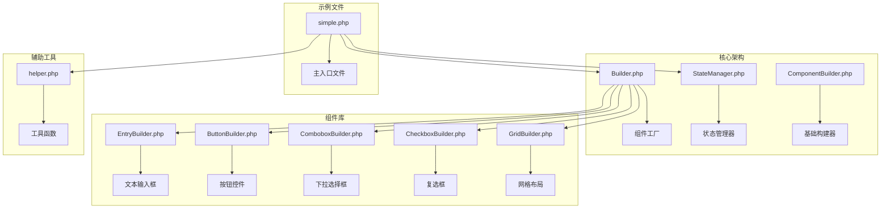

**图表来源**
- [Builder.php](file://src/Builder.php#L1-L153)
- [StateManager.php](file://src/State/StateManager.php#L1-L91)
- [EntryBuilder.php](file://src/Components/EntryBuilder.php#L1-L80)

**章节来源**
- [simple.php](file://example/simple.php#L1-L142)
- [Builder.php](file://src/Builder.php#L1-L153)

## 核心架构解析

### Builder 工厂模式

Builder 类采用工厂模式设计，提供统一的组件创建接口：

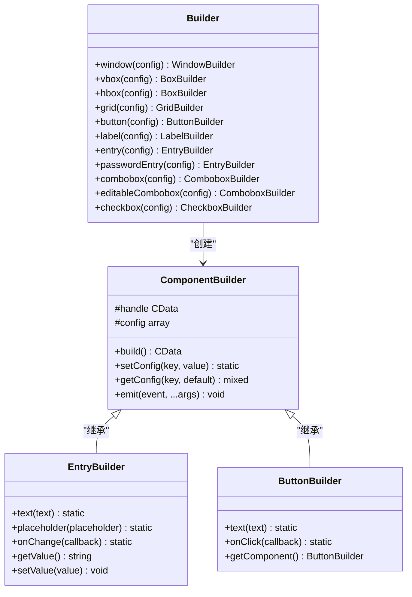

**图表来源**
- [Builder.php](file://src/Builder.php#L27-L152)
- [EntryBuilder.php](file://src/Components/EntryBuilder.php#L9-L80)
- [ButtonBuilder.php](file://src/Components/ButtonBuilder.php#L9-L48)

### StateManager 状态管理

StateManager 提供全局状态管理和组件间通信机制：

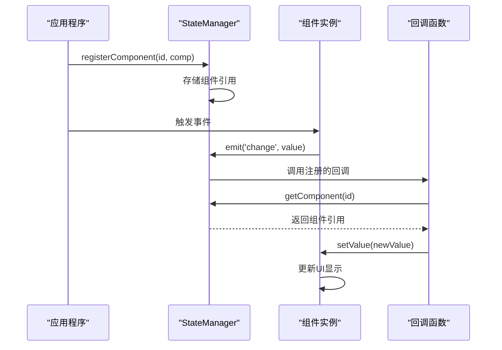

**图表来源**
- [StateManager.php](file://src/State/StateManager.php#L70-L82)

**章节来源**
- [Builder.php](file://src/Builder.php#L27-L152)
- [StateManager.php](file://src/State/StateManager.php#L1-L91)

## 简单示例深度解析

### 应用初始化与窗口创建

示例从应用初始化开始，展示了完整的组件构建流程：

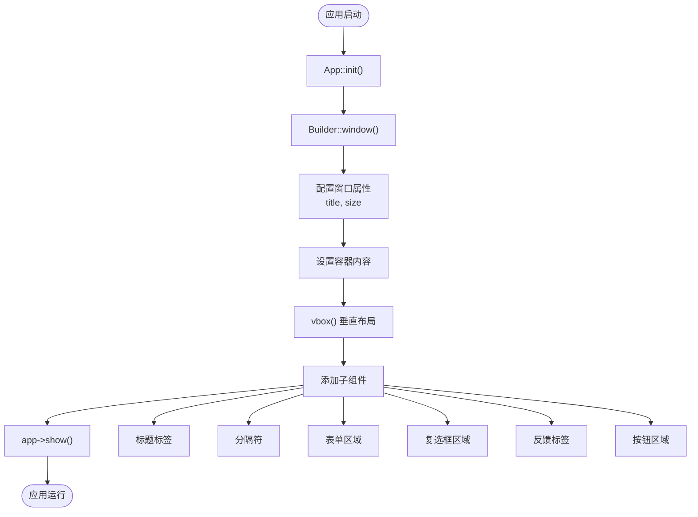

**图表来源**
- [simple.php](file://example/simple.php#L11-L141)

### 窗口配置详解

| 配置项 | 值 | 说明 |
|--------|-----|------|
| title | '完整的基础控件示例' | 窗口标题 |
| size | 700, 500 | 窗口尺寸（宽度×高度） |
| contains | 组件数组 | 窗口包含的内容 |

**章节来源**
- [simple.php](file://example/simple.php#L11-L141)

## 基础控件详解

### 文本输入框（Entry）

Entry 控件用于接收用户输入的文本信息：

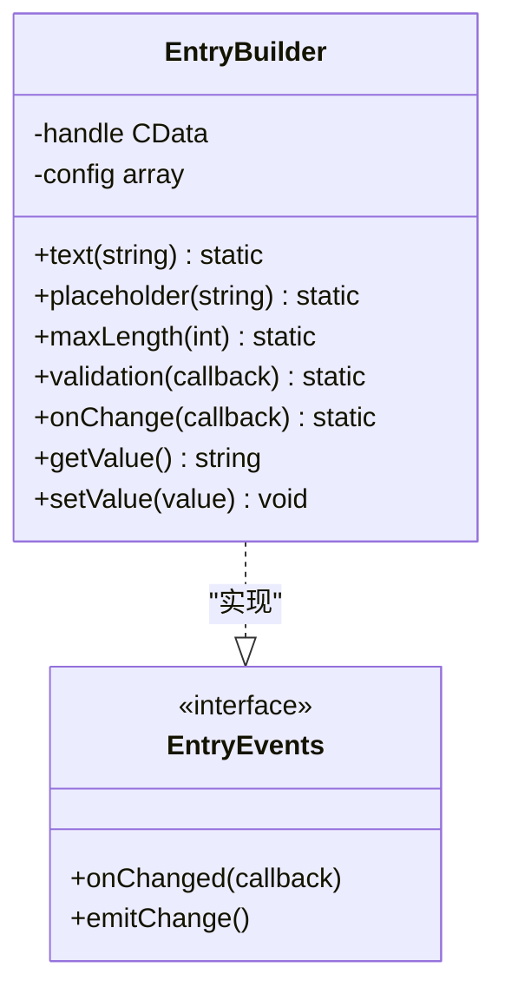

**图表来源**
- [EntryBuilder.php](file://src/Components/EntryBuilder.php#L9-L80)

#### Entry 控件配置参数

| 方法 | 参数类型 | 默认值 | 功能描述 |
|------|----------|--------|----------|
| text() | string | '' | 设置初始文本内容 |
| placeholder() | string | '' | 设置占位符文本 |
| maxLength() | int | 无限制 | 设置最大输入长度 |
| validation() | callable | null | 设置验证回调函数 |
| onChange() | callable | null | 设置变更事件回调 |

### 密码输入框（PasswordEntry）

密码输入框是 Entry 的特化版本，具有隐藏输入内容的功能：

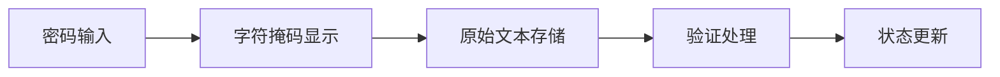

**图表来源**
- [Builder.php](file://src/Builder.php#L83-L86)

### 下拉选择框（Combobox）

Combobox 提供预定义选项的选择功能：

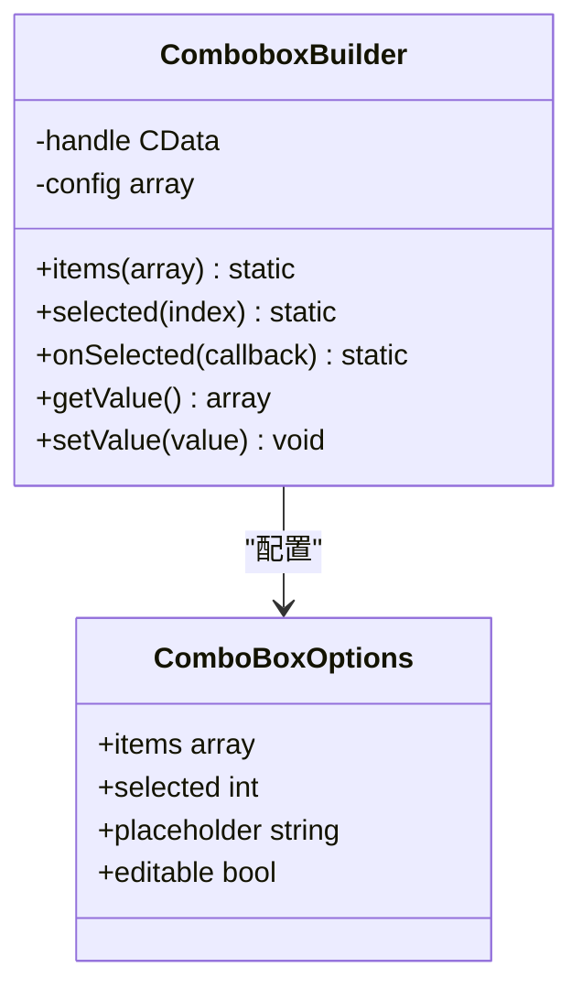

**图表来源**
- [ComboboxBuilder.php](file://src/Components/ComboboxBuilder.php#L10-L258)

#### Combobox 配置选项

| 属性 | 类型 | 说明 |
|------|------|------|
| items | array | 选项列表，支持键值对格式 |
| selected | int | 当前选中索引，默认为 -1 |
| placeholder | string | 未选择时的提示文本 |
| editable | bool | 是否允许用户输入自定义值 |

### 复选框（Checkbox）

复选框用于布尔值的选择：

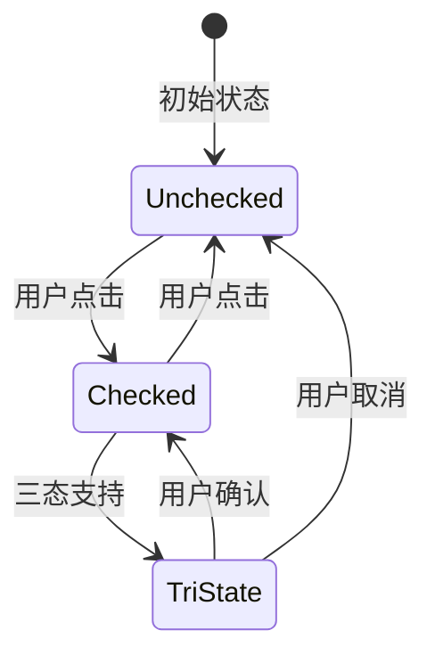

**图表来源**
- [CheckboxBuilder.php](file://src/Components/CheckboxBuilder.php#L9-L97)

**章节来源**
- [EntryBuilder.php](file://src/Components/EntryBuilder.php#L1-L80)
- [ComboboxBuilder.php](file://src/Components/ComboboxBuilder.php#L1-L258)
- [CheckboxBuilder.php](file://src/Components/CheckboxBuilder.php#L1-L97)

## 事件处理机制

### onChange 事件处理

onChange 事件是响应式编程的核心，当控件值发生变化时自动触发：

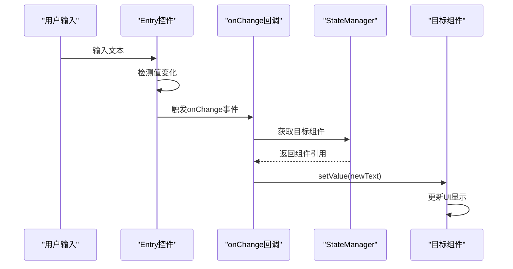

**图表来源**
- [EntryBuilder.php](file://src/Components/EntryBuilder.php#L38-L49)

### onClick 事件处理

onClick 事件处理用户点击操作：

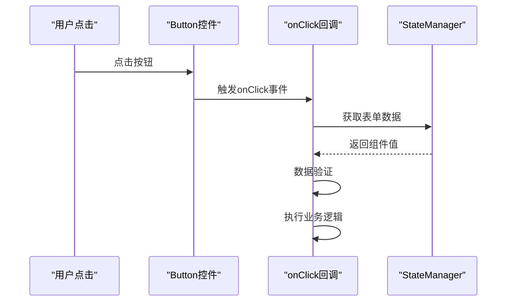

**图表来源**
- [ButtonBuilder.php](file://src/Components/ButtonBuilder.php#L27-L35)

### 事件回调参数详解

| 事件类型 | 回调参数 | 类型 | 说明 |
|----------|----------|------|------|
| onChange | $value | mixed | 新的控件值 |
| onChange | $component | ComponentBuilder | 触发事件的组件 |
| onClick | $button | ButtonBuilder | 触发事件的按钮 |
| onSelected | $index | int | 选中项的索引 |
| onSelected | $item | mixed | 选中的项内容 |
| onToggle | $checked | bool | 复选框的选中状态 |

**章节来源**
- [EntryBuilder.php](file://src/Components/EntryBuilder.php#L38-L49)
- [ButtonBuilder.php](file://src/Components/ButtonBuilder.php#L27-L35)

## 组件间通信

### StateManager 通信机制

StateManager 作为全局状态管理中心，实现了组件间的松耦合通信：

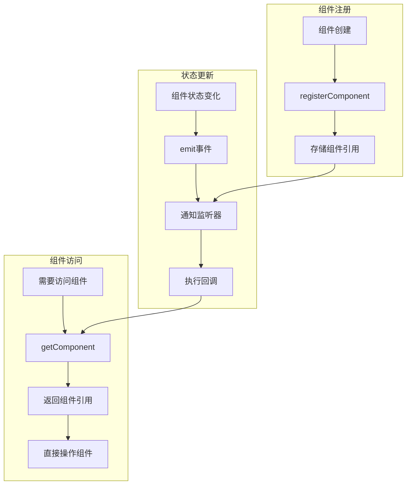

**图表来源**
- [StateManager.php](file://src/State/StateManager.php#L70-L82)

### 组件间通信示例

以欢迎标签和姓名输入框为例：

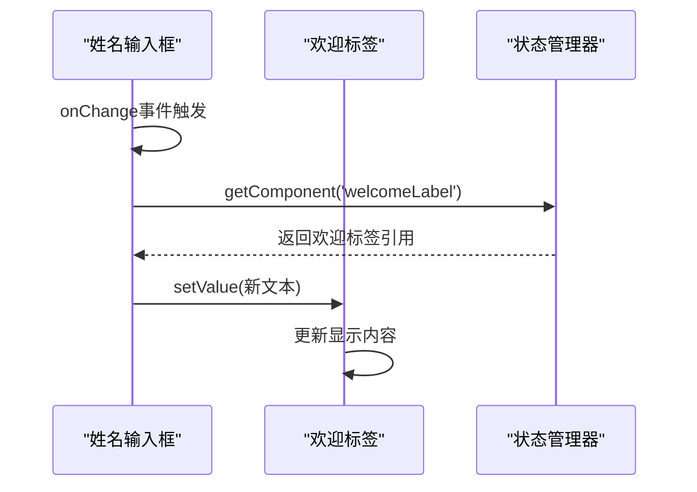

**图表来源**
- [simple.php](file://example/simple.php#L30-L36)

### 通信最佳实践

| 场景 | 推荐方案 | 优势 |
|------|----------|------|
| 同级组件通信 | StateManager.getComponent() | 直接访问，性能最优 |
| 跨层级通信 | StateManager.getComponents() | 灵活的组件查找 |
| 广播通知 | StateManager.watch() | 解耦事件传播 |

**章节来源**
- [StateManager.php](file://src/State/StateManager.php#L70-L82)
- [simple.php](file://example/simple.php#L30-L36)

## 表单验证与数据处理

### 密码强度计算器

helper.php 中提供了密码强度计算函数：

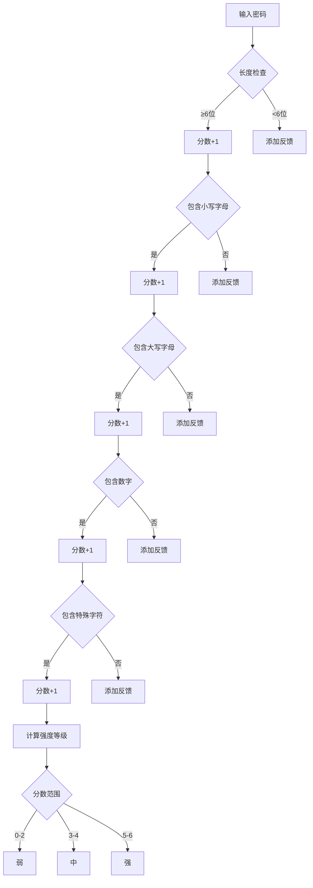

**图表来源**
- [helper.php](file://src/helper.php#L4-L59)

### 表单验证规则

| 字段 | 验证规则 | 错误提示 |
|------|----------|----------|
| 姓名 | 非空验证 | 请输入姓名 |
| 密码 | 最小长度6位 | 请输入密码 |
| 用户协议 | 必须同意 | 请同意用户协议 |

### 数据收集与处理流程

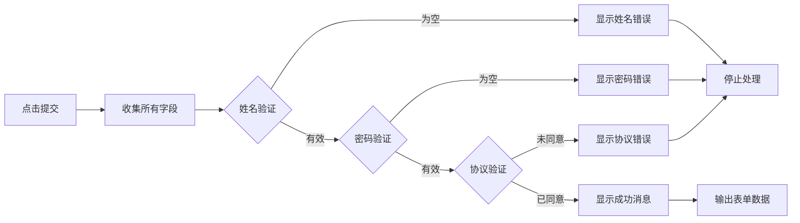

**图表来源**
- [simple.php](file://example/simple.php#L102-L124)

**章节来源**
- [helper.php](file://src/helper.php#L4-L59)
- [simple.php](file://example/simple.php#L102-L124)

## 链式调用与闭包使用

### 链式调用语法

链式调用是 libuiBuilder 的核心设计理念，提供流畅的 API 体验：

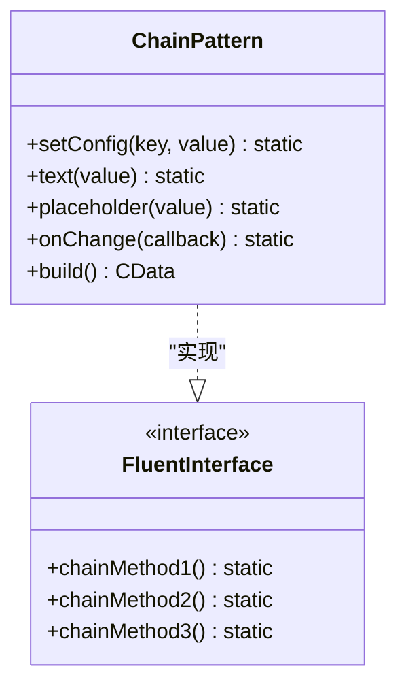

**图表来源**
- [EntryBuilder.php](file://src/Components/EntryBuilder.php#L66-L79)

### 闭包回调的使用场景

| 使用场景 | 闭包参数 | 返回值 | 示例用途 |
|----------|----------|--------|----------|
| onChange | $value, $component | void | 动态更新其他组件 |
| onClick | $button, $state | void | 数据收集和验证 |
| onSelected | $index, $item, $component | void | 状态同步 |
| onToggle | $checked, $component | void | 条件控制 |

### 闭包作用域管理

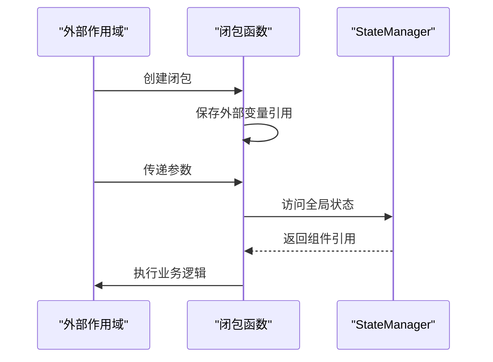

**图表来源**
- [simple.php](file://example/simple.php#L30-L36)

**章节来源**
- [EntryBuilder.php](file://src/Components/EntryBuilder.php#L66-L79)
- [simple.php](file://example/simple.php#L30-L36)

## 运行指导与调试

### 环境准备

1. **PHP 环境要求**
   - PHP 8.0 或更高版本
   - FFI 扩展已启用
   - libui 库正确安装

2. **项目依赖**
   ```bash
   composer install
   ```

3. **运行命令**
   ```bash
   php example/simple.php
   ```

### 调试技巧

| 调试方法 | 使用场景 | 示例 |
|----------|----------|------|
| var_dump() | 查看变量值 | `var_dump($value)` |
| StateManager.dump() | 查看全局状态 | `StateManager::instance()->dump()` |
| 组件.getValue() | 查看组件状态 | `$component->getValue()` |
| 日志输出 | 跟踪执行流程 | `echo "事件触发\n"` |

### 性能优化建议

1. **减少不必要的状态更新**
2. **合理使用组件缓存**
3. **避免在事件回调中进行复杂计算**
4. **及时清理不需要的事件监听器**

## 常见问题排查

### 编译错误

| 错误类型 | 可能原因 | 解决方案 |
|----------|----------|----------|
| FFI 扩展未启用 | php.ini 中未加载 ffi.so | 启用 FFI 扩展 |
| libui 库缺失 | 系统中未安装 libui | 安装 libui 开发包 |
| autoloader 错误 | Composer 依赖未安装 | 运行 `composer install` |

### 运行时错误

```mermaid
flowchart TD
A[运行时错误] --> B{错误类型}
B --> |组件未找到| C[检查 id 配置]
B --> |事件回调错误| D[检查回调函数签名]
B --> |状态访问失败| E[检查 StateManager 初始化]
B --> |内存泄漏| F[检查事件监听器清理]
C --> G[确保组件正确注册]
D --> H[验证参数数量和类型]
E --> I[确认 StateManager.instance() 调用]
F --> J[使用 unset 清理引用]
```

### 调试步骤

1. **检查组件注册**
   ```php
   // 确保组件已正确注册
   $component = StateManager::instance()->getComponent('componentId');
   if (!$component) {
       echo "组件未找到: componentId\n";
   }
   ```

2. **验证事件绑定**
   ```php
   // 检查事件回调是否正确设置
   $entry = Builder::entry()->onChange(function($value, $comp) {
       var_dump($value); // 应该输出变化的值
   });
   ```

3. **状态一致性检查**
   ```php
   // 验证状态管理器工作正常
   $state = StateManager::instance()->dump();
   print_r($state);
   ```

## 总结

simple.php 示例全面展示了 libuiBuilder 框架的核心功能和开发模式：

### 关键技术要点

1. **声明式 UI 构建**：通过 Builder 工厂模式简化组件创建
2. **响应式编程**：利用 onChange 事件实现数据驱动的界面更新
3. **组件间通信**：StateManager 提供灵活的组件通信机制
4. **事件驱动架构**：onClick、onSelected 等事件处理用户交互
5. **链式调用语法**：提供流畅的 API 设计体验

### 开发最佳实践

- 合理使用 id 标识组件，便于状态管理
- 在 onChange 回调中进行最小化的状态更新
- 利用闭包捕获必要的外部状态
- 及时清理事件监听器防止内存泄漏
- 保持组件职责单一，便于测试和维护

### 学习路径建议

1. **基础阶段**：熟悉 Builder 工厂模式和基本组件
2. **进阶阶段**：掌握事件处理和状态管理
3. **高级阶段**：深入理解组件通信和性能优化
4. **专家阶段**：参与框架扩展和自定义组件开发

通过 simple.php 示例的学习，开发者可以快速掌握 libuiBuilder 的核心开发模式，为构建复杂的桌面应用程序奠定坚实基础。