# 示例详解

<cite>
**本文档中引用的文件**
- [simple.php](file://example/simple.php)
- [full.php](file://example/full.php)
- [responseGrid.php](file://example/responseGrid.php)
- [ResponsiveGridBuilder.php](file://src/ResponsiveGridBuilder.php)
- [ResponsiveGrid.php](file://src/Templates/ResponsiveGrid.php)
- [Builder.php](file://src/Builder.php)
- [GridBuilder.php](file://src/Components/GridBuilder.php)
- [ButtonBuilder.php](file://src/Components/ButtonBuilder.php)
- [EntryBuilder.php](file://src/Components/EntryBuilder.php)
- [helper.php](file://src/helper.php)
</cite>

## 目录
1. [简介](#简介)
2. [项目结构概览](#项目结构概览)
3. [简单示例分析 (simple.php)](#简单示例分析-simplephp)
4. [完整功能示例分析 (full.php)](#完整功能示例分析-fullphp)
5. [响应式网格示例分析 (responseGrid.php)](#响应式网格示例分析-responsegridphp)
6. [核心架构组件](#核心架构组件)
7. [最佳实践总结](#最佳实践总结)
8. [运行指导](#运行指导)
9. [故障排除指南](#故障排除指南)

## 简介

本文档深入解析了 libuiBuilder 库的三个核心示例文件，展示了该库的强大功能和最佳实践。通过分析这些示例，开发者可以掌握基础控件使用、复杂界面布局、响应式设计等关键技术。

libuiBuilder 是一个基于 PHP 的 GUI 构建库，提供了丰富的控件和灵活的布局系统。三个示例文件分别展示了从基础到高级的不同应用场景，是学习和参考的最佳实践案例。

## 项目结构概览

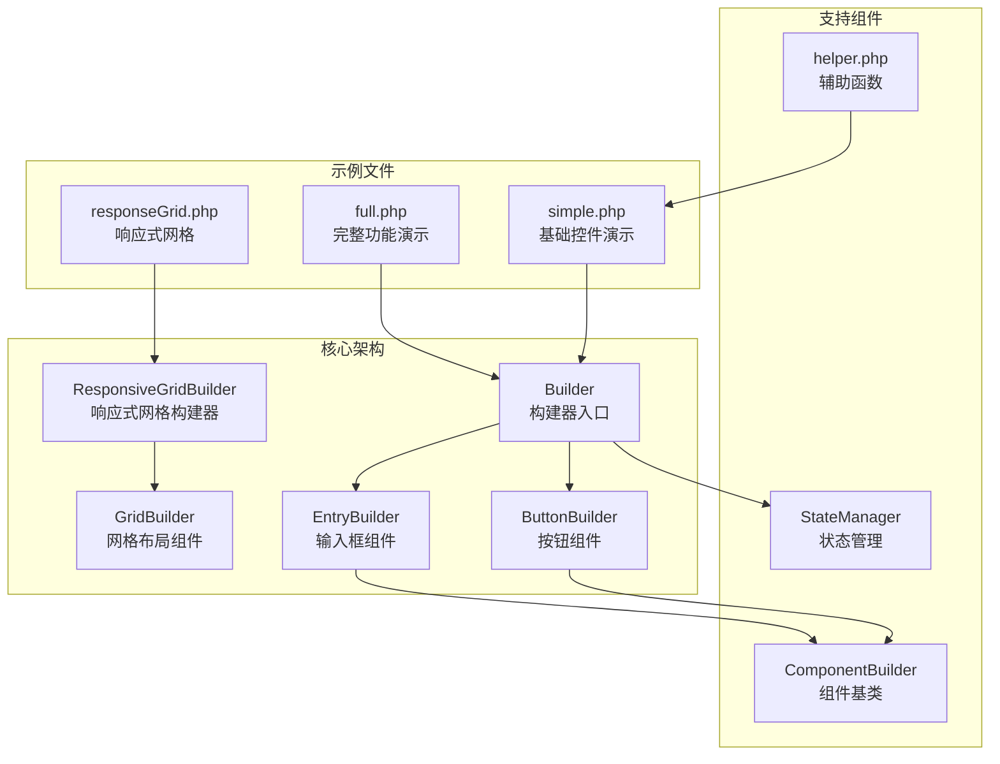

**图表来源**
- [Builder.php](file://src/Builder.php#L1-L153)
- [ResponsiveGridBuilder.php](file://src/ResponsiveGridBuilder.php#L1-L82)
- [GridBuilder.php](file://src/Components/GridBuilder.php#L1-L120)

## 简单示例分析 (simple.php)

simple.php 展示了基础控件的使用、事件处理、状态更新和组件引用等核心功能。

### 主要特性

#### 1. 基础窗口构建
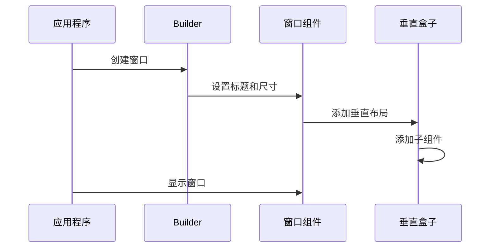

**图表来源**
- [simple.php](file://example/simple.php#L11-L140)

#### 2. 表单控件组合
示例展示了多种输入控件的组合使用：

| 控件类型 | 功能描述 | 关键配置 |
|---------|---------|---------|
| 单行输入框 | 用户姓名输入 | 验证、占位符、最大长度 |
| 密码输入框 | 安全密码输入 | 密码模式、最小长度验证 |
| 下拉选择框 | 性别选择 | 预设选项、选中回调 |
| 可编辑下拉框 | 爱好选择 | 可自定义选项 |

#### 3. 事件处理机制
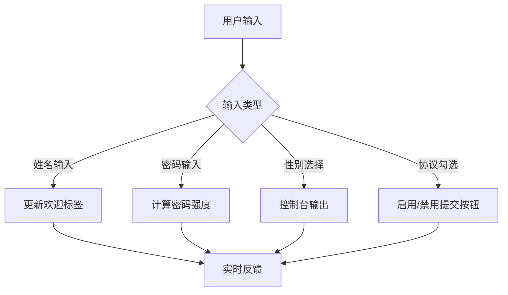

**图表来源**
- [simple.php](file://example/simple.php#L30-L82)

#### 4. 状态管理系统
示例展示了如何使用 StateManager 进行组件间通信：

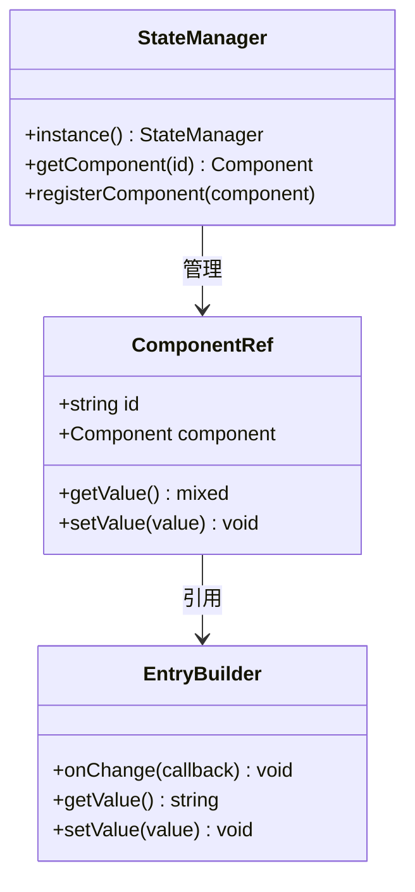

**图表来源**
- [simple.php](file://example/simple.php#L30-L82)

**章节来源**
- [simple.php](file://example/simple.php#L1-L142)

## 完整功能示例分析 (full.php)

full.php 展示了复杂的界面布局、多级容器嵌套和各种控件的综合应用。

### 界面布局架构

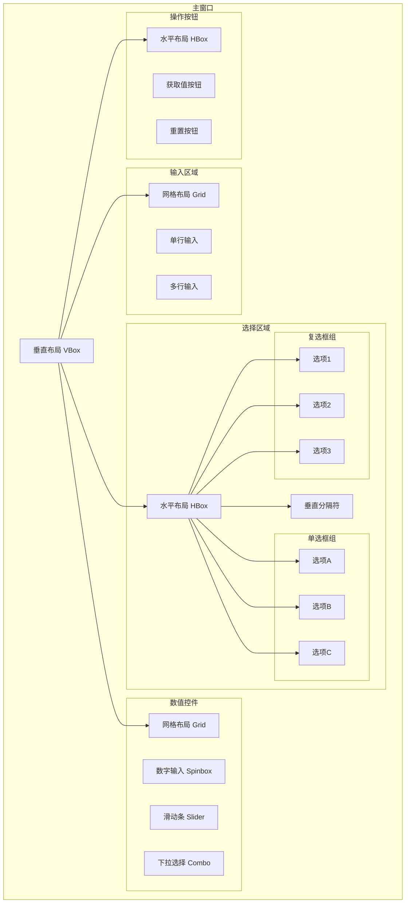

**图表来源**
- [full.php](file://example/full.php#L14-L179)

### 控件功能对比

| 控件类别 | 简单示例 | 完整示例 | 功能差异 |
|---------|---------|---------|---------|
| 输入控件 | 单行输入、密码输入 | 单行、多行、密码输入 | 多行输入支持换行 |
| 选择控件 | 下拉选择 | 复选框、单选框、下拉选择 | 更多样式选择 |
| 数值控件 | 无 | 数字输入框、滑动条 | 数值范围和交互 |
| 布局控件 | 分隔符 | 分隔符、网格布局 | 复杂布局组织 |

### 事件处理复杂度

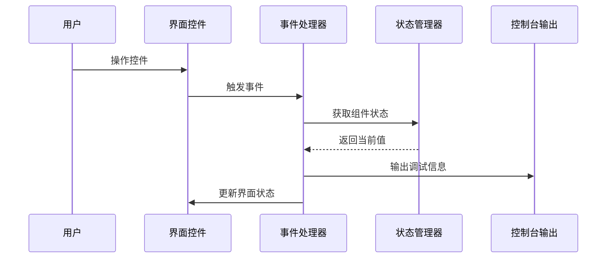

**图表来源**
- [full.php](file://example/full.php#L125-L176)

**章节来源**
- [full.php](file://example/full.php#L1-L180)

## 响应式网格示例分析 (responseGrid.php)

responseGrid.php 展示了响应式网格布局的实现方式和断点配置。

### 响应式网格架构

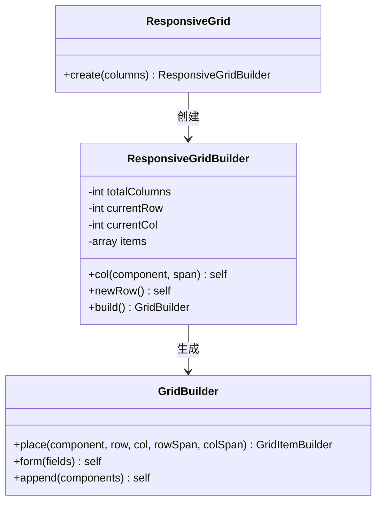

**图表来源**
- [ResponsiveGrid.php](file://src/Templates/ResponsiveGrid.php#L8-L13)
- [ResponsiveGridBuilder.php](file://src/ResponsiveGridBuilder.php#L7-L82)

### 网格布局算法

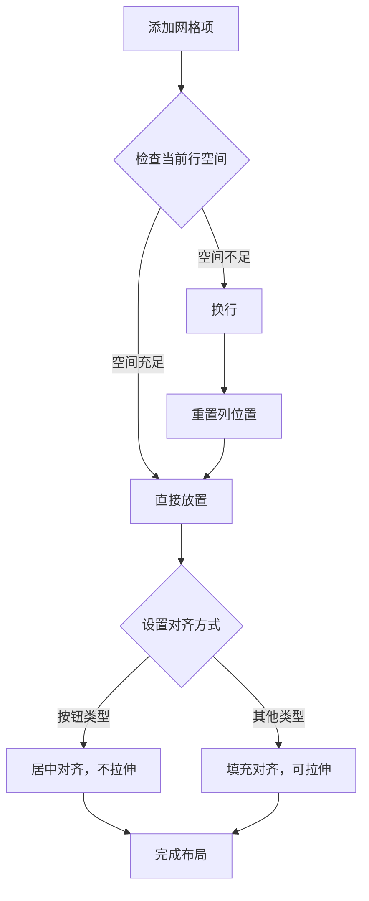

**图表来源**
- [ResponsiveGridBuilder.php](file://src/ResponsiveGridBuilder.php#L19-L43)

### 断点配置策略

| 网格列数 | 设计目标 | 适用场景 | 布局特点 |
|---------|---------|---------|---------|
| 12列网格 | 响应式设计标准 | 大多数应用 | 灵活的12列栅格系统 |
| 1/4宽度 | 移动端适配 | 小屏幕设备 | 紧凑的四分之一布局 |
| 全宽布局 | 桌面端显示 | 大屏幕设备 | 占满整个可用空间 |

**章节来源**
- [responseGrid.php](file://example/responseGrid.php#L1-L25)
- [ResponsiveGridBuilder.php](file://src/ResponsiveGridBuilder.php#L1-L82)

## 核心架构组件

### Builder 构建器系统

Builder 类提供了统一的组件创建入口，采用静态工厂方法模式：

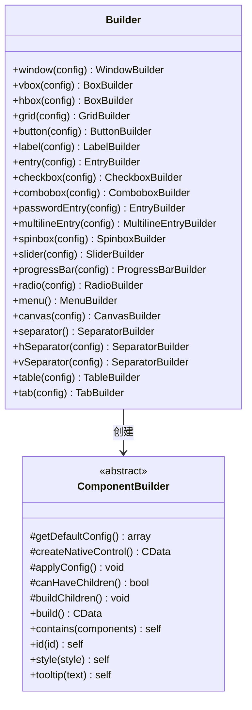

**图表来源**
- [Builder.php](file://src/Builder.php#L27-L152)

### 状态管理系统

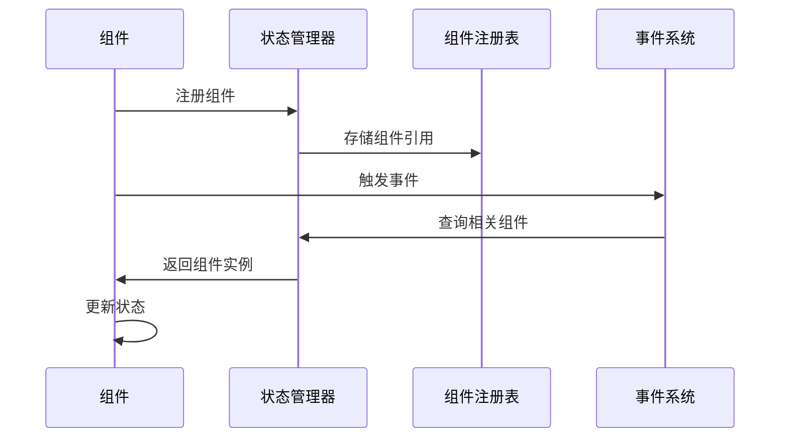

**图表来源**
- [simple.php](file://example/simple.php#L30-L82)

### 辅助函数系统

helper.php 提供了密码强度计算等实用函数：

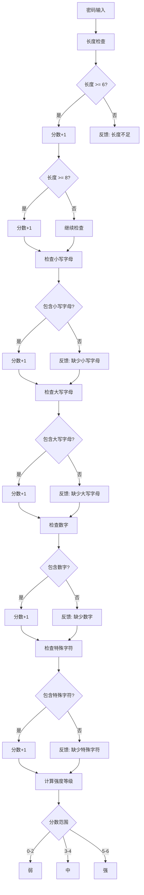

**图表来源**
- [helper.php](file://src/helper.php#L3-L58)

**章节来源**
- [Builder.php](file://src/Builder.php#L1-L153)
- [helper.php](file://src/helper.php#L1-L59)

## 最佳实践总结

### 1. 组件设计原则

- **单一职责**: 每个组件只负责一种特定的功能
- **链式调用**: 使用返回 $this 的方法支持流畅接口
- **配置驱动**: 通过配置数组控制组件行为
- **事件分离**: 将业务逻辑与界面更新分离

### 2. 状态管理策略

- **集中管理**: 使用 StateManager 统一管理所有组件状态
- **组件引用**: 通过 ID 系统建立组件间的引用关系
- **事件驱动**: 基于事件触发的状态更新机制
- **类型安全**: 通过类型提示确保参数正确性

### 3. 响应式设计模式

- **栅格系统**: 使用 12 列栅格系统提供灵活的布局方案
- **自动换行**: 智能的行溢出处理机制
- **对齐优化**: 根据控件类型自动调整对齐方式
- **弹性布局**: 支持不同屏幕尺寸的自适应布局

### 4. 代码组织规范

- **命名空间**: 使用清晰的命名空间结构
- **文件组织**: 按功能模块组织文件结构
- **注释规范**: 提供详细的代码注释和文档
- **错误处理**: 实现完善的错误处理机制

## 运行指导

### 环境要求

- PHP 8.0 或更高版本
- libui 扩展
- 相关依赖包

### 运行步骤

1. **安装依赖**
   ```bash
   composer install
   ```

2. **运行示例**
   ```bash
   php example/simple.php
   php example/full.php
   php example/responseGrid.php
   ```

### 开发建议

- **调试模式**: 启用详细错误报告进行开发调试
- **性能监控**: 使用内置的性能分析工具
- **测试覆盖**: 编写单元测试确保代码质量
- **文档维护**: 保持文档与代码同步更新

## 故障排除指南

### 常见问题及解决方案

| 问题类型 | 症状描述 | 可能原因 | 解决方案 |
|---------|---------|---------|---------|
| 界面无法显示 | 窗口创建失败 | libui 扩展未加载 | 检查扩展安装和配置 |
| 控件事件无效 | 点击无响应 | 事件绑定失败 | 检查回调函数定义 |
| 状态更新异常 | 数据不一致 | 状态管理器配置错误 | 验证组件 ID 和引用 |
| 布局错乱 | 控件位置异常 | 网格配置错误 | 检查列跨度和行间距设置 |

### 调试技巧

- **日志记录**: 启用详细的日志输出
- **断点调试**: 使用 IDE 断点调试功能
- **单元测试**: 编写针对性的单元测试
- **性能分析**: 使用性能分析工具识别瓶颈

通过深入分析这三个示例文件，开发者可以掌握 libuiBuilder 库的核心概念和最佳实践，为构建复杂的桌面应用程序奠定坚实基础。