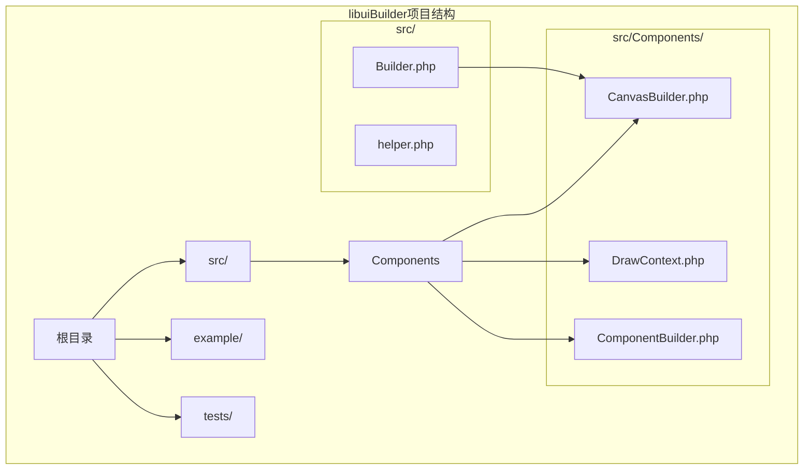
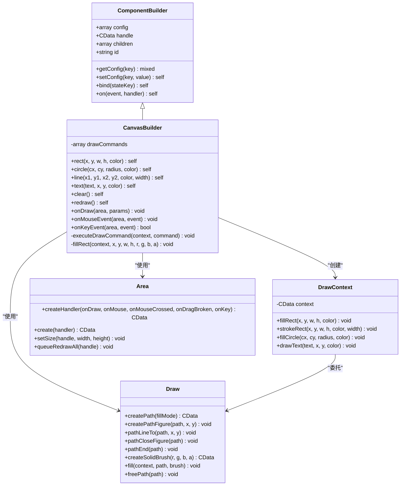
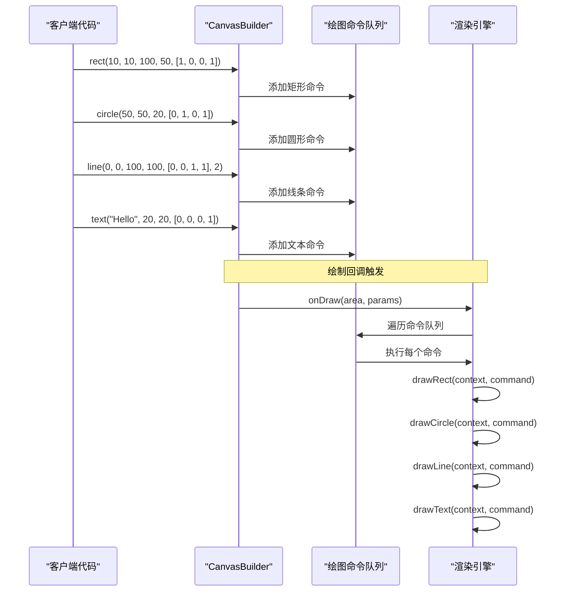
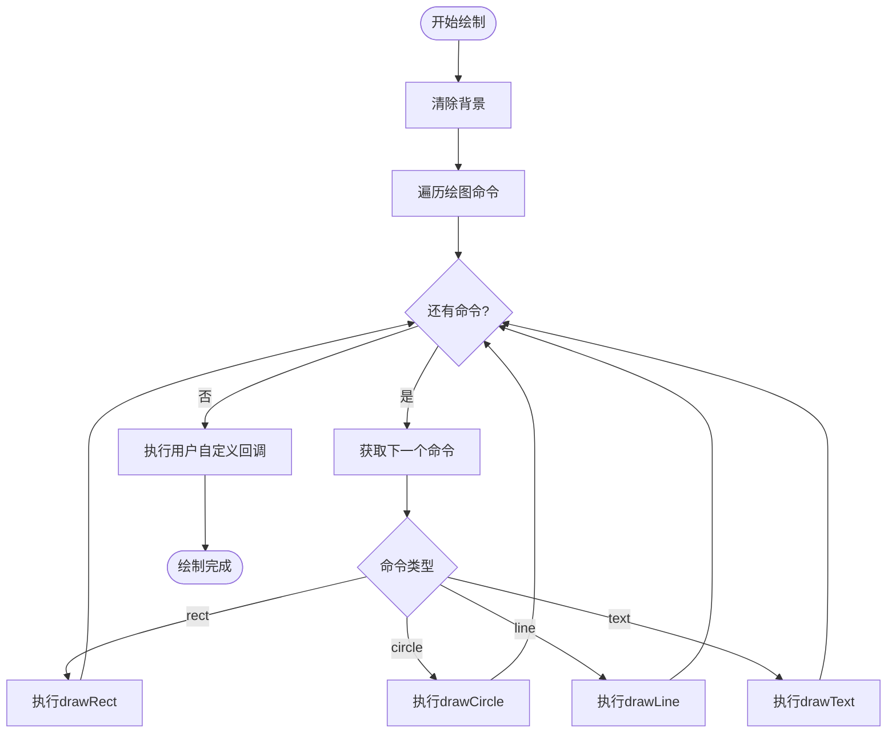
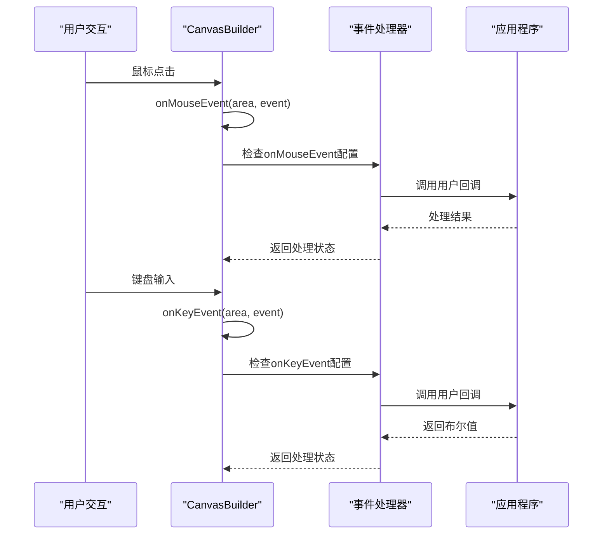

# CanvasBuilder深度技术文档

<cite>
**本文档中引用的文件**
- [CanvasBuilder.php](file://src/Components/CanvasBuilder.php)
- [DrawContext.php](file://src/Components/DrawContext.php)
- [ComponentBuilder.php](file://src/ComponentBuilder.php)
- [Builder.php](file://src/Builder.php)
- [calculator.php](file://example/calculator.php)
- [builder_helpers_demo.php](file://example/builder_helpers_demo.php)
</cite>

## 目录
1. [简介](#简介)
2. [项目结构](#项目结构)
3. [核心组件](#核心组件)
4. [架构概览](#架构概览)
5. [详细组件分析](#详细组件分析)
6. [依赖关系分析](#依赖关系分析)
7. [性能考虑](#性能考虑)
8. [故障排除指南](#故障排除指南)
9. [结论](#结论)

## 简介

CanvasBuilder是libuiBuilder框架中的一个强大组件，专门用于创建自定义绘图区域。它提供了丰富的链式API来绘制各种图形元素，包括矩形、圆形、线条和文本，并支持事件处理和自定义绘制回调。CanvasBuilder采用命令模式设计，通过指令队列实现高效的图形渲染。

## 项目结构

CanvasBuilder位于libuiBuilder项目的组件层次结构中，作为自定义绘图区域的核心实现：



**图表来源**
- [CanvasBuilder.php](file://src/Components/CanvasBuilder.php#L1-L181)
- [DrawContext.php](file://src/Components/DrawContext.php#L1-L35)
- [ComponentBuilder.php](file://src/ComponentBuilder.php#L1-L234)

**章节来源**
- [CanvasBuilder.php](file://src/Components/CanvasBuilder.php#L1-L181)
- [ComponentBuilder.php](file://src/ComponentBuilder.php#L1-L234)

## 核心组件

CanvasBuilder的核心功能围绕以下几个关键组件构建：

### CanvasBuilder类
CanvasBuilder是主要的绘图控制器，继承自ComponentBuilder，负责：
- 管理绘图命令队列
- 处理绘制回调和事件响应
- 提供链式API接口
- 协调底层绘图操作

### DrawContext类
DrawContext提供了一个更友好的绘制API包装器，封装了底层的绘图操作。

### 绘图命令系统
CanvasBuilder使用命令模式来管理绘图操作，每个绘图命令都被存储在数组中，在绘制回调中按顺序执行。

**章节来源**
- [CanvasBuilder.php](file://src/Components/CanvasBuilder.php#L10-L181)
- [DrawContext.php](file://src/Components/DrawContext.php#L1-L35)

## 架构概览

CanvasBuilder采用了分层架构设计，实现了清晰的关注点分离：



**图表来源**
- [CanvasBuilder.php](file://src/Components/CanvasBuilder.php#L10-L181)
- [DrawContext.php](file://src/Components/DrawContext.php#L7-L35)
- [ComponentBuilder.php](file://src/ComponentBuilder.php#L11-L234)

## 详细组件分析

### CanvasBuilder核心功能

#### 链式绘图API

CanvasBuilder提供了直观的链式API来创建各种图形元素：



**图表来源**
- [CanvasBuilder.php](file://src/Components/CanvasBuilder.php#L108-L146)
- [CanvasBuilder.php](file://src/Components/CanvasBuilder.php#L49-L70)

#### 绘图命令执行机制

CanvasBuilder使用命令模式来管理绘图操作，每个绘图命令都是一个包含类型和参数的数组：



**图表来源**
- [CanvasBuilder.php](file://src/Components/CanvasBuilder.php#L49-L70)
- [CanvasBuilder.php](file://src/Components/CanvasBuilder.php#L73-L88)

#### 事件处理系统

CanvasBuilder集成了完整的事件处理系统，支持鼠标和键盘事件：



**图表来源**
- [CanvasBuilder.php](file://src/Components/CanvasBuilder.php#L163-L175)
- [CanvasBuilder.php](file://src/Components/CanvasBuilder.php#L29-L34)

**章节来源**
- [CanvasBuilder.php](file://src/Components/CanvasBuilder.php#L108-L175)

### DrawContext类分析

DrawContext提供了更高层次的绘制API，封装了底层的绘图操作：

| 方法 | 参数 | 功能描述 |
|------|------|----------|
| `fillRect()` | `(float $x, float $y, float $w, float $h, array $color)` | 填充矩形区域 |
| `strokeRect()` | `(float $x, float $y, float $w, float $h, array $color, float $width)` | 描边矩形轮廓 |
| `fillCircle()` | `(float $cx, float $cy, float $radius, array $color)` | 填充圆形区域 |
| `drawText()` | `(string $text, float $x, float $y, array $color)` | 绘制文本 |

虽然DrawContext的实现目前是占位符，但它为未来的扩展提供了良好的接口设计。

**章节来源**
- [DrawContext.php](file://src/Components/DrawContext.php#L16-L34)

### 配置和初始化

CanvasBuilder提供了灵活的配置系统，支持以下配置选项：

| 配置项 | 类型 | 默认值 | 描述 |
|--------|------|--------|------|
| `width` | int | 400 | 画布宽度 |
| `height` | int | 300 | 画布高度 |
| `onDraw` | callable | null | 自定义绘制回调 |
| `onMouseEvent` | callable | null | 鼠标事件回调 |
| `onKeyEvent` | callable | null | 键盘事件回调 |
| `backgroundColor` | array | [1.0, 1.0, 1.0, 1.0] | 背景颜色(RGBA) |

**章节来源**
- [CanvasBuilder.php](file://src/Components/CanvasBuilder.php#L15-L23)

## 依赖关系分析

CanvasBuilder的依赖关系体现了清晰的分层架构：

```mermaid
graph LR
subgraph "外部依赖"
LibUI[libui库]
FFI[FFI扩展]
end
subgraph "内部依赖"
ComponentBuilder[ComponentBuilder基类]
Area[Area类]
Draw[Draw类]
end
subgraph "CanvasBuilder"
CanvasBuilder[CanvasBuilder类]
DrawContext[DrawContext类]
end
CanvasBuilder --> ComponentBuilder
CanvasBuilder --> Area
CanvasBuilder --> Draw
CanvasBuilder --> DrawContext
Area --> FFI
Draw --> FFI
ComponentBuilder --> FFI
LibUI --> FFI
```

**图表来源**
- [CanvasBuilder.php](file://src/Components/CanvasBuilder.php#L1-L10)
- [ComponentBuilder.php](file://src/ComponentBuilder.php#L1-L10)

**章节来源**
- [CanvasBuilder.php](file://src/Components/CanvasBuilder.php#L1-L10)
- [ComponentBuilder.php](file://src/ComponentBuilder.php#L1-L10)

## 性能考虑

### 绘制优化策略

1. **命令缓存**: CanvasBuilder使用命令队列缓存所有绘图操作，避免重复计算
2. **批量渲染**: 所有绘图命令在单次绘制回调中批量执行
3. **增量更新**: `redraw()`方法仅重新绘制受影响区域
4. **内存管理**: 及时释放绘图路径和画刷资源

### 性能最佳实践

- **避免在onDraw中执行耗时操作**: 绘制回调应该保持轻量级
- **合理使用clear()**: 仅在需要完全重绘时才调用clear()
- **优化命令数量**: 合并相似的绘图操作
- **控制事件频率**: 避免过于频繁的事件回调

### 内存管理

CanvasBuilder通过以下方式管理内存：
- 使用FFI的资源管理机制
- 在绘制完成后及时释放临时资源
- 利用PHP的垃圾回收机制

## 故障排除指南

### 常见问题及解决方案

#### 绘制不显示
**问题**: CanvasBuilder创建后没有显示任何内容
**解决方案**: 
- 检查CanvasBuilder是否正确添加到窗口中
- 验证onDraw回调是否正确定义
- 确认画布尺寸设置正确

#### 性能问题
**问题**: 绘制操作过于缓慢
**解决方案**:
- 减少绘图命令的数量
- 避免在onDraw中执行复杂计算
- 使用适当的缓存策略

#### 事件无响应
**问题**: 鼠标或键盘事件没有触发
**解决方案**:
- 检查事件处理器是否正确注册
- 验证事件回调函数的签名
- 确认CanvasBuilder具有焦点

**章节来源**
- [CanvasBuilder.php](file://src/Components/CanvasBuilder.php#L49-L70)
- [CanvasBuilder.php](file://src/Components/CanvasBuilder.php#L163-L175)

## 结论

CanvasBuilder是一个功能强大且设计精良的自定义绘图组件，它通过以下特性为开发者提供了优秀的绘图体验：

1. **链式API设计**: 直观易用的绘图接口
2. **命令模式实现**: 高效的绘图命令管理
3. **事件系统集成**: 完整的用户交互支持
4. **性能优化**: 通过命令缓存和批量渲染提升性能
5. **扩展性良好**: 清晰的架构便于功能扩展

CanvasBuilder特别适合需要自定义图形界面的应用场景，如数据可视化、游戏开发、图像编辑器等。其模块化的设计使得开发者可以轻松地集成到现有的libuiBuilder项目中，同时保持代码的可维护性和可扩展性。

通过合理的使用CanvasBuilder，开发者可以创建出既美观又高性能的图形用户界面，充分发挥PHP在桌面应用开发中的潜力。