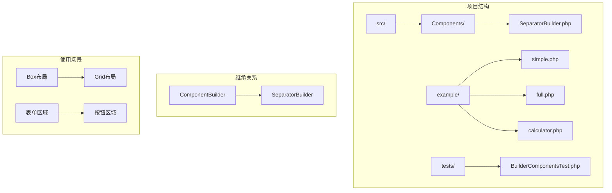
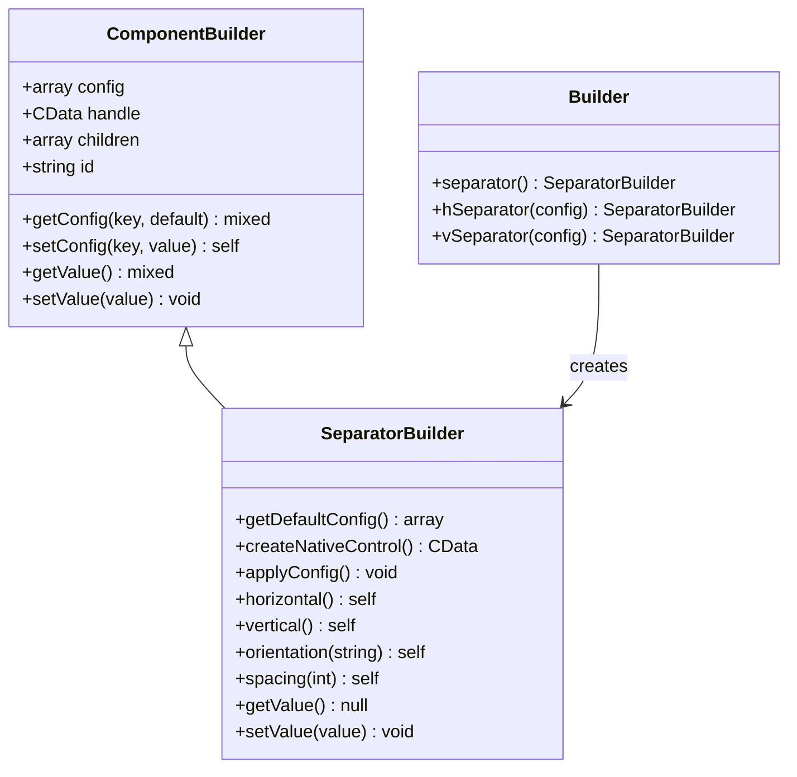
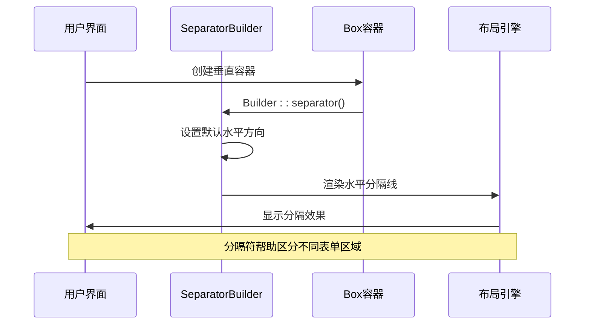
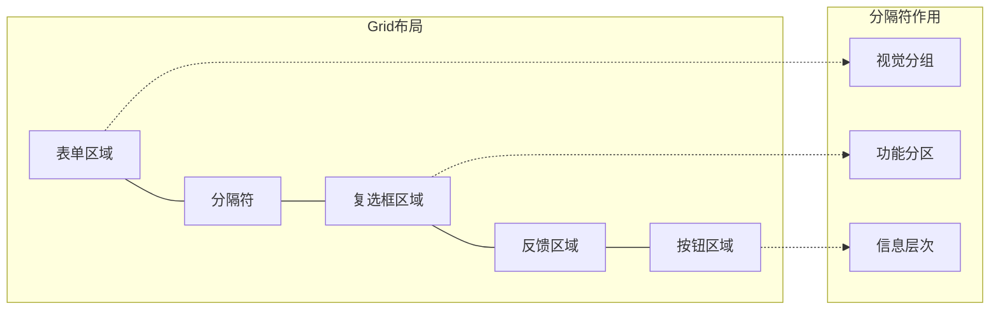
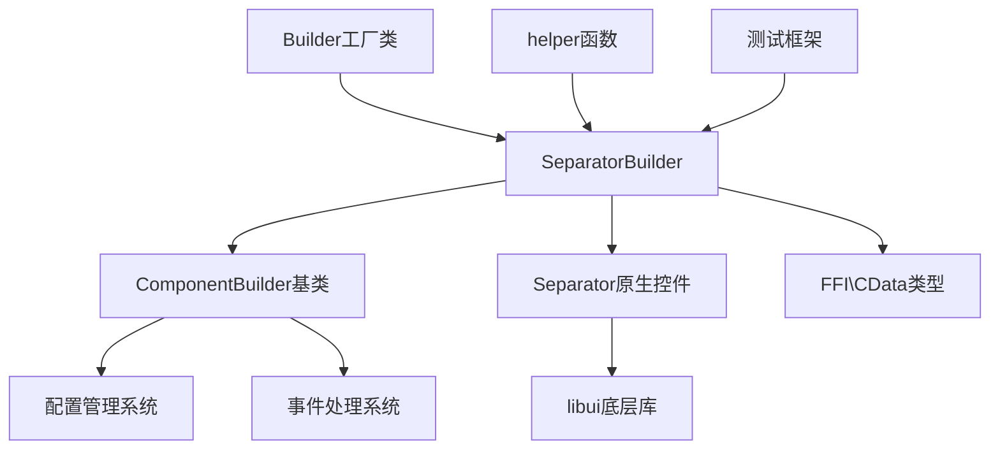

# SeparatorBuilder 详细文档

<cite>
**本文档中引用的文件**
- [SeparatorBuilder.php](file://src/Components/SeparatorBuilder.php)
- [simple.php](file://example/simple.php)
- [full.php](file://example/full.php)
- [calculator.php](file://example/calculator.php)
- [Builder.php](file://src/Builder.php)
- [helper.php](file://src/helper.php)
- [ComponentBuilder.php](file://src/ComponentBuilder.php)
- [BuilderComponentsTest.php](file://tests/BuilderComponentsTest.php)
</cite>

## 目录
1. [简介](#简介)
2. [项目结构](#项目结构)
3. [核心组件](#核心组件)
4. [架构概览](#架构概览)
5. [详细组件分析](#详细组件分析)
6. [依赖关系分析](#依赖关系分析)
7. [性能考虑](#性能考虑)
8. [故障排除指南](#故障排除指南)
9. [结论](#结论)

## 简介

SeparatorBuilder是libuiBuilder框架中的一个专门用于创建视觉分隔元素的构建器类。它作为UI布局中的重要装饰性组件，提供水平和垂直两种方向的分隔线，帮助开发者在复杂的界面中清晰地划分不同功能区域，提升用户体验和界面美观度。

该控件具有以下特点：
- **轻量级设计**：无状态、无数据绑定，专注于界面美化
- **链式配置**：支持流畅的配置方法调用
- **灵活方向**：可配置水平或垂直方向
- **简单易用**：无需值状态，直接用于布局分隔

## 项目结构

SeparatorBuilder位于项目的组件层次结构中，作为基础UI控件的一部分：



**图表来源**
- [SeparatorBuilder.php](file://src/Components/SeparatorBuilder.php#L1-L65)
- [ComponentBuilder.php](file://src/ComponentBuilder.php#L1-L50)

**章节来源**
- [SeparatorBuilder.php](file://src/Components/SeparatorBuilder.php#L1-L65)
- [Builder.php](file://src/Builder.php#L133-L148)

## 核心组件

SeparatorBuilder的核心功能围绕以下几个方面展开：

### 默认配置
- **orientation**: 默认为'horizontal'（水平），可设置为'vertical'（垂直）
- **spacing**: 默认为0，表示额外间距

### 核心方法
- `horizontal()`: 设置水平方向的分隔符
- `vertical()`: 设置垂直方向的分隔符  
- `orientation(string)`: 自定义方向设置
- `spacing(int)`: 设置额外间距

### 特殊设计
- 不支持数据绑定，无值状态
- 接口一致性保留getValue/setValue方法
- 通过父容器的padding控制间距

**章节来源**
- [SeparatorBuilder.php](file://src/Components/SeparatorBuilder.php#L11-L64)

## 架构概览

SeparatorBuilder采用典型的构建器模式，继承自ComponentBuilder基类，提供链式配置和统一的接口：



**图表来源**
- [ComponentBuilder.php](file://src/ComponentBuilder.php#L11-L234)
- [SeparatorBuilder.php](file://src/Components/SeparatorBuilder.php#L9-L65)
- [Builder.php](file://src/Builder.php#L133-L148)

## 详细组件分析

### 分隔符方向配置

SeparatorBuilder提供了多种方式来配置分隔符的方向：

#### 基本方向设置
```mermaid
flowchart TD
A[创建分隔符] --> B{选择方向}
B --> |horizontal()| C[水平分隔符]
B --> |vertical()| D[垂直分隔符]
B --> |orientation()| E[自定义方向]
C --> F[Separator::createHorizontal]
D --> G[Separator::createVertical]
E --> H{方向参数}
H --> |horizontal| F
H --> |vertical| G
F --> I[渲染到界面]
G --> I
```

**图表来源**
- [SeparatorBuilder.php](file://src/Components/SeparatorBuilder.php#L46-L64)

#### 方向配置方法对比

| 方法 | 参数 | 返回值 | 使用场景 |
|------|------|--------|----------|
| `horizontal()` | 无 | `static` | 明确指定水平分隔符 |
| `vertical()` | 无 | `static` | 明确指定垂直分隔符 |
| `orientation(string)` | 'horizontal'/'vertical' | `static` | 动态设置方向 |
| 默认配置 | 'horizontal' | - | 未设置时的默认行为 |

**章节来源**
- [SeparatorBuilder.php](file://src/Components/SeparatorBuilder.php#L46-L64)

### 在布局中的实际应用

#### Box布局中的分隔符使用

在简单的表单布局中，分隔符常用于：



**图表来源**
- [simple.php](file://example/simple.php#L19-L20)
- [simple.php](file://example/simple.php#L87-L88)

#### Grid布局中的分隔符应用

在复杂的网格布局中，分隔符可以：



**图表来源**
- [simple.php](file://example/simple.php#L21-L89)
- [full.php](file://example/full.php#L55-L86)

**章节来源**
- [simple.php](file://example/simple.php#L19-L96)
- [full.php](file://example/full.php#L55-L120)

### 分隔符的轻量级特性

SeparatorBuilder的设计体现了轻量级原则：

#### 无状态设计
- 不维护任何内部状态
- 无需getValue/setValue操作
- 仅作为视觉装饰元素存在

#### 性能优化
- 原生控件创建开销小
- 不参与数据绑定机制
- 内存占用极低

#### 最佳实践位置
- 在逻辑相关的控件组之间
- 在功能不同的区域边界
- 在视觉上需要区分的元素间

**章节来源**
- [SeparatorBuilder.php](file://src/Components/SeparatorBuilder.php#L34-L43)

## 依赖关系分析

SeparatorBuilder的依赖关系相对简单，主要依赖于：



**图表来源**
- [SeparatorBuilder.php](file://src/Components/SeparatorBuilder.php#L5-L8)
- [ComponentBuilder.php](file://src/ComponentBuilder.php#L1-L50)

**章节来源**
- [SeparatorBuilder.php](file://src/Components/SeparatorBuilder.php#L1-L65)
- [ComponentBuilder.php](file://src/ComponentBuilder.php#L1-L234)

## 性能考虑

SeparatorBuilder作为轻量级组件，在性能方面具有以下优势：

### 内存效率
- 无内部状态存储
- 最小化的对象实例化开销
- 与原生控件直接映射

### 渲染性能
- 原生控件渲染速度快
- 不涉及复杂的计算逻辑
- 适合大量使用场景

### 最佳实践建议
- 在复杂界面中适度使用
- 避免过度分割导致视觉混乱
- 结合间距设置获得最佳效果

## 故障排除指南

### 常见问题及解决方案

#### 分隔符不显示
**原因**: 方向配置错误或容器尺寸不足
**解决**: 检查orientation配置，确保容器有足够的空间

#### 间距设置无效
**原因**: spacing配置不生效
**解决**: 间距通过父容器的padding控制，检查容器配置

#### 类型错误
**原因**: 错误地尝试设置值
**解决**: SeparatorBuilder不支持setValue操作，保持null返回

**章节来源**
- [SeparatorBuilder.php](file://src/Components/SeparatorBuilder.php#L34-L43)

## 结论

SeparatorBuilder是libuiBuilder框架中一个精心设计的轻量级UI组件，它通过简洁的API和灵活的配置选项，为开发者提供了强大的界面分隔能力。其无状态设计和链式配置方法使其成为复杂界面布局中的理想选择。

### 主要优势
- **简单易用**: 直观的API设计，易于理解和使用
- **轻量高效**: 最小化资源占用，高性能渲染
- **灵活配置**: 支持多种方向和间距设置
- **集成良好**: 与现有布局系统无缝集成

### 使用建议
- 在需要视觉分隔的界面区域使用
- 结合适当的间距设置获得最佳效果
- 在复杂布局中适度使用，避免过度分割
- 利用链式配置提高代码可读性

SeparatorBuilder虽然看似简单，但在提升界面美观度和用户体验方面发挥着重要作用，是现代GUI应用程序界面设计中不可或缺的组成部分。