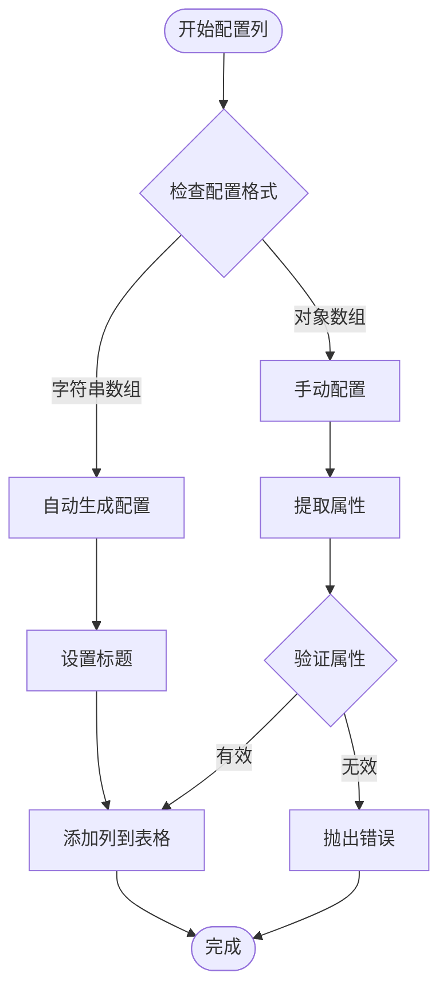

# TableBuilder 技术文档

<cite>
**本文档中引用的文件**
- [TableBuilder.php](file://src/Components/TableBuilder.php)
- [ComponentBuilder.php](file://src/ComponentBuilder.php)
- [Builder.php](file://src/Builder.php)
- [calculator.php](file://example/calculator.php)
- [BuilderComponentsTest.php](file://tests/BuilderComponentsTest.php)
</cite>

## 目录
1. [简介](#简介)
2. [项目结构](#项目结构)
3. [核心组件](#核心组件)
4. [架构概览](#架构概览)
5. [详细组件分析](#详细组件分析)
6. [依赖关系分析](#依赖关系分析)
7. [性能考虑](#性能考虑)
8. [故障排除指南](#故障排除指南)
9. [结论](#结论)

## 简介

TableBuilder是libuiBuilder框架中的一个强大组件，专门用于创建数据驱动的表格界面。它提供了丰富的配置选项，支持多种列类型（text、image、checkbox、progress、button），具备数据绑定、可编辑性、排序和选择模式等功能。该组件采用链式调用设计，提供了直观易用的API接口。

## 项目结构

TableBuilder位于libuiBuilder项目的组件层次结构中，作为UI构建系统的一部分：

**图表来源**
- [Builder.php](file://src/Builder.php#L119-L122)
- [TableBuilder.php](file://src/Components/TableBuilder.php#L10-L15)

**章节来源**
- [TableBuilder.php](file://src/Components/TableBuilder.php#L1-L154)
- [Builder.php](file://src/Builder.php#L119-L122)

## 核心组件

TableBuilder的核心功能围绕以下几个关键组件展开：

### 配置管理系统
TableBuilder继承自ComponentBuilder，拥有完整的配置管理系统，支持链式调用和动态配置。

### 数据绑定层
通过getCellValue和setCellValue回调函数实现双向数据绑定，支持多种数据类型的自动转换。

### 列类型系统
内置多种列类型处理器，包括文本、图像、复选框、进度条和按钮列。

### 事件处理机制
提供行选择和单元格变更事件的回调处理机制。

**章节来源**
- [TableBuilder.php](file://src/Components/TableBuilder.php#L12-L26)
- [TableBuilder.php](file://src/Components/TableBuilder.php#L95-L132)

## 架构概览

TableBuilder采用分层架构设计，从上到下包括：

**图表来源**
- [TableBuilder.php](file://src/Components/TableBuilder.php#L134-L154)
- [TableBuilder.php](file://src/Components/TableBuilder.php#L29-L49)

## 详细组件分析

### 核心配置方法

#### columns() 方法
columns()方法用于定义表格的列结构，支持两种配置方式：

**图表来源**
- [TableBuilder.php](file://src/Components/TableBuilder.php#L55-L58)
- [TableBuilder.php](file://src/Components/TableBuilder.php#L70-L92)

#### data() 方法
data()方法负责设置表格的数据源，支持二维数组格式：

| 数据类型 | 处理方式 | 支持的PHP类型 |
|---------|---------|--------------|
| 字符串 | 直接存储 | string |
| 整数 | 类型转换 | int |
| 布尔值 | 转换为0/1 | bool |
| 其他类型 | 强制转换为字符串 | mixed |

**章节来源**
- [TableBuilder.php](file://src/Components/TableBuilder.php#L140-L143)
- [TableBuilder.php](file://src/Components/TableBuilder.php#L140-L143)

#### onRowSelected() 方法
onRowSelected()方法提供行选择事件的回调处理：

**图表来源**
- [TableBuilder.php](file://src/Components/TableBuilder.php#L145-L148)

#### editable() 方法
editable()方法控制表格的编辑能力：

| 编辑模式 | 功能描述 | 可编辑列 |
|---------|---------|---------|
| true | 启用编辑功能 | 文本列、复选框列、按钮列 |
| false | 只读模式 | 所有列均为只读 |

**章节来源**
- [TableBuilder.php](file://src/Components/TableBuilder.php#L150-L153)

### 列类型系统

TableBuilder支持五种内置列类型，每种类型都有特定的渲染和交互行为：

**图表来源**
- [TableBuilder.php](file://src/Components/TableBuilder.php#L76-L91)

### 数据绑定机制

#### getCellValue回调
getCellValue方法实现了从数据源到表格的单向数据流：

**图表来源**
- [TableBuilder.php](file://src/Components/TableBuilder.php#L95-L113)

#### setCellValue回调
setCellValue方法实现了从表格到数据源的双向数据流：

**图表来源**
- [TableBuilder.php](file://src/Components/TableBuilder.php#L115-L132)

### 高级特性

#### sortable属性
sortable属性控制表格是否支持列排序功能，默认启用。当启用时，点击列标题会触发排序操作。

#### selectionMode属性
selectionMode属性定义表格的选择行为：
- `'single'`: 单选模式（默认）
- `'multiple'`: 多选模式  
- `'none'`: 禁用选择

#### stretchy属性
stretchy属性控制表格是否自动调整大小以填充可用空间。

**章节来源**
- [TableBuilder.php](file://src/Components/TableBuilder.php#L18-L26)

**章节来源**
- [TableBuilder.php](file://src/Components/TableBuilder.php#L134-L154)

## 依赖关系分析

TableBuilder的依赖关系体现了清晰的分层架构：

**图表来源**
- [TableBuilder.php](file://src/Components/TableBuilder.php#L3-L9)
- [ComponentBuilder.php](file://src/ComponentBuilder.php#L1-L20)

**章节来源**
- [TableBuilder.php](file://src/Components/TableBuilder.php#L1-L10)
- [ComponentBuilder.php](file://src/ComponentBuilder.php#L1-L20)

## 性能考虑

### 大数据量处理
对于大数据量的表格展示，建议考虑以下优化策略：

1. **虚拟滚动**: 当数据量超过一定阈值时，启用虚拟滚动减少内存占用
2. **分页加载**: 对于超大数据集，实现分页或懒加载机制
3. **数据缓存**: 缓存频繁访问的数据，避免重复计算
4. **异步更新**: 使用异步方式更新大量数据，避免界面卡顿

### 内存管理
- 及时释放不再使用的表格实例
- 避免在回调函数中创建大量临时对象
- 合理设置数据源大小，避免内存溢出

### 渲染优化
- 减少不必要的列类型切换
- 优化数据绑定频率
- 使用批量更新而非逐行更新

## 故障排除指南

### 常见问题及解决方案

#### 表格无法显示数据
**症状**: 表格创建成功但不显示任何数据
**可能原因**: 
- 数据源为空或格式不正确
- 列配置与数据结构不匹配

**解决方案**:
- 检查data()方法传入的数据格式
- 验证columns()配置是否正确

#### 编辑功能不工作
**症状**: 表格显示正常但无法编辑单元格
**可能原因**:
- editable()设置为false
- 列配置中设置了不可编辑

**解决方案**:
- 确保调用了editable(true)
- 检查列配置中的editable属性

#### 性能问题
**症状**: 大数据量下表格响应缓慢
**可能原因**:
- 数据量过大
- 频繁的事件触发

**解决方案**:
- 实现虚拟滚动
- 减少事件监听频率
- 优化数据结构

**章节来源**
- [TableBuilder.php](file://src/Components/TableBuilder.php#L95-L132)

## 结论

TableBuilder是一个功能完备且设计精良的表格组件，它成功地将复杂的表格功能封装在简洁的API之下。通过链式调用的设计模式，开发者可以快速构建各种类型的表格界面。其强大的数据绑定能力和丰富的列类型支持，使得TableBuilder能够满足从简单数据显示到复杂交互应用的各种需求。

组件的模块化设计和清晰的职责分离，为未来的功能扩展和维护提供了良好的基础。配合libuiBuilder框架的整体架构，TableBuilder成为了构建现代桌面应用程序的重要工具之一。