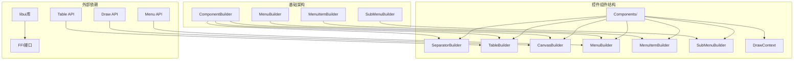
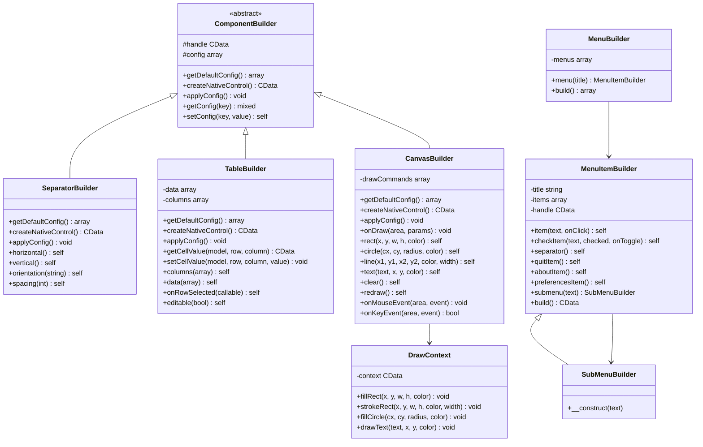
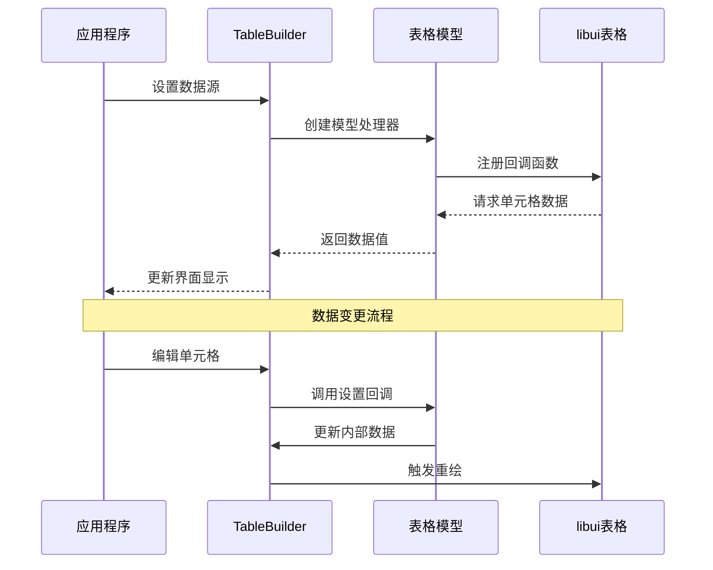
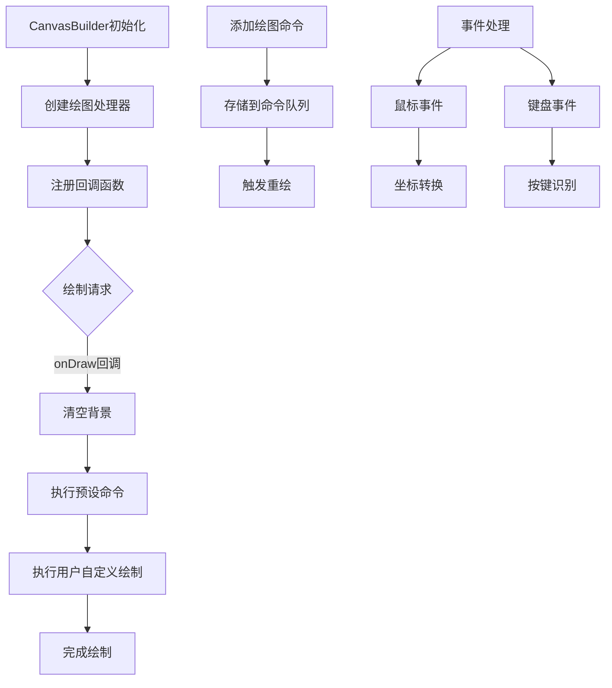
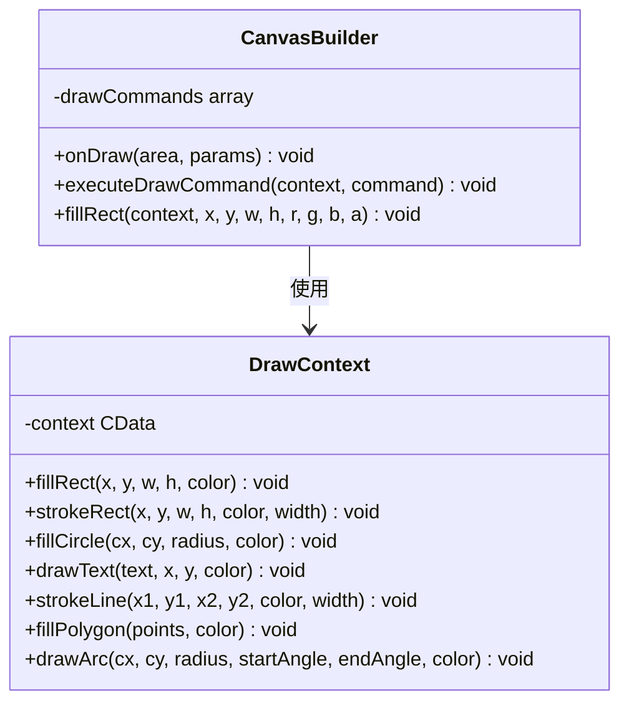
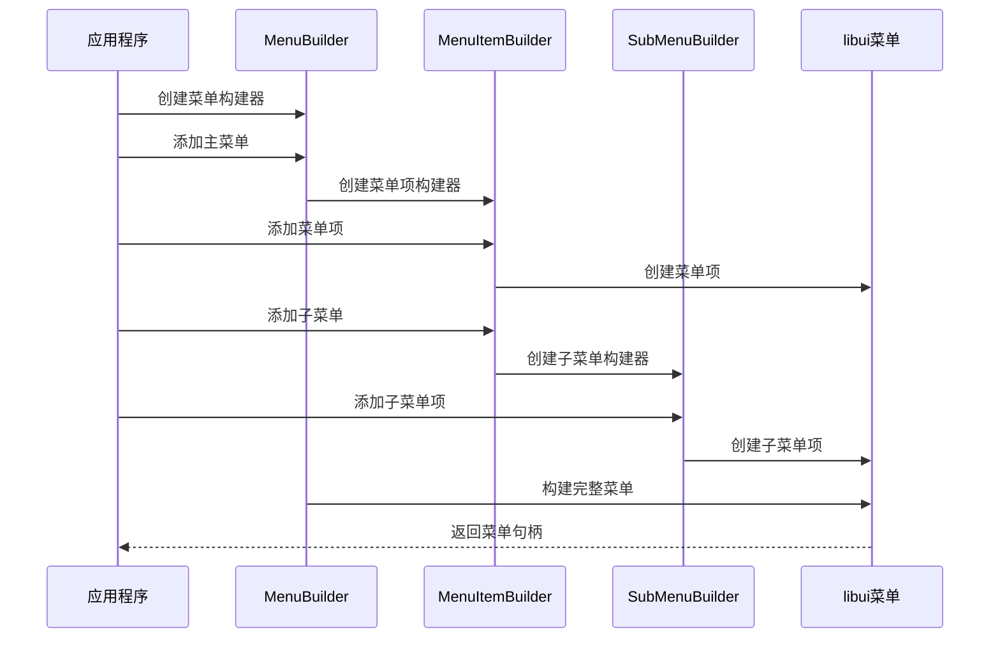
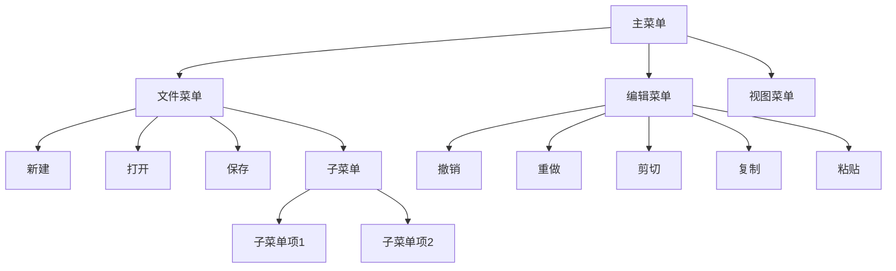
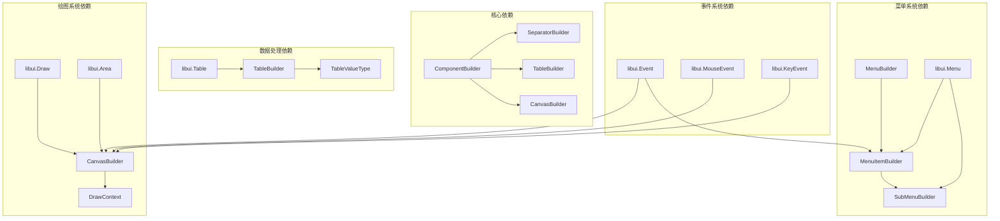

# 其他控件

<cite>
**本文档中引用的文件**
- [SeparatorBuilder.php](file://src/Components/SeparatorBuilder.php)
- [TableBuilder.php](file://src/Components/TableBuilder.php)
- [CanvasBuilder.php](file://src/Components/CanvasBuilder.php)
- [MenuBuilder.php](file://src/Components/MenuBuilder.php)
- [MenuItemBuilder.php](file://src/Components/MenuItemBuilder.php)
- [SubMenuBuilder.php](file://src/Components/SubMenuBuilder.php)
- [DrawContext.php](file://src/Components/DrawContext.php)
- [calculator.php](file://example/calculator.php)
- [BuilderComponentsTest.php](file://tests/BuilderComponentsTest.php)
</cite>

## 目录
1. [简介](#简介)
2. [项目结构](#项目结构)
3. [核心组件](#核心组件)
4. [架构概览](#架构概览)
5. [详细组件分析](#详细组件分析)
6. [依赖关系分析](#依赖关系分析)
7. [性能考虑](#性能考虑)
8. [故障排除指南](#故障排除指南)
9. [结论](#结论)

## 简介

libuiBuilder是一个基于PHP的GUI应用程序开发框架，提供了丰富的控件系统来构建复杂的桌面应用程序界面。本文档重点介绍框架中的高级控件，包括分隔符控件（SeparatorBuilder）、表格控件（TableBuilder）、画布控件（CanvasBuilder）以及菜单相关组件（MenuBuilder、MenuItemBuilder、SubMenuBuilder）。这些控件构成了现代GUI应用程序的核心功能模块，支持复杂的数据展示、自定义绘图和交互式用户界面。

## 项目结构

libuiBuilder采用模块化的架构设计，将不同类型的控件组织在相应的命名空间中：

**图表来源**
- [SeparatorBuilder.php](file://src/Components/SeparatorBuilder.php#L1-L65)
- [TableBuilder.php](file://src/Components/TableBuilder.php#L1-L154)
- [CanvasBuilder.php](file://src/Components/CanvasBuilder.php#L1-L181)

**章节来源**
- [SeparatorBuilder.php](file://src/Components/SeparatorBuilder.php#L1-L65)
- [TableBuilder.php](file://src/Components/TableBuilder.php#L1-L154)
- [CanvasBuilder.php](file://src/Components/CanvasBuilder.php#L1-L181)

## 核心组件

libuiBuilder的其他控件系统包含以下核心组件：

### 分隔符控件（SeparatorBuilder）
- **功能定位**：用于在布局中创建视觉分隔线
- **支持方向**：水平（horizontal）和垂直（vertical）
- **配置选项**：方向设置和额外间距控制
- **应用场景**：界面元素间的逻辑分组和视觉引导

### 表格控件（TableBuilder）
- **数据绑定**：支持二维数组数据源
- **列类型**：文本、图像、复选框、进度条、按钮等
- **交互功能**：行选择、单元格编辑、排序支持
- **事件处理**：行选择事件和单元格变更事件

### 画布控件（CanvasBuilder）
- **自定义绘图**：支持矩形、圆形、线条、文本绘制
- **绘图上下文**：提供DrawContext进行高级绘图操作
- **事件响应**：鼠标事件、键盘事件处理
- **性能优化**：支持命令队列和增量更新

### 菜单系统（MenuBuilder系列）
- **层次结构**：支持多级菜单嵌套
- **菜单项类型**：普通项、检查项、分隔符、特殊系统项
- **事件绑定**：点击事件和状态切换事件
- **系统集成**：退出、关于、首选项等系统菜单项

**章节来源**
- [SeparatorBuilder.php](file://src/Components/SeparatorBuilder.php#L11-L65)
- [TableBuilder.php](file://src/Components/TableBuilder.php#L15-L154)
- [CanvasBuilder.php](file://src/Components/CanvasBuilder.php#L15-L181)
- [MenuBuilder.php](file://src/Components/MenuBuilder.php#L10-L29)

## 架构概览

这些高级控件遵循统一的架构模式，通过ComponentBuilder基类提供通用的功能框架：

**图表来源**
- [SeparatorBuilder.php](file://src/Components/SeparatorBuilder.php#L9-L65)
- [TableBuilder.php](file://src/Components/TableBuilder.php#L10-L154)
- [CanvasBuilder.php](file://src/Components/CanvasBuilder.php#L11-L181)
- [MenuBuilder.php](file://src/Components/MenuBuilder.php#L10-L29)
- [MenuItemBuilder.php](file://src/Components/MenuItemBuilder.php#L10-L126)
- [SubMenuBuilder.php](file://src/Components/SubMenuBuilder.php#L5-L14)
- [DrawContext.php](file://src/Components/DrawContext.php#L7-L35)

## 详细组件分析

### SeparatorBuilder - 布局分隔控件

SeparatorBuilder专门负责在界面布局中创建视觉分隔效果，是构建清晰界面层次的重要工具。

#### 核心特性
- **方向控制**：支持水平和垂直两种分隔方向
- **配置灵活性**：可通过spacing参数调整额外间距
- **接口一致性**：提供链式调用方法保持与其他控件的一致性

#### 使用场景
- 在按钮组之间创建视觉间隔
- 区分不同的功能区域
- 引导用户的视线流动
- 创建表单字段间的逻辑分组

#### 实现原理
分隔符控件通过libui的原生分隔符API创建，根据配置的方向参数选择创建水平或垂直分隔符。由于分隔符本质上是装饰性元素，不涉及复杂的状态管理，因此其实现相对简单而高效。

**章节来源**
- [SeparatorBuilder.php](file://src/Components/SeparatorBuilder.php#L11-L65)

### TableBuilder - 数据表格控件

TableBuilder提供了强大的表格数据展示和编辑功能，支持多种列类型和丰富的交互特性。

#### 数据绑定架构

**图表来源**
- [TableBuilder.php](file://src/Components/TableBuilder.php#L29-L49)
- [TableBuilder.php](file://src/Components/TableBuilder.php#L95-L132)

#### 列类型支持
| 列类型 | 描述 | 用途 | 编辑支持 |
|--------|------|------|----------|
| text | 文本列 | 显示字符串数据 | 是 |
| image | 图像列 | 显示图标或图片 | 否 |
| checkbox | 复选框列 | 布尔值选择 | 是 |
| progress | 进度条列 | 数值范围显示 | 否 |
| button | 按钮列 | 可点击操作 | 是 |

#### 事件处理机制
- **行选择事件**：当用户选择表格中的某一行时触发
- **单元格变更事件**：当编辑可编辑单元格时触发
- **排序功能**：支持列标题点击进行升序/降序排序

#### 性能优化策略
- **延迟加载**：只在需要时才创建表格模型
- **回调机制**：通过回调函数动态获取数据，避免内存占用过大
- **增量更新**：只更新发生变化的单元格

**章节来源**
- [TableBuilder.php](file://src/Components/TableBuilder.php#L15-L154)

### CanvasBuilder - 自定义绘图控件

CanvasBuilder是最复杂的控件之一，提供了完整的2D绘图能力，支持从简单的几何图形到复杂的自定义绘图。

#### 绘图命令系统

**图表来源**
- [CanvasBuilder.php](file://src/Components/CanvasBuilder.php#L49-L71)
- [CanvasBuilder.php](file://src/Components/CanvasBuilder.php#L73-L89)

#### 绘图API设计
CanvasBuilder提供了简洁的链式API，支持多种基本图形的绘制：

- **矩形绘制**：`rect(x, y, width, height, color)`
- **圆形绘制**：`circle(centerX, centerY, radius, color)`
- **线条绘制**：`line(x1, y1, x2, y2, color, width)`
- **文本绘制**：`text(content, x, y, color)`

#### DrawContext高级功能
DrawContext作为CanvasBuilder的扩展，提供了更高级的绘图API：

**图表来源**
- [DrawContext.php](file://src/Components/DrawContext.php#L7-L35)
- [CanvasBuilder.php](file://src/Components/CanvasBuilder.php#L91-L105)

#### 事件处理系统
CanvasBuilder支持完整的事件处理机制：
- **鼠标事件**：点击、移动、拖拽、滚轮
- **键盘事件**：按键按下、释放、字符输入
- **焦点管理**：获得焦点、失去焦点

#### 性能考虑
- **命令缓存**：将绘制命令存储在队列中，支持批量处理
- **增量更新**：只重绘发生变化的部分
- **事件节流**：对高频事件进行适当的节流处理

**章节来源**
- [CanvasBuilder.php](file://src/Components/CanvasBuilder.php#L15-L181)
- [DrawContext.php](file://src/Components/DrawContext.php#L7-L35)

### 菜单系统 - 层级化界面导航

libuiBuilder的菜单系统采用了分层架构，支持复杂的菜单结构和事件处理。

#### 菜单构建流程

**图表来源**
- [MenuBuilder.php](file://src/Components/MenuBuilder.php#L14-L28)
- [MenuItemBuilder.php](file://src/Components/MenuItemBuilder.php#L17-L77)
- [SubMenuBuilder.php](file://src/Components/SubMenuBuilder.php#L11-L14)

#### 菜单项类型
| 类型 | 方法 | 功能 | 特殊用途 |
|------|------|------|----------|
| 普通项 | `item()` | 基本菜单项 | 通常用于命令执行 |
| 检查项 | `checkItem()` | 带勾选状态的菜单项 | 用于开关设置 |
| 分隔符 | `separator()` | 视觉分隔线 | 用于菜单分组 |
| 系统项 | `quitItem()` | 退出应用程序 | 系统标准退出菜单 |
| 关于项 | `aboutItem()` | 显示关于信息 | 系统标准关于菜单 |
| 首选项项 | `preferencesItem()` | 打开首选项对话框 | 系统标准首选项菜单 |

#### 层级菜单实现
子菜单通过继承MenuItemBuilder实现，支持无限层级的嵌套结构：

**图表来源**
- [MenuItemBuilder.php](file://src/Components/MenuItemBuilder.php#L67-L75)

#### 事件绑定机制
每个菜单项都可以绑定相应的事件处理函数：
- **点击事件**：当用户点击菜单项时触发
- **状态切换事件**：当检查项状态改变时触发
- **系统事件**：退出、关于等系统菜单的特殊处理

**章节来源**
- [MenuBuilder.php](file://src/Components/MenuBuilder.php#L10-L29)
- [MenuItemBuilder.php](file://src/Components/MenuItemBuilder.php#L10-L126)
- [SubMenuBuilder.php](file://src/Components/SubMenuBuilder.php#L5-L14)

## 依赖关系分析

这些高级控件之间的依赖关系体现了libuiBuilder的模块化设计理念：

**图表来源**
- [SeparatorBuilder.php](file://src/Components/SeparatorBuilder.php#L5-L8)
- [TableBuilder.php](file://src/Components/TableBuilder.php#L5-L8)
- [CanvasBuilder.php](file://src/Components/CanvasBuilder.php#L5-L9)
- [MenuBuilder.php](file://src/Components/MenuBuilder.php#L5-L9)

### 外部依赖分析
- **libui库**：所有控件都依赖于底层的libui库提供的原生API
- **FFI接口**：通过FFI（Foreign Function Interface）与C语言库交互
- **Draw API**：CanvasBuilder依赖专门的绘图API进行图形渲染
- **Table API**：TableBuilder依赖表格专用的API处理数据模型

### 内部耦合度
- **低耦合设计**：各控件相对独立，通过统一的ComponentBuilder接口进行管理
- **接口一致性**：所有控件都遵循相同的配置和生命周期管理模式
- **可扩展性**：新的控件可以通过继承ComponentBuilder轻松集成

**章节来源**
- [SeparatorBuilder.php](file://src/Components/SeparatorBuilder.php#L5-L8)
- [TableBuilder.php](file://src/Components/TableBuilder.php#L5-L8)
- [CanvasBuilder.php](file://src/Components/CanvasBuilder.php#L5-L9)

## 性能考虑

### CanvasBuilder的性能优化

CanvasBuilder作为最复杂的控件，其性能优化至关重要：

#### 绘制性能优化策略
1. **命令队列管理**
   - 将绘制命令存储在数组中，支持批量处理
   - 避免频繁的直接绘图调用
   - 支持命令的条件执行和优化

2. **重绘机制**
   - `clear()`方法清空所有命令并触发重绘
   - `redraw()`方法仅触发重绘而不修改内容
   - 智能判断是否需要实际重绘

3. **内存管理**
   - 及时释放不再使用的绘图路径和画刷
   - 避免内存泄漏的资源管理

#### 性能监控指标
- **绘制时间**：单次绘制操作的耗时
- **内存占用**：绘图命令队列和临时对象的内存使用
- **帧率**：动画场景下的绘制频率

### TableBuilder的数据处理优化

#### 大数据集处理
- **虚拟化技术**：只渲染可见区域的数据，隐藏部分减少内存占用
- **懒加载**：按需加载表格数据，避免一次性加载大量数据
- **增量更新**：只更新发生变化的数据项

#### 交互性能
- **事件防抖**：对高频事件进行防抖处理
- **异步处理**：将耗时的操作放在后台线程执行

### 菜单系统的响应性

#### 构建优化
- **延迟构建**：直到真正需要时才构建菜单结构
- **缓存机制**：缓存已构建的菜单项以提高重复访问速度
- **内存优化**：及时释放不再使用的菜单句柄

## 故障排除指南

### 常见问题及解决方案

#### CanvasBuilder绘制问题
**问题**：绘制内容不显示或显示异常
**原因**：
- 绘制命令未正确添加到队列
- 画布尺寸设置不当
- 绘制上下文未正确初始化

**解决方案**：
- 确保调用了正确的绘制方法（rect、circle、line、text）
- 检查画布的width和height配置
- 验证onDraw回调函数的实现

#### TableBuilder数据绑定问题
**问题**：表格数据显示不正确或无法编辑
**原因**：
- 数据源格式不正确
- 列定义与数据结构不匹配
- 回调函数实现错误

**解决方案**：
- 确保数据源是二维数组格式
- 检查列定义中的title和type配置
- 验证getCellValue和setCellValue回调的实现

#### 菜单系统事件问题
**问题**：菜单项点击事件不响应
**原因**：
- 事件处理函数未正确绑定
- 菜单项类型不支持事件
- 系统菜单项的特殊处理

**解决方案**：
- 检查onClick回调函数的绑定
- 确认菜单项类型支持事件处理
- 对于系统菜单项，使用对应的系统事件处理

### 调试技巧

#### 控件状态检查
- 使用调试输出验证控件的配置状态
- 检查控件句柄的有效性
- 验证事件回调函数的调用时机

#### 性能分析
- 监控绘制操作的执行时间
- 检查内存使用情况
- 分析事件处理的响应延迟

**章节来源**
- [CanvasBuilder.php](file://src/Components/CanvasBuilder.php#L149-L160)
- [TableBuilder.php](file://src/Components/TableBuilder.php#L95-L132)
- [MenuItemBuilder.php](file://src/Components/MenuItemBuilder.php#L93-L106)

## 结论

libuiBuilder的其他控件系统提供了构建现代桌面应用程序所需的核心功能。通过SeparatorBuilder、TableBuilder、CanvasBuilder和菜单系统，开发者可以创建功能丰富、交互性强的用户界面。

### 主要优势
1. **模块化设计**：各控件相对独立，易于理解和维护
2. **统一接口**：所有控件遵循相同的配置和生命周期管理模式
3. **高性能**：针对不同控件的特点进行了专门的性能优化
4. **易用性**：提供链式API和直观的配置方式

### 最佳实践建议
1. **合理选择控件**：根据具体需求选择最适合的控件类型
2. **性能优先**：对于大数据量场景，优先考虑TableBuilder的虚拟化功能
3. **事件管理**：合理设计事件处理逻辑，避免过度复杂的事件链
4. **资源管理**：及时释放不再使用的控件资源，防止内存泄漏

### 发展方向
随着libui库的持续发展，这些控件系统有望获得更多新特性和性能优化，为开发者提供更加强大和易用的GUI开发工具。