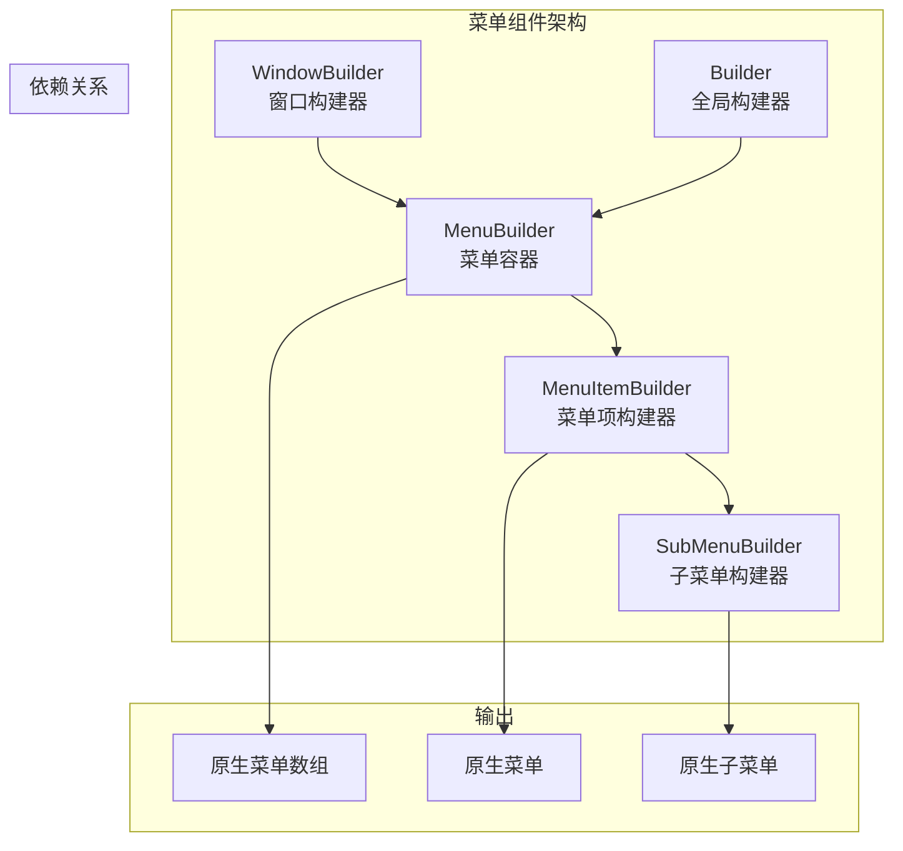
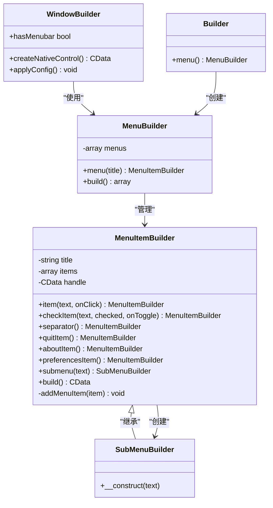
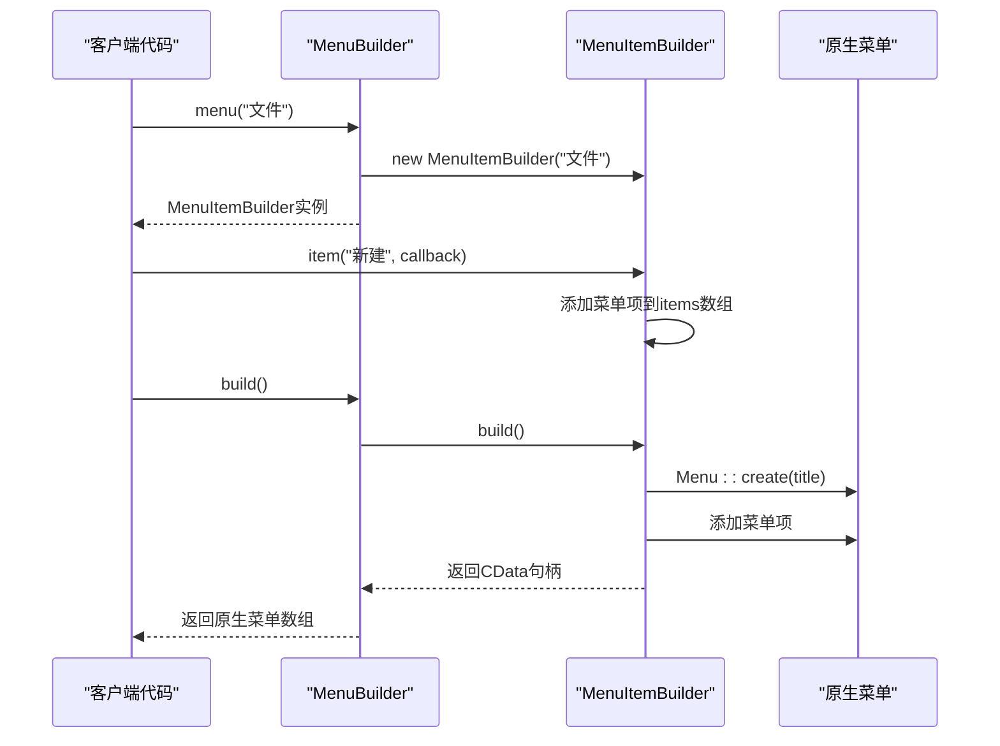
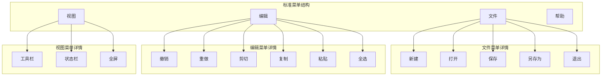
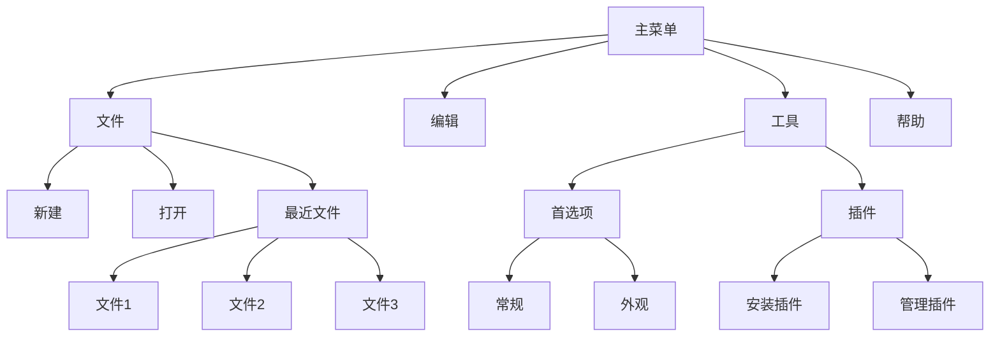
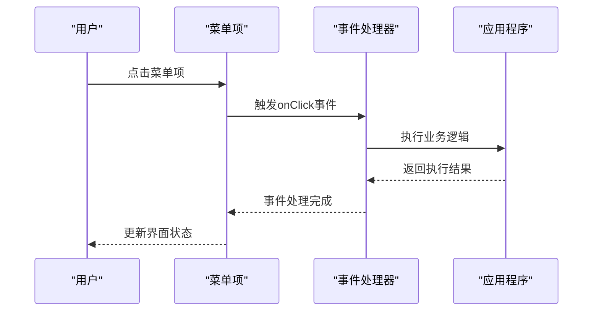
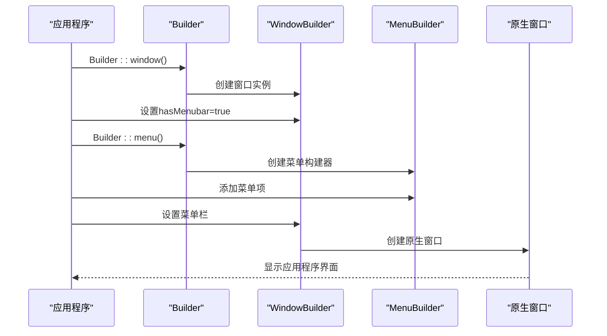
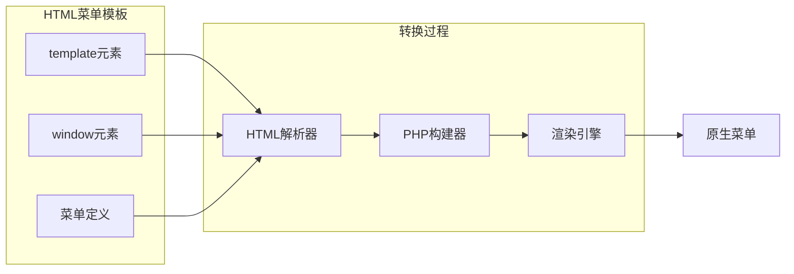

# 菜单组件

<cite>
**本文档中引用的文件**
- [MenuBuilder.php](file://src/Components/MenuBuilder.php)
- [MenuItemBuilder.php](file://src/Components/MenuItemBuilder.php)
- [SubMenuBuilder.php](file://src/Components/SubMenuBuilder.php)
- [WindowBuilder.php](file://src/Components/WindowBuilder.php)
- [Builder.php](file://src/Builder.php)
- [full.php](file://example/full.php)
- [full.ui.html](file://example/views/full.ui.html)
- [BuilderComponentsTest.php](file://tests/BuilderComponentsTest.php)
</cite>

## 目录
1. [简介](#简介)
2. [项目结构](#项目结构)
3. [核心组件](#核心组件)
4. [架构概览](#架构概览)
5. [详细组件分析](#详细组件分析)
6. [菜单层级构建](#菜单层级构建)
7. [事件处理机制](#事件处理机制)
8. [跨平台兼容性](#跨平台兼容性)
9. [实际应用示例](#实际应用示例)
10. [最佳实践](#最佳实践)
11. [总结](#总结)

## 简介

libuiBuilder的菜单系统提供了一个强大而灵活的API，用于构建桌面应用程序的菜单栏。该系统采用分层架构设计，通过MenuBuilder作为顶级容器管理整个菜单结构，MenuItemBuilder负责创建可点击的菜单项，SubMenuBuilder实现嵌套子菜单功能。系统支持多种类型的菜单项，包括普通菜单项、复选菜单项、分隔符、退出项等，并提供了完整的事件绑定和状态控制机制。

## 项目结构

菜单系统的核心文件组织如下：



**图表来源**
- [MenuBuilder.php](file://src/Components/MenuBuilder.php#L10-L29)
- [MenuItemBuilder.php](file://src/Components/MenuItemBuilder.php#L10-L126)
- [SubMenuBuilder.php](file://src/Components/SubMenuBuilder.php#L4-L14)

**章节来源**
- [MenuBuilder.php](file://src/Components/MenuBuilder.php#L1-L29)
- [MenuItemBuilder.php](file://src/Components/MenuItemBuilder.php#L1-L126)
- [SubMenuBuilder.php](file://src/Components/SubMenuBuilder.php#L1-L14)

## 核心组件

### MenuBuilder - 菜单容器

MenuBuilder是菜单系统的顶层容器，负责管理多个菜单实例。它维护一个菜单数组，每个菜单都由MenuItemBuilder实例表示。

主要特性：
- **菜单管理**：存储和管理多个菜单实例
- **构建协调**：协调各个菜单的构建过程
- **原生接口**：返回原生菜单数组供窗口使用

### MenuItemBuilder - 菜单项构建器

MenuItemBuilder是菜单系统的核心组件，负责创建各种类型的菜单项。它继承自SubMenuBuilder，支持嵌套结构。

主要特性：
- **多样化菜单项**：支持普通菜单项、复选菜单项、分隔符等
- **事件绑定**：提供onClick回调机制
- **状态控制**：支持菜单项的启用/禁用状态
- **子菜单支持**：通过submenu()方法创建嵌套子菜单

### SubMenuBuilder - 子菜单构建器

SubMenuBuilder专门用于创建嵌套的子菜单结构，继承自MenuItemBuilder，提供完整的菜单项功能。

主要特性：
- **继承功能**：继承MenuItemBuilder的所有功能
- **嵌套支持**：支持无限层级的菜单嵌套
- **简洁设计**：专注于子菜单功能，无额外复杂逻辑

**章节来源**
- [MenuBuilder.php](file://src/Components/MenuBuilder.php#L10-L29)
- [MenuItemBuilder.php](file://src/Components/MenuItemBuilder.php#L10-L126)
- [SubMenuBuilder.php](file://src/Components/SubMenuBuilder.php#L4-L14)

## 架构概览

菜单系统采用分层架构，从顶层容器到底层具体实现形成清晰的职责分离：



**图表来源**
- [MenuBuilder.php](file://src/Components/MenuBuilder.php#L10-L29)
- [MenuItemBuilder.php](file://src/Components/MenuItemBuilder.php#L10-L126)
- [SubMenuBuilder.php](file://src/Components/SubMenuBuilder.php#L4-L14)
- [WindowBuilder.php](file://src/Components/WindowBuilder.php#L11-L96)
- [Builder.php](file://src/Builder.php#L123-L127)

## 详细组件分析

### MenuBuilder详细分析

MenuBuilder作为菜单系统的顶层控制器，其设计体现了简单而有效的架构原则：



**图表来源**
- [MenuBuilder.php](file://src/Components/MenuBuilder.php#L14-L28)
- [MenuItemBuilder.php](file://src/Components/MenuItemBuilder.php#L77-L86)

### MenuItemBuilder详细分析

MenuItemBuilder实现了丰富的菜单项类型支持，每种类型都有特定的处理逻辑：

```mermaid
flowchart TD
Start([开始添加菜单项]) --> ItemType{菜单项类型}
ItemType --> |item| NormalItem[普通菜单项]
ItemType --> |check| CheckItem[复选菜单项]
ItemType --> |separator| Separator[分隔符]
ItemType --> |quit| QuitItem[退出项]
ItemType --> |about| AboutItem[关于项]
ItemType --> |preferences| PrefItem[首选项项]
ItemType --> |submenu| Submenu[子菜单]
NormalItem --> AddNormal[Menu::appendItem]
AddNormal --> BindClick[MenuItem::onClicked]
CheckItem --> AddCheck[Menu::appendCheckItem]
AddCheck --> SetChecked{是否已选中?}
SetChecked --> |是| SetTrue[MenuItem::setChecked(true)]
SetChecked --> |否| BindToggle[MenuItem::onClicked]
SetTrue --> BindToggle
Separator --> AddSep[Menu::appendSeparator]
QuitItem --> AddQuit[Menu::appendQuitItem]
AboutItem --> AddAbout[Menu::appendAboutItem]
PrefItem --> AddPref[Menu::appendPreferencesItem]
Submenu --> CreateSub[创建SubMenuBuilder]
CreateSub --> AddSub[添加到items数组]
BindClick --> End([完成])
BindToggle --> End
AddSep --> End
AddQuit --> End
AddAbout --> End
AddPref --> End
AddSub --> End
```

**图表来源**
- [MenuItemBuilder.php](file://src/Components/MenuItemBuilder.php#L89-L125)

**章节来源**
- [MenuBuilder.php](file://src/Components/MenuBuilder.php#L10-L29)
- [MenuItemBuilder.php](file://src/Components/MenuItemBuilder.php#L10-L126)
- [SubMenuBuilder.php](file://src/Components/SubMenuBuilder.php#L4-L14)

## 菜单层级构建

### 基础菜单结构

菜单系统支持标准的桌面应用程序菜单结构，如文件、编辑、视图等：



### 嵌套子菜单实现

系统支持多层级的嵌套子菜单结构，满足复杂应用程序的需求：



**章节来源**
- [MenuItemBuilder.php](file://src/Components/MenuItemBuilder.php#L66-L75)

## 事件处理机制

### 菜单项事件绑定

菜单系统提供了完整的事件处理机制，支持点击事件、切换事件等多种交互模式：

| 菜单项类型 | 事件类型 | 回调参数 | 使用场景 |
|------------|----------|----------|----------|
| 普通菜单项 | onClick | (MenuItem) | 执行命令操作 |
| 复选菜单项 | onToggle | (MenuItem, bool) | 切换开关状态 |
| 分隔符 | 无 | 无 | 分组菜单项 |
| 退出项 | 自动处理 | 无 | 应用程序退出 |
| 关于项 | 自动处理 | 无 | 显示关于信息 |
| 首选项项 | 自动处理 | 无 | 显示首选项对话框 |

### 事件处理流程



**图表来源**
- [MenuItemBuilder.php](file://src/Components/MenuItemBuilder.php#L93-L96)
- [MenuItemBuilder.php](file://src/Components/MenuItemBuilder.php#L104-L106)

**章节来源**
- [MenuItemBuilder.php](file://src/Components/MenuItemBuilder.php#L22-L65)
- [MenuItemBuilder.php](file://src/Components/MenuItemBuilder.php#L89-L125)

## 跨平台兼容性

### 平台差异处理

libuiBuilder的菜单系统在不同平台上保持一致的API接口，但底层实现会根据操作系统进行优化：

| 平台 | 菜单样式 | 特殊处理 | 兼容性注意事项 |
|------|----------|----------|----------------|
| Windows | Win32菜单API | 右键菜单支持 | 快捷键冲突处理 |
| macOS | Cocoa菜单系统 | 原生菜单栏 | 苹果菜单特殊处理 |
| Linux | GTK菜单系统 | X11/Wayland支持 | 字体渲染差异 |

### 跨平台特性

- **统一API**：所有平台使用相同的构建器API
- **原生体验**：在各平台上呈现原生的菜单外观
- **快捷键支持**：自动处理平台特定的快捷键组合
- **主题适配**：根据系统主题自动调整菜单外观

## 实际应用示例

### 完整的应用界面集成

参考example/full.php中的菜单集成方式，展示了如何将菜单系统与主窗口完美结合：



**图表来源**
- [full.php](file://example/full.php#L13-L179)
- [WindowBuilder.php](file://src/Components/WindowBuilder.php#L19-L33)

### HTML模板中的菜单定义

虽然主要使用PHP构建器API，系统也支持HTML模板格式的菜单定义：



**图表来源**
- [full.ui.html](file://example/views/full.ui.html#L1-L126)

**章节来源**
- [full.php](file://example/full.php#L1-L180)
- [full.ui.html](file://example/views/full.ui.html#L1-L126)

## 最佳实践

### 菜单设计原则

1. **层次清晰**：避免过深的菜单嵌套，通常不超过3层
2. **命名规范**：使用清晰、一致的菜单项命名
3. **快捷键分配**：为主要功能分配快捷键，提升用户体验
4. **状态反馈**：及时更新菜单项的状态（启用/禁用）
5. **平台适配**：考虑不同平台的菜单习惯

### 性能优化建议

- **延迟加载**：对于复杂的子菜单，可以采用延迟加载策略
- **缓存机制**：对静态菜单项进行缓存，避免重复创建
- **事件节流**：对于频繁触发的菜单事件，实施节流机制

### 错误处理

- **菜单项验证**：确保菜单项名称不为空且唯一
- **事件回调检查**：验证事件回调函数的有效性
- **内存管理**：及时释放不再使用的菜单资源

## 总结

libuiBuilder的菜单系统提供了一个功能完整、设计优雅的解决方案，通过MenuBuilder、MenuItemBuilder和SubMenuBuilder三个核心组件，实现了从简单到复杂的各种菜单需求。系统具有以下优势：

- **模块化设计**：清晰的职责分离，易于维护和扩展
- **丰富的功能**：支持多种菜单项类型和事件处理机制
- **跨平台兼容**：在不同操作系统上提供一致的用户体验
- **灵活的集成**：可以轻松集成到现有的应用程序架构中

通过合理的架构设计和完善的API设计，该菜单系统能够满足现代桌面应用程序的各种菜单需求，为开发者提供了一个强大而易用的工具。