# 单行输入框组件 (EntryBuilder)

<cite>
**本文档中引用的文件**
- [EntryBuilder.php](file://src/Components/EntryBuilder.php)
- [ComponentBuilder.php](file://src/ComponentBuilder.php)
- [StateManager.php](file://src/State/StateManager.php)
- [ComponentRef.php](file://src/State/ComponentRef.php)
- [simple.php](file://example/simple.php)
- [full.php](file://example/full.php)
- [login.ui.html](file://example/views/login.ui.html)
- [full.ui.html](file://example/views/full.ui.html)
</cite>

## 目录
1. [简介](#简介)
2. [项目结构](#项目结构)
3. [核心组件](#核心组件)
4. [架构概览](#架构概览)
5. [详细组件分析](#详细组件分析)
6. [配置项详解](#配置项详解)
7. [链式方法分析](#链式方法分析)
8. [事件处理机制](#事件处理机制)
9. [与StateManager集成](#与statemanager集成)
10. [HTML模板对比](#html模板对比)
11. [性能考虑](#性能考虑)
12. [最佳实践](#最佳实践)
13. [总结](#总结)

## 简介

EntryBuilder是libuiBuilder框架中的单行文本输入控件组件，提供了完整的文本输入功能，包括初始值设置、占位符显示、只读模式和变更回调等特性。该组件采用链式调用模式，支持与状态管理系统(StateManager)深度集成，实现表单数据的实时绑定和验证。

EntryBuilder继承自ComponentBuilder基类，遵循统一的组件架构设计，同时实现了libui库的原生Entry控件封装。它不仅提供了基本的文本输入功能，还内置了事件驱动的数据同步机制，使得开发者能够轻松构建响应式的用户界面。

## 项目结构

EntryBuilder组件在项目中的组织结构体现了清晰的分层架构：

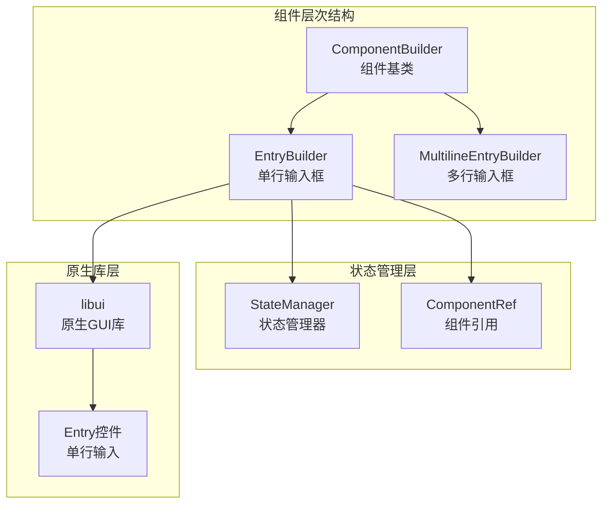

**图表来源**
- [ComponentBuilder.php](file://src/ComponentBuilder.php#L11-L234)
- [EntryBuilder.php](file://src/Components/EntryBuilder.php#L9-L80)

**章节来源**
- [EntryBuilder.php](file://src/Components/EntryBuilder.php#L1-L80)
- [ComponentBuilder.php](file://src/ComponentBuilder.php#L1-L234)

## 核心组件

EntryBuilder的核心功能围绕四个主要配置项展开：

### 默认配置结构

EntryBuilder的默认配置包含了四个关键属性：

| 配置项 | 类型 | 默认值 | 描述 |
|--------|------|--------|------|
| text | string | '' | 初始输入文本内容 |
| placeholder | string | '' | 输入框为空时显示的提示文本 |
| readOnly | boolean | false | 是否启用只读模式 |
| onChange | callable | null | 输入内容变更时的回调函数 |

### 原生控件映射

EntryBuilder通过FFI(Foreign Function Interface)技术与libui库的原生Entry控件建立连接：

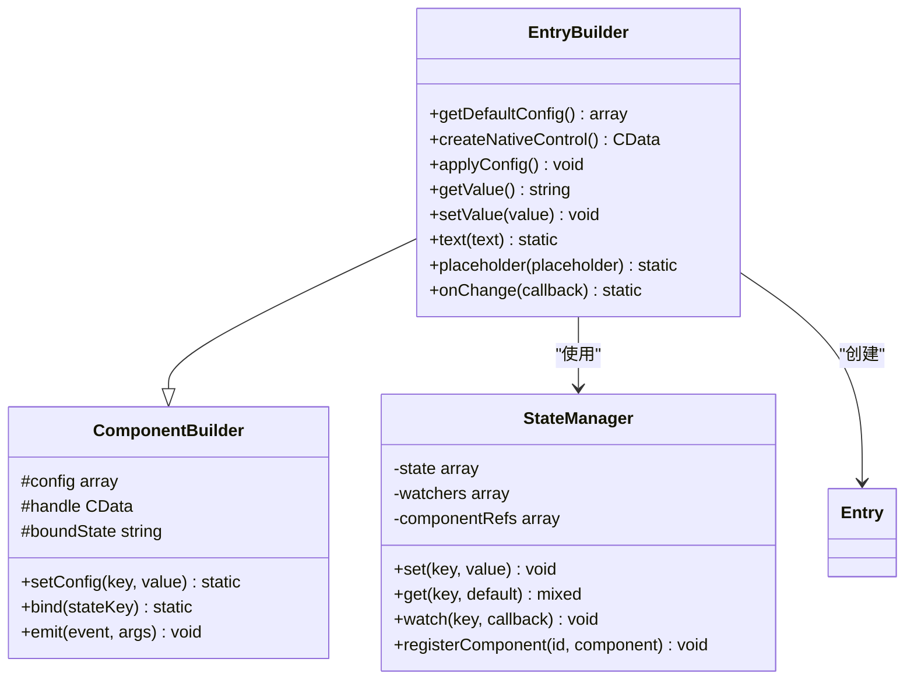

**图表来源**
- [EntryBuilder.php](file://src/Components/EntryBuilder.php#L9-L80)
- [ComponentBuilder.php](file://src/ComponentBuilder.php#L11-L234)
- [StateManager.php](file://src/State/StateManager.php#L8-L91)

**章节来源**
- [EntryBuilder.php](file://src/Components/EntryBuilder.php#L11-L18)
- [ComponentBuilder.php](file://src/ComponentBuilder.php#L25-L44)

## 架构概览

EntryBuilder采用了经典的MVC架构模式，结合观察者模式和事件驱动机制：

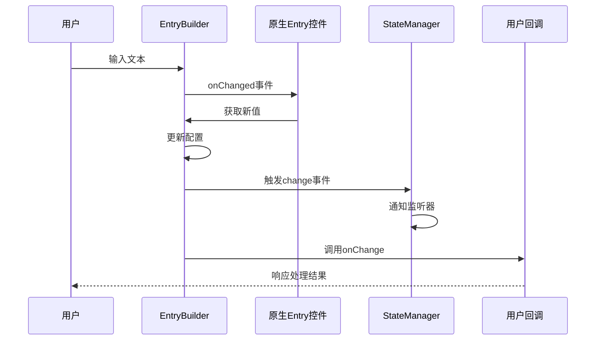

**图表来源**
- [EntryBuilder.php](file://src/Components/EntryBuilder.php#L38-L50)
- [StateManager.php](file://src/State/StateManager.php#L26-L36)

## 详细组件分析

### 配置应用流程

EntryBuilder的applyConfig方法负责将配置应用到原生控件：

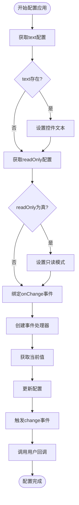

**图表来源**
- [EntryBuilder.php](file://src/Components/EntryBuilder.php#L26-L50)

### 值获取与设置机制

EntryBuilder提供了灵活的值管理机制：

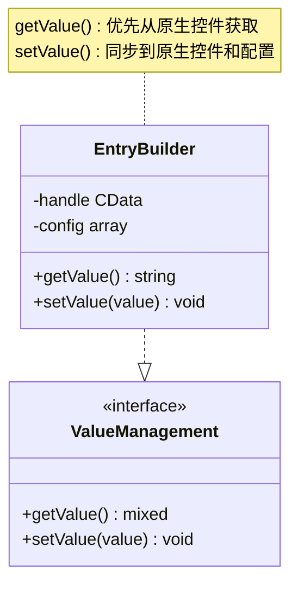

**图表来源**
- [EntryBuilder.php](file://src/Components/EntryBuilder.php#L52-L64)

**章节来源**
- [EntryBuilder.php](file://src/Components/EntryBuilder.php#L26-L64)

## 配置项详解

### text配置项

text配置项控制输入框的初始内容和当前值：

- **类型**: string
- **默认值**: ''
- **作用**: 设置输入框的初始文本内容
- **应用场景**: 表单预填充、动态内容加载

### placeholder配置项

placeholder配置项提供输入提示功能：

- **类型**: string
- **默认值**: ''
- **作用**: 在输入框为空时显示提示文本
- **用户体验**: 提供输入指导，提升界面友好性

### readOnly配置项

readOnly配置项控制输入框的编辑权限：

- **类型**: boolean
- **默认值**: false
- **作用**: 禁用输入框的编辑功能
- **应用场景**: 显示模式、只读信息展示

### onChange回调函数

onChange配置项提供变更事件处理：

- **类型**: callable
- **默认值**: null
- **参数**: 新值($newValue)、组件实例($this)
- **用途**: 实现数据验证、实时计算、状态同步等功能

**章节来源**
- [EntryBuilder.php](file://src/Components/EntryBuilder.php#L11-L18)

## 链式方法分析

EntryBuilder提供了三个主要的链式方法，每个方法都返回当前实例以支持连续调用：

### text() 方法

text方法用于设置输入框的初始文本：

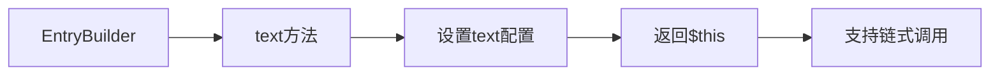

**图表来源**
- [EntryBuilder.php](file://src/Components/EntryBuilder.php#L66-L69)

### placeholder() 方法

placeholder方法用于设置占位符文本：

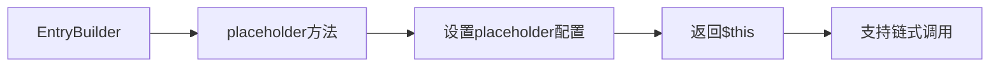

**图表来源**
- [EntryBuilder.php](file://src/Components/EntryBuilder.php#L71-L74)

### onChange() 方法

onChange方法用于注册变更回调：

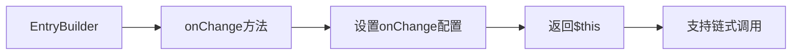

**图表来源**
- [EntryBuilder.php](file://src/Components/EntryBuilder.php#L76-L79)

**章节来源**
- [EntryBuilder.php](file://src/Components/EntryBuilder.php#L66-L79)

## 事件处理机制

### onChanged事件绑定

EntryBuilder的核心特性是自动绑定onChanged事件，实现双向数据同步：

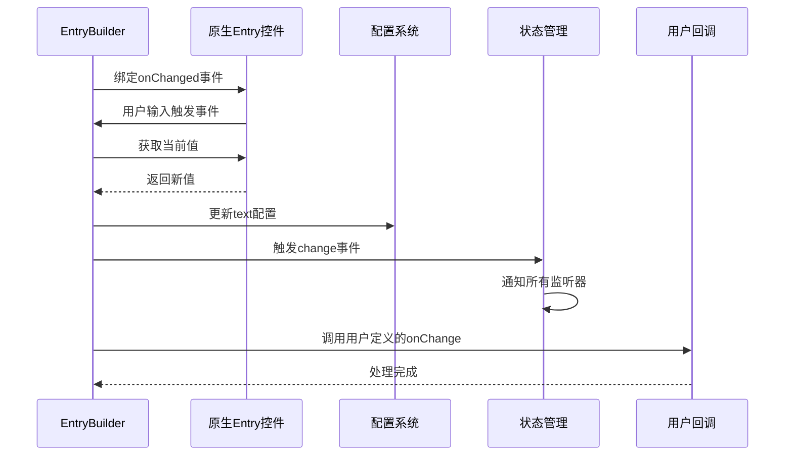

**图表来源**
- [EntryBuilder.php](file://src/Components/EntryBuilder.php#L38-L50)

### 事件传播机制

EntryBuilder继承了ComponentBuilder的事件系统：

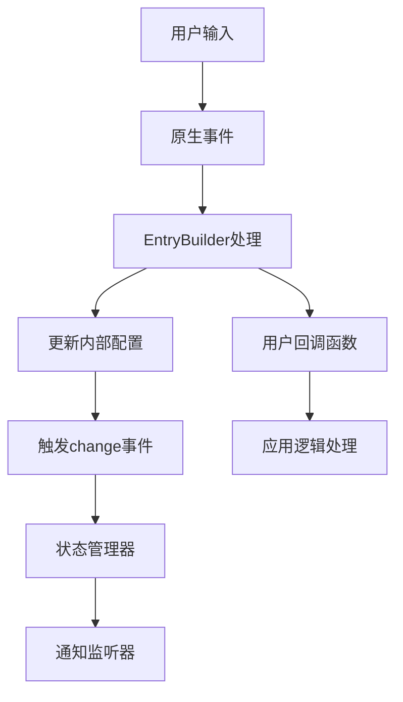

**图表来源**
- [ComponentBuilder.php](file://src/ComponentBuilder.php#L160-L175)
- [EntryBuilder.php](file://src/Components/EntryBuilder.php#L43-L49)

**章节来源**
- [EntryBuilder.php](file://src/Components/EntryBuilder.php#L38-L50)
- [ComponentBuilder.php](file://src/ComponentBuilder.php#L160-L175)

## 与StateManager集成

### 组件引用机制

EntryBuilder通过ComponentRef与StateManager建立连接：

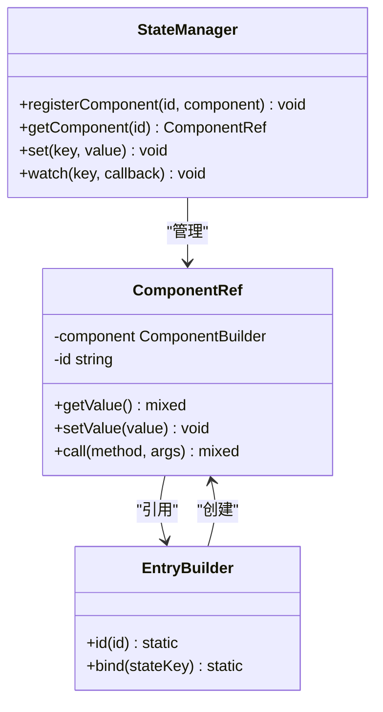

**图表来源**
- [StateManager.php](file://src/State/StateManager.php#L70-L82)
- [ComponentRef.php](file://src/State/ComponentRef.php#L11-L74)
- [ComponentBuilder.php](file://src/ComponentBuilder.php#L125-L131)

### 实时数据绑定示例

以下展示了EntryBuilder与StateManager的典型集成模式：

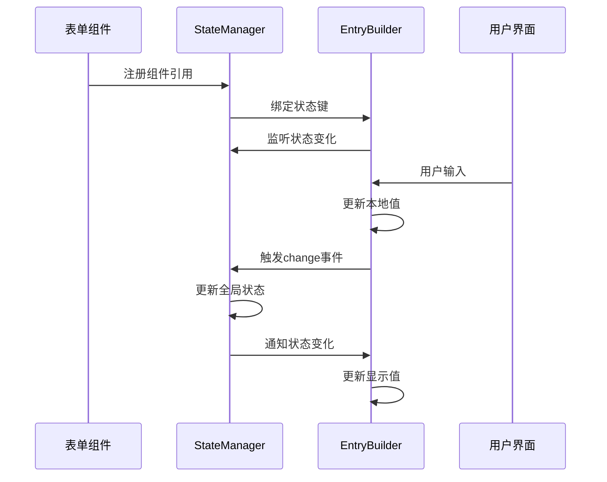

**图表来源**
- [ComponentBuilder.php](file://src/ComponentBuilder.php#L135-L146)
- [StateManager.php](file://src/State/StateManager.php#L14-L36)

**章节来源**
- [StateManager.php](file://src/State/StateManager.php#L70-L82)
- [ComponentBuilder.php](file://src/ComponentBuilder.php#L125-L146)

## HTML模板对比

### Builder API方式

使用Builder API创建Entry组件的方式：

```php
// Builder API方式
$entry = Builder::entry()
    ->id('nameEntry')
    ->placeholder('请输入您的姓名')
    ->maxLength(20)
    ->validation(fn($value) => !empty(trim($value)))
    ->onChange(function ($value, $component) {
        $welcomeLabel = StateManager::instance()->getComponent('welcomeLabel');
        if ($welcomeLabel) {
            $text = empty($value) ? '请输入姓名' : "您好, {$value}!";
            $welcomeLabel->setValue($text);
        }
    });
```

### HTML模板方式

使用HTML模板创建Entry组件的方式：

```html
<!-- HTML模板方式 -->
<input 
    id="usernameInput"
    bind="username"
    placeholder="请输入用户名"
    expand="horizontal"
    onchange="handleUsernameChange"
/>
```

### 对比分析

| 特性 | Builder API | HTML模板 |
|------|-------------|----------|
| 开发效率 | 高，IDE支持 | 中等，需要模板引擎 |
| 类型安全 | 完全支持 | 运行时检查 |
| 性能开销 | 较低 | 中等 |
| 维护性 | 易于重构 | 模板分离 |
| 动态性 | 强，运行时创建 | 弱，静态定义 |

**章节来源**
- [simple.php](file://example/simple.php#L22-L36)
- [login.ui.html](file://example/views/login.ui.html#L8-L16)

## 性能考虑

### 同步阻塞操作的避免

在onChange回调中应避免执行同步阻塞操作：

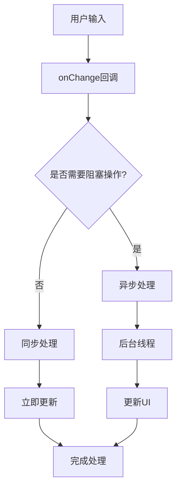

### 性能优化建议

1. **避免复杂计算**: 在onChange中避免执行CPU密集型任务
2. **异步处理**: 将耗时操作移至后台线程
3. **防抖处理**: 对频繁触发的输入进行防抖处理
4. **内存管理**: 及时清理不需要的回调引用

### 内存泄漏防护

EntryBuilder通过以下机制防止内存泄漏：

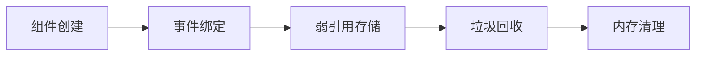

**章节来源**
- [EntryBuilder.php](file://src/Components/EntryBuilder.php#L38-L50)

## 最佳实践

### 表单验证集成

EntryBuilder与表单验证系统的推荐集成方式：

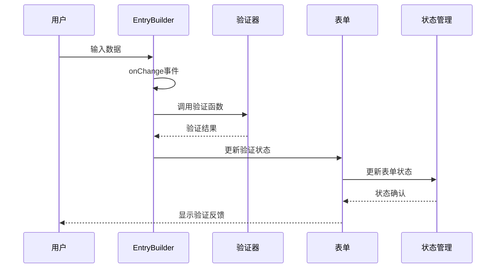

### 错误处理策略

推荐的错误处理模式：

1. **输入验证**: 在onChange中进行基本格式检查
2. **业务规则**: 在提交时进行业务逻辑验证
3. **用户体验**: 提供清晰的错误提示信息
4. **恢复机制**: 支持错误状态的恢复操作

### 代码组织建议

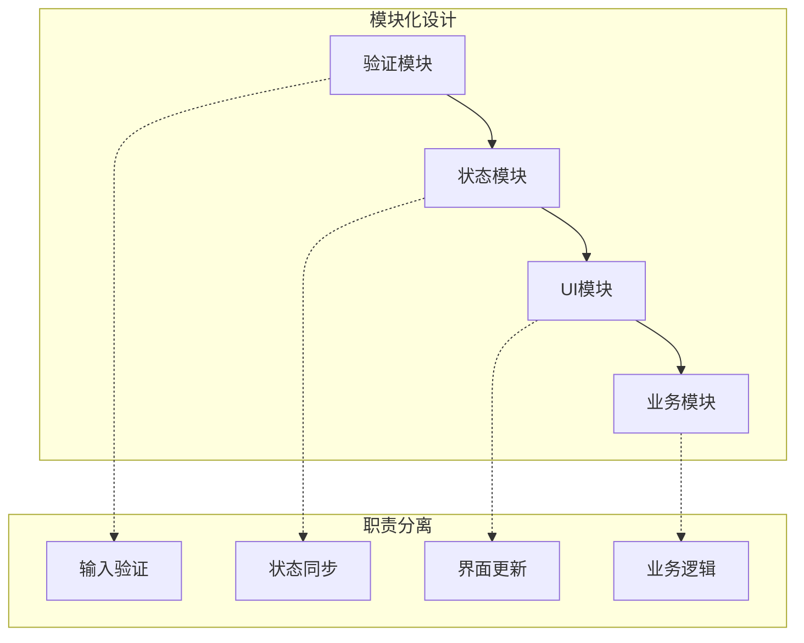

**章节来源**
- [simple.php](file://example/simple.php#L22-L36)

## 总结

EntryBuilder作为libuiBuilder框架的核心组件之一，展现了现代GUI框架的设计理念：

### 核心优势

1. **简洁的API设计**: 通过链式调用提供流畅的开发体验
2. **强大的事件系统**: 自动化的数据同步和事件传播机制
3. **灵活的状态管理**: 与StateManager的深度集成
4. **跨平台兼容**: 基于libui的原生控件实现

### 技术特点

- **事件驱动架构**: 响应式的用户界面交互
- **类型安全**: PHP类型提示和运行时验证
- **性能优化**: 避免不必要的DOM操作和内存占用
- **扩展性强**: 支持自定义验证和业务逻辑

### 应用场景

EntryBuilder适用于各种文本输入场景，包括但不限于：
- 表单数据收集
- 搜索功能实现
- 实时数据过滤
- 用户偏好设置

通过合理运用EntryBuilder的各项特性，开发者可以构建出既美观又实用的桌面应用程序界面。