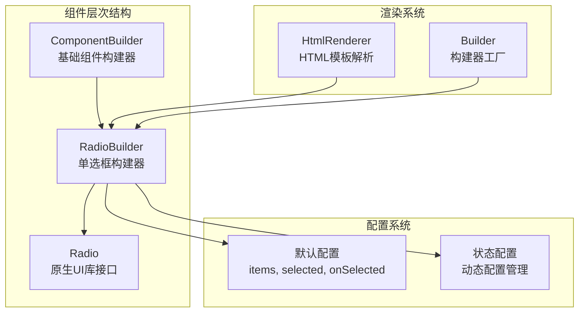
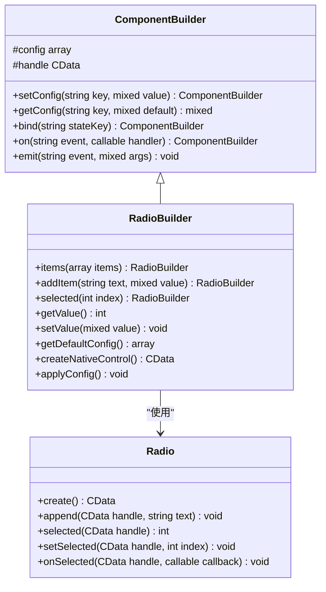
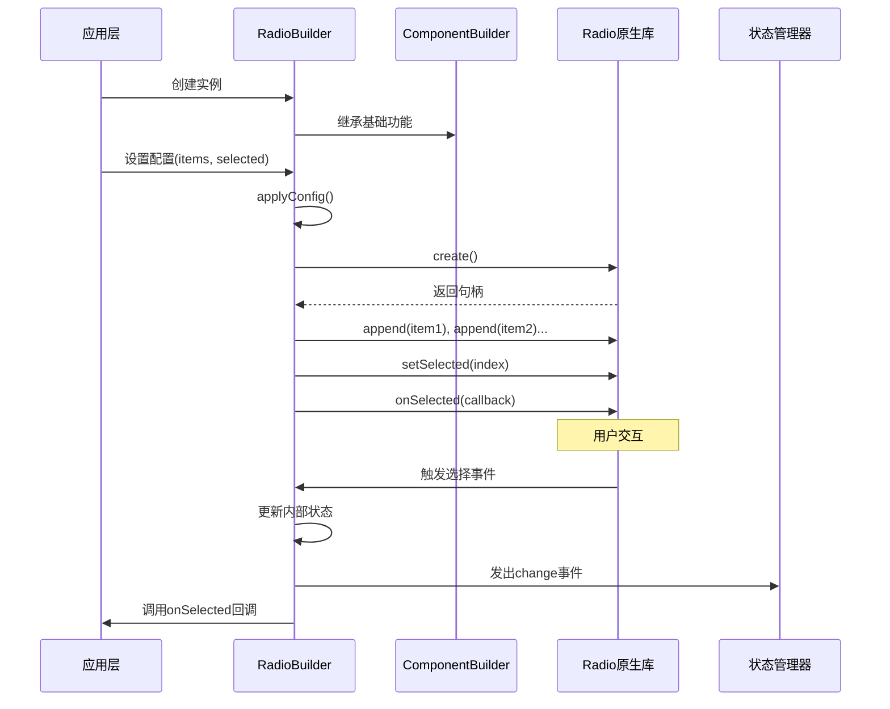
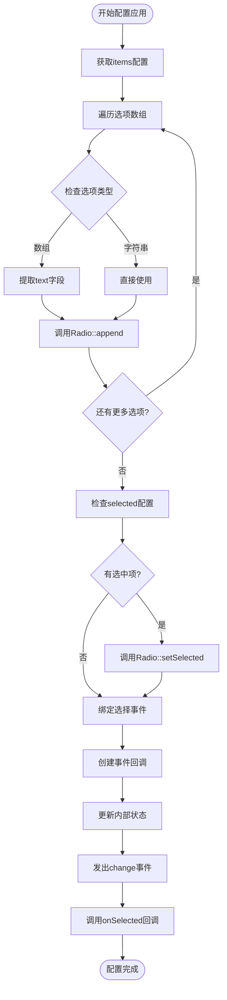
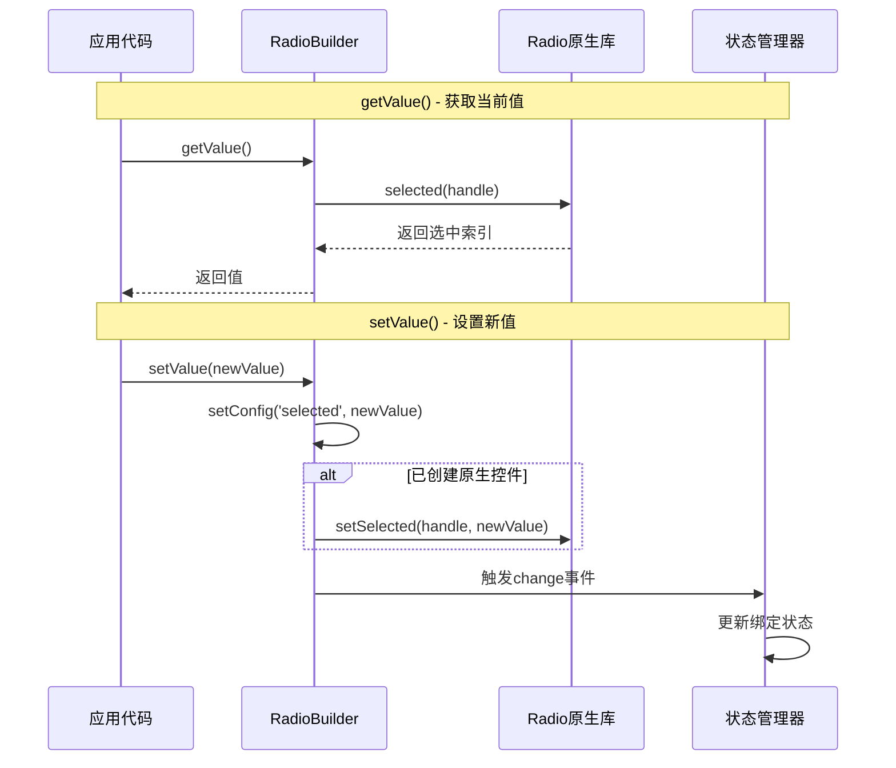
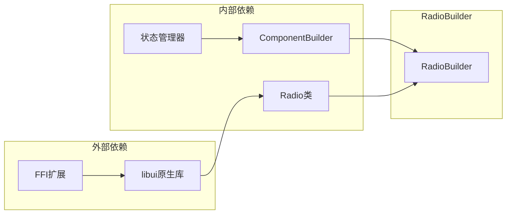

# 单选框组件 (RadioBuilder)

<cite>
**本文档中引用的文件**
- [RadioBuilder.php](file://src/Components/RadioBuilder.php)
- [ComponentBuilder.php](file://src/ComponentBuilder.php)
- [Radio.php](file://vendor/kingbes/libui/src/Radio.php)
- [HtmlRenderer.php](file://src/HtmlRenderer.php)
- [Builder.php](file://src/Builder.php)
- [helper.php](file://src/helper.php)
- [BuilderComponentsTest.php](file://tests/BuilderComponentsTest.php)
- [builder_helpers_demo.php](file://example/builder_helpers_demo.php)
</cite>

## 目录
1. [简介](#简介)
2. [项目结构](#项目结构)
3. [核心组件](#核心组件)
4. [架构概览](#架构概览)
5. [详细组件分析](#详细组件分析)
6. [依赖关系分析](#依赖关系分析)
7. [性能考虑](#性能考虑)
8. [故障排除指南](#故障排除指南)
9. [结论](#结论)

## 简介

RadioBuilder是libuiBuilder框架中的一个专门组件，作为一组互斥选项的选择器，为用户提供单一选择功能。该组件继承自ComponentBuilder基类，提供了丰富的链式方法来构建和配置单选框组，支持动态选项列表、状态管理和事件处理等高级功能。

RadioBuilder的核心特性包括：
- **互斥选择**：确保用户只能选择一个选项
- **动态选项管理**：支持运行时添加和修改选项
- **状态绑定**：与状态管理系统无缝集成
- **事件驱动**：提供完整的事件处理机制
- **HTML模板支持**：支持声明式HTML标记语法

## 项目结构

RadioBuilder组件在项目中的组织结构体现了清晰的分层架构设计：



**图表来源**
- [ComponentBuilder.php](file://src/ComponentBuilder.php#L11-L234)
- [RadioBuilder.php](file://src/Components/RadioBuilder.php#L9-L80)

**章节来源**
- [RadioBuilder.php](file://src/Components/RadioBuilder.php#L1-L80)
- [ComponentBuilder.php](file://src/ComponentBuilder.php#L1-L234)

## 核心组件

### 配置项详解

RadioBuilder提供了三个核心配置项，每个都承担着特定的功能职责：

| 配置项 | 类型 | 默认值 | 描述 |
|--------|------|--------|------|
| `items` | array | `[]` | 选项数组，支持字符串或关联数组格式 |
| `selected` | int | `-1` | 当前选中项索引，-1表示无选中 |
| `onSelected` | callable | `null` | 选择变更回调函数 |

### 链式方法体系

RadioBuilder实现了完整的链式方法接口，提供流畅的编程体验：



**图表来源**
- [RadioBuilder.php](file://src/Components/RadioBuilder.php#L64-L79)
- [ComponentBuilder.php](file://src/ComponentBuilder.php#L105-L120)
- [Radio.php](file://vendor/kingbes/libui/src/Radio.php#L12-L74)

**章节来源**
- [RadioBuilder.php](file://src/Components/RadioBuilder.php#L11-L17)
- [RadioBuilder.php](file://src/Components/RadioBuilder.php#L64-L79)

## 架构概览

RadioBuilder采用分层架构设计，从底层原生UI库到高层应用接口形成了完整的抽象层次：



**图表来源**
- [RadioBuilder.php](file://src/Components/RadioBuilder.php#L25-L48)
- [ComponentBuilder.php](file://src/ComponentBuilder.php#L209-L230)

## 详细组件分析

### applyConfig方法深度解析

applyConfig方法是RadioBuilder的核心配置应用逻辑，负责将配置转换为实际的UI行为：



**图表来源**
- [RadioBuilder.php](file://src/Components/RadioBuilder.php#L25-L48)

### getValue/setValue状态集成

RadioBuilder提供了完整的状态管理系统集成，支持双向数据绑定：



**图表来源**
- [RadioBuilder.php](file://src/Components/RadioBuilder.php#L51-L62)

### 动态选项构建机制

RadioBuilder支持两种动态选项添加方式：

#### items方法 - 批量设置
```php
// 设置完整选项列表
$radio->items(['选项1', '选项2', '选项3']);
```

#### addItem方法 - 逐个添加
```php
// 添加单个选项
$radio->addItem('选项1');
$radio->addItem('选项2', 'value2'); // 带值的选项
```

**章节来源**
- [RadioBuilder.php](file://src/Components/RadioBuilder.php#L64-L79)

### HTML模板声明式用法

RadioBuilder支持HTML模板语法，提供声明式的配置方式：

```html
<!-- 基础单选框 -->
<radio>
  <option>选项1</option>
  <option>选项2</option>
  <option>选项3</option>
</radio>

<!-- 带默认选中的单选框 -->
<radio selected="1">
  <option>选项A</option>
  <option>选项B</option>
  <option>选项C</option>
</radio>
```

**章节来源**
- [HtmlRenderer.php](file://src/HtmlRenderer.php#L489-L511)

## 依赖关系分析

RadioBuilder的依赖关系体现了清晰的模块化设计：



**图表来源**
- [RadioBuilder.php](file://src/Components/RadioBuilder.php#L1-L8)
- [ComponentBuilder.php](file://src/ComponentBuilder.php#L1-L10)

**章节来源**
- [RadioBuilder.php](file://src/Components/RadioBuilder.php#L1-L8)
- [ComponentBuilder.php](file://src/ComponentBuilder.php#L1-L10)

## 性能考虑

### 大量选项的性能优化

当处理大量选项时，需要考虑以下性能因素：

1. **延迟加载**：对于超过一定数量的选项，可以考虑使用虚拟滚动技术
2. **内存管理**：及时清理不再使用的选项资源
3. **事件处理优化**：避免在事件回调中进行重量级操作
4. **批量更新**：使用批量操作减少UI刷新次数

### 最佳实践建议

```php
// 推荐：使用批量添加而非逐个添加
$options = [];
for ($i = 0; $i < 1000; $i++) {
    $options[] = "选项 {$i}";
}
$radio->items($options);

// 避免：频繁的单个添加
for ($i = 0; $i < 1000; $i++) {
    $radio->addItem("选项 {$i}");
}
```

## 故障排除指南

### 常见问题及解决方案

| 问题 | 原因 | 解决方案 |
|------|------|----------|
| 选项不显示 | items配置为空 | 确保正确设置items数组 |
| 无法选择 | selected索引超出范围 | 检查selected值是否在有效范围内 |
| 事件不触发 | onSelected回调未设置 | 正确设置onSelected回调函数 |
| 状态不同步 | 绑定状态失败 | 检查状态绑定配置 |

### 调试技巧

1. **检查配置**：使用`getConfig()`方法验证配置是否正确
2. **监听事件**：添加调试输出到事件回调中
3. **状态检查**：使用`getValue()`和`setValue()`验证状态同步

**章节来源**
- [RadioBuilder.php](file://src/Components/RadioBuilder.php#L51-L62)
- [ComponentBuilder.php](file://src/ComponentBuilder.php#L97-L108)

## 结论

RadioBuilder组件作为libuiBuilder框架中的重要组成部分，提供了功能完整、易于使用的单选框解决方案。其设计充分体现了现代UI框架的最佳实践：

- **模块化设计**：清晰的分层架构便于维护和扩展
- **链式API**：流畅的编程体验提升开发效率
- **状态管理**：与框架状态系统深度集成
- **性能优化**：考虑了大规模应用的性能需求
- **易用性**：支持声明式和程序式两种配置方式

通过合理使用RadioBuilder的各项功能，开发者可以快速构建出功能丰富、用户体验良好的单选框组件，满足各种应用场景的需求，从简单的表单选择到复杂的问卷调查系统都能胜任。