# 基础控件

<cite>
**本文档中引用的文件**
- [ButtonBuilder.php](file://src/Components/ButtonBuilder.php)
- [LabelBuilder.php](file://src/Components/LabelBuilder.php)
- [EntryBuilder.php](file://src/Components/EntryBuilder.php)
- [MultilineEntryBuilder.php](file://src/Components/MultilineEntryBuilder.php)
- [CheckboxBuilder.php](file://src/Components/CheckboxBuilder.php)
- [RadioBuilder.php](file://src/Components/RadioBuilder.php)
- [ComponentBuilder.php](file://src/ComponentBuilder.php)
- [ComponentRef.php](file://src/State/ComponentRef.php)
- [StateManager.php](file://src/State/StateManager.php)
- [FormValidator.php](file://src/Validation/FormValidator.php)
- [helper.php](file://src/helper.php)
- [login.ui.html](file://example/views/login.ui.html)
- [full.ui.html](file://example/views/full.ui.html)
- [htmlLogin.php](file://example/htmlLogin.php)
- [builder_helpers_demo.php](file://example/builder_helpers_demo.php)
</cite>

## 目录
1. [简介](#简介)
2. [项目结构](#项目结构)
3. [核心组件](#核心组件)
4. [架构概览](#架构概览)
5. [详细组件分析](#详细组件分析)
6. [状态管理系统](#状态管理系统)
7. [HTML模板集成](#html模板集成)
8. [最佳实践](#最佳实践)
9. [故障排除指南](#故障排除指南)
10. [结论](#结论)

## 简介

libuiBuilder是一个强大的PHP GUI框架，提供了丰富的基础控件来构建桌面应用程序界面。本文档详细介绍了六个核心基础控件：ButtonBuilder（按钮）、LabelBuilder（标签）、EntryBuilder（单行输入框）、MultilineEntryBuilder（多行输入框）、CheckboxBuilder（复选框）和RadioBuilder（单选按钮）。这些控件采用链式调用模式，支持数据绑定、事件处理和无障碍访问功能。

## 项目结构

libuiBuilder的基础控件位于`src/Components/`目录下，每个控件都有独立的构建器类：

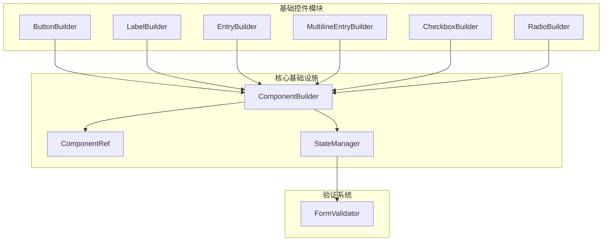

**图表来源**
- [ComponentBuilder.php](file://src/ComponentBuilder.php#L11-L234)
- [ButtonBuilder.php](file://src/Components/ButtonBuilder.php#L9-L48)
- [LabelBuilder.php](file://src/Components/LabelBuilder.php#L9-L62)

**章节来源**
- [ComponentBuilder.php](file://src/ComponentBuilder.php#L1-L234)
- [ButtonBuilder.php](file://src/Components/ButtonBuilder.php#L1-L48)

## 核心组件

所有基础控件都继承自`ComponentBuilder`抽象类，提供了统一的接口和功能：

### ComponentBuilder基类特性

| 功能 | 描述 | 方法 |
|------|------|------|
| 配置管理 | 动态配置控件属性 | `setConfig()`, `getConfig()` |
| 状态绑定 | 与StateManager集成 | `bind()`, `getValue()`, `setValue()` |
| 事件处理 | 自定义事件处理器 | `on()`, `emit()` |
| 组件引用 | 通过ID访问组件 | `id()`, `getRef()` |
| 生命周期 | 构建和渲染控制 | `build()`, `createNativeControl()` |

### 链式调用模式

所有控件都支持流畅的链式调用语法，允许开发者以声明式的方式构建界面：

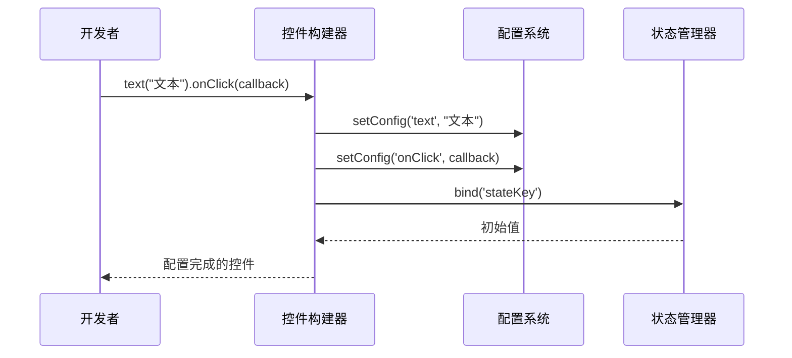

**图表来源**
- [ComponentBuilder.php](file://src/ComponentBuilder.php#L105-L120)
- [ComponentBuilder.php](file://src/ComponentBuilder.php#L135-L146)

**章节来源**
- [ComponentBuilder.php](file://src/ComponentBuilder.php#L105-L146)

## 架构概览

基础控件系统采用分层架构设计，确保了良好的可扩展性和维护性：

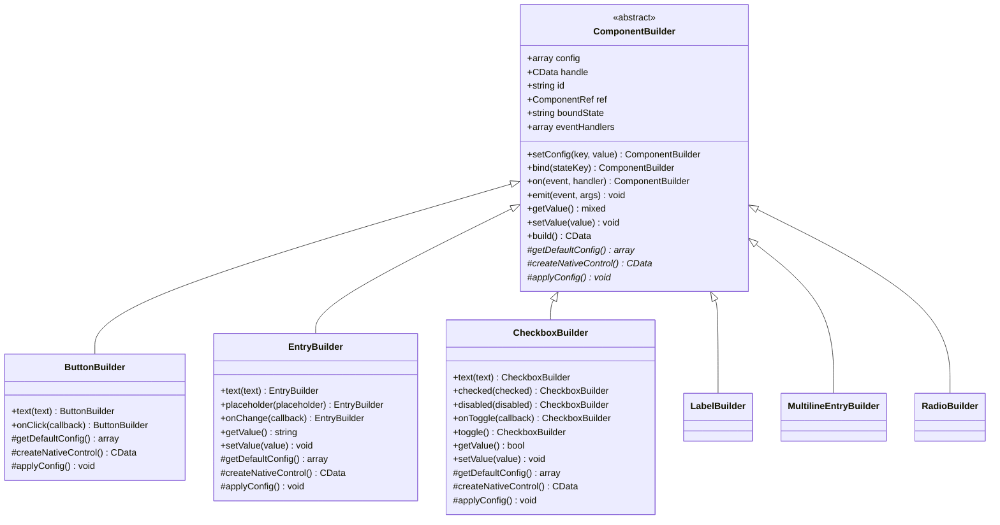

**图表来源**
- [ComponentBuilder.php](file://src/ComponentBuilder.php#L11-L234)
- [ButtonBuilder.php](file://src/Components/ButtonBuilder.php#L9-L48)
- [EntryBuilder.php](file://src/Components/EntryBuilder.php#L9-L80)
- [CheckboxBuilder.php](file://src/Components/CheckboxBuilder.php#L9-L97)

## 详细组件分析

### ButtonBuilder - 按钮控件

按钮控件是最简单的交互控件，提供基本的点击功能和事件处理。

#### 核心功能特性

| 方法 | 参数 | 返回值 | 描述 |
|------|------|--------|------|
| `text()` | `string $text` | `static` | 设置按钮显示文本 |
| `onClick()` | `callable $callback` | `static` | 设置点击事件处理器 |

#### 默认配置

| 配置项 | 类型 | 默认值 | 描述 |
|--------|------|--------|------|
| `text` | `string` | `'Button'` | 按钮显示文本 |
| `onClick` | `callable` | `null` | 点击事件回调 |
| `stretchy` | `bool` | `false` | 是否可伸展 |

#### 事件处理流程

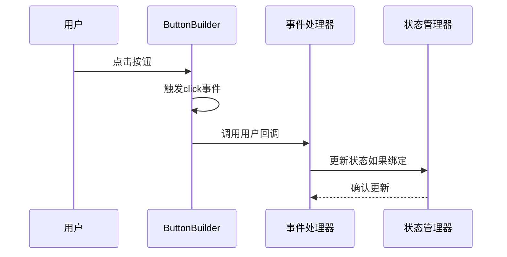

**图表来源**
- [ButtonBuilder.php](file://src/Components/ButtonBuilder.php#L27-L36)

**章节来源**
- [ButtonBuilder.php](file://src/Components/ButtonBuilder.php#L1-L48)

### LabelBuilder - 标签控件

标签控件用于显示静态文本，支持多种对齐方式和样式设置。

#### 核心功能特性

| 方法 | 参数 | 返回值 | 描述 |
|------|------|--------|------|
| `text()` | `string $text` | `static` | 设置标签文本 |
| `align()` | `string $align` | `static` | 设置文本对齐方式 |
| `color()` | `array $color` | `static` | 设置文本颜色 |

#### 默认配置

| 配置项 | 类型 | 默认值 | 描述 |
|--------|------|--------|------|
| `text` | `string` | `''` | 标签显示文本 |
| `align` | `string` | `'left'` | 文本对齐方式 |
| `color` | `array` | `null` | 文本颜色 |
| `font` | `array` | `null` | 字体设置 |

#### 数据绑定支持

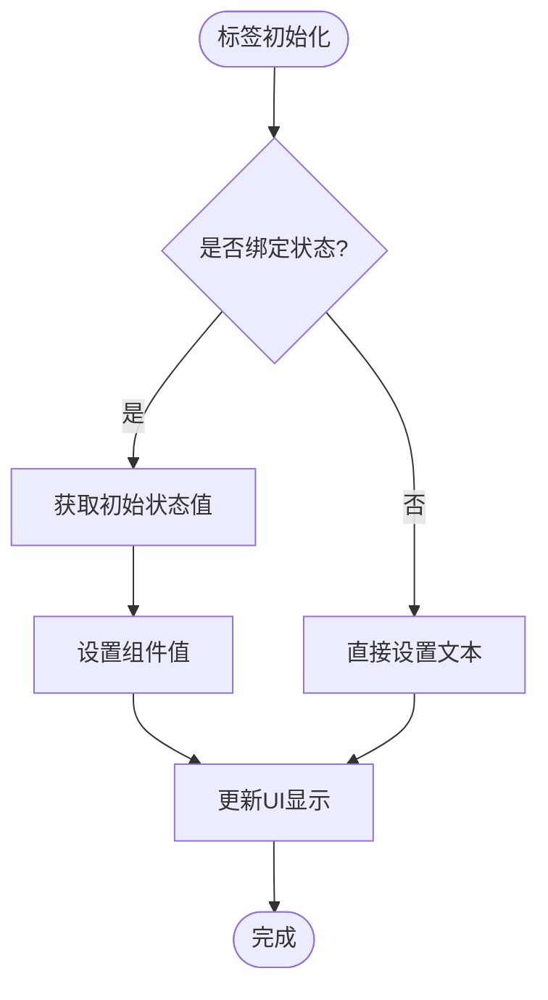

**图表来源**
- [LabelBuilder.php](file://src/Components/LabelBuilder.php#L38-L44)

**章节来源**
- [LabelBuilder.php](file://src/Components/LabelBuilder.php#L1-L62)

### EntryBuilder - 单行输入框

单行输入框是最常用的文本输入控件，支持占位符、只读模式和实时验证。

#### 核心功能特性

| 方法 | 参数 | 返回值 | 描述 |
|------|------|--------|------|
| `text()` | `string $text` | `static` | 设置输入框文本 |
| `placeholder()` | `string $placeholder` | `static` | 设置占位符文本 |
| `onChange()` | `callable $callback` | `static` | 设置变更事件处理器 |
| `readOnly()` | `bool $readOnly` | `static` | 设置只读状态 |

#### 默认配置

| 配置项 | 类型 | 默认值 | 描述 |
|--------|------|--------|------|
| `text` | `string` | `''` | 输入框初始文本 |
| `placeholder` | `string` | `''` | 占位符提示文本 |
| `readOnly` | `bool` | `false` | 是否只读 |
| `onChange` | `callable` | `null` | 内容变更回调 |

#### 输入验证流程

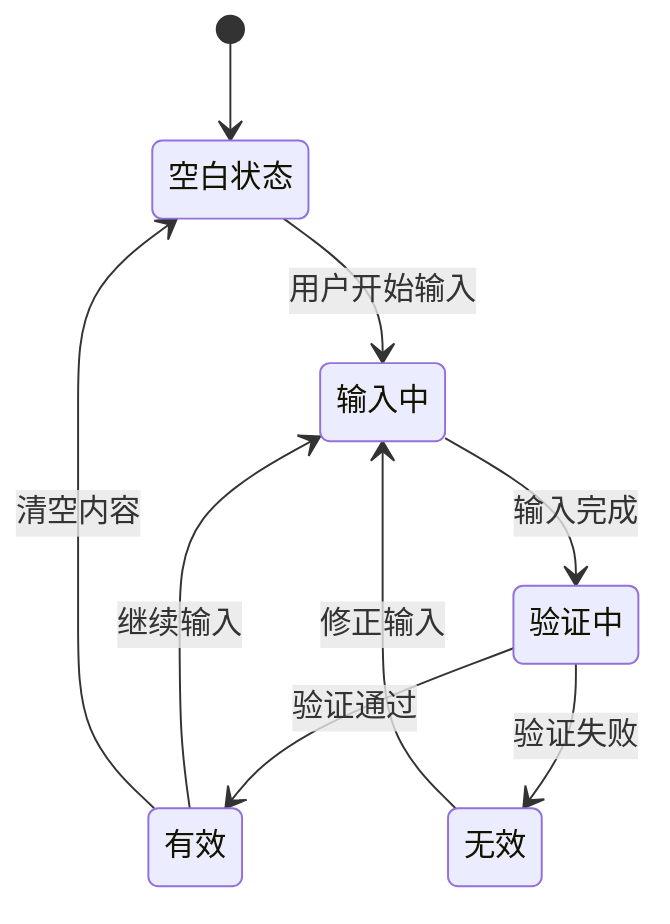

**图表来源**
- [EntryBuilder.php](file://src/Components/EntryBuilder.php#L38-L50)

**章节来源**
- [EntryBuilder.php](file://src/Components/EntryBuilder.php#L1-L80)

### MultilineEntryBuilder - 多行输入框

多行输入框支持多行文本输入，提供换行控制和最大长度限制。

#### 核心功能特性

| 方法 | 参数 | 返回值 | 描述 |
|------|------|--------|------|
| `text()` | `string $text` | `static` | 设置输入框文本 |
| `readOnly()` | `bool $readOnly` | `static` | 设置只读状态 |
| `wordWrap()` | `bool $wordWrap` | `static` | 设置是否换行 |
| `placeholder()` | `string $placeholder` | `static` | 设置占位符文本 |

#### 默认配置

| 配置项 | 类型 | 默认值 | 描述 |
|--------|------|--------|------|
| `text` | `string` | `''` | 输入框初始文本 |
| `readOnly` | `bool` | `false` | 是否只读 |
| `wordWrap` | `bool` | `true` | 是否自动换行 |
| `maxLength` | `int` | `null` | 最大字符数限制 |
| `placeholder` | `string` | `''` | 占位符提示文本 |
| `onChange` | `callable` | `null` | 内容变更回调 |

#### 换行处理机制

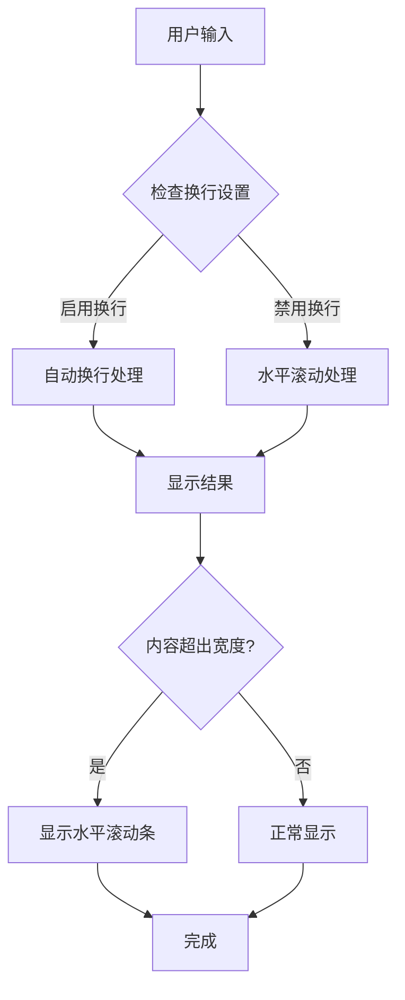

**图表来源**
- [MultilineEntryBuilder.php](file://src/Components/MultilineEntryBuilder.php#L25-L27)

**章节来源**
- [MultilineEntryBuilder.php](file://src/Components/MultilineEntryBuilder.php#L1-L86)

### CheckboxBuilder - 复选框

复选框提供二进制选择功能，支持三态模式和复杂的交互逻辑。

#### 核心功能特性

| 方法 | 参数 | 返回值 | 描述 |
|------|------|--------|------|
| `text()` | `string $text` | `static` | 设置复选框标签 |
| `checked()` | `bool $checked` | `static` | 设置选中状态 |
| `disabled()` | `bool $disabled` | `static` | 设置禁用状态 |
| `onToggle()` | `callable $callback` | `static` | 设置切换事件处理器 |
| `toggle()` | 无 | `static` | 手动切换状态 |

#### 默认配置

| 配置项 | 类型 | 默认值 | 描述 |
|--------|------|--------|------|
| `text` | `string` | `''` | 复选框标签文本 |
| `checked` | `bool` | `false` | 是否默认选中 |
| `disabled` | `bool` | `false` | 是否禁用 |
| `tristate` | `bool` | `false` | 是否启用三态模式 |
| `onToggle` | `callable` | `null` | 切换事件回调 |
| `onChange` | `callable` | `null` | 变更事件回调 |

#### 三态支持

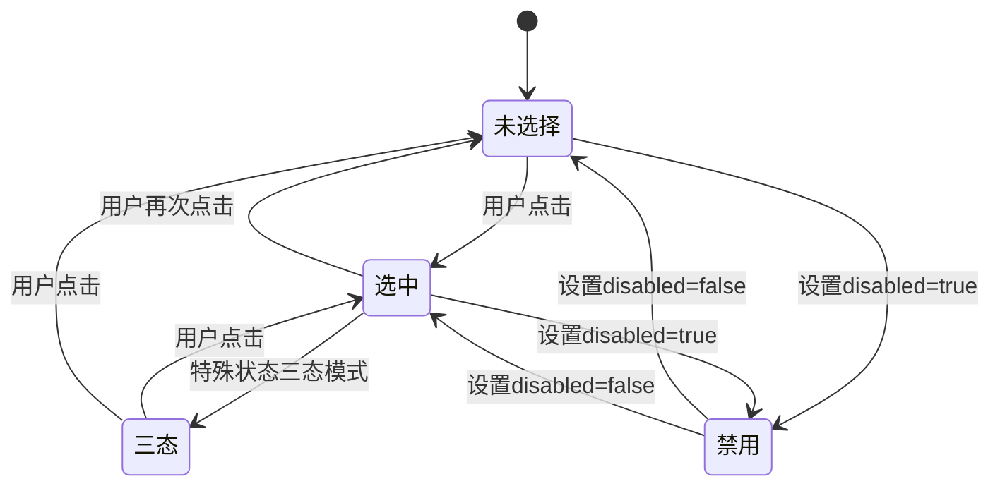

**图表来源**
- [CheckboxBuilder.php](file://src/Components/CheckboxBuilder.php#L39-L53)

**章节来源**
- [CheckboxBuilder.php](file://src/Components/CheckboxBuilder.php#L1-L97)

### RadioBuilder - 单选按钮组

单选按钮组用于在多个选项中进行唯一选择，支持动态添加选项和事件处理。

#### 核心功能特性

| 方法 | 参数 | 返回值 | 描述 |
|------|------|--------|------|
| `items()` | `array $items` | `static` | 设置选项列表 |
| `addItem()` | `string $text, mixed $value` | `static` | 添加单个选项 |
| `selected()` | `int $selected` | `static` | 设置默认选中项 |
| `onSelected()` | `callable $callback` | `static` | 设置选择事件处理器 |

#### 默认配置

| 配置项 | 类型 | 默认值 | 描述 |
|--------|------|--------|------|
| `items` | `array` | `[]` | 选项列表 |
| `selected` | `int` | `-1` | 默认选中索引 |
| `onSelected` | `callable` | `null` | 选择事件回调 |

#### 选项管理流程

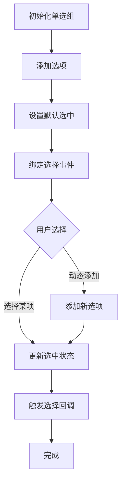

**图表来源**
- [RadioBuilder.php](file://src/Components/RadioBuilder.php#L28-L48)

**章节来源**
- [RadioBuilder.php](file://src/Components/RadioBuilder.php#L1-L80)

## 状态管理系统

基础控件与状态管理系统紧密集成，实现了双向数据绑定和事件驱动的架构。

### ComponentRef - 组件引用

ComponentRef类提供了跨组件通信的能力，允许一个组件访问另一个组件的状态和方法：

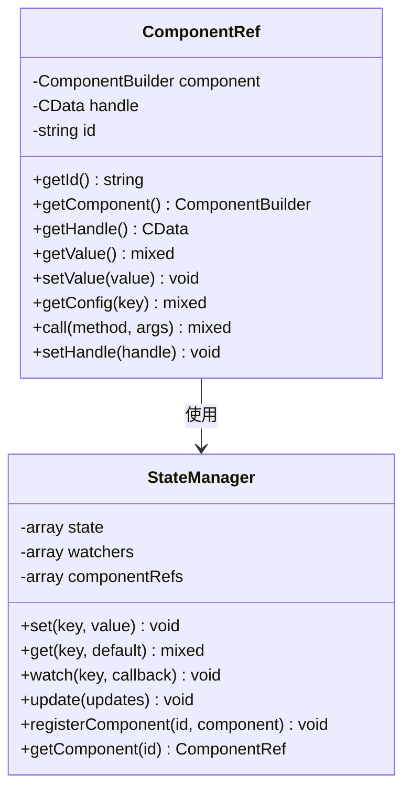

**图表来源**
- [ComponentRef.php](file://src/State/ComponentRef.php#L11-L74)
- [StateManager.php](file://src/State/StateManager.php#L8-L91)

### 数据绑定机制

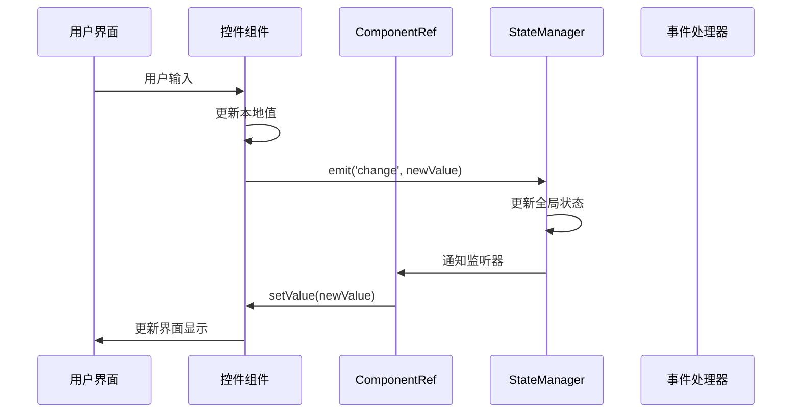

**图表来源**
- [ComponentBuilder.php](file://src/ComponentBuilder.php#L160-L174)

**章节来源**
- [ComponentRef.php](file://src/State/ComponentRef.php#L1-L74)
- [StateManager.php](file://src/State/StateManager.php#L1-L91)

## HTML模板集成

基础控件支持通过HTML模板进行声明式构建，提供了灵活的界面设计能力。

### HTML标签映射

| PHP类 | HTML标签 | 主要属性 |
|-------|----------|----------|
| `ButtonBuilder` | `<ui-button>` | `text`, `onclick` |
| `LabelBuilder` | `<ui-label>` | `text`, `align`, `color` |
| `EntryBuilder` | `<ui-input>` | `placeholder`, `readonly`, `onchange` |
| `MultilineEntryBuilder` | `<ui-input>` | `type="multiline"`, `wordwrap` |
| `CheckboxBuilder` | `<ui-checkbox>` | `text`, `checked`, `disabled` |
| `RadioBuilder` | `<ui-radio>` | `selected`, `onselected` |

### 模板语法示例

```html
<!-- 基础按钮 -->
<button id="submitBtn" onclick="handleSubmit">提交</button>

<!-- 输入框 -->
<input 
    id="username"
    bind="username"
    placeholder="请输入用户名"
    onchange="validateUsername"
/>

<!-- 复选框 -->
<checkbox id="terms" checked="false" ontoggle="handleTermsToggle">
    我已阅读并同意用户协议
</checkbox>

<!-- 单选按钮组 -->
<radio id="gender" selected="0" onselected="handleGenderSelect">
    <option>男</option>
    <option>女</option>
    <option>其他</option>
</radio>
```

### 属性绑定方式

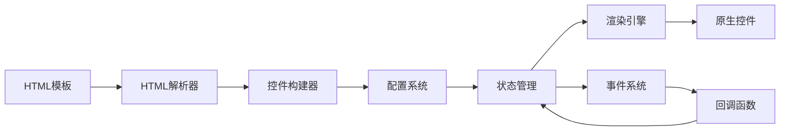

**图表来源**
- [login.ui.html](file://example/views/login.ui.html#L1-L49)
- [full.ui.html](file://example/views/full.ui.html#L1-L126)

**章节来源**
- [login.ui.html](file://example/views/login.ui.html#L1-L49)
- [full.ui.html](file://example/views/full.ui.html#L1-L126)

## 最佳实践

### Accessibility支持

所有基础控件都内置了无障碍访问支持：

1. **键盘导航**: 支持Tab键导航和快捷键操作
2. **屏幕阅读器**: 正确的语义化标签和ARIA属性
3. **高对比度**: 支持系统主题和高对比度模式
4. **焦点管理**: 合理的焦点顺序和可见焦点指示器

### 输入验证策略

推荐使用FormValidator类进行表单验证：

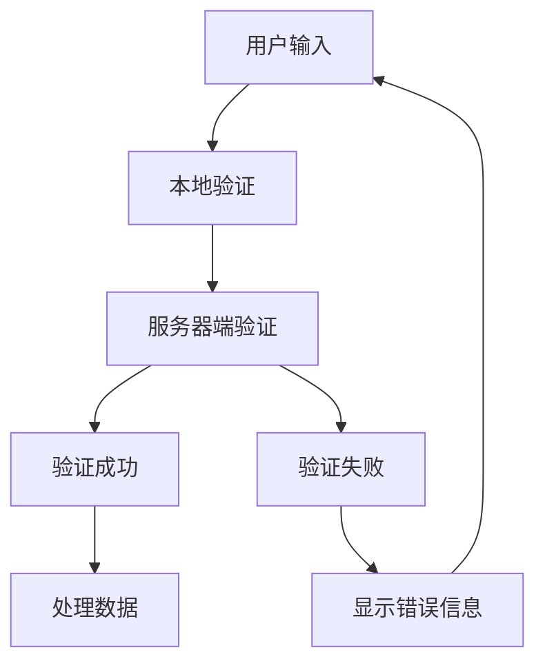

**图表来源**
- [FormValidator.php](file://src/Validation/FormValidator.php#L1-L51)

### 性能优化建议

1. **延迟加载**: 对于大型表单，采用分步加载策略
2. **事件节流**: 避免频繁的事件触发导致性能问题
3. **内存管理**: 及时清理不再使用的组件引用
4. **批量更新**: 使用StateManager的批量更新功能

### 错误处理模式

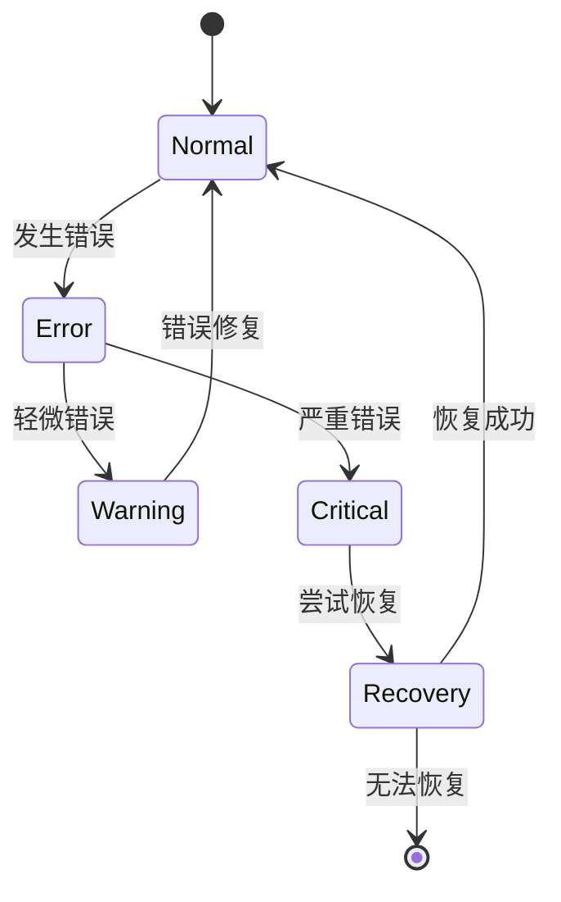

**章节来源**
- [FormValidator.php](file://src/Validation/FormValidator.php#L1-L51)

## 故障排除指南

### 常见问题及解决方案

| 问题 | 原因 | 解决方案 |
|------|------|----------|
| 控件无法响应事件 | 事件处理器未正确绑定 | 检查`onClick`、`onChange`等方法调用 |
| 数据绑定失效 | 状态键名不匹配 | 确认`bind()`方法的参数与StateManager一致 |
| 组件引用为空 | 组件ID未正确设置 | 使用`id()`方法设置唯一标识符 |
| 内存泄漏 | 组件未正确销毁 | 实现适当的清理逻辑 |

### 调试技巧

1. **状态监控**: 使用`StateManager::dump()`查看当前状态
2. **事件追踪**: 在事件处理器中添加日志输出
3. **组件树检查**: 使用`ComponentBuilder::build()`调试构建过程
4. **性能分析**: 监控事件触发频率和处理时间

### 兼容性注意事项

- 确保PHP版本符合要求（建议8.1+）
- 检查FFI扩展是否已启用
- 验证libui库的版本兼容性
- 测试不同操作系统下的行为差异

**章节来源**
- [StateManager.php](file://src/State/StateManager.php#L87-L91)
- [ComponentBuilder.php](file://src/ComponentBuilder.php#L114-L120)

## 结论

libuiBuilder的基础控件系统提供了强大而灵活的界面构建能力。通过统一的链式调用接口、完善的事件系统和状态管理集成，开发者可以快速构建功能丰富的桌面应用程序。

### 主要优势

1. **一致性**: 所有控件遵循相同的API设计原则
2. **可扩展性**: 易于添加新的控件类型和功能
3. **可维护性**: 清晰的代码结构和文档支持
4. **性能**: 优化的渲染和事件处理机制

### 发展方向

- 增强无障碍访问功能
- 扩展更多的输入验证规则
- 改进HTML模板的语法糖
- 优化大型表单的性能表现

通过合理运用这些基础控件，开发者可以构建出既美观又实用的桌面应用程序界面。