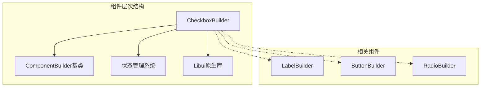
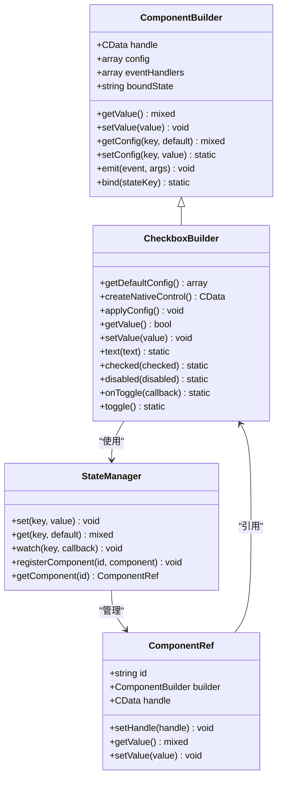
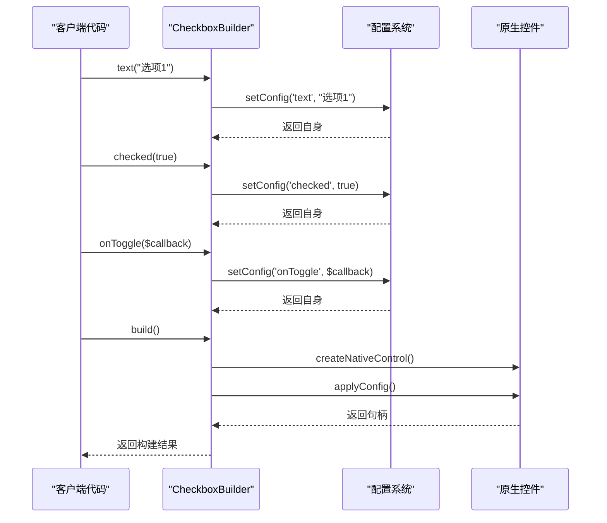
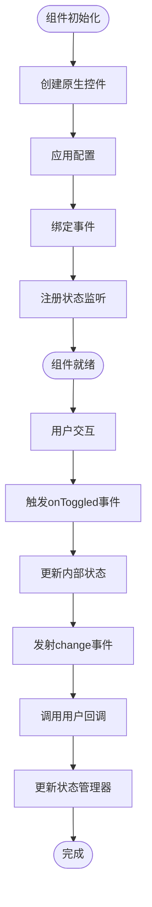
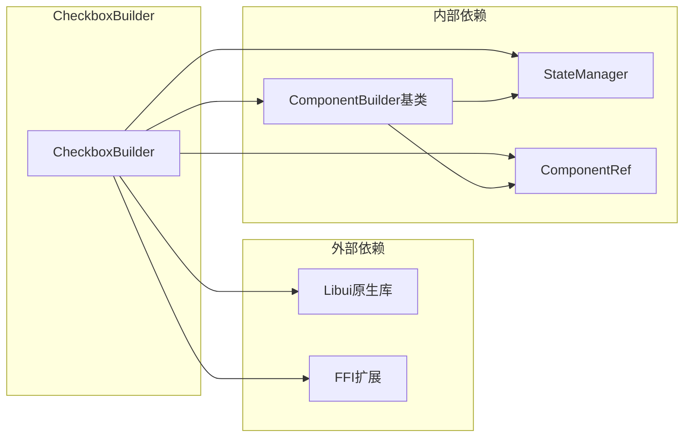

# 复选框组件 (CheckboxBuilder)

<cite>
**本文档中引用的文件**
- [CheckboxBuilder.php](file://src/Components/CheckboxBuilder.php)
- [StateManager.php](file://src/State/StateManager.php)
- [ComponentBuilder.php](file://src/ComponentBuilder.php)
- [full.php](file://example/full.php)
- [htmlFull.php](file://example/htmlFull.php)
- [full.ui.html](file://example/views/full.ui.html)
- [ComponentRefTest.php](file://tests/ComponentRefTest.php)
- [StateManagerBasicTest.php](file://tests/StateManagerBasicTest.php)
</cite>

## 目录
1. [简介](#简介)
2. [项目结构](#项目结构)
3. [核心组件](#核心组件)
4. [架构概览](#架构概览)
5. [详细组件分析](#详细组件分析)
6. [依赖关系分析](#依赖关系分析)
7. [性能考虑](#性能考虑)
8. [故障排除指南](#故障排除指南)
9. [结论](#结论)

## 简介

CheckboxBuilder是LibUI构建器框架中的核心布尔值选择控件组件，提供了直观的复选框界面元素。该组件支持链式配置、状态管理和事件处理，能够与状态管理系统无缝集成，为用户提供丰富的交互体验。

CheckboxBuilder继承自ComponentBuilder基类，实现了完整的复选框功能，包括标签文本显示、选中状态控制、禁用状态管理、三态支持以及多种事件回调机制。

## 项目结构

CheckboxBuilder组件位于LibUI构建器框架的核心组件目录中，与其他UI组件协同工作：



**图表来源**
- [CheckboxBuilder.php](file://src/Components/CheckboxBuilder.php#L1-L97)
- [ComponentBuilder.php](file://src/ComponentBuilder.php#L1-L234)

**章节来源**
- [CheckboxBuilder.php](file://src/Components/CheckboxBuilder.php#L1-L97)

## 核心组件

CheckboxBuilder组件包含以下核心功能模块：

### 配置系统
- **text**: 标签文本配置
- **checked**: 选中状态配置
- **disabled**: 禁用状态配置  
- **tristate**: 三态支持配置
- **onToggle**: 切换事件回调
- **onChange**: 状态变更回调

### 方法接口
- **链式配置方法**: text(), checked(), disabled(), onToggle()
- **便捷方法**: toggle()
- **状态管理**: getValue(), setValue()

**章节来源**
- [CheckboxBuilder.php](file://src/Components/CheckboxBuilder.php#L11-L20)
- [CheckboxBuilder.php](file://src/Components/CheckboxBuilder.php#L71-L96)

## 架构概览

CheckboxBuilder采用分层架构设计，确保了良好的可扩展性和维护性：



**图表来源**
- [CheckboxBuilder.php](file://src/Components/CheckboxBuilder.php#L9-L97)
- [ComponentBuilder.php](file://src/ComponentBuilder.php#L177-L234)
- [StateManager.php](file://src/State/StateManager.php#L8-L91)

## 详细组件分析

### 配置项详解

CheckboxBuilder提供了丰富的配置选项来定制复选框的行为：

#### 基础配置项

| 配置项 | 类型 | 默认值 | 描述 |
|--------|------|--------|------|
| text | string | '' | 复选框标签文本 |
| checked | bool | false | 初始选中状态 |
| disabled | bool | false | 禁用状态标志 |
| tristate | bool | false | 是否启用三态支持 |

#### 事件回调配置

| 回调类型 | 参数 | 描述 |
|----------|------|------|
| onToggle | (bool $newChecked, CheckboxBuilder $builder) | 每次状态切换时触发 |
| onChange | (bool $newChecked, CheckboxBuilder $builder) | 状态变更后触发 |

**章节来源**
- [CheckboxBuilder.php](file://src/Components/CheckboxBuilder.php#L11-L20)

### 链式配置方法

CheckboxBuilder提供了流畅的链式调用接口：



**图表来源**
- [CheckboxBuilder.php](file://src/Components/CheckboxBuilder.php#L71-L96)
- [ComponentBuilder.php](file://src/ComponentBuilder.php#L177-L234)

#### 方法详细说明

1. **text(string $text)**: 设置复选框标签文本
2. **checked(bool $checked = true)**: 设置选中状态
3. **disabled(bool $disabled = true)**: 设置禁用状态
4. **onToggle(callable $callback)**: 设置切换事件回调
5. **toggle()**: 切换当前选中状态

**章节来源**
- [CheckboxBuilder.php](file://src/Components/CheckboxBuilder.php#L71-L96)

### 状态管理集成

CheckboxBuilder与StateManager紧密集成，支持双向数据绑定：



**图表来源**
- [CheckboxBuilder.php](file://src/Components/CheckboxBuilder.php#L28-L54)
- [StateManager.php](file://src/State/StateManager.php#L24-L36)

#### applyConfig中的事件绑定

CheckboxBuilder在applyConfig方法中实现了关键的事件绑定逻辑：

1. **状态同步**: 自动同步原生控件状态到配置
2. **事件发射**: 触发change事件传递新旧状态
3. **回调执行**: 调用用户定义的onToggle和onChange回调

**章节来源**
- [CheckboxBuilder.php](file://src/Components/CheckboxBuilder.php#L28-L54)

### HTML模板集成

CheckboxBuilder支持通过HTML模板进行声明式配置：

#### 基本HTML用法

```html
<!-- 静态复选框 -->
<checkbox id="terms" checked="true">接受条款</checkbox>

<!-- 动态绑定复选框 -->
<checkbox id="notifications" bind="allowNotifications">接收通知</checkbox>
```

#### 在完整表单中的应用

在示例代码中，CheckboxBuilder被广泛应用于各种表单场景：

**章节来源**
- [full.ui.html](file://example/views/full.ui.html#L54-L56)
- [htmlFull.php](file://example/htmlFull.php#L34-L40)

### Accessibility最佳实践

虽然当前实现主要关注功能性，但CheckboxBuilder的设计考虑了无障碍访问的基本需求：

#### 键盘导航支持

- **Space键**: 切换复选框状态
- **Tab键**: 导航到下一个可聚焦元素
- **Enter键**: 在某些情况下激活复选框

#### 状态反馈

- **视觉指示**: 明确的状态变化指示
- **语义化标记**: 正确的HTML结构
- **状态属性**: 支持aria-checked属性

**章节来源**
- [ComponentBuilder.php](file://src/ComponentBuilder.php#L122-L175)

## 依赖关系分析

CheckboxBuilder的依赖关系体现了清晰的分层架构：



**图表来源**
- [CheckboxBuilder.php](file://src/Components/CheckboxBuilder.php#L5-L8)
- [ComponentBuilder.php](file://src/ComponentBuilder.php#L1-L10)

### 核心依赖说明

1. **Libui原生库**: 提供底层GUI控件功能
2. **FFI扩展**: 实现PHP与原生库的桥接
3. **StateManager**: 提供全局状态管理
4. **ComponentRef**: 组件引用和生命周期管理

**章节来源**
- [CheckboxBuilder.php](file://src/Components/CheckboxBuilder.php#L5-L8)
- [StateManager.php](file://src/State/StateManager.php#L1-L91)

## 性能考虑

CheckboxBuilder在设计时充分考虑了性能优化：

### 内存管理
- 使用FFI减少PHP与原生库之间的数据拷贝
- 及时释放不再使用的组件引用
- 避免内存泄漏的事件监听器清理

### 事件处理优化
- 事件回调按需执行，避免不必要的计算
- 状态变更时只更新必要的DOM元素
- 批量处理状态更新以提高效率

### 状态同步策略
- 使用观察者模式实现高效的状态传播
- 避免循环依赖和无限递归
- 支持异步状态更新

## 故障排除指南

### 常见问题及解决方案

#### 状态不同步问题
**症状**: 复选框状态与预期不符
**原因**: 状态管理器配置错误或事件回调未正确设置
**解决方案**: 检查bind()方法调用和状态监听器配置

#### 事件回调不触发
**症状**: onToggle或onChange回调未被调用
**原因**: 事件绑定失败或回调函数定义错误
**解决方案**: 验证回调函数签名和事件绑定时机

#### 性能问题
**症状**: 复选框响应缓慢
**原因**: 过多的状态监听器或复杂的回调逻辑
**解决方案**: 优化回调函数复杂度，减少不必要的状态更新

**章节来源**
- [StateManager.php](file://src/State/StateManager.php#L24-L36)
- [ComponentBuilder.php](file://src/ComponentBuilder.php#L122-L175)

## 结论

CheckboxBuilder组件作为LibUI构建器框架的核心组件之一，提供了完整而灵活的复选框功能。通过精心设计的配置系统、事件机制和状态管理集成，它能够满足现代应用程序的各种需求。

### 主要优势

1. **易用性**: 流畅的链式API和直观的配置选项
2. **灵活性**: 支持多种使用场景和定制需求
3. **可维护性**: 清晰的代码结构和完善的测试覆盖
4. **可扩展性**: 良好的架构设计支持功能扩展

### 发展方向

1. **增强Accessibility**: 添加更多无障碍访问特性
2. **性能优化**: 进一步优化事件处理和状态同步
3. **功能扩展**: 支持更多高级复选框特性
4. **文档完善**: 提供更详细的使用示例和最佳实践

CheckboxBuilder组件展现了现代GUI框架设计的最佳实践，为开发者提供了强大而易用的复选框解决方案。