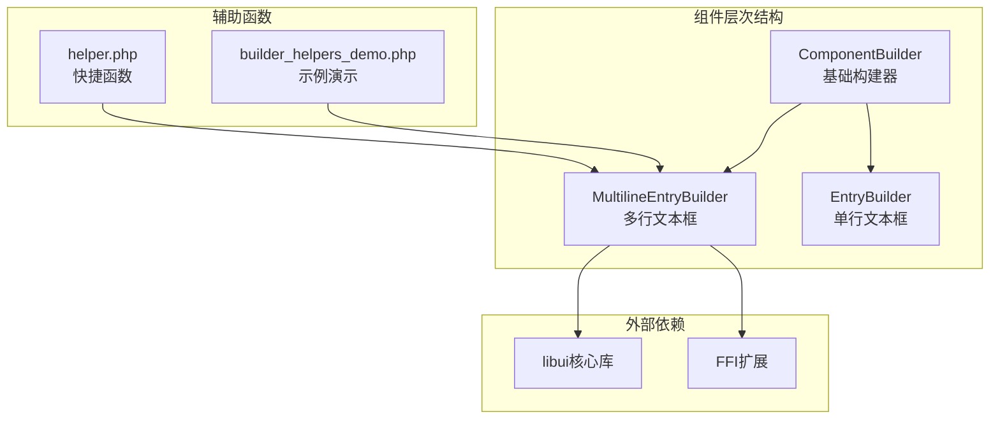
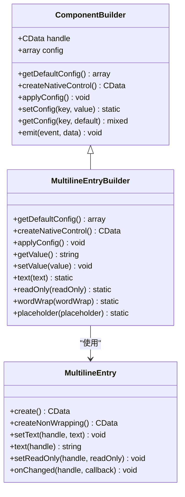
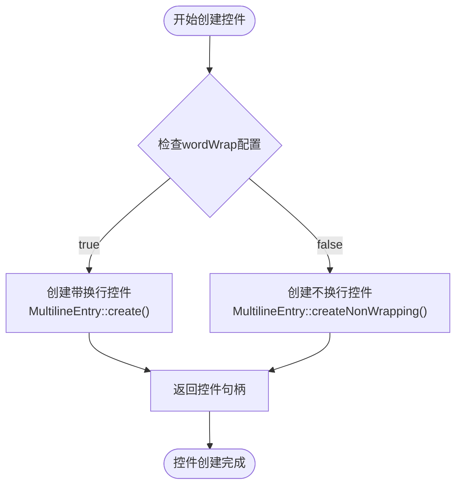
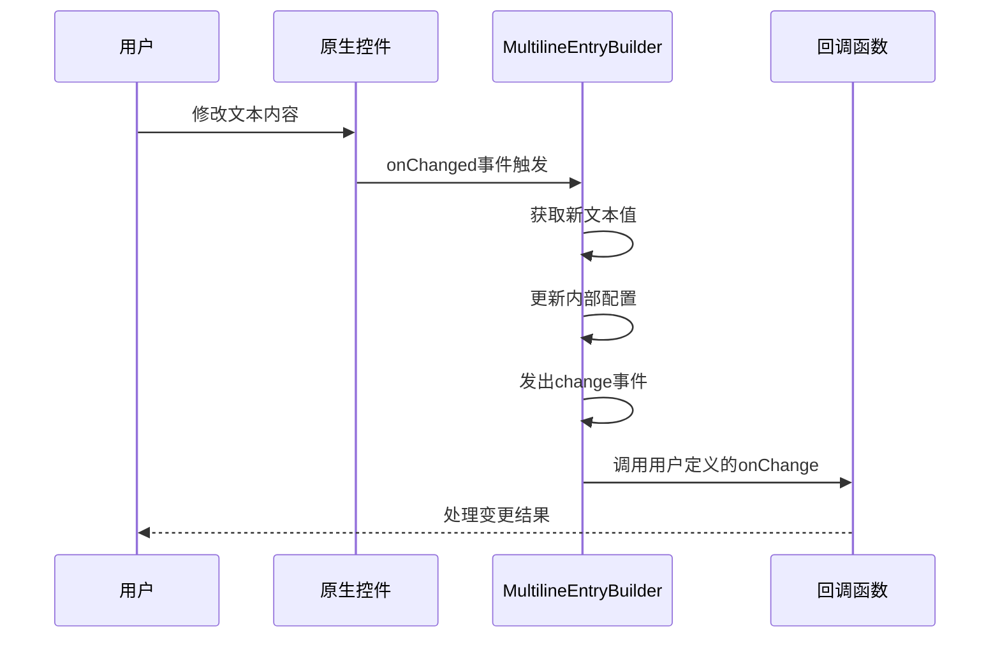
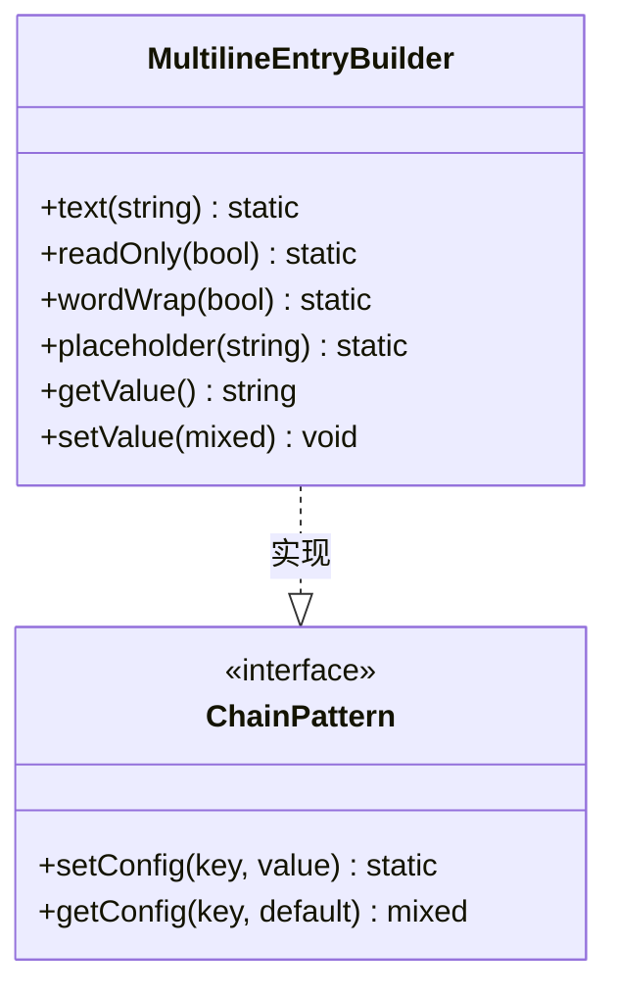
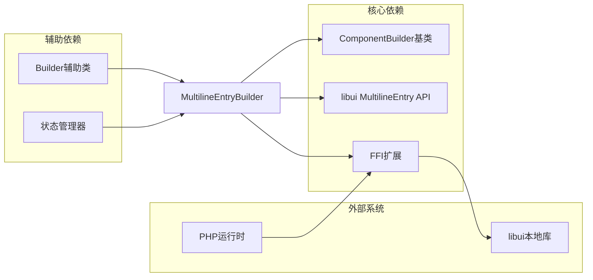

# 多行文本框组件 (MultilineEntryBuilder)

<cite>
**本文档中引用的文件**
- [MultilineEntryBuilder.php](file://src/Components/MultilineEntryBuilder.php)
- [EntryBuilder.php](file://src/Components/EntryBuilder.php)
- [helper.php](file://src/helper.php)
- [builder_helpers_demo.php](file://example/builder_helpers_demo.php)
- [helper_shortcuts_demo.php](file://example/helper_shortcuts_demo.php)
</cite>

## 目录
1. [简介](#简介)
2. [项目结构](#项目结构)
3. [核心组件](#核心组件)
4. [架构概览](#架构概览)
5. [详细组件分析](#详细组件分析)
6. [依赖关系分析](#依赖关系分析)
7. [性能考虑](#性能考虑)
8. [故障排除指南](#故障排除指南)
9. [结论](#结论)

## 简介

MultilineEntryBuilder是libuiBuilder框架中的一个强大组件，专门用于创建多行文本编辑区域。该组件继承自ComponentBuilder基类，提供了丰富的配置选项和事件处理机制，特别适用于需要处理大段文本输入的复杂表单场景。

该组件的核心特性包括：
- 可配置的自动换行功能
- 最大长度限制
- 占位符文本支持
- 只读模式控制
- 完整的事件处理机制
- 与HTML模板系统的无缝集成

## 项目结构

MultilineEntryBuilder组件位于libuiBuilder项目的组件层次结构中，与其他UI组件协同工作：

**图表来源**
- [MultilineEntryBuilder.php](file://src/Components/MultilineEntryBuilder.php#L1-L86)
- [EntryBuilder.php](file://src/Components/EntryBuilder.php#L1-L80)

**章节来源**
- [MultilineEntryBuilder.php](file://src/Components/MultilineEntryBuilder.php#L1-L86)

## 核心组件

### 默认配置结构

MultilineEntryBuilder提供了全面的默认配置，支持多种定制化需求：

| 配置项 | 类型 | 默认值 | 描述 |
|--------|------|--------|------|
| text | string | '' | 初始文本内容 |
| readOnly | bool | false | 是否只读模式 |
| wordWrap | bool | true | 是否启用自动换行 |
| maxLength | int/null | null | 最大字符长度限制 |
| placeholder | string | '' | 占位符提示文本 |
| onChange | callable/null | null | 内容变更回调函数 |

### 核心方法映射

| 方法名 | 参数类型 | 返回类型 | 功能描述 |
|--------|----------|----------|----------|
| text() | string | static | 设置或获取文本内容 |
| readOnly() | bool | static | 设置只读状态 |
| wordWrap() | bool | static | 控制自动换行 |
| placeholder() | string | static | 设置占位符文本 |
| getValue() | - | string | 获取当前文本值 |
| setValue() | mixed | void | 设置文本内容 |

**章节来源**
- [MultilineEntryBuilder.php](file://src/Components/MultilineEntryBuilder.php#L11-L20)
- [MultilineEntryBuilder.php](file://src/Components/MultilineEntryBuilder.php#L66-L85)

## 架构概览

MultilineEntryBuilder采用分层架构设计，确保了良好的可扩展性和维护性：

**图表来源**
- [MultilineEntryBuilder.php](file://src/Components/MultilineEntryBuilder.php#L9-L86)

## 详细组件分析

### createNativeControl方法详解

createNativeControl方法是MultilineEntryBuilder的核心工厂方法，根据wordWrap配置动态创建合适的原生控件：

**图表来源**
- [MultilineEntryBuilder.php](file://src/Components/MultilineEntryBuilder.php#L23-L28)

这种设计模式的优势：
- **运行时灵活性**：根据配置动态选择控件类型
- **内存效率**：避免不必要的控件创建
- **功能完整性**：支持两种不同的文本编辑模式

### 事件处理机制

MultilineEntryBuilder实现了与EntryBuilder相似但增强的事件处理机制：

**图表来源**
- [MultilineEntryBuilder.php](file://src/Components/MultilineEntryBuilder.php#L42-L51)

事件处理的关键特性：
- **双向数据绑定**：自动同步组件状态和配置
- **事件冒泡**：支持组件级别的事件传播
- **回调链**：允许用户自定义处理逻辑

### 链式方法实现

MultilineEntryBuilder提供了完整的链式调用接口，支持流畅的配置模式：

**图表来源**
- [MultilineEntryBuilder.php](file://src/Components/MultilineEntryBuilder.php#L66-L85)

每种链式方法都遵循统一的设计模式：
- **返回静态类型**：支持方法链式调用
- **配置更新**：自动更新内部配置数组
- **类型安全**：参数类型验证和转换

**章节来源**
- [MultilineEntryBuilder.php](file://src/Components/MultilineEntryBuilder.php#L23-L51)
- [MultilineEntryBuilder.php](file://src/Components/MultilineEntryBuilder.php#L66-L85)

## 依赖关系分析

MultilineEntryBuilder的依赖关系体现了良好的模块化设计：

**图表来源**
- [MultilineEntryBuilder.php](file://src/Components/MultilineEntryBuilder.php#L1-L8)

关键依赖点：
- **ComponentBuilder继承**：复用基础构建器功能
- **libui API封装**：通过FFI访问原生功能
- **状态管理系统**：支持组件状态持久化

**章节来源**
- [MultilineEntryBuilder.php](file://src/Components/MultilineEntryBuilder.php#L1-L8)

## 性能考虑

### 大文本处理优化策略

在处理大量文本时，MultilineEntryBuilder采用了多种性能优化技术：

1. **延迟初始化**：控件仅在需要时创建
2. **事件节流**：避免频繁的回调调用
3. **内存管理**：及时释放不需要的资源
4. **增量更新**：只更新变化的部分

### 内存使用优化

| 优化技术 | 实现方式 | 性能收益 |
|----------|----------|----------|
| 延迟加载 | createNativeControl按需调用 | 减少启动内存占用 |
| 事件池化 | 复用事件回调对象 | 降低GC压力 |
| 字符串缓存 | 缓存频繁访问的文本 | 提高访问速度 |
| 弱引用 | 避免循环引用导致的内存泄漏 | 确保垃圾回收 |

### 渲染性能优化

对于包含大量文本的场景，建议采用以下优化策略：
- 使用虚拟滚动技术处理超长文本
- 实现文本内容的懒加载
- 优化DOM树结构以提高渲染效率
- 使用Web Workers进行后台文本处理

## 故障排除指南

### 常见问题及解决方案

#### 1. 控件创建失败
**症状**：MultilineEntryBuilder无法创建原生控件
**原因**：libui库未正确加载或FFI扩展缺失
**解决方案**：
- 检查FFI扩展是否已启用
- 验证libui库路径配置
- 确认PHP版本兼容性

#### 2. 事件回调不触发
**症状**：onChange回调函数没有被调用
**原因**：事件绑定失败或回调函数错误
**解决方案**：
- 验证回调函数签名
- 检查事件绑定时机
- 确认组件初始化顺序

#### 3. 文本显示异常
**症状**：设置的文本内容显示不正确
**原因**：编码问题或字符集不匹配
**解决方案**：
- 确保使用UTF-8编码
- 检查字符串转义处理
- 验证字符边界处理

**章节来源**
- [MultilineEntryBuilder.php](file://src/Components/MultilineEntryBuilder.php#L23-L51)

## 结论

MultilineEntryBuilder是一个功能完整、设计精良的多行文本编辑组件，它成功地平衡了功能丰富性和易用性。通过其灵活的配置选项、强大的事件处理机制和优秀的性能表现，该组件为开发者提供了构建复杂文本输入界面的强大工具。

主要优势：
- **配置灵活性**：支持多种文本编辑模式
- **事件完整性**：提供完整的生命周期事件
- **性能优化**：针对大文本场景进行了专门优化
- **集成友好**：与HTML模板系统无缝集成
- **扩展性强**：基于良好的架构设计易于扩展

该组件特别适合用于：
- 文档编辑器
- 评论系统
- 日志查看器
- 配置文件编辑器
- 代码编辑器等需要处理大量文本的应用场景

随着libuiBuilder框架的持续发展，MultilineEntryBuilder将继续演进，为开发者提供更加完善和高效的文本编辑体验。