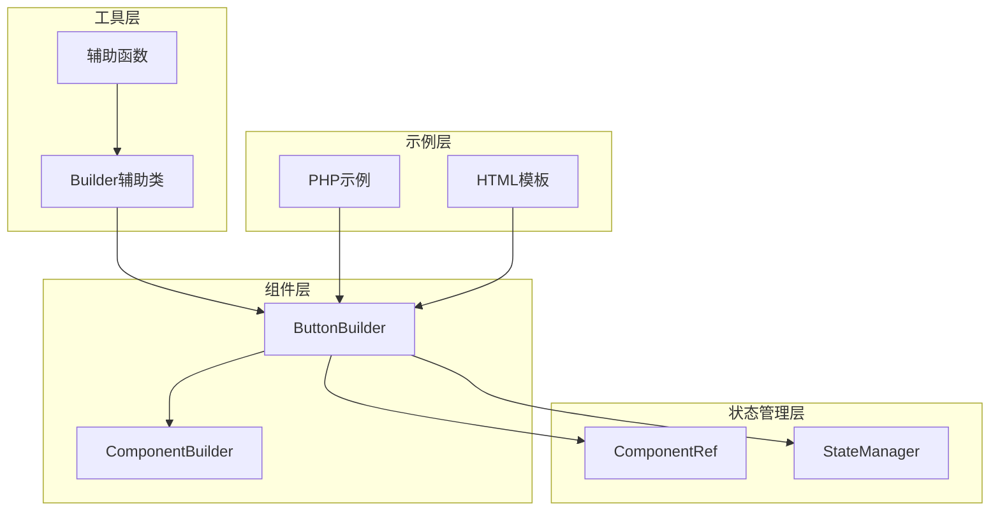
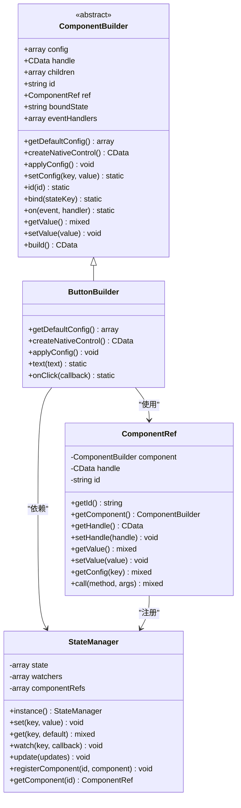
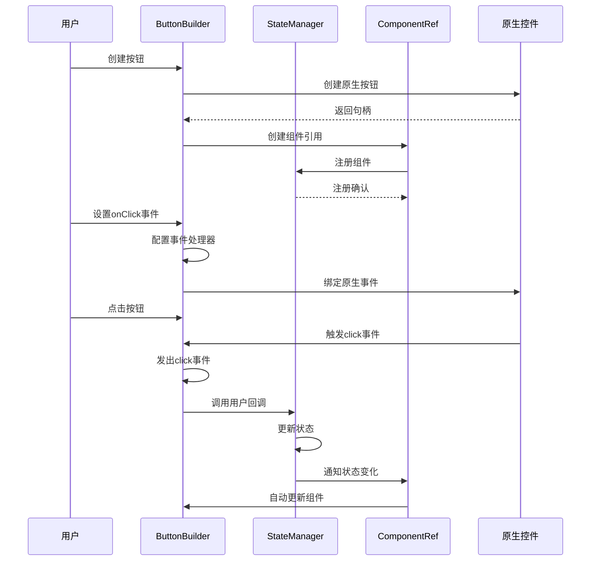
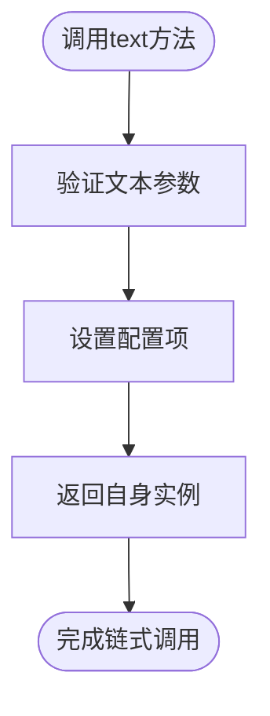
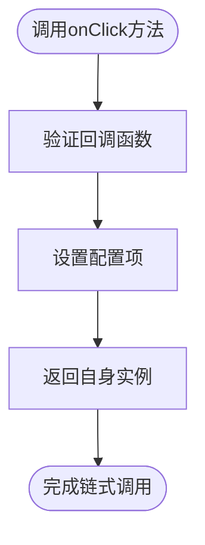
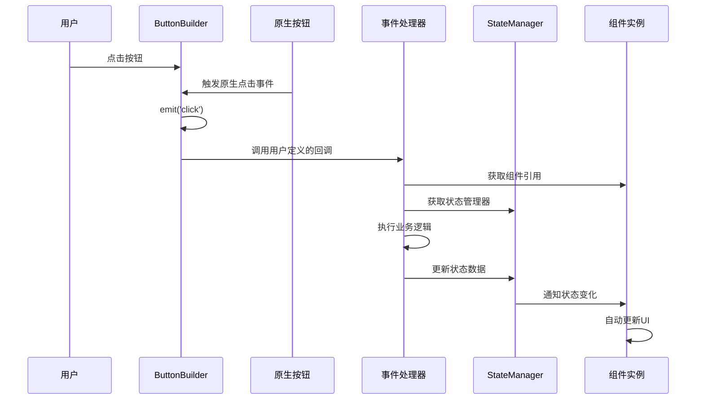
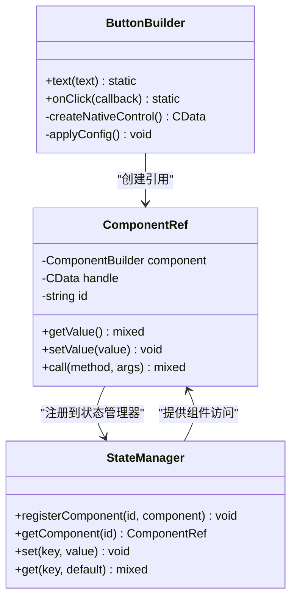
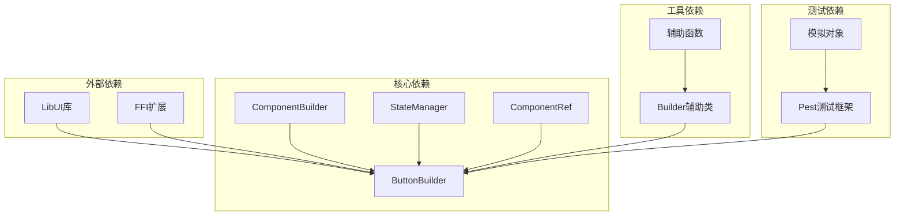

# 按钮组件 (ButtonBuilder)

<cite>
**本文档中引用的文件**
- [ButtonBuilder.php](file://src/Components/ButtonBuilder.php)
- [ComponentBuilder.php](file://src/ComponentBuilder.php)
- [ComponentRef.php](file://src/State/ComponentRef.php)
- [StateManager.php](file://src/State/StateManager.php)
- [builder_helpers_demo.php](file://example/builder_helpers_demo.php)
- [BuilderComponentsTest.php](file://tests/BuilderComponentsTest.php)
- [calculator.php](file://example/calculator.php)
- [calculator_html.php](file://example/calculator_html.php)
- [login.ui.html](file://example/views/login.ui.html)
- [calculator.ui.html](file://example/views/calculator.ui.html)
</cite>

## 目录
1. [简介](#简介)
2. [项目结构](#项目结构)
3. [核心组件](#核心组件)
4. [架构概览](#架构概览)
5. [详细组件分析](#详细组件分析)
6. [依赖关系分析](#依赖关系分析)
7. [性能考虑](#性能考虑)
8. [故障排除指南](#故障排除指南)
9. [结论](#结论)

## 简介

ButtonBuilder是LibUI Builder框架中的核心可点击按钮控件组件，提供了丰富的链式调用API来创建和配置按钮。该组件支持文本显示、事件处理、状态管理和响应式交互，是构建现代桌面应用程序用户界面的重要基础组件。

ButtonBuilder继承自ComponentBuilder抽象类，遵循统一的组件构建模式，同时提供了专门针对按钮特性的配置选项和事件处理机制。它不仅支持传统的编程式创建方式，还兼容HTML模板语法，为开发者提供了灵活的界面构建选择。

## 项目结构

ButtonBuilder组件在项目中的组织结构体现了清晰的分层架构设计：



**图表来源**
- [ButtonBuilder.php](file://src/Components/ButtonBuilder.php#L1-L48)
- [ComponentBuilder.php](file://src/ComponentBuilder.php#L1-L234)
- [StateManager.php](file://src/State/StateManager.php#L1-L91)

**章节来源**
- [ButtonBuilder.php](file://src/Components/ButtonBuilder.php#L1-L48)
- [ComponentBuilder.php](file://src/ComponentBuilder.php#L1-L234)

## 核心组件

### ButtonBuilder类结构

ButtonBuilder类作为按钮组件的核心实现，提供了完整的按钮功能支持：



**图表来源**
- [ButtonBuilder.php](file://src/Components/ButtonBuilder.php#L9-L48)
- [ComponentBuilder.php](file://src/ComponentBuilder.php#L11-L234)
- [ComponentRef.php](file://src/State/ComponentRef.php#L11-L74)
- [StateManager.php](file://src/State/StateManager.php#L8-L91)

**章节来源**
- [ButtonBuilder.php](file://src/Components/ButtonBuilder.php#L9-L48)
- [ComponentBuilder.php](file://src/ComponentBuilder.php#L11-L234)
- [ComponentRef.php](file://src/State/ComponentRef.php#L11-L74)
- [StateManager.php](file://src/State/StateManager.php#L8-L91)

## 架构概览

ButtonBuilder采用分层架构设计，实现了组件化、模块化的界面构建系统：



**图表来源**
- [ButtonBuilder.php](file://src/Components/ButtonBuilder.php#L25-L36)
- [ComponentBuilder.php](file://src/ComponentBuilder.php#L160-L175)
- [StateManager.php](file://src/State/StateManager.php#L24-L36)
- [ComponentRef.php](file://src/State/ComponentRef.php#L46-L57)

## 详细组件分析

### 默认配置项详解

ButtonBuilder提供了三个核心配置项，每个都有特定的作用和意义：

| 配置项 | 类型 | 默认值 | 描述 |
|--------|------|--------|------|
| text | string | 'Button' | 按钮上显示的文本内容 |
| onClick | callable | null | 点击事件的回调处理器 |
| stretchy | boolean | false | 是否允许按钮拉伸以填充可用空间 |

#### text配置项
- **作用**: 设置按钮的显示文本
- **默认值**: 'Button'
- **使用场景**: 用于标识按钮的功能或操作
- **链式调用**: 通过`text()`方法设置

#### onClick配置项  
- **作用**: 定义按钮点击时的事件处理器
- **参数**: 接收两个参数 - 组件引用和状态管理器实例
- **事件触发**: 当用户点击按钮时自动调用
- **链式调用**: 通过`onClick()`方法设置

#### stretchy配置项
- **作用**: 控制按钮的尺寸行为
- **默认值**: false（不拉伸）
- **使用场景**: 在容器布局中控制按钮的扩展行为
- **影响**: 影响按钮在父容器中的尺寸分配

**章节来源**
- [ButtonBuilder.php](file://src/Components/ButtonBuilder.php#L11-L18)

### 链式调用方法

ButtonBuilder提供了两个主要的链式调用方法，支持流畅的API设计：

#### text() 方法


**图表来源**
- [ButtonBuilder.php](file://src/Components/ButtonBuilder.php#L39-L42)

#### onClick() 方法


**图表来源**
- [ButtonBuilder.php](file://src/Components/ButtonBuilder.php#L44-L47)

**章节来源**
- [ButtonBuilder.php](file://src/Components/ButtonBuilder.php#L39-L47)

### onClick事件处理器机制

onClick事件处理器是ButtonBuilder的核心功能之一，其实现涉及多个组件的协作：



**图表来源**
- [ButtonBuilder.php](file://src/Components/ButtonBuilder.php#L27-L35)
- [ComponentBuilder.php](file://src/ComponentBuilder.php#L160-L175)

#### 事件处理器参数说明

onClick回调函数接收两个关键参数：

1. **组件引用 ($this)**: 提供对当前按钮实例的访问能力
2. **状态管理器实例 ($this->state())**: 提供全局状态访问和修改能力

这种设计使得事件处理器能够：
- 访问和修改按钮自身的属性
- 读取和更新应用程序的状态
- 实现复杂的业务逻辑

**章节来源**
- [ButtonBuilder.php](file://src/Components/ButtonBuilder.php#L27-L35)
- [ComponentBuilder.php](file://src/ComponentBuilder.php#L200-L207)

### Builder API创建方式

ButtonBuilder支持多种创建方式，其中Builder API提供了最灵活的链式调用体验：

#### 基本创建示例
```php
// 使用Builder辅助类创建按钮
$button = Builder::create()
    ->newButton()
    ->text('点击我')
    ->id('myButton')
    ->onClick(function($button, $state) {
        // 事件处理逻辑
    })
    ->get();
```

#### 高级配置示例
```php
// 创建具有完整配置的按钮
$advancedButton = Builder::create()
    ->newButton()
    ->text('提交')
    ->id('submitBtn')
    ->config('stretchy', true)
    ->addEvent('click', function() {
        // 复杂事件处理
    })
    ->get();
```

**章节来源**
- [builder_helpers_demo.php](file://example/builder_helpers_demo.php#L36-L43)
- [builder_helpers_demo.php](file://example/builder_helpers_demo.php#L110-L121)

### HTML模板创建方式

ButtonBuilder也完全支持HTML模板语法，为静态界面设计提供了便利：

#### HTML模板语法
```html
<button id="loginBtn" onclick="handleLogin">登录</button>
<button onclick="handleReset">清空</button>
```

#### 带数据绑定的HTML
```html
<button id="calcBtn" onclick="handleCalculation" data-operation="add">+</button>
<button id="clearBtn" onclick="handleClear" data-number="0">C</button>
```

**章节来源**
- [login.ui.html](file://example/views/login.ui.html#L32-L35)
- [calculator.ui.html](file://example/views/calculator.ui.html#L24-L51)

### ComponentRef集成

ButtonBuilder与ComponentRef紧密集成，提供了强大的组件引用和状态管理能力：



**图表来源**
- [ButtonBuilder.php](file://src/Components/ButtonBuilder.php#L11-L18)
- [ComponentRef.php](file://src/State/ComponentRef.php#L11-L74)
- [StateManager.php](file://src/State/StateManager.php#L69-L82)

**章节来源**
- [ButtonBuilder.php](file://src/Components/ButtonBuilder.php#L11-L18)
- [ComponentRef.php](file://src/State/ComponentRef.php#L11-L74)
- [StateManager.php](file://src/State/StateManager.php#L69-L82)

### 响应式表单应用场景

ButtonBuilder在响应式表单中扮演着关键角色，特别是在需要实时状态更新的场景中：

#### 表单验证示例
```php
// 创建带有验证功能的提交按钮
$submitButton = Builder::create()
    ->newButton()
    ->text('提交')
    ->id('formSubmit')
    ->onClick(function($button, $state) {
        // 获取表单数据
        $username = $state->get('username');
        $password = $state->get('password');
        
        // 执行验证
        if (empty($username) || empty($password)) {
            $state->set('errorMessage', '用户名和密码不能为空');
            return;
        }
        
        // 执行提交逻辑
        $state->set('isLoading', true);
        // ... 异步提交处理 ...
    })
    ->get();
```

#### 动态状态更新
```php
// 创建动态更新的按钮
$toggleButton = Builder::create()
    ->newButton()
    ->text('启用')
    ->id('toggleFeature')
    ->onClick(function($button, $state) {
        $isEnabled = $state->get('featureEnabled', false);
        $newState = !$isEnabled;
        
        // 更新状态
        $state->set('featureEnabled', $newState);
        
        // 更新按钮文本
        $button->text($newState ? '禁用' : '启用');
        
        // 可能还需要更新其他相关组件
        $state->set('featureStatus', $newState ? '已启用' : '已禁用');
    })
    ->get();
```

**章节来源**
- [calculator.php](file://example/calculator.php#L97-L105)
- [calculator.php](file://example/calculator.php#L108-L112)

## 依赖关系分析

ButtonBuilder的依赖关系体现了清晰的分层架构和职责分离：



**图表来源**
- [ButtonBuilder.php](file://src/Components/ButtonBuilder.php#L1-L8)
- [ComponentBuilder.php](file://src/ComponentBuilder.php#L1-L9)
- [StateManager.php](file://src/State/StateManager.php#L1-L6)

### 核心依赖说明

1. **LibUI库**: 提供底层的原生UI控件支持
2. **FFI扩展**: 允许PHP与C语言库进行互操作
3. **ComponentBuilder**: 抽象基类，提供通用组件功能
4. **StateManager**: 全局状态管理服务
5. **ComponentRef**: 组件引用和访问代理

**章节来源**
- [ButtonBuilder.php](file://src/Components/ButtonBuilder.php#L1-L8)
- [ComponentBuilder.php](file://src/ComponentBuilder.php#L1-L9)
- [StateManager.php](file://src/State/StateManager.php#L1-L6)

## 性能考虑

在使用ButtonBuilder时，需要特别注意性能优化，特别是在高频事件处理场景中：

### 高频事件优化策略

#### 1. 避免昂贵操作
```php
// ❌ 不推荐：在高频事件中执行昂贵操作
$button->onClick(function($button, $state) {
    // 执行数据库查询、网络请求等昂贵操作
    expensiveOperation();
});

// ✅ 推荐：使用异步处理或延迟执行
$button->onClick(function($button, $state) {
    // 只记录事件，实际处理在后台进行
    queueBackgroundTask('processExpensiveOperation');
});
```

#### 2. 状态更新优化
```php
// ❌ 不推荐：频繁的状态更新
$button->onClick(function($button, $state) {
    for ($i = 0; $i < 100; $i++) {
        $state->set("item_$i", $i); // 频繁的状态更新
    }
});

// ✅ 推荐：批量更新状态
$button->onClick(function($button, $state) {
    $updates = [];
    for ($i = 0; $i < 100; $i++) {
        $updates["item_$i"] = $i;
    }
    $state->update($updates); // 批量更新
});
```

#### 3. 组件引用缓存
```php
// ✅ 推荐：缓存组件引用以提高访问效率
$button->onClick(function($button, $state) {
    static $cachedButton = null;
    if ($cachedButton === null) {
        $cachedButton = $button;
    }
    
    // 使用缓存的引用
    $cachedButton->text('更新后的文本');
});
```

### 内存管理建议

1. **及时清理事件处理器**: 在不需要时移除事件监听器
2. **避免循环引用**: 注意不要创建组件间的循环引用
3. **合理使用ComponentRef**: 避免过度使用组件引用导致内存泄漏

### 性能监控指标

- **事件处理延迟**: 监控onClick事件的响应时间
- **内存使用**: 跟踪组件创建和销毁过程中的内存消耗
- **状态更新频率**: 监控状态变化的频率和影响范围

## 故障排除指南

### 常见问题及解决方案

#### 1. 按钮点击事件不触发
**症状**: 点击按钮没有响应
**可能原因**:
- 事件处理器未正确设置
- 组件ID冲突
- 状态管理器未初始化

**解决方案**:
```php
// 检查事件处理器是否正确设置
$button = Builder::create()
    ->newButton()
    ->text('测试按钮')
    ->onClick(function($button, $state) {
        echo "按钮被点击!";
    })
    ->get();

// 确保状态管理器已初始化
StateManager::instance();
```

#### 2. 状态更新不生效
**症状**: 修改状态后界面没有更新
**可能原因**:
- 组件未正确绑定状态
- 状态键名错误
- 状态监听器未注册

**解决方案**:
```php
// 确保组件正确绑定状态
$button = Builder::create()
    ->newButton()
    ->text('状态按钮')
    ->id('statusButton')
    ->bind('buttonState') // 正确绑定状态
    ->onClick(function($button, $state) {
        $state->set('buttonState', '已点击'); // 更新绑定的状态
    })
    ->get();
```

#### 3. HTML模板事件处理失败
**症状**: HTML模板中的onclick事件不工作
**可能原因**:
- 事件处理器函数未定义
- 组件ID不匹配
- JavaScript环境问题

**解决方案**:
```php
// 确保事件处理器在JavaScript环境中可用
$handlers = [
    'handleButtonClick' => function() {
        // 处理按钮点击事件
        StateManager::instance()->set('buttonClicked', true);
    }
];

// 在HTML模板中正确引用
<button id="testBtn" onclick="handleButtonClick">测试</button>
```

**章节来源**
- [BuilderComponentsTest.php](file://tests/BuilderComponentsTest.php#L53-L64)
- [calculator.php](file://example/calculator.php#L97-L105)

## 结论

ButtonBuilder作为LibUI Builder框架的核心组件，提供了完整而灵活的按钮控件解决方案。通过其精心设计的API架构，开发者可以轻松创建功能丰富的按钮组件，支持各种交互场景和状态管理模式。

### 主要优势

1. **链式调用API**: 提供流畅的编程体验
2. **事件驱动架构**: 支持复杂的用户交互逻辑
3. **状态管理系统**: 实现响应式的界面更新
4. **多创建方式**: 兼容Builder API和HTML模板
5. **组件引用机制**: 提供强大的组件间通信能力

### 最佳实践建议

1. **合理使用事件处理器**: 避免在高频事件中执行昂贵操作
2. **充分利用状态管理**: 通过StateManager实现组件间的状态同步
3. **遵循组件化设计**: 将复杂功能分解为多个小型、专注的组件
4. **注意性能优化**: 在高频场景中实施适当的性能优化策略
5. **充分测试**: 利用提供的测试框架验证组件功能

ButtonBuilder的设计体现了现代UI框架的发展趋势，通过组件化、状态管理和事件驱动的方式，为开发者提供了强大而易用的界面构建工具。随着项目的不断发展，ButtonBuilder将继续演进，为构建更加丰富和交互式的桌面应用程序提供坚实的基础。