# 标签组件 (LabelBuilder)

<cite>
**本文档中引用的文件**
- [LabelBuilder.php](file://src/Components/LabelBuilder.php)
- [ComponentBuilder.php](file://src/ComponentBuilder.php)
- [StateManager.php](file://src/State/StateManager.php)
- [helper.php](file://src/helper.php)
- [full.ui.html](file://example/views/full.ui.html)
- [login.ui.html](file://example/views/login.ui.html)
</cite>

## 目录
1. [简介](#简介)
2. [项目结构](#项目结构)
3. [核心组件](#核心组件)
4. [架构概览](#架构概览)
5. [详细组件分析](#详细组件分析)
6. [依赖关系分析](#依赖关系分析)
7. [性能考虑](#性能考虑)
8. [故障排除指南](#故障排除指南)
9. [结论](#结论)

## 简介

LabelBuilder是libuiBuilder框架中的一个静态文本显示控件，专门用于在图形用户界面中显示不可编辑的文本内容。该组件继承自ComponentBuilder基类，提供了丰富的配置选项和链式调用方法，支持与状态管理系统进行双向数据绑定，广泛应用于界面说明、状态显示和表单标签等场景。

## 项目结构

LabelBuilder组件位于libuiBuilder项目的组件层次结构中，作为基础UI控件的一部分：

```mermaid
graph TB
subgraph "组件层次结构"
CB[ComponentBuilder<br/>基础构建器]
LB[LabelBuilder<br/>标签构建器]
UI[UI控件树]
end
subgraph "状态管理系统"
SM[StateManager<br/>状态管理器]
CR[ComponentRef<br/>组件引用]
end
subgraph "HTML渲染器"
HR[HtmlRenderer<br/>HTML渲染器]
HT[HTML模板]
end
CB --> LB
LB --> UI
LB --> SM
LB --> CR
HR --> HT
HR --> LB
```



**图表来源**
- [ComponentBuilder.php](file://src/ComponentBuilder.php#L11-L234)
- [LabelBuilder.php](file://src/Components/LabelBuilder.php#L9-L62)

**章节来源**
- [LabelBuilder.php](file://src/Components/LabelBuilder.php#L1-L62)
- [ComponentBuilder.php](file://src/ComponentBuilder.php#L1-L234)

## 核心组件

LabelBuilder组件的核心特性包括：

### 默认配置项
- **text**: 显示的文本内容，默认为空字符串
- **align**: 文本对齐方式，默认为'left'（左对齐），可选值：'left'、'center'、'right'
- **color**: 文本颜色配置，支持RGB数组格式
- **font**: 字体配置，支持字体样式设置

### 核心方法
- **getValue()**: 获取当前标签文本内容
- **setValue()**: 设置标签文本内容
- **text()**: 链式设置文本内容
- **align()**: 链式设置对齐方式
- **color()**: 链式设置文本颜色

**章节来源**
- [LabelBuilder.php](file://src/Components/LabelBuilder.php#L11-L18)
- [LabelBuilder.php](file://src/Components/LabelBuilder.php#L34-L61)

## 架构概览

LabelBuilder采用经典的MVC架构模式，结合观察者模式实现状态管理：


**图表来源**
- [LabelBuilder.php](file://src/Components/LabelBuilder.php#L21-L32)
- [StateManager.php](file://src/State/StateManager.php#L26-L36)

## 详细组件分析

### 类结构分析


**图表来源**
- [ComponentBuilder.php](file://src/ComponentBuilder.php#L11-L234)
- [LabelBuilder.php](file://src/Components/LabelBuilder.php#L9-L62)
- [StateManager.php](file://src/State/StateManager.php#L8-L91)

### 配置系统分析

LabelBuilder的配置系统基于键值对存储，支持运行时动态修改：


**图表来源**
- [LabelBuilder.php](file://src/Components/LabelBuilder.php#L21-L32)
- [ComponentBuilder.php](file://src/ComponentBuilder.php#L210-L228)

### 状态绑定机制

LabelBuilder实现了完整的双向数据绑定机制：


**图表来源**
- [LabelBuilder.php](file://src/Components/LabelBuilder.php#L34-L45)
- [StateManager.php](file://src/State/StateManager.php#L26-L36)

**章节来源**
- [LabelBuilder.php](file://src/Components/LabelBuilder.php#L34-L61)
- [StateManager.php](file://src/State/StateManager.php#L26-L36)

### HTML模板集成

LabelBuilder支持通过HTML模板进行声明式编程：

#### 基本使用示例

```html
<!-- 基础标签 -->
<label>欢迎使用应用程序</label>

<!-- 带对齐的标签 -->
<label align="center">居中标题</label>

<!-- 带颜色的标签 -->
<label color="[255,0,0]">红色警告信息</label>

<!-- 绑定状态的标签 -->
<label bind="statusMessage">状态信息</label>
```

#### 在表单中的应用

```html
<grid padded="true">
  <label row="0" col="0" align="end,center">用户名:</label>
  <input 
    id="usernameInput"
    row="0" 
    col="1" 
    bind="username"
    placeholder="请输入用户名"
    expand="horizontal"
  />
</grid>
```

**章节来源**
- [login.ui.html](file://example/views/login.ui.html#L68-L76)
- [full.ui.html](file://example/views/full.ui.html#L26-L33)

### 链式方法系统

LabelBuilder提供了丰富的链式调用方法：

| 方法名 | 参数类型 | 功能描述 | 返回类型 |
|--------|----------|----------|----------|
| text() | string | 设置标签文本内容 | static |
| align() | string | 设置文本对齐方式 | static |
| color() | array | 设置文本颜色(RGB) | static |

这些方法都返回当前对象实例，支持连续调用：

```php
// 链式调用示例
$label = Builder::label()
    ->text("重要提示")
    ->align("center")
    ->color([255, 0, 0]);
```

**章节来源**
- [LabelBuilder.php](file://src/Components/LabelBuilder.php#L48-L61)

### Accessibility支持

LabelBuilder在无障碍访问方面提供了以下支持：

#### 与输入控件的关联
虽然LabelBuilder本身是静态控件，但它在表单布局中为输入控件提供语义化关联：

```html
<!-- 标签与输入控件的逻辑关联 -->
<label for="usernameInput">用户名:</label>
<input id="usernameInput" type="text" />

<!-- 自动化的状态绑定 -->
<label bind="statusIndicator">操作状态</label>
```

#### 最佳实践建议
1. **语义化标记**: 使用适当的HTML标签结构
2. **状态指示**: 通过颜色和文本传达状态信息
3. **布局一致性**: 与其他控件保持一致的视觉风格
4. **响应式设计**: 支持不同屏幕尺寸下的文本显示

**章节来源**
- [helper.php](file://src/helper.php#L149-L186)

## 依赖关系分析

LabelBuilder的依赖关系图展示了其在整个系统中的位置：


**图表来源**
- [LabelBuilder.php](file://src/Components/LabelBuilder.php#L5-L8)
- [ComponentBuilder.php](file://src/ComponentBuilder.php#L1-L10)

### 核心依赖说明

1. **FFI扩展**: 用于与原生libui库交互
2. **libui库**: 提供底层GUI控件功能
3. **State Management**: 实现组件间的数据共享
4. **HTML Renderer**: 支持声明式界面定义

**章节来源**
- [LabelBuilder.php](file://src/Components/LabelBuilder.php#L5-L8)
- [ComponentBuilder.php](file://src/ComponentBuilder.php#L1-L10)

## 性能考虑

### 渲染优化
- **延迟创建**: 原生控件仅在首次需要时创建
- **增量更新**: 仅在配置变更时更新原生控件
- **内存管理**: 及时释放不再使用的控件资源

### 状态管理优化
- **事件节流**: 避免频繁的状态更新导致的性能问题
- **批量更新**: 支持一次性更新多个状态值
- **引用缓存**: 缓存组件引用以提高查找效率

### 最佳实践建议
1. **避免过度绑定**: 仅在必要时使用状态绑定
2. **合理使用颜色**: 避免频繁的颜色切换
3. **文本长度控制**: 防止过长文本影响布局性能

## 故障排除指南

### 常见问题及解决方案

#### 1. 标签不显示内容
**症状**: 创建的标签没有显示任何文本
**原因**: 未正确设置text配置项
**解决方案**: 
```php
// 错误用法
$label = Builder::label();

// 正确用法
$label = Builder::label()->text("显示文本");
// 或者
$label = Builder::label(['text' => "显示文本"]);
```

#### 2. 状态绑定失效
**症状**: 绑定的状态值变化时标签不更新
**原因**: 状态管理器未正确初始化或事件监听器未注册
**解决方案**:
```php
// 确保状态管理器已初始化
use Kingbes\Libui\View\State\StateManager;
StateManager::instance();

// 正确绑定状态
$label = Builder::label()->bind('statusKey');
```

#### 3. 对齐设置无效
**症状**: 设置的对齐方式不生效
**原因**: 对齐参数值不在允许范围内
**解决方案**:
```php
// 允许的对齐值：'left', 'center', 'right'
$label = Builder::label()->align('center');
```

#### 4. 颜色设置异常
**症状**: 文本颜色显示异常或不生效
**原因**: 颜色参数格式不正确
**解决方案**:
```php
// 正确的颜色格式：RGB数组
$label = Builder::label()->color([255, 0, 0]); // 红色
```

**章节来源**
- [LabelBuilder.php](file://src/Components/LabelBuilder.php#L34-L45)
- [StateManager.php](file://src/State/StateManager.php#L26-L36)

## 结论

LabelBuilder组件作为libuiBuilder框架的基础控件之一，提供了完整的静态文本显示功能。其设计充分体现了现代GUI框架的最佳实践：

### 主要优势
1. **简洁易用**: 直观的API设计和链式调用语法
2. **功能丰富**: 支持文本、对齐、颜色等多种配置
3. **状态绑定**: 与状态管理系统无缝集成
4. **HTML友好**: 支持声明式界面定义
5. **性能优化**: 延迟创建和增量更新机制

### 应用场景
- **界面说明**: 为用户提供清晰的操作指导
- **状态显示**: 动态显示应用程序状态信息
- **表单标签**: 为输入控件提供语义化标签
- **标题和分隔符**: 构建层次化的界面结构

### 发展方向
随着框架的持续发展，LabelBuilder可能会在以下方面得到增强：
- 更丰富的文本格式支持
- 动画效果集成
- 更好的国际化支持
- 增强的无障碍访问功能

通过深入理解LabelBuilder的设计理念和实现细节，开发者可以更好地利用这一组件构建高质量的桌面应用程序界面。