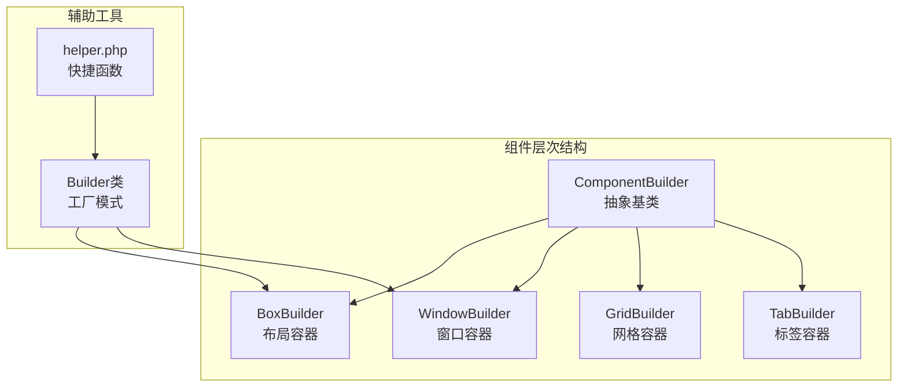
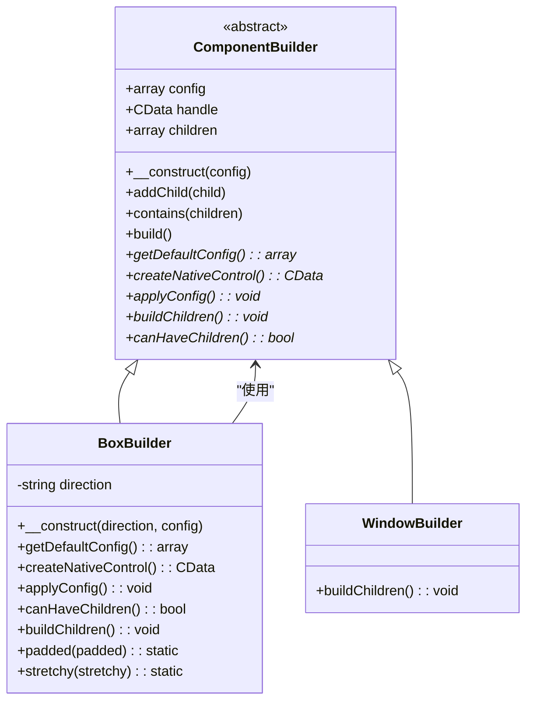
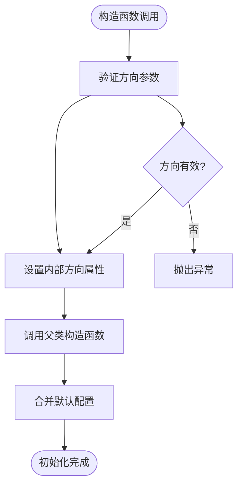
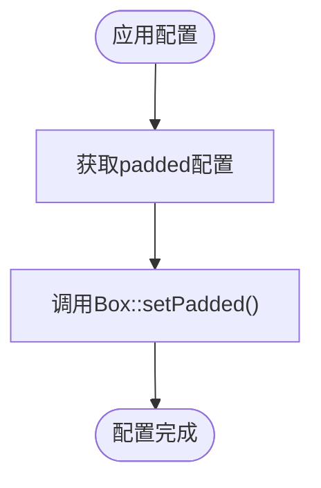
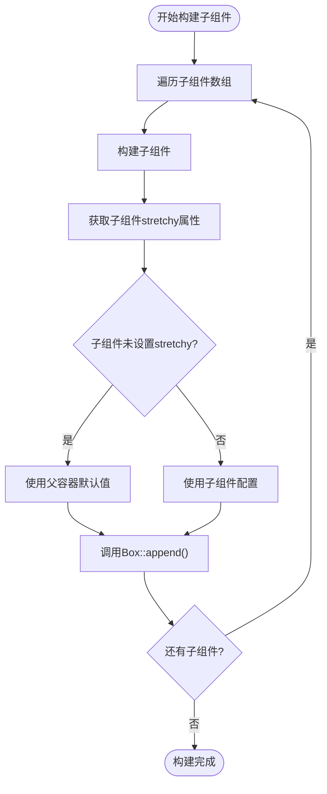
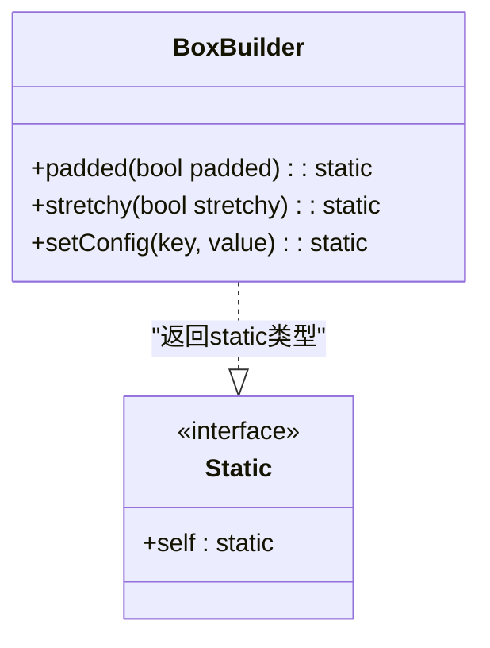
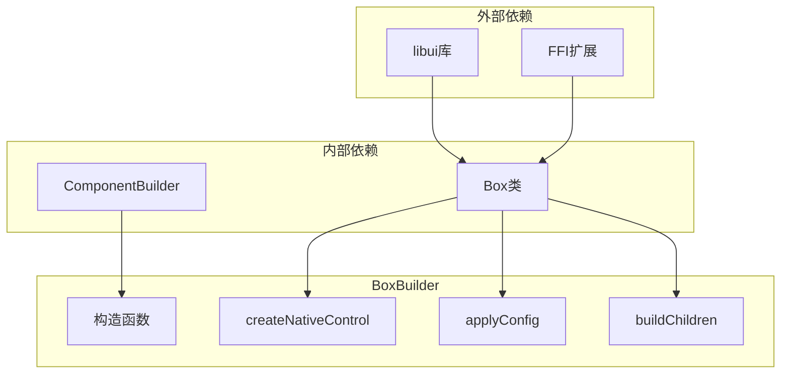

# BoxBuilder详细文档

<cite>
**本文档中引用的文件**
- [BoxBuilder.php](file://src/Components/BoxBuilder.php)
- [ComponentBuilder.php](file://src/ComponentBuilder.php)
- [WindowBuilder.php](file://src/Components/WindowBuilder.php)
- [helper.php](file://src/helper.php)
- [calculator.php](file://example/calculator.php)
- [builder_helpers_demo.php](file://example/builder_helpers_demo.php)
- [full.php](file://example/full.php)
- [BuilderComponentsTest.php](file://tests/BuilderComponentsTest.php)
</cite>

## 目录
1. [简介](#简介)
2. [项目结构](#项目结构)
3. [核心组件](#核心组件)
4. [架构概览](#架构概览)
5. [详细组件分析](#详细组件分析)
6. [依赖关系分析](#依赖关系分析)
7. [性能考虑](#性能考虑)
8. [故障排除指南](#故障排除指南)
9. [结论](#结论)

## 简介

BoxBuilder是libuiBuilder框架中的基础布局容器组件，专门负责管理子组件的排列和布局。它作为所有容器类的基础实现，提供了灵活的垂直和水平布局功能，支持内边距配置和子组件拉伸属性控制。

BoxBuilder继承自ComponentBuilder抽象类，实现了容器控件的核心功能，包括子组件的添加、布局方向的控制以及视觉样式的配置。该组件在WindowBuilder中被广泛用作多子组件容器，是构建复杂用户界面布局的重要基础。

## 项目结构

BoxBuilder位于项目的组件层次结构中，作为布局容器的核心实现：



**图表来源**
- [ComponentBuilder.php](file://src/ComponentBuilder.php#L11-L20)
- [BoxBuilder.php](file://src/Components/BoxBuilder.php#L11-L19)

**章节来源**
- [BoxBuilder.php](file://src/Components/BoxBuilder.php#L1-L64)
- [ComponentBuilder.php](file://src/ComponentBuilder.php#L1-L234)

## 核心组件

BoxBuilder的核心功能围绕以下几个关键组件展开：

### 构造函数与方向控制
BoxBuilder的构造函数接受一个必需的方向参数，该参数决定了容器的布局方向：
- `'vertical'`：垂直布局，子组件按列排列
- `'horizontal'`：水平布局，子组件按行排列

### 配置系统
BoxBuilder维护两个核心配置项：
- `padded`：布尔值，控制容器是否具有内边距
- `stretchy`：布尔值，定义子组件是否可以拉伸以填充可用空间

### 子组件管理
BoxBuilder实现了完整的子组件生命周期管理，包括添加、构建和布局应用。

**章节来源**
- [BoxBuilder.php](file://src/Components/BoxBuilder.php#L13-L26)

## 架构概览

BoxBuilder采用工厂模式和组合模式相结合的设计，通过继承ComponentBuilder获得通用的组件功能：



**图表来源**
- [ComponentBuilder.php](file://src/ComponentBuilder.php#L11-L234)
- [BoxBuilder.php](file://src/Components/BoxBuilder.php#L11-L64)

## 详细组件分析

### 构造函数与方向参数

BoxBuilder的构造函数设计简洁而功能明确，通过单一的方向参数控制布局行为：



**图表来源**
- [BoxBuilder.php](file://src/Components/BoxBuilder.php#L15-L19)

### 原生控件创建机制

BoxBuilder根据方向参数动态创建相应的原生控件：

```mermaid
sequenceDiagram
participant Client as "客户端代码"
participant BB as "BoxBuilder"
participant Box as "Box类"
Client->>BB : createNativeControl()
BB->>BB : 检查direction属性
alt direction == 'vertical'
BB->>Box : newVerticalBox()
Box-->>BB : 返回垂直盒子句柄
else direction == 'horizontal'
BB->>Box : newHorizontalBox()
Box-->>BB : 返回水平盒子句柄
end
BB-->>Client : 返回CData句柄
```

**图表来源**
- [BoxBuilder.php](file://src/Components/BoxBuilder.php#L29-L34)

### 配置应用与样式设置

BoxBuilder的配置系统提供了灵活的样式控制机制：

| 配置项 | 类型 | 默认值 | 描述 |
|--------|------|--------|------|
| padded | boolean | true | 控制容器是否具有内边距 |
| stretchy | boolean | false | 决定子组件是否可拉伸填充空间 |



**图表来源**
- [BoxBuilder.php](file://src/Components/BoxBuilder.php#L36-L39)

### 子组件构建与布局算法

BoxBuilder的buildChildren方法实现了复杂的子组件处理逻辑：



**图表来源**
- [BoxBuilder.php](file://src/Components/BoxBuilder.php#L46-L52)

### 链式调用配置方法

BoxBuilder提供了优雅的链式调用接口，支持流畅的配置：



**图表来源**
- [BoxBuilder.php](file://src/Components/BoxBuilder.php#L55-L63)

### 在WindowBuilder中的应用

BoxBuilder在WindowBuilder中作为多子组件容器的典型应用场景：

```mermaid
sequenceDiagram
participant Client as "客户端代码"
participant WB as "WindowBuilder"
participant BB as "BoxBuilder"
participant Box as "Box类"
Client->>WB : contains(multipleChildren)
WB->>WB : 检查子组件数量
alt 只有一个子组件
WB->>WB : 直接设置为窗口内容
else 多个子组件
WB->>BB : 创建新的垂直BoxBuilder
WB->>BB : 添加所有子组件
BB->>BB : 调用buildChildren()
BB->>Box : 创建垂直盒子
BB->>Box : 添加子组件
BB-->>WB : 返回盒子句柄
WB->>Box : 设置为窗口内容
end
```

**图表来源**
- [WindowBuilder.php](file://src/Components/WindowBuilder.php#L58-L70)

**章节来源**
- [BoxBuilder.php](file://src/Components/BoxBuilder.php#L1-L64)
- [WindowBuilder.php](file://src/Components/WindowBuilder.php#L58-L70)

## 依赖关系分析

BoxBuilder的依赖关系体现了良好的面向对象设计原则：



**图表来源**
- [BoxBuilder.php](file://src/Components/BoxBuilder.php#L7-L9)
- [ComponentBuilder.php](file://src/ComponentBuilder.php#L1-L20)

**章节来源**
- [BoxBuilder.php](file://src/Components/BoxBuilder.php#L7-L9)
- [ComponentBuilder.php](file://src/ComponentBuilder.php#L1-L20)

## 性能考虑

BoxBuilder在设计时充分考虑了性能优化：

### 延迟加载策略
- 子组件的构建采用延迟执行，在实际需要时才进行构建
- 配置应用仅在必要时执行，避免不必要的原生API调用

### 内存管理
- 使用FFI扩展直接操作原生内存，减少PHP层的内存开销
- 通过引用传递避免大量数据复制

### 缓存机制
- 配置值缓存在本地数组中，避免重复的配置查询

## 故障排除指南

### 常见问题与解决方案

#### 1. 方向参数错误
**问题**：传递无效的方向参数导致异常
**解决方案**：确保方向参数为'vertical'或'horizontal'

#### 2. 子组件添加失败
**问题**：尝试向非容器组件添加子组件
**解决方案**：检查组件的canHaveChildren()返回值

#### 3. 拉伸属性不生效
**问题**：子组件的stretchy属性未按预期工作
**解决方案**：确认父容器的stretchy配置与子组件配置的一致性

**章节来源**
- [BoxBuilder.php](file://src/Components/BoxBuilder.php#L41-L44)

## 结论

BoxBuilder作为libuiBuilder框架的基础布局容器，展现了优秀的软件设计原则：

### 设计优势
- **单一职责**：专注于布局容器功能，职责清晰
- **开闭原则**：通过继承ComponentBuilder扩展功能
- **依赖倒置**：依赖抽象而非具体实现
- **接口隔离**：提供简洁的链式调用接口

### 功能特性
- 支持垂直和水平两种布局方向
- 提供灵活的配置系统（padded和stretchy）
- 实现完整的子组件生命周期管理
- 支持嵌套布局和复杂界面构建

### 应用价值
BoxBuilder不仅为WindowBuilder提供了多子组件容器功能，更为整个框架奠定了可靠的布局基础。其优雅的API设计和强大的功能使其成为构建现代桌面应用程序界面的理想选择。

通过深入理解BoxBuilder的实现机制，开发者可以更好地利用libuiBuilder框架构建复杂的用户界面，实现专业级的桌面应用程序开发。