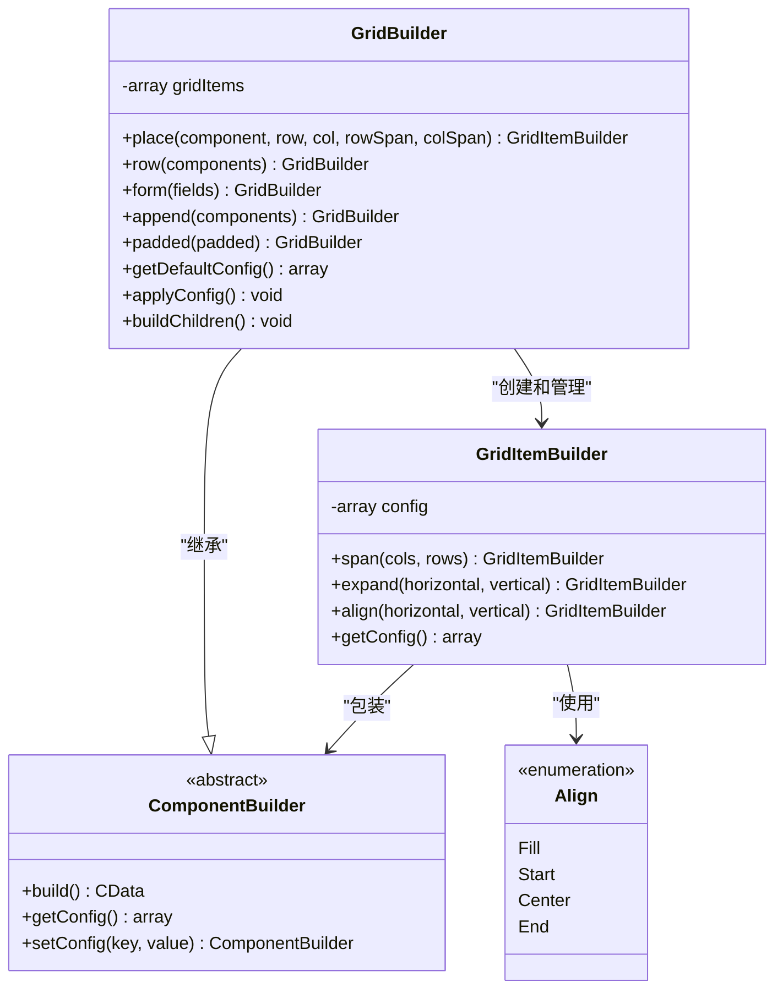
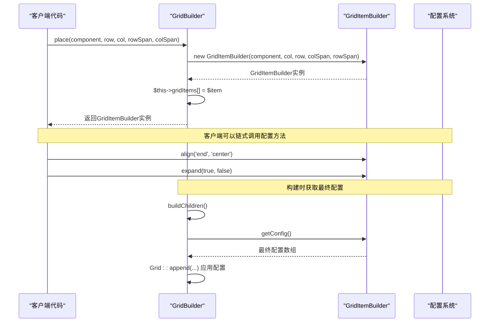
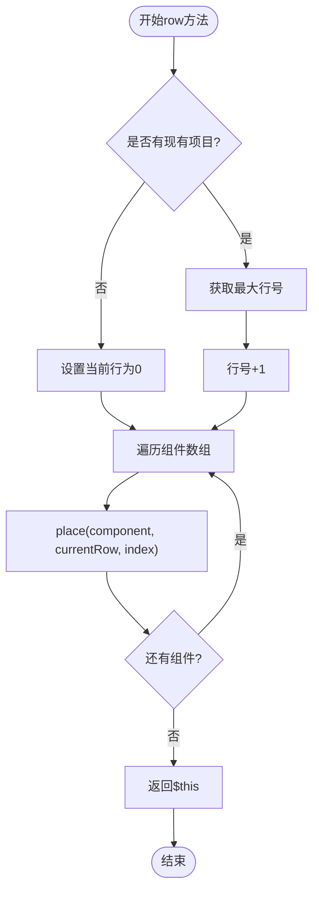
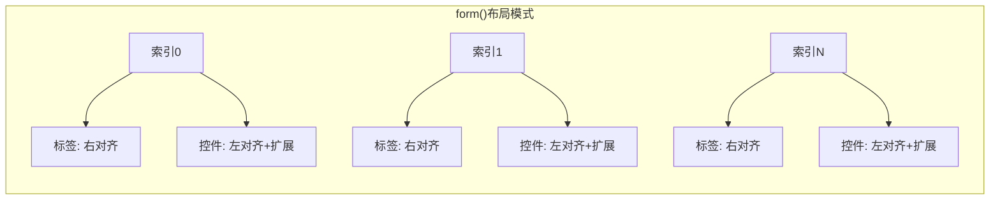
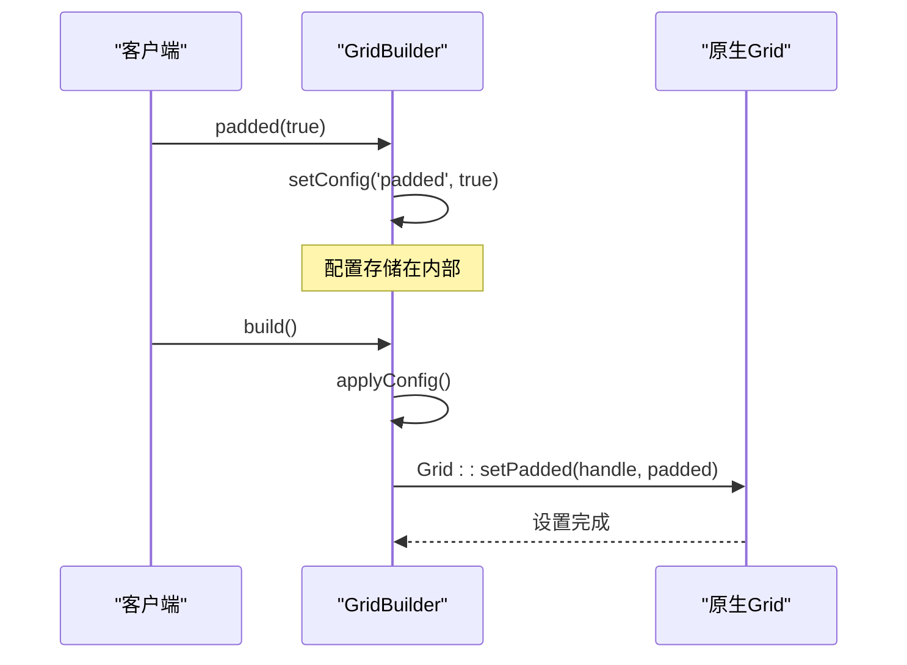
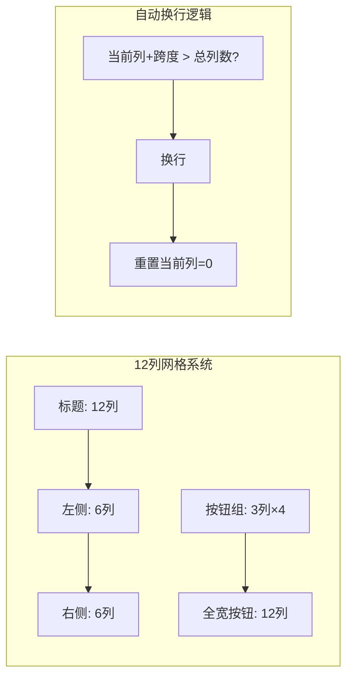
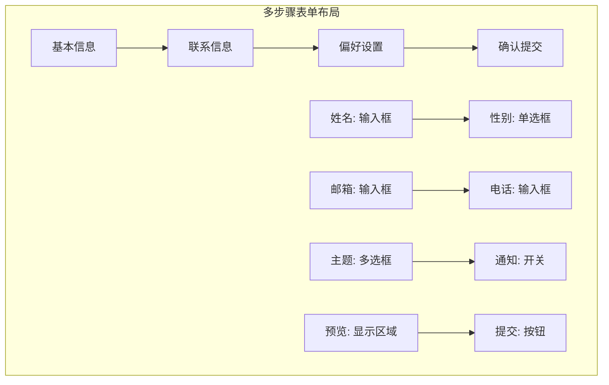
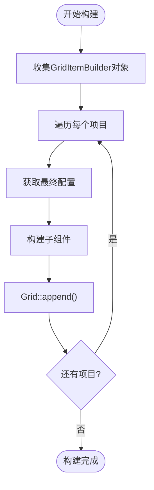

# GridBuilder 核心功能详细文档

<cite>
**本文档中引用的文件**
- [GridBuilder.php](file://src/Components/GridBuilder.php)
- [GridItemBuilder.php](file://src/Components/GridItemBuilder.php)
- [FormTemplate.php](file://src/Templates/FormTemplate.php)
- [ResponsiveGridBuilder.php](file://src/ResponsiveGridBuilder.php)
- [builder_helpers_demo.php](file://example/builder_helpers_demo.php)
- [responseGrid.php](file://example/responseGrid.php)
- [BUGFIX_GRID_ITEM.md](file://BUGFIX_GRID_ITEM.md)
</cite>

## 目录
1. [简介](#简介)
2. [架构概览](#架构概览)
3. [核心组件分析](#核心组件分析)
4. [place()方法详解](#place方法详解)
5. [便捷方法实现](#便捷方法实现)
6. [配置系统](#配置系统)
7. [复杂布局示例](#复杂布局示例)
8. [性能考虑](#性能考虑)
9. [故障排除指南](#故障排除指南)
10. [结论](#结论)

## 简介

GridBuilder是libuiBuilder框架中的高级网格布局容器，提供了灵活而强大的二维布局功能。它允许开发者将组件精确地放置在指定的行和列位置，并支持复杂的跨行跨列布局。GridBuilder采用链式调用模式，提供了直观的API设计，同时保持了高性能的底层实现。

## 架构概览

GridBuilder采用了分层架构设计，主要由以下几个核心组件构成：



**图表来源**
- [GridBuilder.php](file://src/Components/GridBuilder.php#L9-L150)
- [GridItemBuilder.php](file://src/Components/GridItemBuilder.php#L8-L60)

**章节来源**
- [GridBuilder.php](file://src/Components/GridBuilder.php#L1-L150)
- [GridItemBuilder.php](file://src/Components/GridItemBuilder.php#L1-L60)

## 核心组件分析

### GridBuilder类结构

GridBuilder继承自ComponentBuilder，实现了高级网格布局的核心功能。其主要特性包括：

- **网格项目管理**：维护一个GridItemBuilder对象数组
- **配置系统**：支持padded、columnSpacing和rowSpacing等配置项
- **构建流程**：通过buildChildren()方法协调子组件的最终布局

### GridItemBuilder类结构

GridItemBuilder负责管理单个网格项目的详细配置，包括：

- **位置信息**：left、top坐标
- **跨度配置**：xspan、yspan定义跨行跨列
- **扩展和对齐**：hexpand、vexpand和halign、valign控制布局行为

**章节来源**
- [GridBuilder.php](file://src/Components/GridBuilder.php#L9-L35)
- [GridItemBuilder.php](file://src/Components/GridItemBuilder.php#L8-L25)

## place()方法详解

place()方法是GridBuilder的核心功能，它将组件精确放置在指定的网格位置并返回可配置的GridItemBuilder实例。

### 方法签名和参数

```php
public function place(ComponentBuilder $component, int $row, int $col,
                     int $rowSpan = 1, int $colSpan = 1): GridItemBuilder
```

### 实现机制

place()方法的实现体现了设计模式的最佳实践：

1. **对象创建**：为每个网格项目创建独立的GridItemBuilder实例
2. **配置存储**：将GridItemBuilder对象存储到内部数组而非配置数组
3. **链式返回**：返回GridItemBuilder实例以便进行进一步配置

### 返回的GridItemBuilder实例

返回的GridItemBuilder实例提供了丰富的配置方法：

- **span()**：设置组件的跨行跨列跨度
- **expand()**：控制组件的扩展行为
- **align()**：设置组件的对齐方式

### 内部实现流程



**图表来源**
- [GridBuilder.php](file://src/Components/GridBuilder.php#L60-L66)
- [GridItemBuilder.php](file://src/Components/GridItemBuilder.php#L12-L25)

**章节来源**
- [GridBuilder.php](file://src/Components/GridBuilder.php#L60-L66)
- [BUGFIX_GRID_ITEM.md](file://BUGFIX_GRID_ITEM.md#L43-L55)

## 便捷方法实现

GridBuilder提供了三个便捷方法来简化常见布局场景的创建。

### row()方法

row()方法用于在网格中添加一行组件，自动计算行号并按顺序排列组件。

#### 实现逻辑



**图表来源**
- [GridBuilder.php](file://src/Components/GridBuilder.php#L69-L78)

#### 使用场景

row()方法特别适用于：
- 表单字段的批量添加
- 工具栏按钮的水平排列
- 列表项的统一布局

### form()方法

form()方法是一个专门的表单布局模板方法，能够快速创建标准的标签-控件配对布局。

#### 实现机制

form()方法遵循以下布局模式：
- 第一列放置标签组件，右对齐
- 第二列放置输入控件，左对齐并水平扩展

#### 配置特点



**图表来源**
- [GridBuilder.php](file://src/Components/GridBuilder.php#L81-L91)

### append()方法

append()方法用于在现有网格内容下方追加额外的组件，通常用于添加按钮行或状态信息。

#### 实现特点

- **自动换行**：新组件自动放置在最后一行之后
- **整行占用**：每个组件占据两列宽度，形成完整的行
- **默认对齐**：水平左对齐，垂直居中

**章节来源**
- [GridBuilder.php](file://src/Components/GridBuilder.php#L69-L149)

## 配置系统

GridBuilder的配置系统基于ComponentBuilder的继承机制，提供了灵活的布局定制能力。

### 默认配置

getDefaultConfig()方法定义了GridBuilder的默认配置：

| 配置项 | 类型 | 默认值 | 作用 |
|--------|------|--------|------|
| padded | boolean | true | 是否启用内边距 |
| columnSpacing | integer | 1 | 列间距（像素） |
| rowSpacing | integer | 1 | 行间距（像素） |

### padded()方法

padded()方法允许动态切换网格的内边距设置：

```php
// 启用内边距
$grid->padded(true);

// 禁用内边距
$grid->padded(false);
```

### 配置应用流程



**图表来源**
- [GridBuilder.php](file://src/Components/GridBuilder.php#L13-L30)

**章节来源**
- [GridBuilder.php](file://src/Components/GridBuilder.php#L13-L30)
- [GridBuilder.php](file://src/Components/GridBuilder.php#L93-L98)

## 复杂布局示例

以下是GridBuilder在实际开发中的典型应用场景和复杂布局示例。

### 登录表单布局

基于builder_helpers_demo.php中的示例，展示完整的登录表单创建过程：

```mermaid
graph TB
subgraph "登录表单网格布局"
A[标题行<br/>用户名: 输入框] --> B[密码行<br/>密码: 密码框]
B --> C[按钮行<br/>登录 取消]
end
subgraph "GridBuilder实现"
D[place(label, 0, 0)] --> E[place(entry, 0, 1)]
E --> F[place(label, 1, 0)]
F --> G[place(password, 1, 1)]
G --> H[place(loginBtn, 2, 0)]
H --> I[place(cancelBtn, 2, 1)]
end
```

**图表来源**
- [builder_helpers_demo.php](file://example/builder_helpers_demo.php#L87-L122)

### 响应式网格布局

ResponsiveGridBuilder展示了如何结合GridBuilder创建响应式布局：



**图表来源**
- [ResponsiveGridBuilder.php](file://src/ResponsiveGridBuilder.php#L19-L35)

### 复杂表单布局

结合form()方法和place()方法创建复杂的多步骤表单：



**章节来源**
- [builder_helpers_demo.php](file://example/builder_helpers_demo.php#L87-L122)
- [responseGrid.php](file://example/responseGrid.php#L10-L18)
- [ResponsiveGridBuilder.php](file://src/ResponsiveGridBuilder.php#L1-L82)

## 性能考虑

GridBuilder在设计时充分考虑了性能优化，采用了多种策略来确保高效的布局渲染。

### 对象存储优化

关键的性能改进在于GridItemBuilder对象的存储方式：

- **对象引用存储**：不再提前复制配置数组，而是存储对象引用
- **延迟配置获取**：在buildChildren()阶段才获取最终配置
- **内存效率**：减少了不必要的数组复制操作

### 构建流程优化



**图表来源**
- [GridBuilder.php](file://src/Components/GridBuilder.php#L37-L56)

### 配置缓存策略

GridItemBuilder采用配置缓存机制，避免重复计算：
- 配置在对象创建时初始化
- 链式调用修改内部配置数组
- 构建时一次性获取最终状态

**章节来源**
- [BUGFIX_GRID_ITEM.md](file://BUGFIX_GRID_ITEM.md#L43-L81)
- [GridBuilder.php](file://src/Components/GridBuilder.php#L37-L56)

## 故障排除指南

### 常见问题及解决方案

#### 问题1：GridItemBuilder配置不生效

**症状**：调用align()或expand()方法后布局没有变化

**原因**：GridBuilder早期版本存在配置过早复制的问题

**解决方案**：确保使用最新版本的GridBuilder，参考BUGFIX_GRID_ITEM.md中的修复方案

#### 问题2：组件重叠或位置错误

**症状**：多个组件在同一网格位置重叠

**排查步骤**：
1. 检查place()方法的row和col参数
2. 验证组件的span()配置
3. 确认网格项目的唯一性

#### 问题3：表单布局不对齐

**症状**：form()方法创建的表单标签和控件不对齐

**解决方案**：
- 确保fields数组中的每个元素包含'label'和'control'键
- 检查组件的尺寸是否适合网格单元格
- 考虑使用align()方法微调对齐方式

### 调试技巧

1. **配置检查**：使用getConfig()方法查看最终配置
2. **层级验证**：确认组件树结构正确
3. **边界测试**：测试极端情况下的布局行为

**章节来源**
- [BUGFIX_GRID_ITEM.md](file://BUGFIX_GRID_ITEM.md#L1-L99)

## 结论

GridBuilder作为libuiBuilder框架的核心布局组件，提供了强大而灵活的二维网格布局能力。其设计体现了以下优秀特性：

### 技术优势

- **链式调用**：提供流畅的API体验
- **类型安全**：强类型的参数验证
- **性能优化**：高效的对象存储和配置管理
- **扩展性**：支持复杂的跨行跨列布局

### 设计理念

GridBuilder的设计遵循了单一职责原则和开闭原则，通过GridItemBuilder的分离关注点，实现了布局逻辑与配置管理的有效解耦。

### 应用价值

在实际开发中，GridBuilder能够显著提高界面布局的开发效率，特别是在需要精确控制组件位置和大小的场景中。其提供的便捷方法（row()、form()、append()）大大简化了常见布局模式的实现。

通过深入理解GridBuilder的核心机制，开发者可以更好地利用这一强大工具创建出既美观又实用的用户界面。