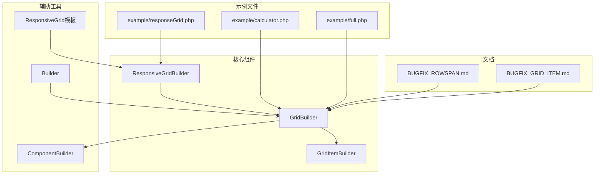
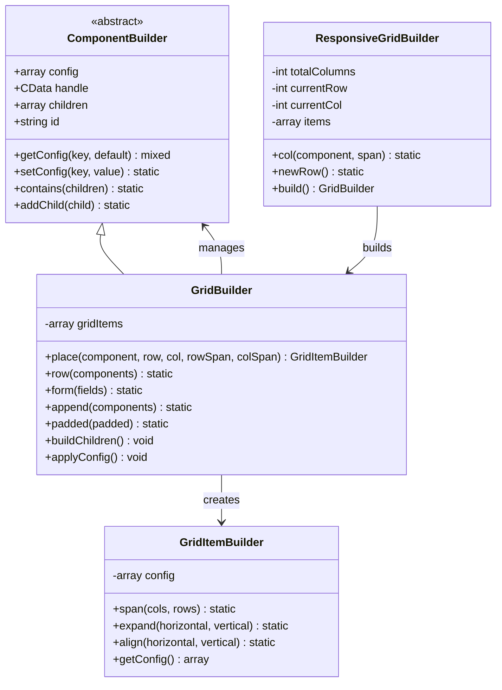
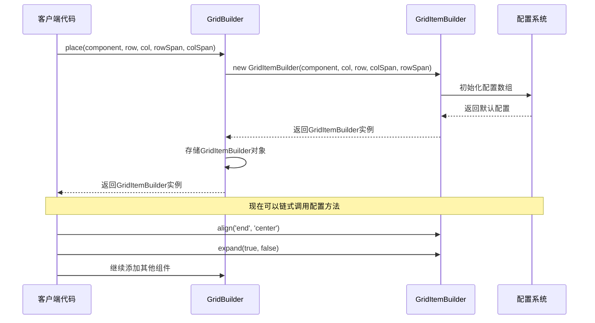
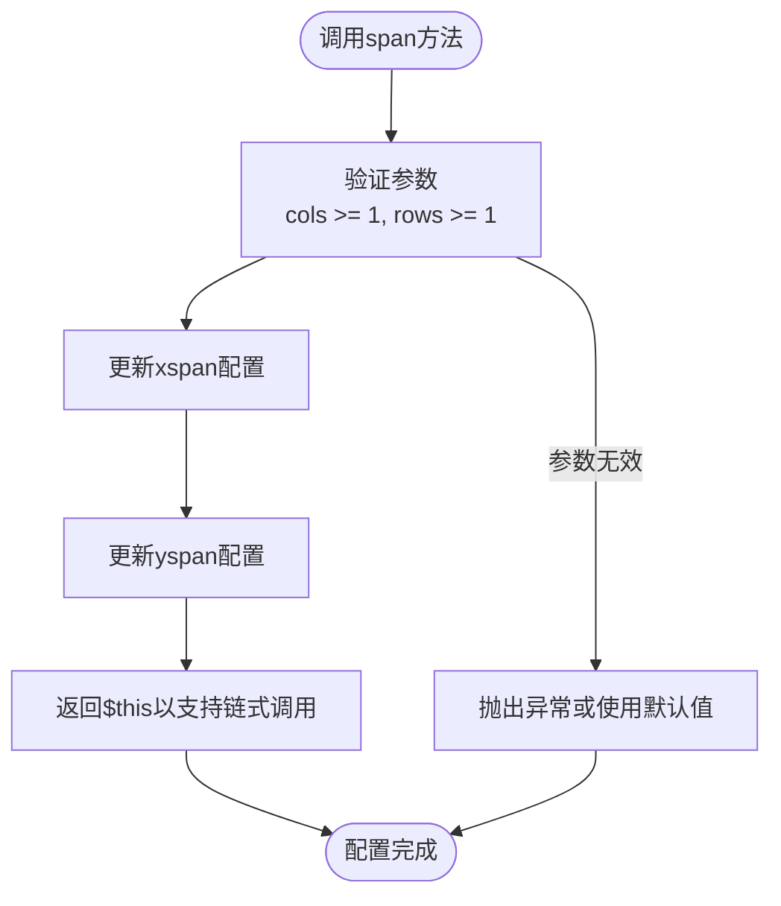
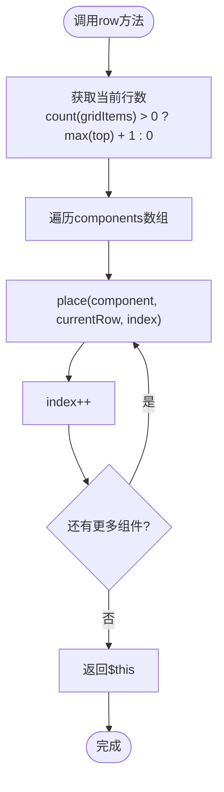
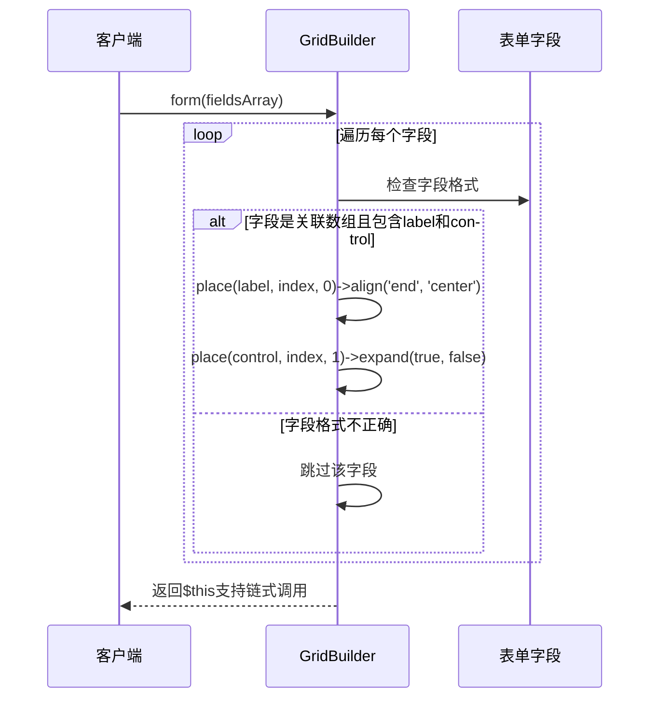
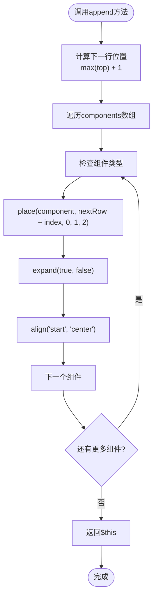
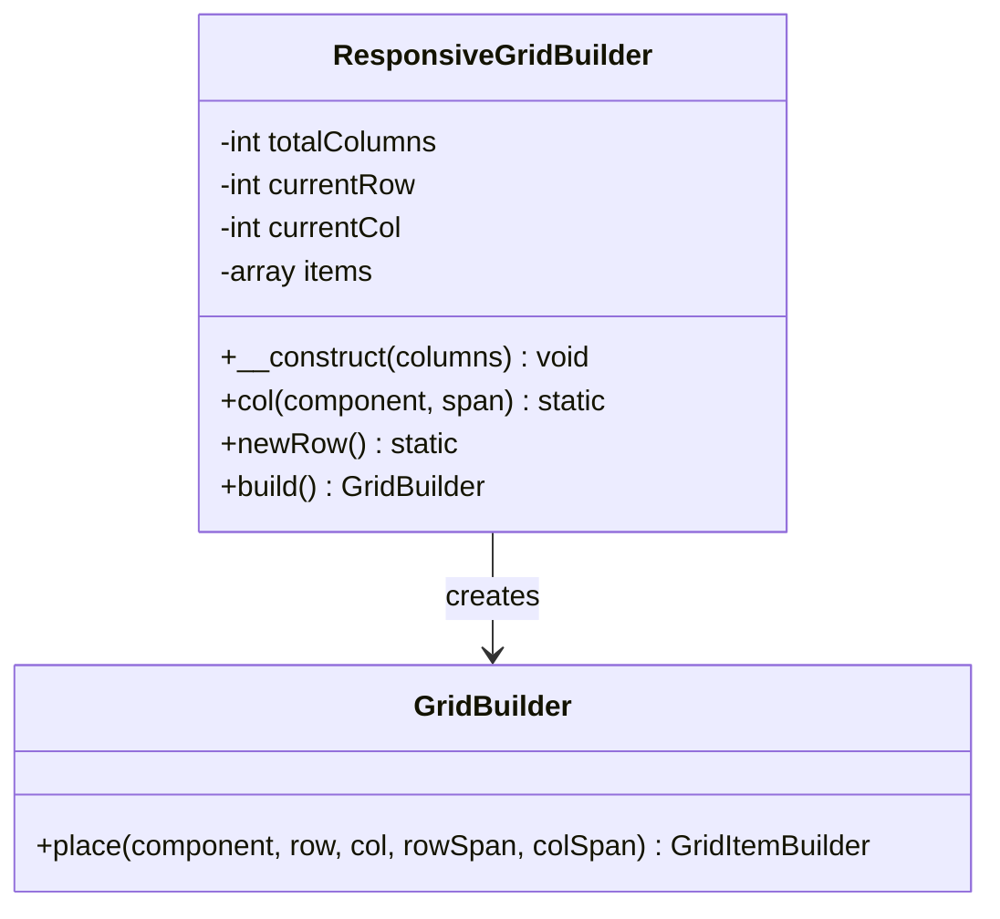
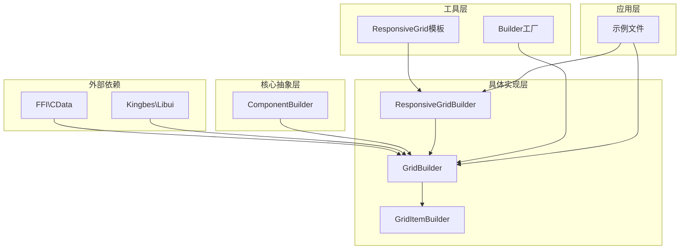

# GridBuilder

<cite>
**本文档中引用的文件**
- [GridBuilder.php](file://src/Components/GridBuilder.php)
- [GridItemBuilder.php](file://src/Components/GridItemBuilder.php)
- [ResponsiveGridBuilder.php](file://src/ResponsiveGridBuilder.php)
- [BUGFIX_ROWSPAN.md](file://BUGFIX_ROWSPAN.md)
- [BUGFIX_GRID_ITEM.md](file://BUGFIX_GRID_ITEM.md)
- [responseGrid.php](file://example/responseGrid.php)
- [calculator.php](file://example/calculator.php)
- [full.php](file://example/full.php)
- [ResponsiveGrid.php](file://src/Templates/ResponsiveGrid.php)
- [ComponentBuilder.php](file://src/ComponentBuilder.php)
</cite>

## 目录
1. [简介](#简介)
2. [项目结构](#项目结构)
3. [核心组件](#核心组件)
4. [架构概览](#架构概览)
5. [详细组件分析](#详细组件分析)
6. [依赖关系分析](#依赖关系分析)
7. [性能考虑](#性能考虑)
8. [故障排除指南](#故障排除指南)
9. [结论](#结论)

## 简介

GridBuilder是一个高级网格布局容器，提供了灵活且强大的二维布局功能。它允许开发者将UI组件精确地放置在指定的行和列位置，并支持复杂的布局需求，包括跨行跨列的组件、响应式布局和表单自动化构建。

GridBuilder的设计理念是提供一个直观的API来创建复杂的网格布局，同时保持代码的可读性和维护性。通过与GridItemBuilder的紧密协作，开发者可以轻松控制每个组件的对齐方式、扩展行为和尺寸规格。

## 项目结构

GridBuilder相关的文件组织结构如下：

**图表来源**
- [GridBuilder.php](file://src/Components/GridBuilder.php#L1-L150)
- [GridItemBuilder.php](file://src/Components/GridItemBuilder.php#L1-L60)
- [ResponsiveGridBuilder.php](file://src/ResponsiveGridBuilder.php#L1-L82)

**章节来源**
- [GridBuilder.php](file://src/Components/GridBuilder.php#L1-L150)
- [GridItemBuilder.php](file://src/Components/GridItemBuilder.php#L1-L60)
- [ResponsiveGridBuilder.php](file://src/ResponsiveGridBuilder.php#L1-L82)

## 核心组件

GridBuilder系统由三个核心组件构成，每个组件都有特定的职责和功能：

### GridBuilder主控制器
GridBuilder是网格布局的主要控制器，负责管理整个网格的配置和子组件的添加。它继承自ComponentBuilder，提供了完整的生命周期管理和配置功能。

### GridItemBuilder配置器
GridItemBuilder专门负责单个网格项的配置，包括对齐方式、扩展行为、行列跨度等属性的设置。它采用链式调用模式，使配置过程更加流畅和直观。

### ResponsiveGridBuilder响应式构建器
ResponsiveGridBuilder提供了基于列数的响应式网格布局功能，特别适用于需要适应不同屏幕尺寸的应用场景。

**章节来源**
- [GridBuilder.php](file://src/Components/GridBuilder.php#L8-L150)
- [GridItemBuilder.php](file://src/Components/GridItemBuilder.php#L8-L60)
- [ResponsiveGridBuilder.php](file://src/ResponsiveGridBuilder.php#L8-L82)

## 架构概览

GridBuilder采用了分层架构设计，确保了良好的可扩展性和维护性：

**图表来源**
- [ComponentBuilder.php](file://src/ComponentBuilder.php#L11-L234)
- [GridBuilder.php](file://src/Components/GridBuilder.php#L8-L150)
- [GridItemBuilder.php](file://src/Components/GridItemBuilder.php#L8-L60)
- [ResponsiveGridBuilder.php](file://src/ResponsiveGridBuilder.php#L8-L82)

## 详细组件分析

### GridBuilder核心方法详解

#### place()方法 - 精确布局的核心

place()方法是GridBuilder最核心的功能，它允许开发者将组件精确放置在网格的指定位置：

**图表来源**
- [GridBuilder.php](file://src/Components/GridBuilder.php#L59-L66)
- [GridItemBuilder.php](file://src/Components/GridItemBuilder.php#L12-L25)

place()方法的关键特性：
- **精确坐标定位**：通过row和col参数指定组件的起始位置
- **灵活的跨度控制**：支持rowSpan和colSpan参数来创建跨行跨列的组件
- **链式配置**：返回GridItemBuilder实例，支持方法链式调用
- **延迟配置**：配置在build阶段才最终确定，确保所有修改都被应用

#### GridItemBuilder配置方法

GridItemBuilder提供了三个主要的配置方法来控制组件的行为：

##### span()方法 - 控制行列跨度
span()方法用于设置组件在网格中占据的行列数量：

**图表来源**
- [GridItemBuilder.php](file://src/Components/GridItemBuilder.php#L28-L33)

##### expand()方法 - 控制扩展行为
expand()方法控制组件在可用空间内的扩展行为：

| 参数 | 类型 | 默认值 | 描述 |
|------|------|--------|------|
| horizontal | bool | true | 是否水平扩展以填充可用空间 |
| vertical | bool | false | 是否垂直扩展以填充可用空间 |

##### align()方法 - 控制对齐方式
align()方法设置组件在网格单元格内的对齐方式：

| 对齐选项 | 描述 | 适用方向 |
|----------|------|----------|
| 'fill' | 填充整个可用空间 | 水平/垂直 |
| 'start' | 靠起始边缘对齐 | 水平/垂直 |
| 'center' | 居中对齐 | 水平/垂直 |
| 'end' | 靠结束边缘对齐 | 水平/垂直 |

**章节来源**
- [GridBuilder.php](file://src/Components/GridBuilder.php#L59-L66)
- [GridItemBuilder.php](file://src/Components/GridItemBuilder.php#L28-L54)

### 便捷方法实现分析

#### row()方法 - 批量行布局

row()方法提供了一种快速创建同一行多个组件的方式：

**图表来源**
- [GridBuilder.php](file://src/Components/GridBuilder.php#L69-L78)

#### form()方法 - 表单布局自动化

form()方法专门用于创建标准的表单布局，自动处理标签和控件的配对：

**图表来源**
- [GridBuilder.php](file://src/Components/GridBuilder.php#L81-L90)

#### append()方法 - 动态组件追加

append()方法用于在现有网格布局后追加新的组件行：

**图表来源**
- [GridBuilder.php](file://src/Components/GridBuilder.php#L113-L148)

**章节来源**
- [GridBuilder.php](file://src/Components/GridItemBuilder.php#L69-L148)

### ResponsiveGridBuilder响应式布局

ResponsiveGridBuilder提供了基于列数的响应式网格布局功能，特别适合需要适应不同屏幕尺寸的应用：

**图表来源**
- [ResponsiveGridBuilder.php](file://src/ResponsiveGridBuilder.php#L8-L82)

ResponsiveGridBuilder的核心特性：
- **智能换行**：当当前行空间不足时自动换行
- **灵活的列跨度**：支持组件跨越多个列
- **预设列数**：默认12列网格系统
- **自动对齐**：根据组件类型自动设置合适的对齐方式

**章节来源**
- [ResponsiveGridBuilder.php](file://src/ResponsiveGridBuilder.php#L8-L82)

## 依赖关系分析

GridBuilder系统的依赖关系展现了清晰的层次结构：

**图表来源**
- [GridBuilder.php](file://src/Components/GridBuilder.php#L1-L10)
- [ComponentBuilder.php](file://src/ComponentBuilder.php#L1-L10)
- [ResponsiveGridBuilder.php](file://src/ResponsiveGridBuilder.php#L1-L10)

关键依赖关系说明：
- **FFI\CData**：用于与底层libui库交互
- **Kingbes\Libui**：提供原生控件的封装
- **ComponentBuilder**：GridBuilder的基础抽象类
- **Builder工厂**：提供便捷的GridBuilder创建接口

**章节来源**
- [GridBuilder.php](file://src/Components/GridBuilder.php#L1-L10)
- [ComponentBuilder.php](file://src/ComponentBuilder.php#L1-L10)
- [ResponsiveGridBuilder.php](file://src/ResponsiveGridBuilder.php#L1-L10)

## 性能考虑

GridBuilder在设计时充分考虑了性能优化：

### 延迟配置机制
GridBuilder采用延迟配置策略，在build阶段才最终确定所有配置，这样可以：
- 减少不必要的配置复制操作
- 支持链式调用的完整功能
- 提高内存使用效率

### 配置缓存策略
GridItemBuilder使用配置数组缓存机制，避免重复计算：
- 配置在对象创建时初始化
- 修改操作直接更新配置数组
- build阶段一次性应用所有配置

### 内存管理
- 使用对象引用而非深度复制
- 及时清理不需要的临时变量
- 支持大网格布局的高效处理

## 故障排除指南

### 常见问题及解决方案

#### BUGFIX_ROWSPAN.md中的rowspan限制

根据BUGFIX_ROWSPAN.md文档，GridBuilder在处理rowspan和colspan时存在重要的限制：

**问题描述**：当HTML模板中的Grid子元素未显式设置rowspan/colspan属性时，会触发段错误。

**根本原因**：PHP DOMElement::getAttribute()方法对不存在的属性返回空字符串""，而不是null。

**解决方案**：使用`?:`操作符替代`??`操作符来处理DOM属性。

**最佳实践**：
- 在HTML模板中始终显式设置rowspan和colspan属性
- 使用适当的默认值处理缺失的属性
- 在构建过程中验证跨度值的有效性

#### BUGFIX_GRID_ITEM.md中的配置失效问题

GridBuilder曾经存在的配置失效问题：

**问题症状**：在HtmlRenderer中调用align()和expand()方法后，配置修改不生效。

**根本原因**：早期版本中，place()方法立即复制配置数组，导致后续修改无法反映到最终布局中。

**修复方案**：改为存储GridItemBuilder对象本身，而不是配置数组。

**章节来源**
- [BUGFIX_ROWSPAN.md](file://BUGFIX_ROWSPAN.md#L1-L78)
- [BUGFIX_GRID_ITEM.md](file://BUGFIX_GRID_ITEM.md#L1-L40)

### 调试技巧

1. **配置验证**：使用getConfig()方法检查最终配置
2. **布局测试**：从小规模布局开始逐步扩展
3. **组件隔离**：单独测试GridItemBuilder的各种配置组合
4. **边界检查**：验证行和列索引的有效性

## 结论

GridBuilder是一个功能强大且设计精良的网格布局系统，它成功地平衡了易用性和功能性。通过GridBuilder、GridItemBuilder和ResponsiveGridBuilder的协同工作，开发者可以创建出复杂而美观的用户界面布局。

### 主要优势

1. **直观的API设计**：通过链式调用和方法命名提供自然的编程体验
2. **灵活的配置系统**：支持精确的布局控制和响应式设计
3. **完善的错误处理**：内置的边界检查和配置验证
4. **优秀的扩展性**：清晰的架构便于功能扩展和维护

### 最佳实践建议

1. **合理使用span()方法**：避免过度复杂的跨行列组合
2. **充分利用form()方法**：对于标准表单布局，优先使用form()方法
3. **注意性能优化**：对于大型网格，考虑分批添加组件
4. **遵循响应式设计原则**：在移动设备上测试布局效果

GridBuilder为现代桌面应用程序开发提供了一个强大而优雅的布局解决方案，特别适合需要复杂UI布局的PHP应用程序。