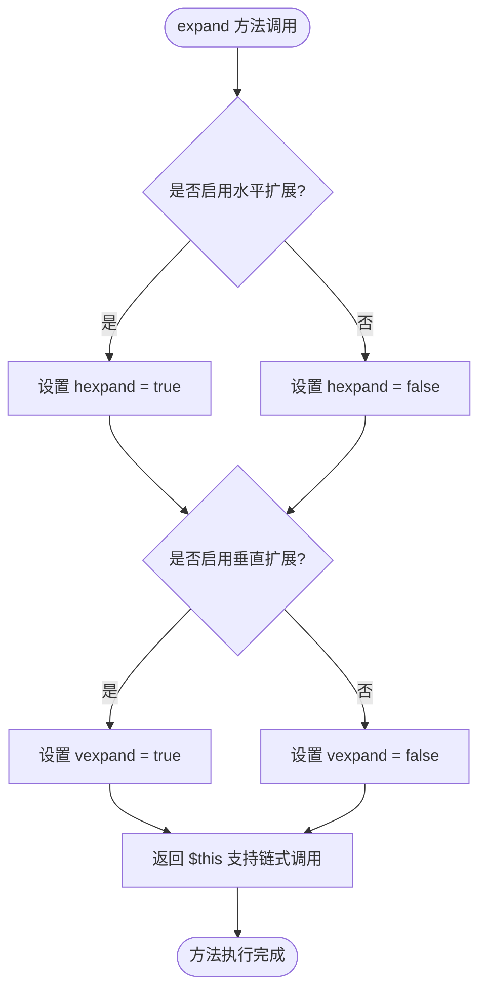

# GridItemBuilder 配置管理

<cite>
**本文档中引用的文件**
- [GridItemBuilder.php](file://src/Components/GridItemBuilder.php)
- [GridBuilder.php](file://src/Components/GridBuilder.php)
- [Align.php](file://vendor/kingbes/libui/src/Align.php)
- [BUGFIX_ROWSPAN.md](file://BUGFIX_ROWSPAN.md)
- [BUGFIX_GRID_ITEM.md](file://BUGFIX_GRID_ITEM.md)
- [BuilderComponentsTest.php](file://tests/BuilderComponentsTest.php)
- [ResponsiveGridBuilder.php](file://src/ResponsiveGridBuilder.php)
</cite>

## 目录
1. [简介](#简介)
2. [项目结构](#项目结构)
3. [核心组件](#核心组件)
4. [架构概览](#架构概览)
5. [详细组件分析](#详细组件分析)
6. [依赖关系分析](#依赖关系分析)
7. [性能考虑](#性能考虑)
8. [故障排除指南](#故障排除指南)
9. [结论](#结论)

## 简介

GridItemBuilder 是 libuiBuilder 框架中的一个关键组件，专门负责管理网格布局中单个项目的配置。它作为网格项配置管理器，提供了灵活的接口来控制组件的位置、大小、对齐方式和扩展行为。该组件采用流畅接口设计模式，支持链式调用，使开发者能够以直观的方式构建复杂的网格布局。

GridItemBuilder 的主要职责包括：
- 管理网格项的基本位置信息（左边界、顶部）
- 控制组件的跨度（列跨度和行跨度）
- 设置水平和垂直对齐方式
- 配置组件在网格中的扩展行为
- 提供统一的配置访问接口

## 项目结构

GridItemBuilder 在项目中的组织结构体现了清晰的职责分离和模块化设计：

**图表来源**
- [GridItemBuilder.php](file://src/Components/GridItemBuilder.php#L1-L60)
- [GridBuilder.php](file://src/Components/GridBuilder.php#L1-L105)
- [Align.php](file://vendor/kingbes/libui/src/Align.php#L1-L15)

**章节来源**
- [GridItemBuilder.php](file://src/Components/GridItemBuilder.php#L1-L60)
- [GridBuilder.php](file://src/Components/GridBuilder.php#L1-L105)

## 核心组件

GridItemBuilder 类的核心数据结构是一个关联数组，包含了网格项的所有配置信息：

### 配置结构

| 配置项 | 类型 | 默认值 | 描述 |
|--------|------|--------|------|
| component | ComponentBuilder | - | 关联的组件构建器实例 |
| left | int | - | 网格项的左边界位置（列索引） |
| top | int | - | 网格项的顶部位置（行索引） |
| xspan | int | 1 | 水平方向的跨度（列数） |
| yspan | int | 1 | 垂直方向的跨度（行数） |
| hexpand | bool | false | 是否在水平方向扩展 |
| vexpand | bool | false | 是否在垂直方向扩展 |
| halign | Align | Align::Fill | 水平对齐方式 |
| valign | Align | Align::Fill | 垂直对齐方式 |

### 对齐枚举定义

Align 枚举提供了四种标准的对齐方式：

| 枚举值 | 数值 | 描述 |
|--------|------|------|
| Fill | 0 | 填充可用空间 |
| Start | 1 | 开始位置对齐 |
| Center | 2 | 居中对齐 |
| End | 3 | 结束位置对齐 |

**章节来源**
- [GridItemBuilder.php](file://src/Components/GridItemBuilder.php#L12-L25)
- [Align.php](file://vendor/kingbes/libui/src/Align.php#L8-L14)

## 架构概览

GridItemBuilder 作为网格布局系统的核心组件，与 GridBuilder 和其他组件协同工作，形成完整的布局管理体系：

**图表来源**
- [GridBuilder.php](file://src/Components/GridBuilder.php#L60-L80)
- [GridItemBuilder.php](file://src/Components/GridItemBuilder.php#L28-L54)

## 详细组件分析

### 构造函数分析

GridItemBuilder 的构造函数初始化了网格项的基础配置，采用了合理的默认值策略：

**图表来源**
- [GridItemBuilder.php](file://src/Components/GridItemBuilder.php#L12-L25)

### align() 方法实现

align() 方法提供了灵活的对齐控制机制，通过字符串映射到 Align 枚举值：

**图表来源**
- [GridItemBuilder.php](file://src/Components/GridItemBuilder.php#L42-L54)
- [Align.php](file://vendor/kingbes/libui/src/Align.php#L8-L14)

#### 对齐映射机制

align() 方法内部维护了一个字符串到 Align 枚举的映射表：

| 输入字符串 | 映射结果 | 默认值 |
|------------|----------|--------|
| "fill" | Align::Fill | ✓ |
| "start" | Align::Start | ✓ |
| "center" | Align::Center | ✓ |
| "end" | Align::End | ✓ |
| 其他值 | Align::Fill | ✗ |

这种设计确保了向后兼容性，当传入无效的对齐字符串时自动回退到默认的填充对齐。

### expand() 方法实现

expand() 方法控制组件在网格中的扩展行为，支持独立的水平和垂直扩展：

**图表来源**
- [GridItemBuilder.php](file://src/Components/GridItemBuilder.php#L35-L40)

### span() 方法实现

span() 方法用于设置组件的列跨度和行跨度，支持灵活的网格布局：

**图表来源**
- [GridItemBuilder.php](file://src/Components/GridItemBuilder.php#L28-L33)

### getConfig() 方法实现

getConfig() 方法提供了统一的配置访问接口，返回包含所有网格项配置的完整数组：

**图表来源**
- [GridItemBuilder.php](file://src/Components/GridItemBuilder.php#L56-L59)

**章节来源**
- [GridItemBuilder.php](file://src/Components/GridItemBuilder.php#L28-L59)

## 依赖关系分析

GridItemBuilder 的依赖关系体现了清晰的层次结构和职责分离：

**图表来源**
- [GridItemBuilder.php](file://src/Components/GridItemBuilder.php#L1-L7)
- [GridBuilder.php](file://src/Components/GridBuilder.php#L1-L8)

### 关键依赖说明

1. **Align 枚举依赖**：GridItemBuilder 使用 Align 枚举来表示对齐方式，确保类型安全和语义明确
2. **ComponentBuilder 依赖**：每个 GridItemBuilder 实例都关联一个 ComponentBuilder，代表要放置在网格中的实际组件
3. **链式调用支持**：所有配置方法都返回 $this，支持流畅接口模式

**章节来源**
- [GridItemBuilder.php](file://src/Components/GridItemBuilder.php#L1-L7)
- [GridBuilder.php](file://src/Components/GridBuilder.php#L1-L105)

## 性能考虑

GridItemBuilder 在设计时充分考虑了性能优化和内存效率：

### 内存使用优化

- **延迟配置获取**：GridBuilder 采用对象引用而非配置数组，避免重复克隆大量数据
- **最小化配置存储**：只存储必要的配置信息，减少内存占用
- **高效的链式调用**：通过返回 $this 实现无额外开销的链式操作

### 性能最佳实践

1. **合理使用 span() 方法**：避免设置过大的跨度值，特别是在密集布局中
2. **对齐方式选择**：根据实际需求选择合适的对齐方式，避免不必要的空间浪费
3. **扩展行为控制**：谨慎使用 expand() 方法，过度扩展可能导致布局混乱

## 故障排除指南

### 常见问题及解决方案

#### 问题1：HTML渲染器中布局属性不生效

**症状**：使用 HtmlRenderer 渲染的HTML模板中，GridItemBuilder 的 align() 和 expand() 方法设置的属性无法正确应用

**根本原因**：GridBuilder 曾经在 place() 方法中立即调用 getConfig() 并存储配置数组，导致后续修改失效

**解决方案**：GridBuilder 已修复为存储对象引用，在 buildChildren() 时获取最终配置

**参考文档**：[BUGFIX_GRID_ITEM.md](file://BUGFIX_GRID_ITEM.md#L1-L99)

#### 问题2：DOM属性处理错误

**症状**：HTML模板中使用 rowspan/colspan 属性时出现段错误

**根本原因**：DOMElement::getAttribute() 对不存在的属性返回空字符串而非 null

**解决方案**：使用 `?:` 操作符替代 `??` 操作符进行属性值处理

**参考文档**：[BUGFIX_ROWSPAN.md](file://BUGFIX_ROWSPAN.md#L1-L78)

#### 问题3：跨度值默认值错误

**症状**：未显式设置 rowspan/colspan 的Grid子元素使用0作为跨度值

**解决方案**：确保正确处理DOM属性的默认值逻辑

### 调试技巧

1. **配置验证**：使用 getConfig() 方法检查最终配置是否符合预期
2. **链式调用验证**：确认所有配置方法都正确返回 $this
3. **边界条件测试**：测试极端的跨度值和对齐组合

**章节来源**
- [BUGFIX_GRID_ITEM.md](file://BUGFIX_GRID_ITEM.md#L1-L99)
- [BUGFIX_ROWSPAN.md](file://BUGFIX_ROWSPAN.md#L1-L78)

## 结论

GridItemBuilder 作为 libuiBuilder 框架中的核心网格配置管理器，展现了优秀的软件设计原则：

### 设计优势

1. **流畅接口模式**：支持链式调用，提供直观的API体验
2. **类型安全**：使用枚举类型确保对齐方式的正确性
3. **灵活性**：提供细粒度的布局控制选项
4. **可扩展性**：良好的架构设计便于功能扩展

### 最佳实践建议

1. **合理使用对齐方式**：根据组件特性选择合适的对齐策略
2. **谨慎设置扩展行为**：避免过度扩展导致布局冲突
3. **充分利用链式调用**：提高代码的可读性和维护性
4. **注意版本兼容性**：遵循框架的更新和修复指南

GridItemBuilder 的设计体现了现代PHP开发的最佳实践，为构建复杂的桌面应用程序界面提供了强大而灵活的工具。通过深入理解其工作机制和最佳实践，开发者可以充分发挥其潜力，创建出既美观又实用的用户界面。