# TabBuilder 详细文档

<cite>
**本文档中引用的文件**
- [TabBuilder.php](file://src/Builder/TabBuilder.php)
- [ComponentBuilder.php](file://src/ComponentBuilder.php)
- [BoxBuilder.php](file://src/Components/BoxBuilder.php)
- [BuilderHelperTest.php](file://tests/BuilderHelperTest.php)
- [full.php](file://example/full.php)
- [simple.php](file://example/simple.php)
</cite>

## 目录
1. [简介](#简介)
2. [项目结构](#项目结构)
3. [核心组件](#核心组件)
4. [架构概览](#架构概览)
5. [详细组件分析](#详细组件分析)
6. [依赖关系分析](#依赖关系分析)
7. [性能考虑](#性能考虑)
8. [故障排除指南](#故障排除指南)
9. [结论](#结论)

## 简介

TabBuilder 是 libuiBuilder 框架中的一个专门用于创建多标签页界面的构建器类。它继承自 ComponentBuilder，提供了丰富的 API 来管理标签页的添加、配置和交互。TabBuilder 的主要功能包括：

- **灵活的标签页添加机制**：支持单个标签页添加（`tab()` 方法）和批量标签页添加（`tabs()` 方法）
- **智能内容处理**：当标签页内容为数组时，自动将其包装在垂直 Box 中
- **事件驱动的标签页切换**：通过 `onTabSelected()` 方法监听标签页切换事件
- **程序化控制**：提供 `getSelected()` 和 `switchTo()` 方法进行运行时操作
- **默认状态配置**：通过 `selected()` 方法设置默认选中的标签页

## 项目结构

TabBuilder 在 libuiBuilder 项目中的组织结构如下：

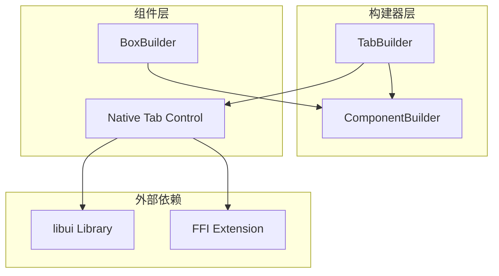

**图表来源**
- [TabBuilder.php](file://src/Builder/TabBuilder.php#L10-L11)
- [ComponentBuilder.php](file://src/ComponentBuilder.php#L11-L12)

**章节来源**
- [TabBuilder.php](file://src/Builder/TabBuilder.php#L1-L106)

## 核心组件

TabBuilder 的核心组件包括以下关键部分：

### 私有属性
- `$tabs`: 存储所有标签页的数组，每个标签页包含标题和内容
- 继承自 ComponentBuilder 的通用属性：配置、句柄、子组件等

### 配置系统
- `selectedIndex`: 默认选中的标签页索引，默认为 0
- `onTabSelected`: 标签页切换事件回调函数

### 核心方法
- `tab()`: 添加单个标签页
- `tabs()`: 批量添加多个标签页
- `selected()`: 设置默认选中的标签页
- `onTabSelected()`: 绑定标签页切换事件
- `getSelected()`: 获取当前选中的标签页索引
- `switchTo()`: 程序化切换到指定标签页

**章节来源**
- [TabBuilder.php](file://src/Builder/TabBuilder.php#L12-L19)

## 架构概览

TabBuilder 采用面向对象的设计模式，遵循 Builder 模式和组合模式：

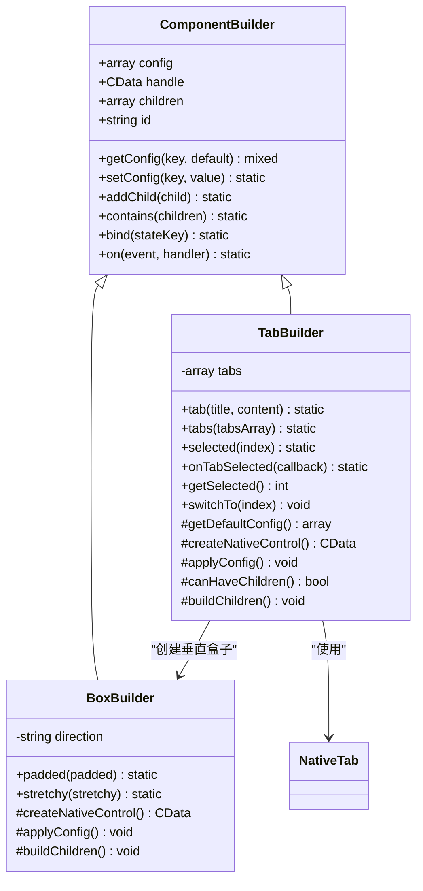

**图表来源**
- [TabBuilder.php](file://src/Builder/TabBuilder.php#L10-L11)
- [ComponentBuilder.php](file://src/ComponentBuilder.php#L11-L12)
- [BoxBuilder.php](file://src/Components/BoxBuilder.php#L11-L13)

## 详细组件分析

### TabBuilder 类实现分析

#### 核心构造和配置

TabBuilder 继承自 ComponentBuilder，实现了标签页容器的所有必要功能：

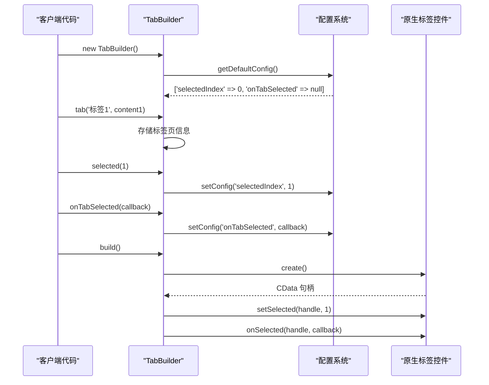

**图表来源**
- [TabBuilder.php](file://src/Builder/TabBuilder.php#L14-L19)
- [TabBuilder.php](file://src/Builder/TabBuilder.php#L22-L25)
- [TabBuilder.php](file://src/Builder/TabBuilder.php#L27-L38)

#### 标签页添加机制

TabBuilder 提供了两种添加标签页的方法：

##### 单个标签页添加 (`tab()` 方法)

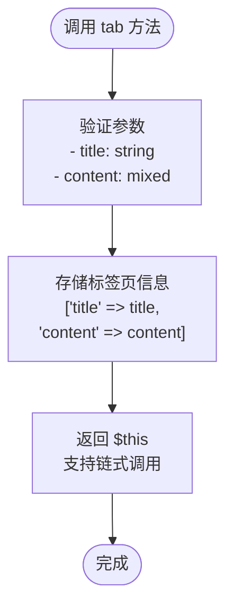

**图表来源**
- [TabBuilder.php](file://src/Builder/TabBuilder.php#L65-L71)

##### 批量标签页添加 (`tabs()` 方法)

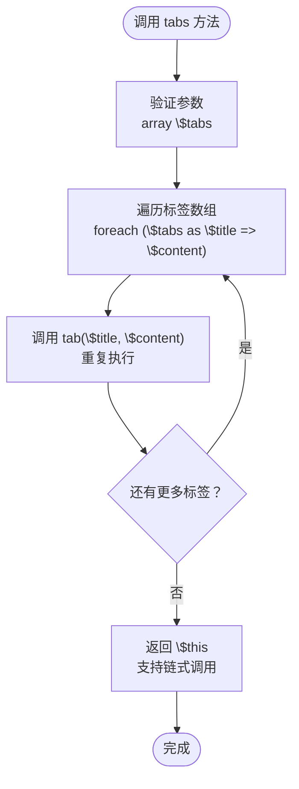

**图表来源**
- [TabBuilder.php](file://src/Builder/TabBuilder.php#L75-L80)

#### 内容自动包装机制

当标签页内容为数组时，TabBuilder 会自动将其包装在垂直 Box 中：

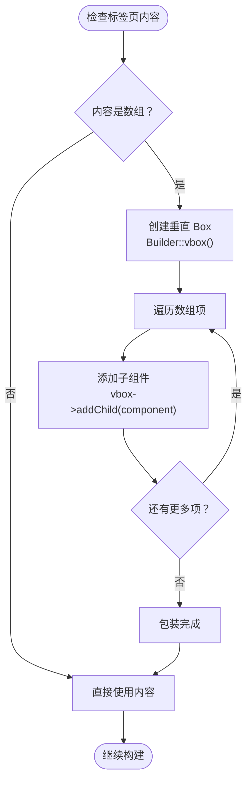

**图表来源**
- [TabBuilder.php](file://src/Builder/TabBuilder.php#L51-L58)

#### 事件处理机制

TabBuilder 支持标签页切换事件的绑定和触发：

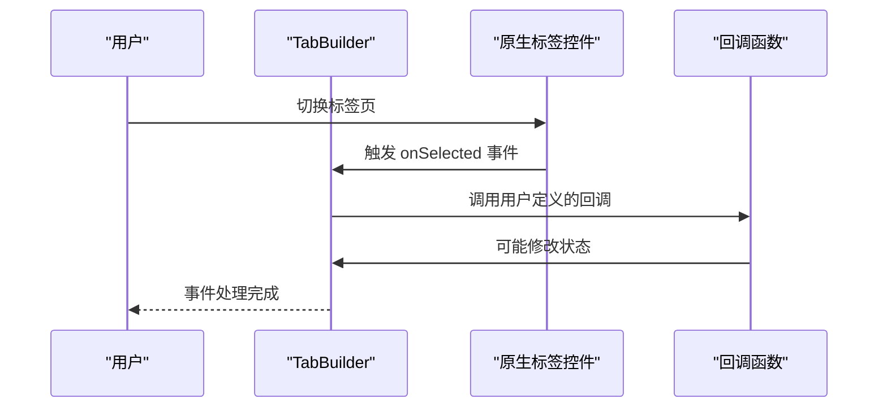

**图表来源**
- [TabBuilder.php](file://src/Builder/TabBuilder.php#L36-L38)

#### 运行时控制方法

TabBuilder 提供了两个重要的运行时控制方法：

##### 获取当前选中标签页 (`getSelected()`)

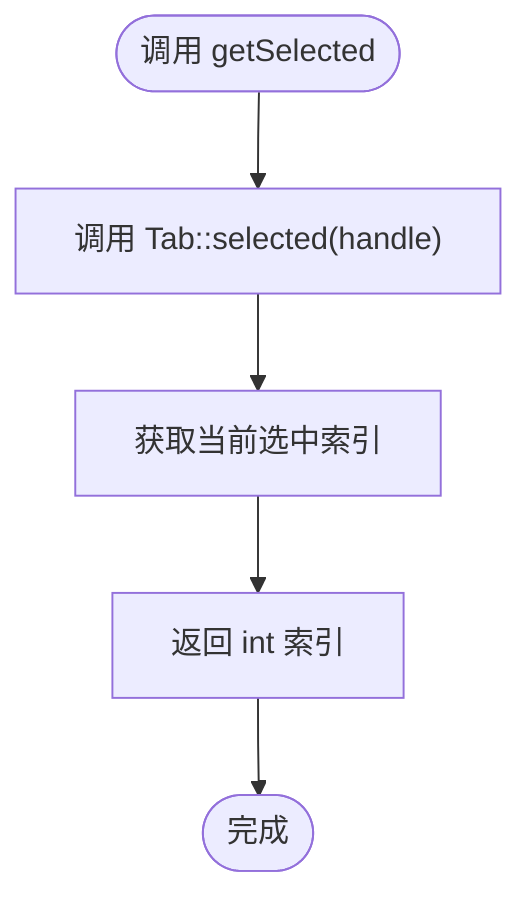

**图表来源**
- [TabBuilder.php](file://src/Builder/TabBuilder.php#L96-L98)

##### 程序化切换标签页 (`switchTo()`)

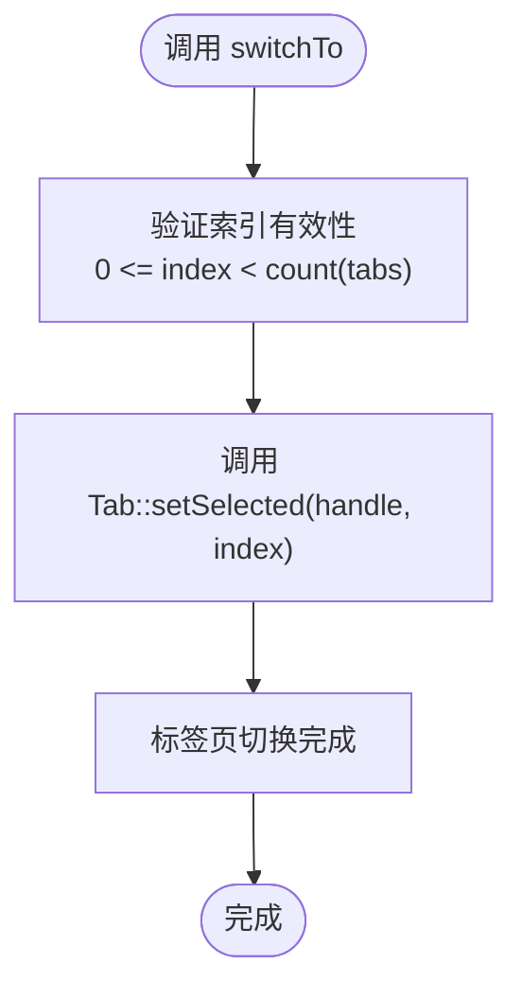

**图表来源**
- [TabBuilder.php](file://src/Builder/TabBuilder.php#L102-L104)

**章节来源**
- [TabBuilder.php](file://src/Builder/TabBuilder.php#L65-L105)

### 实际应用场景示例

#### 配置面板应用

在配置面板场景中，TabBuilder 可以用来组织不同类型设置：

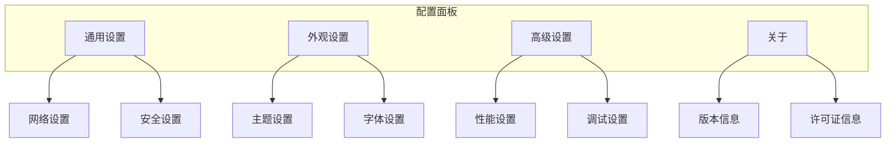

#### 向导界面应用

在向导界面中，TabBuilder 可以实现步骤式的导航：

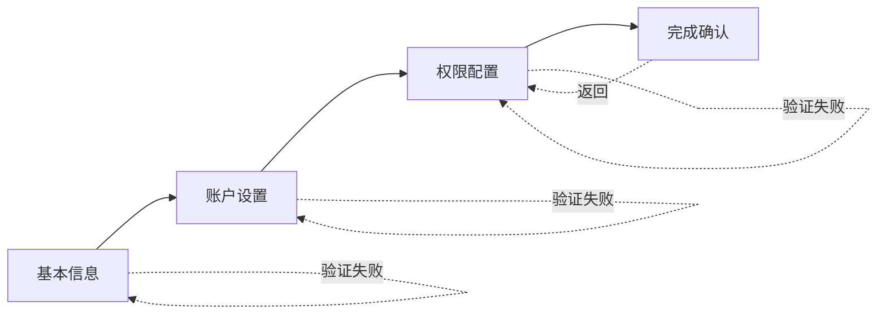

**章节来源**
- [full.php](file://example/full.php#L1-L180)
- [simple.php](file://example/simple.php#L71-L107)

## 依赖关系分析

TabBuilder 的依赖关系图展示了其与其他组件的交互：

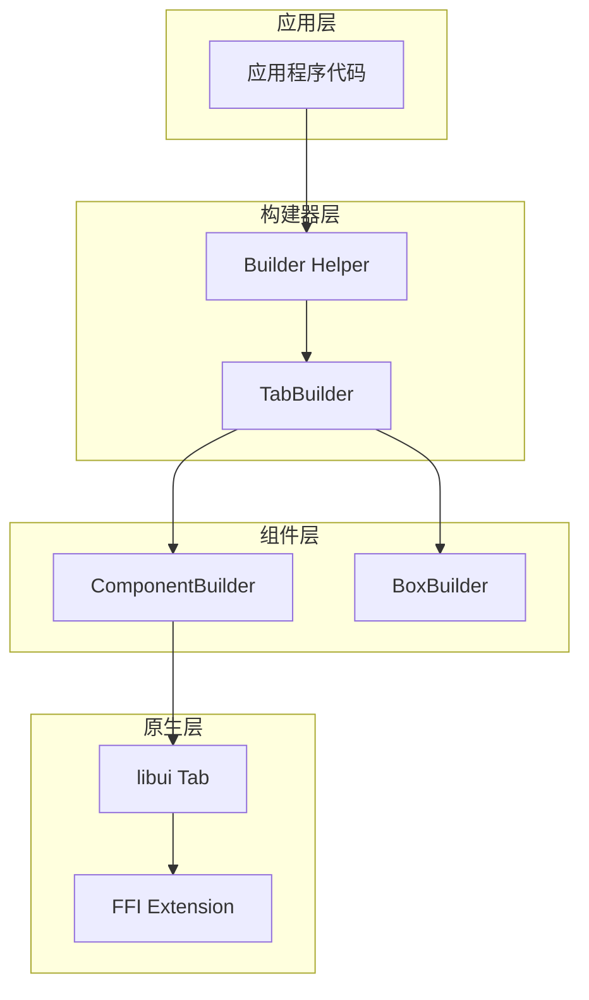

**图表来源**
- [TabBuilder.php](file://src/Builder/TabBuilder.php#L3-L9)
- [ComponentBuilder.php](file://src/ComponentBuilder.php#L1-L10)

### 外部依赖

TabBuilder 依赖于以下外部组件：

1. **libui 库**: 提供原生标签页控件
2. **FFI 扩展**: 用于 PHP 与 C 库的交互
3. **Builder Helper**: 提供便捷的构建器访问方法

### 内部依赖

TabBuilder 依赖于以下内部组件：

1. **ComponentBuilder**: 提供基础的组件构建功能
2. **BoxBuilder**: 用于自动包装数组内容
3. **StateManager**: 用于组件状态管理（间接依赖）

**章节来源**
- [TabBuilder.php](file://src/Builder/TabBuilder.php#L3-L9)
- [ComponentBuilder.php](file://src/ComponentBuilder.php#L1-L10)

## 性能考虑

### 内存管理

TabBuilder 在设计时考虑了内存效率：

- **延迟构建**: 标签页内容只有在需要时才被构建
- **智能缓存**: 已构建的组件会被缓存，避免重复创建
- **及时清理**: 不再使用的标签页内容会被正确释放

### 渲染优化

- **按需渲染**: 只有当前选中的标签页内容会被渲染
- **事件节流**: 标签页切换事件不会过于频繁触发
- **批量操作**: `tabs()` 方法支持批量添加，减少多次调用开销

### 状态同步

- **异步更新**: 状态变更不会阻塞主线程
- **防抖处理**: 避免短时间内多次状态更新
- **增量更新**: 只更新发生变化的部分

## 故障排除指南

### 常见问题及解决方案

#### 标签页内容显示异常

**问题描述**: 添加的标签页内容没有正确显示

**可能原因**:
1. 内容不是有效的组件对象
2. 内容尺寸过大导致显示异常
3. 缺少适当的布局管理

**解决方案**:
```php
// 确保内容是有效的组件
$tab->tab('标题', Builder::label()->text('内容'));

// 或者使用垂直盒子包装数组内容
$tab->tab('标题', [
    Builder::label()->text('第一行'),
    Builder::label()->text('第二行'),
]);
```

#### 标签页切换事件不触发

**问题描述**: `onTabSelected()` 回调没有被调用

**可能原因**:
1. 回调函数格式不正确
2. 标签页数量不足
3. 事件绑定时机错误

**解决方案**:
```php
$tab->onTabSelected(function($index) {
    echo "切换到标签页: {$index}";
    // 注意：这里不能修改标签页状态，否则可能导致无限循环
});
```

#### 默认选中标签页无效

**问题描述**: `selected()` 方法设置的默认选中页不生效

**可能原因**:
1. 索引超出范围
2. 配置应用时机错误
3. 标签页数量为零

**解决方案**:
```php
// 确保索引有效且小于标签页数量
$tab->tabs([
    '标签1' => Builder::label()->text('内容1'),
    '标签2' => Builder::label()->text('内容2'),
])->selected(1); // 选择第二个标签页
```

### 调试技巧

1. **使用 `getSelected()` 检查当前状态**
2. **在回调中添加日志输出**
3. **验证标签页数量和索引范围**
4. **检查组件层次结构**

**章节来源**
- [TabBuilder.php](file://src/Builder/TabBuilder.php#L30-L38)
- [BuilderHelperTest.php](file://tests/BuilderHelperTest.php#L113-L116)

## 结论

TabBuilder 是 libuiBuilder 框架中一个功能强大且设计精良的标签页容器构建器。它通过以下特性为开发者提供了优秀的用户体验：

### 主要优势

1. **简洁的 API 设计**: 提供直观的方法名和流畅的链式调用
2. **智能内容处理**: 自动处理数组内容的包装，简化开发流程
3. **完善的事件系统**: 支持标签页切换事件的监听和响应
4. **灵活的配置选项**: 支持默认选中、事件绑定等多种配置
5. **良好的扩展性**: 易于与其他组件集成，支持复杂的应用场景

### 最佳实践建议

1. **合理使用批量添加**: 对于大量标签页，优先使用 `tabs()` 方法
2. **注意事件回调的副作用**: 避免在回调中修改可能导致无限循环的状态
3. **充分利用自动包装**: 当内容为数组时，让 TabBuilder 自动处理布局
4. **保持状态一致性**: 在不同标签页间共享状态时，确保数据同步
5. **适当使用程序化控制**: 在需要动态切换标签页时，使用 `switchTo()` 方法

### 应用场景总结

TabBuilder 特别适合以下应用场景：
- **配置面板**: 将不同类型的设置分组到不同的标签页
- **向导界面**: 实现步骤式的引导流程
- **仪表板**: 展示不同类型的数据和统计信息
- **多视图编辑器**: 同时编辑多个相关但独立的内容

通过深入理解 TabBuilder 的实现机制和最佳实践，开发者可以构建出更加专业和用户友好的桌面应用程序界面。