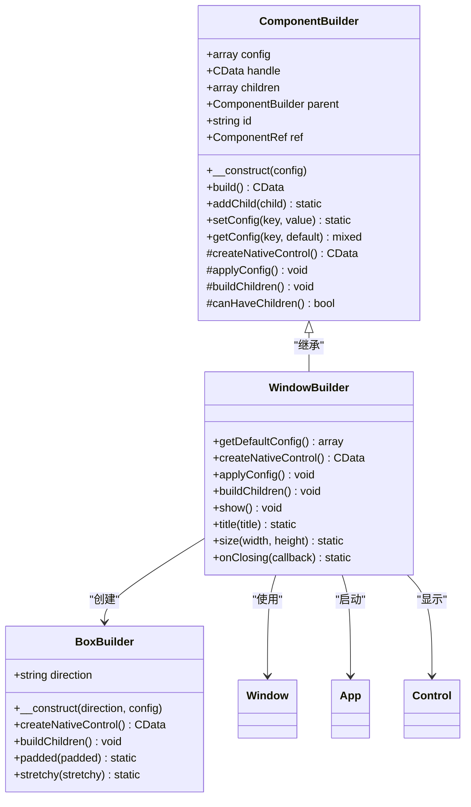
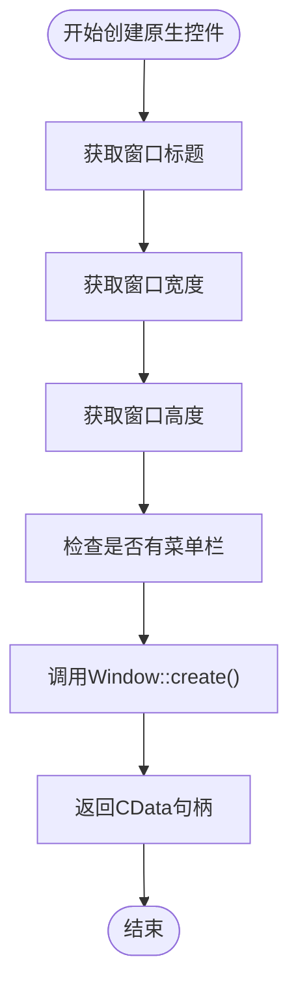
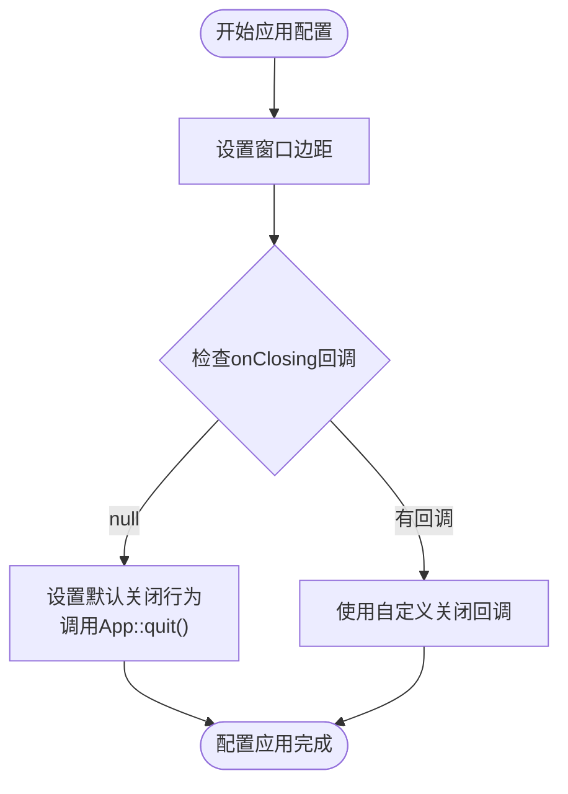
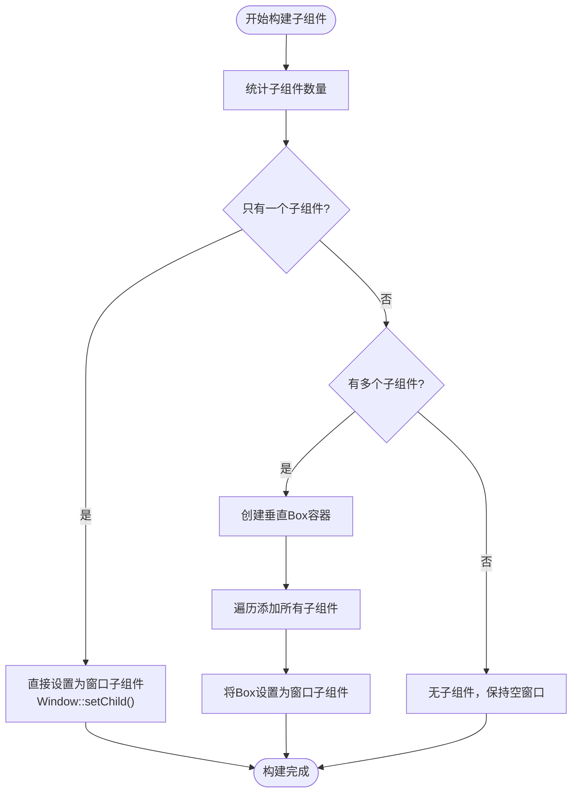
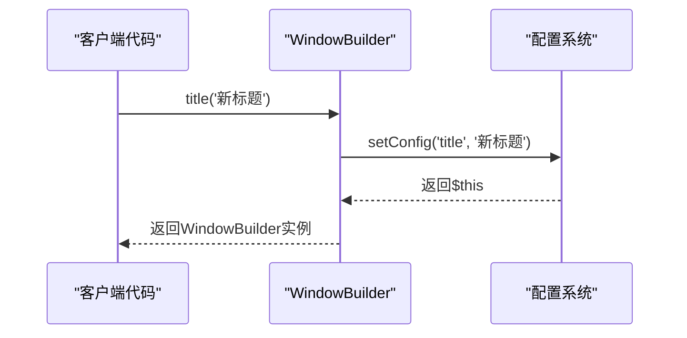
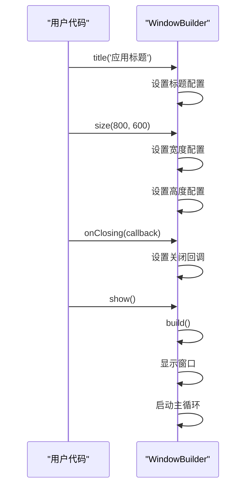
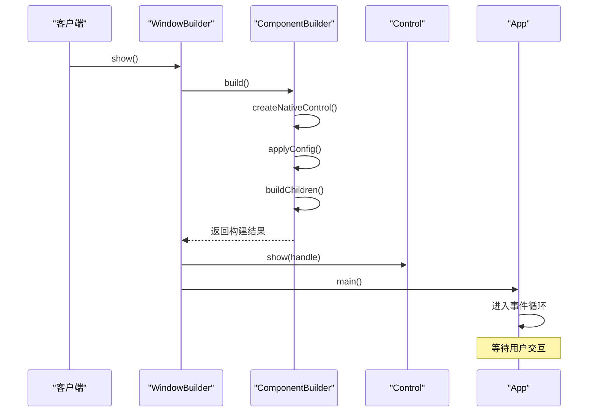

# WindowBuilder 详细文档

<cite>
**本文档中引用的文件**
- [WindowBuilder.php](file://src/Components/WindowBuilder.php)
- [ComponentBuilder.php](file://src/ComponentBuilder.php)
- [BoxBuilder.php](file://src/Components/BoxBuilder.php)
- [full.php](file://example/full.php)
- [calculator.php](file://example/calculator.php)
- [builder_helpers_demo.php](file://example/builder_helpers_demo.php)
- [helper_shortcuts_demo.php](file://example/helper_shortcuts_demo.php)
- [BuilderComponentsTest.php](file://tests/BuilderComponentsTest.php)
</cite>

## 目录
1. [简介](#简介)
2. [核心架构](#核心架构)
3. [默认配置详解](#默认配置详解)
4. [核心方法分析](#核心方法分析)
5. [智能子组件处理机制](#智能子组件处理机制)
6. [链式配置方法](#链式配置方法)
7. [窗口显示与主循环](#窗口显示与主循环)
8. [关闭事件处理](#关闭事件处理)
9. [使用示例](#使用示例)
10. [最佳实践](#最佳实践)

## 简介

WindowBuilder是libui-builder框架中的顶级窗口容器组件，负责创建和管理应用程序的主窗口。它继承自ComponentBuilder基类，提供了完整的窗口生命周期管理和智能子组件布局功能。作为整个GUI应用程序的根容器，WindowBuilder承担着窗口初始化、配置应用、子组件管理和事件处理的核心职责。

## 核心架构

WindowBuilder采用面向对象的设计模式，通过继承ComponentBuilder获得通用的组件构建能力，同时专门针对窗口特性进行了定制化实现。



**图表来源**
- [WindowBuilder.php](file://src/Components/WindowBuilder.php#L11-L96)
- [ComponentBuilder.php](file://src/ComponentBuilder.php#L11-L234)
- [BoxBuilder.php](file://src/Components/BoxBuilder.php#L11-L64)

**章节来源**
- [WindowBuilder.php](file://src/Components/WindowBuilder.php#L11-L96)
- [ComponentBuilder.php](file://src/ComponentBuilder.php#L11-L234)

## 默认配置详解

WindowBuilder提供了丰富的默认配置选项，这些配置项定义了窗口的基本属性和行为特征。

### 核心配置项

| 配置项 | 类型 | 默认值 | 描述 |
|--------|------|--------|------|
| title | string | 'LibUI Application' | 窗口标题，显示在窗口顶部 |
| width | int | 640 | 窗口宽度，单位为像素 |
| height | int | 480 | 窗口高度，单位为像素 |
| hasMenubar | bool | false | 是否显示菜单栏 |
| margined | bool | true | 是否添加窗口边距 |
| onClosing | callable | null | 窗口关闭时的回调函数 |
| resizable | bool | true | 窗口是否可调整大小 |

### 配置项详细说明

#### title（窗口标题）
- **用途**: 定义窗口的显示标题
- **默认值**: 'LibUI Application'
- **影响**: 影响窗口左上角显示的文字内容
- **使用场景**: 应用程序名称、页面标题等

#### size（尺寸）
- **width**: 窗口的初始宽度，默认640像素
- **height**: 窗口的初始高度，默认480像素
- **注意事项**: 尺寸会影响子组件的布局和显示效果

#### resizable（可调整大小）
- **用途**: 控制窗口是否允许用户调整大小
- **默认值**: true（允许调整）
- **影响**: 影响用户体验和界面设计约束

#### margined（边距）
- **用途**: 控制窗口内容与边框之间的间距
- **默认值**: true（添加边距）
- **视觉效果**: 提供更好的视觉层次感

**章节来源**
- [WindowBuilder.php](file://src/Components/WindowBuilder.php#L13-L23)

## 核心方法分析

### createNativeControl() 方法

该方法负责创建底层的原生窗口对象，这是WindowBuilder与libui库交互的核心接口。



**图表来源**
- [WindowBuilder.php](file://src/Components/WindowBuilder.php#L26-L33)

### applyConfig() 方法

该方法应用所有配置到原生窗口对象，包括基本属性设置和事件处理。



**图表来源**
- [WindowBuilder.php](file://src/Components/WindowBuilder.php#L36-L50)

**章节来源**
- [WindowBuilder.php](file://src/Components/WindowBuilder.php#L26-L50)

## 智能子组件处理机制

WindowBuilder实现了智能的子组件处理逻辑，能够根据子组件数量自动选择合适的布局方式。

### buildChildren() 方法逻辑



**图表来源**
- [WindowBuilder.php](file://src/Components/WindowBuilder.php#L58-L70)

### 智能处理策略

#### 单个子组件处理
当窗口只有一个子组件时，直接将其设置为窗口的内容，避免不必要的容器包装。

#### 多个子组件处理
当窗口有多个子组件时，自动创建一个垂直Box容器，将所有子组件包装其中，实现垂直排列布局。

**章节来源**
- [WindowBuilder.php](file://src/Components/WindowBuilder.php#L58-L70)

## 链式配置方法

WindowBuilder提供了丰富的链式配置方法，支持流畅的API调用风格。

### 核心链式方法

#### title() 方法


**图表来源**
- [WindowBuilder.php](file://src/Components/WindowBuilder.php#L81-L84)

#### size() 方法
该方法同时设置宽度和高度，支持链式调用。

#### onClosing() 方法
该方法设置窗口关闭时的回调函数，支持完全自定义的关闭逻辑。

### 链式调用示例流程



**图表来源**
- [WindowBuilder.php](file://src/Components/WindowBuilder.php#L73-L78)

**章节来源**
- [WindowBuilder.php](file://src/Components/WindowBuilder.php#L81-L95)

## 窗口显示与主循环

### show() 方法实现

WindowBuilder的show()方法是启动应用程序的关键入口点，它协调了组件构建、窗口显示和事件循环的完整流程。



**图表来源**
- [WindowBuilder.php](file://src/Components/WindowBuilder.php#L73-L78)
- [ComponentBuilder.php](file://src/ComponentBuilder.php#L209-L231)

### 主循环机制

App::main()方法启动了libui的事件驱动主循环，使窗口能够响应用户输入和系统事件。

**章节来源**
- [WindowBuilder.php](file://src/Components/WindowBuilder.php#L73-L78)

## 关闭事件处理

WindowBuilder提供了灵活的窗口关闭事件处理机制，支持默认行为和自定义回调两种模式。

### 默认关闭行为

```mermaid
flowchart TD
WindowClose[窗口关闭请求] --> DefaultHandler[默认关闭处理器]
DefaultHandler --> AppQuit[调用App::quit()]
AppQuit --> EventReturn[返回1表示阻止默认行为]
EventReturn --> ApplicationExit[应用程序退出]
```

**图表来源**
- [WindowBuilder.php](file://src/Components/WindowBuilder.php#L44-L47)

### 自定义关闭回调

当用户提供onClosing回调时，系统会使用用户的自定义逻辑替代默认行为。

```mermaid
flowchart TD
WindowClose[窗口关闭请求] --> CheckCallback{"检查onClosing回调"}
CheckCallback --> |null| DefaultBehavior[使用默认关闭行为]
CheckCallback --> |有回调| CustomCallback[调用用户提供的回调]
DefaultBehavior --> AppQuit[App::quit()]
CustomCallback --> UserLogic[执行用户自定义逻辑]
UserLogic --> Decision{"用户决定如何处理"}
Decision --> |保存数据| SaveData[保存重要数据]
Decision --> |显示确认| ShowDialog[显示确认对话框]
Decision --> |直接退出| SkipSave[跳过保存直接退出]
SaveData --> AppQuit
ShowDialog --> UserChoice{"用户选择"}
UserChoice --> |确认| AppQuit
UserChoice --> |取消| PreventClose[阻止关闭]
SkipSave --> AppQuit
PreventClose --> ContinueRunning[继续运行]
```

**图表来源**
- [WindowBuilder.php](file://src/Components/WindowBuilder.php#L48-L50)

### 关闭回调的最佳实践

#### 保存数据场景
```php
// 示例：保存用户数据后再关闭
$window->onClosing(function() {
    // 检查是否有未保存的数据
    if ($hasUnsavedChanges) {
        // 显示保存确认对话框
        $saveConfirmed = showConfirmationDialog("是否保存更改?");
        if ($saveConfirmed) {
            // 执行保存操作
            saveUserData();
        }
        // 允许关闭窗口
        return 1;
    }
    // 没有未保存的数据，直接关闭
    return 1;
});
```

#### 确认对话框场景
```php
// 示例：显示确认对话框
$window->onClosing(function() {
    // 显示确认对话框
    $confirmed = showConfirmationDialog("确定要退出应用吗?");
    if ($confirmed) {
        // 用户确认，允许关闭
        return 1;
    } else {
        // 用户取消，阻止关闭
        return 0;
    }
});
```

**章节来源**
- [WindowBuilder.php](file://src/Components/WindowBuilder.php#L40-L50)

## 使用示例

### 基础窗口创建

最简单的窗口创建方式，使用默认配置：

```php
// 基础窗口示例路径参考
// [WindowBuilder基础使用](file://example/full.php#L14-L18)
```

### 高级配置窗口

展示多种配置选项的组合使用：

```php
// 高级配置示例路径参考
// [WindowBuilder高级配置](file://example/calculator.php#L214-L219)
```

### 自定义关闭行为

实现保存数据和确认对话框的复杂关闭逻辑：

```php
// 自定义关闭行为示例路径参考
// [WindowBuilder关闭处理](file://example/builder_helpers_demo.php#L88-L124)
```

### 链式调用模式

展示流畅的API调用风格：

```php
// 链式调用示例路径参考
// [WindowBuilder链式调用](file://example/helper_shortcuts_demo.php#L72-L102)
```

**章节来源**
- [full.php](file://example/full.php#L14-L18)
- [calculator.php](file://example/calculator.php#L214-L219)
- [builder_helpers_demo.php](file://example/builder_helpers_demo.php#L88-L124)
- [helper_shortcuts_demo.php](file://example/helper_shortcuts_demo.php#L72-L102)

## 最佳实践

### 窗口配置建议

1. **合理设置初始尺寸**: 根据应用内容预估合适的窗口大小
2. **启用边距**: 通常应该启用margined=true以获得更好的视觉效果
3. **提供有意义的标题**: 使用描述性的窗口标题

### 子组件组织

1. **单一组件**: 当只有一个主要组件时，直接添加即可
2. **多个组件**: 使用BoxBuilder进行智能布局包装
3. **嵌套结构**: 合理组织组件层次，避免过深的嵌套

### 事件处理

1. **关闭事件**: 总是提供适当的onClosing回调，特别是涉及数据保存的应用
2. **资源清理**: 在关闭回调中确保释放必要的系统资源
3. **用户体验**: 提供清晰的确认提示，避免意外关闭

### 性能考虑

1. **延迟加载**: 对于大型应用，考虑延迟加载非关键组件
2. **内存管理**: 及时释放不需要的组件引用
3. **事件优化**: 避免在高频事件中执行耗时操作

### 错误处理

1. **异常捕获**: 在onClosing回调中妥善处理可能的异常
2. **回退机制**: 提供合理的默认行为作为异常情况的处理
3. **日志记录**: 记录重要的关闭事件和错误信息

通过遵循这些最佳实践，可以构建出稳定、高效且用户友好的桌面应用程序界面。