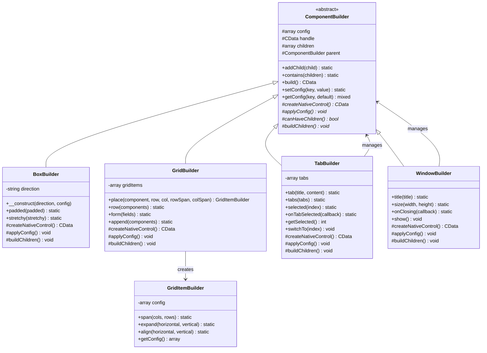
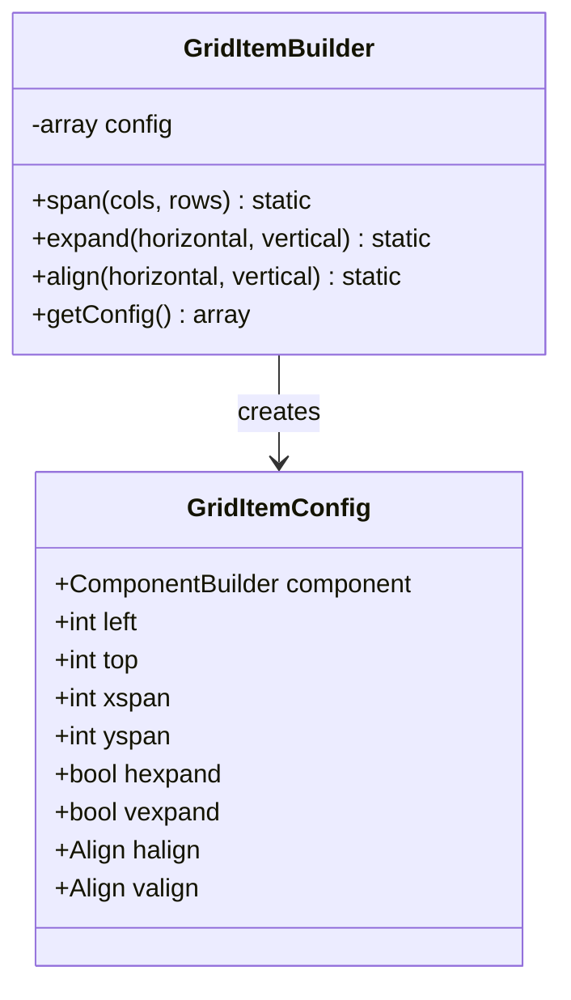
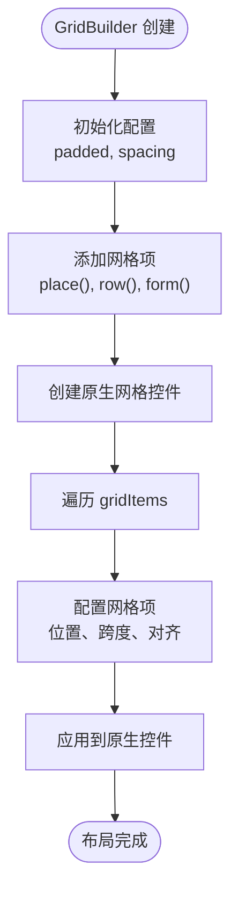
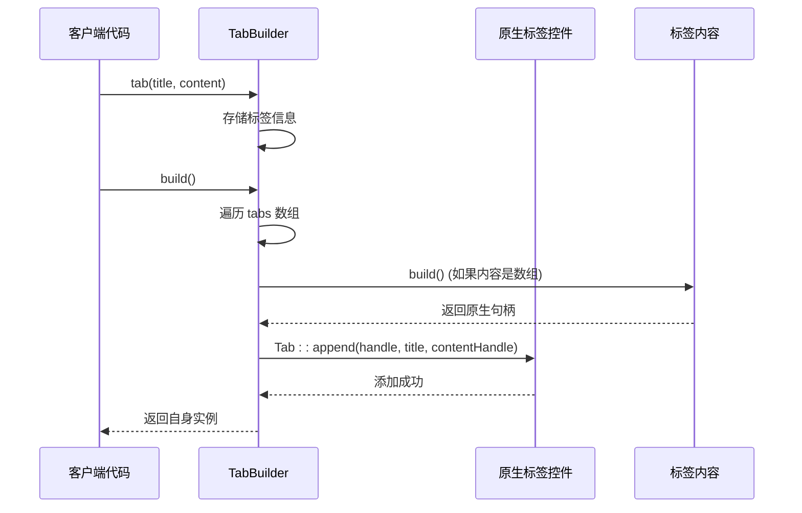
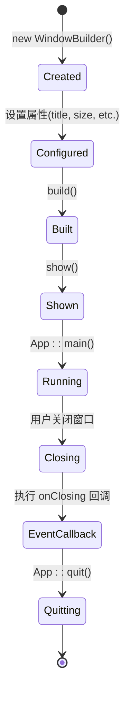
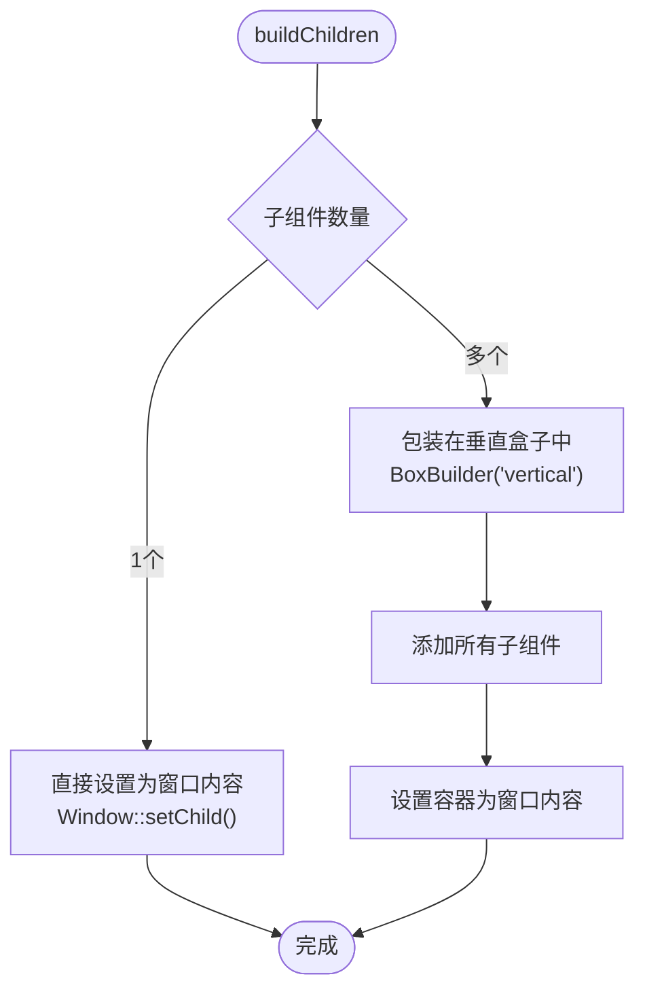

# 容器组件

<cite>
**本文档中引用的文件**
- [BoxBuilder.php](file://src/Components/BoxBuilder.php)
- [GridBuilder.php](file://src/Components/GridBuilder.php)
- [GridItemBuilder.php](file://src/Components/GridItemBuilder.php)
- [TabBuilder.php](file://src/Builder/TabBuilder.php)
- [WindowBuilder.php](file://src/Components/WindowBuilder.php)
- [ComponentBuilder.php](file://src/ComponentBuilder.php)
- [full.php](file://example/full.php)
- [htmlFull.php](file://example/htmlFull.php)
- [BUGFIX_ROWSPAN.md](file://BUGFIX_ROWSPAN.md)
</cite>

## 目录
1. [简介](#简介)
2. [架构概览](#架构概览)
3. [BoxBuilder - 方向性容器](#boxbuilder---方向性容器)
4. [GridBuilder - 网格布局容器](#gridbuilder---网格布局容器)
5. [TabBuilder - 标签页容器](#tabbuilder---标签页容器)
6. [WindowBuilder - 窗口容器](#windowbuilder---窗口容器)
7. [Builder API 使用示例](#builder-api-使用示例)
8. [HTML 模板使用示例](#html-模板使用示例)
9. [常见布局错误与解决方案](#常见布局错误与解决方案)
10. [总结](#总结)

## 简介

容器组件是 libuiBuilder 框架中负责管理 UI 布局的核心组件。它们通过 `addChild` 方法管理子组件的添加逻辑，支持嵌套布局结构，并为不同类型的界面布局提供了专门的容器实现。主要的容器组件包括：

- **BoxBuilder**: 提供水平和垂直方向的线性布局
- **GridBuilder**: 实现二维网格布局，支持复杂的行列定位
- **TabBuilder**: 管理标签页界面，支持动态内容切换
- **WindowBuilder**: 作为顶级容器，管理整个应用程序窗口

## 架构概览

所有容器组件都继承自 `ComponentBuilder` 基类，遵循统一的设计模式：



**图表来源**
- [ComponentBuilder.php](file://src/ComponentBuilder.php#L11-L234)
- [BoxBuilder.php](file://src/Components/BoxBuilder.php#L11-L64)
- [GridBuilder.php](file://src/Components/GridBuilder.php#L9-L150)
- [GridItemBuilder.php](file://src/Components/GridItemBuilder.php#L8-L60)
- [TabBuilder.php](file://src/Builder/TabBuilder.php#L10-L106)
- [WindowBuilder.php](file://src/Components/WindowBuilder.php#L11-L96)

## BoxBuilder - 方向性容器

### 核心特性

BoxBuilder 是最基础的容器组件，提供简单的线性布局功能。它支持两种方向的布局：水平（horizontal）和垂直（vertical）。

### 主要配置方法

| 方法 | 参数 | 描述 | 默认值 |
|------|------|------|--------|
| `padded()` | `bool $padded = true` | 设置容器是否有内边距 | `true` |
| `stretchy()` | `bool $stretchy = true` | 设置子元素是否可拉伸 | `false` |

### 实现机制

BoxBuilder 通过以下核心方法实现布局管理：

```mermaid
sequenceDiagram
participant Client as 客户端代码
participant Box as BoxBuilder
participant Native as 原生控件
participant Child as 子组件
Client->>Box : new BoxBuilder(direction, config)
Box->>Box : 初始化方向和配置
Client->>Box : addChild(child)
Box->>Child : build()
Child-->>Box : 返回原生句柄
Box->>Native : Box : : append(handle, childHandle, stretchy)
Box-->>Client : 返回自身实例
```

**图表来源**
- [BoxBuilder.php](file://src/Components/BoxBuilder.php#L46-L53)

### 使用场景

BoxBuilder 适用于：
- 导航栏和工具栏的水平排列
- 内容区域的垂直组织
- 简单的按钮组和控件组合

**章节来源**
- [BoxBuilder.php](file://src/Components/BoxBuilder.php#L1-L64)

## GridBuilder - 网格布局容器

### 核心特性

GridBuilder 提供强大的二维网格布局功能，支持复杂的行列定位和组件跨度控制。

### 主要配置方法

| 方法 | 参数 | 描述 | 默认值 |
|------|------|------|--------|
| `padded()` | `bool $padded = true` | 设置网格是否有内边距 | `true` |
| `columnSpacing()` | `int $spacing = 1` | 列间距 | `1` |
| `rowSpacing()` | `int $spacing = 1` | 行间距 | `1` |

### GridItemBuilder - 网格项配置

GridBuilder 使用 GridItemBuilder 来管理每个网格项的详细配置：



**图表来源**
- [GridItemBuilder.php](file://src/Components/GridItemBuilder.php#L8-L60)

### 核心布局方法

| 方法 | 描述 | 使用场景 |
|------|------|----------|
| `place()` | 在指定位置放置组件 | 精确控制布局 |
| `row()` | 在新行添加一组组件 | 快速行布局 |
| `form()` | 创建表单布局 | 表单字段对齐 |
| `append()` | 在表单后追加组件 | 底部操作区域 |

### GridBuilder 生命周期



**图表来源**
- [GridBuilder.php](file://src/Components/GridBuilder.php#L37-L56)

**章节来源**
- [GridBuilder.php](file://src/Components/GridBuilder.php#L1-L150)
- [GridItemBuilder.php](file://src/Components/GridItemBuilder.php#L1-L60)

## TabBuilder - 标签页容器

### 核心特性

TabBuilder 提供标签页界面管理功能，支持动态内容切换和事件处理。

### 主要配置方法

| 方法 | 参数 | 描述 | 默认值 |
|------|------|------|--------|
| `selected()` | `int $index` | 设置默认选中的标签页索引 | `0` |
| `onTabSelected()` | `callable $callback` | 绑定标签页切换事件 | `null` |

### 标签页管理流程



**图表来源**
- [TabBuilder.php](file://src/Builder/TabBuilder.php#L46-L61)

### 动态操作方法

| 方法 | 描述 | 使用场景 |
|------|------|----------|
| `getSelected()` | 获取当前选中的标签页索引 | 状态查询 |
| `switchTo()` | 程序化切换到指定标签页 | 自动导航 |

**章节来源**
- [TabBuilder.php](file://src/Builder/TabBuilder.php#L1-L106)

## WindowBuilder - 窗口容器

### 核心特性

WindowBuilder 是顶层容器，负责管理整个应用程序窗口，支持窗口属性配置和生命周期管理。

### 主要配置方法

| 方法 | 参数 | 描述 | 默认值 |
|------|------|------|--------|
| `title()` | `string $title` | 设置窗口标题 | `'LibUI Application'` |
| `size()` | `int $width, int $height` | 设置窗口尺寸 | `640x480` |
| `onClosing()` | `callable $callback` | 设置关闭事件回调 | 默认退出应用 |

### 窗口生命周期



**图表来源**
- [WindowBuilder.php](file://src/Components/WindowBuilder.php#L73-L78)

### 子组件处理策略

WindowBuilder 采用智能的子组件处理策略：



**图表来源**
- [WindowBuilder.php](file://src/Components/WindowBuilder.php#L58-L70)

**章节来源**
- [WindowBuilder.php](file://src/Components/WindowBuilder.php#L1-L96)

## Builder API 使用示例

### 基础布局示例

以下示例展示了如何使用 Builder API 构建多层级界面布局：

```php
// 创建主窗口
$app = Builder::window()
    ->title('复杂布局示例')
    ->size(800, 600)
    ->contains([
        // 垂直布局的主内容区域
        Builder::vbox()
            ->padded(true)
            ->stretchy(true)
            ->contains([
                // 标题区域
                Builder::label()
                    ->text('用户信息管理')
                    ->style('font-size: 18px; font-weight: bold;'),
                
                // 分隔符
                Builder::hSeparator(),
                
                // 表单区域 - 使用网格布局
                Builder::grid()
                    ->form([
                        [
                            'label' => Builder::label()->text('姓名:'),
                            'control' => Builder::entry()
                                ->id('name')
                                ->placeholder('请输入姓名')
                        ],
                        [
                            'label' => Builder::label()->text('邮箱:'),
                            'control' => Builder::entry()
                                ->id('email')
                                ->placeholder('请输入邮箱地址')
                                ->type('email')
                        ],
                        [
                            'label' => Builder::label()->text('年龄:'),
                            'control' => Builder::spinbox()
                                ->id('age')
                                ->range(18, 100)
                                ->value(25)
                        ]
                    ])
                    ->padded(true)
                    ->columnSpacing(10)
                    ->rowSpacing(5),
                
                // 操作按钮区域
                Builder::hbox()
                    ->padded(true)
                    ->contains([
                        Builder::button()
                            ->text('保存')
                            ->onClick(function($btn) {
                                // 处理保存逻辑
                            }),
                        Builder::button()
                            ->text('取消')
                            ->onClick(function($btn) {
                                // 处理取消逻辑
                            })
                    ])
            ])
    ]);
```

### 标签页布局示例

```php
// 创建标签页界面
$tabs = Builder::tab()
    ->tab('基本信息', [
        Builder::label()->text('这是基本信息标签页'),
        Builder::entry()->id('basicInfo')
    ])
    ->tab('详细信息', [
        Builder::label()->text('这是详细信息标签页'),
        Builder::grid()->form([
            ['label' => Builder::label()->text('职业:'), 'control' => Builder::entry()],
            ['label' => Builder::label()->text('地址:'), 'control' => Builder::entry()]
        ])
    ])
    ->tab('联系方式', [
        Builder::label()->text('这是联系方式标签页'),
        Builder::grid()->form([
            ['label' => Builder::label()->text('电话:'), 'control' => Builder::entry()],
            ['label' => Builder::label()->text('微信:'), 'control' => Builder::entry()]
        ])
    ])
    ->onTabSelected(function($index) {
        echo "切换到标签页: $index\n";
    });
```

**章节来源**
- [full.php](file://example/full.php#L13-L180)

## HTML 模板使用示例

### 基于 HTML 的布局定义

HTML 模板系统允许通过声明式的方式定义复杂的布局结构：

```html
<!-- 完整功能演示 -->
<div class="window" title="完整功能演示" width="800" height="700">
    <div class="vbox" padded="true">
        <!-- 标题 -->
        <div class="label">基础控件演示</div>
        <hr/>
        
        <!-- 表单区域 -->
        <div class="grid" form="true">
            <div class="row">
                <div class="label">单行输入:</div>
                <div class="entry" placeholder="输入文本" id="singleLineInput"></div>
            </div>
            
            <div class="row">
                <div class="label">多行输入:</div>
                <div class="multilineEntry" placeholder="输入多行文本..." word-wrap="true" id="multiLineInput"></div>
            </div>
        </div>
        
        <!-- 操作按钮 -->
        <div class="hbox" padded="true">
            <div class="button" onclick="handleGetAllValues">获取所有值</div>
            <div class="button" onclick="handleResetForm">重置表单</div>
        </div>
    </div>
</div>
```

### 网格布局模板示例

```html
<!-- 网格布局模板 -->
<div class="grid" column-spacing="10" row-spacing="5">
    <!-- 表单布局 -->
    <div class="row">
        <div class="label">用户名:</div>
        <div class="entry" id="username" placeholder="请输入用户名"></div>
    </div>
    
    <div class="row">
        <div class="label">密码:</div>
        <div class="entry" type="password" id="password" placeholder="请输入密码"></div>
    </div>
    
    <!-- 按钮区域 - 占据整行 -->
    <div class="row" colspan="2">
        <div class="button" onclick="loginHandler">登录</div>
        <div class="button" onclick="cancelHandler">取消</div>
    </div>
</div>
```

### 标签页模板示例

```html
<!-- 标签页模板 -->
<div class="tab">
    <div class="tab-item" title="用户信息">
        <div class="vbox">
            <div class="label">用户基本信息</div>
            <div class="grid" form="true">
                <div class="row">
                    <div class="label">姓名:</div>
                    <div class="entry" id="userInfoName"></div>
                </div>
            </div>
        </div>
    </div>
    
    <div class="tab-item" title="权限设置">
        <div class="vbox">
            <div class="label">权限管理</div>
            <div class="checkbox" id="permAdmin">管理员权限</div>
            <div class="checkbox" id="permEdit">编辑权限</div>
        </div>
    </div>
</div>
```

**章节来源**
- [htmlFull.php](file://example/htmlFull.php#L1-L76)

## 常见布局错误与解决方案

### GridBuilder rowspan 使用限制

根据 BUGFIX_ROWSPAN.md 的分析，GridBuilder 在处理 rowspan 和 colspan 时存在一个重要的陷阱：

#### 问题描述
当 HTML 模板中未显式设置 `rowspan` 或 `colspan` 属性时，`DOMElement::getAttribute()` 方法会返回空字符串 `""`，而不是 `null`。这会导致 `(int)""` 结果为 `0`，从而引发 macOS 自动布局约束错误。

#### 错误代码示例
```php
// 错误的处理方式
$rowspan = (int)($child->getAttribute('rowspan') ?? 1);  // 永远得到 0
$colspan = (int)($child->getAttribute('colspan') ?? 1);  // 永远得到 0
```

#### 解决方案
使用 `?:` 操作符替代 `??` 操作符：

```php
// 正确的处理方式
$rowspan = (int)($child->getAttribute('rowspan') ?: 1);  // 空字符串时得到 1
$colspan = (int)($child->getAttribute('colspan') ?: 1);  // 空字符串时得到 1
```

#### 最佳实践

| 场景 | 推荐解决方案 | 示例 |
|------|-------------|------|
| DOM 属性处理 | 使用 `?:` 操作符 | `$value = $attr ?: 'default'` |
| 数值转换 | 显式类型检查 | `$value = ($attr !== '') ? (int)$attr : 1` |
| 默认值设置 | 使用逻辑运算符 | `$value = $attr \|\| 1` |

### 其他常见布局问题

#### 1. 子组件过多导致的性能问题
**问题**: 在 WindowBuilder 中添加大量子组件可能导致性能下降。

**解决方案**: 
- 使用 BoxBuilder 包装多个子组件
- 合理使用 TabBuilder 分割内容
- 避免过深的嵌套层次

#### 2. GridBuilder 跨越冲突
**问题**: 多个网格项的跨度设置不当会导致布局混乱。

**解决方案**:
```php
// 确保网格项不重叠
$grid->row([
    Builder::label()->text('第一行'),
    Builder::label()->text('第二行')->span(2, 1)  // 占据两列
]);

// 使用 form() 方法简化表单布局
$grid->form([
    ['label' => $label1, 'control' => $control1],
    ['label' => $label2, 'control' => $control2]
]);
```

#### 3. TabBuilder 内容加载时机
**问题**: 标签页内容可能在需要时才加载，影响用户体验。

**解决方案**:
```php
// 延迟加载标签页内容
$tab->tab('动态内容', function() {
    // 异步加载内容
    return Builder::vbox()->contains([
        Builder::label()->text('正在加载内容...'),
        Builder::progressBar()->indeterminate(true)
    ]);
});
```

**章节来源**
- [BUGFIX_ROWSPAN.md](file://BUGFIX_ROWSPAN.md#L1-L78)

## 总结

容器组件是 libuiBuilder 框架的核心，它们通过统一的 `ComponentBuilder` 基类提供了强大而灵活的布局能力：

### 主要优势

1. **统一的 API 设计**: 所有容器组件都遵循相同的接口规范
2. **链式调用支持**: 支持流畅的配置和构建语法
3. **灵活的布局策略**: 支持多种布局模式和嵌套结构
4. **双向绑定支持**: 既支持 Builder API 也支持 HTML 模板
5. **完善的生命周期管理**: 自动处理组件的创建、配置和销毁

### 选择指南

| 布局需求 | 推荐容器 | 特点 |
|----------|----------|------|
| 简单线性布局 | BoxBuilder | 水平或垂直排列 |
| 复杂表格布局 | GridBuilder | 精确的行列控制 |
| 分页界面 | TabBuilder | 内容隔离和切换 |
| 应用程序窗口 | WindowBuilder | 顶级容器管理 |

### 最佳实践

1. **合理使用嵌套**: 避免过深的嵌套层次，通常不超过 3-4 层
2. **性能优化**: 对于大量数据，考虑使用虚拟化技术
3. **响应式设计**: 利用容器的拉伸属性适应不同屏幕尺寸
4. **错误处理**: 对 GridBuilder 的跨度参数进行有效性检查
5. **代码组织**: 将复杂的布局逻辑封装到独立的构建函数中

通过掌握这些容器组件的使用方法，开发者可以构建出结构清晰、易于维护的 GUI 应用程序界面。