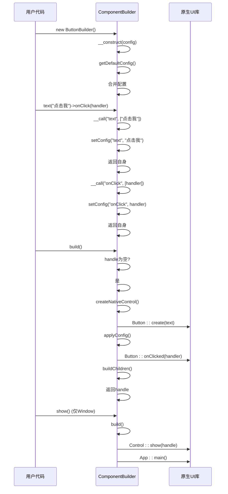

# 组件库

<cite>
**本文档中引用的文件**
- [ComponentBuilder.php](file://src/ComponentBuilder.php)
- [BoxBuilder.php](file://src/Components/BoxBuilder.php)
- [GridBuilder.php](file://src/Components/GridBuilder.php)
- [ButtonBuilder.php](file://src/Components/ButtonBuilder.php)
- [WindowBuilder.php](file://src/Components/WindowBuilder.php)
- [LabelBuilder.php](file://src/Components/LabelBuilder.php)
- [EntryBuilder.php](file://src/Components/EntryBuilder.php)
- [CheckboxBuilder.php](file://src/Components/CheckboxBuilder.php)
- [SliderBuilder.php](file://src/Components/SliderBuilder.php)
- [TableBuilder.php](file://src/Components/TableBuilder.php)
- [GridItemBuilder.php](file://src/Components/GridItemBuilder.php)
- [MultilineEntryBuilder.php](file://src/Components/MultilineEntryBuilder.php)
- [ComboboxBuilder.php](file://src/Components/ComboboxBuilder.php)
- [RadioBuilder.php](file://src/Components/RadioBuilder.php)
- [ProgressBarBuilder.php](file://src/Components/ProgressBarBuilder.php)
</cite>

## 目录
1. [简介](#简介)
2. [组件分类概述](#组件分类概述)
3. [组件继承关系与生命周期](#组件继承关系与生命周期)
4. [基础组件](#基础组件)
   - [按钮 (Button)](#按钮-button)
   - [标签 (Label)](#标签-label)
   - [单行输入框 (Entry)](#单行输入框-entry)
   - [多行输入框 (MultilineEntry)](#多行输入框-multilineentry)
   - [复选框 (Checkbox)](#复选框-checkbox)
   - [单选框 (Radio)](#单选框-radio)
   - [滑块 (Slider)](#滑块-slider)
   - [下拉框 (Combobox)](#下拉框-combobox)
   - [进度条 (ProgressBar)](#进度条-progressbar)
5. [容器组件](#容器组件)
   - [盒子 (Box)](#盒子-box)
   - [网格 (Grid)](#网格-grid)
6. [顶级组件](#顶级组件)
   - [窗口 (Window)](#窗口-window)
7. [表格组件](#表格组件)
   - [表格 (Table)](#表格-table)
8. [附录：HTML模板标签参考](#附录html模板标签参考)

## 简介
本参考文档全面介绍了UI组件库中的所有组件。文档首先对组件进行分类概述，然后详细说明每个组件的用途、配置属性、事件处理、HTML模板标签及使用示例。特别关注了组件的继承关系和生命周期，从构造、构建到渲染的全过程。

## 组件分类概述
UI组件库中的组件主要分为以下几类：

- **基础组件**：构成用户界面的基本元素，如按钮、标签、输入框等。
- **容器组件**：用于组织和布局其他组件，如盒子（Box）和网格（Grid）。
- **顶级组件**：应用程序的根组件，如窗口（Window）。
- **数据组件**：用于展示和操作数据的复杂组件，如表格（Table）。

所有组件均继承自`ComponentBuilder`基类，遵循一致的构建和配置模式。

## 组件继承关系与生命周期

```mermaid
classDiagram
class ComponentBuilder {
<<abstract>>
+config : array
+handle : CData
+children : ComponentBuilder[]
+parent : ComponentBuilder
+id : string
+ref : ComponentRef
+boundState : string
+eventHandlers : array
+__construct(config)
+build() : CData
+setConfig(key, value) : static
+__call(name, args) : static
+id(id) : static
+bind(stateKey) : static
+on(event, handler) : static
+getValue()
+setValue(value) : void
+emit(event, ...args) : void
+contains(children) : static
+addChild(child) : static
+canHaveChildren() : bool
+buildChildren() : void
+createNativeControl() : CData
+applyConfig() : void
+getDefaultConfig() : array
}
class BoxBuilder {
+direction : string
+padded(padded) : static
+stretchy(stretchy) : static
+canHaveChildren() : bool
+buildChildren() : void
}
class GridBuilder {
+gridItems : GridItemBuilder[]
+place(component, row, col, rowSpan, colSpan) : GridItemBuilder
+row(components) : static
+form(fields) : static
+append(components) : static
+canHaveChildren() : bool
+buildChildren() : void
}
class ButtonBuilder {
+text(text) : static
+onClick(callback) : static
}
class WindowBuilder {
+show() : void
+title(title) : static
+size(width, height) : static
+onClosing(callback) : static
+canHaveChildren() : bool
+buildChildren() : void
}
class LabelBuilder {
+text(text) : static
+align(align) : static
+color(color) : static
}
class EntryBuilder {
+text(text) : static
+placeholder(placeholder) : static
+onChange(callback) : static
}
class CheckboxBuilder {
+text(text) : static
+checked(checked) : static
+disabled(disabled) : static
+onToggle(callback) : static
+toggle() : static
}
class SliderBuilder {
+min(min) : static
+max(max) : static
+value(value) : static
+range(min, max) : static
}
class TableBuilder {
+columns(columns) : static
+data(data) : static
+onRowSelected(callback) : static
+editable(editable) : static
}
class ComboboxBuilder {
+items(items) : static
+addItem(text, value) : static
+selected(index) : static
+placeholder(placeholder) : static
+editable(editable) : static
+onSelected(callback) : static
+clear() : static
+removeItem(index) : static
}
class RadioBuilder {
+items(items) : static
+addItem(text, value) : static
+selected(selected) : static
}
class ProgressBarBuilder {
+value(value) : static
+indeterminate(indeterminate) : static
}
ComponentBuilder <|-- BoxBuilder
ComponentBuilder <|-- GridBuilder
ComponentBuilder <|-- ButtonBuilder
ComponentBuilder <|-- WindowBuilder
ComponentBuilder <|-- LabelBuilder
ComponentBuilder <|-- EntryBuilder
ComponentBuilder <|-- CheckboxBuilder
ComponentBuilder <|-- SliderBuilder
ComponentBuilder <|-- TableBuilder
ComponentBuilder <|-- ComboboxBuilder
ComponentBuilder <|-- RadioBuilder
ComponentBuilder <|-- ProgressBarBuilder
```



**图示来源**
- [ComponentBuilder.php](file://src/ComponentBuilder.php#L11-L234)
- [BoxBuilder.php](file://src/Components/BoxBuilder.php#L11-L64)
- [GridBuilder.php](file://src/Components/GridBuilder.php#L9-L150)
- [ButtonBuilder.php](file://src/Components/ButtonBuilder.php#L9-L48)
- [WindowBuilder.php](file://src/Components/WindowBuilder.php#L11-L96)
- [LabelBuilder.php](file://src/Components/LabelBuilder.php#L9-L62)
- [EntryBuilder.php](file://src/Components/EntryBuilder.php#L9-L80)
- [CheckboxBuilder.php](file://src/Components/CheckboxBuilder.php#L9-L97)
- [SliderBuilder.php](file://src/Components/SliderBuilder.php#L9-L78)
- [TableBuilder.php](file://src/Components/TableBuilder.php#L10-L154)
- [ComboboxBuilder.php](file://src/Components/ComboboxBuilder.php#L10-L258)
- [RadioBuilder.php](file://src/Components/RadioBuilder.php#L9-L80)
- [ProgressBarBuilder.php](file://src/Components/ProgressBarBuilder.php#L9-L56)

### 组件继承关系
所有UI组件都继承自抽象基类`ComponentBuilder`。该基类提供了以下核心功能：
- **链式配置**：通过`__call`魔术方法实现任意属性的链式调用。
- **事件处理**：通过`on`方法注册事件处理器，`emit`方法触发事件。
- **状态绑定**：通过`bind`方法将组件与状态管理器关联。
- **组件引用**：通过`id`方法为组件分配唯一ID，便于引用和操作。

容器组件（如`BoxBuilder`和`GridBuilder`）重写了`canHaveChildren`和`buildChildren`方法，以支持子组件的添加和布局。

### 组件生命周期
组件的生命周期包括以下阶段：
1. **构造**：通过构造函数初始化组件，合并默认配置和用户提供的配置。
2. **构建**：调用`build`方法时，创建原生控件句柄，应用配置，并递归构建子组件。
3. **渲染**：对于窗口组件，调用`show`方法显示界面并启动主事件循环。



**图示来源**
- [ComponentBuilder.php](file://src/ComponentBuilder.php#L25-L234)
- [ButtonBuilder.php](file://src/Components/ButtonBuilder.php#L20-L37)
- [WindowBuilder.php](file://src/Components/WindowBuilder.php#L73-L78)

## 基础组件

### 按钮 (Button)

**用途**：触发操作的可点击元素。

**配置属性**：
- `text(string $text)`：设置按钮显示文本。
- `onClick(callable $callback)`：设置点击事件处理器。

**事件**：
- `click`：当按钮被点击时触发。

**HTML模板标签**：
```html
<button ui:text="按钮文本" ui:onClick="handleClick"></button>
```

**使用示例**：
```php
// Builder API
$button = new ButtonBuilder(['text' => '提交'])
    ->onClick(function($button, $state) {
        echo "按钮被点击！";
    });

// 或使用链式调用
$button = (new ButtonBuilder())
    ->text('提交')
    ->onClick(function($button, $state) {
        echo "按钮被点击！";
    });
```

**组件来源**
- [ButtonBuilder.php](file://src/Components/ButtonBuilder.php#L9-L48)

### 标签 (Label)

**用途**：显示静态文本。

**配置属性**：
- `text(string $text)`：设置标签文本。
- `align(string $align)`：设置文本对齐方式（'left', 'center', 'right'）。
- `color(array $color)`：设置文本颜色。

**事件**：无

**HTML模板标签**：
```html
<label ui:text="标签文本" ui:align="center" ui:color="[255,0,0]"></label>
```

**使用示例**：
```php
// Builder API
$label = new LabelBuilder(['text' => '用户名：'])
    ->align('right')
    ->color([128, 128, 128]);

// 链式调用
$label = (new LabelBuilder())
    ->text('用户名：')
    ->align('right');
```

**组件来源**
- [LabelBuilder.php](file://src/Components/LabelBuilder.php#L9-L62)

### 单行输入框 (Entry)

**用途**：接收单行文本输入。

**配置属性**：
- `text(string $text)`：设置输入框文本。
- `placeholder(string $placeholder)`：设置占位符文本。
- `onChange(callable $callback)`：设置文本改变事件处理器。

**事件**：
- `change`：当输入框内容改变时触发。

**HTML模板标签**：
```html
<input type="text" ui:text="初始值" ui:placeholder="请输入..." ui:onChange="handleChange"></input>
```

**使用示例**：
```php
// Builder API
$username = new EntryBuilder([
    'placeholder' => '请输入用户名',
    'onChange' => function($newValue, $component) {
        echo "用户名改变为：$newValue";
    }
]);

// 链式调用
$password = (new EntryBuilder())
    ->placeholder('请输入密码')
    ->onChange(function($newValue, $component) {
        echo "密码已输入";
    });
```

**组件来源**
- [EntryBuilder.php](file://src/Components/EntryBuilder.php#L9-L80)

### 多行输入框 (MultilineEntry)

**用途**：接收多行文本输入。

**配置属性**：
- `text(string $text)`：设置输入框文本。
- `readOnly(bool $readOnly)`：设置只读状态。
- `wordWrap(bool $wordWrap)`：设置是否自动换行。
- `placeholder(string $placeholder)`：设置占位符文本。
- `onChange(callable $callback)`：设置文本改变事件处理器。

**事件**：
- `change`：当输入框内容改变时触发。

**HTML模板标签**：
```html
<textarea ui:text="多行文本" ui:readOnly="true" ui:wordWrap="true" ui:placeholder="请输入多行文本..." ui:onChange="handleChange"></textarea>
```

**使用示例**：
```php
// Builder API
$note = new MultilineEntryBuilder([
    'placeholder' => '请输入备注...',
    'wordWrap' => true,
    'onChange' => function($newValue, $component) {
        echo "备注已更新";
    }
]);

// 链式调用
$note = (new MultilineEntryBuilder())
    ->placeholder('请输入备注...')
    ->wordWrap(true);
```

**组件来源**
- [MultilineEntryBuilder.php](file://src/Components/MultilineEntryBuilder.php#L9-L86)

### 复选框 (Checkbox)

**用途**：提供二元选择（选中/未选中）。

**配置属性**：
- `text(string $text)`：设置复选框标签文本。
- `checked(bool $checked)`：设置初始选中状态。
- `disabled(bool $disabled)`：设置禁用状态。
- `onToggle(callable $callback)`：设置切换事件处理器。

**事件**：
- `change`：当选中状态改变时触发。

**HTML模板标签**：
```html
<checkbox ui:text="同意条款" ui:checked="true" ui:onToggle="handleToggle"></checkbox>
```

**使用示例**：
```php
// Builder API
$agree = new CheckboxBuilder([
    'text' => '同意服务条款',
    'checked' => false,
    'onToggle' => function($checked, $component) {
        echo $checked ? "已同意" : "已取消同意";
    }
]);

// 链式调用
$agree = (new CheckboxBuilder())
    ->text('同意服务条款')
    ->onToggle(function($checked, $component) {
        echo $checked ? "已同意" : "已取消同意";
    });
```

**组件来源**
- [CheckboxBuilder.php](file://src/Components/CheckboxBuilder.php#L9-L97)

### 单选框 (Radio)

**用途**：提供一组互斥的选择。

**配置属性**：
- `items(array $items)`：设置选项列表。
- `selected(int $selected)`：设置默认选中项索引。
- `onSelected(callable $callback)`：设置选择事件处理器。

**事件**：
- `change`：当选择项改变时触发。

**HTML模板标签**：
```html
<radio ui:items="['男','女']" ui:selected="0" ui:onSelected="handleSelect"></radio>
```

**使用示例**：
```php
// Builder API
$gender = new RadioBuilder([
    'items' => ['男', '女', '其他'],
    'selected' => 0,
    'onSelected' => function($index, $component) {
        echo "选择了：{$component->getValue()}";
    }
]);

// 链式调用
$gender = (new RadioBuilder())
    ->items(['男', '女'])
    ->selected(0)
    ->onSelected(function($index, $component) {
        echo "选择了：{$component->getValue()}";
    });
```

**组件来源**
- [RadioBuilder.php](file://src/Components/RadioBuilder.php#L9-L80)

### 滑块 (Slider)

**用途**：通过拖动滑块选择数值。

**配置属性**：
- `min(int $min)`：设置最小值。
- `max(int $max)`：设置最大值。
- `value(int $value)`：设置初始值。
- `onChange(callable $callback)`：设置值改变事件处理器。
- `range(int $min, int $max)`：同时设置最小值和最大值。

**事件**：
- `change`：当滑块值改变时触发。

**HTML模板标签**：
```html
<slider ui:min="0" ui:max="100" ui:value="50" ui:onChange="handleChange"></slider>
```

**使用示例**：
```php
// Builder API
$volume = new SliderBuilder([
    'min' => 0,
    'max' => 100,
    'value' => 50,
    'onChange' => function($newValue, $component) {
        echo "音量设置为：$newValue";
    }
]);

// 链式调用
$volume = (new SliderBuilder())
    ->range(0, 100)
    ->value(50)
    ->onChange(function($newValue, $component) {
        echo "音量设置为：$newValue";
    });
```

**组件来源**
- [SliderBuilder.php](file://src/Components/SliderBuilder.php#L9-L78)

### 下拉框 (Combobox)

**用途**：提供下拉列表选择。

**配置属性**：
- `items(array $items)`：设置选项列表。
- `selected(int $index)`：设置默认选中项索引。
- `placeholder(string $placeholder)`：设置占位符文本。
- `editable(bool $editable)`：设置是否可编辑。
- `onSelected(callable $callback)`：设置选择事件处理器。
- `onChange(callable $callback)`：设置值改变事件处理器。

**事件**：
- `change`：当选择项或文本改变时触发。

**HTML模板标签**：
```html
<combobox ui:items="['选项1','选项2']" ui:selected="0" ui:placeholder="请选择..." ui:editable="false" ui:onSelected="handleSelect"></combobox>
```

**使用示例**：
```php
// Builder API
$color = new ComboboxBuilder([
    'items' => ['红色', '绿色', '蓝色'],
    'selected' => 0,
    'onSelected' => function($index, $item, $component) {
        echo "选择了颜色：{$item['text']}";
    }
]);

// 链式调用
$color = (new ComboboxBuilder())
    ->items(['红色', '绿色', '蓝色'])
    ->selected(0)
    ->onSelected(function($index, $item, $component) {
        echo "选择了颜色：{$item['text']}";
    });
```

**组件来源**
- [ComboboxBuilder.php](file://src/Components/ComboboxBuilder.php#L10-L258)

### 进度条 (ProgressBar)

**用途**：显示任务完成进度。

**配置属性**：
- `value(int $value)`：设置进度值（0-100）。
- `indeterminate(bool $indeterminate)`：设置是否为不确定模式。

**事件**：无

**HTML模板标签**：
```html
<progress ui:value="50" ui:indeterminate="false"></progress>
```

**使用示例**：
```php
// Builder API
$progress = new ProgressBarBuilder(['value' => 50]);

// 链式调用
$progress = (new ProgressBarBuilder())
    ->value(75);

// 不确定模式
$loading = (new ProgressBarBuilder())
    ->indeterminate(true);
```

**组件来源**
- [ProgressBarBuilder.php](file://src/Components/ProgressBarBuilder.php#L9-L56)

## 容器组件

### 盒子 (Box)

**用途**：线性布局容器，可垂直或水平排列子组件。

**配置属性**：
- `padded(bool $padded)`：设置是否有内边距。
- `stretchy(bool $stretchy)`：设置子组件是否可拉伸。

**事件**：无

**HTML模板标签**：
```html
<box ui:direction="vertical" ui:padded="true">
    <!-- 子组件 -->
</box>
```

**使用示例**：
```php
// Builder API
$vbox = new BoxBuilder('vertical', ['padded' => true]);
$vbox->contains([
    $label,
    $entry,
    $button
]);

// 链式调用
$vbox = (new BoxBuilder('vertical'))
    ->padded(true)
    ->addChild($label)
    ->addChild($entry)
    ->addChild($button);
```

**组件来源**
- [BoxBuilder.php](file://src/Components/BoxBuilder.php#L11-L64)

### 网格 (Grid)

**用途**：二维网格布局容器，可精确控制子组件的位置和跨行跨列。

**配置属性**：
- `padded(bool $padded)`：设置是否有内边距。
- `place(ComponentBuilder $component, int $row, int $col, int $rowSpan = 1, int $colSpan = 1)`：将组件放置在指定位置。
- `row(array $components)`：将组件作为一行添加。
- `form(array $fields)`：快速创建表单布局。
- `append(array $components)`：在表单下方追加组件。

**事件**：无

**HTML模板标签**：
```html
<grid ui:padded="true">
    <item ui:row="0" ui:col="0" ui:rowSpan="1" ui:colSpan="1" ui:hexpand="true" ui:vexpand="false" ui:halign="fill" ui:valign="fill">
        <!-- 子组件 -->
    </item>
</grid>
```

**使用示例**：
```php
// Builder API
$grid = new GridBuilder();
$grid->place($label1, 0, 0)->align('end', 'center');
$grid->place($entry1, 0, 1)->expand(true, false);
$grid->place($label2, 1, 0)->align('end', 'center');
$grid->place($entry2, 1, 1)->expand(true, false);

// 使用form模板方法
$grid = (new GridBuilder())
    ->form([
        ['label' => $usernameLabel, 'control' => $usernameEntry],
        ['label' => $passwordLabel, 'control' => $passwordEntry]
    ])
    ->append([$loginButton]);
```

**组件来源**
- [GridBuilder.php](file://src/Components/GridBuilder.php#L9-L150)
- [GridItemBuilder.php](file://src/Components/GridItemBuilder.php#L8-L60)

## 顶级组件

### 窗口 (Window)

**用途**：应用程序的主窗口，是所有UI组件的根容器。

**配置属性**：
- `title(string $title)`：设置窗口标题。
- `size(int $width, int $height)`：设置窗口大小。
- `onClosing(callable $callback)`：设置关闭事件处理器。
- `margined(bool $margined)`：设置是否有边距。

**事件**：无

**HTML模板标签**：
```html
<window ui:title="应用标题" ui:width="800" ui:height="600" ui:onClosing="handleClose">
    <!-- 主内容 -->
</window>
```

**使用示例**：
```php
// Builder API
$window = new WindowBuilder([
    'title' => '我的应用',
    'width' => 800,
    'height' => 600
]);
$window->addChild($mainContent);

// 链式调用
$window = (new WindowBuilder())
    ->title('我的应用')
    ->size(800, 600)
    ->addChild($mainContent);

// 显示窗口
$window->show();
```

**组件来源**
- [WindowBuilder.php](file://src/Components/WindowBuilder.php#L11-L96)

## 表格组件

### 表格 (Table)

**用途**：显示和编辑二维数据表格。

**配置属性**：
- `columns(array $columns)`：设置列定义。
- `data(array $data)`：设置表格数据。
- `onRowSelected(callable $callback)`：设置行选择事件处理器。
- `editable(bool $editable)`：设置是否可编辑。
- `sortable(bool $sortable)`：设置是否可排序。

**事件**：
- `change`：当行选择或单元格值改变时触发。

**HTML模板标签**：
```html
<table ui:columns="['姓名','年龄']" ui:data="[['张三',25],['李四',30]]" ui:editable="true" ui:onRowSelected="handleSelect"></table>
```

**使用示例**：
```php
// Builder API
$table = new TableBuilder([
    'columns' => ['姓名', '年龄', '性别'],
    'data' => [
        ['张三', 25, '男'],
        ['李四', 30, '女']
    ],
    'editable' => true,
    'onRowSelected' => function($rowIndex, $component) {
        echo "选择了第 $rowIndex 行";
    }
]);

// 链式调用
$table = (new TableBuilder())
    ->columns(['姓名', '年龄'])
    ->data([['张三', 25]])
    ->editable(true);
```

**组件来源**
- [TableBuilder.php](file://src/Components/TableBuilder.php#L10-L154)

## 附录：HTML模板标签参考

| 组件 | HTML标签 | 属性 |
|------|---------|------|
| 按钮 | `<button>` | `ui:text`, `ui:onClick` |
| 标签 | `<label>` | `ui:text`, `ui:align`, `ui:color` |
| 单行输入框 | `<input type="text">` | `ui:text`, `ui:placeholder`, `ui:onChange` |
| 多行输入框 | `<textarea>` | `ui:text`, `ui:readOnly`, `ui:wordWrap`, `ui:placeholder`, `ui:onChange` |
| 复选框 | `<checkbox>` | `ui:text`, `ui:checked`, `ui:disabled`, `ui:onToggle` |
| 单选框 | `<radio>` | `ui:items`, `ui:selected`, `ui:onSelected` |
| 滑块 | `<slider>` | `ui:min`, `ui:max`, `ui:value`, `ui:onChange` |
| 下拉框 | `<combobox>` | `ui:items`, `ui:selected`, `ui:placeholder`, `ui:editable`, `ui:onSelected`, `ui:onChange` |
| 进度条 | `<progress>` | `ui:value`, `ui:indeterminate` |
| 盒子 | `<box>` | `ui:direction`, `ui:padded`, `ui:stretchy` |
| 网格 | `<grid>` | `ui:padded` |
| 网格项 | `<item>` | `ui:row`, `ui:col`, `ui:rowSpan`, `ui:colSpan`, `ui:hexpand`, `ui:vexpand`, `ui:halign`, `ui:valign` |
| 窗口 | `<window>` | `ui:title`, `ui:width`, `ui:height`, `ui:hasMenubar`, `ui:margined`, `ui:onClosing`, `ui:resizable` |
| 表格 | `<table>` | `ui:columns`, `ui:data`, `ui:selectionMode`, `ui:onRowSelected`, `ui:onCellChanged`, `ui:editable`, `ui:sortable`, `ui:stretchy` |