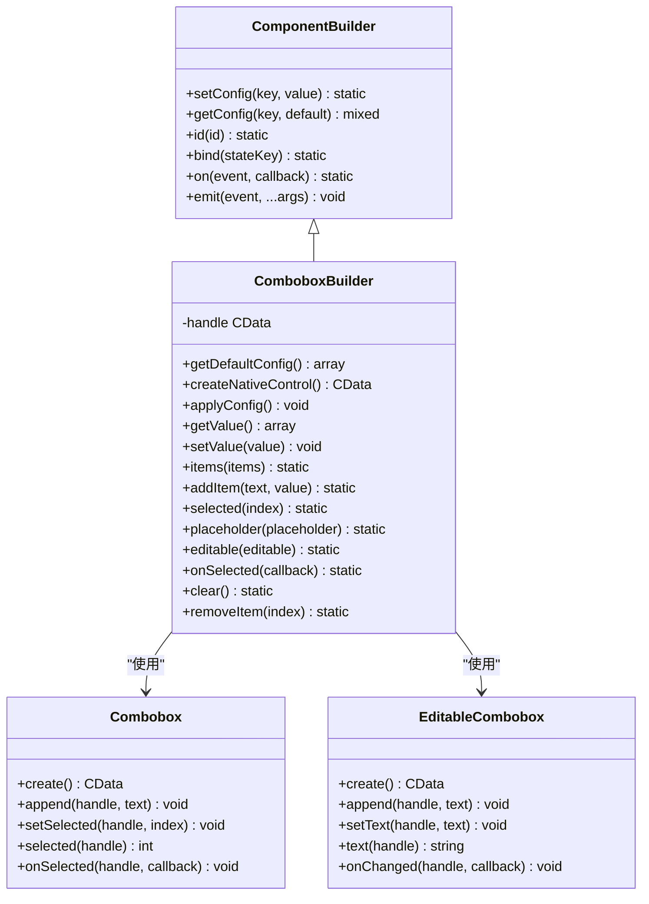
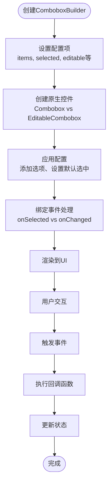
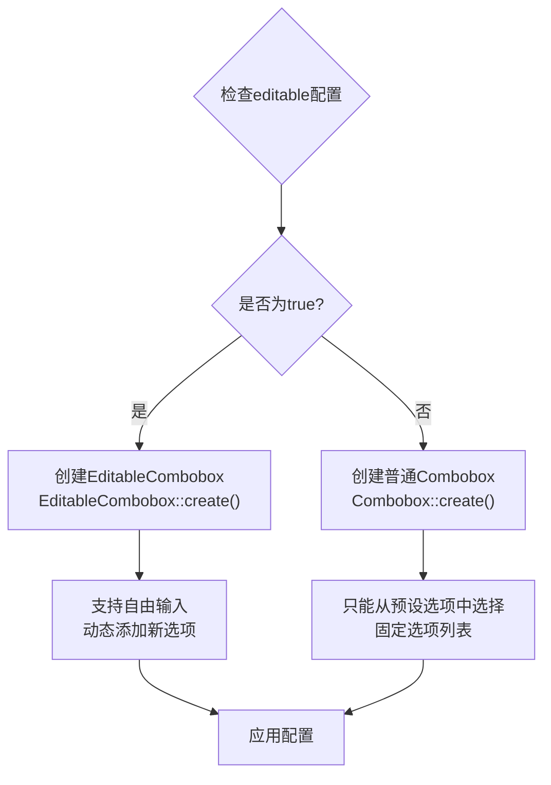
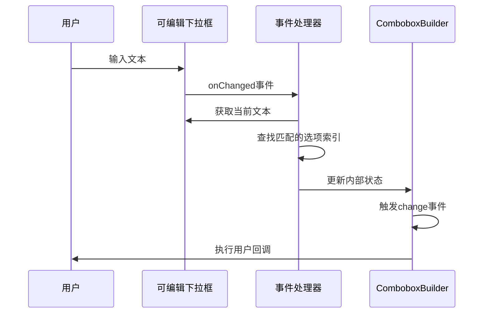
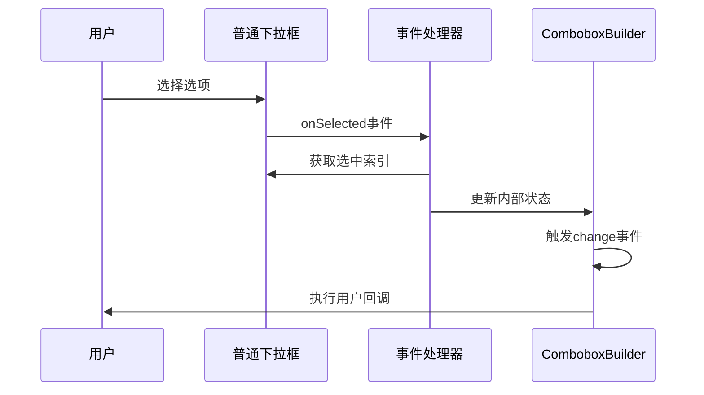
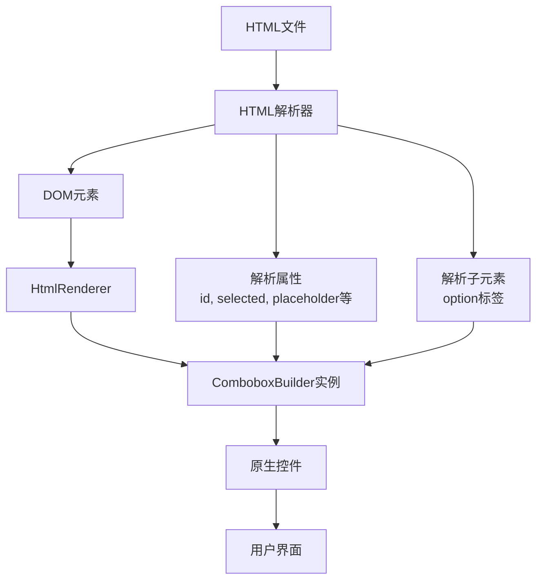
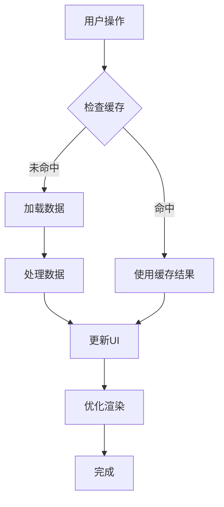

# ComboboxBuilder 详细文档

<cite>
**本文档中引用的文件**
- [ComboboxBuilder.php](file://src/Components/ComboboxBuilder.php)
- [FormValidator.php](file://src/Validation/FormValidator.php)
- [Builder.php](file://src/Builder.php)
- [HtmlRenderer.php](file://src/HtmlRenderer.php)
- [simple.php](file://example/simple.php)
- [full.ui.html](file://example/views/full.ui.html)
- [helper.php](file://src/helper.php)
</cite>

## 目录
1. [简介](#简介)
2. [核心架构](#核心架构)
3. [配置项详解](#配置项详解)
4. [链式调用方法](#链式调用方法)
5. [编辑模式差异](#编辑模式差异)
6. [使用示例](#使用示例)
7. [HTML模板支持](#html模板支持)
8. [表单验证集成](#表单验证集成)
9. [性能优化建议](#性能优化建议)
10. [故障排除指南](#故障排除指南)

## 简介

ComboboxBuilder是libuiBuilder框架中的核心下拉选择控件构建器，提供了强大的链式API来创建和管理下拉选择框。它支持两种模式：传统的不可编辑下拉框（Combobox）和可编辑下拉框（EditableCombobox），能够满足不同场景下的用户交互需求。

该组件继承自ComponentBuilder基类，提供了完整的生命周期管理和事件处理机制，支持动态添加选项、设置默认选中项、响应选择变化等高级功能。

## 核心架构

### 类层次结构



**图表来源**
- [ComboboxBuilder.php](file://src/Components/ComboboxBuilder.php#L10-L258)
- [Builder.php](file://src/Builder.php#L7-L120)

### 核心工作流程



**图表来源**
- [ComboboxBuilder.php](file://src/Components/ComboboxBuilder.php#L24-L107)

**章节来源**
- [ComboboxBuilder.php](file://src/Components/ComboboxBuilder.php#L10-L258)

## 配置项详解

ComboboxBuilder提供了丰富的配置选项来定制下拉框的行为和外观：

### 默认配置

| 配置项 | 类型 | 默认值 | 描述 |
|--------|------|--------|------|
| `items` | array | `[]` | 下拉选项数组，支持字符串和关联数组格式 |
| `selected` | int | `-1` | 当前选中项的索引，-1表示未选择 |
| `placeholder` | string | `'请选择...'` | 未选择时显示的占位符文本 |
| `editable` | bool | `false` | 是否启用可编辑模式 |
| `onSelected` | callable | `null` | 选择事件回调函数 |
| `onChange` | callable | `null` | 值变化事件回调函数 |

### 选项数据格式

ComboboxBuilder支持多种选项数据格式：

#### 字符串格式
```php
$builder->items(['选项1', '选项2', '选项3']);
```

#### 关联数组格式
```php
$builder->items([
    ['text' => '显示文本', 'value' => '实际值'],
    ['text' => '北京', 'value' => 'beijing'],
    ['text' => '上海', 'value' => 'shanghai']
]);
```

#### 混合格式
```php
$builder->items([
    '简单选项',
    ['text' => '带值选项', 'value' => 123],
    '另一个简单选项'
]);
```

**章节来源**
- [ComboboxBuilder.php](file://src/Components/ComboboxBuilder.php#L12-L22)

## 链式调用方法

ComboboxBuilder提供了完整的链式API来配置和操作下拉框：

### 核心配置方法

#### items(array $items)
设置下拉框的选项列表。

```php
$builder->items([
    ['text' => '男', 'value' => 'male'],
    ['text' => '女', 'value' => 'female'],
    ['text' => '其他', 'value' => 'other']
]);
```

#### addItem(string $text, $value = null)
动态添加单个选项。

```php
$builder->addItem('新增选项', 'new_value')
        ->addItem('另一个选项'); // 不指定value时使用text作为值
```

#### selected(int $index)
设置默认选中项的索引。

```php
$builder->selected(0); // 选中第一个选项
```

#### placeholder(string $placeholder)
设置占位符文本。

```php
$builder->placeholder('请选择您的性别');
```

#### editable(bool $editable = true)
启用或禁用可编辑模式。

```php
$builder->editable(true); // 启用可编辑模式
```

#### onSelected(callable $callback)
设置选择事件回调。

```php
$builder->onSelected(function($index, $item, $component) {
    echo "选中了第{$index}项: {$item}";
});
```

### 操作方法

#### clear()
清空所有选项并重置选中状态。

```php
$builder->clear(); // 清空选项列表
```

#### removeItem(int $index)
移除指定索引的选项。

```php
$builder->removeItem(2); // 移除第三个选项
```

### 链式调用示例

```php
$builder = Builder::combobox()
    ->items(['选项1', '选项2', '选项3'])
    ->selected(1)
    ->placeholder('请选择...')
    ->onSelected(function($index, $item, $builder) {
        echo "选中: {$item} (索引: {$index})";
    });
```

**章节来源**
- [ComboboxBuilder.php](file://src/Components/ComboboxBuilder.php#L189-L257)

## 编辑模式差异

ComboboxBuilder在可编辑模式和传统模式下有着显著的差异，主要体现在原生控件创建和事件处理机制上：

### 原生控件创建差异



**图表来源**
- [ComboboxBuilder.php](file://src/Components/ComboboxBuilder.php#L24-L29)

### 事件处理机制差异

#### 可编辑模式事件处理



**图表来源**
- [ComboboxBuilder.php](file://src/Components/ComboboxBuilder.php#L58-L87)

#### 传统模式事件处理



**图表来源**
- [ComboboxBuilder.php](file://src/Components/ComboboxBuilder.php#L88-L106)

### 功能对比表

| 特性 | 传统模式 | 可编辑模式 |
|------|----------|------------|
| 选项来源 | 固定预设选项 | 预设选项+自由输入 |
| 选中方式 | 点击选择 | 点击选择+输入文本 |
| 值获取 | 索引+选项对象 | 文本+匹配索引 |
| 事件名称 | onSelected | onChanged |
| 默认行为 | 仅能选择预设选项 | 可以输入任意文本 |
| 性能开销 | 较低 | 中等（需要文本匹配） |

**章节来源**
- [ComboboxBuilder.php](file://src/Components/ComboboxBuilder.php#L24-L107)

## 使用示例

### 基础使用示例

#### 传统下拉框

```php
// 创建基础下拉框
$genderCombobox = Builder::combobox()
    ->id('gender')
    ->items(['请选择', '男', '女', '其他'])
    ->selected(0)
    ->placeholder('请选择您的性别')
    ->onSelected(function($index, $item, $component) {
        if ($index > 0) {
            echo "您选择了: {$item}\n";
        }
    });

// 获取选中值
$value = $genderCombobox->getValue();
echo "当前选中: 索引={$value['index']}, 值={$value['value']}";
```

#### 可编辑下拉框

```php
// 创建可编辑下拉框
$hobbyCombobox = Builder::editableCombobox()
    ->id('hobby')
    ->items(['阅读', '运动', '音乐', '旅行', '编程'])
    ->placeholder('选择或输入您的爱好')
    ->onChange(function($index, $item, $component) {
        echo "爱好已更新: {$item}\n";
    });

// 动态添加选项
$hobbyCombobox->addItem('摄影', 'photography');
```

### 高级使用示例

#### 动态选项管理

```php
class DynamicComboBox {
    private $builder;
    
    public function __construct() {
        $this->builder = Builder::combobox()
            ->id('dynamic-combo')
            ->items([])
            ->onSelected([$this, 'handleSelection']);
    }
    
    public function addCategory($category) {
        $this->builder->addItem($category['name'], $category['id']);
        return $this;
    }
    
    public function loadOptions($options) {
        $this->builder->clear();
        foreach ($options as $option) {
            $this->builder->addItem($option['text'], $option['value']);
        }
        return $this;
    }
    
    public function handleSelection($index, $item, $component) {
        // 处理选择逻辑
        echo "选中类别: {$item} (ID: {$index})";
    }
    
    public function getBuilder() {
        return $this->builder;
    }
}

// 使用示例
$combo = new DynamicComboBox();
$combo->loadOptions([
    ['text' => '技术', 'value' => 'tech'],
    ['text' => '设计', 'value' => 'design'],
    ['text' => '产品', 'value' => 'product']
]);

// 运行时添加新类别
$combo->addCategory(['name' => '运营', 'id' => 'operations']);
```

#### 表单集成示例

```php
// 创建表单字段
function createFormField($label, $id, $options, $type = 'combobox') {
    $control = match($type) {
        'editable' => Builder::editableCombobox()->items($options),
        default => Builder::combobox()->items($options),
    };
    
    return [
        'label' => Builder::label()->text($label . ':'),
        'control' => $control->id($id)->bind($id)
    ];
}

// 使用快捷函数
$fields = [
    createFormField('性别', 'gender', ['请选择', '男', '女', '其他']),
    createFormField('城市', 'city', ['北京', '上海', '广州', '深圳']),
    createFormField('爱好', 'hobby', ['阅读', '运动', '音乐'], 'editable')
];

// 渲染表单
$form = Builder::grid()
    ->padded()
    ->contains($fields);
```

**章节来源**
- [simple.php](file://example/simple.php#L40-L69)
- [helper.php](file://src/helper.php#L188-L222)

## HTML模板支持

ComboboxBuilder完全支持HTML模板语法，允许开发者使用声明式的HTML来定义下拉框：

### HTML模板语法

```html
<!-- 基础下拉框 -->
<combobox id="location" selected="0" expand="horizontal">
    <option>请选择城市</option>
    <option>北京</option>
    <option>上海</option>
    <option>广州</option>
    <option>深圳</option>
</combobox>

<!-- 可编辑下拉框 -->
<editablecombobox id="hobbies" placeholder="选择或输入您的爱好">
    <option>阅读</option>
    <option>运动</option>
    <option>音乐</option>
</editablecombobox>
```

### HTML渲染流程



**图表来源**
- [HtmlRenderer.php](file://src/HtmlRenderer.php#L517-L538)

### 模板配置映射

| HTML属性 | 对应方法 | 示例 |
|----------|----------|------|
| `id` | `id()` | `<combobox id="city">` |
| `selected` | `selected()` | `<combobox selected="1">` |
| `placeholder` | `placeholder()` | `<combobox placeholder="请选择...">` |
| `expand` | `expand()` | `<combobox expand="horizontal">` |

### 实际使用示例

基于项目中的完整示例：

```html
<!-- 来自full.ui.html的下拉框示例 -->
<label row="2" col="0" align="end,center">下拉选择:</label>
<combobox id="comboboxInput" row="2" col="1" selected="0" expand="horizontal">
    <option>选择...</option>
    <option>北京</option>
    <option>上海</option>
    <option>广州</option>
    <option>深圳</option>
</combobox>
```

**章节来源**
- [full.ui.html](file://example/views/full.ui.html#L99-L106)
- [HtmlRenderer.php](file://src/HtmlRenderer.php#L517-L538)

## 表单验证集成

ComboboxBuilder可以与FormValidator配合使用，实现对下拉框的必填验证和值范围验证：

### 验证规则配置

```php
use Kingbes\Libui\View\Validation\FormValidator;

// 创建验证器
$validator = new FormValidator();

// 配置验证规则
$validator->rule('gender', ['required' => true])
          ->rule('city', ['required' => true])
          ->rule('hobby', [
              'required' => true,
              'min_length' => 2
          ]);

// 验证表单数据
$data = [
    'gender' => '男',
    'city' => '北京',
    'hobby' => '阅读'
];

if ($validator->validate($data)) {
    echo "验证通过！";
} else {
    $errors = $validator->getErrors();
    foreach ($errors as $field => $message) {
        echo "字段 {$field}: {$message}\n";
    }
}
```

### 验证器规则详解

| 规则类型 | 参数 | 描述 | 示例 |
|----------|------|------|------|
| `required` | 无 | 必填验证 | `['required' => true]` |
| `min_length` | int | 最小长度验证 | `['min_length' => 2]` |
| `email` | 无 | 邮箱格式验证 | `['email' => true]` |

### 下拉框验证最佳实践

```php
// 下拉框验证示例
class FormValidatorExample {
    private $validator;
    
    public function __construct() {
        $this->validator = new FormValidator();
        
        // 性别字段验证
        $this->validator->rule('gender', [
            'required' => true,
            function($value) {
                if ($value === '请选择') {
                    return false;
                }
                return true;
            }
        ]);
        
        // 城市字段验证
        $this->validator->rule('city', [
            'required' => true,
            function($value) use ($cities) {
                return in_array($value, $cities);
            }
        ]);
    }
    
    public function validateFormData($formData) {
        if ($this->validator->validate($formData)) {
            return ['success' => true, 'message' => '验证通过'];
        } else {
            return [
                'success' => false, 
                'errors' => $this->validator->getErrors()
            ];
        }
    }
}
```

**章节来源**
- [FormValidator.php](file://src/Validation/FormValidator.php#L1-78)

## 性能优化建议

在使用ComboboxBuilder时，特别是在高频事件处理和大量选项的情况下，需要注意以下性能优化点：

### 1. 避免频繁操作选项列表

```php
// ❌ 不推荐：在高频事件中频繁添加选项
$combobox->onChanged(function() {
    // 每次变化都重新加载选项
    $this->loadOptionsFromServer();
});

// ✅ 推荐：批量操作选项
$combobox->onFocus(function() {
    // 仅在获得焦点时加载最新选项
    if ($this->needsUpdate()) {
        $this->loadOptionsFromServer();
    }
});
```

### 2. 优化选项数量

```php
// ❌ 不推荐：一次性添加数千个选项
$options = [];
for ($i = 0; $i < 5000; $i++) {
    $options[] = "选项 {$i}";
}
$combobox->items($options);

// ✅ 推荐：分页或懒加载
$combobox->onFocus(function() {
    // 仅加载可见区域的选项
    $this->loadVisibleOptions();
});
```

### 3. 事件处理优化

```php
// ❌ 不推荐：在事件处理中执行复杂计算
$combobox->onSelected(function($index, $item) {
    // 复杂的数据处理
    $result = $this->complexCalculation($item);
    $this->updateUI($result);
});

// ✅ 推荐：使用防抖处理
$debouncedHandler = $this->createDebouncedHandler(function($index, $item) {
    // 执行必要的处理
    $this->updateRelatedFields($item);
}, 300);

$combobox->onSelected($debouncedHandler);
```

### 4. 内存管理

```php
// ❌ 不推荐：保持大量引用
class MemoryLeakExample {
    private $largeDataSet;
    
    public function createCombobox() {
        // 保存大量数据的引用
        $this->largeDataSet = $this->loadLargeDataset();
        return Builder::combobox()->items($this->largeDataSet);
    }
}

// ✅ 推荐：及时释放不需要的资源
class OptimizedExample {
    public function createCombobox() {
        // 使用临时变量
        $options = $this->getOptimizedOptions();
        return Builder::combobox()->items($options);
    }
}
```

### 5. 渲染优化策略



### 性能监控指标

| 指标 | 正常范围 | 监控方法 |
|------|----------|----------|
| 选项加载时间 | < 100ms | 测量addItem/addItem耗时 |
| 事件响应时间 | < 50ms | 监控onSelected/onChanged |
| 内存占用 | < 50MB | PHP内存使用情况 |
| UI流畅度 | FPS > 30 | 浏览器性能监控 |

## 故障排除指南

### 常见问题及解决方案

#### 1. 选项无法显示

**症状**: 下拉框为空或只显示占位符

**可能原因**:
- 选项数据格式错误
- 选项数组为空
- 组件未正确渲染

**解决方案**:
```php
// 检查选项数据
$items = $builder->getConfig('items');
if (empty($items)) {
    echo "警告: 选项列表为空";
    $builder->items(['默认选项']);
}

// 验证数据格式
foreach ($items as $item) {
    if (!is_string($item) && !is_array($item)) {
        echo "无效选项格式: " . print_r($item, true);
    }
}
```

#### 2. 选中状态不正确

**症状**: 默认选中项不是预期的值

**可能原因**:
- selected索引超出范围
- 选项数据与选中值不匹配

**解决方案**:
```php
// 检查选中索引有效性
$selected = $builder->getConfig('selected');
$items = $builder->getConfig('items');

if ($selected >= count($items)) {
    echo "警告: 选中索引超出选项范围，重置为-1";
    $builder->setConfig('selected', -1);
}

// 验证选中值
if ($selected >= 0) {
    $selectedItem = $items[$selected];
    echo "当前选中: 索引={$selected}, 值=" . json_encode($selectedItem);
}
```

#### 3. 事件回调不触发

**症状**: 选择后没有执行回调函数

**可能原因**:
- 事件绑定失败
- 回调函数返回错误
- 组件状态异常

**解决方案**:
```php
// 检查事件绑定
$callback = $builder->getConfig('onSelected');
if (!$callback) {
    echo "警告: 未设置onSelected回调";
    $builder->onSelected(function($index, $item, $comp) {
        echo "默认回调: 选中 {$item} (索引: {$index})";
    });
}

// 测试回调执行
try {
    $testCallback = $builder->getConfig('onSelected');
    if ($testCallback) {
        $testCallback(0, '测试选项', $builder);
    }
} catch (\Exception $e) {
    echo "回调执行失败: " . $e->getMessage();
}
```

#### 4. 可编辑模式问题

**症状**: 可编辑下拉框无法输入或选择

**可能原因**:
- 文本匹配算法问题
- 事件处理冲突

**解决方案**:
```php
// 检查文本匹配逻辑
$builder->onChanged(function($index, $item, $comp) {
    // 打印调试信息
    echo "变更事件 - 索引: {$index}, 项目: " . json_encode($item) . "\n";
    
    // 验证匹配结果
    $value = $comp->getValue();
    echo "获取的值: " . json_encode($value) . "\n";
});
```

### 调试工具和技巧

```php
// 创建调试包装器
class DebugComboboxBuilder extends ComboboxBuilder {
    public function __call($method, $args) {
        echo "调用方法: {$method}(" . implode(', ', array_map(function($arg) {
            return is_string($arg) ? "'{$arg}'" : (is_array($arg) ? 'Array' : $arg);
        }, $args)) . ")\n";
        
        $result = parent::__call($method, $args);
        echo "方法返回: " . get_class($result) . "\n";
        return $result;
    }
    
    public function getValue() {
        $value = parent::getValue();
        echo "获取值: " . json_encode($value) . "\n";
        return $value;
    }
}

// 使用调试版本
$debugBuilder = new DebugComboboxBuilder();
$debugBuilder->items(['选项1', '选项2'])
             ->selected(0)
             ->onSelected(function($index, $item, $comp) {
                 echo "调试回调: 选中 {$item} (索引: {$index})\n";
             });
```

**章节来源**
- [ComboboxBuilder.php](file://src/Components/ComboboxBuilder.php#L110-L186)

## 结论

ComboboxBuilder是一个功能强大且灵活的下拉选择控件构建器，通过其丰富的配置选项、链式API和事件处理机制，能够满足各种复杂的用户界面需求。无论是传统的静态下拉框还是可编辑的动态输入框，都能通过统一的接口进行高效开发。

关键特性总结：
- **双重模式支持**: 传统模式和可编辑模式的无缝切换
- **灵活的配置系统**: 支持多种数据格式和丰富的配置选项
- **强大的事件处理**: 完整的生命周期事件和自定义回调支持
- **HTML模板集成**: 声明式语法简化开发流程
- **表单验证集成**: 与FormValidator完美配合
- **性能优化**: 提供多种优化策略和最佳实践

通过合理使用这些特性和遵循性能优化建议，开发者可以构建出既美观又高效的用户界面，为用户提供优秀的交互体验。