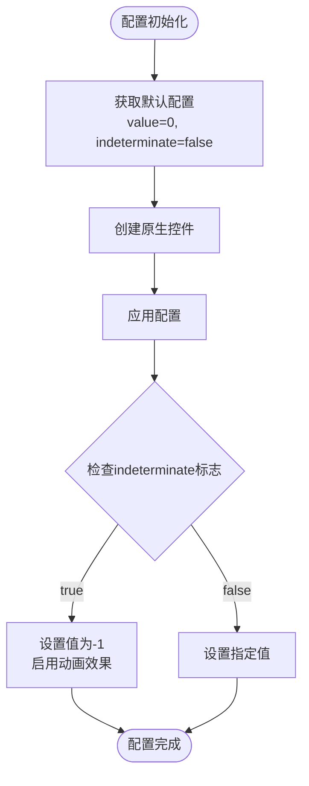

# ProgressBarBuilder 详细文档

<cite>
**本文档中引用的文件**
- [ProgressBarBuilder.php](file://src/Components/ProgressBarBuilder.php)
- [ProgressBar.php](file://vendor/kingbes/libui/src/ProgressBar.php)
- [Builder.php](file://src/Builder.php)
- [HtmlRenderer.php](file://src/HtmlRenderer.php)
- [BuilderComponentsTest.php](file://tests/BuilderComponentsTest.php)
- [builder_helpers_demo.php](file://example/builder_helpers_demo.php)
</cite>

## 目录
1. [简介](#简介)
2. [项目结构](#项目结构)
3. [核心组件](#核心组件)
4. [架构概览](#架构概览)
5. [详细组件分析](#详细组件分析)
6. [配置参数详解](#配置参数详解)
7. [使用模式](#使用模式)
8. [实际应用场景](#实际应用场景)
9. [性能优化建议](#性能优化建议)
10. [故障排除指南](#故障排除指南)
11. [结论](#结论)

## 简介

ProgressBarBuilder是LibUI Builder框架中的一个专门用于创建和管理进度条控件的构建器类。它提供了两种主要的进度显示模式：确定性进度条和不确定性进度条，能够满足不同场景下的进度展示需求。

该构建器继承自ComponentBuilder基类，遵循链式调用的设计模式，支持灵活的配置和动态的状态更新。通过value()和indeterminate()方法，开发者可以轻松地在确定性和不确定性模式之间切换，并实时更新进度值。

## 项目结构

ProgressBarBuilder位于LibUI Builder框架的核心组件模块中，与其他UI组件协同工作，形成完整的用户界面构建体系。


**图表来源**
- [ProgressBarBuilder.php](file://src/Components/ProgressBarBuilder.php#L8-L56)
- [Builder.php](file://src/Builder.php#L170-L173)
- [HtmlRenderer.php](file://src/HtmlRenderer.php#L584-L593)

**章节来源**
- [ProgressBarBuilder.php](file://src/Components/ProgressBarBuilder.php#L1-L56)
- [Builder.php](file://src/Builder.php#L170-L173)

## 核心组件

ProgressBarBuilder包含以下核心功能模块：

### 默认配置管理
- **value**: 当前进度值，默认为0
- **indeterminate**: 不确定性模式标志，默认为false

### 原生控件集成
- 通过ProgressBar::create()创建原生进度条控件
- 支持FFI接口与底层C库通信

### 链式配置系统
- value()方法：设置确定性进度值
- indeterminate()方法：切换不确定性模式
- 支持连续链式调用

**章节来源**
- [ProgressBarBuilder.php](file://src/Components/ProgressBarBuilder.php#L11-L17)
- [ProgressBarBuilder.php](file://src/Components/ProgressBarBuilder.php#L19-L22)

## 架构概览

ProgressBarBuilder采用分层架构设计，清晰分离了配置管理、原生控件操作和渲染逻辑。


**图表来源**
- [ProgressBarBuilder.php](file://src/Components/ProgressBarBuilder.php#L8-L56)
- [ProgressBar.php](file://vendor/kingbes/libui/src/ProgressBar.php#L10-L44)
- [Builder.php](file://src/Builder.php#L170-L173)

## 详细组件分析

### 配置系统分析

ProgressBarBuilder的配置系统基于键值对存储，支持默认值管理和动态更新。



**图表来源**
- [ProgressBarBuilder.php](file://src/Components/ProgressBarBuilder.php#L11-L17)
- [ProgressBarBuilder.php](file://src/Components/ProgressBarBuilder.php#L24-L32)

### 方法链式调用机制

ProgressBarBuilder提供了优雅的链式调用接口，支持连续配置多个属性：

#### value()方法
- **功能**: 设置确定性进度值
- **参数**: int $value - 进度值（0-100）
- **返回值**: static - 支持链式调用
- **实现**: 调用setConfig()方法更新配置

#### indeterminate()方法  
- **功能**: 切换不确定性模式
- **参数**: bool $indeterminate - 是否启用不确定性模式
- **返回值**: static - 支持链式调用
- **实现**: 设置indeterminate配置项

**章节来源**
- [ProgressBarBuilder.php](file://src/Components/ProgressBarBuilder.php#L47-L55)

### 原生控件交互

ProgressBarBuilder通过FFI接口与底层libui库进行通信，实现了高效的原生控件操作。


**图表来源**
- [ProgressBarBuilder.php](file://src/Components/ProgressBarBuilder.php#L24-L32)
- [ProgressBar.php](file://vendor/kingbes/libui/src/ProgressBar.php#L34-L43)

**章节来源**
- [ProgressBarBuilder.php](file://src/Components/ProgressBarBuilder.php#L24-L32)
- [ProgressBar.php](file://vendor/kingbes/libui/src/ProgressBar.php#L34-L43)

## 配置参数详解

### value参数

| 属性 | 类型 | 默认值 | 描述 |
|------|------|--------|------|
| value | int | 0 | 进度条的当前值，范围通常为0-100 |

**作用机制**:
- 在确定性模式下，value参数直接控制进度条的填充程度
- 当indeterminate为false时，ProgressBar::setValue()会使用此值
- 支持动态更新，可通过setValue()或value()方法修改

### indeterminate参数

| 属性 | 类型 | 默认值 | 描述 |
|------|------|--------|------|
| indeterminate | bool | false | 是否启用不确定性进度条模式 |

**作用机制**:
- 当indeterminate为true时，ProgressBar::setValue()会被强制设置为-1
- 值-1触发原生控件的无限循环动画效果
- 此模式适用于无法预知完成时间的异步操作

**章节来源**
- [ProgressBarBuilder.php](file://src/Components/ProgressBarBuilder.php#L14-L15)
- [ProgressBarBuilder.php](file://src/Components/ProgressBarBuilder.php#L27-L31)

## 使用模式

### Builder API模式

#### 基础使用示例

```php
// 创建确定性进度条
$progressBar = Builder::progressBar()
    ->value(75);

// 创建不确定性进度条
$loadingBar = Builder::progressBar()
    ->indeterminate(true);

// 链式配置
$styledBar = Builder::progressBar()
    ->value(50)
    ->indeterminate(false)
    ->width(300);
```

#### 动态更新示例

```php
// 创建进度条实例
$progress = Builder::progressBar();

// 在异步任务中更新进度
for ($i = 0; $i <= 100; $i += 10) {
    $progress->setValue($i);
    // 执行其他操作...
}

// 切换到加载状态
$progress->indeterminate(true);
```

### HTML模板模式

#### 基础HTML模板使用

```html
<!-- 确定性进度条 -->
<progressbar value="75"></progressbar>

<!-- 不确定性进度条 -->
<progressbar indeterminate="true"></progressbar>
```

#### HTML渲染流程


**图表来源**
- [HtmlRenderer.php](file://src/HtmlRenderer.php#L584-L593)

**章节来源**
- [Builder.php](file://src/Builder.php#L170-L173)
- [HtmlRenderer.php](file://src/HtmlRenderer.php#L584-L593)

## 实际应用场景

### 异步任务监控

ProgressBarBuilder在处理长时间运行的任务时特别有用：

#### 文件下载进度
```php
// 创建下载进度条
$downloadProgress = Builder::progressBar()
    ->value(0)
    ->indeterminate(false);

// 更新下载进度
function updateDownloadProgress($bytesReceived, $totalBytes) {
    $percentage = ($bytesReceived / $totalBytes) * 100;
    $downloadProgress->setValue((int)$percentage);
}
```

#### 数据处理进度
```php
// 处理大量数据时的进度指示
$processingBar = Builder::progressBar()
    ->indeterminate(true);

// 处理完成后切换到确定性进度
$processingBar->indeterminate(false)->setValue(100);
```

### 加载状态指示

#### 页面加载
```php
// 应用启动时的加载进度
$loadProgress = Builder::progressBar()
    ->indeterminate(true);

// 初始化完成后停止动画
$loadProgress->indeterminate(false)->setValue(100);
```

#### 网络请求
```php
// API请求过程中的进度指示
$requestProgress = Builder::progressBar()
    ->indeterminate(true);

// 请求完成后的状态更新
$requestProgress->indeterminate(false)->setValue(100);
```

**章节来源**
- [BuilderComponentsTest.php](file://tests/BuilderComponentsTest.php#L128-L130)

## 性能优化建议

### 状态变更合并策略

为了提升渲染效率，在频繁更新进度时应合并状态变更：

```php
// ❌ 不推荐：频繁单独更新
for ($i = 0; $i <= 100; $i++) {
    $progress->setValue($i); // 每次都触发重新渲染
}

// ✅ 推荐：批量更新或减少更新频率
$values = range(0, 100, 5); // 每5个点更新一次
foreach ($values as $value) {
    $progress->setValue($value);
}
```

### 内存管理优化

- 在不需要时及时释放ProgressBarBuilder实例
- 避免在循环中重复创建新的进度条对象
- 合理使用indeterminate模式，避免不必要的动画开销

### 渲染性能考虑

- 确定性进度条适合精确的进度计算场景
- 不确定性进度条适合无法预知完成时间的操作
- 根据具体场景选择合适的模式以获得最佳用户体验

## 故障排除指南

### 常见问题及解决方案

#### 问题1：进度条不显示动画
**症状**: 调用indeterminate(true)后进度条没有动画效果
**原因**: 原生控件初始化失败或配置未正确应用
**解决方案**: 
- 确保在创建后立即应用配置
- 检查libui库是否正确加载

#### 问题2：进度值不更新
**症状**: 调用setValue()后进度条显示值不变
**原因**: 
- ProgressBarBuilder实例未正确绑定到原生控件
- 配置应用时机错误

**解决方案**:
```php
// 确保正确的配置顺序
$progress = Builder::progressBar();
$progress->value(50); // 先设置值
$progress->applyConfig(); // 然后应用配置
```

#### 问题3：HTML模板不生效
**症状**: 在HTML模板中使用<progressbar>标签但无效果
**原因**: HTML渲染器未正确解析进度条元素

**解决方案**:
- 检查HTML渲染器的实现
- 确保支持progressbar标签的解析

**章节来源**
- [ProgressBarBuilder.php](file://src/Components/ProgressBarBuilder.php#L24-L32)
- [HtmlRenderer.php](file://src/HtmlRenderer.php#L584-L593)

## 结论

ProgressBarBuilder作为LibUI Builder框架的重要组成部分，提供了完整而灵活的进度条解决方案。通过其独特的两种模式设计（确定性和不确定性），能够满足各种复杂的进度展示需求。

### 主要优势

1. **简洁的API设计**: 通过链式调用提供流畅的开发体验
2. **双重模式支持**: 确定性和不确定性模式覆盖所有常见场景
3. **高效性能**: 通过FFI接口实现原生级别的渲染性能
4. **灵活配置**: 支持Builder API和HTML模板两种使用方式

### 最佳实践建议

- 根据具体使用场景选择合适的进度条模式
- 在频繁更新时考虑性能优化策略
- 合理使用链式调用提高代码可读性
- 注意内存管理和资源释放

ProgressBarBuilder为开发者提供了一个强大而易用的进度条控件解决方案，是构建现代桌面应用程序不可或缺的组件之一。