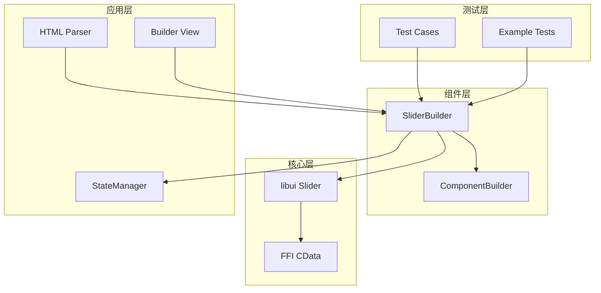
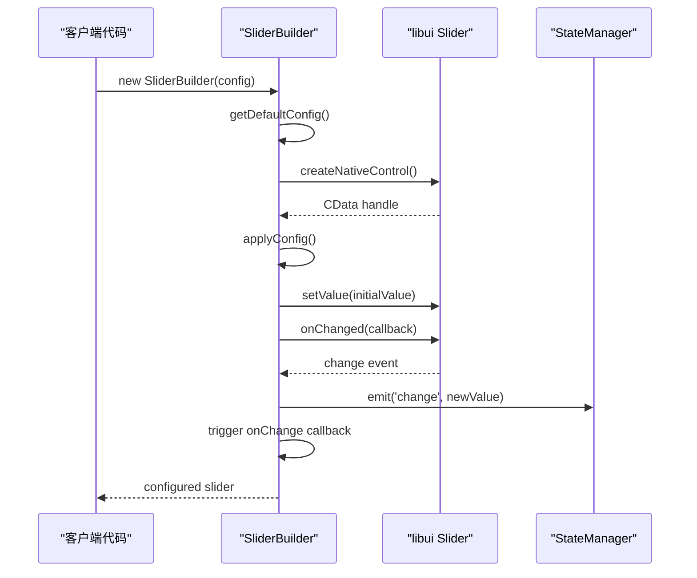
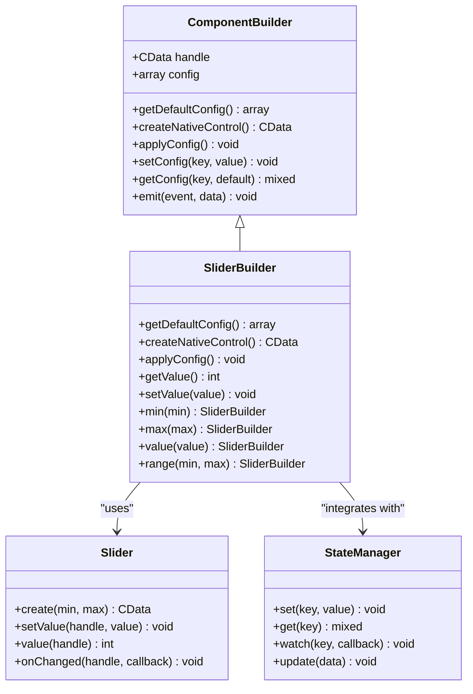
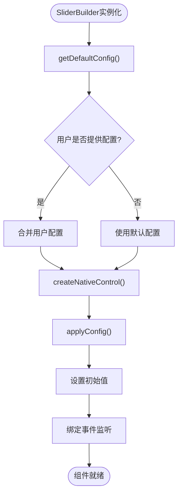
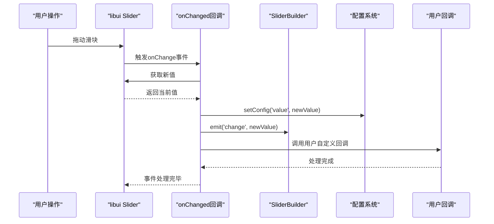
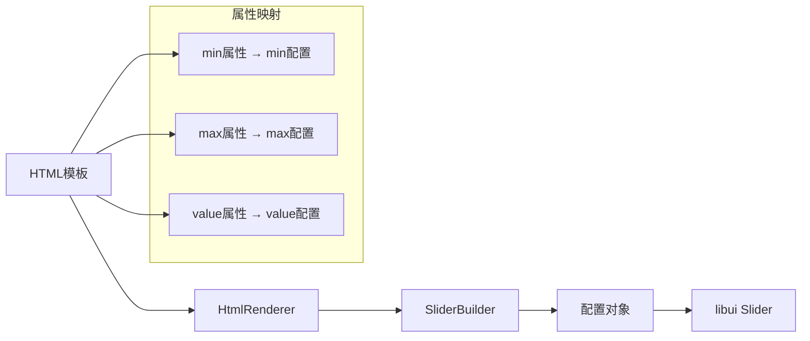
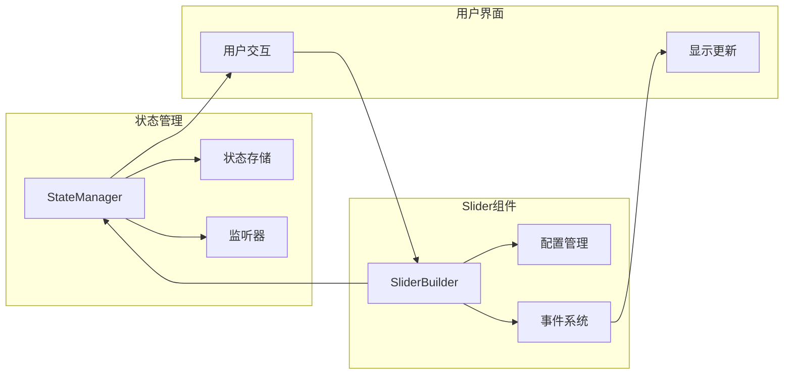
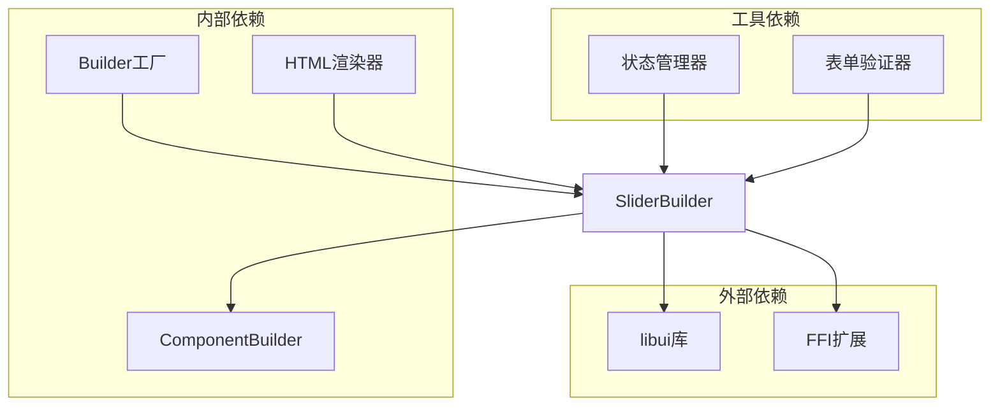
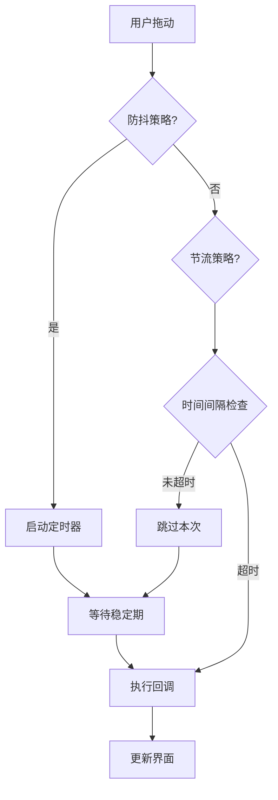

# SliderBuilder 详细文档

<cite>
**本文档中引用的文件**
- [SliderBuilder.php](file://src/Components/SliderBuilder.php)
- [FormValidator.php](file://src/Validation/FormValidator.php)
- [calculator.php](file://example/calculator.php)
- [calculator_html.php](file://example/calculator_html.php)
- [calculator.ui.html](file://example/views/calculator.ui.html)
- [Builder.php](file://src/Builder.php)
- [HtmlRenderer.php](file://src/HtmlRenderer.php)
- [BuilderComponentsTest.php](file://tests/BuilderComponentsTest.php)
- [HelperBuilderFunctionsTest.php](file://tests/HelperBuilderFunctionsTest.php)
</cite>

## 目录
1. [简介](#简介)
2. [项目结构](#项目结构)
3. [核心组件](#核心组件)
4. [架构概览](#架构概览)
5. [详细组件分析](#详细组件分析)
6. [依赖关系分析](#依赖关系分析)
7. [性能考虑](#性能考虑)
8. [故障排除指南](#故障排除指南)
9. [结论](#结论)

## 简介

SliderBuilder是libuiBuilder框架中的滑动条控件构建器，专门用于范围调节场景。它提供了直观的链式API接口，支持动态范围配置、实时值更新和事件回调处理。SliderBuilder基于libui原生滑动条组件实现，能够与PHP状态管理系统无缝集成，支持HTML模板渲染和Builder API两种开发模式。

该组件的核心特性包括：
- 基于libui的高性能原生滑动条实现
- 支持最小值(min)、最大值(max)和当前值(value)的灵活配置
- 实时的onChange回调机制，支持拖动过程中的值更新
- 链式方法调用，提供流畅的开发体验
- 与状态管理系统的深度集成
- HTML模板和Builder API双模式支持

## 项目结构

SliderBuilder在项目中的组织结构体现了清晰的分层架构设计：



**图表来源**
- [SliderBuilder.php](file://src/Components/SliderBuilder.php#L1-L78)
- [ComponentBuilder.php](file://src/ComponentBuilder.php)

**章节来源**
- [SliderBuilder.php](file://src/Components/SliderBuilder.php#L1-L78)

## 核心组件

SliderBuilder的核心功能围绕三个关键配置项展开：min（最小值）、max（最大值）和value（当前值）。这些配置项构成了滑动条的基础行为框架。

### 默认配置系统

SliderBuilder采用预设的默认配置策略，确保组件在各种使用场景下的可用性：

| 配置项 | 默认值 | 类型 | 描述 |
|--------|--------|------|------|
| min | 0 | int | 滑动条的最小可选值 |
| max | 100 | int | 滑动条的最大可选值 |
| value | 0 | int | 滑动条的初始位置值 |
| onChange | null | callable | 值变化时的回调函数 |

### 生命周期管理

SliderBuilder的生命周期包含初始化、配置应用和事件绑定三个关键阶段：



**图表来源**
- [SliderBuilder.php](file://src/Components/SliderBuilder.php#L21-L43)

**章节来源**
- [SliderBuilder.php](file://src/Components/SliderBuilder.php#L11-L43)

## 架构概览

SliderBuilder采用了经典的MVC架构模式，通过ComponentBuilder基类提供统一的组件抽象，同时针对滑动条的特殊需求进行了优化。

### 整体架构设计



**图表来源**
- [SliderBuilder.php](file://src/Components/SliderBuilder.php#L9-L78)
- [ComponentBuilder.php](file://src/ComponentBuilder.php)

## 详细组件分析

### 配置初始化机制

SliderBuilder的配置初始化遵循严格的优先级原则：用户配置 > 默认配置 > 系统默认值。这种设计确保了组件的灵活性和可靠性。

#### 默认配置解析



**图表来源**
- [SliderBuilder.php](file://src/Components/SliderBuilder.php#L11-L43)

#### 链式方法设计

SliderBuilder提供了丰富的链式方法，支持灵活的配置组合：

| 方法名 | 参数类型 | 返回类型 | 功能描述 |
|--------|----------|----------|----------|
| min() | int | SliderBuilder | 设置滑动条最小值 |
| max() | int | SliderBuilder | 设置滑动条最大值 |
| value() | int | SliderBuilder | 设置滑动条当前值 |
| range() | int, int | SliderBuilder | 同时设置最小值和最大值 |

### 事件处理机制

SliderBuilder的事件处理系统是其核心功能之一，特别是在拖动过程中的实时值更新方面。

#### onChange回调流程



**图表来源**
- [SliderBuilder.php](file://src/Components/SliderBuilder.php#L35-L42)

### HTML模板集成

SliderBuilder支持通过HTML模板进行声明式配置，这为Web开发者提供了熟悉的开发体验。

#### HTML渲染映射



**图表来源**
- [HtmlRenderer.php](file://src/HtmlRenderer.php#L563-L578)
- [calculator.ui.html](file://example/views/calculator.ui.html#L1-L54)

**章节来源**
- [SliderBuilder.php](file://src/Components/SliderBuilder.php#L46-L78)
- [HtmlRenderer.php](file://src/HtmlRenderer.php#L563-L578)

### 状态管理系统集成

SliderBuilder与状态管理系统深度集成，支持双向数据绑定和响应式更新。

#### 数据流管理



**图表来源**
- [SliderBuilder.php](file://src/Components/SliderBuilder.php#L35-L42)

**章节来源**
- [SliderBuilder.php](file://src/Components/SliderBuilder.php#L35-L42)

## 依赖关系分析

SliderBuilder的依赖关系体现了现代PHP应用程序的最佳实践，通过明确的接口分离和依赖注入实现了高度的模块化。

### 核心依赖图



**图表来源**
- [SliderBuilder.php](file://src/Components/SliderBuilder.php#L1-L8)
- [Builder.php](file://src/Builder.php#L14-L16)
- [HtmlRenderer.php](file://src/HtmlRenderer.php#L21-L22)

### 组件耦合分析

SliderBuilder采用了松耦合的设计原则，通过接口抽象减少了组件间的直接依赖：

| 依赖类型 | 耦合程度 | 设计原则 | 优势 |
|----------|----------|----------|------|
| libui库 | 强耦合 | 原生集成 | 性能最优 |
| FFI扩展 | 中等耦合 | 接口抽象 | 跨平台兼容 |
| 状态管理器 | 松耦合 | 事件驱动 | 可测试性强 |
| HTML渲染器 | 松耦合 | 模板引擎 | 开发效率高 |

**章节来源**
- [SliderBuilder.php](file://src/Components/SliderBuilder.php#L1-L8)

## 性能考虑

SliderBuilder在设计时充分考虑了性能优化，特别是在高频事件处理和内存管理方面。

### 事件处理优化

为了避免在onChange回调中执行耗时操作，建议采用以下策略：

#### 防抖和节流策略



#### 性能监控指标

| 指标类型 | 目标值 | 监控方法 | 优化建议 |
|----------|--------|----------|----------|
| 事件响应时间 | < 16ms | 时间戳对比 | 减少回调复杂度 |
| 内存占用 | < 5MB | 内存分析器 | 及时释放资源 |
| CPU使用率 | < 10% | 性能分析器 | 异步处理耗时操作 |
| 响应频率 | > 60fps | 帧率监控 | 使用requestAnimationFrame |

### 内存管理策略

SliderBuilder采用RAII（Resource Acquisition Is Initialization）原则进行资源管理，确保CData句柄的正确释放。

## 故障排除指南

### 常见问题及解决方案

#### 1. 滑块值不更新

**症状**: 拖动滑块后，关联的状态值没有同步更新

**原因分析**:
- 状态绑定配置错误
- onChange回调被意外覆盖
- 事件监听器未正确注册

**解决方案**:
```php
// 正确的状态绑定方式
$slider = Builder::slider()
    ->range(0, 100)
    ->value(50)
    ->bind('sliderValue'); // 确保绑定正确的状态键
```

#### 2. 性能问题

**症状**: 拖动滑块时出现卡顿或延迟

**原因分析**:
- onChange回调中执行了耗时操作
- 频繁的状态更新触发过多重绘
- 事件处理函数未使用防抖机制

**解决方案**:
```php
// 使用防抖策略
$slider = Builder::slider()
    ->onChange(function($value) {
        // 使用异步处理或防抖
        asyncProcessValue($value);
    });
```

#### 3. HTML渲染问题

**症状**: HTML模板中的滑块配置不生效

**原因分析**:
- 属性名称大小写错误
- 数据类型转换问题
- 模板解析器配置错误

**解决方案**:
```html
<!-- 确保属性名称正确 -->
<slider 
    min="0" 
    max="100" 
    value="50"
    onchange="handleSliderChange">
</slider>
```

**章节来源**
- [SliderBuilder.php](file://src/Components/SliderBuilder.php#L35-L42)

## 结论

SliderBuilder作为libuiBuilder框架中的核心组件，展现了现代GUI开发框架的设计精髓。它不仅提供了强大的功能特性，还通过精心设计的架构确保了良好的可维护性和扩展性。

### 主要优势

1. **功能完整性**: 支持完整的滑动条操作，包括范围设置、值控制和事件处理
2. **开发体验**: 提供流畅的链式API和HTML模板支持
3. **性能优化**: 采用原生libui实现，确保最佳性能表现
4. **集成能力**: 与状态管理系统深度集成，支持响应式开发
5. **可测试性**: 清晰的接口设计便于单元测试和集成测试

### 最佳实践建议

1. **合理使用回调**: 避免在onChange回调中执行耗时操作，考虑使用防抖或节流策略
2. **状态管理**: 充分利用状态绑定功能，实现组件间的数据共享
3. **性能监控**: 定期监控事件处理性能，及时发现和解决性能瓶颈
4. **错误处理**: 实施完善的错误处理机制，提高应用的健壮性

SliderBuilder的设计理念和实现方式为现代PHP GUI开发提供了优秀的参考范例，其模块化的架构设计和丰富的功能特性使其成为构建复杂桌面应用程序的理想选择。