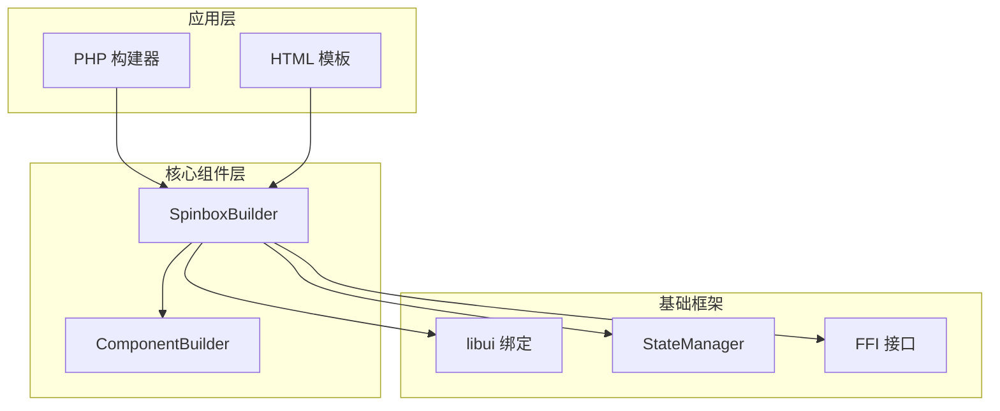
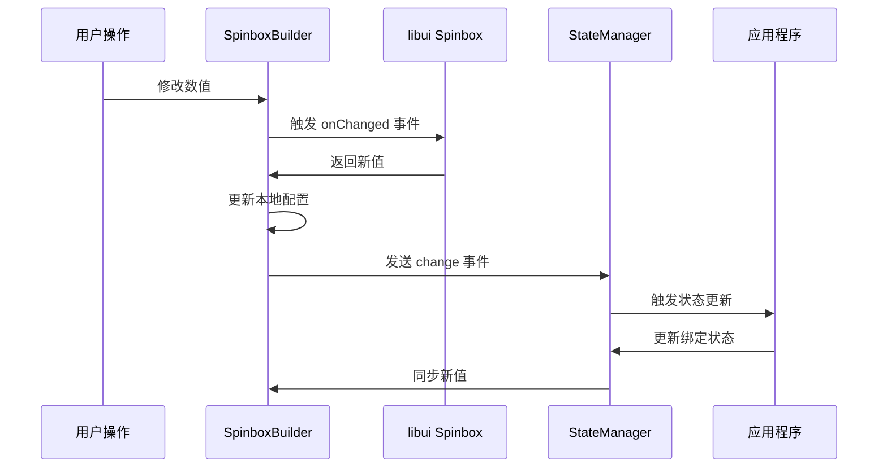
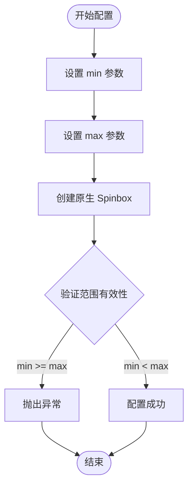
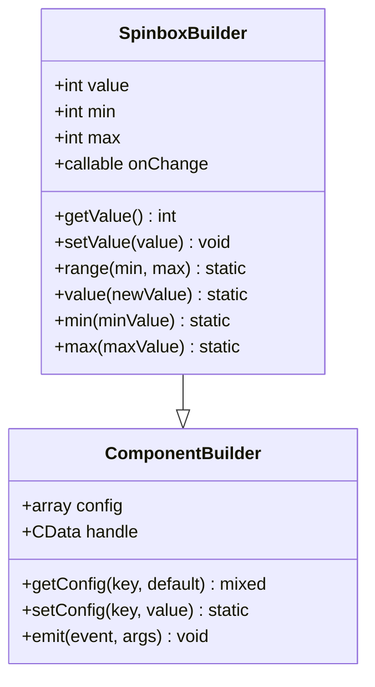
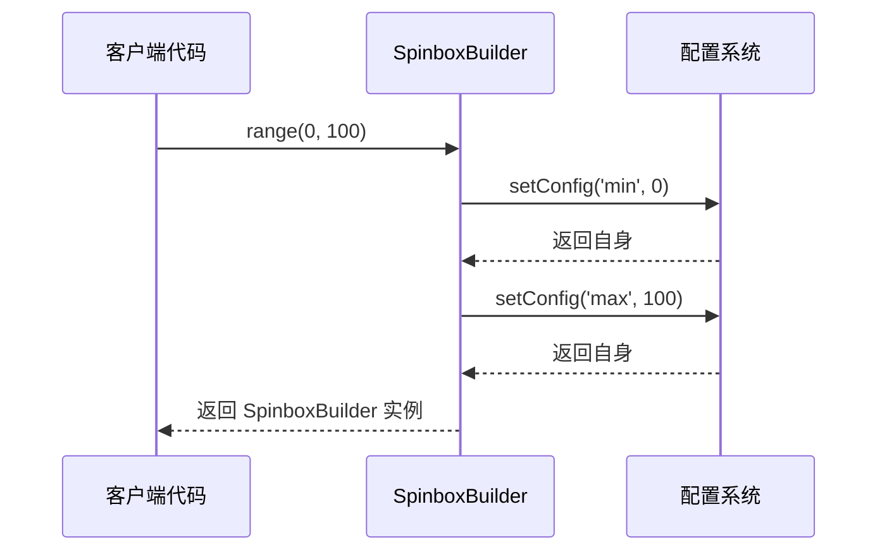
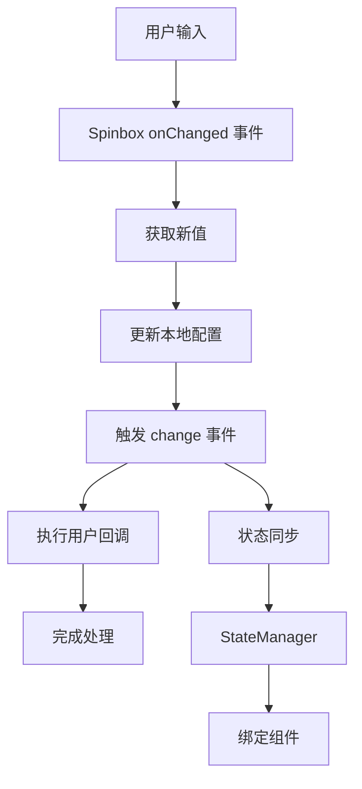
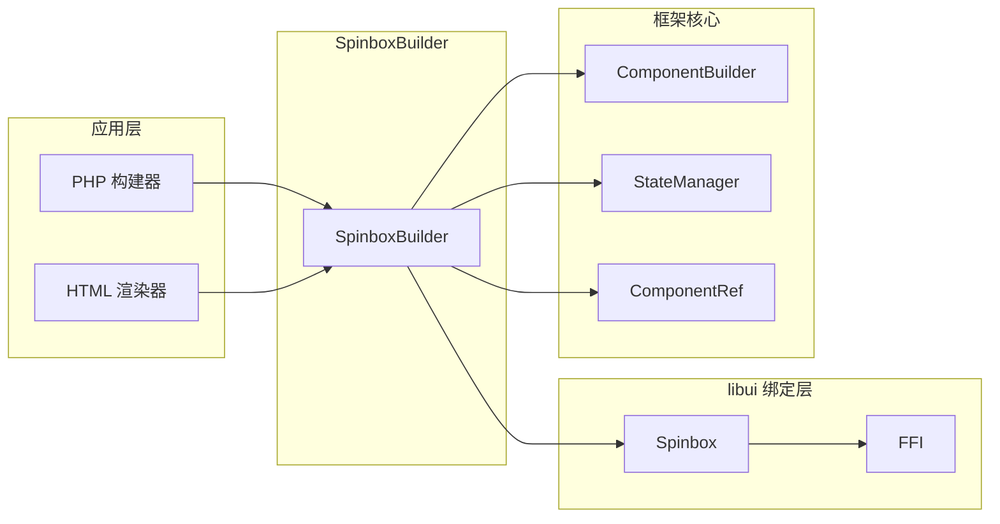

# SpinboxBuilder 详细文档

<cite>
**本文档中引用的文件**
- [SpinboxBuilder.php](file://src/Components/SpinboxBuilder.php)
- [ComponentBuilder.php](file://src/ComponentBuilder.php)
- [FormValidator.php](file://src/Validation/FormValidator.php)
- [full.php](file://example/full.php)
- [calculator.php](file://example/calculator.php)
- [calculator_html.php](file://example/calculator_html.php)
- [full.ui.html](file://example/views/full.ui.html)
- [BuilderComponentsTest.php](file://tests/BuilderComponentsTest.php)
</cite>

## 目录
1. [简介](#简介)
2. [项目结构](#项目结构)
3. [核心组件](#核心组件)
4. [架构概览](#架构概览)
5. [详细组件分析](#详细组件分析)
6. [依赖关系分析](#依赖关系分析)
7. [性能考虑](#性能考虑)
8. [故障排除指南](#故障排除指南)
9. [结论](#结论)

## 简介

SpinboxBuilder 是 libuiBuilder 框架中的一个数值输入控件构建器，专门用于创建具有上下限范围的数值输入界面。它基于 libui 的原生 Spinbox 组件实现，提供了丰富的链式 API 来配置数值范围、初始值和事件处理。

该组件的主要特点包括：
- 支持自定义数值范围（最小值和最大值）
- 内置响应式值变更监听机制
- 提供链式方法调用来简化配置
- 支持与状态管理系统集成
- 可绑定到 HTML 模板系统

## 项目结构

SpinboxBuilder 在项目中的组织结构如下：

**图表来源**
- [SpinboxBuilder.php](file://src/Components/SpinboxBuilder.php#L1-L78)
- [ComponentBuilder.php](file://src/ComponentBuilder.php#L1-L234)

**章节来源**
- [SpinboxBuilder.php](file://src/Components/SpinboxBuilder.php#L1-L78)
- [ComponentBuilder.php](file://src/ComponentBuilder.php#L1-L234)

## 核心组件

SpinboxBuilder 继承自 ComponentBuilder 抽象类，实现了数值输入控件的所有核心功能。其核心配置参数包括：

| 参数名称 | 类型 | 默认值 | 描述 |
|---------|------|--------|------|
| min | int | 0 | 数值输入的最小允许值 |
| max | int | 100 | 数值输入的最大允许值 |
| value | int | 0 | 当前显示的数值，默认为最小值 |
| onChange | callable | null | 值变更时的回调函数 |

**章节来源**
- [SpinboxBuilder.php](file://src/Components/SpinboxBuilder.php#L11-L18)

## 架构概览

SpinboxBuilder 的整体架构采用分层设计，从底层的 libui 绑定到上层的应用接口：

**图表来源**
- [SpinboxBuilder.php](file://src/Components/SpinboxBuilder.php#L35-L43)
- [ComponentBuilder.php](file://src/ComponentBuilder.php#L161-L175)

## 详细组件分析

### 配置参数详解

#### min 和 max 参数
这两个参数定义了数值输入的有效范围：

**图表来源**
- [SpinboxBuilder.php](file://src/Components/SpinboxBuilder.php#L21-L26)

#### value 参数
value 参数控制 Spinbox 的初始显示值：

**图表来源**
- [SpinboxBuilder.php](file://src/Components/SpinboxBuilder.php#L46-L77)
- [ComponentBuilder.php](file://src/ComponentBuilder.php#L96-L109)

**章节来源**
- [SpinboxBuilder.php](file://src/Components/SpinboxBuilder.php#L11-L18)
- [SpinboxBuilder.php](file://src/Components/SpinboxBuilder.php#L46-L77)

### 链式方法使用

SpinboxBuilder 提供了多种链式方法来简化配置过程：

#### range 方法
同时设置最小值和最大值：

**图表来源**
- [SpinboxBuilder.php](file://src/Components/SpinboxBuilder.php#L74-L77)

#### value 方法
设置或获取当前数值：

**章节来源**
- [SpinboxBuilder.php](file://src/Components/SpinboxBuilder.php#L69-L72)
- [SpinboxBuilder.php](file://src/Components/SpinboxBuilder.php#L46-L57)

### 事件处理机制

SpinboxBuilder 内部通过 libui 的 Spinbox 组件实现数值调节，并绑定 onChanged 事件来实现值变更的响应式更新：

**图表来源**
- [SpinboxBuilder.php](file://src/Components/SpinboxBuilder.php#L35-L43)

**章节来源**
- [SpinboxBuilder.php](file://src/Components/SpinboxBuilder.php#L29-L43)

### HTML 模板支持

SpinboxBuilder 支持通过 HTML 模板系统进行声明式配置：

| 属性名称 | 类型 | 描述 | 示例 |
|---------|------|------|------|
| id | string | 组件唯一标识 | `id="spinboxInput"` |
| min | int | 最小值 | `min="0"` |
| max | int | 最大值 | `max="100"` |
| value | int | 初始值 | `value="50"` |
| onchange | string | 事件处理器 | `onchange="handleSpinboxChange"` |

**章节来源**
- [full.ui.html](file://example/views/full.ui.html#L77-L85)

## 依赖关系分析

SpinboxBuilder 的依赖关系图展示了其与其他组件的交互：

**图表来源**
- [SpinboxBuilder.php](file://src/Components/SpinboxBuilder.php#L1-L8)
- [ComponentBuilder.php](file://src/ComponentBuilder.php#L1-L20)

**章节来源**
- [SpinboxBuilder.php](file://src/Components/SpinboxBuilder.php#L1-L8)
- [ComponentBuilder.php](file://src/ComponentBuilder.php#L1-L20)

## 性能考虑

### 高频事件处理

在高频的 onChanged 事件中，需要特别注意性能优化：

#### 防抖处理建议

虽然 SpinboxBuilder 本身没有内置防抖机制，但在实际应用中建议：

1. **状态管理优化**：使用状态管理器的批量更新功能
2. **事件节流**：在 onChange 回调中实现简单的节流逻辑
3. **条件更新**：只在必要时触发状态更新

#### 性能监控指标

| 指标类型 | 监控方法 | 建议阈值 |
|---------|----------|----------|
| 事件触发频率 | 计数器统计 | < 100 次/秒 |
| 内存使用 | 内存监控 | 稳定增长 |
| 响应时间 | 时间戳对比 | < 16ms (60fps) |

### 最佳实践

1. **合理设置范围**：避免过大的数值范围减少计算开销
2. **延迟初始化**：在需要时才创建 Spinbox 实例
3. **资源清理**：及时释放不再使用的组件引用

## 故障排除指南

### 常见问题及解决方案

#### 数值范围无效
**问题描述**：设置的 min >= max 导致异常
**解决方案**：确保 min < max，或捕获异常后重新设置

#### 事件循环问题
**问题描述**：onChange 回调中修改值导致无限循环
**解决方案**：在回调中添加条件判断，避免重复触发

#### 状态同步失败
**问题描述**：绑定的状态未正确更新
**解决方案**：检查 StateManager 的注册和监听机制

**章节来源**
- [SpinboxBuilder.php](file://src/Components/SpinboxBuilder.php#L21-L26)
- [ComponentBuilder.php](file://src/ComponentBuilder.php#L161-L175)

## 结论

SpinboxBuilder 作为一个专业的数值输入控件构建器，提供了完整而灵活的功能集。它不仅支持传统的 PHP 构建器模式，还兼容 HTML 模板系统，为开发者提供了多样化的开发选择。

### 主要优势

1. **简洁的 API 设计**：链式方法让配置变得直观易用
2. **强大的事件系统**：支持响应式编程模式
3. **良好的扩展性**：易于与其他组件集成
4. **性能优化**：针对高频事件进行了优化设计

### 适用场景

- 数值输入表单
- 设置面板中的参数调整
- 游戏中的数值调节
- 科学计算应用的数据输入

通过合理的配置和使用，SpinboxBuilder 能够为用户提供流畅且可靠的数值输入体验。