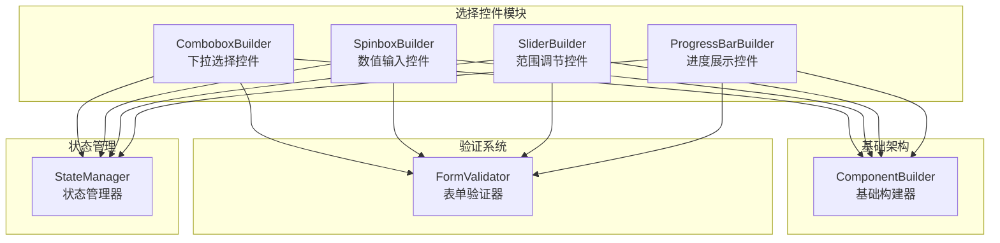
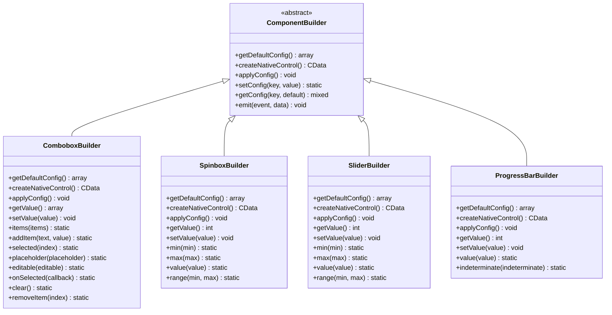
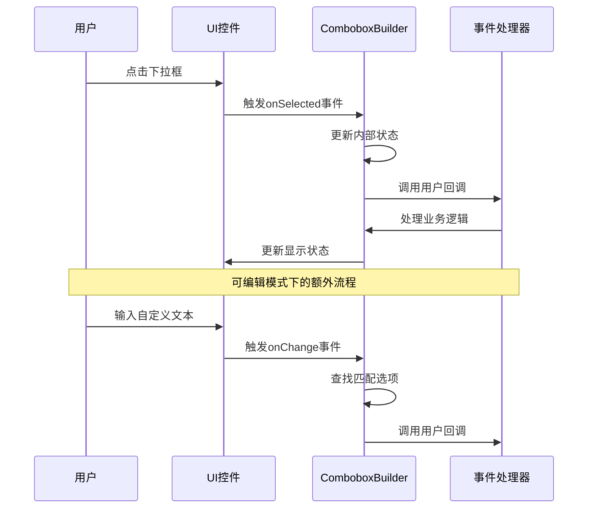

# 选择控件

<cite>
**本文档中引用的文件**
- [ComboboxBuilder.php](file://src/Components/ComboboxBuilder.php)
- [SpinboxBuilder.php](file://src/Components/SpinboxBuilder.php)
- [SliderBuilder.php](file://src/Components/SliderBuilder.php)
- [ProgressBarBuilder.php](file://src/Components/ProgressBarBuilder.php)
- [FormValidator.php](file://src/Validation/FormValidator.php)
- [full.php](file://example/full.php)
- [htmlFull.php](file://example/htmlFull.php)
- [calculator.php](file://example/calculator.php)
- [builder_helpers_demo.php](file://example/builder_helpers_demo.php)
- [views/full.ui.html](file://example/views/full.ui.html)
</cite>

## 目录
1. [简介](#简介)
2. [项目结构](#项目结构)
3. [核心组件](#核心组件)
4. [架构概览](#架构概览)
5. [详细组件分析](#详细组件分析)
6. [配置方法详解](#配置方法详解)
7. [Builder API模式示例](#builder-api模式示例)
8. [HTML模板模式示例](#html模板模式示例)
9. [输入验证集成](#输入验证集成)
10. [性能优化建议](#性能优化建议)
11. [故障排除指南](#故障排除指南)
12. [结论](#结论)

## 简介

libuiBuilder是一个基于PHP的GUI应用程序开发框架，提供了丰富的选择控件来满足不同的用户交互需求。本文档详细介绍了四种核心选择控件：ComboboxBuilder（下拉选择）、SpinboxBuilder（数值输入）、SliderBuilder（范围调节）和ProgressBarBuilder（进度展示）。这些控件不仅支持传统的Builder API模式，还提供了HTML模板模式，实现了灵活的界面构建方式。

每个控件都采用了响应式设计原则，支持实时数据绑定和事件驱动的更新机制。通过统一的接口设计，开发者可以轻松地在不同模式之间切换，同时保持一致的编程体验。

## 项目结构

libuiBuilder的选择控件采用模块化架构，每个控件都是独立的组件，具有清晰的职责分工：



**图表来源**
- [ComboboxBuilder.php](file://src/Components/ComboboxBuilder.php#L10-L258)
- [SpinboxBuilder.php](file://src/Components/SpinboxBuilder.php#L9-L78)
- [SliderBuilder.php](file://src/Components/SliderBuilder.php#L9-L78)
- [ProgressBarBuilder.php](file://src/Components/ProgressBarBuilder.php#L9-L56)

**章节来源**
- [ComboboxBuilder.php](file://src/Components/ComboboxBuilder.php#L1-L258)
- [SpinboxBuilder.php](file://src/Components/SpinboxBuilder.php#L1-L78)
- [SliderBuilder.php](file://src/Components/SliderBuilder.php#L1-L78)
- [ProgressBarBuilder.php](file://src/Components/ProgressBarBuilder.php#L1-L56)

## 核心组件

libuiBuilder的选择控件系统包含四个核心组件，每个组件都有其特定的应用场景和功能特性：

### ComboboxBuilder - 下拉选择控件
ComboboxBuilder提供了灵活的下拉选择功能，支持静态选项列表和可编辑模式。它能够处理复杂的选项数据结构，包括文本和值的分离存储。

### SpinboxBuilder - 数值输入控件  
SpinboxBuilder专门用于数值输入场景，提供精确的数值控制能力，支持自定义范围限制和实时数值验证。

### SliderBuilder - 范围调节控件
SliderBuilder实现了直观的滑动条交互，适合需要连续范围选择的场景，如音量控制、亮度调节等。

### ProgressBarBuilder - 进度展示控件
ProgressBarBuilder专注于进度指示功能，支持确定性和不确定性两种进度模式，适用于文件下载、任务执行等场景。

**章节来源**
- [ComboboxBuilder.php](file://src/Components/ComboboxBuilder.php#L10-L258)
- [SpinboxBuilder.php](file://src/Components/SpinboxBuilder.php#L9-L78)
- [SliderBuilder.php](file://src/Components/SliderBuilder.php#L9-L78)
- [ProgressBarBuilder.php](file://src/Components/ProgressBarBuilder.php#L9-L56)

## 架构概览

选择控件系统采用了分层架构设计，确保了良好的可扩展性和维护性：



**图表来源**
- [ComboboxBuilder.php](file://src/Components/ComboboxBuilder.php#L10-L258)
- [SpinboxBuilder.php](file://src/Components/SpinboxBuilder.php#L9-L78)
- [SliderBuilder.php](file://src/Components/SliderBuilder.php#L9-L78)
- [ProgressBarBuilder.php](file://src/Components/ProgressBarBuilder.php#L9-L56)

## 详细组件分析

### ComboboxBuilder - 下拉选择控件

ComboboxBuilder是最复杂的选择控件，支持多种配置模式和交互方式：

#### 核心特性
- **静态选项支持**：支持字符串数组和键值对数组
- **可编辑模式**：允许用户输入自定义值
- **事件驱动**：提供onSelected和onChange回调
- **动态操作**：支持运行时添加、删除选项

#### 配置参数
| 参数 | 类型 | 默认值 | 描述 |
|------|------|--------|------|
| items | array | [] | 选项列表，支持字符串或键值对 |
| selected | int | -1 | 默认选中索引 |
| placeholder | string | '请选择...' | 占位符文本 |
| editable | bool | false | 是否允许编辑 |
| onSelected | callable | null | 选择回调函数 |
| onChange | callable | null | 变化回调函数 |

#### 交互流程



**图表来源**
- [ComboboxBuilder.php](file://src/Components/ComboboxBuilder.php#L57-L106)

**章节来源**
- [ComboboxBuilder.php](file://src/Components/ComboboxBuilder.php#L10-L258)

### SpinboxBuilder - 数值输入控件

SpinboxBuilder提供了精确的数值控制功能，特别适合需要数值输入的场景：

#### 核心特性
- **范围限制**：支持最小值和最大值设置
- **实时验证**：自动验证数值范围
- **简洁接口**：提供链式调用方法
- **类型安全**：确保数值类型一致性

#### 配置参数
| 参数 | 类型 | 默认值 | 描述 |
|------|------|--------|------|
| min | int | 0 | 最小值限制 |
| max | int | 100 | 最大值限制 |
| value | int | 0 | 当前数值 |
| onChange | callable | null | 数值变化回调 |

#### 使用场景
- 年龄输入
- 数量选择
- 百分比设置
- 时间间隔配置

**章节来源**
- [SpinboxBuilder.php](file://src/Components/SpinboxBuilder.php#L9-L78)

### SliderBuilder - 范围调节控件

SliderBuilder实现了直观的滑动条交互，适合连续范围选择：

#### 核心特性
- **连续范围**：支持浮点数范围
- **视觉反馈**：提供直观的滑动体验
- **高精度**：支持细粒度调节
- **响应式**：适应不同屏幕尺寸

#### 配置参数
| 参数 | 类型 | 默认值 | 描述 |
|------|------|--------|------|
| min | int | 0 | 最小值 |
| max | int | 100 | 最大值 |
| value | int | 0 | 当前值 |
| onChange | callable | null | 滑动回调 |

#### 应用场景
- 音量控制
- 亮度调节
- 缩放比例
- 自定义参数调整

**章节来源**
- [SliderBuilder.php](file://src/Components/SliderBuilder.php#L9-L78)

### ProgressBarBuilder - 进度展示控件

ProgressBarBuilder专注于进度指示功能，支持多种进度模式：

#### 核心特性
- **确定性进度**：显示具体百分比
- **不确定性进度**：表示未知完成时间的任务
- **状态指示**：提供视觉反馈
- **动画支持**：平滑的进度变化

#### 配置参数
| 参数 | 类型 | 默认值 | 描述 |
|------|------|--------|------|
| value | int | 0 | 当前进度值 |
| indeterminate | bool | false | 是否为不确定进度 |

#### 使用场景
- 文件下载进度
- 数据处理进度
- 系统启动进度
- 任务执行状态

**章节来源**
- [ProgressBarBuilder.php](file://src/Components/ProgressBarBuilder.php#L9-L56)

## 配置方法详解

### ComboboxBuilder配置方法

ComboboxBuilder提供了丰富的配置方法来满足不同的使用需求：

#### 基础配置
- `items(array $items)`：设置选项列表
- `selected(int $index)`：设置默认选中项
- `placeholder(string $placeholder)`：设置占位符文本
- `editable(bool $editable)`：启用可编辑模式

#### 动态操作
- `addItem(string $text, $value)`：添加新选项
- `clear()`：清空所有选项
- `removeItem(int $index)`：删除指定选项

#### 事件处理
- `onSelected(callable $callback)`：设置选择回调

### SpinboxBuilder配置方法

SpinboxBuilder采用简洁的配置接口：

#### 范围设置
- `min(int $min)`：设置最小值
- `max(int $max)`：设置最大值
- `range(int $min, int $max)`：同时设置范围

#### 值操作
- `value(int $value)`：设置当前值

### SliderBuilder配置方法

SliderBuilder与SpinboxBuilder共享相似的配置接口：

#### 范围设置
- `min(int $min)`：设置最小值
- `max(int $max)`：设置最大值
- `range(int $min, int $max)`：同时设置范围

#### 值操作
- `value(int $value)`：设置当前值

#### 回调处理
- `onChange(callable $callback)`：设置变化回调

### ProgressBarBuilder配置方法

ProgressBarBuilder提供最简化的配置接口：

#### 基础设置
- `value(int $value)`：设置进度值
- `indeterminate(bool $indeterminate)`：设置进度模式

**章节来源**
- [ComboboxBuilder.php](file://src/Components/ComboboxBuilder.php#L188-L258)
- [SpinboxBuilder.php](file://src/Components/SpinboxBuilder.php#L58-L78)
- [SliderBuilder.php](file://src/Components/SliderBuilder.php#L58-L78)
- [ProgressBarBuilder.php](file://src/Components/ProgressBarBuilder.php#L47-L56)

## Builder API模式示例

Builder API模式提供了流畅的链式调用体验，适合程序化界面构建：

### 基础使用示例

```php
// 创建下拉选择控件
$combobox = Builder::combobox()
    ->id('citySelect')
    ->items(['北京', '上海', '广州', '深圳'])
    ->selected(0)
    ->placeholder('请选择城市')
    ->onSelected(function($index, $item, $component) {
        echo "选择了第{$index}项: {$item}";
    });

// 创建数值输入控件
$spinbox = Builder::spinbox()
    ->id('quantity')
    ->range(1, 100)
    ->value(10)
    ->onChange(function($value, $component) {
        echo "数量变为: {$value}";
    });

// 创建滑动条控件
$slider = Builder::slider()
    ->id('volume')
    ->range(0, 100)
    ->value(50)
    ->onChange(function($value, $component) {
        echo "音量设置为: {$value}%";
    });

// 创建进度条控件
$progress = Builder::progressBar()
    ->id('uploadProgress')
    ->value(75);
```

### 复杂布局示例

```php
// 创建包含所有选择控件的表单
$form = Builder::grid()
    ->padded(true)
    ->form([
        [
            'label' => Builder::label()->text('城市选择:'),
            'control' => $combobox
        ],
        [
            'label' => Builder::label()->text('数量设置:'),
            'control' => $spinbox
        ],
        [
            'label' => Builder::label()->text('音量调节:'),
            'control' => $slider
        ],
        [
            'label' => Builder::label()->text('上传进度:'),
            'control' => $progress
        ]
    ]);
```

### 动态更新示例

```php
// 实现控件间的联动
$citySelect = Builder::combobox()
    ->id('citySelect')
    ->items(['北京', '上海', '广州', '深圳'])
    ->onSelected(function($index, $city, $component) use ($spinbox) {
        // 根据城市设置不同的数量范围
        $ranges = [
            0 => [1, 5],   // 北京
            1 => [1, 10],  // 上海
            2 => [1, 8],   // 广州
            3 => [1, 12]   // 深圳
        ];
        
        if (isset($ranges[$index])) {
            [$min, $max] = $ranges[$index];
            $spinbox->range($min, $max)->value($min);
        }
    });
```

**章节来源**
- [full.php](file://example/full.php#L86-L120)
- [builder_helpers_demo.php](file://example/builder_helpers_demo.php#L1-L140)

## HTML模板模式示例

HTML模板模式提供了声明式的界面构建方式，适合分离关注点的设计：

### 基础HTML模板

```html
<!-- 下拉选择控件 -->
<combobox id="citySelect" selected="0" expand="horizontal">
    <option>请选择城市</option>
    <option>北京</option>
    <option>上海</option>
    <option>广州</option>
    <option>深圳</option>
</combobox>

<!-- 数值输入控件 -->
<spinbox id="quantity" min="1" max="100" value="10" expand="horizontal"/>

<!-- 滑动条控件 -->
<slider id="volume" min="0" max="100" value="50" expand="horizontal"/>

<!-- 进度条控件 -->
<progressbar id="uploadProgress" value="75"/>
```

### 事件处理绑定

```html
<script>
// 定义事件处理器
function handleCityChange(index, item) {
    console.log(`选择了城市: ${item}`);
    // 动态更新其他控件
    updateQuantityRange(index);
}

function handleVolumeChange(value) {
    console.log(`音量设置为: ${value}%`);
    // 更新相关显示
    updateVolumeDisplay(value);
}

function handleUploadProgress(value) {
    console.log(`上传进度: ${value}%`);
    // 更新进度条样式
    updateProgressBarStyle(value);
}
</script>
```

### 动态更新机制

```html
<!-- 响应式控件更新 -->
<combobox id="citySelect" 
          onchange="handleCityChange(this.selectedIndex, this.options[this.selectedIndex].text)">
    <option>北京</option>
    <option>上海</option>
    <option>广州</option>
    <option>深圳</option>
</combobox>

<spinbox id="quantity" 
         min="1" 
         max="100" 
         value="10"
         onchange="handleQuantityChange(this.value)"/>

<slider id="volume" 
        min="0" 
        max="100" 
        value="50"
        onchange="handleVolumeChange(this.value)"/>

<progressbar id="uploadProgress" 
             value="0"
             indeterminate="false"/>
```

### 状态管理集成

```html
<!-- 使用状态管理器实现响应式更新 -->
<combobox id="citySelect" 
          onchange="StateManager.set('selectedCity', this.selectedIndex)">
    <option>北京</option>
    <option>上海</option>
    <option>广州</option>
    <option>深圳</option>
</combobox>

<spinbox id="quantity" 
         min="1" 
         max="100" 
         value="10"
         onchange="StateManager.set('quantity', parseInt(this.value))"/>

<!-- 响应式显示 -->
<div id="summary">
    你选择了: <span data-bind="selectedCity"></span>
    数量: <span data-bind="quantity"></span>
</div>
```

**章节来源**
- [views/full.ui.html](file://example/views/full.ui.html#L92-L125)
- [htmlFull.php](file://example/htmlFull.php#L1-L76)

## 输入验证集成

FormValidator.php提供了强大的输入验证功能，可以与所有选择控件无缝集成：

### 验证规则定义

```php
// 创建验证器实例
$validator = new FormValidator();

// 定义验证规则
$validator->rule('city', ['required' => true])
          ->rule('quantity', [
              'required' => true, 
              'min' => 1, 
              'max' => 100
          ])
          ->rule('volume', [
              'required' => true,
              'min' => 0,
              'max' => 100
          ]);
```

### 控件验证集成

```php
// 获取控件值进行验证
$cityValue = $stateManager->getComponent('citySelect')->getValue();
$quantityValue = $stateManager->getComponent('quantity')->getValue();
$volumeValue = $stateManager->getComponent('volume')->getValue();

// 验证数据
$data = [
    'city' => $cityValue['text'] ?? '',
    'quantity' => $quantityValue,
    'volume' => $volumeValue
];

if ($validator->validate($data)) {
    // 验证通过，处理业务逻辑
    processFormData($data);
} else {
    // 显示错误信息
    $errors = $validator->getErrors();
    displayValidationErrors($errors);
}
```

### 实时验证示例

```php
// 实现控件的实时验证
$citySelect = Builder::combobox()
    ->id('citySelect')
    ->items(['北京', '上海', '广州', '深圳'])
    ->onSelected(function($index, $item, $component) use ($validator) {
        // 实时验证
        $isValid = $validator->validate(['city' => $item]);
        if (!$isValid) {
            $errors = $validator->getErrors();
            showValidationError('city', $errors['city'] ?? '');
        }
    });

$spinbox = Builder::spinbox()
    ->id('quantity')
    ->range(1, 100)
    ->onChange(function($value, $component) use ($validator) {
        // 实时验证
        $isValid = $validator->validate(['quantity' => $value]);
        if (!$isValid) {
            $errors = $validator->getErrors();
            showValidationError('quantity', $errors['quantity'] ?? '');
        }
    });
```

### 错误处理机制

```php
// 错误信息显示
function showValidationError($field, $message) {
    $errorElement = document.getElementById(`${field}Error`);
    if (errorElement) {
        errorElement.textContent = $message;
        errorElement.style.display = 'block';
    }
    
    // 添加视觉反馈
    const control = document.getElementById(field);
    if (control) {
        control.classList.add('error');
    }
}

// 清除错误信息
function clearValidationErrors() {
    document.querySelectorAll('.error').forEach(el => {
        el.classList.remove('error');
    });
    document.querySelectorAll('.error-message').forEach(el => {
        el.style.display = 'none';
    });
}
```

**章节来源**
- [FormValidator.php](file://src/Validation/FormValidator.php#L1-L78)

## 性能优化建议

### 避免高频onChanged事件导致的过度重绘

高频的onChanged事件可能导致界面过度重绘，影响用户体验。以下是几种优化策略：

#### 1. 事件节流（Throttling）

```php
// 实现事件节流
function throttle(callback, limit) {
    let wait = false;
    return function() {
        if (!wait) {
            callback.apply(this, arguments);
            wait = true;
            setTimeout(() => {
                wait = false;
            }, limit);
        }
    };
}

// 使用节流包装onChanged事件
$slider = Builder::slider()
    ->id('volume')
    ->range(0, 100)
    ->value(50)
    ->onChange(throttle(function($value, $component) {
        // 处理音量变化
        updateAudioVolume($value);
    }, 100)); // 100ms节流
```

#### 2. 防抖（Debouncing）

对于需要等待用户输入完成再处理的场景，使用防抖：

```php
// 实现防抖
function debounce(callback, delay) {
    let timer;
    return function() {
        clearTimeout(timer);
        timer = setTimeout(() => {
            callback.apply(this, arguments);
        }, delay);
    };
}

$spinbox = Builder::spinbox()
    ->id('quantity')
    ->range(1, 100)
    ->value(10)
    ->onChange(debounce(function($value, $component) {
        // 等待用户输入完成后再更新
        updateCartQuantity($value);
    }, 300)); // 300ms延迟
```

#### 3. 批量更新策略

```php
// 使用批量更新减少重绘次数
class BatchUpdateManager {
    private $updates = [];
    private $timer;
    
    public function scheduleUpdate($key, $value) {
        $this->updates[$key] = $value;
        
        if (!$this->timer) {
            $this->timer = setTimeout([$this, 'flushUpdates'], 16); // ~60fps
        }
    }
    
    public function flushUpdates() {
        if (!empty($this->updates)) {
            // 批量应用更新
            $this->applyBatchUpdates($this->updates);
            $this->updates = [];
            $this->timer = null;
        }
    }
}

$batchManager = new BatchUpdateManager();

$slider = Builder::slider()
    ->id('volume')
    ->range(0, 100)
    ->value(50)
    ->onChange(function($value, $component) use ($batchManager) {
        $batchManager->scheduleUpdate('volume', $value);
    });
```

#### 4. 条件更新优化

```php
// 只在值真正改变时才更新
$spinbox = Builder::spinbox()
    ->id('quantity')
    ->range(1, 100)
    ->value(10)
    ->onChange(function($value, $component) {
        global $lastQuantity;
        
        if ($value !== $lastQuantity) {
            $lastQuantity = $value;
            updateQuantityDisplay($value);
        }
    });
```

#### 5. 内存管理优化

```php
// 及时清理不需要的事件监听器
function cleanupComponentEvents($component) {
    // 移除所有事件监听器
    $component->removeAllListeners();
    
    // 清理闭包引用
    $component->cleanup();
}

// 在组件销毁时清理
$slider = Builder::slider()
    ->id('volume')
    ->range(0, 100)
    ->value(50)
    ->onChange(function($value, $component) {
        // 业务逻辑
    });

// 组件销毁时清理
registerCleanupHook(function() use ($slider) {
    cleanupComponentEvents($slider);
});
```

### 性能监控

```php
// 性能监控工具
class PerformanceMonitor {
    private $metrics = [];
    
    public function trackEventTime($eventName, $callback) {
        $startTime = microtime(true);
        
        $result = $callback();
        
        $endTime = microtime(true);
        $duration = ($endTime - $startTime) * 1000; // 转换为毫秒
        
        if (!isset($this->metrics[$eventName])) {
            $this->metrics[$eventName] = [];
        }
        
        $this->metrics[$eventName][] = $duration;
        
        return $result;
    }
    
    public function getAverageTime($eventName) {
        if (isset($this->metrics[$eventName])) {
            $times = $this->metrics[$eventName];
            return array_sum($times) / count($times);
        }
        return 0;
    }
}

$monitor = new PerformanceMonitor();

$slider = Builder::slider()
    ->id('volume')
    ->range(0, 100)
    ->value(50)
    ->onChange(function($value, $component) use ($monitor) {
        $monitor->trackEventTime('slider_change', function() use ($value) {
            updateAudioVolume($value);
        });
    });
```

## 故障排除指南

### 常见问题及解决方案

#### 1. 事件回调未触发

**问题描述**：onChanged事件没有按预期触发

**可能原因**：
- 事件绑定时机错误
- 回调函数语法错误
- 组件初始化未完成

**解决方案**：
```php
// 确保在组件初始化完成后绑定事件
$component = Builder::spinbox()
    ->id('quantity')
    ->range(1, 100)
    ->value(10);

// 延迟绑定事件
setTimeout(function() use ($component) {
    $component->onChange(function($value, $component) {
        echo "值已更改: {$value}";
    });
}, 100);
```

#### 2. 值无法正确设置

**问题描述**：setValue方法调用后值没有更新

**可能原因**：
- 组件尚未创建
- 值不在有效范围内
- 数据类型不匹配

**解决方案**：
```php
// 检查组件状态
if ($component->isCreated()) {
    $component->setValue($newValue);
} else {
    // 延迟设置值
    $component->onCreate(function() use ($component, $newValue) {
        $component->setValue($newValue);
    });
}

// 验证值的有效性
if ($newValue >= $min && $newValue <= $max) {
    $component->setValue($newValue);
} else {
    echo "值超出范围: {$newValue}";
}
```

#### 3. 内存泄漏问题

**问题描述**：长时间运行后内存占用持续增长

**可能原因**：
- 事件监听器未正确清理
- 循环引用
- 大量未释放的对象

**解决方案**：
```php
// 实现正确的清理机制
class ManagedComponent {
    private $eventHandlers = [];
    
    public function addEventHandler($event, $callback) {
        $this->eventHandlers[$event][] = $callback;
    }
    
    public function cleanup() {
        // 清理所有事件监听器
        $this->eventHandlers = [];
        
        // 清理其他资源
        $this->cleanupResources();
    }
    
    private function cleanupResources() {
        // 清理本地资源
    }
}

// 使用清理钩子
register_shutdown_function(function() {
    // 清理所有组件
    ComponentRegistry::cleanupAll();
});
```

#### 4. 性能问题诊断

**问题描述**：界面响应缓慢，频繁卡顿

**诊断步骤**：
```php
// 性能分析工具
class PerformanceProfiler {
    public static function measureExecutionTime($name, $callback) {
        $start = microtime(true);
        $result = $callback();
        $end = microtime(true);
        
        echo "[{$name}] 执行时间: " . (($end - $start) * 1000) . "ms\n";
        return $result;
    }
    
    public static function monitorMemoryUsage($name, $callback) {
        $before = memory_get_usage();
        $result = $callback();
        $after = memory_get_usage();
        
        echo "[{$name}] 内存使用: " . ($after - $before) . " 字节\n";
        return $result;
    }
}

// 使用性能分析
$slider = Builder::slider()
    ->id('volume')
    ->range(0, 100)
    ->value(50)
    ->onChange(function($value, $component) {
        PerformanceProfiler::measureExecutionTime('slider_change', function() use ($value) {
            updateAudioVolume($value);
        });
    });
```

**章节来源**
- [calculator.php](file://example/calculator.php#L231-L238)

## 结论

libuiBuilder的选择控件系统提供了完整而灵活的用户界面构建解决方案。通过ComboboxBuilder、SpinboxBuilder、SliderBuilder和ProgressBarBuilder这四个核心组件，开发者可以轻松创建各种类型的交互界面。

### 主要优势

1. **统一的API设计**：所有控件都遵循一致的接口规范，降低了学习成本
2. **双模式支持**：同时支持Builder API和HTML模板两种开发模式
3. **响应式设计**：内置状态管理和事件驱动机制
4. **可扩展性**：模块化架构便于功能扩展和定制
5. **性能优化**：提供了多种性能优化策略和最佳实践

### 最佳实践建议

1. **合理选择控件类型**：根据具体需求选择最适合的控件类型
2. **实施性能优化**：对于高频交互场景，采用节流、防抖等技术
3. **完善错误处理**：建立健壮的错误处理和恢复机制
4. **注重用户体验**：提供清晰的视觉反馈和及时的状态更新
5. **保持代码整洁**：遵循单一职责原则，保持组件的简洁性

通过合理运用这些选择控件和相关的最佳实践，开发者可以构建出既美观又高效的桌面应用程序界面。