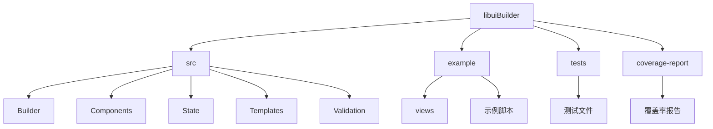
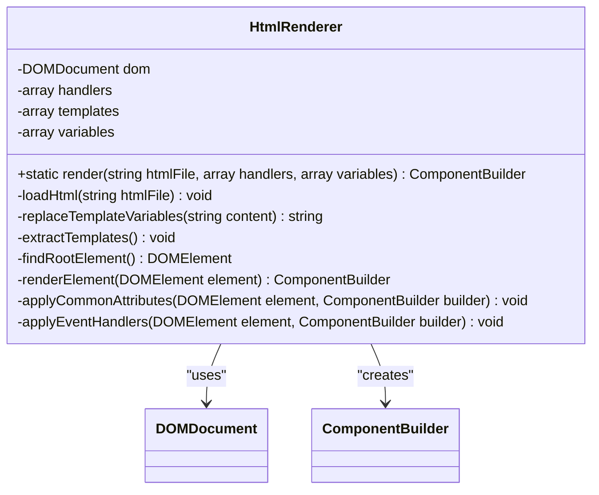
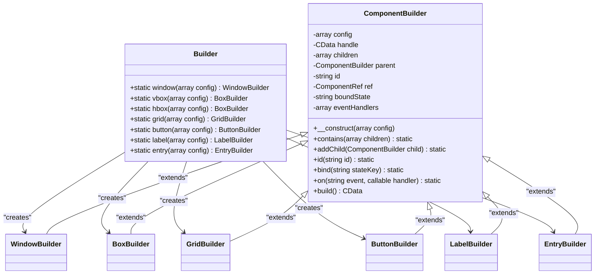
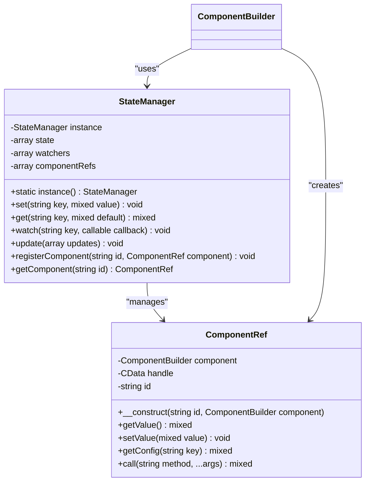
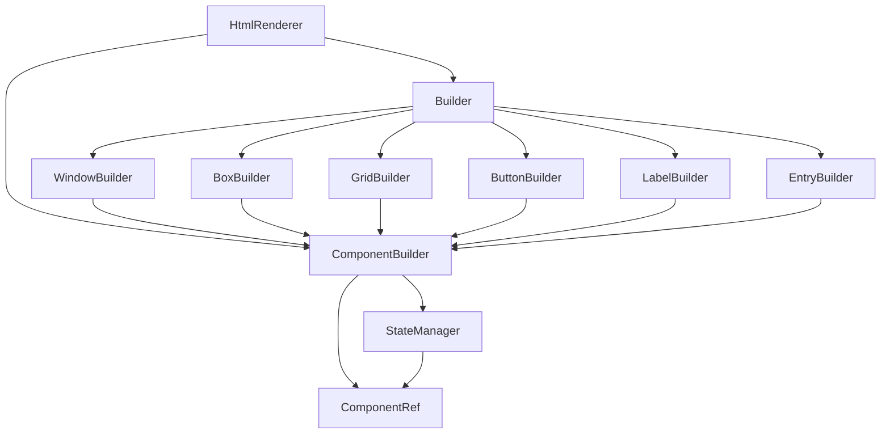

# Html 渲染器

<cite>
**本文档引用的文件**
- [README.md](file://README.md)
- [src/HtmlRenderer.php](file://src/HtmlRenderer.php)
- [src/Builder.php](file://src/Builder.php)
- [src/ComponentBuilder.php](file://src/ComponentBuilder.php)
- [src/State/StateManager.php](file://src/State/StateManager.php)
- [src/State/ComponentRef.php](file://src/State/ComponentRef.php)
- [src/Components/GridBuilder.php](file://src/Components/GridBuilder.php)
- [src/Components/WindowBuilder.php](file://src/Components/WindowBuilder.php)
- [src/Templates/FormTemplate.php](file://src/Templates/FormTemplate.php)
- [src/ResponsiveGridBuilder.php](file://src/ResponsiveGridBuilder.php)
- [example/htmlLogin.php](file://example/htmlLogin.php)
- [example/views/login.ui.html](file://example/views/login.ui.html)
- [example/views/full.ui.html](file://example/views/full.ui.html)
</cite>

## 目录
1. [简介](#简介)
2. [项目结构](#项目结构)
3. [核心组件](#核心组件)
4. [架构概述](#架构概述)
5. [详细组件分析](#详细组件分析)
6. [依赖分析](#依赖分析)
7. [性能考虑](#性能考虑)
8. [故障排除指南](#故障排除指南)
9. [结论](#结论)

## 简介
Html 渲染器是一个基于 PHP 的 GUI 应用开发库，它允许开发者使用熟悉的 HTML 语法来定义桌面应用程序的用户界面。该库提供了两种主要的开发方式：HTML 模板渲染和 Builder API。HTML 模板方式被推荐使用，因为它提供了更直观、可视化的界面定义方式，同时支持组件复用和模板系统。

该项目基于 kingbes/libui 构建，提供了流畅的链式调用 API、强大的 Grid 布局系统、响应式数据绑定、简洁的事件处理机制以及完整的测试覆盖。通过将 HTML 模板文件渲染为原生 GUI 组件，开发者可以使用类似 Web 开发的方式创建桌面应用程序，大大降低了桌面应用开发的门槛。

## 项目结构
项目采用清晰的分层结构，主要分为源代码、示例、测试和覆盖率报告四个部分。源代码位于 src 目录下，包含构建器、组件、状态管理和模板等核心模块。示例代码位于 example 目录下，提供了多种使用场景的演示。测试代码位于 tests 目录下，使用 Pest 测试框架进行单元测试。



**Diagram sources**
- [README.md](file://README.md#L1-L407)

**Section sources**
- [README.md](file://README.md#L1-L407)

## 核心组件
核心组件包括 HtmlRenderer、Builder、ComponentBuilder、StateManager 和 ComponentRef。HtmlRenderer 负责将 HTML 模板文件解析并渲染为 Builder 组件树。Builder 类是所有组件的入口，提供了静态方法来创建各种 UI 组件。ComponentBuilder 是所有组件构建器的抽象基类，定义了通用的配置和构建方法。StateManager 实现了全局状态管理，支持数据绑定和状态监听。ComponentRef 提供了对其他组件的引用能力，允许跨组件交互。

**Section sources**
- [src/HtmlRenderer.php](file://src/HtmlRenderer.php#L1-L684)
- [src/Builder.php](file://src/Builder.php#L1-L153)
- [src/ComponentBuilder.php](file://src/ComponentBuilder.php#L1-L234)
- [src/State/StateManager.php](file://src/State/StateManager.php#L1-L91)
- [src/State/ComponentRef.php](file://src/State/ComponentRef.php#L1-L74)

## 架构概述
系统架构采用分层设计，最上层是 HTML 模板，中间层是渲染器和构建器，底层是 libui 原生控件。HtmlRenderer 作为核心组件，负责解析 HTML 模板并将其转换为 Builder 组件树。Builder 组件树最终会被构建为 libui 原生控件并显示。

```mermaid
graph TB
subgraph "表现层"
HTML[HTML模板] --> Renderer[HtmlRenderer]
end
subgraph "逻辑层"
Renderer --> Builder[Builder组件]
Builder --> Component[ComponentBuilder]
end
subgraph "状态层"
State[StateManager] < --> Component
Ref[ComponentRef] < --> Component
end
subgraph "原生层"
Component --> Libui[libui原生控件]
end
```

**Diagram sources**
- [src/HtmlRenderer.php](file://src/HtmlRenderer.php#L1-L684)
- [src/Builder.php](file://src/Builder.php#L1-L153)
- [src/ComponentBuilder.php](file://src/ComponentBuilder.php#L1-L234)

## 详细组件分析

### HtmlRenderer 分析
HtmlRenderer 是整个系统的核心，负责将 HTML 模板文件渲染为 Builder 组件树。它使用 DOMDocument 解析 HTML，支持模板变量替换、组件模板复用和事件绑定。



**Diagram sources**
- [src/HtmlRenderer.php](file://src/HtmlRenderer.php#L1-L684)

**Section sources**
- [src/HtmlRenderer.php](file://src/HtmlRenderer.php#L1-L684)

### Builder 模式分析
Builder 模式提供了流畅的链式调用 API，使代码更具可读性和表达力。通过静态工厂方法创建各种组件构建器，并通过链式调用配置组件属性。



**Diagram sources**
- [src/Builder.php](file://src/Builder.php#L1-L153)
- [src/ComponentBuilder.php](file://src/ComponentBuilder.php#L1-L234)

**Section sources**
- [src/Builder.php](file://src/Builder.php#L1-L153)
- [src/ComponentBuilder.php](file://src/ComponentBuilder.php#L1-L234)

### 状态管理分析
状态管理系统实现了响应式数据绑定，通过 StateManager 和 ComponentRef 协同工作，实现了组件间的数据共享和自动更新。



**Diagram sources**
- [src/State/StateManager.php](file://src/State/StateManager.php#L1-L91)
- [src/State/ComponentRef.php](file://src/State/ComponentRef.php#L1-L74)

**Section sources**
- [src/State/StateManager.php](file://src/State/StateManager.php#L1-L91)
- [src/State/ComponentRef.php](file://src/State/ComponentRef.php#L1-L74)

## 依赖分析
项目依赖关系清晰，HtmlRenderer 依赖于 Builder 和 ComponentBuilder，Builder 依赖于各个具体的组件构建器，所有组件都依赖于 ComponentBuilder 基类。状态管理模块独立于 UI 组件，通过接口与组件交互。



**Diagram sources**
- [src/HtmlRenderer.php](file://src/HtmlRenderer.php#L1-L684)
- [src/Builder.php](file://src/Builder.php#L1-L153)
- [src/ComponentBuilder.php](file://src/ComponentBuilder.php#L1-L234)

**Section sources**
- [src/HtmlRenderer.php](file://src/HtmlRenderer.php#L1-L684)
- [src/Builder.php](file://src/Builder.php#L1-L153)
- [src/ComponentBuilder.php](file://src/ComponentBuilder.php#L1-L234)

## 性能考虑
HtmlRenderer 在性能方面做了多项优化。首先，它使用 DOMDocument 进行 HTML 解析，这是 PHP 内置的高效 XML/HTML 处理库。其次，组件构建采用延迟构建策略，只有在需要时才创建原生控件句柄。状态管理采用观察者模式，只在状态变化时通知相关组件更新。

对于大型界面，建议使用 Grid 布局而非嵌套的 Box 布局，因为 Grid 布局在渲染性能和内存使用上都更优。同时，避免在事件处理器中执行耗时操作，以免阻塞 UI 线程。

## 故障排除指南
常见问题包括 HTML 模板文件找不到、组件 ID 重复、事件处理器未定义等。对于模板文件找不到的问题，请检查文件路径是否正确。对于组件 ID 重复的问题，请确保每个组件的 ID 在全局范围内唯一。对于事件处理器未定义的问题，请检查处理器名称是否匹配。

调试时可以使用 StateManager::dump() 方法查看当前所有状态，使用 ComponentRef 获取其他组件的引用并检查其状态。对于复杂的布局问题，建议先使用简单的测试用例逐步构建界面。

**Section sources**
- [src/State/StateManager.php](file://src/State/StateManager.php#L1-L91)
- [src/State/ComponentRef.php](file://src/State/ComponentRef.php#L1-L74)

## 结论
Html 渲染器提供了一种创新的桌面应用开发方式，通过将 HTML 模板转换为原生 GUI 组件，使开发者能够使用熟悉的 Web 开发技术创建桌面应用程序。其核心优势在于简洁的 API 设计、强大的布局系统和响应式状态管理。推荐使用 HTML 模板方式作为主要开发方式，结合组件模板复用和状态管理，可以快速构建复杂的桌面应用界面。