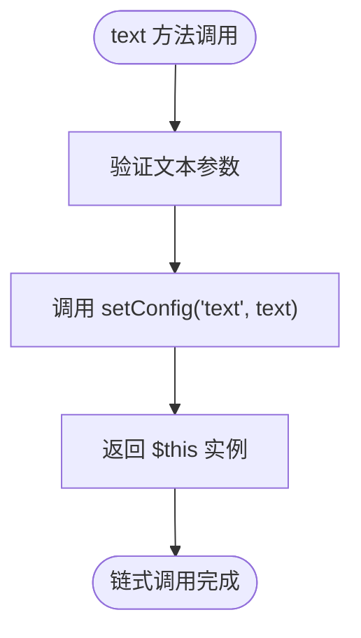

# ButtonBuilder 按钮控件

<cite>
**本文档中引用的文件**
- [ButtonBuilder.php](file://src/Components/ButtonBuilder.php)
- [ComponentBuilder.php](file://src/ComponentBuilder.php)
- [simple.php](file://example/simple.php)
- [StateManager.php](file://src/State/StateManager.php)
- [Builder.php](file://src/Builder.php)
</cite>

## 目录
1. [简介](#简介)
2. [项目结构](#项目结构)
3. [核心组件](#核心组件)
4. [架构概览](#架构概览)
5. [详细组件分析](#详细组件分析)
6. [依赖关系分析](#依赖关系分析)
7. [性能考虑](#性能考虑)
8. [故障排除指南](#故障排除指南)
9. [结论](#结论)

## 简介

ButtonBuilder 是 LibUI PHP 库中的一个核心组件，专门用于创建和管理按钮控件。它继承自 ComponentBuilder 抽象类，实现了按钮特有的功能，包括文本显示、点击事件处理和状态管理。ButtonBuilder 提供了简洁的链式调用接口，支持动态配置按钮属性，并与状态管理系统紧密集成。

该组件的设计遵循了面向对象的设计原则，通过抽象基类定义通用接口，具体实现类专注于特定功能。ButtonBuilder 特别强调事件驱动编程模式，允许开发者轻松地为按钮点击事件绑定自定义处理逻辑。

## 项目结构

ButtonBuilder 在项目中的组织结构体现了清晰的分层架构设计：

**图表来源**
- [ComponentBuilder.php](file://src/ComponentBuilder.php#L11-L234)
- [ButtonBuilder.php](file://src/Components/ButtonBuilder.php#L9-L48)
- [Builder.php](file://src/Builder.php#L27-L60)

**章节来源**
- [ButtonBuilder.php](file://src/Components/ButtonBuilder.php#L1-L48)
- [ComponentBuilder.php](file://src/ComponentBuilder.php#L1-L234)

## 核心组件

ButtonBuilder 的核心功能围绕三个关键配置项展开：text（文本）、onClick（点击事件）和 stretchy（拉伸属性）。这些配置项通过继承的 ComponentBuilder 基类提供的配置系统进行管理。

### 默认配置结构

ButtonBuilder 继承了 ComponentBuilder 的配置机制，提供了以下默认配置：

| 配置项 | 类型 | 默认值 | 描述 |
|--------|------|--------|------|
| text | string | 'Button' | 按钮显示的文本内容 |
| onClick | callable | null | 点击事件的回调函数 |
| stretchy | boolean | false | 是否允许在布局中拉伸 |

### 继承关系

ButtonBuilder 通过继承 ComponentBuilder 实现了完整的组件生命周期管理：

**图表来源**
- [ComponentBuilder.php](file://src/ComponentBuilder.php#L11-L234)
- [ButtonBuilder.php](file://src/Components/ButtonBuilder.php#L9-L48)

**章节来源**
- [ButtonBuilder.php](file://src/Components/ButtonBuilder.php#L11-L18)
- [ComponentBuilder.php](file://src/ComponentBuilder.php#L25-L28)

## 架构概览

ButtonBuilder 的架构设计体现了 MVC（模型-视图-控制器）模式的思想，通过分离关注点实现了高度的可扩展性和可维护性。

### 组件生命周期

**图表来源**
- [ButtonBuilder.php](file://src/Components/ButtonBuilder.php#L20-L37)
- [ComponentBuilder.php](file://src/ComponentBuilder.php#L25-L231)

## 详细组件分析

### getDefaultConfig 方法实现

ButtonBuilder 重写了 ComponentBuilder 的 getDefaultConfig 方法，为按钮控件提供了专门的默认配置：

**图表来源**
- [ButtonBuilder.php](file://src/Components/ButtonBuilder.php#L11-L18)

### createNativeControl 方法实现

createNativeControl 方法负责创建实际的原生按钮控件：

**图表来源**
- [ButtonBuilder.php](file://src/Components/ButtonBuilder.php#L20-L23)

### applyConfig 方法实现

applyConfig 方法是 ButtonBuilder 最重要的方法之一，负责设置按钮的点击事件处理逻辑：

**图表来源**
- [ButtonBuilder.php](file://src/Components/ButtonBuilder.php#L25-L37)

### text 方法实现

text 方法提供了链式调用的方式来设置按钮的显示文本：

**图表来源**
- [ButtonBuilder.php](file://src/Components/ButtonBuilder.php#L39-L42)

### onClick 方法实现

onClick 方法允许开发者为按钮点击事件绑定自定义处理逻辑：

**图表来源**
- [ButtonBuilder.php](file://src/Components/ButtonBuilder.php#L44-L47)

### 点击事件处理流程

当按钮被点击时，系统会按照以下流程处理事件：

**图表来源**
- [ButtonBuilder.php](file://src/Components/ButtonBuilder.php#L28-L35)
- [ComponentBuilder.php](file://src/ComponentBuilder.php#L163-L169)

**章节来源**
- [ButtonBuilder.php](file://src/Components/ButtonBuilder.php#L11-L48)

## 详细使用示例分析

### 提交按钮示例解析

在 simple.php 示例中，ButtonBuilder 的使用展示了完整的链式调用模式和状态管理集成：

**图表来源**
- [simple.php](file://example/simple.php#L98-L124)

### 状态管理器集成

ButtonBuilder 与 StateManager 的集成体现在以下几个方面：

| 功能 | 实现方式 | 用途 |
|------|----------|------|
| 组件注册 | id() 方法 | 通过唯一标识符注册组件 |
| 引用获取 | StateManager::getComponent() | 在其他组件中引用目标按钮 |
| 状态同步 | bind() 方法 | 自动同步按钮状态变化 |
| 事件传播 | emit() 方法 | 触发组件级事件 |

**章节来源**
- [simple.php](file://example/simple.php#L98-L124)
- [StateManager.php](file://src/State/StateManager.php#L71-L82)

## 依赖关系分析

ButtonBuilder 的依赖关系体现了良好的模块化设计原则：

**图表来源**
- [ButtonBuilder.php](file://src/Components/ButtonBuilder.php#L5-L8)
- [ComponentBuilder.php](file://src/ComponentBuilder.php#L7-L9)

### 核心依赖说明

1. **FFI\CData**: 用于表示原生 LibUI 控件的句柄
2. **ComponentBuilder**: 提供基础的组件构建能力
3. **StateManager**: 实现全局状态管理和组件间通信
4. **ComponentRef**: 封装组件引用，支持跨组件访问

**章节来源**
- [ButtonBuilder.php](file://src/Components/ButtonBuilder.php#L5-L8)
- [ComponentBuilder.php](file://src/ComponentBuilder.php#L7-L9)

## 性能考虑

ButtonBuilder 在设计时充分考虑了性能优化：

### 内存管理
- 使用原生句柄直接操作 LibUI 控件，避免不必要的内存拷贝
- 通过引用计数管理组件生命周期
- 及时释放不再使用的组件资源

### 事件处理优化
- 采用闭包捕获机制，减少重复的对象创建
- 事件回调函数按需绑定，避免不必要的开销
- 使用引用传递，确保状态管理器实例的高效访问

### 延迟初始化
- 组件句柄仅在首次 build() 调用时创建
- 配置变更延迟到构建阶段应用
- 子组件按需递归构建

## 故障排除指南

### 常见问题及解决方案

| 问题 | 可能原因 | 解决方案 |
|------|----------|----------|
| 按钮点击事件不触发 | onClick 回调未正确设置 | 检查回调函数签名和参数传递 |
| 状态同步失败 | 组件 ID 未正确注册 | 确保调用 id() 方法注册组件 |
| 内存泄漏 | 原生句柄未正确释放 | 检查组件生命周期管理 |
| 事件循环阻塞 | 回调函数执行时间过长 | 优化回调逻辑或使用异步处理 |

### 调试技巧

1. **状态检查**: 使用 StateManager::dump() 查看当前状态
2. **组件引用**: 通过 id 引用验证组件是否正确注册
3. **事件追踪**: 在回调函数中添加日志输出
4. **内存监控**: 监控原生句柄的数量变化

**章节来源**
- [StateManager.php](file://src/State/StateManager.php#L87-L91)

## 结论

ButtonBuilder 作为 LibUI PHP 库中的核心组件，展现了优秀的面向对象设计和事件驱动编程模式。通过继承 ComponentBuilder 基类，它获得了完整的组件生命周期管理能力，同时针对按钮控件的特点进行了专门优化。

### 主要优势

1. **简洁的 API 设计**: 链式调用语法使代码更加直观易读
2. **强大的事件处理**: 支持复杂的事件回调和状态管理
3. **灵活的配置系统**: 通过配置数组实现动态属性设置
4. **良好的扩展性**: 易于添加新的配置项和功能特性

### 最佳实践建议

1. **合理使用 id 注册**: 为需要跨组件交互的按钮设置唯一标识
2. **优化事件处理**: 避免在回调函数中执行耗时操作
3. **及时清理资源**: 在组件销毁时正确释放相关资源
4. **充分利用状态管理**: 通过状态绑定实现组件间的自动同步

ButtonBuilder 的设计不仅满足了当前的功能需求，还为未来的功能扩展奠定了坚实的基础。其模块化的架构设计使得系统具有良好的可维护性和可扩展性，是现代 GUI 库设计的优秀范例。