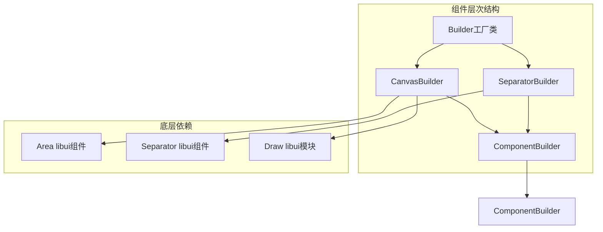
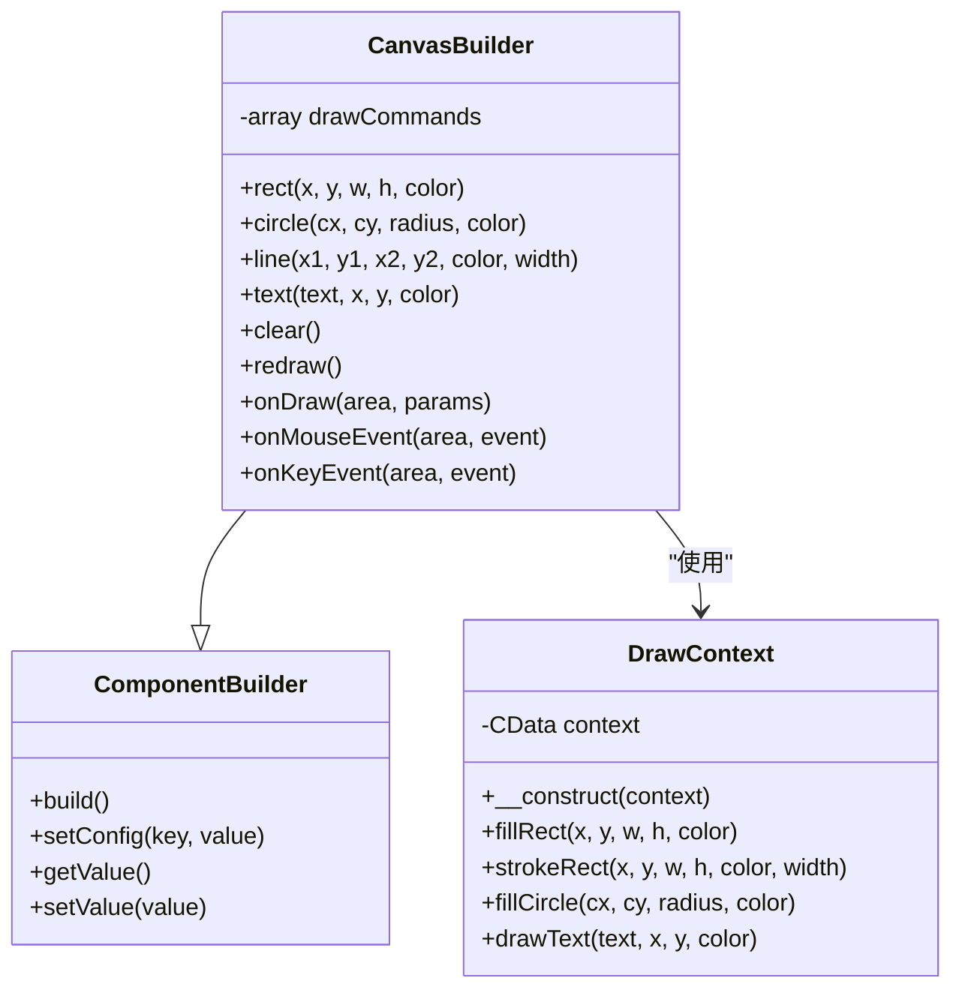
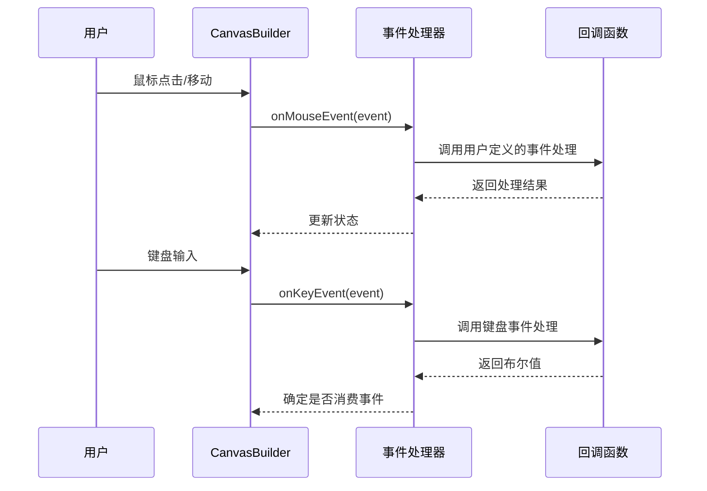
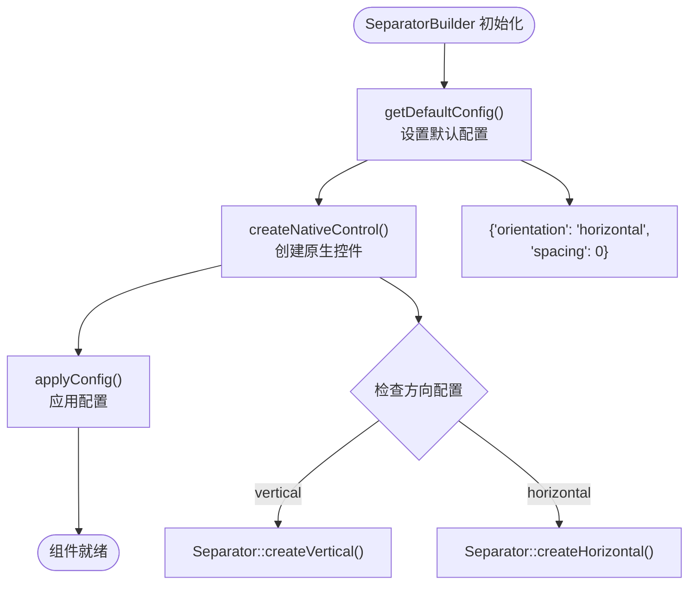
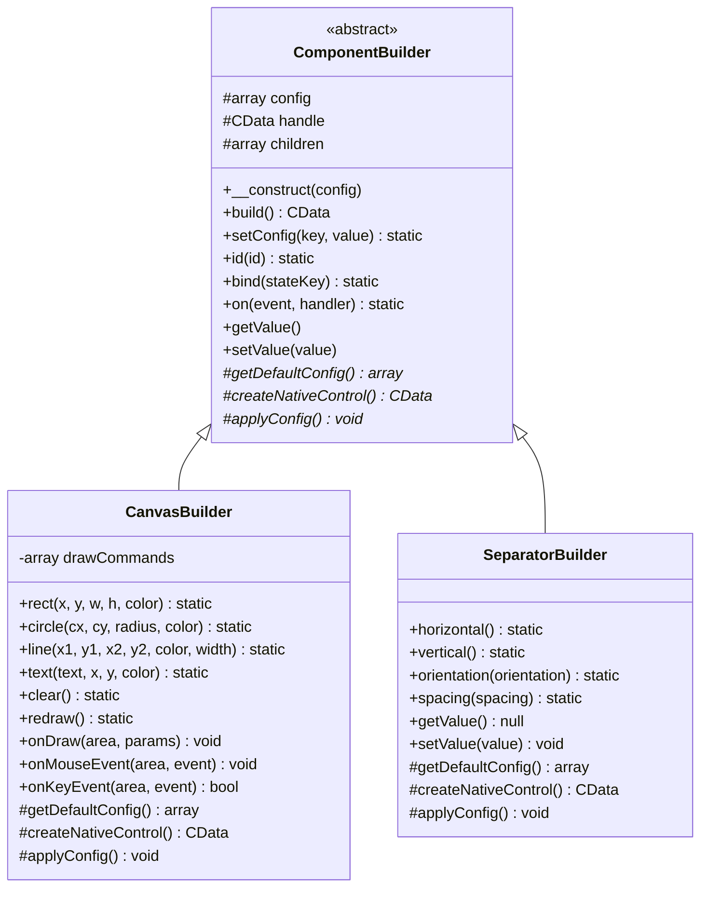
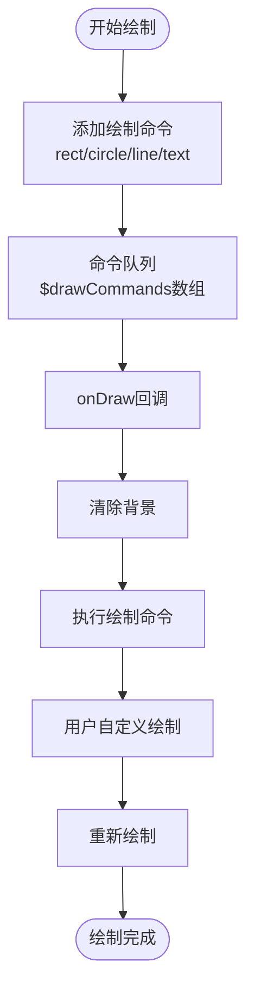
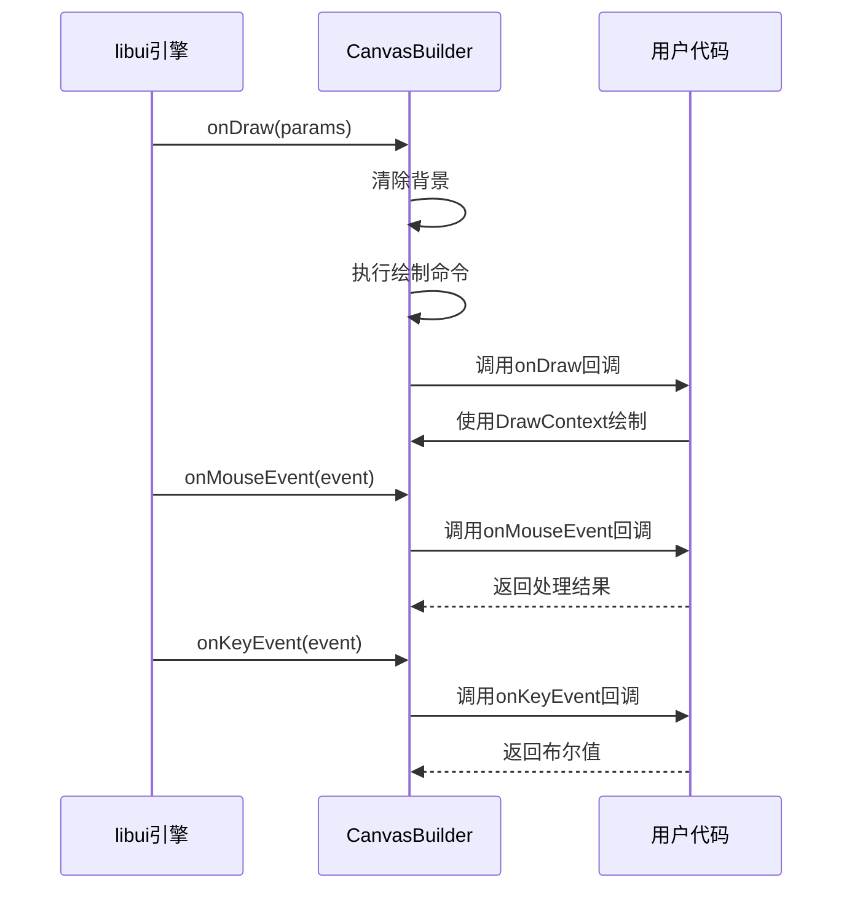
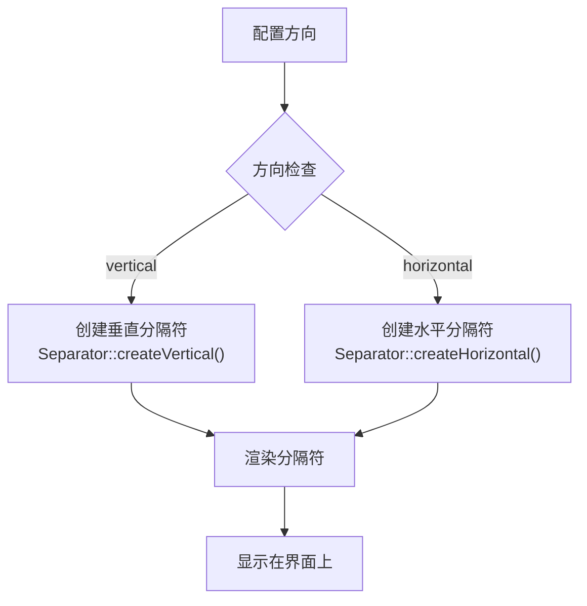
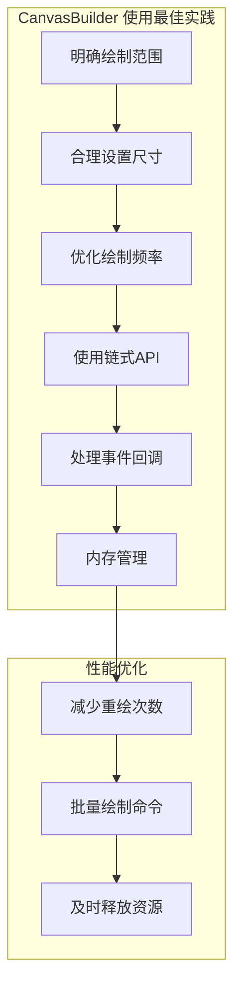
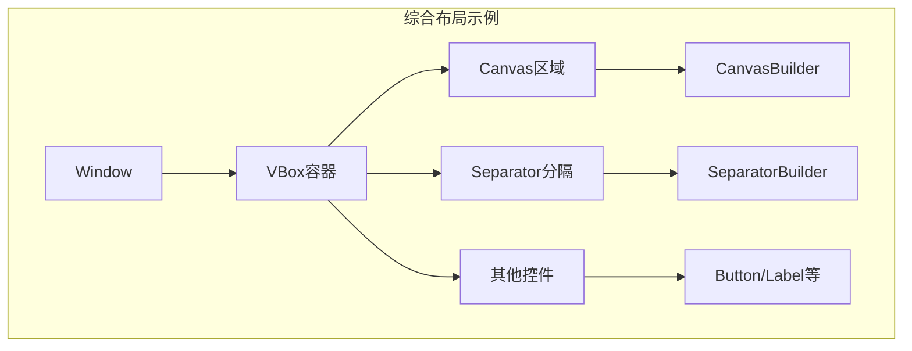

# CanvasBuilder 与 SeparatorBuilder 绘图与分隔控件

<cite>
**本文档中引用的文件**
- [CanvasBuilder.php](file://src/Components/CanvasBuilder.php)
- [SeparatorBuilder.php](file://src/Components/SeparatorBuilder.php)
- [DrawContext.php](file://src/Components/DrawContext.php)
- [ComponentBuilder.php](file://src/ComponentBuilder.php)
- [Builder.php](file://src/Builder.php)
- [simple.php](file://example/simple.php)
- [full.php](file://example/full.php)
</cite>

## 目录
1. [简介](#简介)
2. [项目结构概览](#项目结构概览)
3. [CanvasBuilder 核心特性](#canvasbuilder-核心特性)
4. [SeparatorBuilder 核心特性](#separatorbuilder-核心特性)
5. [架构设计分析](#架构设计分析)
6. [详细组件分析](#详细组件分析)
7. [使用场景与最佳实践](#使用场景与最佳实践)
8. [性能考虑](#性能考虑)
9. [故障排除指南](#故障排除指南)
10. [总结](#总结)

## 简介

CanvasBuilder 和 SeparatorBuilder 是 libuiBuilder 框架中的两个特色组件，分别代表了高级图形渲染能力和界面布局优化能力。CanvasBuilder 提供了一个强大的自定义绘图区域，支持复杂的图形绘制操作；而 SeparatorBuilder 则专注于界面布局中的视觉分隔，提供简洁高效的分隔线功能。

这两个组件都采用了框架的标准实现策略，在 `getDefaultConfig` 和 `createNativeControl` 方法中实现了简单直接的功能，避免了复杂的状态管理和事件处理逻辑，使其成为各自领域内的专业解决方案。

## 项目结构概览



**图表来源**
- [CanvasBuilder.php](file://src/Components/CanvasBuilder.php#L11-L181)
- [SeparatorBuilder.php](file://src/Components/SeparatorBuilder.php#L9-L65)
- [ComponentBuilder.php](file://src/ComponentBuilder.php#L11-L234)
- [Builder.php](file://src/Builder.php#L103-L122)

**章节来源**
- [CanvasBuilder.php](file://src/Components/CanvasBuilder.php#L1-L181)
- [SeparatorBuilder.php](file://src/Components/SeparatorBuilder.php#L1-L65)
- [Builder.php](file://src/Builder.php#L1-L153)

## CanvasBuilder 核心特性

### 自定义绘图区域的核心作用

CanvasBuilder 作为高级图形渲染的核心组件，提供了完整的自定义绘图能力。它继承自 ComponentBuilder，专门负责处理复杂的图形绘制需求，支持多种几何图形的绘制、颜色填充、路径操作等高级功能。

### DrawContext 绘图上下文封装

DrawContext 类是 CanvasBuilder 的重要组成部分，它封装了底层的绘图上下文，为开发者提供了更友好、更高层次的绘图 API。虽然当前实现中 DrawContext 的具体方法体尚未完全实现，但从设计模式可以看出其预期功能：



**图表来源**
- [DrawContext.php](file://src/Components/DrawContext.php#L7-L35)
- [CanvasBuilder.php](file://src/Components/CanvasBuilder.php#L11-L181)

### 支持的绘图操作

CanvasBuilder 支持以下核心绘图操作：

| 操作类型 | 方法名称 | 参数说明 | 功能描述 |
|---------|---------|---------|---------|
| 矩形填充 | `rect()` | x, y, w, h, color | 在指定位置绘制填充矩形 |
| 圆形填充 | `circle()` | cx, cy, radius, color | 在指定中心点绘制填充圆形 |
| 线条绘制 | `line()` | x1, y1, x2, y2, color, width | 绘制指定颜色和宽度的线条 |
| 文本绘制 | `text()` | text, x, y, color | 在指定位置绘制文本 |

### 事件处理机制

CanvasBuilder 提供了完整的事件处理机制，支持鼠标事件和键盘事件的响应：



**图表来源**
- [CanvasBuilder.php](file://src/Components/CanvasBuilder.php#L163-L176)

**章节来源**
- [CanvasBuilder.php](file://src/Components/CanvasBuilder.php#L1-L181)
- [DrawContext.php](file://src/Components/DrawContext.php#L1-L35)

## SeparatorBuilder 核心特性

### 界面布局中的视觉分隔功能

SeparatorBuilder 专注于界面布局中的视觉分隔功能，提供简洁高效的水平和垂直分隔线。它采用极简的设计理念，在 `getDefaultConfig` 和 `createNativeControl` 方法中实现了最简单的功能实现策略。

### 方向支持

SeparatorBuilder 支持两种基本的方向：

| 方向 | 配置值 | 对应方法 | 功能描述 |
|------|--------|---------|---------|
| 水平分隔 | 'horizontal' | `horizontal()` | 创建水平方向的分隔线 |
| 垂直分隔 | 'vertical' | `vertical()` | 创建垂直方向的分隔线 |

### 简单实现策略

SeparatorBuilder 的实现体现了框架的设计哲学：对于不需要复杂状态管理的功能，采用最简单的实现方式。这种策略的优势包括：



**图表来源**
- [SeparatorBuilder.php](file://src/Components/SeparatorBuilder.php#L11-L26)

### 接口一致性设计

尽管 SeparatorBuilder 不需要值管理功能，但它仍然保留了 `getValue()` 和 `setValue()` 方法，以保持与其他组件的接口一致性。这种设计确保了框架的整体性和开发体验的一致性。

**章节来源**
- [SeparatorBuilder.php](file://src/Components/SeparatorBuilder.php#L1-L65)

## 架构设计分析

### 组件继承体系



**图表来源**
- [ComponentBuilder.php](file://src/ComponentBuilder.php#L11-L234)
- [CanvasBuilder.php](file://src/Components/CanvasBuilder.php#L11-L181)
- [SeparatorBuilder.php](file://src/Components/SeparatorBuilder.php#L9-L65)

### 工厂模式集成

Builder 类作为工厂模式的实现，为 CanvasBuilder 和 SeparatorBuilder 提供了统一的创建接口：

```mermaid
graph LR
subgraph "Builder 工厂"
BC[Builder::canvas()]
BS[Builder::separator()]
BH[Builder::hSeparator()]
BV[Builder::vSeparator()]
end
subgraph "创建的组件"
CC[CanvasBuilder实例]
CS[SeparatorBuilder实例]
end
BC --> CC
BS --> CS
BH --> CS
BV --> CS
```

**图表来源**
- [Builder.php](file://src/Builder.php#L103-L122)

**章节来源**
- [ComponentBuilder.php](file://src/ComponentBuilder.php#L1-L234)
- [Builder.php](file://src/Builder.php#L1-L153)

## 详细组件分析

### CanvasBuilder 详细实现

#### 默认配置分析

CanvasBuilder 的默认配置包含了所有必要的绘图参数：

| 配置项 | 默认值 | 类型 | 说明 |
|--------|--------|------|------|
| width | 400 | int | 画布宽度 |
| height | 300 | int | 画布高度 |
| onDraw | null | callable | 自定义绘制回调 |
| onMouseEvent | null | callable | 鼠标事件回调 |
| onKeyEvent | null | callable | 键盘事件回调 |
| backgroundColor | [1.0, 1.0, 1.0, 1.0] | array | 背景颜色(RGBA) |

#### 绘制命令系统

CanvasBuilder 使用命令模式来管理绘制操作，每个绘制命令都被存储在 `$drawCommands` 数组中：



**图表来源**
- [CanvasBuilder.php](file://src/Components/CanvasBuilder.php#L13-L181)

#### 事件处理流程

CanvasBuilder 的事件处理遵循 libui 的标准回调模式：



**图表来源**
- [CanvasBuilder.php](file://src/Components/CanvasBuilder.php#L50-L181)

### SeparatorBuilder 详细实现

#### 配置管理

SeparatorBuilder 的配置极其简单，只包含两个关键参数：

| 配置项 | 默认值 | 类型 | 说明 |
|--------|--------|------|------|
| orientation | 'horizontal' | string | 分隔线方向 |
| spacing | 0 | int | 额外间距 |

#### 方向切换机制



**图表来源**
- [SeparatorBuilder.php](file://src/Components/SeparatorBuilder.php#L19-L26)

**章节来源**
- [CanvasBuilder.php](file://src/Components/CanvasBuilder.php#L15-L47)
- [SeparatorBuilder.php](file://src/Components/SeparatorBuilder.php#L11-L32)

## 使用场景与最佳实践

### CanvasBuilder 适用场景

CanvasBuilder 适用于以下高级图形渲染需求：

#### 图形可视化应用
- 数据图表绘制（柱状图、折线图、饼图等）
- 实时数据可视化
- 游戏开发中的自定义图形元素
- 图像处理工具

#### 自定义控件开发
- 专业的绘图软件界面
- 设计工具中的画布区域
- 教育软件中的交互式图形

#### 最佳实践建议



### SeparatorBuilder 适用场景

SeparatorBuilder 主要用于界面布局优化：

#### 界面组织
- 表单字段间的分隔
- 区域划分的视觉边界
- 导航菜单的分组
- 内容区域的逻辑分离

#### 布局优化策略

```mermaid
graph LR
subgraph "SeparatorBuilder 布局策略"
A[水平分隔] --> B[表单分组]
C[垂直分隔] --> D[侧边栏与主内容]
E[间距调整] --> F[视觉平衡]
end
subgraph "使用示例"
G[Builder::hSeparator()] --> H[水平分隔符]
I[Builder::vSeparator()] --> J[垂直分隔符]
end
B --> G
D --> I
F --> J
```

**图表来源**
- [full.php](file://example/full.php#L21-L22)
- [full.php](file://example/full.php#L74-L75)

### 两者的协作使用

在实际应用中，CanvasBuilder 和 SeparatorBuilder 经常配合使用：



**图表来源**
- [full.php](file://example/full.php#L18-L178)

**章节来源**
- [simple.php](file://example/simple.php#L15-L142)
- [full.php](file://example/full.php#L18-L178)

## 性能考虑

### CanvasBuilder 性能优化

#### 绘制命令缓存
- 使用命令队列避免重复绘制
- 合理安排绘制顺序减少状态切换
- 批量处理相似的绘制操作

#### 事件处理优化
- 及时清理不需要的事件监听器
- 避免在事件回调中进行耗时操作
- 使用防抖技术处理高频事件

#### 内存管理
- 及时释放不再使用的绘图资源
- 合理控制绘制命令的数量
- 避免内存泄漏导致的性能下降

### SeparatorBuilder 性能特点

SeparatorBuilder 由于其实现的简单性，具有以下性能优势：
- 最小的内存占用
- 快速的创建和销毁
- 最低的CPU开销
- 稳定的渲染性能

## 故障排除指南

### CanvasBuilder 常见问题

#### 绘制不显示
**可能原因：**
- 尺寸设置过小（width=0 或 height=0）
- 背景颜色与前景颜色相同
- 绘制命令被清空

**解决方案：**
- 检查配置中的 width 和 height
- 验证背景颜色设置
- 确认绘制命令正确添加

#### 事件处理失效
**可能原因：**
- 事件回调函数未正确设置
- 事件处理函数返回值错误
- 组件未正确注册到容器中

**解决方案：**
- 验证回调函数签名
- 检查事件处理逻辑
- 确认组件构建流程

### SeparatorBuilder 常见问题

#### 分隔线不显示
**可能原因：**
- 方向配置错误
- 父容器布局问题
- 样式设置冲突

**解决方案：**
- 验证 orientation 配置
- 检查父容器的布局属性
- 调整样式设置

#### 间距效果不明显
**可能原因：**
- spacing 参数设置不当
- 父容器的 padding 影响
- 布局算法限制

**解决方案：**
- 调整 spacing 参数值
- 检查父容器的内边距设置
- 使用其他布局方式进行测试

**章节来源**
- [CanvasBuilder.php](file://src/Components/CanvasBuilder.php#L40-L47)
- [SeparatorBuilder.php](file://src/Components/SeparatorBuilder.php#L28-L32)

## 总结

CanvasBuilder 和 SeparatorBuilder 代表了 libuiBuilder 框架在图形渲染和界面布局两个不同维度的专业化解决方案。

### CanvasBuilder 的价值
- 提供了完整的自定义绘图能力
- 支持复杂的图形操作和事件处理
- 通过 DrawContext 封装提升了开发体验
- 适用于各种高级图形应用需求

### SeparatorBuilder 的价值
- 简洁高效地解决界面分隔问题
- 采用极简实现策略，保证性能
- 提供水平和垂直方向的灵活支持
- 在界面布局中发挥重要作用

### 设计理念总结
两个组件都体现了框架的设计哲学：
- **单一职责原则**：CanvasBuilder 专注绘图，SeparatorBuilder 专注分隔
- **简单实现策略**：对于不需要复杂状态的功能采用最简实现
- **接口一致性**：保持与其他组件的统一接口
- **扩展性考虑**：为未来的功能扩展预留空间

通过合理使用这两个组件，开发者可以在保持代码简洁性的同时，构建出功能丰富、界面美观的应用程序。无论是需要复杂的图形渲染还是简单的界面分隔，libuiBuilder 都能提供相应的专业解决方案。