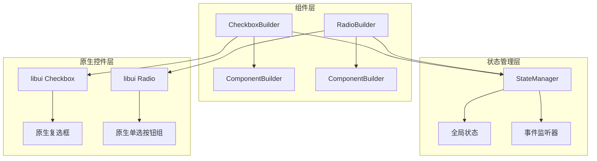
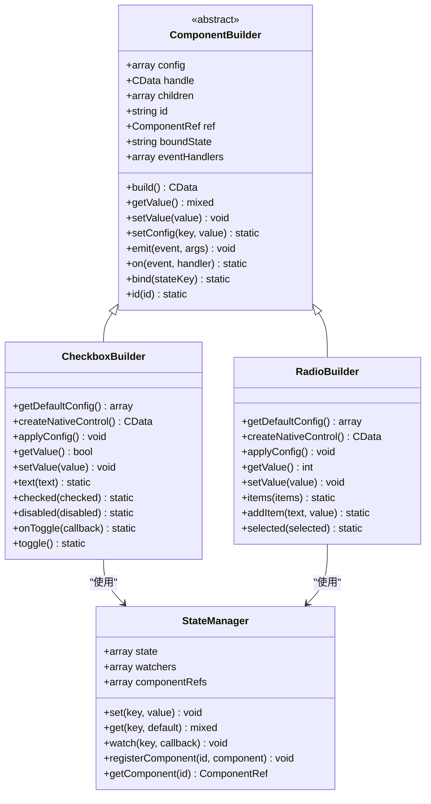
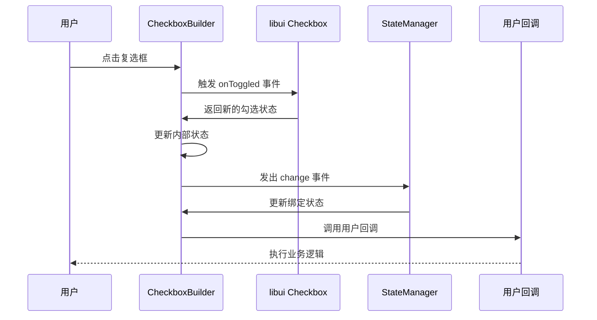
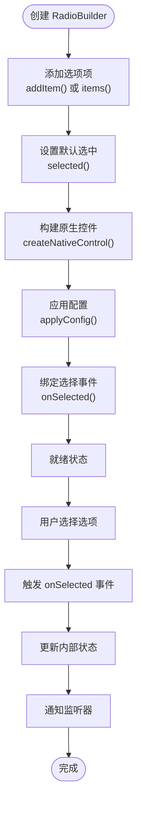
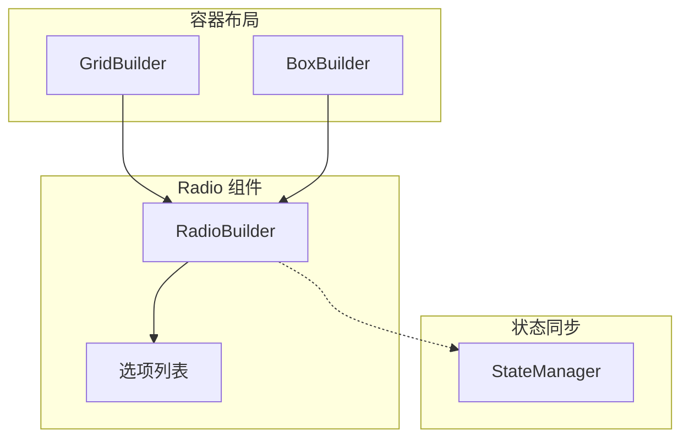
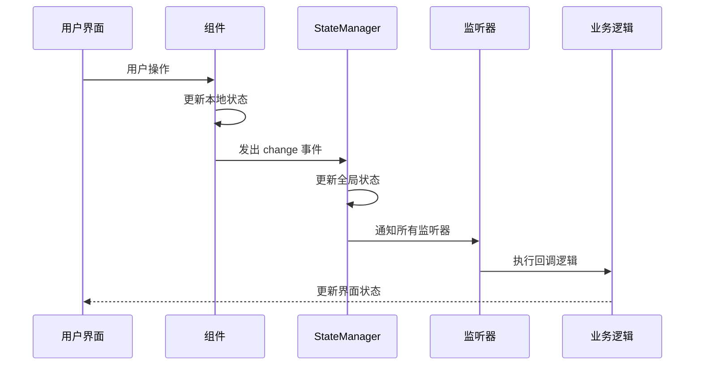
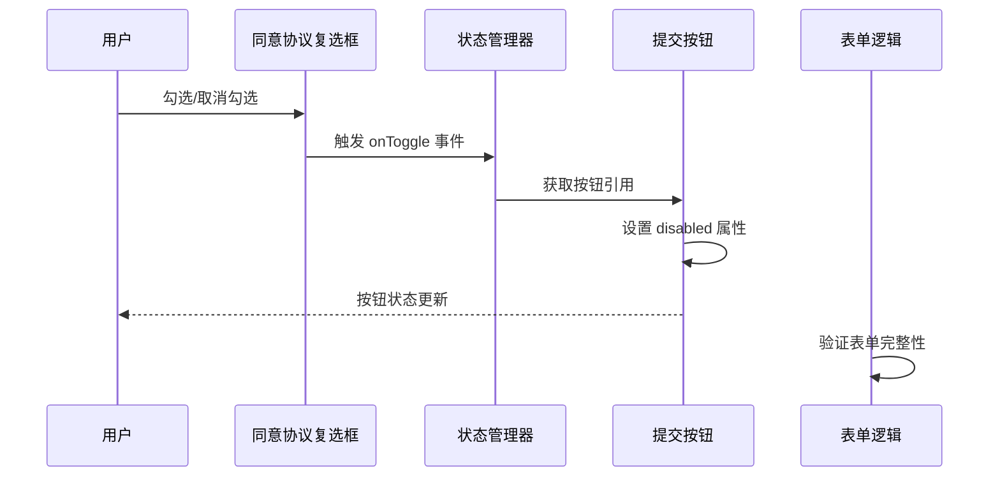

# CheckboxBuilder 与 RadioBuilder 选择控件

<cite>
**本文档中引用的文件**
- [CheckboxBuilder.php](file://src/Components/CheckboxBuilder.php)
- [RadioBuilder.php](file://src/Components/RadioBuilder.php)
- [ComponentBuilder.php](file://src/ComponentBuilder.php)
- [StateManager.php](file://src/State/StateManager.php)
- [simple.php](file://example/simple.php)
- [BoxBuilder.php](file://src/Components/BoxBuilder.php)
- [GridBuilder.php](file://src/Components/GridBuilder.php)
</cite>

## 目录
1. [简介](#简介)
2. [项目结构概览](#项目结构概览)
3. [核心组件分析](#核心组件分析)
4. [架构设计](#架构设计)
5. [详细组件分析](#详细组件分析)
6. [状态管理系统](#状态管理系统)
7. [实际应用场景](#实际应用场景)
8. [性能考虑](#性能考虑)
9. [故障排除指南](#故障排除指南)
10. [总结](#总结)

## 简介

CheckboxBuilder 和 RadioBuilder 是 libuiBuilder 框架中两个重要的选择控件组件，分别用于处理独立布尔状态选择和互斥选项组。这两个组件都基于 libui 原生控件构建，提供了统一的状态管理和事件处理机制，同时针对不同的使用场景进行了专门优化。

CheckboxBuilder 适用于需要独立控制的布尔状态，如"同意用户协议"、"订阅邮件通知"等场景；而 RadioBuilder 则专门用于实现互斥的选择组，确保同一时间只能有一个选项被选中。

## 项目结构概览

**图表来源**
- [CheckboxBuilder.php](file://src/Components/CheckboxBuilder.php#L1-L97)
- [RadioBuilder.php](file://src/Components/RadioBuilder.php#L1-L80)
- [ComponentBuilder.php](file://src/ComponentBuilder.php#L1-L234)
- [StateManager.php](file://src/State/StateManager.php#L1-L91)

**章节来源**
- [CheckboxBuilder.php](file://src/Components/CheckboxBuilder.php#L1-L97)
- [RadioBuilder.php](file://src/Components/RadioBuilder.php#L1-L80)
- [ComponentBuilder.php](file://src/ComponentBuilder.php#L1-L234)

## 核心组件分析

### CheckboxBuilder 功能特性

CheckboxBuilder 提供了以下核心功能：

| 特性 | 描述 | 默认值 | 配置方法 |
|------|------|--------|----------|
| 文本显示 | 复选框旁显示的文本标签 | '' | `text()` |
| 勾选状态 | 当前是否被勾选 | false | `checked()` |
| 禁用状态 | 控件是否可交互 | false | `disabled()` |
| 三态支持 | 是否支持中间状态（未定义） | false | 内部配置 |
| 事件回调 | 状态变化时的回调函数 | null | `onToggle()` |

### RadioBuilder 功能特性

RadioBuilder 专为互斥选项组设计：

| 特性 | 描述 | 默认值 | 配置方法 |
|------|------|--------|----------|
| 选项列表 | 包含的所有可选项目 | [] | `items()` 或 `addItem()` |
| 当前选中 | 当前选中的选项索引 | -1 | `selected()` |
| 事件回调 | 选项变化时的回调函数 | null | `onSelected()` |

**章节来源**
- [CheckboxBuilder.php](file://src/Components/CheckboxBuilder.php#L11-L20)
- [RadioBuilder.php](file://src/Components/RadioBuilder.php#L11-L18)

## 架构设计

**图表来源**
- [ComponentBuilder.php](file://src/ComponentBuilder.php#L11-L234)
- [CheckboxBuilder.php](file://src/Components/CheckboxBuilder.php#L9-L97)
- [RadioBuilder.php](file://src/Components/RadioBuilder.php#L9-L80)
- [StateManager.php](file://src/State/StateManager.php#L8-L91)

## 详细组件分析

### CheckboxBuilder 实现分析

CheckboxBuilder 继承自 ComponentBuilder，实现了独立布尔状态的选择功能。

#### 核心状态管理机制

**图表来源**
- [CheckboxBuilder.php](file://src/Components/CheckboxBuilder.php#L38-L49)
- [ComponentBuilder.php](file://src/ComponentBuilder.php#L160-L175)

#### 关键方法实现

CheckboxBuilder 提供了完整的链式配置接口：

- **状态控制方法**：`checked()`、`toggle()`、`getValue()`、`setValue()`
- **外观配置方法**：`text()`、`disabled()`
- **事件处理方法**：`onToggle()`、`onChange()`

**章节来源**
- [CheckboxBuilder.php](file://src/Components/CheckboxBuilder.php#L57-L96)

### RadioBuilder 实现分析

RadioBuilder 专门处理互斥选项组，需要配合容器组件使用以实现正确的布局和行为。

#### 选项组管理流程

**图表来源**
- [RadioBuilder.php](file://src/Components/RadioBuilder.php#L25-L49)

#### 与容器组件的协作

RadioBuilder 本身不直接管理布局，需要配合容器组件使用：

**图表来源**
- [GridBuilder.php](file://src/Components/GridBuilder.php#L1-L120)
- [BoxBuilder.php](file://src/Components/BoxBuilder.php#L1-L64)

**章节来源**
- [RadioBuilder.php](file://src/Components/RadioBuilder.php#L50-L80)

## 状态管理系统

### StateManager 核心机制

StateManager 提供了全局状态管理和事件通知机制，是连接前端界面和后端业务逻辑的桥梁。

#### 状态管理流程

**图表来源**
- [StateManager.php](file://src/State/StateManager.php#L25-L36)
- [ComponentBuilder.php](file://src/ComponentBuilder.php#L171-L175)

#### 状态绑定机制

组件可以通过 `bind()` 方法与状态管理器绑定，实现响应式更新：

| 绑定类型 | 描述 | 使用场景 |
|----------|------|----------|
| 单向绑定 | 组件值变化时更新状态 | 输入控件 |
| 双向绑定 | 状态变化时更新组件 | 复选框、单选按钮 |
| 事件监听 | 监听特定状态变化 | 表单验证、条件渲染 |

**章节来源**
- [StateManager.php](file://src/State/StateManager.php#L1-L91)
- [ComponentBuilder.php](file://src/ComponentBuilder.php#L133-L146)

## 实际应用场景

### 简单表单验证案例

在 `example/simple.php` 中展示了 CheckboxBuilder 在表单逻辑控制中的典型应用：

#### 同意用户协议控制提交按钮

**图表来源**
- [simple.php](file://example/simple.php#L72-L82)

#### 关键实现细节

1. **事件监听**：通过 `onToggle()` 监听复选框状态变化
2. **组件引用**：使用 `StateManager::instance()->getComponent()` 获取其他组件
3. **动态控制**：根据协议同意状态动态启用/禁用提交按钮
4. **状态同步**：确保界面状态与业务逻辑保持一致

**章节来源**
- [simple.php](file://example/simple.php#L72-L82)

### RadioBuilder 在选项组中的应用

虽然示例中没有直接展示 RadioBuilder 的完整用法，但根据其设计原理，它通常用于：

1. **性别选择**：男/女/其他
2. **偏好设置**：主题模式、语言选择
3. **产品规格**：尺寸、颜色等选项
4. **问卷调查**：单选题答案

#### 底层 libui 映射关系

RadioBuilder 在底层映射到 libui 的单选按钮组：

| CheckboxBuilder | RadioBuilder | libui 对应 |
|-----------------|--------------|------------|
| 独立状态 | 互斥组 | Checkbox/RadioGroup |
| 任意数量 | 固定组 | 单独控件/容器 |
| 事件分离 | 统一事件 | onToggled/onSelected |

## 性能考虑

### 状态更新优化

1. **批量更新**：使用 `StateManager::update()` 进行批量状态更新
2. **事件防抖**：避免频繁的状态变化导致的性能问题
3. **内存管理**：及时清理不再使用的组件引用

### 渲染性能

1. **延迟加载**：仅在需要时创建原生控件
2. **事件节流**：限制高频事件的处理频率
3. **状态缓存**：缓存计算结果避免重复计算

## 故障排除指南

### 常见问题及解决方案

#### CheckboxBuilder 问题

| 问题 | 可能原因 | 解决方案 |
|------|----------|----------|
| 状态不更新 | 未正确绑定事件 | 检查 `onToggle()` 回调 |
| 初始状态错误 | 配置顺序问题 | 确保在 `build()` 之前设置状态 |
| 无法点击 | 被禁用状态 | 检查 `disabled()` 配置 |

#### RadioBuilder 问题

| 问题 | 可能原因 | 解决方案 |
|------|----------|----------|
| 选项不显示 | 未添加选项 | 使用 `addItem()` 或 `items()` |
| 无法选择 | 缺少容器 | 需要配合 BoxBuilder 或 GridBuilder |
| 状态不同步 | 事件处理错误 | 检查 `onSelected()` 回调 |

**章节来源**
- [CheckboxBuilder.php](file://src/Components/CheckboxBuilder.php#L38-L49)
- [RadioBuilder.php](file://src/Components/RadioBuilder.php#L28-L49)

## 总结

CheckboxBuilder 和 RadioBuilder 分别针对独立布尔状态选择和互斥选项组提供了完整的解决方案。它们共同的特点包括：

1. **统一的状态管理**：基于 StateManager 的全局状态同步
2. **灵活的事件处理**：支持多种事件回调机制
3. **响应式设计**：自动响应状态变化
4. **链式配置**：提供流畅的开发体验

CheckboxBuilder 适用于需要独立控制的场景，如表单验证、开关控制等；RadioBuilder 则专门用于实现互斥的选择组，需要配合容器组件使用以实现正确的布局和行为。

通过合理使用这两个组件，开发者可以构建出功能丰富、用户体验良好的桌面应用程序界面。