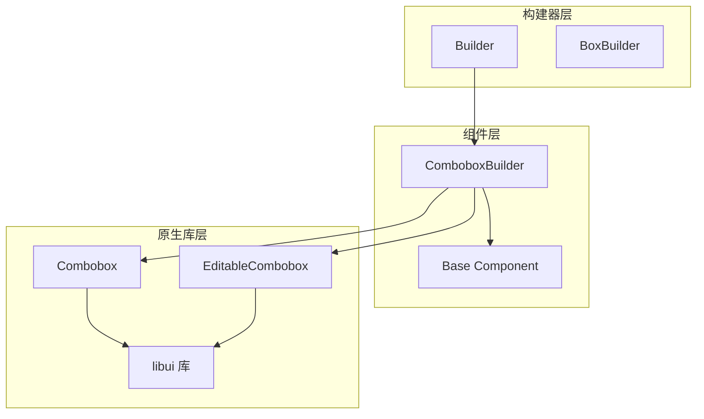
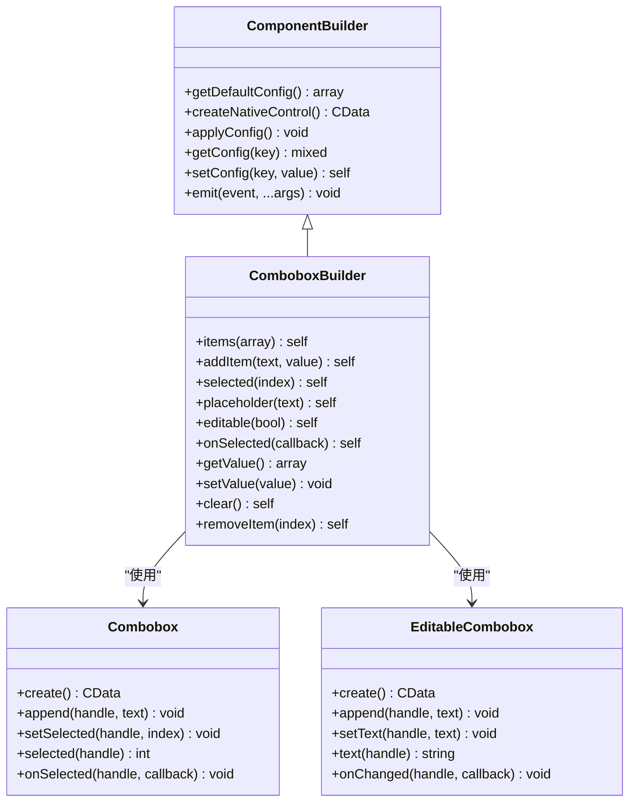
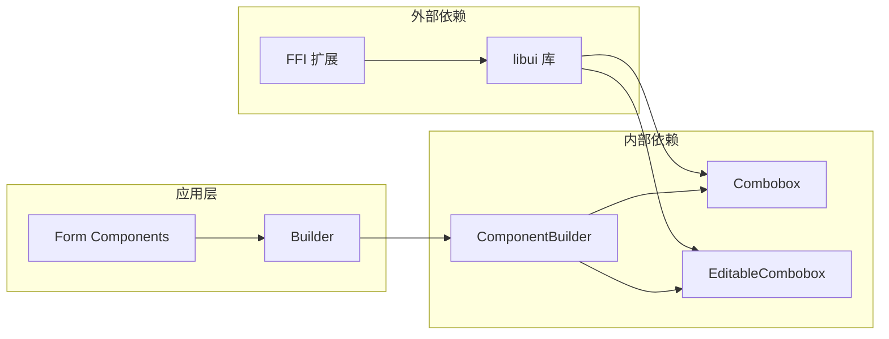

# ComboboxBuilder 下拉选择控件

<cite>
**本文档中引用的文件**
- [ComboboxBuilder.php](file://src/Components/ComboboxBuilder.php)
- [full.php](file://example/full.php)
- [simple.php](file://example/simple.php)
- [Builder.php](file://src/Builder.php)
</cite>

## 目录
1. [简介](#简介)
2. [项目结构](#项目结构)
3. [核心组件](#核心组件)
4. [架构概览](#架构概览)
5. [详细组件分析](#详细组件分析)
6. [依赖关系分析](#依赖关系分析)
7. [性能考虑](#性能考虑)
8. [故障排除指南](#故障排除指南)
9. [结论](#结论)

## 简介

ComboboxBuilder 是 libuiBuilder 框架中的一个强大下拉选择控件构建器，提供了灵活的数据源配置、事件处理和状态管理功能。该控件支持两种模式：标准下拉框（Combobox）和可编辑下拉框（EditableCombobox），能够满足不同场景下的表单输入需求。

ComboboxBuilder 基于 libui 库的原生控件，通过 PHP 封装提供了链式调用接口，支持动态配置选项列表、默认选中项设置、事件回调绑定等功能。它在表单系统中扮演着重要的角色，特别是在需要提供预定义选项但又允许用户自定义输入的场景中。

## 项目结构

ComboboxBuilder 在项目中的组织结构清晰明确，位于专门的组件目录中：



**图表来源**
- [ComboboxBuilder.php](file://src/Components/ComboboxBuilder.php#L1-L258)
- [Builder.php](file://src/Builder.php#L80-L91)

**章节来源**
- [ComboboxBuilder.php](file://src/Components/ComboboxBuilder.php#L1-L258)
- [Builder.php](file://src/Builder.php#L1-L153)

## 核心组件

ComboboxBuilder 的核心功能围绕以下几个关键组件展开：

### 默认配置管理
ComboboxBuilder 提供了一套完整的默认配置机制，包括：
- `items`: 选项列表，默认为空数组
- `selected`: 默认选中索引，默认为 -1（无选中）
- `placeholder`: 占位符文本，默认为"请选择..."
- `editable`: 是否为可编辑模式，默认为 false
- `onSelected`: 选择事件回调
- `onChange`: 变更事件回调

### 原生控件创建
根据配置的 `editable` 属性，ComboboxBuilder 会创建不同的原生控件实例：
- 标准下拉框：使用 `Combobox::create()`
- 可编辑下拉框：使用 `EditableCombobox::create()`

### 事件处理机制
控件实现了完善的事件处理系统，支持：
- 选择事件（onSelected）
- 变更事件（onChange）
- 自定义回调函数

**章节来源**
- [ComboboxBuilder.php](file://src/Components/ComboboxBuilder.php#L12-L22)
- [ComboboxBuilder.php](file://src/Components/ComboboxBuilder.php#L24-L28)

## 架构概览

ComboboxBuilder 采用分层架构设计，确保了良好的可维护性和扩展性：



**图表来源**
- [ComboboxBuilder.php](file://src/Components/ComboboxBuilder.php#L10-L258)
- [ComboboxBuilder.php](file://src/Components/ComboboxBuilder.php#L5-L8)

## 详细组件分析

### 数据源配置（Items）

ComboboxBuilder 支持灵活的数据源配置方式，能够处理多种格式的选项数据：

#### 基本选项格式
```php
// 简单字符串数组
->items(['选项1', '选项2', '选项3'])

// 键值对格式
->items([
    ['text' => '北京', 'value' => 'beijing'],
    ['text' => '上海', 'value' => 'shanghai'],
    ['text' => '广州', 'value' => 'guangzhou']
])

// 混合格式
->items(['请选择...', ['text' => '男', 'value' => 'male'], ['text' => '女', 'value' => 'female']])
```

#### 动态添加选项
```php
// 添加单个选项
->addItem('新选项', 'new_value')

// 链式添加多个选项
->addItem('选项A')->addItem('选项B')->addItem('选项C')
```

### 默认选中项设置（Selected）

ComboboxBuilder 提供了多种方式来设置默认选中项：

#### 索引方式
```php
// 按索引设置
->selected(0)  // 设置第一个选项为默认选中
->selected(2)  // 设置第三个选项为默认选中
```

#### 动态更新
选中状态可以在控件创建后动态更新，UI 会实时反映变化。

### 事件处理机制

#### 选择事件（onSelected）
当用户从下拉列表中选择一个选项时触发：
```php
->onSelected(function($index, $item, $component) {
    // $index: 选中项的索引
    // $item: 选中项的数据
    // $component: 当前 ComboboxBuilder 实例
})
```

#### 变更事件（onChange）
适用于可编辑模式，当用户输入或选择发生变化时触发：
```php
->onChange(function($index, $item, $component) {
    // 处理变更逻辑
})
```

### 可编辑版本（EditableCombobox）

ComboboxBuilder 支持可编辑模式，通过 `editable()` 方法启用：

#### 创建可编辑组合框
```php
// 使用 Builder 工厂方法
Builder::editableCombobox()
    ->items(['读书', '运动', '音乐'])
    ->placeholder('选择或输入您的爱好')

// 或直接使用 ComboboxBuilder
(new ComboboxBuilder())->editable(true)
    ->items(['选项1', '选项2'])
```

#### 编辑器模式特性
- 用户可以选择预定义选项
- 用户可以输入自定义文本
- 文本匹配算法自动同步选中状态
- 支持模糊匹配和部分匹配

### 值获取与设置

#### getValue() 方法
返回当前选中的值，格式因模式而异：
```php
// 标准模式
$value = $combobox->getValue();
// 返回: ['index' => 1, 'item' => '上海', 'value' => 'shanghai']

// 可编辑模式  
$value = $combobox->getValue();
// 返回: ['index' => 2, 'text' => '自定义选项', 'item' => '自定义选项', 'value' => '自定义选项']
```

#### setValue() 方法
支持多种设置方式：
```php
// 按索引设置
$combobox->setValue(1);

// 按值设置（精确匹配）
$combobox->setValue('shanghai');

// 按文本设置（模糊匹配）
$combobox->setValue('上海');
```

**章节来源**
- [ComboboxBuilder.php](file://src/Components/ComboboxBuilder.php#L188-L257)
- [Builder.php](file://src/Builder.php#L88-L90)

## 依赖关系分析

ComboboxBuilder 的依赖关系体现了清晰的分层架构：



**图表来源**
- [ComboboxBuilder.php](file://src/Components/ComboboxBuilder.php#L5-L8)
- [Builder.php](file://src/Builder.php#L1-L153)

### 核心依赖说明

1. **FFI 扩展**: 用于与 libui 原生库进行交互
2. **libui 库**: 提供底层 GUI 控件功能
3. **ComponentBuilder**: 基础组件构建器框架
4. **Combobox/EditableCombobox**: 原生控件封装类

**章节来源**
- [ComboboxBuilder.php](file://src/Components/ComboboxBuilder.php#L5-L8)

## 性能考虑

### 内存管理
- 使用 FFI 进行原生控件操作，避免 PHP 层的内存泄漏
- 及时释放不再使用的控件资源
- 合理使用事件回调，避免循环引用

### 渲染优化
- 延迟加载选项内容，仅在需要时创建原生控件
- 批量更新选项列表，减少不必要的 UI 刷新
- 智能缓存计算结果，避免重复处理相同数据

### 事件处理优化
- 使用弱引用避免事件回调导致的内存泄漏
- 实现事件节流机制，防止高频事件影响性能
- 异步处理复杂计算任务，保持 UI 响应性

## 故障排除指南

### 常见问题及解决方案

#### 1. 选项不显示
**症状**: 设置了选项但下拉列表为空
**原因**: 选项格式不正确或编码问题
**解决**: 确保选项为字符串数组或正确的键值对格式

#### 2. 默认选中无效
**症状**: 设置默认选中项但没有生效
**原因**: 选中索引超出选项范围或类型错误
**解决**: 检查索引值是否在有效范围内

#### 3. 事件回调不触发
**症状**: 设置了事件回调但没有响应
**原因**: 回调函数格式错误或控件未正确初始化
**解决**: 验证回调函数签名和控件生命周期

#### 4. 可编辑模式异常
**症状**: 可编辑组合框行为异常
**原因**: 文本匹配算法冲突或状态同步问题
**解决**: 检查文本唯一性，确保状态一致性

### 调试技巧
- 使用 `var_dump()` 输出控件状态
- 检查事件回调参数的正确性
- 验证选项数据的完整性和格式
- 监控内存使用情况

**章节来源**
- [ComboboxBuilder.php](file://src/Components/ComboboxBuilder.php#L110-L145)
- [ComboboxBuilder.php](file://src/Components/ComboboxBuilder.php#L148-L185)

## 结论

ComboboxBuilder 是一个功能完善、设计精良的下拉选择控件构建器，它成功地将复杂的原生 GUI 功能封装为简洁易用的 PHP 接口。通过支持标准和可编辑两种模式，它能够满足各种表单输入场景的需求。

### 主要优势
1. **灵活性**: 支持多种数据源格式和配置方式
2. **易用性**: 提供链式调用接口，简化开发流程
3. **扩展性**: 完善的事件系统支持复杂业务逻辑
4. **兼容性**: 与现有 libuiBuilder 生态系统无缝集成

### 最佳实践建议
1. 合理选择控件模式（标准 vs 可编辑）
2. 优化选项数据结构，提高匹配效率
3. 正确处理事件回调，避免内存泄漏
4. 在大型应用中考虑性能优化策略

ComboboxBuilder 为开发者提供了一个强大而灵活的工具，使得在 PHP 应用中创建高质量的桌面应用程序成为可能。随着项目的不断发展，它将继续为用户提供更好的体验和更多的功能支持。