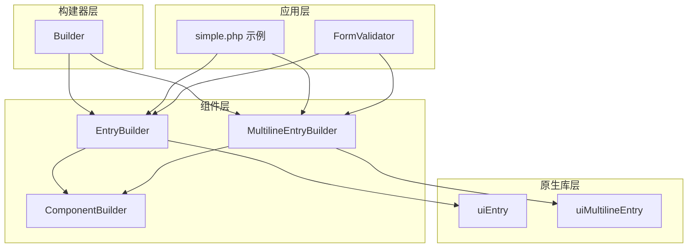
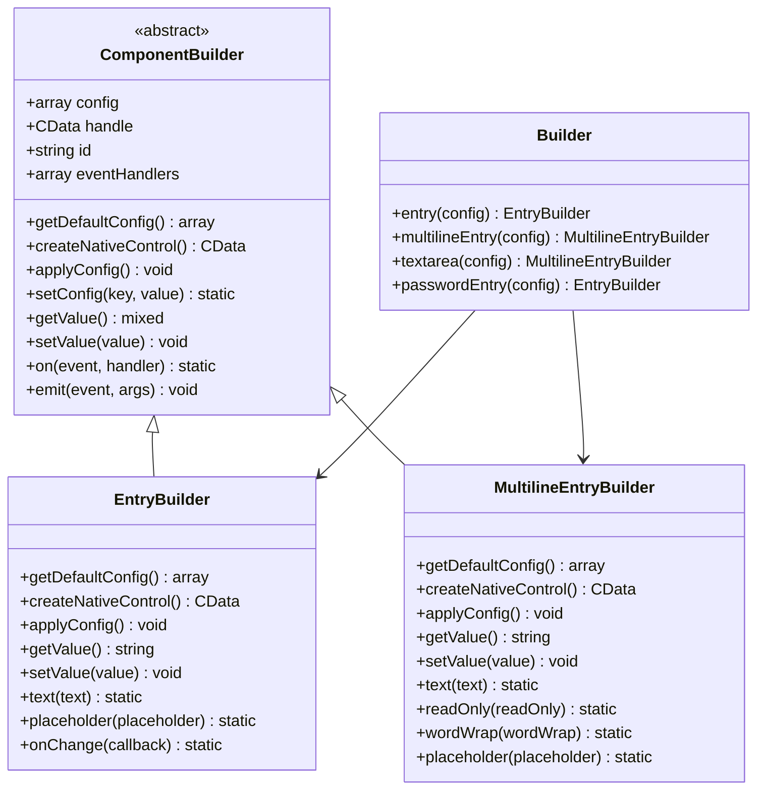
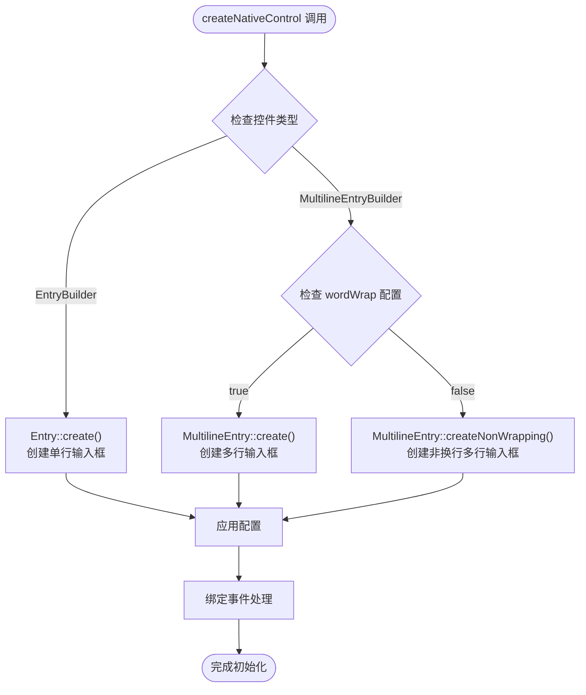
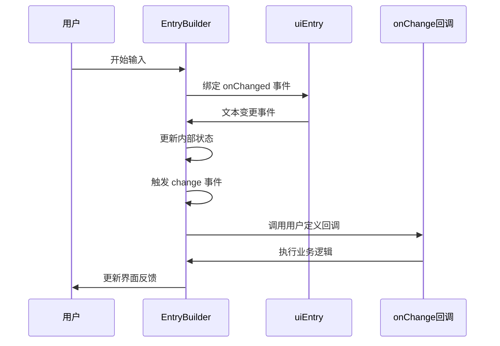
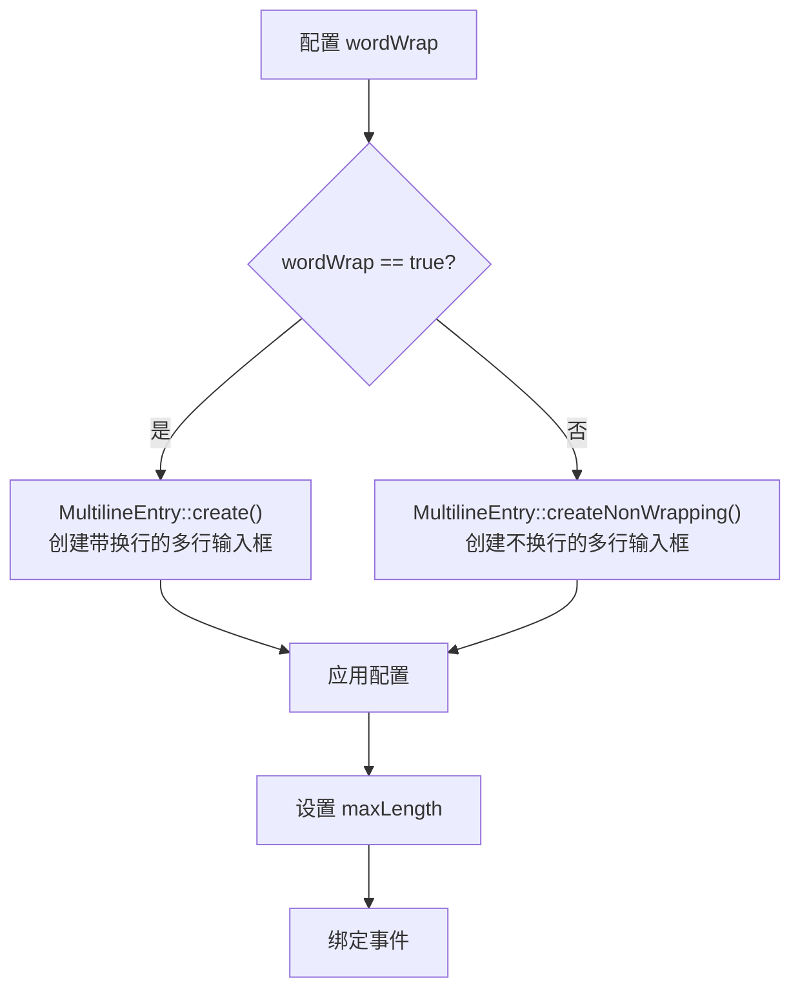
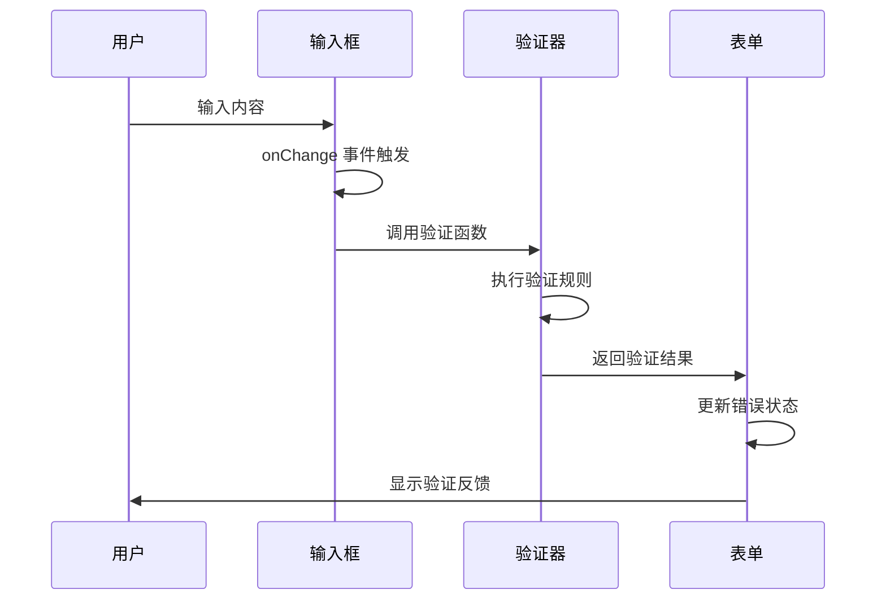
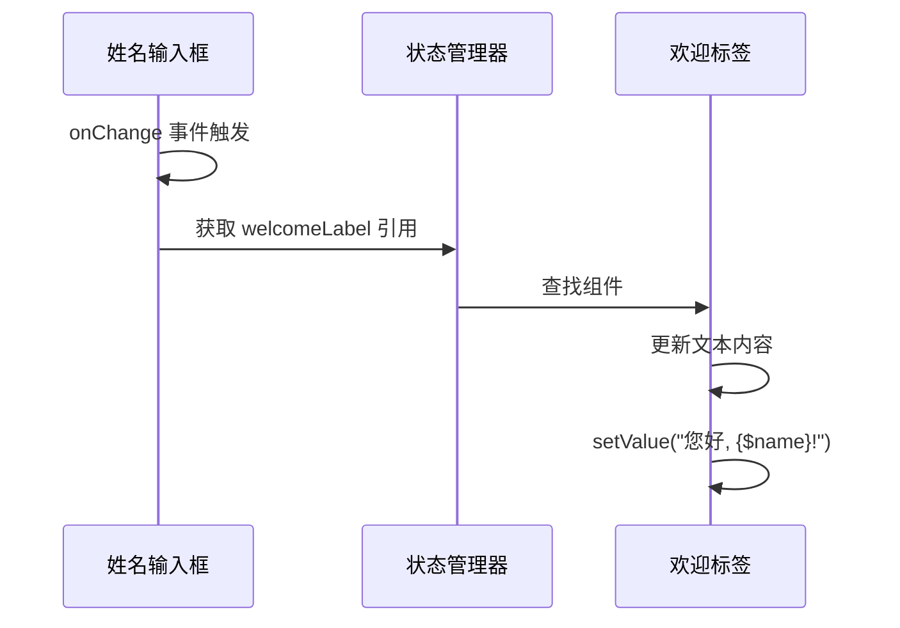
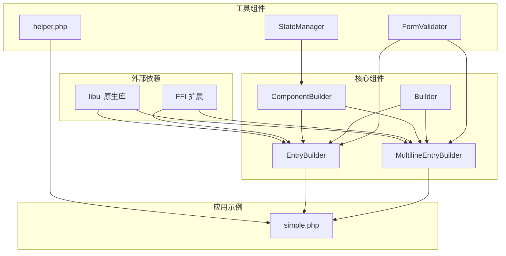

# EntryBuilder 输入框控件

<cite>
**本文档中引用的文件**
- [EntryBuilder.php](file://src/Components/EntryBuilder.php)
- [MultilineEntryBuilder.php](file://src/Components/MultilineEntryBuilder.php)
- [Builder.php](file://src/Builder.php)
- [simple.php](file://example/simple.php)
- [FormValidator.php](file://src/Validation/FormValidator.php)
- [ComponentBuilder.php](file://src/ComponentBuilder.php)
- [helper.php](file://src/helper.php)
</cite>

## 目录
1. [简介](#简介)
2. [项目结构](#项目结构)
3. [核心组件](#核心组件)
4. [架构概览](#架构概览)
5. [详细组件分析](#详细组件分析)
6. [依赖关系分析](#依赖关系分析)
7. [性能考虑](#性能考虑)
8. [故障排除指南](#故障排除指南)
9. [结论](#结论)

## 简介

EntryBuilder 和 MultilineEntryBuilder 是 libuiBuilder 框架中的两个重要输入框控件构建器，分别对应单行和多行文本输入场景。这两个组件都继承自 ComponentBuilder 基类，提供了统一的接口来创建和管理原生 UI 输入控件。

EntryBuilder 使用 `uiEntry` 原生控件，适用于简单的单行文本输入场景；而 MultilineEntryBuilder 使用 `uiMultilineEntry` 原生控件，支持多行文本输入和更丰富的配置选项。两者都提供了完整的表单验证机制、事件处理和数据绑定功能。

## 项目结构



**图表来源**
- [Builder.php](file://src/Builder.php#L67-L132)
- [EntryBuilder.php](file://src/Components/EntryBuilder.php#L9-L79)
- [MultilineEntryBuilder.php](file://src/Components/MultilineEntryBuilder.php#L9-L85)

**章节来源**
- [Builder.php](file://src/Builder.php#L1-L153)
- [EntryBuilder.php](file://src/Components/EntryBuilder.php#L1-L80)
- [MultilineEntryBuilder.php](file://src/Components/MultilineEntryBuilder.php#L1-L86)

## 核心组件

### EntryBuilder 单行输入框

EntryBuilder 提供了基础的单行文本输入功能，主要特性包括：

- **原生控件**: 使用 `uiEntry` 创建单行输入框
- **配置选项**: 支持文本、占位符、只读模式和变更回调
- **事件处理**: 自动绑定 `onChanged` 事件，实时响应用户输入
- **数据绑定**: 支持双向数据绑定和状态管理

### MultilineEntryBuilder 多行输入框

MultilineEntryBuilder 提供了增强的多行文本输入功能：

- **原生控件**: 使用 `uiMultilineEntry` 创建多行输入框
- **高级配置**: 支持换行控制、最大长度限制和占位符
- **灵活布局**: 可配置是否启用自动换行
- **扩展功能**: 提供更多的样式和行为控制选项

**章节来源**
- [EntryBuilder.php](file://src/Components/EntryBuilder.php#L11-L18)
- [MultilineEntryBuilder.php](file://src/Components/MultilineEntryBuilder.php#L11-L19)

## 架构概览



**图表来源**
- [ComponentBuilder.php](file://src/ComponentBuilder.php#L11-L234)
- [EntryBuilder.php](file://src/Components/EntryBuilder.php#L9-L79)
- [MultilineEntryBuilder.php](file://src/Components/MultilineEntryBuilder.php#L9-L85)
- [Builder.php](file://src/Builder.php#L67-L132)

## 详细组件分析

### EntryBuilder 实现分析

#### 原生控件创建差异

EntryBuilder 和 MultilineEntryBuilder 在 `createNativeControl` 方法中的实现体现了它们各自的特点：



**图表来源**
- [EntryBuilder.php](file://src/Components/EntryBuilder.php#L21-L24)
- [MultilineEntryBuilder.php](file://src/Components/MultilineEntryBuilder.php#L23-L28)

#### 关键配置项作用机制

| 配置项 | 类型 | 默认值 | 作用机制 |
|--------|------|--------|----------|
| `text` | string | '' | 设置输入框初始文本内容 |
| `placeholder` | string | '' | 显示占位提示文本，当输入为空时可见 |
| `readOnly` | bool | false | 设置只读模式，用户无法编辑内容 |
| `onChange` | callable | null | 用户输入变更时触发的回调函数 |

#### 事件处理流程



**图表来源**
- [EntryBuilder.php](file://src/Components/EntryBuilder.php#L38-L50)
- [ComponentBuilder.php](file://src/ComponentBuilder.php#L161-L174)

**章节来源**
- [EntryBuilder.php](file://src/Components/EntryBuilder.php#L21-L50)
- [ComponentBuilder.php](file://src/ComponentBuilder.php#L161-L174)

### MultilineEntryBuilder 实现分析

#### 高级配置选项

MultilineEntryBuilder 提供了比 EntryBuilder 更丰富的配置选项：

| 配置项 | 类型 | 默认值 | 特殊说明 |
|--------|------|--------|----------|
| `text` | string | '' | 多行文本内容 |
| `readOnly` | bool | false | 只读模式 |
| `wordWrap` | bool | true | 是否启用自动换行 |
| `maxLength` | int/null | null | 最大字符数限制 |
| `placeholder` | string | '' | 占位提示文本 |
| `onChange` | callable | null | 变更回调 |

#### 换行控制机制



**图表来源**
- [MultilineEntryBuilder.php](file://src/Components/MultilineEntryBuilder.php#L23-L28)

**章节来源**
- [MultilineEntryBuilder.php](file://src/Components/MultilineEntryBuilder.php#L11-L51)

### validation 函数机制

虽然 EntryBuilder 和 MultilineEntryBuilder 本身没有直接提供 `validation` 方法，但框架通过以下方式支持表单验证：

#### 运行时验证流程



**图表来源**
- [simple.php](file://example/simple.php#L28-L29)
- [FormValidator.php](file://src/Validation/FormValidator.php#L14-L27)

#### 验证规则实现

基于示例代码，验证函数通常采用以下模式：

```mermaid
flowchart TD
Input[用户输入] --> Trim[trim() 处理]
Trim --> CheckEmpty{是否为空?}
CheckEmpty --> |是| ReturnFalse[返回 false]
CheckEmpty --> |否| ReturnTrue[返回 true]
ReturnFalse --> ErrorMsg[显示错误信息]
ReturnTrue --> Success[验证通过]
```

**图表来源**
- [simple.php](file://example/simple.php#L28-L29)

**章节来源**
- [simple.php](file://example/simple.php#L28-L29)
- [FormValidator.php](file://src/Validation/FormValidator.php#L36-L62)

### 数据联动机制

以示例中的姓名输入框为例，展示了 onChange 回调如何实现与其他组件的数据联动：



**图表来源**
- [simple.php](file://example/simple.php#L30-L35)

**章节来源**
- [simple.php](file://example/simple.php#L30-L35)

### 便捷方法封装

#### passwordEntry() 方法

Builder 类提供了 `passwordEntry()` 方法，专门用于创建密码输入框：

```mermaid
flowchart TD
Call[Builder::passwordEntry()] --> CreateEntry[创建 EntryBuilder]
CreateEntry --> MergeConfig[合并配置数组]
MergeConfig --> SetPassword[设置 password => true]
SetPassword --> Return[返回 EntryBuilder 实例]
```

**图表来源**
- [Builder.php](file://src/Builder.php#L82-L85)

#### textarea() 方法

`textarea()` 方法实际上是 `multilineEntry()` 的别名，提供更直观的语义：

```mermaid
flowchart TD
Call[Builder::textarea()] --> CreateMultiline[创建 MultilineEntryBuilder]
CreateMultiline --> Return[返回实例]
```

**图表来源**
- [Builder.php](file://src/Builder.php#L129-L132)

**章节来源**
- [Builder.php](file://src/Builder.php#L82-L132)

## 依赖关系分析



**图表来源**
- [EntryBuilder.php](file://src/Components/EntryBuilder.php#L5-L7)
- [MultilineEntryBuilder.php](file://src/Components/MultilineEntryBuilder.php#L5-L7)
- [ComponentBuilder.php](file://src/ComponentBuilder.php#L7-L9)

**章节来源**
- [EntryBuilder.php](file://src/Components/EntryBuilder.php#L1-L80)
- [MultilineEntryBuilder.php](file://src/Components/MultilineEntryBuilder.php#L1-L86)
- [Builder.php](file://src/Builder.php#L1-L153)

## 性能考虑

### 内存管理

- **原生控件生命周期**: 通过 `build()` 方法统一管理原生控件的创建和销毁
- **事件处理器**: 使用弱引用避免循环引用导致的内存泄漏
- **状态缓存**: 本地缓存配置状态，减少不必要的原生调用

### 事件处理优化

- **防抖机制**: onChange 事件采用即时响应模式，适合实时交互场景
- **批量更新**: 支持链式调用，减少重复的配置操作
- **延迟初始化**: 原生控件仅在首次需要时创建

### 验证性能

- **短路求值**: FormValidator 在遇到第一个错误时立即停止验证
- **规则复用**: 验证规则可重复使用，避免重复编译正则表达式
- **异步验证**: 支持异步验证函数，不阻塞主线程

## 故障排除指南

### 常见问题及解决方案

#### 输入框无法响应

**问题描述**: 用户输入后 onChange 回调不触发

**可能原因**:
1. 事件绑定失败
2. 回调函数被意外覆盖
3. 状态管理器异常

**解决方案**:
- 检查 `onChange` 参数是否为有效的可调用函数
- 验证组件 ID 是否正确注册到状态管理器
- 确认原生控件句柄是否正确创建

#### 验证规则不生效

**问题描述**: 设置的验证规则没有执行

**可能原因**:
1. 验证函数返回值不符合预期
2. 验证时机不正确
3. 错误处理逻辑缺失

**解决方案**:
- 确保验证函数返回布尔值
- 在适当的时机调用验证逻辑
- 添加错误日志记录

#### 数据联动失效

**问题描述**: onChange 回调中无法找到目标组件

**可能原因**:
1. 组件 ID 未正确设置
2. 状态管理器未正确初始化
3. 组件引用已过期

**解决方案**:
- 确保每个组件都有唯一的 ID
- 检查状态管理器实例是否正常工作
- 使用 `StateManager::instance()->getComponent()` 获取最新引用

**章节来源**
- [ComponentBuilder.php](file://src/ComponentBuilder.php#L161-L174)
- [FormValidator.php](file://src/Validation/FormValidator.php#L14-L27)

## 结论

EntryBuilder 和 MultilineEntryBuilder 作为 libuiBuilder 框架的核心输入框组件，提供了完整的单行和多行文本输入解决方案。它们的设计遵循了统一的组件化原则，通过继承 ComponentBuilder 基类实现了代码复用和一致性。

### 主要优势

1. **统一接口**: 两种输入框都提供相似的 API 接口，便于开发者使用
2. **灵活配置**: 支持丰富的配置选项，满足不同的业务需求
3. **事件驱动**: 完整的事件处理机制，支持实时数据绑定和验证
4. **便捷封装**: 提供多个便捷方法，简化常见使用场景
5. **扩展性强**: 基于抽象基类设计，易于扩展新的输入框类型

### 最佳实践建议

1. **合理选择控件类型**: 根据实际需求选择 EntryBuilder 或 MultilineEntryBuilder
2. **及时清理资源**: 正确管理组件生命周期，避免内存泄漏
3. **优化验证逻辑**: 使用 FormValidator 进行集中式验证管理
4. **充分利用事件**: 通过 onChange 回调实现复杂的业务逻辑
5. **注意性能影响**: 对于大量输入框的场景，考虑使用虚拟化技术

通过深入理解这两个组件的设计原理和实现细节，开发者可以更好地利用 libuiBuilder 框架构建高质量的桌面应用程序界面。