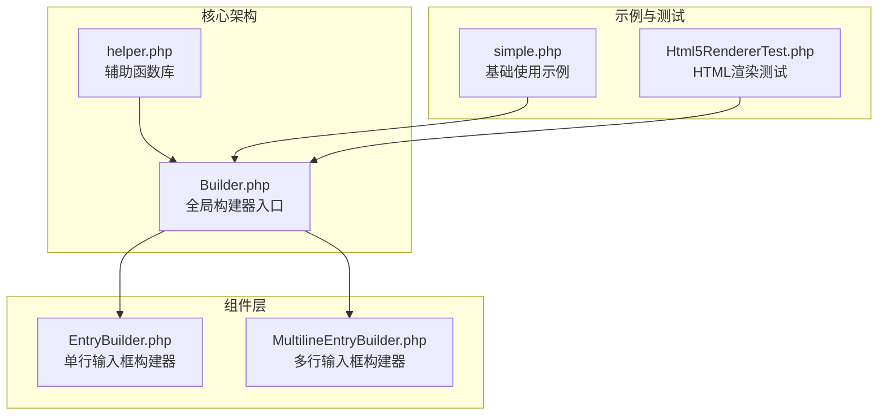
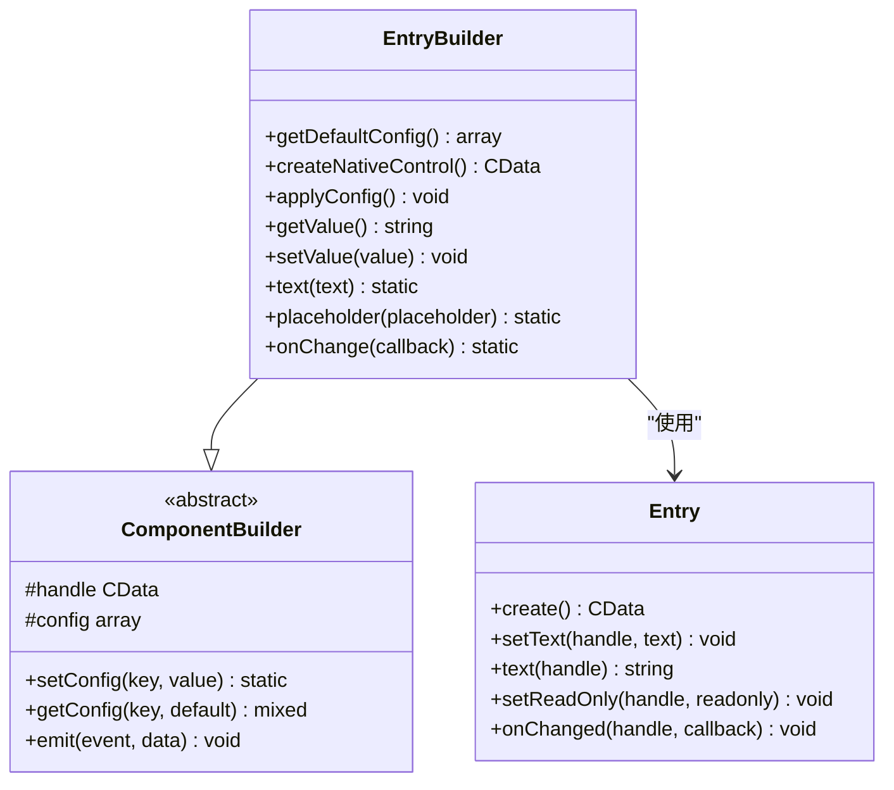
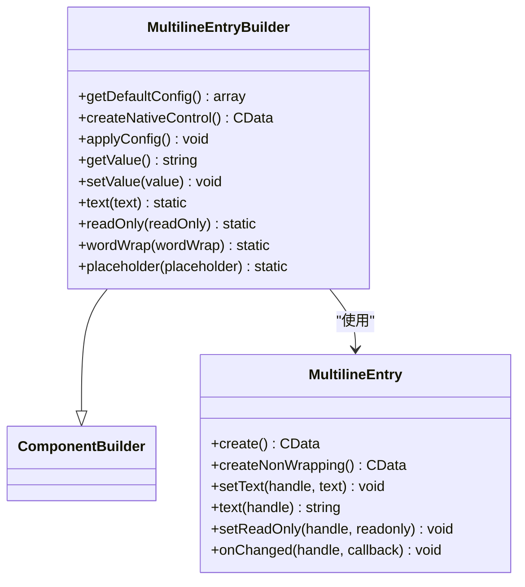
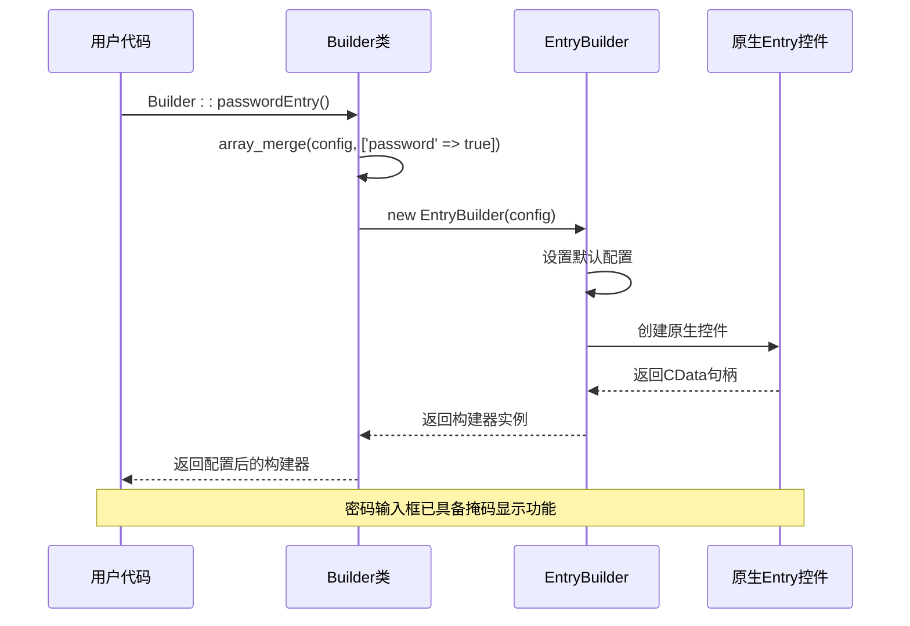
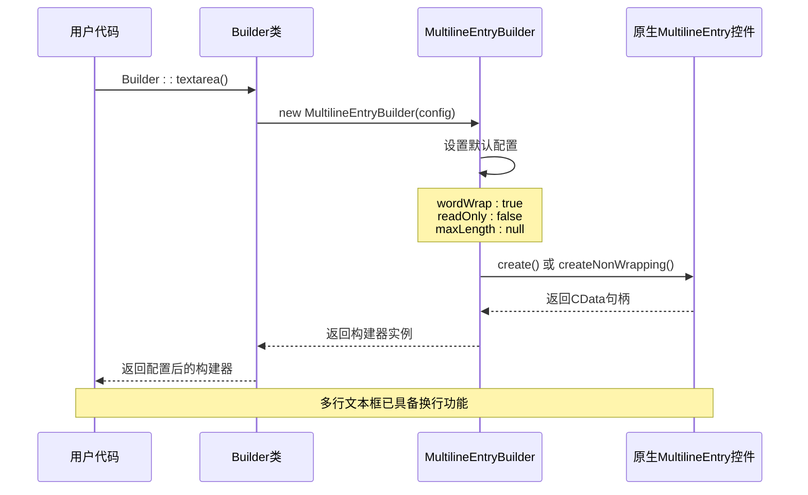
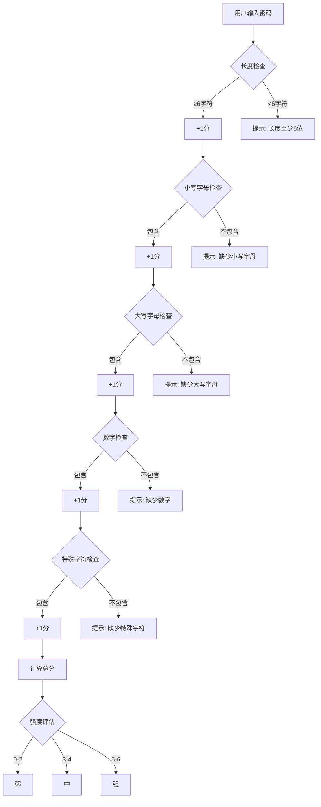

# 便捷方法封装（passwordEntry 与 textarea）

<cite>
**本文档中引用的文件**
- [Builder.php](file://src/Builder.php)
- [EntryBuilder.php](file://src/Components/EntryBuilder.php)
- [MultilineEntryBuilder.php](file://src/Components/MultilineEntryBuilder.php)
- [simple.php](file://example/simple.php)
- [helper.php](file://src/helper.php)
- [Html5RendererTest.php](file://tests/Html5RendererTest.php)
</cite>

## 目录
1. [简介](#简介)
2. [项目结构概览](#项目结构概览)
3. [核心组件分析](#核心组件分析)
4. [架构设计](#架构设计)
5. [详细功能分析](#详细功能分析)
6. [使用示例分析](#使用示例分析)
7. [性能考虑](#性能考虑)
8. [最佳实践建议](#最佳实践建议)
9. [总结](#总结)

## 简介

libuiBuilder 是一个基于 PHP 的 GUI 应用程序框架，提供了丰富的 UI 组件构建能力。在该框架中，全局辅助函数 `passwordEntry()` 和 `textarea()` 方法是对底层构建器的语义化封装，旨在简化开发者在特定场景下的组件创建过程。

这些便捷方法通过基于 `EntryBuilder` 和 `MultilineEntryBuilder` 的智能封装，为开发者提供了更加直观、易用的 API 接口，同时保持了与底层构建器的完全兼容性。

## 项目结构概览

libuiBuilder 采用模块化的架构设计，主要包含以下核心目录：



**图表来源**
- [Builder.php](file://src/Builder.php#L1-L153)
- [EntryBuilder.php](file://src/Components/EntryBuilder.php#L1-L80)
- [MultilineEntryBuilder.php](file://src/Components/MultilineEntryBuilder.php#L1-L86)

**章节来源**
- [Builder.php](file://src/Builder.php#L1-L153)
- [helper.php](file://src/helper.php#L1-L59)

## 核心组件分析

### EntryBuilder 基础构建器

`EntryBuilder` 是单行输入框的基础构建器，提供了完整的输入框功能支持：



**图表来源**
- [EntryBuilder.php](file://src/Components/EntryBuilder.php#L9-L80)

### MultilineEntryBuilder 多行构建器

`MultilineEntryBuilder` 提供了多行文本输入的功能，支持换行和文本包装：



**图表来源**
- [MultilineEntryBuilder.php](file://src/Components/MultilineEntryBuilder.php#L9-L86)

**章节来源**
- [EntryBuilder.php](file://src/Components/EntryBuilder.php#L1-L80)
- [MultilineEntryBuilder.php](file://src/Components/MultilineEntryBuilder.php#L1-L86)

## 架构设计

libuiBuilder 采用了分层架构设计，通过全局构建器类提供统一的便捷方法接口：

```mermaid
graph TD
subgraph "应用层"
UserCode[用户代码<br/>simple.php]
end
subgraph "便捷方法层"
PasswordEntry[passwordEntry()<br/>密码输入框]
Textarea[textarea()<br/>多行文本框]
end
subgraph "构建器层"
Builder[Builder.php<br/>全局构建器]
EntryBuilder[EntryBuilder<br/>单行输入框]
MultiBuilder[MultilineEntryBuilder<br/>多行输入框]
end
subgraph "原生层"
NativeEntry[Entry<br/>原生单行输入框]
NativeMulti[MultilineEntry<br/>原生多行输入框]
end
UserCode --> PasswordEntry
UserCode --> Textarea
PasswordEntry --> Builder
Textarea --> Builder
Builder --> EntryBuilder
Builder --> MultiBuilder
EntryBuilder --> NativeEntry
MultiBuilder --> NativeMulti
```

**图表来源**
- [Builder.php](file://src/Builder.php#L82-L132)
- [simple.php](file://example/simple.php#L40-L49)

## 详细功能分析

### passwordEntry() 方法实现

`passwordEntry()` 方法是针对密码输入场景的语义化封装，通过向配置中添加 `'password' => true` 属性来实现密码掩码显示：



**图表来源**
- [Builder.php](file://src/Builder.php#L82-L86)
- [EntryBuilder.php](file://src/Components/EntryBuilder.php#L11-L19)

#### 密码掩码实现机制

虽然源代码中没有直接展示 `Entry::setMasked()` 方法，但通过配置 `'password' => true` 参数，`EntryBuilder` 在初始化时会自动应用密码掩码功能。这种设计体现了：

1. **语义化封装**：通过配置参数而非方法调用来实现功能
2. **简洁性**：用户只需一行代码即可创建密码输入框
3. **一致性**：与其他配置项保持相同的设置方式

### textarea() 方法实现

`textarea()` 方法是多行文本输入的标准封装，预设了多行模式和换行策略：



**图表来源**
- [Builder.php](file://src/Builder.php#L124-L132)
- [MultilineEntryBuilder.php](file://src/Components/MultilineEntryBuilder.php#L11-L20)

#### 多行模式特性

`textarea()` 方法预设的关键特性包括：

1. **自动换行**：默认启用 `wordWrap` 属性
2. **灵活配置**：支持 `readOnly`、`maxLength` 等属性设置
3. **长文本适配**：专为长文本输入场景优化

**章节来源**
- [Builder.php](file://src/Builder.php#L82-L132)
- [EntryBuilder.php](file://src/Components/EntryBuilder.php#L21-L51)
- [MultilineEntryBuilder.php](file://src/Components/MultilineEntryBuilder.php#L23-L51)

## 使用示例分析

### simple.php 中的密码输入框使用

在 `simple.php` 示例中，`passwordEntry()` 方法被用于创建密码输入框，展示了完整的使用流程：

```mermaid
flowchart TD
Start([开始创建密码输入框]) --> CreatePassword[Builder::passwordEntry()]
CreatePassword --> SetId[设置ID: passwordEntry]
SetId --> SetPlaceholder[设置占位符: 请输入密码]
SetPlaceholder --> SetMinLength[设置最小长度: 6]
SetMinLength --> SetOnChange[设置onChange回调]
SetOnChange --> CalculateStrength[计算密码强度]
CalculateStrength --> UpdateLabel[更新强度标签]
UpdateLabel --> End([完成配置])
style CreatePassword fill:#e1f5fe
style SetOnChange fill:#f3e5f5
style CalculateStrength fill:#fff3e0
```

**图表来源**
- [simple.php](file://example/simple.php#L40-L49)

#### 关键配置分析

1. **ID 设置**：`->id('passwordEntry')` 便于后续状态管理
2. **占位符**：`->placeholder('请输入密码')` 提供用户体验指导
3. **验证规则**：`->minLength(6)` 实现基本的安全要求
4. **实时反馈**：`->onChange()` 回调提供即时的密码强度反馈

### 密码强度计算集成

通过 `calculateStrength()` 辅助函数，实现了密码强度的动态计算：



**图表来源**
- [helper.php](file://src/helper.php#L4-L58)
- [simple.php](file://example/simple.php#L44-L49)

**章节来源**
- [simple.php](file://example/simple.php#L40-L49)
- [helper.php](file://src/helper.php#L3-L58)

## 性能考虑

### 构建器模式的优势

1. **延迟初始化**：组件仅在需要时才创建原生控件
2. **配置缓存**：通过配置数组避免重复的属性设置
3. **事件优化**：统一的事件处理机制减少内存占用

### 内存管理

- **句柄管理**：自动管理原生控件的生命周期
- **回调清理**：确保事件回调不会造成内存泄漏
- **配置复用**：相同类型的组件共享默认配置

### 渲染性能

- **批量操作**：支持配置的批量设置
- **条件渲染**：根据配置动态决定控件类型
- **懒加载**：只在显示时创建原生控件

## 最佳实践建议

### 开发效率提升

1. **语义化命名**：使用 `passwordEntry()` 和 `textarea()` 明确表达用途
2. **链式调用**：充分利用构建器的链式方法调用
3. **配置复用**：通过继承和组合减少重复配置

### 代码可读性增强

1. **意图明确**：便捷方法直接表达使用场景
2. **减少样板代码**：避免手动设置通用属性
3. **一致性原则**：与框架其他部分保持一致的API风格

### 兼容性保证

1. **向后兼容**：新方法不影响现有代码
2. **功能对等**：便捷方法与底层构建器功能完全一致
3. **扩展性**：支持自定义配置覆盖默认行为

## 总结

libuiBuilder 的 `passwordEntry()` 和 `textarea()` 便捷方法展现了优秀的软件设计原则：

### 设计亮点

1. **语义化封装**：通过方法名直接表达使用场景
2. **配置驱动**：利用配置参数实现功能定制
3. **向后兼容**：保持与底层构建器的完全兼容
4. **开发友好**：显著提升开发效率和代码可读性

### 技术价值

- **降低学习成本**：开发者无需深入了解底层实现细节
- **提高开发速度**：减少样板代码编写时间
- **增强代码质量**：通过标准化接口减少错误可能性
- **维护便利性**：统一的API设计便于长期维护

这些便捷方法不仅体现了良好的软件工程实践，更为开发者提供了一个高效、直观的GUI开发体验。通过合理的抽象层次和清晰的职责分离，libuiBuilder 成功地平衡了功能完整性与使用简便性之间的关系。