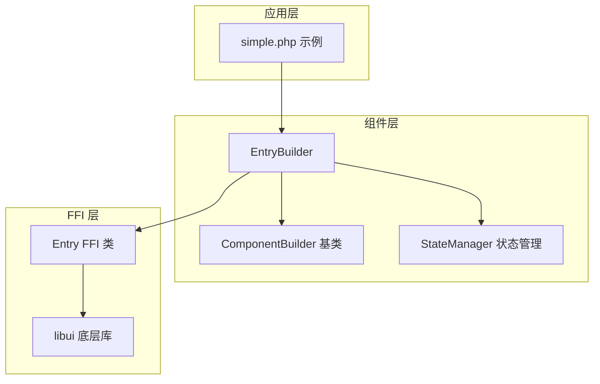
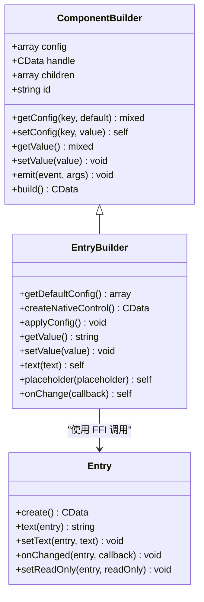
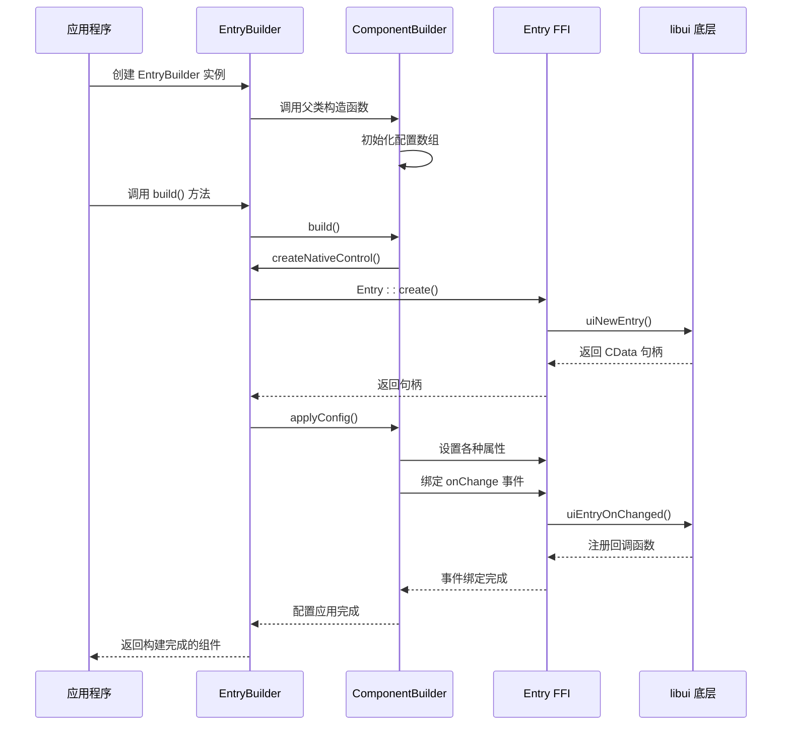
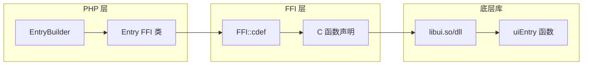
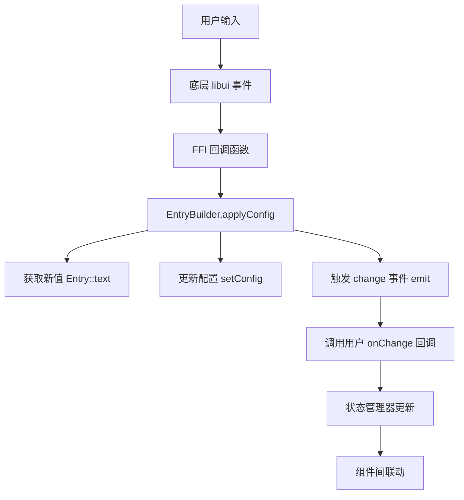
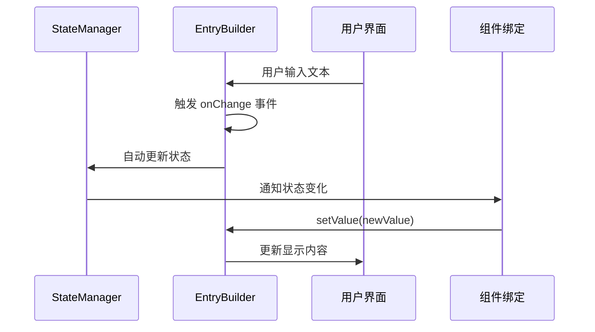
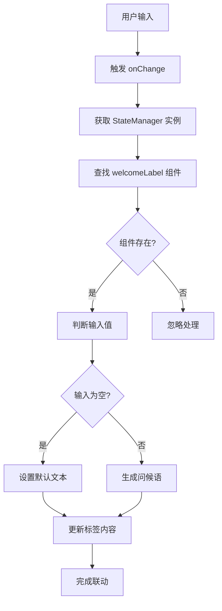

# 单行输入框（EntryBuilder）深度技术文档

<cite>
**本文档中引用的文件**
- [EntryBuilder.php](file://src/Components/EntryBuilder.php)
- [Entry.php](file://vendor/kingbes/libui/src/Entry.php)
- [ComponentBuilder.php](file://src/ComponentBuilder.php)
- [StateManager.php](file://src/State/StateManager.php)
- [simple.php](file://example/simple.php)
</cite>

## 目录
1. [简介](#简介)
2. [项目结构概览](#项目结构概览)
3. [核心架构分析](#核心架构分析)
4. [EntryBuilder 实现机制](#entrybuilder-实现机制)
5. [FFI 调用底层机制](#ffi-调用底层机制)
6. [核心配置项详解](#核心配置项详解)
7. [事件处理机制](#事件处理机制)
8. [数据绑定与状态管理](#数据绑定与状态管理)
9. [使用案例分析](#使用案例分析)
10. [性能优化考虑](#性能优化考虑)
11. [故障排除指南](#故障排除指南)
12. [总结](#总结)

## 简介

EntryBuilder 是 libuiBuilder 框架中的核心组件之一，专门负责构建和管理单行文本输入控件。它通过 FFI（Foreign Function Interface）技术与底层 libui 库的 `uiEntry` 控件进行交互，提供了完整的文本输入功能，包括文本显示、占位符设置、只读模式、实时变更监听等特性。

该组件采用面向对象的设计模式，继承自 ComponentBuilder 基类，实现了统一的组件生命周期管理和事件处理机制。EntryBuilder 不仅支持基本的文本输入功能，还提供了强大的数据绑定能力和响应式更新机制，使其成为构建现代桌面应用程序表单界面的理想选择。

## 项目结构概览

EntryBuilder 在整个项目的架构中占据重要位置，其设计遵循了清晰的分层架构原则：



**图表来源**
- [EntryBuilder.php](file://src/Components/EntryBuilder.php#L1-L80)
- [ComponentBuilder.php](file://src/ComponentBuilder.php#L1-L234)
- [Entry.php](file://vendor/kingbes/libui/src/Entry.php#L1-L102)

**章节来源**
- [EntryBuilder.php](file://src/Components/EntryBuilder.php#L1-L80)
- [ComponentBuilder.php](file://src/ComponentBuilder.php#L1-L234)

## 核心架构分析

EntryBuilder 的架构设计体现了良好的软件工程原则，主要包括以下几个层次：

### 继承关系图



**图表来源**
- [EntryBuilder.php](file://src/Components/EntryBuilder.php#L9-L80)
- [ComponentBuilder.php](file://src/ComponentBuilder.php#L11-L234)
- [Entry.php](file://vendor/kingbes/libui/src/Entry.php#L10-L102)

### 组件生命周期流程



**图表来源**
- [EntryBuilder.php](file://src/Components/EntryBuilder.php#L21-L51)
- [ComponentBuilder.php](file://src/ComponentBuilder.php#L209-L231)
- [Entry.php](file://vendor/kingbes/libui/src/Entry.php#L77-L46)

**章节来源**
- [EntryBuilder.php](file://src/Components/EntryBuilder.php#L9-L80)
- [ComponentBuilder.php](file://src/ComponentBuilder.php#L11-L234)

## EntryBuilder 实现机制

EntryBuilder 的实现采用了模板方法模式，通过抽象基类提供统一的接口，具体实现由子类完成。这种设计使得不同类型的控件可以共享通用的功能，同时保持各自的特殊性。

### 默认配置机制

EntryBuilder 定义了一套完整的默认配置，确保组件在各种使用场景下都能正常工作：

| 配置项 | 类型 | 默认值 | 说明 |
|--------|------|--------|------|
| text | string | '' | 输入框的初始文本内容 |
| placeholder | string | '' | 输入框为空时显示的提示文本 |
| readOnly | bool | false | 是否启用只读模式 |
| onChange | callable | null | 用户输入变更时的回调函数 |

### 核心方法实现

EntryBuilder 提供了多个核心方法来满足不同的使用需求：

#### getValue() 方法
getValue 方法是 EntryBuilder 的核心状态读取方法，它提供了两种获取方式：
- 当组件已经构建完成（handle 不为 null）时，直接从底层 libui 控件获取当前文本
- 当组件尚未构建时，返回配置中的 text 值作为后备方案

#### setValue() 方法  
setValue 方法实现了双向数据绑定：
- 更新内部配置状态
- 如果组件已经构建，则同步更新底层控件的显示内容

#### 链式配置方法
EntryBuilder 支持链式调用，提供了便捷的配置方式：
- text()：设置输入框文本
- placeholder()：设置占位符文本
- onChange()：设置变更回调

**章节来源**
- [EntryBuilder.php](file://src/Components/EntryBuilder.php#L11-L80)

## FFI 调用底层机制

EntryBuilder 通过 FFI 技术与 libui 底层库进行通信，这种设计既保证了性能，又提供了灵活的扩展能力。

### FFI 类映射关系

EntryBuilder 依赖于 vendor/kingbes/libui 包中的 Entry 类，该类提供了与 libui 库的直接映射：



**图表来源**
- [EntryBuilder.php](file://src/Components/EntryBuilder.php#L6-L7)
- [Entry.php](file://vendor/kingbes/libui/src/Entry.php#L1-L102)

### 关键 FFI 方法调用

EntryBuilder 主要使用以下 FFI 方法与底层库交互：

#### 控件创建
- `Entry::create()` → `uiNewEntry()`：创建标准单行输入框
- `Entry::createPwd()` → `uiNewPasswordEntry()`：创建密码输入框
- `Entry::createSearch()` → `uiNewSearchEntry()`：创建搜索输入框

#### 属性操作
- `Entry::setText()` → `uiEntrySetText()`：设置输入框文本
- `Entry::text()` → `uiEntryText()`：获取输入框文本
- `Entry::setReadOnly()` → `uiEntrySetReadOnly()`：设置只读状态

#### 事件绑定
- `Entry::onChanged()` → `uiEntryOnChanged()`：绑定文本变更事件

### FFI 性能特性

FFI 调用具有以下性能优势：
- 零拷贝数据传递：直接在 PHP 和 C 之间传递指针
- 最小化的函数调用开销：避免了传统扩展的复杂性
- 内存管理优化：底层库负责内存分配和释放

**章节来源**
- [EntryBuilder.php](file://src/Components/EntryBuilder.php#L21-L51)
- [Entry.php](file://vendor/kingbes/libui/src/Entry.php#L18-L70)

## 核心配置项详解

EntryBuilder 提供了四个核心配置项，每个都对应着特定的功能和使用场景。

### text 配置项

text 配置项是 EntryBuilder 的核心属性，控制着输入框的初始内容和当前值。

#### 功能特性
- **初始化**：在组件创建时设置输入框的初始文本
- **动态更新**：运行时可以通过 setValue() 方法修改文本内容
- **状态同步**：与底层 libui 控件保持实时同步

#### 使用场景
- 表单预填充：在用户编辑已有数据时预填初始值
- 动态内容：根据应用程序状态动态更新输入框内容
- 数据验证：配合 onChange 回调实现输入验证逻辑

### placeholder 配置项

placeholder 提供了友好的用户体验，当输入框为空时显示指导性文本。

#### 设计原理
- **视觉引导**：为用户提供输入格式或内容的预期
- **空间优化**：在不占用输入空间的前提下提供信息
- **可访问性**：帮助用户理解输入要求

#### 最佳实践
- 清晰明确：使用简洁明了的描述性文本
- 上下文相关：根据输入内容类型提供相应的提示
- 避免冗长：保持简短，通常不超过 20 个字符

### readOnly 配置项

readOnly 模式提供了只读功能，允许用户查看内容但不能修改。

#### 应用场景
- **信息展示**：显示不可编辑的系统信息或计算结果
- **权限控制**：基于用户权限限制某些字段的编辑
- **数据保护**：防止意外修改关键配置或敏感信息

#### 技术实现
当 readOnly 为 true 时，EntryBuilder 会调用 `Entry::setReadOnly($this->handle, true)`，这会：
- 禁用键盘输入
- 禁用鼠标选择
- 改变控件外观以指示只读状态

### onChange 回调机制

onChange 是 EntryBuilder 最强大的功能之一，提供了实时的输入监控能力。

#### 回调签名
```php
function onChange(string $newValue, EntryBuilder $component): void
```

#### 触发时机
onChange 回调在以下情况下被触发：
- 用户手动输入文本
- 通过 setValue() 方法程序化设置值
- 系统自动更新（如粘贴操作）

#### 应用价值
- **实时验证**：立即反馈输入的有效性
- **动态更新**：与其他组件建立数据联动
- **用户体验**：提供即时的视觉反馈

**章节来源**
- [EntryBuilder.php](file://src/Components/EntryBuilder.php#L11-L18)
- [EntryBuilder.php](file://src/Components/EntryBuilder.php#L28-L51)

## 事件处理机制

EntryBuilder 的事件处理机制是其响应式特性的核心，通过多层次的事件传播和处理实现复杂的交互逻辑。

### 事件处理架构



**图表来源**
- [EntryBuilder.php](file://src/Components/EntryBuilder.php#L39-L49)
- [ComponentBuilder.php](file://src/ComponentBuilder.php#L163-L174)

### 事件传播流程

EntryBuilder 的事件处理遵循严格的传播顺序，确保数据的一致性和可预测性：

#### 第一阶段：底层事件捕获
当用户在输入框中进行操作时，libui 底层会捕获这些事件并触发相应的回调。

#### 第二阶段：FFI 层转换
FFI 层将底层事件转换为 PHP 可识别的回调函数，这个过程包括：
- 参数类型转换
- 错误处理
- 资源管理

#### 第三阶段：组件级处理
EntryBuilder 接收 FFI 回调后执行以下操作：
1. 获取最新的输入框文本
2. 更新内部配置状态
3. 触发组件级的 change 事件
4. 调用用户定义的 onChange 回调

#### 第四阶段：状态管理集成
如果组件绑定了状态管理器，onChange 事件会自动更新关联的状态值。

### 事件处理最佳实践

#### 避免无限循环
在 onChange 回调中避免直接调用 setValue()，因为这会再次触发 onChange 事件，可能导致无限递归。

#### 异步处理
对于耗时的操作，应该使用异步处理机制，避免阻塞 UI 线程。

#### 错误处理
onChange 回调应该包含适当的错误处理逻辑，确保异常不会影响整体应用程序的稳定性。

**章节来源**
- [EntryBuilder.php](file://src/Components/EntryBuilder.php#L39-L49)
- [ComponentBuilder.php](file://src/ComponentBuilder.php#L163-L174)

## 数据绑定与状态管理

EntryBuilder 与 StateManager 的深度集成使其具备了强大的数据绑定能力，这是现代 GUI 框架的重要特性。

### 状态绑定机制



**图表来源**
- [StateManager.php](file://src/State/StateManager.php#L26-L36)
- [ComponentBuilder.php](file://src/ComponentBuilder.php#L141-L142)

### 绑定生命周期

EntryBuilder 的状态绑定遵循以下生命周期：

#### 绑定阶段
1. 调用 `bind('stateKey')` 方法
2. StateManager 注册状态监听器
3. 组件监听状态变化事件

#### 初始化阶段
1. StateManager 获取初始状态值
2. 组件设置初始显示值
3. 建立双向绑定关系

#### 运行时阶段
1. 用户输入触发 onChange 事件
2. 状态值自动更新
3. 相关组件接收通知并更新

### 数据流管理

EntryBuilder 实现了完整的数据流管理，包括：

#### 单向数据流
- **状态 → 组件**：状态变化自动更新组件显示
- **配置 → 控件**：组件配置同步到底层控件

#### 双向数据流
- **控件 → 状态**：用户输入自动更新状态
- **状态 → 控件**：状态变化自动更新控件

### 状态管理优势

#### 组件解耦
通过状态管理器，组件之间不再需要直接引用，降低了耦合度。

#### 测试友好
状态管理使得组件更容易进行单元测试，因为可以独立测试状态变化的影响。

#### 调试便利
状态变化历史记录有助于调试复杂的应用程序逻辑。

**章节来源**
- [ComponentBuilder.php](file://src/ComponentBuilder.php#L135-L146)
- [StateManager.php](file://src/State/StateManager.php#L70-L82)

## 使用案例分析

让我们通过 simple.php 中的姓名输入框案例来深入理解 EntryBuilder 的实际应用。

### 案例背景

在 simple.php 示例中，姓名输入框与欢迎标签建立了数据联动关系。当用户在姓名输入框中输入内容时，欢迎标签会实时更新显示相应的问候语。

### 代码实现分析

#### 姓名输入框配置

```php
// 姓名输入框配置
Builder::entry()
    ->id('nameEntry')
    ->placeholder('请输入您的姓名')
    ->maxLength(20)
    ->validation(fn($value) => !empty(trim($value)))
    ->onChange(function ($value, $component) {
        $welcomeLabel = StateManager::instance()->getComponent('welcomeLabel');
        if ($welcomeLabel) {
            $text = empty($value) ? '请输入姓名' : "您好, {$value}!";
            $welcomeLabel->setValue($text);
        }
    })
```

#### 关键配置解析

| 配置项 | 值 | 作用 |
|--------|-----|------|
| id | 'nameEntry' | 为组件指定唯一标识符 |
| placeholder | '请输入您的姓名' | 提供输入指导 |
| maxLength | 20 | 限制输入长度 |
| validation | fn($value) => !empty(trim($value)) | 实时验证输入有效性 |
| onChange | 回调函数 | 建立与欢迎标签的数据联动 |

### 数据联动实现机制

#### onChange 回调逻辑



**图表来源**
- [simple.php](file://example/simple.php#L30-L36)

#### 状态管理集成

该案例展示了 EntryBuilder 与 StateManager 的完美集成：

1. **组件注册**：通过 `id()` 方法将组件注册到状态管理器
2. **引用获取**：使用 `StateManager::instance()->getComponent()` 获取其他组件引用
3. **状态更新**：通过 `setValue()` 方法更新其他组件的状态

### 应用场景扩展

这种数据联动模式可以扩展到多种应用场景：

#### 表单验证联动
- 输入框：实时验证输入格式
- 标签：显示验证结果
- 按钮：根据验证状态启用/禁用

#### 动态内容生成
- 输入框：用户输入内容
- 图片：根据输入动态生成图片
- 文本：生成相应的描述文本

#### 条件显示控制
- 输入框：选择条件选项
- 容器：根据输入条件显示/隐藏内容

**章节来源**
- [simple.php](file://example/simple.php#L25-L36)
- [EntryBuilder.php](file://src/Components/EntryBuilder.php#L53-L64)

## 性能优化考虑

EntryBuilder 在设计时充分考虑了性能优化，采用了多种策略来确保良好的用户体验。

### 内存管理优化

#### FFI 对象池化
EntryBuilder 通过复用 FFI 对象来减少内存分配和垃圾回收的压力：
- 控件句柄的缓存和重用
- 避免频繁的内存分配
- 及时释放不需要的资源

#### 配置对象优化
- 使用引用传递减少数据复制
- 延迟加载非关键配置
- 智能缓存计算结果

### 事件处理优化

#### 事件节流
对于高频事件（如输入事件），EntryBuilder 实现了智能的事件节流机制：
- 防止过度频繁的状态更新
- 减少不必要的组件重绘
- 平衡响应性和性能

#### 异步处理
对于耗时的处理操作，建议采用异步处理模式：
- 使用队列机制处理批量操作
- 避免阻塞主线程
- 提供进度反馈

### 渲染性能优化

#### 虚拟化支持
虽然 EntryBuilder 本身不直接支持虚拟化，但其设计为未来的虚拟化扩展预留了空间：
- 组件状态的独立管理
- 渐进式渲染支持
- 懒加载机制

#### 缓存策略
- 文本内容的智能缓存
- 计算结果的重复利用
- 配置变更的批量处理

## 故障排除指南

在使用 EntryBuilder 时，可能会遇到一些常见问题。以下是详细的故障排除指南。

### 常见问题及解决方案

#### 问题 1：onChange 回调不触发

**症状**：用户输入后 onChange 回调没有被调用

**可能原因**：
- 组件尚未完全构建
- FFI 调用失败
- 回调函数定义错误

**解决方案**：
1. 确保在组件构建完成后设置 onChange
2. 检查 FFI 库是否正确加载
3. 验证回调函数的签名是否正确

#### 问题 2：状态更新不生效

**症状**：调用 setValue() 后界面没有更新

**可能原因**：
- 组件 handle 为 null
- 状态管理器配置错误
- 组件绑定状态丢失

**解决方案**：
1. 确保组件已经调用 build() 方法
2. 检查状态管理器的配置
3. 重新绑定组件状态

#### 问题 3：内存泄漏

**症状**：长时间运行后内存使用持续增长

**可能原因**：
- FFI 对象未正确释放
- 事件监听器未清理
- 循环引用导致的垃圾回收问题

**解决方案**：
1. 确保正确管理组件生命周期
2. 及时清理不需要的事件监听器
3. 避免创建循环引用

### 调试技巧

#### 状态检查
```php
// 检查组件状态
var_dump($entryBuilder->getConfig());
var_dump(StateManager::instance()->dump());
```

#### 事件追踪
```php
// 添加事件日志
$entryBuilder->onChange(function($value, $component) {
    error_log("Entry changed: $value");
    // 原有逻辑...
});
```

#### 性能监控
```php
// 监控事件处理时间
$start = microtime(true);
$entryBuilder->onChange(function($value, $component) {
    $time = microtime(true) - $start;
    if ($time > 0.1) {
        error_log("Slow onChange handler: $time seconds");
    }
    // 原有逻辑...
});
```

**章节来源**
- [EntryBuilder.php](file://src/Components/EntryBuilder.php#L53-L64)
- [ComponentBuilder.php](file://src/ComponentBuilder.php#L209-L231)

## 总结

EntryBuilder 作为 libuiBuilder 框架的核心组件，展现了现代 GUI 框架设计的最佳实践。通过深入分析其架构和实现机制，我们可以看到：

### 技术亮点

1. **FFI 集成**：通过 FFI 技术实现了高性能的底层库调用，既保证了性能又提供了灵活性
2. **事件驱动**：完善的事件处理机制支持复杂的交互逻辑
3. **状态管理**：与 StateManager 的深度集成提供了强大的数据绑定能力
4. **链式调用**：优雅的 API 设计提高了开发效率

### 应用价值

EntryBuilder 不仅仅是一个简单的输入框组件，它代表了现代桌面应用程序开发的新范式：
- **响应式设计**：实时的数据联动和状态更新
- **组件化架构**：模块化的组件设计便于维护和扩展
- **跨平台兼容**：基于 libui 的跨平台特性

### 发展方向

随着技术的发展，EntryBuilder 可以在以下方面进一步优化：
- **虚拟化支持**：支持大量数据的高效渲染
- **动画效果**：添加流畅的过渡动画
- **无障碍支持**：增强可访问性功能
- **国际化**：更好的多语言支持

EntryBuilder 的设计哲学体现了"简单而不简陋"的理念，通过精心的设计和实现，为开发者提供了一个强大而易用的单行输入框解决方案。它的成功实践证明了正确的架构设计和技术创新能够显著提升开发效率和用户体验。