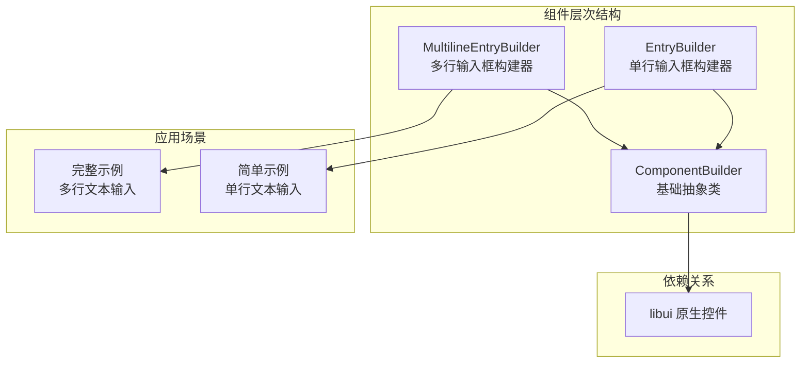
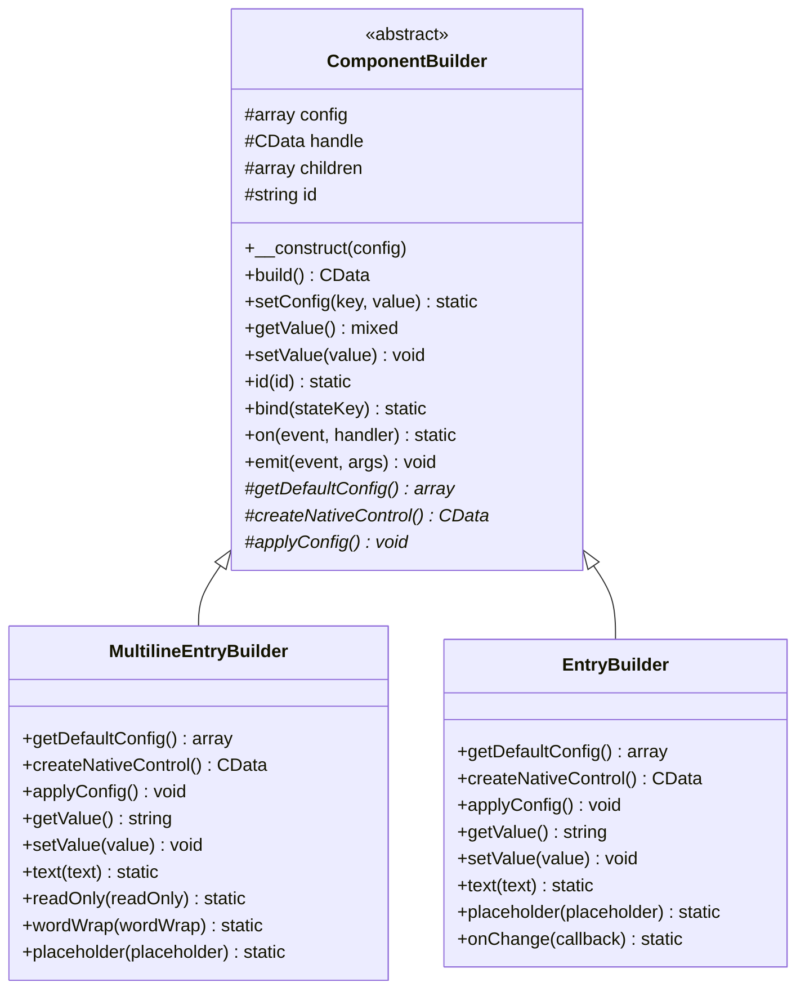
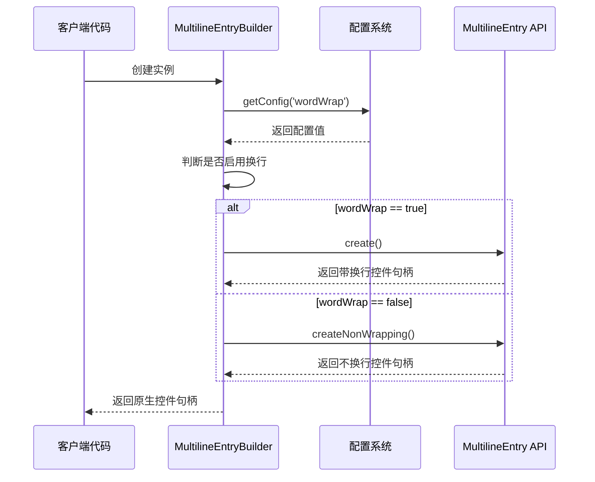
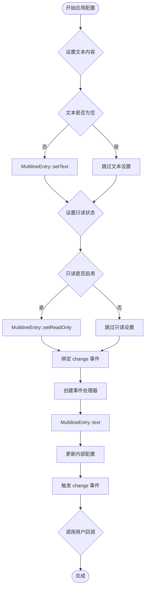
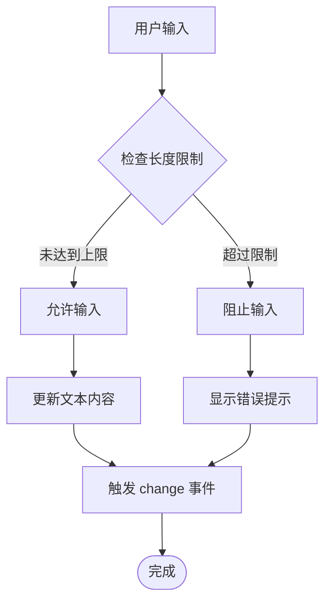

# 多行输入框（MultilineEntryBuilder）详细文档

<cite>
**本文档中引用的文件**
- [MultilineEntryBuilder.php](file://src/Components/MultilineEntryBuilder.php)
- [EntryBuilder.php](file://src/Components/EntryBuilder.php)
- [ComponentBuilder.php](file://src/ComponentBuilder.php)
- [full.php](file://example/full.php)
- [simple.php](file://example/simple.php)
</cite>

## 目录
1. [简介](#简介)
2. [项目结构概述](#项目结构概述)
3. [核心组件对比分析](#核心组件对比分析)
4. [架构概览](#架构概览)
5. [详细组件分析](#详细组件分析)
6. [关键特性深入解析](#关键特性深入解析)
7. [实际应用示例](#实际应用示例)
8. [性能考虑](#性能考虑)
9. [故障排除指南](#故障排除指南)
10. [总结](#总结)

## 简介

MultilineEntryBuilder 和 EntryBuilder 是 libuiBuilder 框架中两个重要的输入控件构建器，分别用于创建多行文本输入框和单行文本输入框。这两个组件虽然都继承自相同的基类 ComponentBuilder，但在功能特性和使用场景上存在显著差异。

MultilineEntryBuilder 提供了更丰富的文本编辑功能，支持多行显示、换行控制、最大长度限制等高级特性，而 EntryBuilder 则专注于提供简洁高效的单行文本输入体验。

## 项目结构概述



**图表来源**
- [ComponentBuilder.php](file://src/ComponentBuilder.php#L11-L234)
- [MultilineEntryBuilder.php](file://src/Components/MultilineEntryBuilder.php#L9-L86)
- [EntryBuilder.php](file://src/Components/EntryBuilder.php#L9-L80)

**章节来源**
- [ComponentBuilder.php](file://src/ComponentBuilder.php#L1-L234)
- [MultilineEntryBuilder.php](file://src/Components/MultilineEntryBuilder.php#L1-L86)
- [EntryBuilder.php](file://src/Components/EntryBuilder.php#L1-L80)

## 核心组件对比分析

### 配置参数对比

| 特性 | MultilineEntryBuilder | EntryBuilder |
|------|----------------------|--------------|
| 默认文本 | `''` | `''` |
| 只读模式 | `false` | `false` |
| 换行控制 | `true` (wordWrap) | 不适用 |
| 最大长度 | `null` | 不适用 |
| 占位符 | `''` | `''` |
| 事件回调 | `onChange` | `onChange` |

### 创建逻辑差异

```mermaid
flowchart TD
Start([开始创建控件]) --> CheckWordWrap{检查 wordWrap 配置}
CheckWordWrap --> |true| CreateWrapped[创建带换行的多行输入框<br/>MultilineEntry::create()]
CheckWordWrap --> |false| CreateNonWrapped[创建不换行的多行输入框<br/>MultilineEntry::createNonWrapping()]
CreateWrapped --> ApplyConfig[应用配置]
CreateNonWrapped --> ApplyConfig
ApplyConfig --> BindEvents[绑定事件处理]
BindEvents --> End([完成])
EntryStart([开始创建单行控件]) --> CreateSingle[创建单行输入框<br/>Entry::create()]
CreateSingle --> ApplyEntryConfig[应用配置]
ApplyEntryConfig --> BindEntryEvents[绑定事件处理]
BindEntryEvents --> EntryEnd([完成])
```

**图表来源**
- [MultilineEntryBuilder.php](file://src/Components/MultilineEntryBuilder.php#L23-L28)
- [EntryBuilder.php](file://src/Components/EntryBuilder.php#L21-L24)

**章节来源**
- [MultilineEntryBuilder.php](file://src/Components/MultilineEntryBuilder.php#L11-L20)
- [EntryBuilder.php](file://src/Components/EntryBuilder.php#L11-L18)

## 架构概览

### 组件继承关系



**图表来源**
- [ComponentBuilder.php](file://src/ComponentBuilder.php#L11-L234)
- [MultilineEntryBuilder.php](file://src/Components/MultilineEntryBuilder.php#L9-L86)
- [EntryBuilder.php](file://src/Components/EntryBuilder.php#L9-L80)

## 详细组件分析

### MultilineEntryBuilder 实现分析

#### 默认配置详解

MultilineEntryBuilder 提供了比 EntryBuilder 更丰富的默认配置选项：

- **text**: 初始文本内容，默认为空字符串
- **readOnly**: 是否只读，默认为 false
- **wordWrap**: 是否启用换行功能，默认为 true
- **maxLength**: 最大字符长度限制，默认为 null（无限制）
- **placeholder**: 占位符文本，默认为空字符串
- **onChange**: 文本变更时的回调函数

#### createNativeControl 方法

该方法的核心逻辑展示了 MultilineEntryBuilder 的独特之处：



**图表来源**
- [MultilineEntryBuilder.php](file://src/Components/MultilineEntryBuilder.php#L23-L28)

#### applyConfig 方法实现

事件绑定机制的一致性设计：



**图表来源**
- [MultilineEntryBuilder.php](file://src/Components/MultilineEntryBuilder.php#L30-L51)

**章节来源**
- [MultilineEntryBuilder.php](file://src/Components/MultilineEntryBuilder.php#L11-L51)

### EntryBuilder 实现分析

#### 简化的配置结构

EntryBuilder 采用更为简洁的配置结构，专注于基本的文本输入需求：

- **text**: 初始文本内容
- **placeholder**: 占位符文本
- **readOnly**: 只读状态
- **onChange**: 变更回调

#### 事件处理一致性

尽管 EntryBuilder 不支持多行和换行功能，但其事件处理机制与 MultilineEntryBuilder 保持完全一致，确保了开发者体验的一致性。

**章节来源**
- [EntryBuilder.php](file://src/Components/EntryBuilder.php#L11-L51)

## 关键特性深入解析

### wordWrap 配置行为特征

#### 多行输入框的换行控制

wordWrap 属性是 MultilineEntryBuilder 的核心特性，它决定了文本的显示行为：

| wordWrap 值 | 控件类型 | 用户体验 | 适用场景 |
|-------------|----------|----------|----------|
| true | 带换行多行输入框 | 自动换行，适合长文本输入 | 文档编辑、评论输入、描述填写 |
| false | 不换行多行输入框 | 水平滚动，适合代码输入 | 代码编辑器、短语输入、标题输入 |

#### 对用户体验的影响

- **启用换行（wordWrap=true）**: 用户可以自由输入长段落文本，系统自动处理换行，提供更好的阅读体验
- **禁用换行（wordWrap=false）**: 用户需要手动换行或使用水平滚动，适合需要精确控制文本格式的场景

### maxLength 属性的作用机制

maxLength 属性为多行输入框提供了字符长度控制功能：



**图表来源**
- [MultilineEntryBuilder.php](file://src/Components/MultilineEntryBuilder.php#L16)

### placeholder 占位符功能

占位符在两个组件中的作用：

- **视觉提示**: 在空状态下显示指导性文本
- **用户体验**: 减少用户困惑，提高表单填写效率
- **可访问性**: 为屏幕阅读器用户提供额外上下文

**章节来源**
- [MultilineEntryBuilder.php](file://src/Components/MultilineEntryBuilder.php#L15-L18)
- [EntryBuilder.php](file://src/Components/EntryBuilder.php#L14-L16)

## 实际应用示例

### 完整示例中的多行输入框使用

在 full.php 示例中，多行输入框的配置展示了其在实际界面中的布局与交互表现：

```mermaid
graph LR
subgraph "表单布局"
Label1[单行输入:<br/>用户名]
Input1[Builder::entry()<br/>->placeholder('输入文本')]
Label2[多行输入:<br/>描述]
Input2[Builder::multilineEntry()<br/>->placeholder('输入多行文本...')<br/>->wordWrap(true)]
end
subgraph "交互特性"
Input1 --> SingleLine[单行输入<br/>Enter 键确认]
Input2 --> MultiLine[多行输入<br/>自动换行<br/>支持 Ctrl+Enter 快捷键]
end
```

**图表来源**
- [full.php](file://example/full.php#L30-L52)

### 简单示例中的多行输入框变体

在 simple.php 示例中，展示了不同类型的输入框组合：

- **单行输入框**: 用于姓名、密码等简短信息输入
- **多行输入框**: 用于描述、备注等较长文本输入
- **密码输入框**: 用于敏感信息输入，字符被隐藏

**章节来源**
- [full.php](file://example/full.php#L30-L52)
- [simple.php](file://example/simple.php#L25-L40)

## 性能考虑

### 内存使用优化

- **延迟初始化**: 控件仅在首次 build() 调用时创建原生句柄
- **事件处理器**: 使用闭包捕获当前状态，避免内存泄漏
- **配置缓存**: 内部配置数组减少重复的属性访问

### 渲染性能

- **批量更新**: setValue 方法支持批量设置多个属性
- **事件节流**: change 事件按需触发，避免频繁更新
- **条件渲染**: 根据 wordWrap 配置选择最优的原生控件类型

## 故障排除指南

### 常见问题及解决方案

#### 1. 多行输入框不换行

**问题**: 设置 wordWrap=true 后仍然不换行

**解决方案**: 
- 检查容器宽度是否足够
- 确认父容器布局是否正确
- 验证 libui 版本兼容性

#### 2. 文本长度限制失效

**问题**: maxLength 设置后仍能输入超过限制的字符

**解决方案**:
- 确认 maxLength 值为正整数
- 检查是否在输入过程中动态修改了配置
- 验证事件绑定是否正常工作

#### 3. 事件回调未触发

**问题**: onChange 回调函数没有被调用

**解决方案**:
- 确认回调函数签名正确
- 检查事件绑定时机
- 验证组件是否正确初始化

**章节来源**
- [MultilineEntryBuilder.php](file://src/Components/MultilineEntryBuilder.php#L30-L51)
- [EntryBuilder.php](file://src/Components/EntryBuilder.php#L26-L51)

## 总结

MultilineEntryBuilder 和 EntryBuilder 虽然都继承自 ComponentBuilder，但在功能定位和使用场景上各有侧重：

### 主要差异总结

| 方面 | MultilineEntryBuilder | EntryBuilder |
|------|----------------------|--------------|
| 功能复杂度 | 高（多行、换行、长度限制） | 低（单行、简洁） |
| 配置选项 | 丰富（wordWrap、maxLength、placeholder） | 基础（text、placeholder、readOnly） |
| 适用场景 | 文档编辑、长文本输入 | 简短信息、快速输入 |
| 性能开销 | 较高（多行处理） | 较低（单行优化） |
| 事件一致性 | 完全一致 | 完全一致 |

### 设计原则

1. **一致性原则**: 两个组件在事件处理、配置管理等方面保持完全一致的设计
2. **扩展性原则**: 通过继承机制实现功能扩展，同时保持接口统一
3. **用户体验原则**: 根据不同的使用场景提供最适合的输入体验
4. **性能优化原则**: 在满足功能需求的前提下，尽可能优化性能表现

这种设计使得开发者可以根据具体需求灵活选择合适的输入控件，同时享受一致的编程体验和稳定的运行性能。