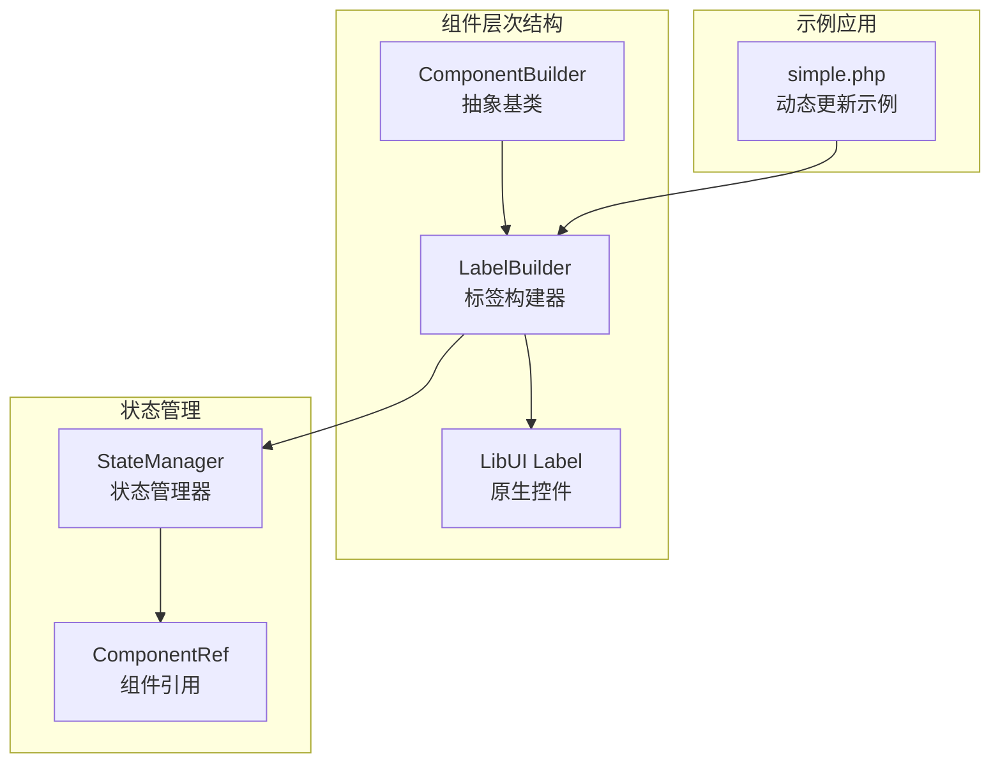
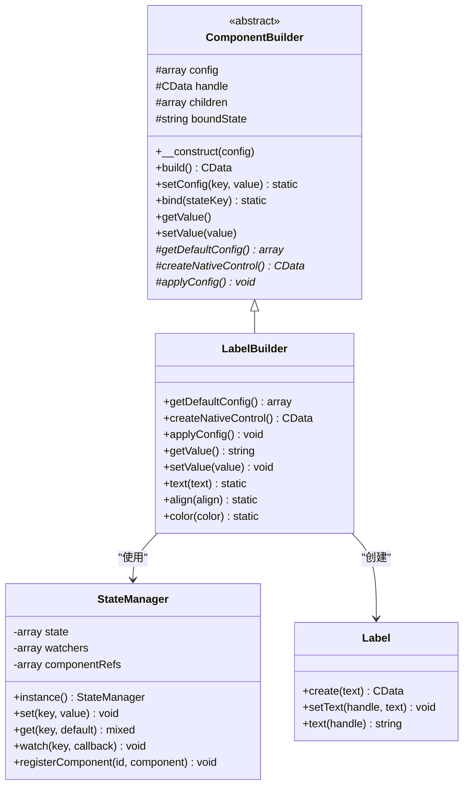
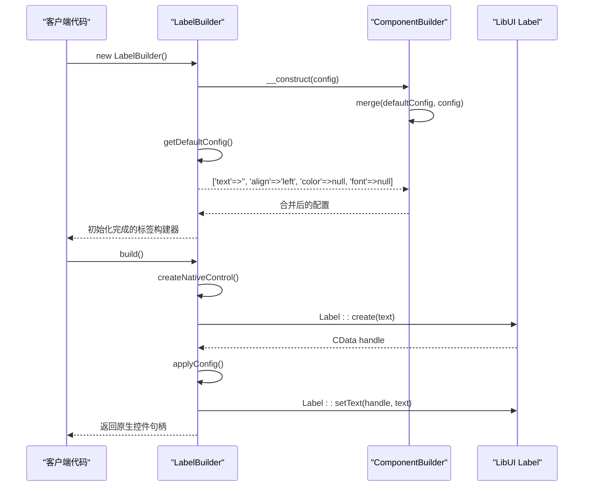
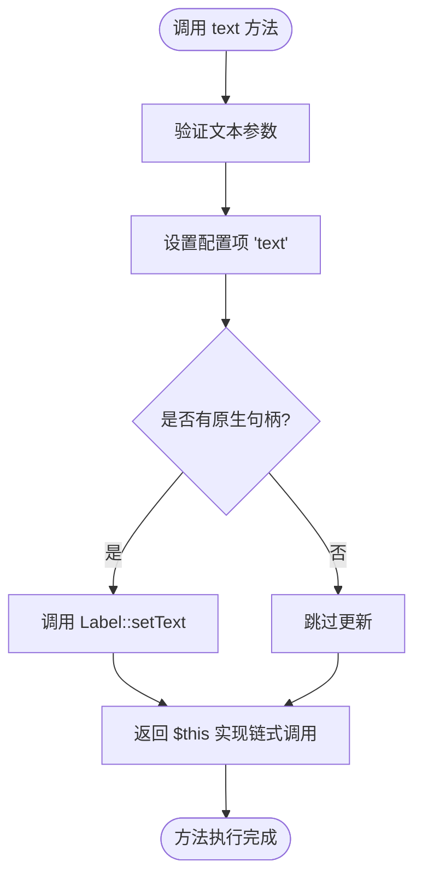
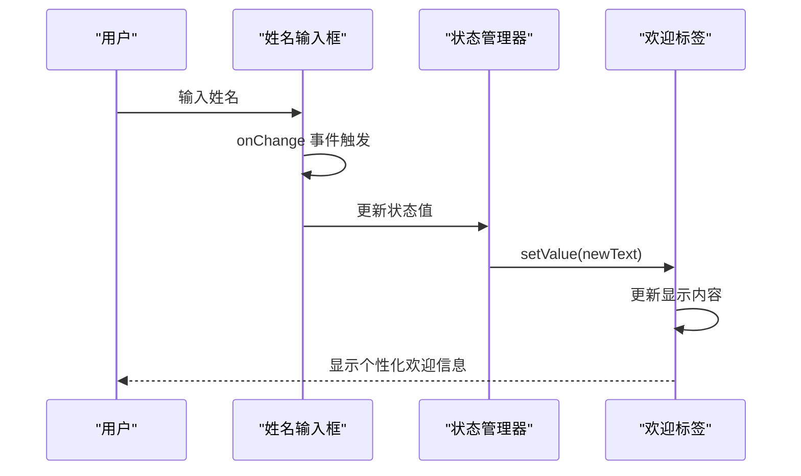
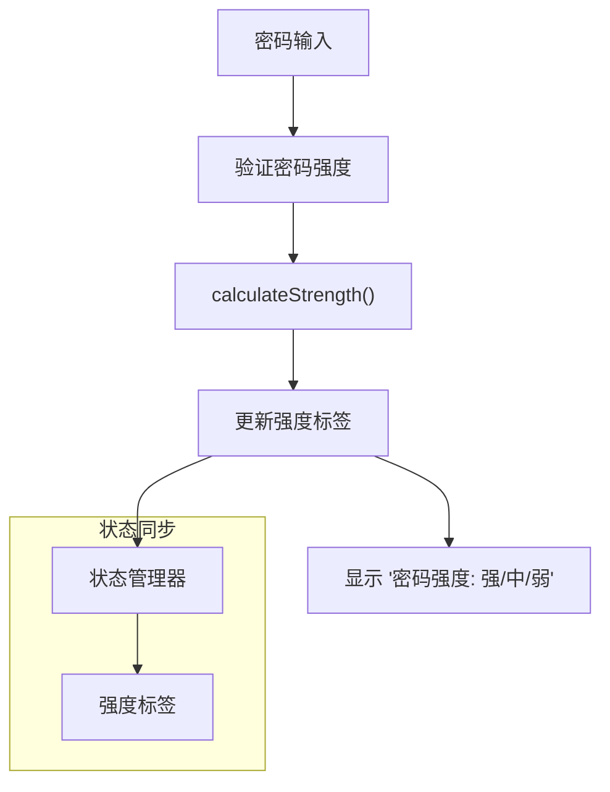
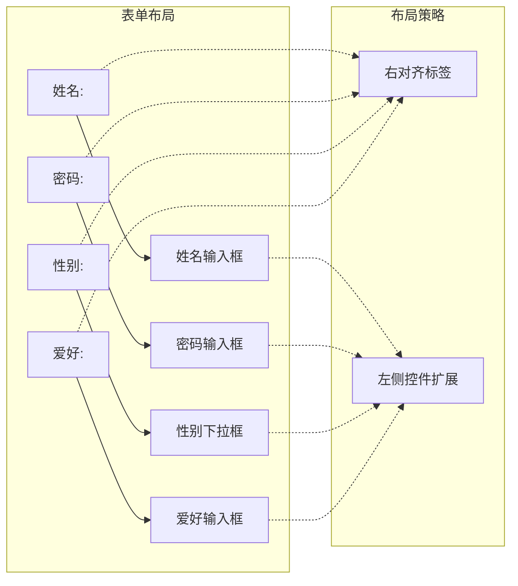
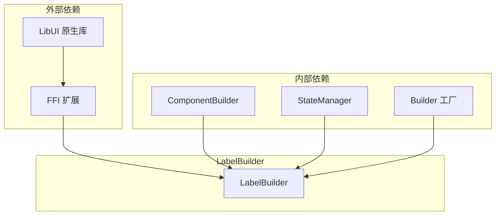

# LabelBuilder 标签控件

<cite>
**本文档中引用的文件**
- [LabelBuilder.php](file://src/Components/LabelBuilder.php)
- [ComponentBuilder.php](file://src/ComponentBuilder.php)
- [simple.php](file://example/simple.php)
- [StateManager.php](file://src/State/StateManager.php)
- [Builder.php](file://src/Builder.php)
- [GridBuilder.php](file://src/Components/GridBuilder.php)
</cite>

## 目录
1. [简介](#简介)
2. [项目结构](#项目结构)
3. [核心组件](#核心组件)
4. [架构概览](#架构概览)
5. [详细组件分析](#详细组件分析)
6. [依赖关系分析](#依赖关系分析)
7. [性能考虑](#性能考虑)
8. [故障排除指南](#故障排除指南)
9. [结论](#结论)

## 简介

LabelBuilder 是 LibUIBuilder 框架中的一个核心组件，专门用于创建和管理标签控件。作为 ComponentBuilder 抽象类的直接子类，它提供了完整的标签功能实现，包括文本显示、样式配置、数据绑定和状态响应等特性。该组件在表单构建和界面布局中发挥着重要的语义化作用，为用户提供清晰的指示和信息展示。

## 项目结构

LabelBuilder 在项目中的组织结构体现了清晰的分层架构设计：



**图表来源**
- [ComponentBuilder.php](file://src/ComponentBuilder.php#L11-L234)
- [LabelBuilder.php](file://src/Components/LabelBuilder.php#L9-L62)

**章节来源**
- [LabelBuilder.php](file://src/Components/LabelBuilder.php#L1-L62)
- [ComponentBuilder.php](file://src/ComponentBuilder.php#L1-L234)

## 核心组件

LabelBuilder 组件的核心功能围绕以下几个关键方面展开：

### 默认配置管理
LabelBuilder 通过 `getDefaultConfig()` 方法定义了标签控件的基本配置参数，包括：
- **text**: 标签文本内容，默认为空字符串
- **align**: 文本对齐方式，默认为左对齐
- **color**: 文本颜色配置，支持 RGB 数组格式
- **font**: 字体设置，支持自定义字体属性

### 原生控件集成
通过继承 ComponentBuilder，LabelBuilder 获得了与 LibUI 原生标签控件的无缝集成能力，能够创建、配置和管理底层的 CData 对象。

### 数据绑定机制
实现了完整的双向数据绑定功能，支持状态管理器的自动同步和事件驱动的响应式更新。

**章节来源**
- [LabelBuilder.php](file://src/Components/LabelBuilder.php#L11-L18)
- [ComponentBuilder.php](file://src/ComponentBuilder.php#L25-L44)

## 架构概览

LabelBuilder 的整体架构采用了经典的 MVC 模式，结合观察者模式和工厂模式：



**图表来源**
- [ComponentBuilder.php](file://src/ComponentBuilder.php#L11-L234)
- [LabelBuilder.php](file://src/Components/LabelBuilder.php#L9-L62)
- [StateManager.php](file://src/State/StateManager.php#L8-L91)

## 详细组件分析

### 继承关系与默认配置

LabelBuilder 通过继承 ComponentBuilder 实现了标签控件的功能扩展：



**图表来源**
- [LabelBuilder.php](file://src/Components/LabelBuilder.php#L21-L31)
- [ComponentBuilder.php](file://src/ComponentBuilder.php#L25-L44)

### text 方法的实现机制

text 方法是 LabelBuilder 的核心链式配置方法，提供了简洁的接口来更新标签内容：



**图表来源**
- [LabelBuilder.php](file://src/Components/LabelBuilder.php#L48-L51)

### 动态更新场景分析

在 example/simple.php 中，LabelBuilder 展示了其在动态更新场景中的强大功能：

#### 欢迎语动态更新
通过事件驱动的方式，当用户在姓名输入框中输入内容时，欢迎标签会实时更新：



**图表来源**
- [simple.php](file://example/simple.php#L30-L35)

#### 密码强度反馈
另一个典型的动态更新场景展示了标签控件在表单验证中的应用：



**图表来源**
- [simple.php](file://example/simple.php#L44-L49)

**章节来源**
- [LabelBuilder.php](file://src/Components/LabelBuilder.php#L48-L61)
- [simple.php](file://example/simple.php#L30-L49)

### 样式配置功能

LabelBuilder 提供了丰富的样式配置选项，支持标签的视觉定制：

| 配置项 | 类型 | 默认值 | 描述 |
|--------|------|--------|------|
| text | string | '' | 标签显示的文本内容 |
| align | string | 'left' | 文本对齐方式：left, center, right |
| color | array | null | 文本颜色，RGB数组格式 |
| font | array | null | 字体配置，支持大小、粗体等属性 |

### 表单布局中的语义化作用

在 GridBuilder.form() 方法中，LabelBuilder 与各种输入控件配合，构成了标准的表单布局：



**图表来源**
- [GridBuilder.php](file://src/Components/GridBuilder.php#L80-L89)
- [simple.php](file://example/simple.php#L22-L68)

**章节来源**
- [LabelBuilder.php](file://src/Components/LabelBuilder.php#L53-L61)
- [GridBuilder.php](file://src/Components/GridBuilder.php#L80-L89)

## 依赖关系分析

LabelBuilder 的依赖关系体现了框架的模块化设计：



**图表来源**
- [LabelBuilder.php](file://src/Components/LabelBuilder.php#L5-L8)
- [ComponentBuilder.php](file://src/ComponentBuilder.php#L1-L10)

**章节来源**
- [LabelBuilder.php](file://src/Components/LabelBuilder.php#L5-L8)
- [ComponentBuilder.php](file://src/ComponentBuilder.php#L1-L10)

## 性能考虑

LabelBuilder 在设计时充分考虑了性能优化：

### 延迟初始化
- 原生控件仅在首次调用 `build()` 方法时创建
- 配置更新采用批量处理机制
- 事件监听器按需注册

### 内存管理
- 使用 FFI 扩展直接操作原生内存
- 及时释放不再使用的组件引用
- 避免不必要的对象复制

### 渲染优化
- 支持条件渲染和懒加载
- 减少不必要的重新绘制
- 利用状态变更通知机制

## 故障排除指南

### 常见问题及解决方案

#### 标签内容不更新
**问题描述**: 调用 `setValue()` 或 `text()` 方法后，标签内容没有变化

**可能原因**:
1. 组件尚未构建（handle 为 null）
2. 状态绑定冲突
3. 事件循环阻塞

**解决方案**:
```php
// 确保组件已构建
$label = Builder::label()->text('初始内容')->build();
$label->setValue('新内容');

// 或使用链式调用
Builder::label()->text('新内容')->build();
```

#### 样式配置无效
**问题描述**: 设置的颜色或对齐方式没有生效

**检查清单**:
1. 确认颜色格式正确（RGB数组）
2. 验证对齐值的有效性
3. 检查原生控件是否支持相应样式

#### 数据绑定失效
**问题描述**: 状态变化时标签内容没有自动更新

**排查步骤**:
1. 确认使用了正确的状态键
2. 检查事件处理器是否正确注册
3. 验证状态管理器的初始化

**章节来源**
- [LabelBuilder.php](file://src/Components/LabelBuilder.php#L39-L45)
- [StateManager.php](file://src/State/StateManager.php#L38-L56)

## 结论

LabelBuilder 作为 LibUIBuilder 框架中的重要组件，成功地实现了标签控件的完整功能。通过继承 ComponentBuilder，它获得了强大的基础功能；通过精心设计的 API，它提供了简洁易用的编程接口；通过完善的事件机制，它支持复杂的交互场景。

该组件在表单构建、动态内容更新和界面布局等方面展现了出色的实用价值，是构建现代桌面应用程序界面的重要工具。其模块化的架构设计也为未来的功能扩展和性能优化奠定了良好的基础。