# ProgressBarBuilder 进度条控件

<cite>
**本文档中引用的文件**
- [ProgressBarBuilder.php](file://src/Components/ProgressBarBuilder.php)
- [full.php](file://example/full.php)
- [ProgressBar.php](file://vendor/kingbes/libui/src/ProgressBar.php)
- [Base.php](file://vendor/kingbes/libui/src/Base.php)
- [Libui.h](file://vendor/kingbes/libui/src/Libui.h)
- [ComponentBuilder.php](file://src/ComponentBuilder.php)
</cite>

## 目录
1. [简介](#简介)
2. [项目结构](#项目结构)
3. [核心组件](#核心组件)
4. [架构概览](#架构概览)
5. [详细组件分析](#详细组件分析)
6. [进度条模式详解](#进度条模式详解)
7. [进度状态管理](#进度状态管理)
8. [使用示例](#使用示例)
9. [性能考虑](#性能考虑)
10. [故障排除指南](#故障排除指南)
11. [结论](#结论)

## 简介

ProgressBarBuilder 是 libuiBuilder 框架中的一个专门用于创建和管理进度条控件的构建器类。它提供了两种主要的进度显示模式：确定性进度（通过 value 设置百分比）和不确定性动画（indeterminate 模式），为用户提供直观的任务进度反馈机制。

该组件基于 libui 原生库实现，具有以下特点：
- **双模式支持**：同时支持确定性和不确定性进度显示
- **只读特性**：用户无法通过界面直接修改进度值
- **动态更新**：可通过编程方式实时更新进度状态
- **跨平台兼容**：支持 Windows、Linux 和 macOS 平台

## 项目结构

ProgressBarBuilder 组件在项目中的组织结构如下：

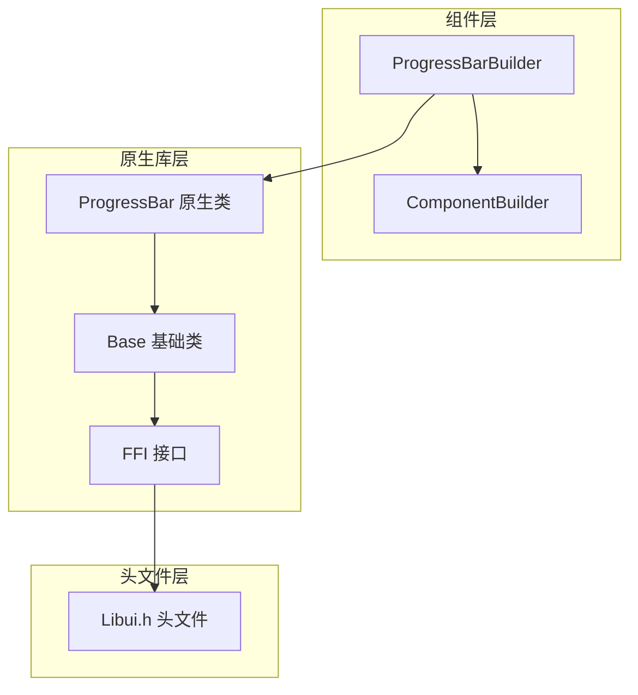

**图表来源**
- [ProgressBarBuilder.php](file://src/Components/ProgressBarBuilder.php#L1-L56)
- [ComponentBuilder.php](file://src/ComponentBuilder.php#L1-L234)
- [ProgressBar.php](file://vendor/kingbes/libui/src/ProgressBar.php#L1-L45)

**章节来源**
- [ProgressBarBuilder.php](file://src/Components/ProgressBarBuilder.php#L1-L56)
- [full.php](file://example/full.php#L117-L118)

## 核心组件

ProgressBarBuilder 组件的核心功能围绕两个关键方面展开：

### 配置参数
- **value**: 当前进度值（0-100），默认为 0
- **indeterminate**: 不确定性模式标志，默认为 false

### 核心方法
- **setValue()**: 设置进度值
- **getValue()**: 获取当前进度值
- **value()**: 链式设置进度值
- **indeterminate()**: 启用/禁用不确定性模式

**章节来源**
- [ProgressBarBuilder.php](file://src/Components/ProgressBarBuilder.php#L11-L17)
- [ProgressBarBuilder.php](file://src/Components/ProgressBarBuilder.php#L34-L55)

## 架构概览

ProgressBarBuilder 的整体架构采用分层设计，确保了良好的可维护性和扩展性：

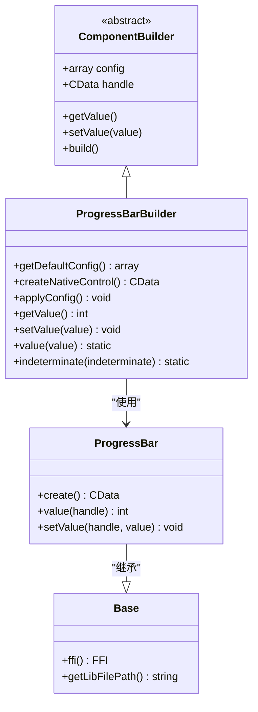

**图表来源**
- [ComponentBuilder.php](file://src/ComponentBuilder.php#L11-L234)
- [ProgressBarBuilder.php](file://src/Components/ProgressBarBuilder.php#L9-L56)
- [ProgressBar.php](file://vendor/kingbes/libui/src/ProgressBar.php#L10-L44)
- [Base.php](file://vendor/kingbes/libui/src/Base.php#L8-L57)

## 详细组件分析

### ProgressBarBuilder 类分析

ProgressBarBuilder 类继承自 ComponentBuilder，实现了进度条控件的特定功能：

#### 默认配置
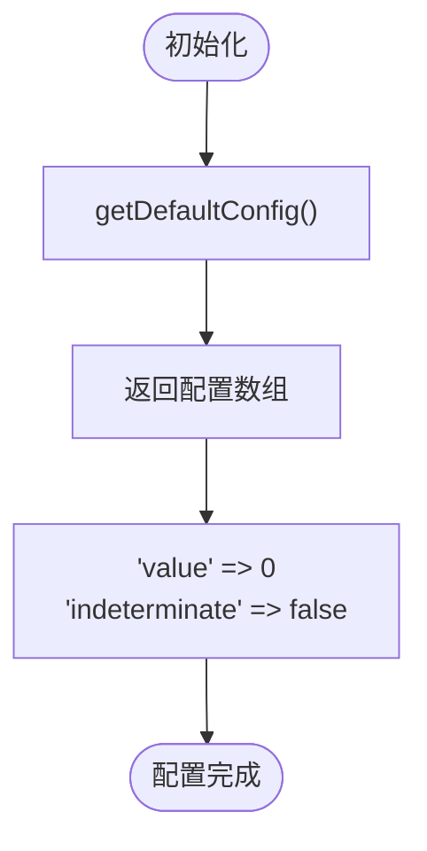

**图表来源**
- [ProgressBarBuilder.php](file://src/Components/ProgressBarBuilder.php#L11-L17)

#### 原生控件创建
进度条控件的创建过程遵循标准的组件构建模式：

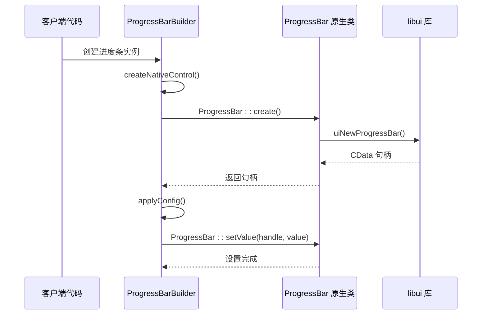

**图表来源**
- [ProgressBarBuilder.php](file://src/Components/ProgressBarBuilder.php#L19-L32)
- [ProgressBar.php](file://vendor/kingbes/libui/src/ProgressBar.php#L17-L43)

**章节来源**
- [ProgressBarBuilder.php](file://src/Components/ProgressBarBuilder.php#L19-L32)

### 原生库接口分析

ProgressBar 原生类提供了与 libui 库的直接接口：

#### 核心函数映射
| PHP 方法 | C 函数 | 参数 | 返回值 |
|---------|--------|------|--------|
| create() | uiNewProgressBar() | 无 | CData |
| value() | uiProgressBarValue() | CData $progressBar | int |
| setValue() | uiProgressBarSetValue() | CData $progressBar, int $value | void |

**章节来源**
- [ProgressBar.php](file://vendor/kingbes/libui/src/ProgressBar.php#L17-L43)
- [Libui.h](file://vendor/kingbes/libui/src/Libui.h#L168-L171)

## 进度条模式详解

ProgressBarBuilder 支持两种不同的进度显示模式，每种模式都有其特定的使用场景和实现机制。

### 确定性进度模式

确定性进度模式用于显示已知完成百分比的任务进度：

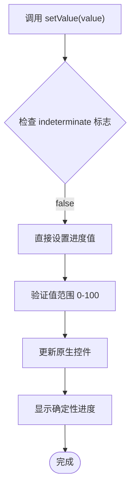

**图表来源**
- [ProgressBarBuilder.php](file://src/Components/ProgressBarBuilder.php#L29-L31)

#### 特点
- **精确控制**：可以设置具体的进度百分比
- **用户友好**：提供明确的完成预期
- **适用场景**：文件下载、数据处理等有明确步骤的任务

### 不确定性动画模式

不确定性模式通过动画效果表示正在进行但进度未知的操作：

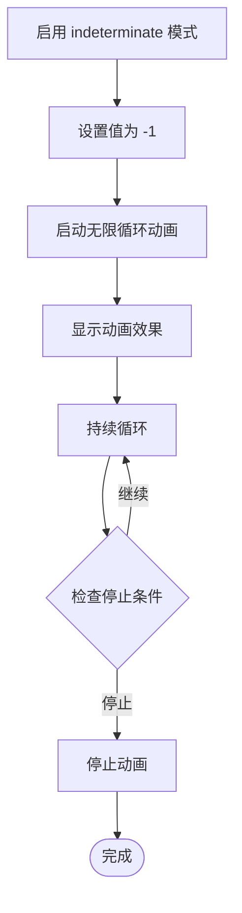

**图表来源**
- [ProgressBarBuilder.php](file://src/Components/ProgressBarBuilder.php#L27-L28)

#### 实现机制
当 `indeterminate(true)` 被调用时，`applyConfig()` 方法会执行以下逻辑：
1. 检查 `indeterminate` 配置标志
2. 如果为真，调用 `ProgressBar::setValue($this->handle, -1)`
3. libui 库接收到 -1 值后自动切换到动画模式

**章节来源**
- [ProgressBarBuilder.php](file://src/Components/ProgressBarBuilder.php#L27-L31)

## 进度状态管理

### 读写操作机制

ProgressBarBuilder 提供了完整的进度状态读写功能：

#### getValue() 方法
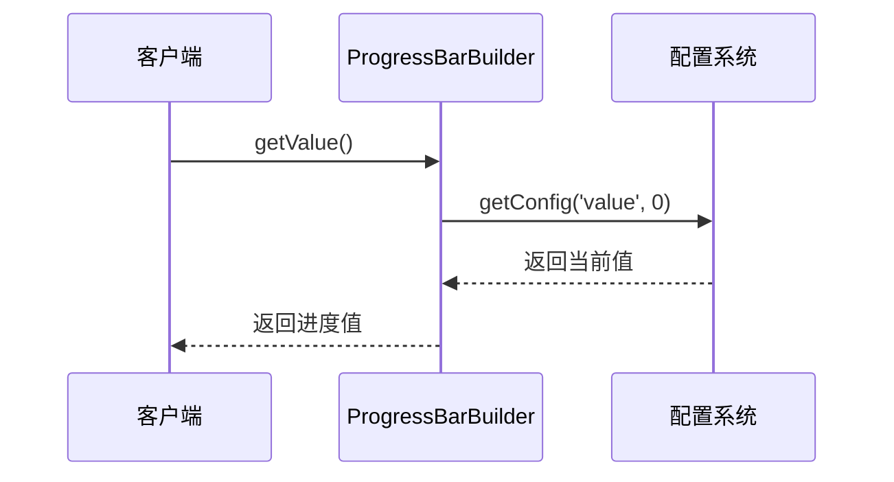

**图表来源**
- [ProgressBarBuilder.php](file://src/Components/ProgressBarBuilder.php#L34-L37)

#### setValue() 方法
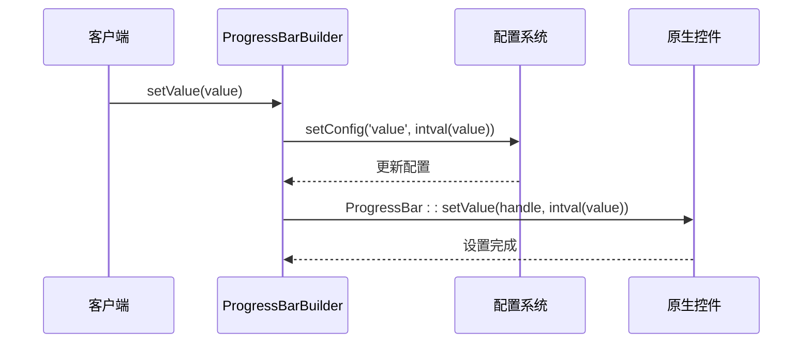

**图表来源**
- [ProgressBarBuilder.php](file://src/Components/ProgressBarBuilder.php#L39-L45)

### 链式调用支持

ProgressBarBuilder 支持流畅的链式调用语法：

| 方法 | 参数 | 返回值 | 用途 |
|------|------|--------|------|
| value(int $value) | 进度值 | static | 设置进度值 |
| indeterminate(bool $indeterminate) | 是否启用 | static | 切换模式 |

**章节来源**
- [ProgressBarBuilder.php](file://src/Components/ProgressBarBuilder.php#L47-L55)

## 使用示例

### 静态进度显示

在 example/full.php 中展示了静态进度条的使用方式：

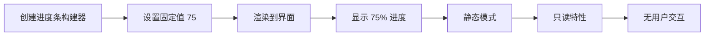

**图表来源**
- [full.php](file://example/full.php#L117-L118)

#### 示例代码结构
```php
// 静态进度条创建
Builder::progressBar()->value(75)
```

这种使用方式适用于：
- 显示已完成的任务比例
- 展示预设的进度状态
- 作为装饰性元素

**章节来源**
- [full.php](file://example/full.php#L117-L118)

### 动态进度更新

虽然静态使用方式简单直观，但更推荐结合定时器或后台任务实现动态更新：

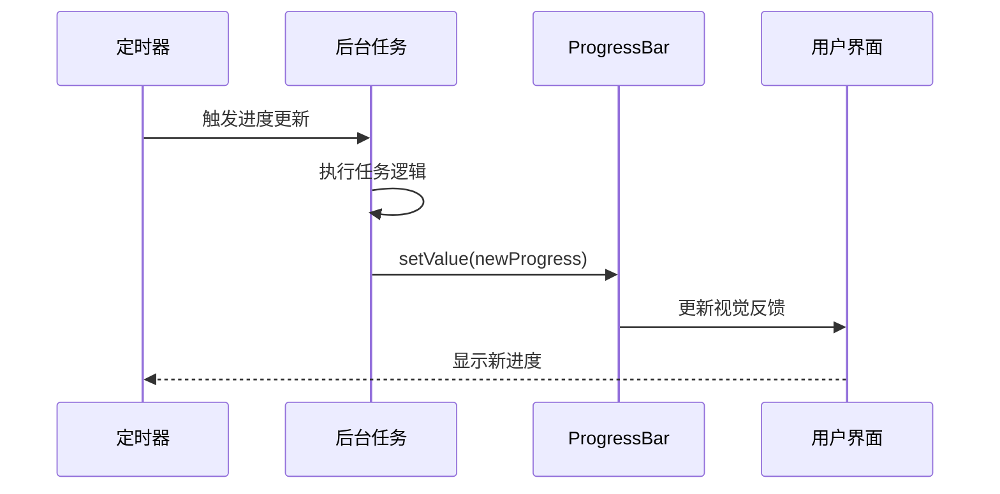

#### 推荐实践
1. **定时器驱动**：使用 `uiTimer` 创建定期更新
2. **事件驱动**：基于任务完成事件更新进度
3. **异步处理**：在后台线程中执行耗时操作
4. **状态同步**：确保 UI 线程的安全更新

### 只读特性说明

ProgressBarBuilder 的只读特性确保了用户体验的一致性：

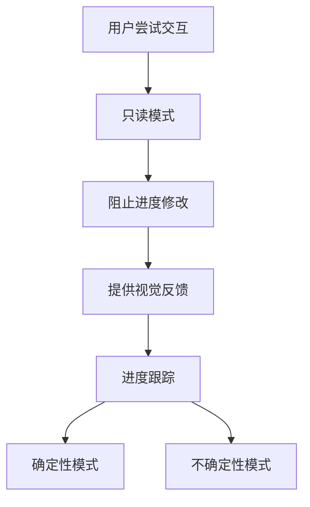

**章节来源**
- [ProgressBarBuilder.php](file://src/Components/ProgressBarBuilder.php#L34-L55)

## 性能考虑

### 内存管理
- **句柄管理**：自动管理原生控件句柄的生命周期
- **配置缓存**：本地缓存配置避免重复查询
- **延迟创建**：按需创建原生控件

### 渲染优化
- **最小化更新**：仅在值变化时更新原生控件
- **批量操作**：支持配置的批量设置
- **资源复用**：同一实例可多次使用

### 平台兼容性
- **跨平台支持**：统一的 API 在不同平台上表现一致
- **原生优化**：利用 libui 库的平台特定优化

## 故障排除指南

### 常见问题及解决方案

#### 进度条不显示
**可能原因**：
- 未正确添加到父容器
- 父容器未显示

**解决方案**：
```php
// 确保正确嵌套
Builder::vbox()->contains([
    Builder::progressBar()->value(50)
]);
```

#### 不确定性模式不工作
**可能原因**：
- 未正确设置 indeterminate 标志
- 值被意外覆盖

**解决方案**：
```php
// 明确启用不确定性模式
Builder::progressBar()
    ->indeterminate(true)
    ->value(-1); // -1 是特殊值
```

#### 进度更新不及时
**可能原因**：
- 更新频率过高
- UI 线程阻塞

**解决方案**：
```php
// 使用适当的更新间隔
uiTimer(100, function() {
    $progressBar->setValue($newProgress);
    return 1; // 继续定时器
}, null);
```

**章节来源**
- [ProgressBarBuilder.php](file://src/Components/ProgressBarBuilder.php#L19-L32)

## 结论

ProgressBarBuilder 提供了一个功能完整且易于使用的进度条控件实现。其双模式设计满足了从简单静态显示到复杂动态更新的各种需求，而只读特性确保了用户体验的一致性和可靠性。

### 主要优势
- **灵活的模式支持**：确定性和不确定性模式满足不同使用场景
- **简洁的 API 设计**：直观的方法命名和链式调用语法
- **强大的扩展性**：基于 libui 库的稳定性和跨平台支持
- **安全的只读特性**：防止意外的用户干扰

### 最佳实践建议
1. **根据场景选择模式**：确定性模式用于已知进度的任务，不确定性模式用于未知时长的操作
2. **合理规划更新策略**：避免过于频繁的进度更新影响性能
3. **注意用户体验**：提供清晰的进度指示和适当的视觉反馈
4. **充分利用链式调用**：简化代码结构提高可读性

ProgressBarBuilder 作为 libuiBuilder 框架的重要组成部分，为开发者提供了构建现代桌面应用程序所需的基本控件之一，是创建用户友好界面的理想选择。