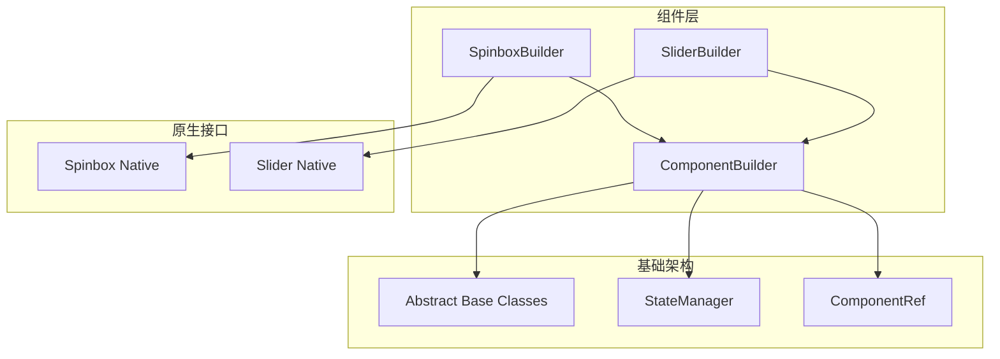
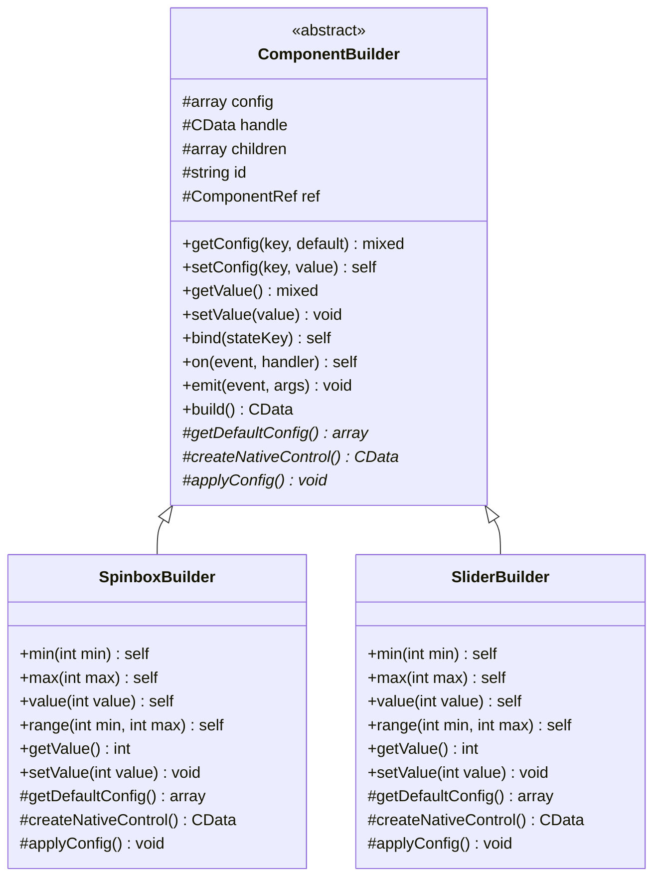
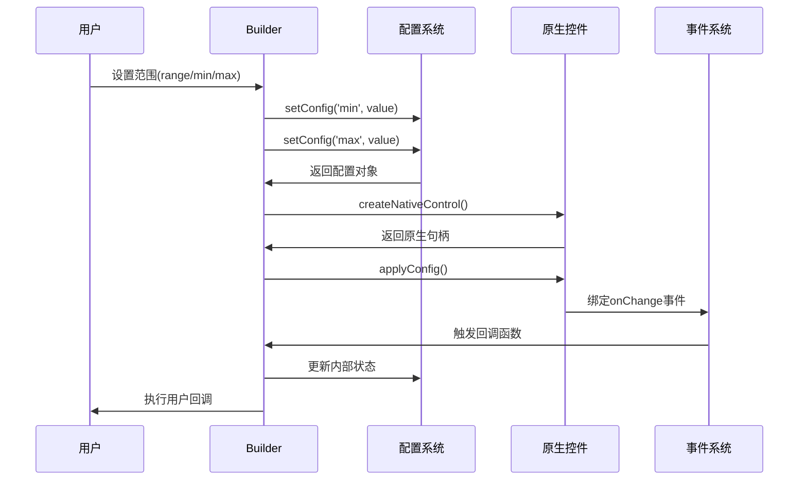
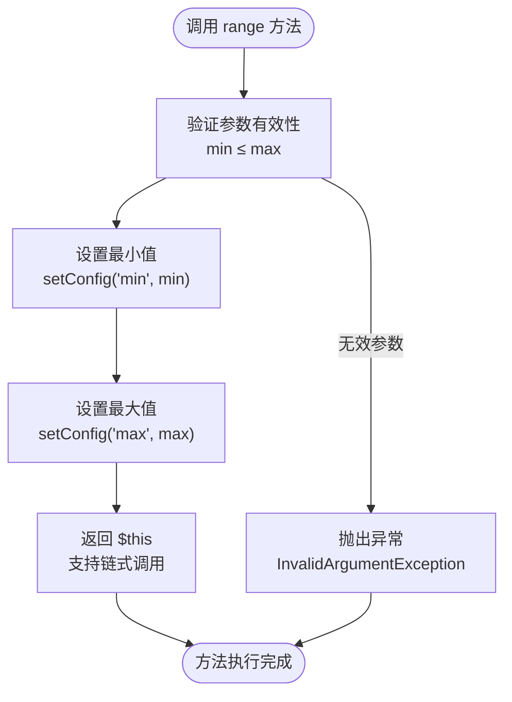
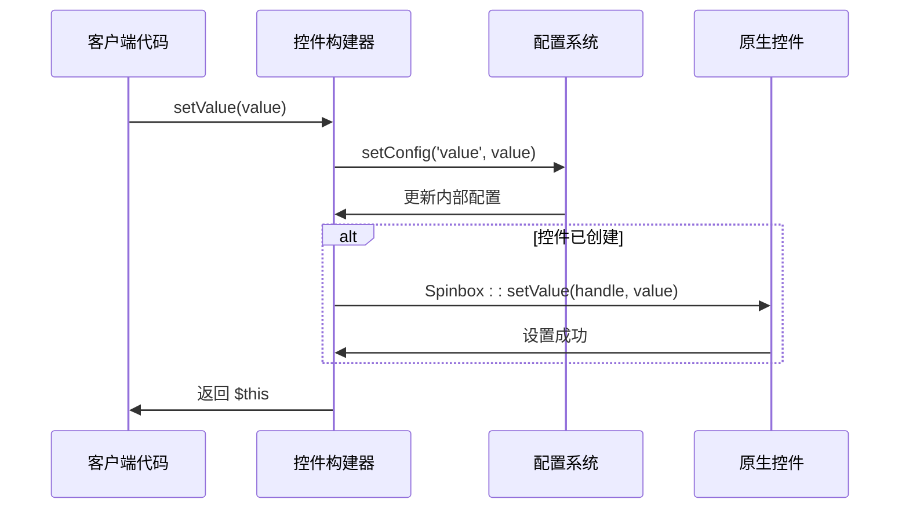
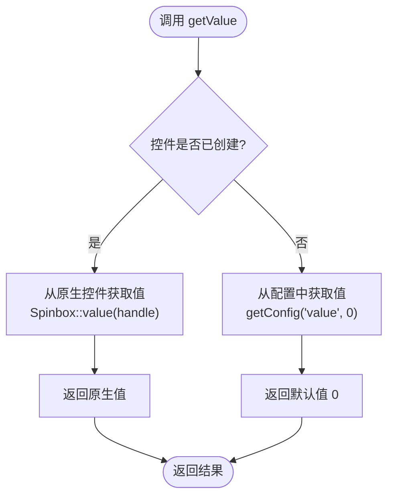
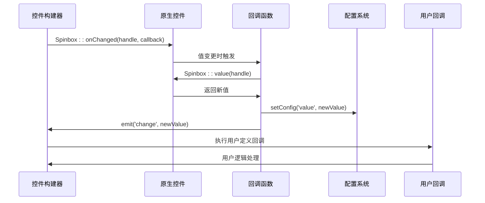
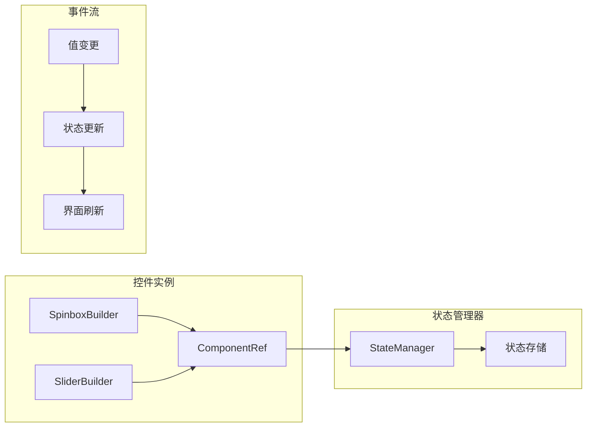
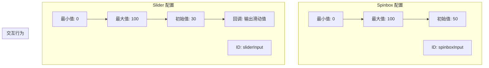
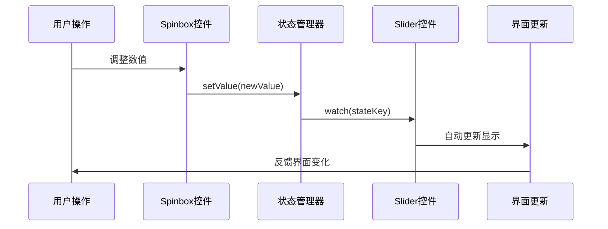

# SpinboxBuilder 与 SliderBuilder 数值控制控件

<cite>
**本文档中引用的文件**
- [SpinboxBuilder.php](file://src/Components/SpinboxBuilder.php)
- [SliderBuilder.php](file://src/Components/SliderBuilder.php)
- [ComponentBuilder.php](file://src/ComponentBuilder.php)
- [full.php](file://example/full.php)
- [ComponentRef.php](file://src/State/ComponentRef.php)
</cite>

## 目录
1. [简介](#简介)
2. [项目结构概览](#项目结构概览)
3. [核心组件分析](#核心组件分析)
4. [架构设计](#架构设计)
5. [详细组件分析](#详细组件分析)
6. [配置验证与状态绑定](#配置验证与状态绑定)
7. [用户交互示例](#用户交互示例)
8. [性能考虑](#性能考虑)
9. [故障排除指南](#故障排除指南)
10. [总结](#总结)

## 简介

SpinboxBuilder 和 SliderBuilder 是 libuiBuilder 框架中专门用于处理数值输入的两个核心控件。它们为用户提供两种不同的数值选择体验：SpinboxBuilder 通过上下箭头进行精确的逐级调整，而 SliderBuilder 则通过拖动滑块实现快速的范围选择。这两个控件都继承自统一的 ComponentBuilder 基类，提供了标准化的配置管理和事件处理机制。

## 项目结构概览

libuiBuilder 采用模块化的组件架构，将不同类型的控件分离到独立的文件中：



**图表来源**
- [SpinboxBuilder.php](file://src/Components/SpinboxBuilder.php#L1-L78)
- [SliderBuilder.php](file://src/Components/SliderBuilder.php#L1-L78)
- [ComponentBuilder.php](file://src/ComponentBuilder.php#L1-L234)

**章节来源**
- [SpinboxBuilder.php](file://src/Components/SpinboxBuilder.php#L1-L78)
- [SliderBuilder.php](file://src/Components/SliderBuilder.php#L1-L78)
- [ComponentBuilder.php](file://src/ComponentBuilder.php#L1-L234)

## 核心组件分析

### SpinboxBuilder 实现特性

SpinboxBuilder 提供精确的数值调整体验，适用于需要精细控制的场景：

- **默认配置**：最小值 0，最大值 100，初始值 0
- **交互方式**：通过上下箭头按钮进行逐级调整
- **精度控制**：支持整数级别的精确调整
- **事件处理**：实时响应值变更并触发回调

### SliderBuilder 实现特性

SliderBuilder 提供直观的数值选择体验，适用于快速范围调整：

- **默认配置**：最小值 0，最大值 100，初始值 0  
- **交互方式**：通过拖动滑块进行连续选择
- **视觉反馈**：提供直观的数值范围可视化
- **性能优化**：适合大范围数值的选择场景

**章节来源**
- [SpinboxBuilder.php](file://src/Components/SpinboxBuilder.php#L11-L18)
- [SliderBuilder.php](file://src/Components/SliderBuilder.php#L11-L18)

## 架构设计

### 继承关系图



**图表来源**
- [ComponentBuilder.php](file://src/ComponentBuilder.php#L11-L234)
- [SpinboxBuilder.php](file://src/Components/SpinboxBuilder.php#L9-L78)
- [SliderBuilder.php](file://src/Components/SliderBuilder.php#L9-L78)

### 配置管理系统

两个控件都采用了统一的配置管理模式：



**图表来源**
- [ComponentBuilder.php](file://src/ComponentBuilder.php#L95-L109)
- [SpinboxBuilder.php](file://src/Components/SpinboxBuilder.php#L21-L43)
- [SliderBuilder.php](file://src/Components/SliderBuilder.php#L21-L43)

**章节来源**
- [ComponentBuilder.php](file://src/ComponentBuilder.php#L95-L109)
- [SpinboxBuilder.php](file://src/Components/SpinboxBuilder.php#L21-L43)
- [SliderBuilder.php](file://src/Components/SliderBuilder.php#L21-L43)

## 详细组件分析

### range(min, max) 方法实现

range 方法是两个控件的核心配置方法，提供了灵活的范围设置能力：

#### 实现逻辑分析



**图表来源**
- [SpinboxBuilder.php](file://src/Components/SpinboxBuilder.php#L73-L77)
- [SliderBuilder.php](file://src/Components/SliderBuilder.php#L73-L77)

#### 参数验证机制

两个控件都依赖于基础的配置验证机制，确保范围设置的合理性：

- **最小值检查**：确保最小值不超过最大值
- **类型转换**：自动将输入值转换为整数类型
- **链式调用**：支持连续的配置设置

### value(val) 方法实现

value 方法负责设置和获取控件的当前数值：

#### 设置流程



**图表来源**
- [SpinboxBuilder.php](file://src/Components/SpinboxBuilder.php#L51-L57)
- [SliderBuilder.php](file://src/Components/SliderBuilder.php#L51-L57)

#### 获取流程



**图表来源**
- [SpinboxBuilder.php](file://src/Components/SpinboxBuilder.php#L46-L49)
- [SliderBuilder.php](file://src/Components/SliderBuilder.php#L46-L49)

### onChange 回调机制

两个控件都实现了统一的事件处理机制：

#### 事件绑定流程



**图表来源**
- [SpinboxBuilder.php](file://src/Components/SpinboxBuilder.php#L34-L42)
- [SliderBuilder.php](file://src/Components/SliderBuilder.php#L34-L42)

#### 回调执行顺序

1. **原生值获取**：从原生控件获取最新的数值
2. **配置更新**：同步更新内部配置状态
3. **事件发射**：触发 change 事件通知监听器
4. **用户回调**：执行用户定义的 onChange 处理函数

**章节来源**
- [SpinboxBuilder.php](file://src/Components/SpinboxBuilder.php#L51-L77)
- [SliderBuilder.php](file://src/Components/SliderBuilder.php#L51-L77)
- [SpinboxBuilder.php](file://src/Components/SpinboxBuilder.php#L34-L42)
- [SliderBuilder.php](file://src/Components/SliderBuilder.php#L34-L42)

## 配置验证与状态绑定

### 统一配置管理

两个控件都继承了 ComponentBuilder 的配置管理能力：

| 配置项 | 类型 | 默认值 | 描述 |
|--------|------|--------|------|
| min | int | 0 | 数值范围最小值 |
| max | int | 100 | 数值范围最大值 |
| value | int | 0 | 当前数值 |
| onChange | callable | null | 值变更回调函数 |

### 状态绑定机制



**图表来源**
- [ComponentBuilder.php](file://src/ComponentBuilder.php#L135-L146)
- [ComponentRef.php](file://src/State/ComponentRef.php#L1-L74)

### 验证规则

1. **范围验证**：确保 min ≤ max
2. **类型验证**：所有数值参数必须为整数
3. **边界检查**：值必须在指定范围内
4. **回调验证**：onChange 回调必须是可调用的函数

**章节来源**
- [ComponentBuilder.php](file://src/ComponentBuilder.php#L135-L146)
- [ComponentRef.php](file://src/State/ComponentRef.php#L1-L74)

## 用户交互示例

### 在 full.php 示例中的应用

在完整的示例中，SpinboxBuilder 和 SliderBuilder 展示了不同的用户体验：

#### 数字输入控件配置



**图表来源**
- [full.php](file://example/full.php#L92-L103)

#### 实际使用效果对比

| 特性 | SpinboxBuilder | SliderBuilder |
|------|----------------|---------------|
| **交互方式** | 上下箭头点击 | 滑块拖拽 |
| **精度控制** | 整数级别精确 | 连续范围选择 |
| **适用场景** | 需要精确数值 | 快速范围调整 |
| **视觉反馈** | 数字显示 | 进度条可视化 |
| **学习成本** | 较低 | 较低 |

### 状态管理集成

两个控件都支持与状态管理系统的深度集成：



**图表来源**
- [full.php](file://example/full.php#L145-L151)

**章节来源**
- [full.php](file://example/full.php#L92-L103)

## 性能考虑

### 内存管理

两个控件都采用了高效的内存管理模式：

- **延迟初始化**：控件仅在首次使用时创建原生实例
- **句柄缓存**：原生句柄被缓存在组件实例中
- **垃圾回收**：通过 PHP 的垃圾回收机制管理资源

### 事件处理优化

- **事件去重**：避免重复的值变更事件触发
- **异步回调**：用户回调在事件循环中异步执行
- **内存泄漏防护**：及时清理事件监听器

### 渲染性能

- **批量更新**：支持多个配置同时设置
- **增量渲染**：仅在必要时更新界面
- **缓存策略**：缓存计算结果避免重复运算

## 故障排除指南

### 常见问题及解决方案

#### 1. 范围设置错误

**问题描述**：设置的最小值大于最大值

**解决方案**：
```php
// 错误做法
$builder->range(100, 0); // 最小值 > 最大值

// 正确做法
$builder->range(0, 100); // 最小值 ≤ 最大值
```

#### 2. 回调函数未执行

**问题描述**：onChange 回调没有被触发

**排查步骤**：
1. 检查回调函数是否正确设置
2. 确认控件已经创建并绑定事件
3. 验证回调函数的签名是否正确

#### 3. 状态绑定失效

**问题描述**：状态管理器无法同步控件值

**解决方案**：
- 确保控件有唯一的 ID
- 检查状态键名是否正确
- 验证状态管理器是否已初始化

### 调试技巧

1. **启用调试模式**：在开发环境中启用详细的日志记录
2. **检查原生句柄**：确认控件已正确创建
3. **验证事件绑定**：测试事件回调是否正常工作
4. **状态一致性检查**：比较配置值与实际值的一致性

**章节来源**
- [ComponentBuilder.php](file://src/ComponentBuilder.php#L95-L109)

## 总结

SpinboxBuilder 和 SliderBuilder 作为 libuiBuilder 框架中的核心数值控制控件，展现了优秀的软件架构设计原则：

### 设计优势

1. **统一抽象**：通过 ComponentBuilder 基类提供一致的 API 接口
2. **灵活配置**：支持链式调用和多种配置方式
3. **事件驱动**：完善的事件处理机制支持响应式编程
4. **状态管理**：与框架的状态管理系统无缝集成
5. **扩展性强**：易于添加新的配置选项和功能特性

### 使用建议

1. **根据需求选择**：Spinbox 适合需要精确控制的场景，Slider 适合快速范围选择
2. **合理设置范围**：确保范围设置符合业务逻辑和用户体验要求
3. **优化回调性能**：避免在回调函数中执行耗时操作
4. **充分利用状态绑定**：通过状态管理简化复杂的数据流处理

### 技术特色

- **原生控件集成**：直接映射到 libui 的原生控件，保证性能和兼容性
- **类型安全**：严格的类型检查和参数验证
- **内存高效**：智能的资源管理和生命周期控制
- **可测试性**：清晰的接口设计便于单元测试和集成测试

这两个控件不仅为开发者提供了强大的数值输入能力，更展示了现代 GUI 框架中组件设计的最佳实践。通过统一的架构设计和灵活的配置管理，它们成功地平衡了易用性和功能性，为构建高质量的桌面应用程序奠定了坚实的基础。