# 基础控件

<cite>
**本文档引用的文件**  
- [ComponentBuilder.php](file://src/ComponentBuilder.php)
- [ButtonBuilder.php](file://src/Components/ButtonBuilder.php)
- [LabelBuilder.php](file://src/Components/LabelBuilder.php)
- [EntryBuilder.php](file://src/Components/EntryBuilder.php)
- [MultilineEntryBuilder.php](file://src/Components/MultilineEntryBuilder.php)
- [CheckboxBuilder.php](file://src/Components/CheckboxBuilder.php)
- [RadioBuilder.php](file://src/Components/RadioBuilder.php)
- [ComboboxBuilder.php](file://src/Components/ComboboxBuilder.php)
- [SpinboxBuilder.php](file://src/Components/SpinboxBuilder.php)
- [SliderBuilder.php](file://src/Components/SliderBuilder.php)
- [ProgressBarBuilder.php](file://src/Components/ProgressBarBuilder.php)
- [CanvasBuilder.php](file://src/Components/CanvasBuilder.php)
- [SeparatorBuilder.php](file://src/Components/SeparatorBuilder.php)
- [helper.php](file://src/helper.php)
- [simple.php](file://example/simple.php)
</cite>

## 目录
1. [引言](#引言)
2. [控件体系架构](#控件体系架构)
3. [基础控件详解](#基础控件详解)
   - [ButtonBuilder](#buttonbuilder)
   - [LabelBuilder](#labelbuilder)
   - [输入类控件](#输入类控件)
     - [EntryBuilder](#entrybuilder)
     - [MultilineEntryBuilder](#multilineentrybuilder)
   - [选择类控件](#选择类控件)
     - [CheckboxBuilder](#checkboxbuilder)
     - [RadioBuilder](#radiobuilder)
     - [ComboboxBuilder](#comboboxbuilder)
   - [数值控制类控件](#数值控制类控件)
     - [SpinboxBuilder](#spinboxbuilder)
     - [SliderBuilder](#sliderbuilder)
   - [状态显示类控件](#状态显示类控件)
     - [ProgressBarBuilder](#progressbarbuilder)
   - [其他控件](#其他控件)
     - [CanvasBuilder](#canvasbuilder)
     - [SeparatorBuilder](#separatorbuilder)
4. [便捷方法封装](#便捷方法封装)
5. [控件继承关系与核心方法](#控件继承关系与核心方法)

## 引言

libuiBuilder 提供了一套完整的桌面应用程序UI控件系统，所有控件均继承自 `ComponentBuilder` 基类，遵循统一的构建模式。本文档系统性地介绍所有基础UI控件的用途、视觉表现、交互行为及其核心实现机制，重点分析控件如何通过继承实现 `getDefaultConfig`、`createNativeControl` 和 `applyConfig` 三个核心抽象方法。

这些控件覆盖了用户界面开发中的主要交互场景，包括按钮、标签、文本输入、选择控件、数值调节、进度显示等，为构建功能完整的桌面应用提供了坚实的基础。

## 控件体系架构

```mermaid
classDiagram
class ComponentBuilder {
<<abstract>>
+array config
+CData handle
+array children
+ComponentBuilder parent
+string id
+ComponentRef ref
+string boundState
+array eventHandlers
+__construct(config)
+build() CData
+contains(children) static
+addChild(child) static
+setConfig(key, value) static
+__call(name, args) static
+id(id) static
+bind(stateKey) static
+on(event, handler) static
+getValue() mixed
+setValue(value) void
+getConfig(key, default) mixed
+emit(event, args) void
+getRef(id) ComponentRef
+state() StateManager
}
class ButtonBuilder {
+getDefaultConfig() array
+createNativeControl() CData
+applyConfig() void
+text(text) static
+onClick(callback) static
}
class LabelBuilder {
+getDefaultConfig() array
+createNativeControl() CData
+applyConfig() void
+getValue() string
+setValue(value) void
+text(text) static
+align(align) static
+color(color) static
}
class EntryBuilder {
+getDefaultConfig() array
+createNativeControl() CData
+applyConfig() void
+getValue() string
+setValue(value) void
+text(text) static
+placeholder(placeholder) static
+onChange(callback) static
}
class MultilineEntryBuilder {
+getDefaultConfig() array
+createNativeControl() CData
+applyConfig() void
+getValue() string
+setValue(value) void
+text(text) static
+readOnly(readOnly) static
+wordWrap(wordWrap) static
+placeholder(placeholder) static
}
class CheckboxBuilder {
+getDefaultConfig() array
+createNativeControl() CData
+applyConfig() void
+getValue() bool
+setValue(value) void
+text(text) static
+checked(checked) static
+disabled(disabled) static
+onToggle(callback) static
+toggle() static
}
class RadioBuilder {
+getDefaultConfig() array
+createNativeControl() CData
+applyConfig() void
+getValue() int
+setValue(value) void
+items(items) static
+addItem(text, value) static
+selected(selected) static
}
class ComboboxBuilder {
+getDefaultConfig() array
+createNativeControl() CData
+applyConfig() void
+getValue() mixed
+setValue(value) void
+items(items) static
+addItem(text, value) static
+selected(index) static
+placeholder(placeholder) static
+editable(editable) static
+onSelected(callback) static
+clear() static
+removeItem(index) static
}
class SpinboxBuilder {
+getDefaultConfig() array
+createNativeControl() CData
+applyConfig() void
+getValue() int
+setValue(value) void
+min(min) static
+max(max) static
+value(value) static
+range(min, max) static
}
class SliderBuilder {
+getDefaultConfig() array
+createNativeControl() CData
+applyConfig() void
+getValue() int
+setValue(value) void
+min(min) static
+max(max) static
+value(value) static
+range(min, max) static
}
class ProgressBarBuilder {
+getDefaultConfig() array
+createNativeControl() CData
+applyConfig() void
+getValue() int
+setValue(value) void
+value(value) static
+indeterminate(indeterminate) static
}
class CanvasBuilder {
+getDefaultConfig() array
+createNativeControl() CData
+applyConfig() void
+onDraw(area, params) void
+onMouseEvent(area, event) void
+onKeyEvent(area, event) bool
+rect(x, y, w, h, color) static
+circle(cx, cy, radius, color) static
+line(x1, y1, x2, y2, color, width) static
+text(text, x, y, color) static
+clear() static
+redraw() static
}
class SeparatorBuilder {
+getDefaultConfig() array
+createNativeControl() CData
+applyConfig() void
+getValue() null
+setValue(value) void
+horizontal() static
+vertical() static
+orientation(orientation) static
+spacing(spacing) static
}
ComponentBuilder <|-- ButtonBuilder
ComponentBuilder <|-- LabelBuilder
ComponentBuilder <|-- EntryBuilder
ComponentBuilder <|-- MultilineEntryBuilder
ComponentBuilder <|-- CheckboxBuilder
ComponentBuilder <|-- RadioBuilder
ComponentBuilder <|-- ComboboxBuilder
ComponentBuilder <|-- SpinboxBuilder
ComponentBuilder <|-- SliderBuilder
ComponentBuilder <|-- ProgressBarBuilder
ComponentBuilder <|-- CanvasBuilder
ComponentBuilder <|-- SeparatorBuilder
```



**图示来源**  
- [ComponentBuilder.php](file://src/ComponentBuilder.php#L11-L234)
- [ButtonBuilder.php](file://src/Components/ButtonBuilder.php#L9-L48)
- [LabelBuilder.php](file://src/Components/LabelBuilder.php#L9-L62)
- [EntryBuilder.php](file://src/Components/EntryBuilder.php#L9-L80)
- [MultilineEntryBuilder.php](file://src/Components/MultilineEntryBuilder.php#L9-L86)
- [CheckboxBuilder.php](file://src/Components/CheckboxBuilder.php#L9-L97)
- [RadioBuilder.php](file://src/Components/RadioBuilder.php#L9-L80)
- [ComboboxBuilder.php](file://src/Components/ComboboxBuilder.php#L10-L258)
- [SpinboxBuilder.php](file://src/Components/SpinboxBuilder.php#L9-L78)
- [SliderBuilder.php](file://src/Components/SliderBuilder.php#L9-L78)
- [ProgressBarBuilder.php](file://src/Components/ProgressBarBuilder.php#L9-L56)
- [CanvasBuilder.php](file://src/Components/CanvasBuilder.php#L11-L181)
- [SeparatorBuilder.php](file://src/Components/SeparatorBuilder.php#L9-L65)

## 基础控件详解

### ButtonBuilder

`ButtonBuilder` 用于创建可点击的按钮控件，是用户触发操作的主要方式。

- **用途**：执行操作、提交表单、导航等
- **视觉表现**：带有文本标签的矩形按钮
- **交互行为**：点击时触发 `onClick` 事件和 `click` 事件

**特有属性**：
- `text`：按钮显示的文本
- `onClick`：点击时执行的回调函数
- `stretchy`：是否在布局中拉伸

**事件**：
- `click`：当按钮被点击时触发

**Section sources**
- [ButtonBuilder.php](file://src/Components/ButtonBuilder.php#L9-L48)

### LabelBuilder

`LabelBuilder` 用于创建静态文本标签，用于显示信息或作为其他控件的说明。

- **用途**：显示静态文本、作为表单字段的标签
- **视觉表现**：不可编辑的文本
- **交互行为**：通常不可交互，但可用于辅助导航

**特有属性**：
- `text`：标签显示的文本
- `align`：文本对齐方式（left, center, right）
- `color`：文本颜色
- `font`：字体设置

**事件**：无特定事件

**Section sources**
- [LabelBuilder.php](file://src/Components/LabelBuilder.php#L9-L62)

### 输入类控件

#### EntryBuilder

`EntryBuilder` 创建单行文本输入框，用于接收用户输入的文本。

- **用途**：用户名、邮箱、搜索框等单行文本输入
- **视觉表现**：单行文本输入区域
- **交互行为**：用户输入时实时触发 `onChange` 事件

**特有属性**：
- `text`：输入框的当前文本
- `placeholder`：占位符文本
- `readOnly`：是否只读
- `onChange`：文本改变时的回调

**事件**：
- `change`：当文本内容改变时触发

**Section sources**
- [EntryBuilder.php](file://src/Components/EntryBuilder.php#L9-L80)

#### MultilineEntryBuilder

`MultilineEntryBuilder` 创建多行文本输入框，支持文本换行。

- **用途**：长文本输入、注释、描述等
- **视觉表现**：多行文本输入区域，可带滚动条
- **交互行为**：支持换行输入，内容改变时触发 `onChange` 事件

**特有属性**：
- `text`：输入框的当前文本
- `readOnly`：是否只读
- `wordWrap`：是否自动换行
- `maxLength`：最大字符长度
- `placeholder`：占位符文本

**事件**：
- `change`：当文本内容改变时触发

**Section sources**
- [MultilineEntryBuilder.php](file://src/Components/MultilineEntryBuilder.php#L9-L86)

### 选择类控件

#### CheckboxBuilder

`CheckboxBuilder` 创建复选框控件，用于二元选择或多项选择。

- **用途**：同意协议、选项选择等
- **视觉表现**：方框加文本标签，可勾选/取消勾选
- **交互行为**：点击切换选中状态

**特有属性**：
- `text`：复选框旁边的文本
- `checked`：是否被选中
- `disabled`：是否禁用
- `tristate`：是否支持三态（未选、选中、部分选中）
- `onToggle`：状态切换时的回调

**事件**：
- `change`：当选中状态改变时触发
- `toggle`：当状态切换时触发

**Section sources**
- [CheckboxBuilder.php](file://src/Components/CheckboxBuilder.php#L9-L97)

#### RadioBuilder

`RadioBuilder` 创建单选按钮组，用于从多个选项中选择一个。

- **用途**：性别选择、单选题等
- **视觉表现**：圆形按钮组，同一组中只能选择一个
- **交互行为**：点击选择某个选项，同一组其他选项自动取消选择

**特有属性**：
- `items`：选项列表
- `selected`：当前选中项的索引
- `onSelected`：选择改变时的回调

**事件**：
- `change`：当选择项改变时触发

**Section sources**
- [RadioBuilder.php](file://src/Components/RadioBuilder.php#L9-L80)

#### ComboboxBuilder

`ComboboxBuilder` 创建下拉组合框，结合了下拉列表和文本输入的功能。

- **用途**：从预设选项中选择，或在可编辑模式下输入自定义值
- **视觉表现**：下拉箭头加文本显示区域
- **交互行为**：点击下拉选择，可编辑模式下可直接输入

**特有属性**：
- `items`：下拉选项列表
- `selected`：当前选中项的索引
- `placeholder`：占位符文本
- `editable`：是否可编辑
- `onSelected`：选择改变时的回调
- `onChange`：值改变时的回调

**事件**：
- `change`：当选择或输入值改变时触发
- `selected`：当下拉选择改变时触发

**Section sources**
- [ComboboxBuilder.php](file://src/Components/ComboboxBuilder.php#L10-L258)

### 数值控制类控件

#### SpinboxBuilder

`SpinboxBuilder` 创建数值调节框，带有上下箭头按钮。

- **用途**：年龄、数量等数值输入
- **视觉表现**：文本框加上下调节箭头
- **交互行为**：点击箭头增减数值，可直接输入

**特有属性**：
- `min`：最小值
- `max`：最大值
- `value`：当前值
- `onChange`：值改变时的回调

**事件**：
- `change`：当数值改变时触发

**Section sources**
- [SpinboxBuilder.php](file://src/Components/SpinboxBuilder.php#L9-L78)

#### SliderBuilder

`SliderBuilder` 创建滑块控件，通过拖动滑块来选择数值。

- **用途**：音量控制、亮度调节等连续值选择
- **视觉表现**：水平或垂直的滑动条
- **交互行为**：拖动滑块改变数值

**特有属性**：
- `min`：最小值
- `max`：最大值
- `value`：当前值
- `onChange`：值改变时的回调

**事件**：
- `change`：当滑块位置改变时触发

**Section sources**
- [SliderBuilder.php](file://src/Components/SliderBuilder.php#L9-L78)

### 状态显示类控件

#### ProgressBarBuilder

`ProgressBarBuilder` 创建进度条，用于显示任务完成进度。

- **用途**：文件上传、数据加载等进度显示
- **视觉表现**：填充条，长度表示进度
- **交互行为**：通常为只读显示，不可交互

**特有属性**：
- `value`：当前进度值（0-100）
- `indeterminate`：是否为不确定模式（动画显示）

**事件**：无特定事件

**Section sources**
- [ProgressBarBuilder.php](file://src/Components/ProgressBarBuilder.php#L9-L56)

### 其他控件

#### CanvasBuilder

`CanvasBuilder` 创建绘图画布，支持自定义绘制图形。

- **用途**：图表绘制、游戏界面、自定义控件
- **视觉表现**：可绘制的矩形区域
- **交互行为**：支持鼠标和键盘事件，可进行动态绘制

**特有属性**：
- `width`：画布宽度
- `height`：画布高度
- `onDraw`：绘制回调
- `onMouseEvent`：鼠标事件回调
- `onKeyEvent`：键盘事件回调
- `backgroundColor`：背景颜色

**事件**：
- `draw`：需要重绘时触发
- `mouseEvent`：鼠标事件
- `keyEvent`：键盘事件

**便捷绘制方法**：
- `rect()`：绘制矩形
- `circle()`：绘制圆形
- `line()`：绘制线条
- `text()`：绘制文本
- `clear()`：清除画布
- `redraw()`：请求重绘

**Section sources**
- [CanvasBuilder.php](file://src/Components/CanvasBuilder.php#L11-L181)

#### SeparatorBuilder

`SeparatorBuilder` 创建分隔线，用于在界面中分隔不同区域。

- **用途**：视觉分隔不同的控件组
- **视觉表现**：水平或垂直的线条
- **交互行为**：无交互

**特有属性**：
- `orientation`：方向（horizontal, vertical）
- `spacing`：额外间距

**便捷方法**：
- `horizontal()`：创建水平分隔线
- `vertical()`：创建垂直分隔线

**Section sources**
- [SeparatorBuilder.php](file://src/Components/SeparatorBuilder.php#L9-L65)

## 便捷方法封装

libuiBuilder 提供了便捷的静态方法来简化常见控件的配置，这些方法封装在 `helper.php` 文件中，通过 `Builder` 类调用。

### passwordEntry()

`passwordEntry()` 方法创建一个用于密码输入的 `EntryBuilder` 实例，自动设置为密码输入模式。

```php
Builder::passwordEntry()
    ->placeholder('请输入密码')
    ->minLength(6)
    ->onChange(function ($value, $component) {
        // 处理密码输入
    });
```

该方法通过配置 `EntryBuilder` 的属性，将输入框设置为密码模式，隐藏输入内容。

**Section sources**
- [simple.php](file://example/simple.php#L40-L50)

### textarea()

`textarea()` 方法创建一个 `MultilineEntryBuilder` 实例，用于多行文本输入。

```php
Builder::textarea()
    ->placeholder('请输入您的反馈')
    ->wordWrap(true);
```

此方法简化了多行文本输入框的创建过程，提供了语义化的调用方式。

**Section sources**
- [helper.php](file://src/helper.php)

## 控件继承关系与核心方法

所有UI控件都继承自 `ComponentBuilder` 基类，必须实现三个核心抽象方法：

### ComponentBuilder 基类

`ComponentBuilder` 定义了所有控件的公共接口和行为：

- **配置管理**：通过 `setConfig` 和 `getConfig` 管理控件配置
- **事件系统**：通过 `on` 和 `emit` 实现事件订阅和发布
- **状态绑定**：通过 `bind` 方法与状态管理器集成
- **链式调用**：通过 `__call` 实现流畅的API调用

**Section sources**
- [ComponentBuilder.php](file://src/ComponentBuilder.php#L11-L234)

### 核心抽象方法

#### getDefaultConfig()

每个控件通过重写此方法定义其默认配置：

```php
protected function getDefaultConfig(): array
{
    return [
        'text' => 'Button',
        'onClick' => null,
        'stretchy' => false,
    ];
}
```

该方法返回一个数组，包含控件的所有可配置属性及其默认值。

#### createNativeControl()

此方法负责创建底层的原生控件实例：

```php
protected function createNativeControl(): CData
{
    return Button::create($this->getConfig('text'));
}
```

方法返回一个 `CData` 类型的句柄，指向底层UI库创建的原生控件。

#### applyConfig()

此方法将配置应用到已创建的原生控件上：

```php
protected function applyConfig(): void
{
    $onClick = $this->getConfig('onClick');
    if ($onClick) {
        Button::onClicked($this->handle, function() use ($onClick) {
            $this->emit('click');
            $onClick($this, $this->state());
        });
    }
}
```

该方法通常用于设置控件属性和绑定事件处理器。

### 控件构建流程

控件的构建遵循以下流程：
1. 构造函数中合并默认配置和用户配置
2. 调用 `build()` 方法时创建原生控件
3. 应用配置到原生控件
4. 构建子控件（容器控件）
5. 返回原生控件句柄

这个统一的构建模式确保了所有控件具有一致的创建和配置方式。

**Section sources**
- [ComponentBuilder.php](file://src/ComponentBuilder.php#L209-L231)
- [ButtonBuilder.php](file://src/Components/ButtonBuilder.php#L20-L37)