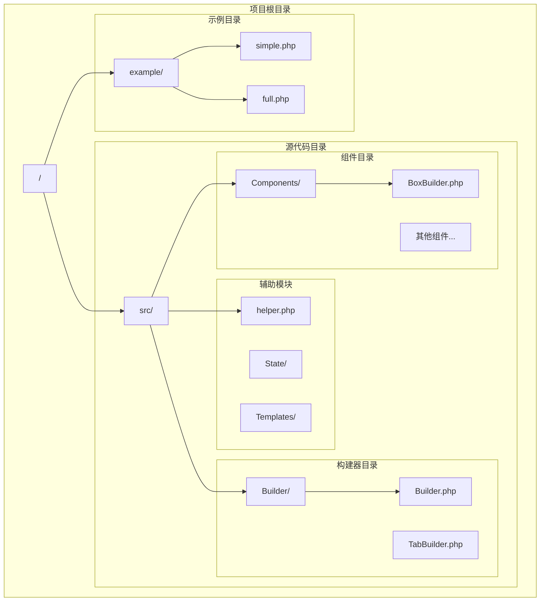
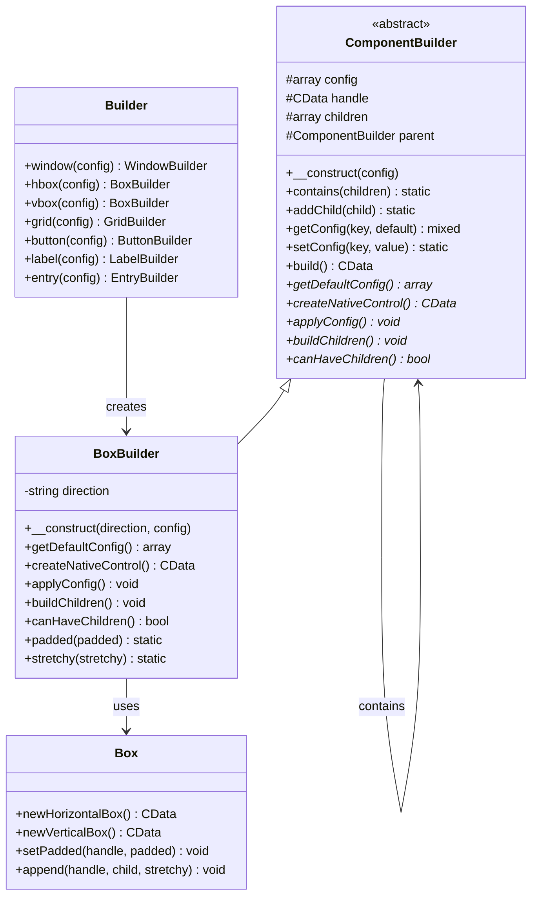
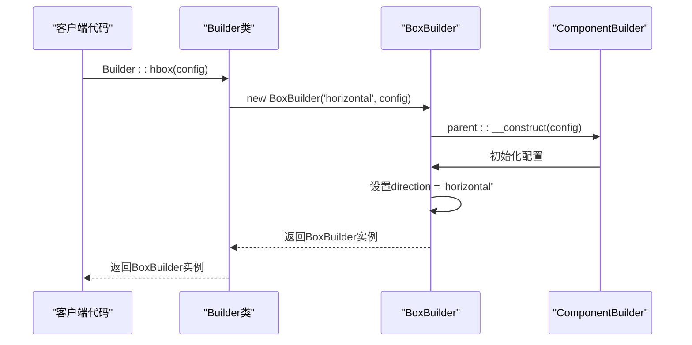
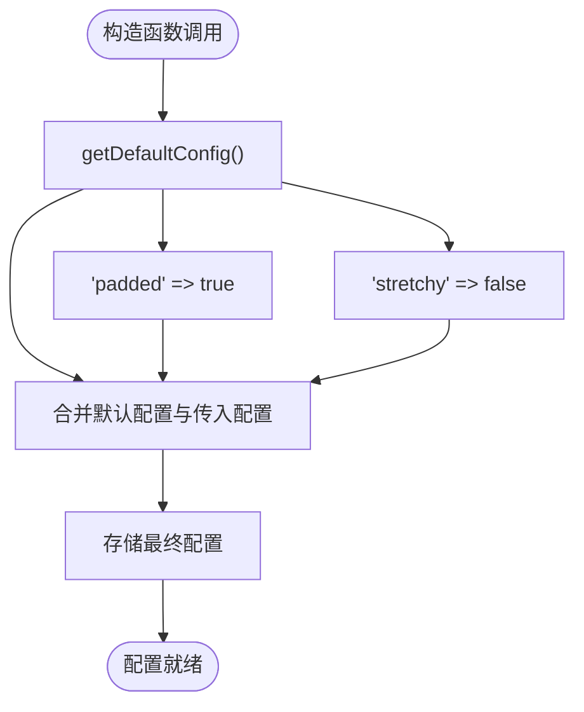
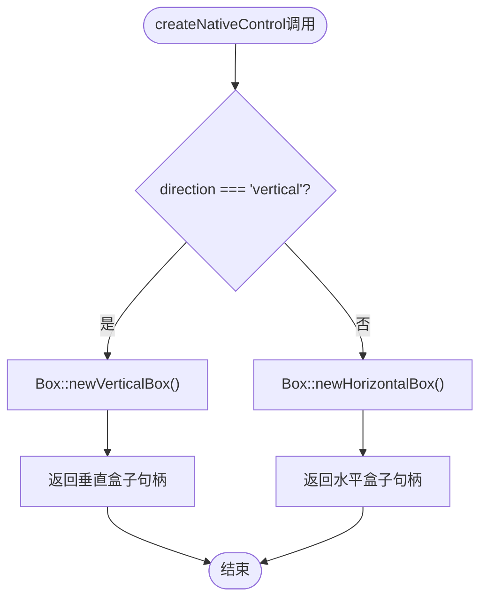
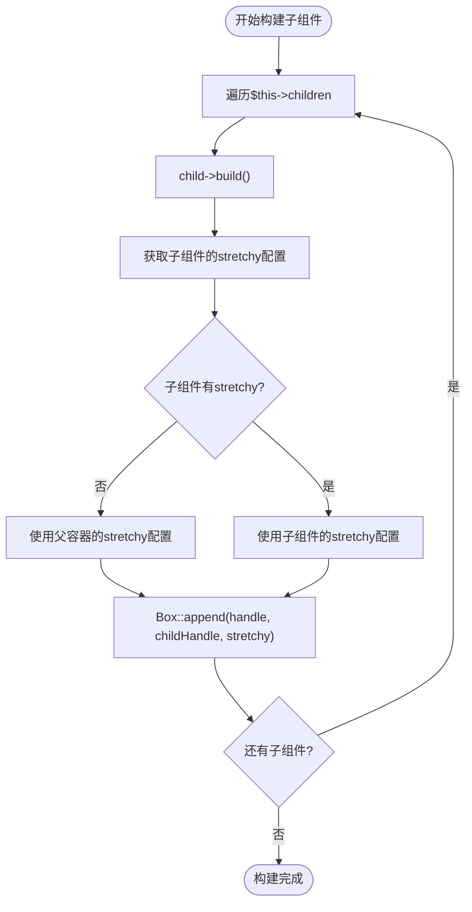
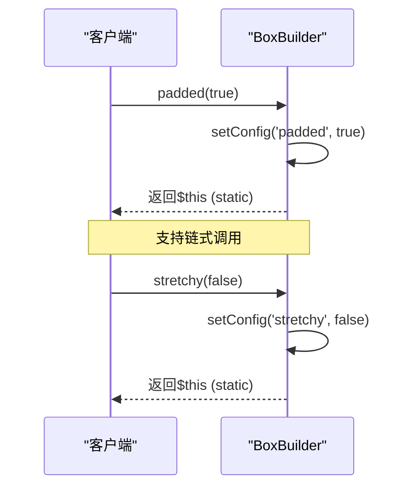
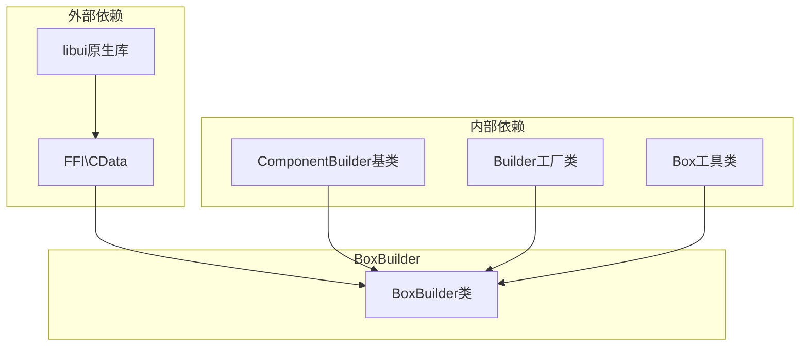

# BoxBuilder类深度文档

<cite>
**本文档中引用的文件**
- [BoxBuilder.php](file://src/Components/BoxBuilder.php)
- [Builder.php](file://src/Builder.php)
- [ComponentBuilder.php](file://src/ComponentBuilder.php)
- [simple.php](file://example/simple.php)
- [full.php](file://example/full.php)
</cite>

## 目录
1. [简介](#简介)
2. [项目结构概览](#项目结构概览)
3. [核心组件分析](#核心组件分析)
4. [架构概览](#架构概览)
5. [详细组件分析](#详细组件分析)
6. [依赖关系分析](#依赖关系分析)
7. [性能考虑](#性能考虑)
8. [故障排除指南](#故障排除指南)
9. [结论](#结论)

## 简介

BoxBuilder是libuiBuilder框架中实现弹性布局（水平/垂直）的基础容器类。它作为ComponentBuilder的扩展，提供了灵活的布局管理能力，支持水平布局（hbox）和垂直布局（vbox）两种基本方向。该类通过构造函数接收direction参数来区分不同的布局方向，并提供了丰富的配置选项和链式方法来控制布局行为。

BoxBuilder的设计遵循了面向对象的设计原则，通过继承ComponentBuilder获得了基础的组件构建能力，同时专门针对容器控件的特性进行了优化。它不仅负责创建原生的Box控件，还管理着子组件的添加、配置应用和布局逻辑。

## 项目结构概览

libuiBuilder项目采用模块化的架构设计，BoxBuilder作为组件系统的重要组成部分，位于以下目录结构中：



**图表来源**
- [Builder.php](file://src/Builder.php#L1-L153)
- [BoxBuilder.php](file://src/Components/BoxBuilder.php#L1-L64)

**章节来源**
- [Builder.php](file://src/Builder.php#L1-L153)
- [BoxBuilder.php](file://src/Components/BoxBuilder.php#L1-L64)

## 核心组件分析

BoxBuilder类的核心功能围绕以下几个关键方面展开：

### 方向性设计
BoxBuilder通过构造函数的direction参数实现了水平和垂直布局的统一管理。这种设计允许单一类处理两种不同的布局需求，避免了代码重复和维护复杂性。

### 配置系统
类内置了灵活的配置系统，支持默认配置、运行时配置修改和链式方法调用。配置项包括内边距控制（padded）和子元素拉伸行为（stretchy）。

### 子组件管理
BoxBuilder提供了完整的子组件生命周期管理，从添加到构建再到布局应用，确保每个子组件都能正确地参与整体布局计算。

**章节来源**
- [BoxBuilder.php](file://src/Components/BoxBuilder.php#L11-L64)

## 架构概览

BoxBuilder在libuiBuilder架构中扮演着重要的中间层角色，连接了高层的Builder接口和底层的原生控件：



**图表来源**
- [BoxBuilder.php](file://src/Components/BoxBuilder.php#L11-L64)
- [ComponentBuilder.php](file://src/ComponentBuilder.php#L11-L120)
- [Builder.php](file://src/Builder.php#L27-L44)

## 详细组件分析

### 构造函数与方向参数

BoxBuilder的构造函数设计简洁而高效，通过单一的direction参数区分水平和垂直布局：



**图表来源**
- [Builder.php](file://src/Builder.php#L36-L44)
- [BoxBuilder.php](file://src/Components/BoxBuilder.php#L15-L19)

#### 设计原理分析

direction参数的设计体现了单一职责原则：
- **明确性**：直接通过字符串值区分布局方向
- **灵活性**：支持未来可能的方向扩展
- **一致性**：与libui原生API保持一致

**章节来源**
- [BoxBuilder.php](file://src/Components/BoxBuilder.php#L13-L19)

### 配置系统详解

BoxBuilder实现了两层配置系统，确保了灵活性和性能的平衡：

#### 默认配置机制



**图表来源**
- [BoxBuilder.php](file://src/Components/BoxBuilder.php#L21-L27)
- [ComponentBuilder.php](file://src/ComponentBuilder.php#L25-L28)

#### 配置项作用分析

| 配置项 | 类型 | 默认值 | 作用 |
|--------|------|--------|------|
| padded | boolean | true | 控制容器是否有内边距，影响子组件的视觉间距 |
| stretchy | boolean | false | 控制子组件是否可以拉伸以填充可用空间 |

**章节来源**
- [BoxBuilder.php](file://src/Components/BoxBuilder.php#L21-L27)

### 原生控件创建机制

createNativeControl方法根据direction参数动态创建相应的原生控件：



**图表来源**
- [BoxBuilder.php](file://src/Components/BoxBuilder.php#L29-L34)

#### 技术实现细节

这种方法的优势在于：
- **运行时决策**：根据实际需要创建合适的控件类型
- **性能优化**：避免了不必要的控件创建
- **代码简洁**：单一方法处理所有情况

**章节来源**
- [BoxBuilder.php](file://src/Components/BoxBuilder.php#L29-L34)

### 配置应用机制

applyConfig方法负责将配置应用到原生控件：

```mermaid
sequenceDiagram
participant BoxBuilder as "BoxBuilder"
participant Box as "Box类"
participant NativeControl as "原生控件"
BoxBuilder->>BoxBuilder : getConfig('padded')
BoxBuilder->>Box : setPadded(handle, padded)
Box->>NativeControl : 应用内边距设置
NativeControl-->>Box : 设置完成
Box-->>BoxBuilder : 应用完成
```

**图表来源**
- [BoxBuilder.php](file://src/Components/BoxBuilder.php#L36-L39)

#### 内边距控制原理

内边距设置直接影响容器的视觉效果：
- **padded = true**：子组件之间有适当的间距
- **padded = false**：子组件紧密排列，适合特殊布局需求

**章节来源**
- [BoxBuilder.php](file://src/Components/BoxBuilder.php#L36-L39)

### 子组件构建流程

buildChildren方法实现了复杂的子组件管理逻辑：



**图表来源**
- [BoxBuilder.php](file://src/Components/BoxBuilder.php#L46-L53)

#### 拉伸行为控制机制

拉伸行为的优先级规则：
1. **子组件优先**：如果子组件设置了stretchy，使用子组件的设置
2. **父容器回退**：如果子组件没有设置，使用父容器的默认值
3. **动态调整**：支持运行时修改拉伸行为

**章节来源**
- [BoxBuilder.php](file://src/Components/BoxBuilder.php#L46-L53)

### 链式方法设计

BoxBuilder提供了两个主要的链式方法：

#### padded()方法
用于控制容器的内边距设置，支持链式调用：



**图表来源**
- [BoxBuilder.php](file://src/Components/BoxBuilder.php#L55-L58)

#### stretchy()方法
用于控制子组件的拉伸行为：

| 使用场景 | 参数值 | 效果 |
|----------|--------|------|
| 均匀分布 | true | 子组件按比例分配可用空间 |
| 固定大小 | false | 子组件保持原始尺寸 |
| 动态调整 | 运行时修改 | 实时改变布局行为 |

**章节来源**
- [BoxBuilder.php](file://src/Components/BoxBuilder.php#L55-L63)

## 依赖关系分析

BoxBuilder的依赖关系体现了良好的软件工程实践：



**图表来源**
- [BoxBuilder.php](file://src/Components/BoxBuilder.php#L7-L9)
- [Builder.php](file://src/Builder.php#L19)

### 关键依赖说明

1. **ComponentBuilder**：提供基础的组件构建能力
2. **Box类**：封装原生libui的Box操作
3. **FFI\CData**：处理原生指针类型

**章节来源**
- [BoxBuilder.php](file://src/Components/BoxBuilder.php#L7-L9)

## 性能考虑

### 嵌套布局优化

为了避免过度嵌套导致的性能问题，建议遵循以下原则：

1. **扁平化设计**：尽量减少嵌套层级
2. **合理使用stretchy**：仅在必要时启用拉伸功能
3. **预计算布局**：在构建阶段完成大部分计算

### 内存管理

BoxBuilder通过以下方式优化内存使用：
- **延迟构建**：子组件在需要时才进行构建
- **配置缓存**：避免重复的配置查询
- **资源释放**：及时清理不再使用的资源

### 最佳实践建议

| 场景 | 推荐方案 | 性能影响 |
|------|----------|----------|
| 简单布局 | 单层hbox/vbox | 最优性能 |
| 复杂布局 | 合理嵌套 | 中等性能 |
| 动态内容 | 延迟加载 | 较好性能 |
| 频繁更新 | 缓存机制 | 良好性能 |

## 故障排除指南

### 常见问题及解决方案

#### 1. 子组件不显示
**症状**：添加到BoxBuilder的子组件无法看到
**原因**：可能是stretchy配置不当或尺寸设置问题
**解决**：检查子组件的stretchy设置和尺寸约束

#### 2. 布局错乱
**症状**：子组件位置不符合预期
**原因**：嵌套层次过深或配置冲突
**解决**：简化布局结构，检查配置继承关系

#### 3. 性能问题
**症状**：界面响应缓慢
**原因**：过度嵌套或频繁的重新构建
**解决**：优化布局结构，使用缓存机制

**章节来源**
- [BoxBuilder.php](file://src/Components/BoxBuilder.php#L41-L44)

## 结论

BoxBuilder类作为libuiBuilder框架的核心组件之一，成功地实现了弹性布局的统一管理。通过巧妙的设计，它不仅提供了灵活的布局控制能力，还保持了代码的简洁性和可维护性。

### 主要优势

1. **统一接口**：通过direction参数统一处理水平和垂直布局
2. **灵活配置**：支持多层次的配置管理和动态调整
3. **性能优化**：合理的构建流程和资源管理
4. **易于使用**：直观的链式方法和清晰的API设计

### 设计亮点

- **继承体系清晰**：充分利用ComponentBuilder的基础设施
- **配置系统完善**：默认配置与运行时配置的完美结合
- **扩展性强**：为未来的功能扩展预留了空间
- **错误处理友好**：提供了清晰的错误边界和异常处理

BoxBuilder的设计充分体现了现代软件架构的最佳实践，为开发者提供了一个强大而易用的布局管理工具。通过合理使用其提供的功能，开发者可以构建出既美观又高效的用户界面。