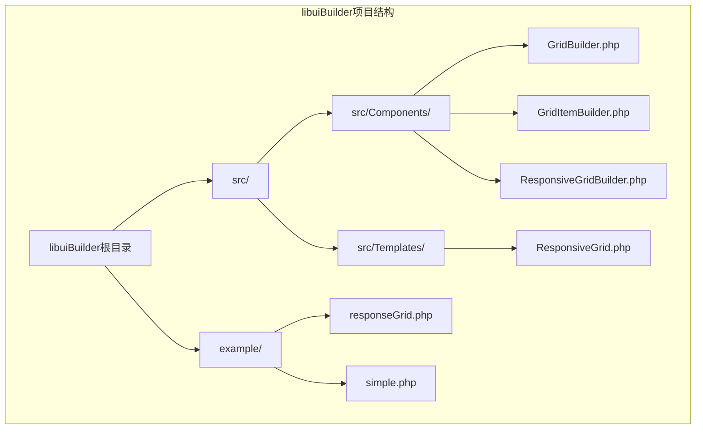
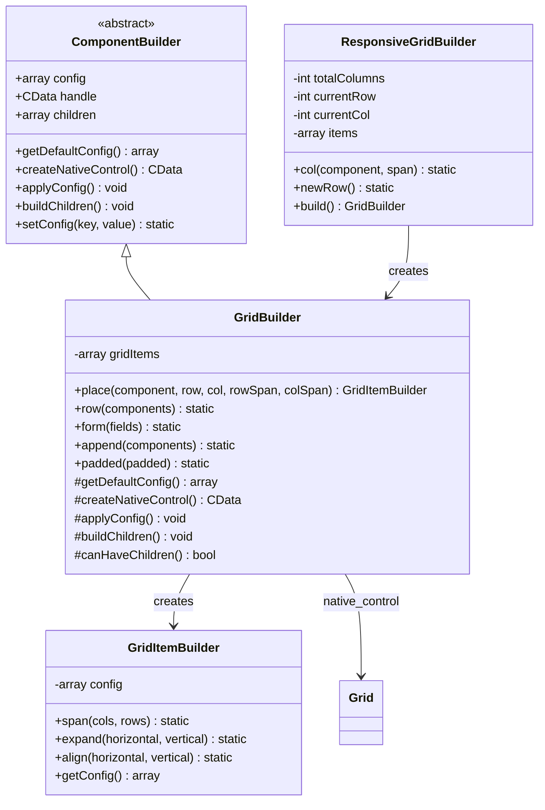
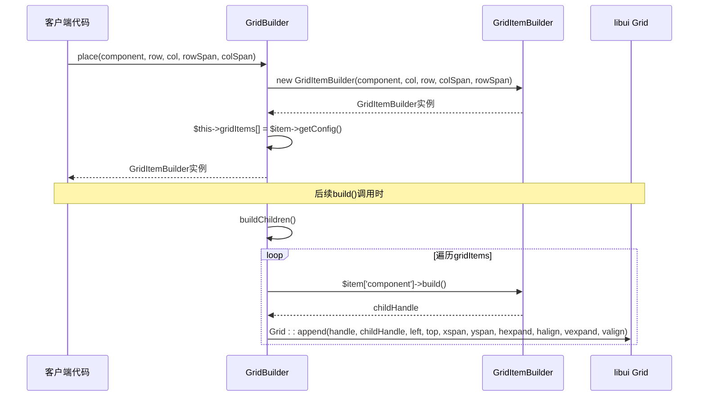
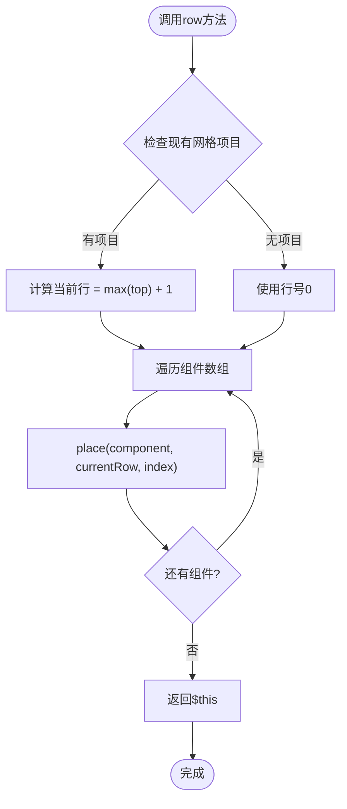
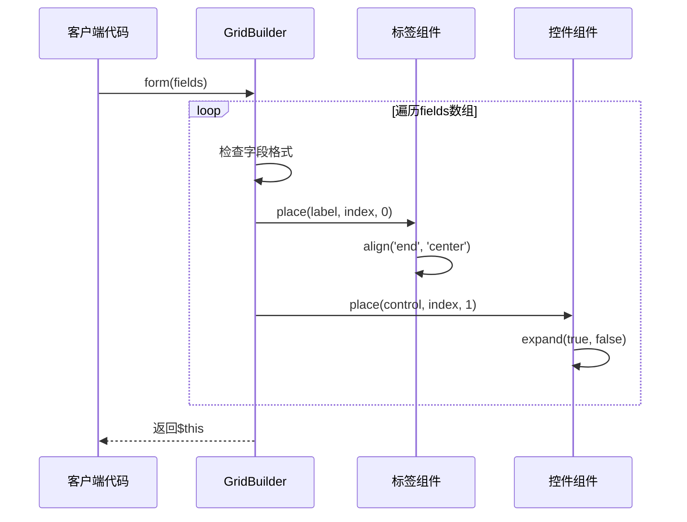
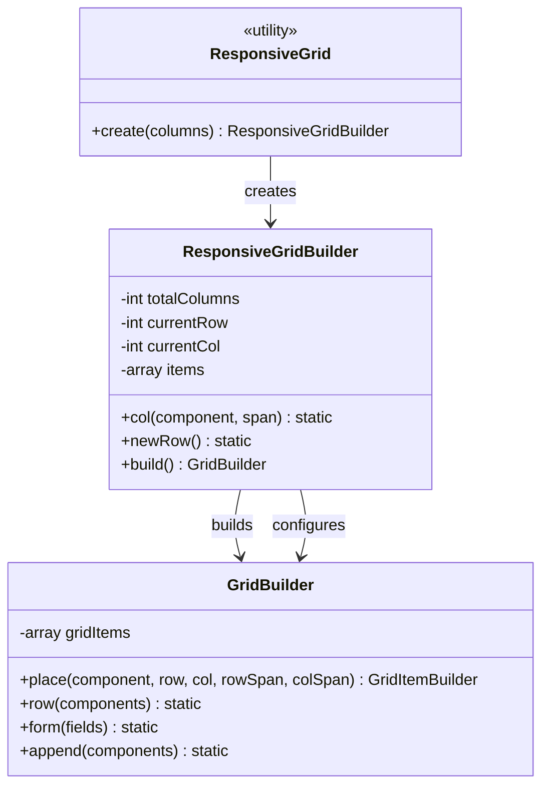
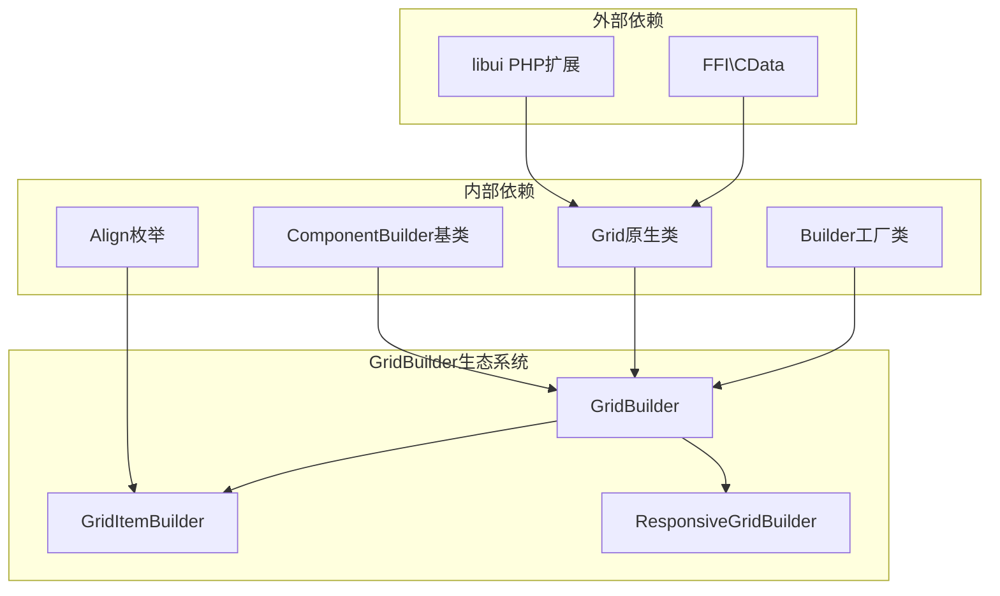

# GridBuilder类全面文档

<cite>
**本文档中引用的文件**
- [GridBuilder.php](file://src/Components/GridBuilder.php)
- [GridItemBuilder.php](file://src/Components/GridItemBuilder.php)
- [ResponsiveGridBuilder.php](file://src/ResponsiveGridBuilder.php)
- [Builder.php](file://src/Builder.php)
- [ComponentBuilder.php](file://src/ComponentBuilder.php)
- [responseGrid.php](file://example/responseGrid.php)
- [simple.php](file://example/simple.php)
- [ResponsiveGrid.php](file://src/Templates/ResponsiveGrid.php)
</cite>

## 目录
1. [简介](#简介)
2. [项目结构](#项目结构)
3. [核心组件](#核心组件)
4. [架构概览](#架构概览)
5. [详细组件分析](#详细组件分析)
6. [依赖关系分析](#依赖关系分析)
7. [性能考虑](#性能考虑)
8. [故障排除指南](#故障排除指南)
9. [结论](#结论)

## 简介

GridBuilder是libuiBuilder框架中的高级布局容器，专门提供精确的网格定位能力。它作为libui原生Grid控件的PHP封装，通过内部维护的`$gridItems`数组来记录每个子组件的位置信息，实现了灵活而强大的二维布局功能。

该类继承自ComponentBuilder基类，提供了完整的网格布局解决方案，包括基础的place()方法、便捷的row()和form()方法，以及响应式网格支持。GridBuilder特别适用于需要精确定位组件的场景，如表单布局、仪表板设计和复杂的用户界面组织。

## 项目结构

GridBuilder类在整个libuiBuilder项目中的位置体现了其作为核心布局组件的重要地位：



**图表来源**
- [GridBuilder.php](file://src/Components/GridBuilder.php#L1-L120)
- [GridItemBuilder.php](file://src/Components/GridItemBuilder.php#L1-L60)
- [ResponsiveGridBuilder.php](file://src/ResponsiveGridBuilder.php#L1-L82)

**章节来源**
- [GridBuilder.php](file://src/Components/GridBuilder.php#L1-L120)
- [Builder.php](file://src/Builder.php#L1-L153)

## 核心组件

GridBuilder类的核心功能围绕以下几个关键组件展开：

### 主要组件构成

1. **$gridItems数组** - 内部存储所有网格项目的配置信息
2. **GridItemBuilder** - 单个网格项目的配置管理器
3. **响应式网格支持** - 基于列数的自动布局系统
4. **配置管理系统** - padded、columnSpacing、rowSpacing等配置项

### 核心配置项详解

GridBuilder提供了三个重要的配置选项：

| 配置项 | 类型 | 默认值 | 说明 |
|--------|------|--------|------|
| padded | boolean | true | 是否在网格周围添加内边距 |
| columnSpacing | integer | 1 | 列之间的间距（像素） |
| rowSpacing | integer | 1 | 行之间的间距（像素） |

**章节来源**
- [GridBuilder.php](file://src/Components/GridBuilder.php#L13-L20)

## 架构概览

GridBuilder采用分层架构设计，清晰地分离了布局逻辑、配置管理和底层渲染：



**图表来源**
- [GridBuilder.php](file://src/Components/GridBuilder.php#L9-L120)
- [GridItemBuilder.php](file://src/Components/GridItemBuilder.php#L8-L60)
- [ResponsiveGridBuilder.php](file://src/ResponsiveGridBuilder.php#L7-L82)
- [ComponentBuilder.php](file://src/ComponentBuilder.php#L11-L120)

## 详细组件分析

### GridBuilder核心方法分析

#### place()方法 - 精确网格定位

place()方法是GridBuilder的核心功能，提供了最精确的网格定位能力：



**图表来源**
- [GridBuilder.php](file://src/Components/GridBuilder.php#L58-L64)
- [GridBuilder.php](file://src/Components/GridBuilder.php#L37-L55)

#### 参数含义详解

- **row**: 目标行索引（从0开始）
- **col**: 目标列索引（从0开始）
- **rowSpan**: 垂直跨越的行数，默认为1
- **colSpan**: 水平跨越的列数，默认为1

#### GridItemBuilder配置系统

GridItemBuilder负责管理单个网格项目的详细配置：

```mermaid
flowchart TD
Start([创建GridItemBuilder]) --> InitConfig["初始化配置数组"]
InitConfig --> SetDefaults["设置默认值<br/>hexpand=false, vexpand=false<br/>halign=Align::Fill, valign=Align::Fill"]
SetDefaults --> ConfigReady["配置就绪"]
ConfigReady --> Methods{"配置方法"}
Methods --> |span()| SetSpan["设置xspan和yspan"]
Methods --> |expand()| SetExpand["设置水平/垂直扩展"]
Methods --> |align()| SetAlign["设置水平/垂直对齐"]
Methods --> |getConfig()| GetConfig["获取最终配置"]
SetSpan --> ConfigReady
SetExpand --> ConfigReady
SetAlign --> ConfigReady
GetConfig --> End([返回配置])
```

**图表来源**
- [GridItemBuilder.php](file://src/Components/GridItemBuilder.php#L12-L25)
- [GridItemBuilder.php](file://src/Components/GridItemBuilder.php#L28-L58)

**章节来源**
- [GridBuilder.php](file://src/Components/GridBuilder.php#L58-L64)
- [GridItemBuilder.php](file://src/Components/GridItemBuilder.php#L8-L60)

### 便捷方法分析

#### row()方法 - 自动行布局

row()方法提供了快速的行布局能力，自动计算行位置并按列顺序排列组件：



**图表来源**
- [GridBuilder.php](file://src/Components/GridBuilder.php#L67-L77)

#### form()方法 - 表单布局模板

form()方法专门针对表单布局进行了优化，自动实现标签-控件对齐：



**图表来源**
- [GridBuilder.php](file://src/Components/GridBuilder.php#L80-L89)

#### append()方法 - 动态追加组件

append()方法允许在表单或其他布局后动态追加组件，特别适合添加按钮行或状态标签：

**章节来源**
- [GridBuilder.php](file://src/Components/GridBuilder.php#L67-L119)

### 响应式网格集成

GridBuilder与ResponsiveGridBuilder协同工作，提供响应式网格布局能力：



**图表来源**
- [ResponsiveGrid.php](file://src/Templates/ResponsiveGrid.php#L8-L14)
- [ResponsiveGridBuilder.php](file://src/ResponsiveGridBuilder.php#L7-L82)

**章节来源**
- [ResponsiveGridBuilder.php](file://src/ResponsiveGridBuilder.php#L1-L82)
- [ResponsiveGrid.php](file://src/Templates/ResponsiveGrid.php#L1-L14)

## 依赖关系分析

GridBuilder的依赖关系体现了其在libuiBuilder架构中的核心地位：



**图表来源**
- [GridBuilder.php](file://src/Components/GridBuilder.php#L1-L8)
- [GridItemBuilder.php](file://src/Components/GridItemBuilder.php#L1-L7)
- [Builder.php](file://src/Builder.php#L1-L23)

**章节来源**
- [GridBuilder.php](file://src/Components/GridBuilder.php#L1-L8)
- [GridItemBuilder.php](file://src/Components/GridItemBuilder.php#L1-L7)

## 性能考虑

### 内存优化策略

1. **延迟构建**: GridBuilder采用延迟构建模式，只有在调用build()方法时才创建原生控件
2. **配置缓存**: 通过$config数组缓存配置，避免重复计算
3. **数组操作优化**: 使用array_column()等PHP内置函数优化数组操作

### 渲染性能优化

1. **批量操作**: buildChildren()方法一次性处理所有网格项目
2. **最小化原生调用**: 尽可能减少对libui原生函数的直接调用次数
3. **智能布局**: 通过$currentRow和$currentCol变量避免不必要的重新计算

### 最佳实践建议

1. **合理使用span()**: 避免过度使用跨行列跨度，保持网格结构简单
2. **配置复用**: 对于相似的组件，考虑使用相同的配置对象
3. **及时清理**: 在不再需要的GridBuilder实例上调用适当的清理方法

## 故障排除指南

### 常见错误及解决方案

#### 坐标越界错误

**问题描述**: 尝试将组件放置在超出网格范围的位置

**解决方案**:
- 检查row和col参数是否在有效范围内
- 使用append()方法自动处理新行添加
- 实现边界检查逻辑

#### 重复放置错误

**问题描述**: 同一个网格位置被多个组件占据

**解决方案**:
- 使用unique标识符确保位置唯一性
- 在放置前检查gridItems数组
- 实现冲突检测机制

#### 性能瓶颈识别

**问题描述**: 大量网格项目导致渲染缓慢

**解决方案**:
- 考虑使用虚拟化技术处理大量数据
- 优化span()使用，避免过度重叠
- 实现懒加载机制

### 调试技巧

1. **配置验证**: 在buildChildren()方法中添加配置验证
2. **日志记录**: 记录gridItems数组的状态变化
3. **可视化调试**: 实现网格布局的可视化预览功能

**章节来源**
- [GridBuilder.php](file://src/Components/GridBuilder.php#L37-L55)
- [GridItemBuilder.php](file://src/Components/GridItemBuilder.php#L28-L58)

## 结论

GridBuilder类作为libuiBuilder框架中的核心布局组件，提供了强大而灵活的网格布局能力。通过精心设计的架构，它成功地平衡了易用性和功能性，使得复杂的二维布局变得简单直观。

### 主要优势

1. **精确控制**: 通过place()方法提供精确的网格定位
2. **便捷方法**: row()、form()、append()等方法简化常用布局模式
3. **响应式支持**: 与ResponsiveGridBuilder集成提供响应式布局能力
4. **配置丰富**: 完整的对齐、扩展和间距配置选项
5. **性能优化**: 延迟构建和批量操作确保良好的性能表现

### 应用场景

- **表单布局**: form()方法特别适合创建结构化的表单界面
- **仪表板设计**: 利用精确的网格定位创建复杂的仪表板布局
- **响应式界面**: 与ResponsiveGridBuilder配合实现自适应布局
- **复杂控件组合**: 为复杂的用户界面组件提供精确的定位和对齐

GridBuilder类的设计充分体现了现代UI框架的最佳实践，为开发者提供了一个既强大又易用的网格布局解决方案。随着libuiBuilder框架的不断发展，GridBuilder将继续发挥其在复杂界面布局中的重要作用。