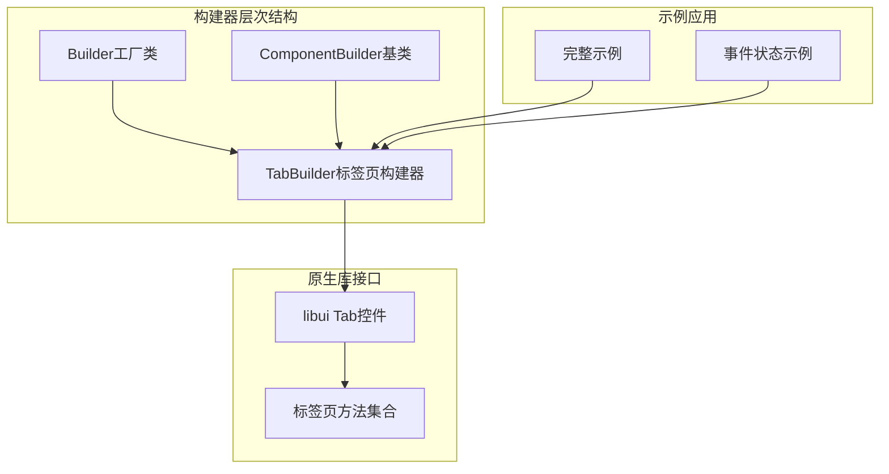
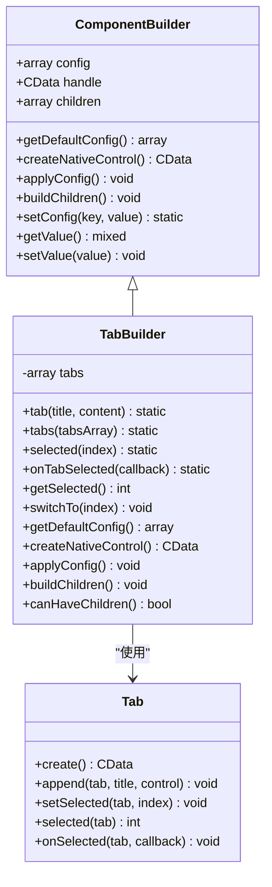
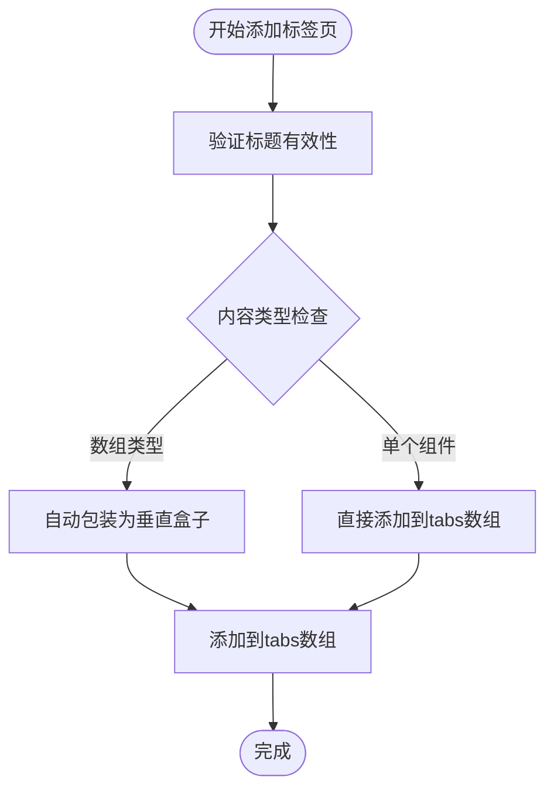
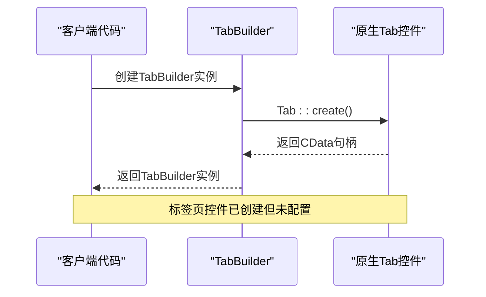
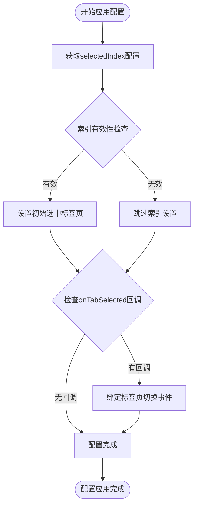
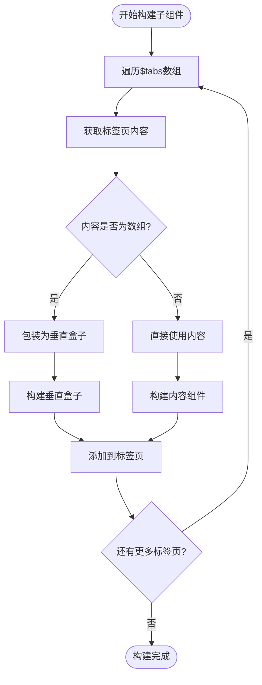
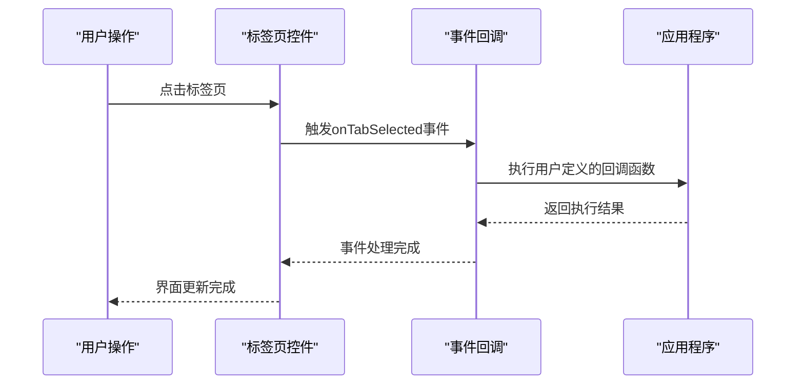
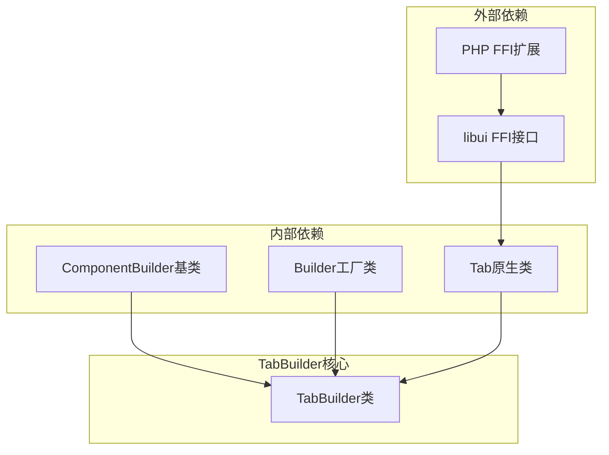

# TabBuilder类完整文档

<cite>
**本文档中引用的文件**
- [TabBuilder.php](file://src/Builder/TabBuilder.php)
- [Builder.php](file://src/Builder.php)
- [ComponentBuilder.php](file://src/ComponentBuilder.php)
- [Tab.php](file://vendor/kingbes/libui/src/Tab.php)
- [full.php](file://example/full.php)
- [eventAndState.php](file://example/eventAndState.php)
</cite>

## 目录
1. [简介](#简介)
2. [项目结构](#项目结构)
3. [核心组件](#核心组件)
4. [架构概览](#架构概览)
5. [详细组件分析](#详细组件分析)
6. [依赖关系分析](#依赖关系分析)
7. [性能考虑](#性能考虑)
8. [故障排除指南](#故障排除指南)
9. [结论](#结论)

## 简介

TabBuilder是libuiBuilder框架中实现标签页式界面组织的核心组件，继承自ComponentBuilder基类，专门负责创建和管理标签页控件。该类提供了完整的标签页功能，包括标签页的添加、切换、事件处理以及程序化控制等特性。

TabBuilder采用链式调用模式，支持灵活的配置和组合使用，能够轻松构建复杂的多标签页界面。它内部维护一个$tabs数组来存储标签标题与内容的映射关系，并通过原生libui库的Tab控件实现底层功能。

## 项目结构

TabBuilder类位于libuiBuilder项目的构建器层次结构中，作为UI组件构建系统的重要组成部分：



**图表来源**
- [Builder.php](file://src/Builder.php#L50-L54)
- [ComponentBuilder.php](file://src/ComponentBuilder.php#L11-L234)
- [TabBuilder.php](file://src/Builder/TabBuilder.php#L10-L106)

**章节来源**
- [Builder.php](file://src/Builder.php#L1-L153)
- [ComponentBuilder.php](file://src/ComponentBuilder.php#L1-L234)
- [TabBuilder.php](file://src/Builder/TabBuilder.php#L1-L106)

## 核心组件

### 内部数据结构

TabBuilder的核心数据结构是一个私有的$tabs数组，用于存储标签页信息：

```php
private array $tabs = [];
```

每个标签页以关联数组的形式存储：
- `'title'`: 标签页标题字符串
- `'content'`: 标签页内容，可以是单个组件或组件数组

### 默认配置系统

TabBuilder提供了标准化的默认配置机制：

```php
protected function getDefaultConfig(): array
{
    return [
        'selectedIndex' => 0,      // 默认选中第一个标签页
        'onTabSelected' => null,    // 标签页切换事件回调
    ];
}
```

**章节来源**
- [TabBuilder.php](file://src/Builder/TabBuilder.php#L12-L19)

## 架构概览

TabBuilder采用典型的建造者模式架构，结合了组件构建器的基础功能和标签页特有的业务逻辑：



**图表来源**
- [ComponentBuilder.php](file://src/ComponentBuilder.php#L11-L234)
- [TabBuilder.php](file://src/Builder/TabBuilder.php#L10-L106)
- [Tab.php](file://vendor/kingbes/libui/src/Tab.php#L10-L137)

## 详细组件分析

### 标签页数据存储结构

TabBuilder内部使用$tabs数组来管理标签页信息，这种设计提供了以下优势：

1. **灵活性**: 支持不同类型的内容（单个组件或组件数组）
2. **可扩展性**: 易于添加新的标签页属性
3. **一致性**: 统一的数据格式便于处理



**图表来源**
- [TabBuilder.php](file://src/Builder/TabBuilder.php#L46-L61)

### 标签页创建流程

createNativeControl()方法负责创建原生标签页控件：



**图表来源**
- [TabBuilder.php](file://src/Builder/TabBuilder.php#L22-L25)
- [Tab.php](file://vendor/kingbes/libui/src/Tab.php#L132-L135)

### 配置应用机制

applyConfig()方法处理标签页的初始配置：



**图表来源**
- [TabBuilder.php](file://src/Builder/TabBuilder.php#L27-L38)

### 子组件构建过程

buildChildren()方法负责构建所有标签页内容：



**图表来源**
- [TabBuilder.php](file://src/Builder/TabBuilder.php#L46-L61)

### 标签页添加方法

#### 单个标签页添加

tab()方法提供简洁的单个标签页添加接口：

```php
public function tab(string $title, $content): static
{
    $this->tabs[] = [
        'title' => $title,
        'content' => $content
    ];
    return $this;
}
```

#### 批量标签页添加

tabs()方法支持批量添加多个标签页：

```php
public function tabs(array $tabs): static
{
    foreach ($tabs as $title => $content) {
        $this->tab($title, $content);
    }
    return $this;
}
```

**章节来源**
- [TabBuilder.php](file://src/Builder/TabBuilder.php#L64-L81)

### 程序化控制方法

#### 当前选中标签页获取

getSelected()方法返回当前选中的标签页索引：

```php
public function getSelected(): int
{
    return Tab::selected($this->handle);
}
```

#### 标签页切换控制

switchTo()方法允许程序化切换到指定标签页：

```php
public function switchTo(int $index): void
{
    Tab::setSelected($this->handle, $index);
}
```

**章节来源**
- [TabBuilder.php](file://src/Builder/TabBuilder.php#L95-L105)

### 事件处理机制

TabBuilder支持标签页切换事件的绑定和处理：



**图表来源**
- [TabBuilder.php](file://src/Builder/TabBuilder.php#L89-L93)
- [Tab.php](file://vendor/kingbes/libui/src/Tab.php#L42-L47)

**章节来源**
- [TabBuilder.php](file://src/Builder/TabBuilder.php#L89-L105)

## 依赖关系分析

TabBuilder的依赖关系体现了清晰的分层架构：



**图表来源**
- [TabBuilder.php](file://src/Builder/TabBuilder.php#L5-L9)
- [ComponentBuilder.php](file://src/ComponentBuilder.php#L1-L10)

### 关键依赖说明

1. **libui库集成**: 通过FFI直接调用原生libui库的功能
2. **Builder工厂**: 提供统一的组件创建入口
3. **ComponentBuilder基类**: 提供通用的构建器功能

**章节来源**
- [TabBuilder.php](file://src/Builder/TabBuilder.php#L1-L10)
- [ComponentBuilder.php](file://src/ComponentBuilder.php#L1-L10)

## 性能考虑

### 内存管理

TabBuilder采用延迟构建策略，只有在调用build()方法时才会创建原生控件和构建子组件，这有助于优化内存使用。

### 事件处理优化

- 使用FFI回调机制直接连接原生事件与PHP回调
- 避免不必要的事件监听器注册
- 支持事件委托减少内存占用

### 内容延迟加载

对于复杂的内容组件，TabBuilder支持按需加载，只有当用户切换到特定标签页时才构建对应的内容。

## 故障排除指南

### 常见问题及解决方案

#### 标签页索引越界

**问题**: 设置的selectedIndex超出标签页范围
**解决方案**: 在调用selected()方法前验证标签页数量

#### 事件回调不触发

**问题**: onTabSelected回调函数没有被调用
**解决方案**: 确保回调函数是有效的可调用对象，并且在正确的时机注册

#### 内容显示异常

**问题**: 标签页内容显示不正确或布局错乱
**解决方案**: 检查内容组件是否正确构建，特别是数组类型内容的自动包装逻辑

**章节来源**
- [TabBuilder.php](file://src/Builder/TabBuilder.php#L30-L38)
- [TabBuilder.php](file://src/Builder/TabBuilder.php#L51-L58)

## 结论

TabBuilder类作为libuiBuilder框架的核心组件，成功地封装了标签页控件的所有功能特性。它通过合理的架构设计、灵活的配置机制和强大的扩展能力，为开发者提供了构建复杂多标签页界面的完整解决方案。

### 主要优势

1. **简洁的API设计**: 链式调用模式使代码更加直观易读
2. **灵活的内容处理**: 支持单个组件和组件数组的混合使用
3. **完善的事件机制**: 提供标签页切换的完整事件支持
4. **良好的性能表现**: 采用延迟构建和事件优化策略
5. **强类型支持**: 通过类型提示确保代码质量

### 最佳实践建议

1. **合理使用批量添加**: 对于大量标签页，优先使用tabs()方法
2. **及时处理事件**: 正确绑定和处理标签页切换事件
3. **注意内存管理**: 对于复杂内容，考虑使用延迟加载策略
4. **保持状态同步**: 在事件处理中及时更新相关状态

TabBuilder类的设计充分体现了现代PHP GUI框架的设计理念，为构建现代化的桌面应用程序界面提供了强有力的支持。