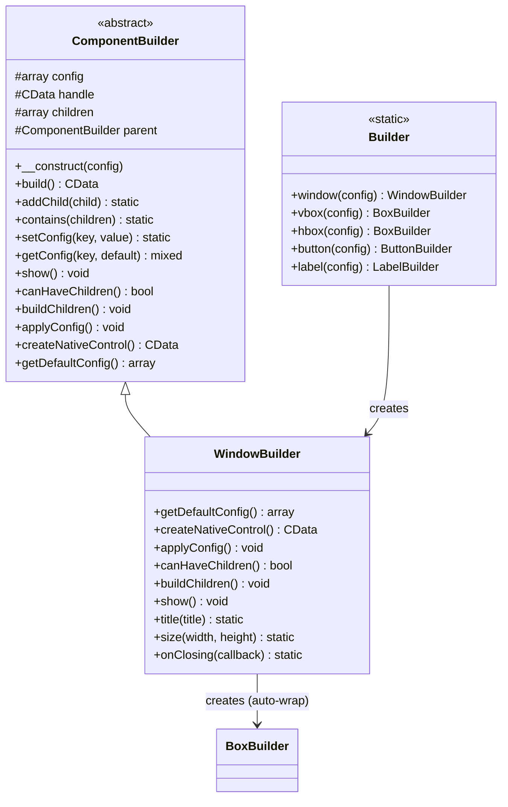
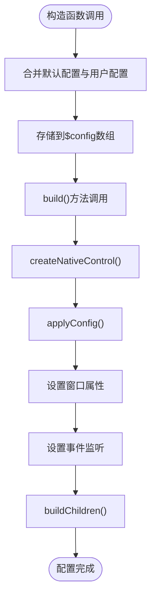
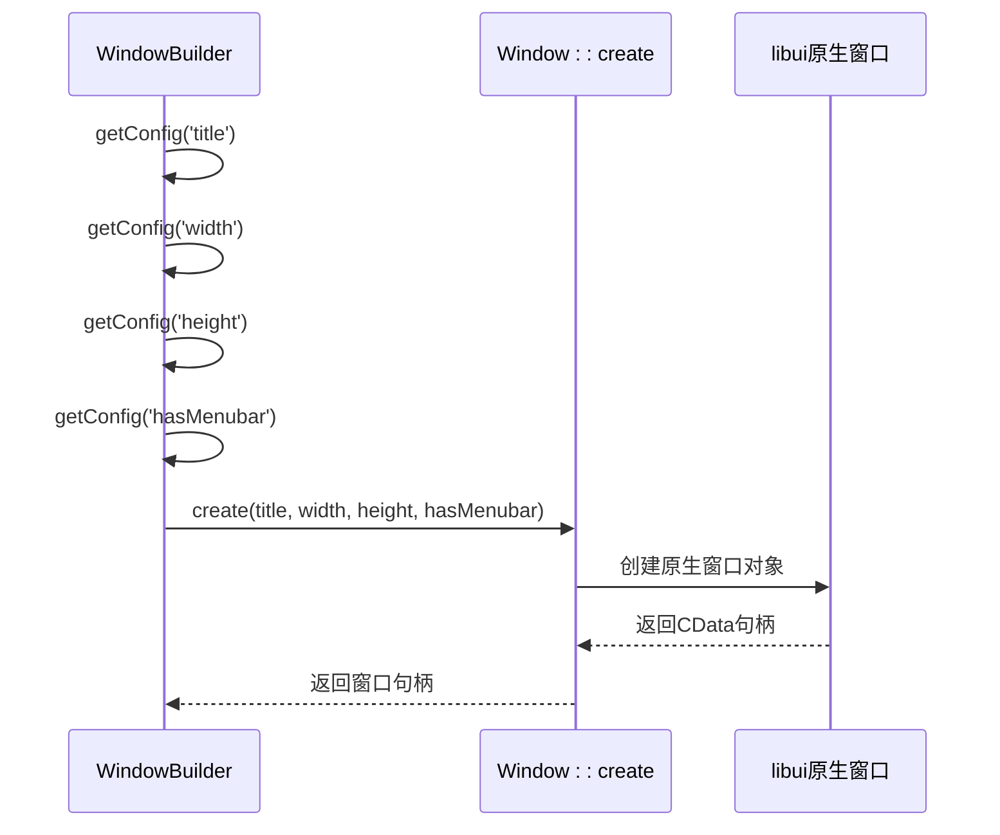
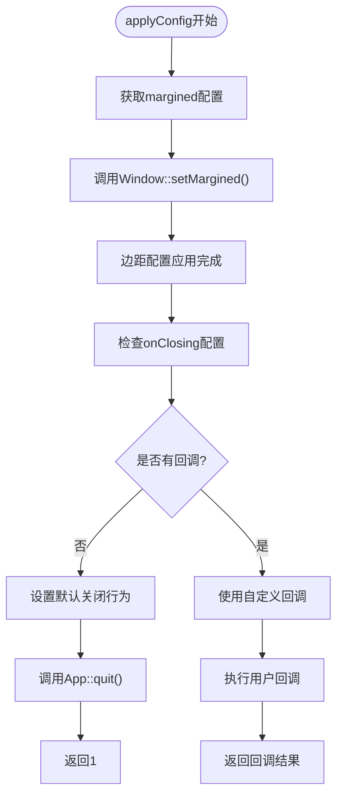
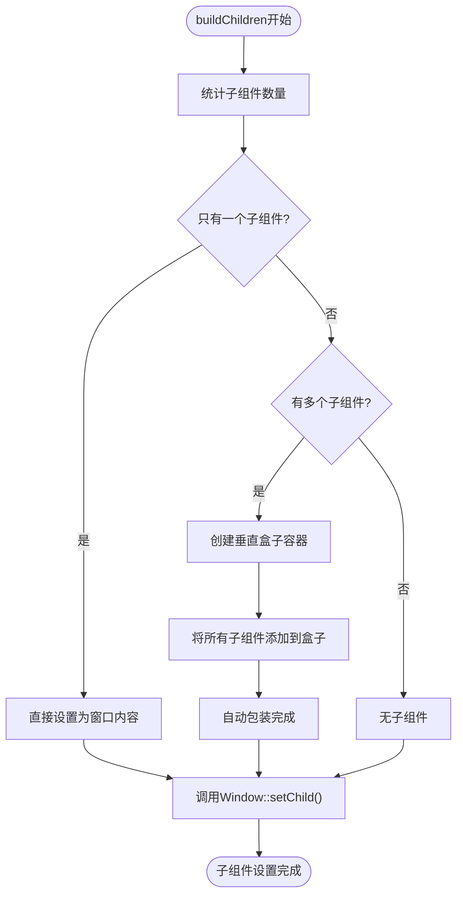
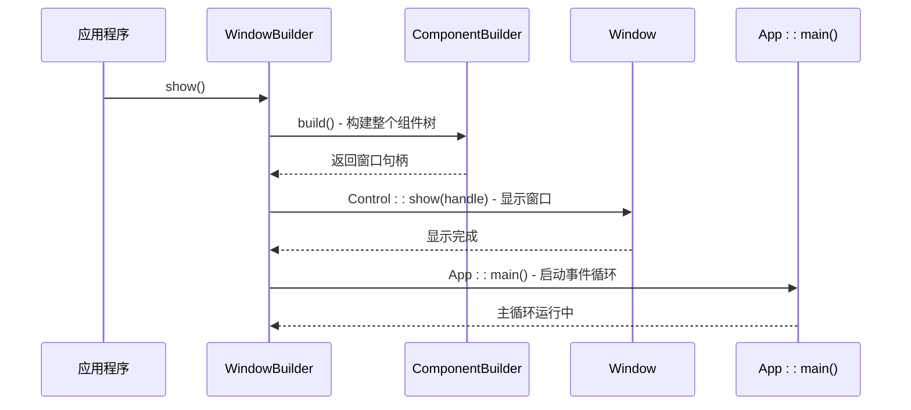

# WindowBuilder 类详细文档

<cite>
**本文档中引用的文件**
- [WindowBuilder.php](file://src/Components/WindowBuilder.php)
- [ComponentBuilder.php](file://src/ComponentBuilder.php)
- [Builder.php](file://src/Builder.php)
- [BoxBuilder.php](file://src/Components/BoxBuilder.php)
- [full.php](file://example/full.php)
</cite>

## 目录
1. [简介](#简介)
2. [类架构概览](#类架构概览)
3. [核心配置系统](#核心配置系统)
4. [原生控件创建](#原生控件创建)
5. [配置应用与事件处理](#配置应用与事件处理)
6. [子组件管理](#子组件管理)
7. [窗口显示与生命周期](#窗口显示与生命周期)
8. [链式配置方法](#链式配置方法)
9. [使用示例](#使用示例)
10. [故障排除指南](#故障排除指南)
11. [总结](#总结)

## 简介

WindowBuilder是libuiBuilder框架中顶级窗口容器的核心实现类，负责创建和管理libui原生窗口实例。作为ComponentBuilder的直接子类，它提供了完整的窗口构建功能，包括标题设置、尺寸控制、边距配置、关闭事件处理以及子组件的自动布局管理。

该类采用建造者模式设计，支持流畅的链式配置语法，使开发者能够简洁地创建复杂的窗口界面。通过继承ComponentBuilder的基础架构，WindowBuilder获得了统一的组件构建能力，同时专门针对窗口特性进行了优化。

## 类架构概览

WindowBuilder继承自ComponentBuilder抽象基类，形成了清晰的层次结构：



**图表来源**
- [ComponentBuilder.php](file://src/ComponentBuilder.php#L11-L234)
- [WindowBuilder.php](file://src/Components/WindowBuilder.php#L11-L96)
- [Builder.php](file://src/Builder.php#L28-L33)

**章节来源**
- [WindowBuilder.php](file://src/Components/WindowBuilder.php#L11-L96)
- [ComponentBuilder.php](file://src/ComponentBuilder.php#L11-L234)

## 核心配置系统

WindowBuilder通过getDefaultConfig()方法定义了窗口的默认配置参数，这些配置项构成了窗口的基本属性：

### 默认配置参数

| 参数名 | 类型 | 默认值 | 描述 |
|--------|------|--------|------|
| title | string | 'LibUI Application' | 窗口标题 |
| width | int | 640 | 窗口宽度（像素） |
| height | int | 480 | 窗口高度（像素） |
| hasMenubar | bool | false | 是否包含菜单栏 |
| margined | bool | true | 是否启用边距 |
| onClosing | callable \| null | null | 关闭事件回调 |
| resizable | bool | true | 是否可调整大小 |

### 配置系统工作原理



**图表来源**
- [ComponentBuilder.php](file://src/ComponentBuilder.php#L25-L28)
- [WindowBuilder.php](file://src/Components/WindowBuilder.php#L13-L23)

**章节来源**
- [WindowBuilder.php](file://src/Components/WindowBuilder.php#L13-L23)

## 原生控件创建

WindowBuilder的createNativeControl()方法负责创建libui原生窗口实例。该方法直接调用Window::create()函数，传入配置参数来初始化窗口：

### 创建过程详解



**图表来源**
- [WindowBuilder.php](file://src/Components/WindowBuilder.php#L26-L33)

### 关键参数说明

- **title**: 窗口标题字符串，显示在窗口顶部
- **width/height**: 窗口初始尺寸，单位为像素
- **hasMenubar**: 布尔值，决定是否创建菜单栏区域

**章节来源**
- [WindowBuilder.php](file://src/Components/WindowBuilder.php#L26-L33)

## 配置应用与事件处理

WindowBuilder的applyConfig()方法负责将配置应用到已创建的原生窗口实例上，并设置各种事件监听器。

### 边距配置处理



**图表来源**
- [WindowBuilder.php](file://src/Components/WindowBuilder.php#L36-L50)

### 默认关闭行为机制

当onClosing配置为null时，WindowBuilder会设置默认的关闭行为：调用App::quit()终止应用程序，然后返回1表示阻止默认关闭操作。

### 自定义关闭事件处理

如果提供了onClosing回调函数，WindowBuilder会直接将其传递给Window::onClosing()，允许开发者自定义关闭逻辑。

**章节来源**
- [WindowBuilder.php](file://src/Components/WindowBuilder.php#L36-L50)

## 子组件管理

WindowBuilder作为容器组件，支持单个或多个子组件的管理。其buildChildren()方法实现了智能的子组件布局策略。

### 子组件处理策略



**图表来源**
- [WindowBuilder.php](file://src/Components/WindowBuilder.php#L58-L70)

### 自动布局机制

- **单个子组件**: 直接将子组件设置为窗口内容，无需额外包装
- **多个子组件**: 自动创建垂直盒子（BoxBuilder）并将所有子组件添加到其中
- **无子组件**: 窗口将为空白状态

### BoxBuilder集成

当需要多个子组件时，WindowBuilder会创建BoxBuilder实例，方向为'vertical'，确保子组件按垂直顺序排列。

**章节来源**
- [WindowBuilder.php](file://src/Components/WindowBuilder.php#L58-L70)
- [BoxBuilder.php](file://src/Components/BoxBuilder.php#L11-L64)

## 窗口显示与生命周期

WindowBuilder的show()方法启动窗口的应用程序主循环，这是窗口生命周期的关键步骤。

### 显示流程



**图表来源**
- [WindowBuilder.php](file://src/Components/WindowBuilder.php#L73-L77)
- [ComponentBuilder.php](file://src/ComponentBuilder.php#L209-L231)

### 生命周期阶段

1. **构建阶段**: 调用build()方法构建完整的组件树
2. **显示阶段**: 调用Control::show()显示窗口
3. **事件循环**: 调用App::main()启动应用程序主循环

**章节来源**
- [WindowBuilder.php](file://src/Components/WindowBuilder.php#L73-L77)

## 链式配置方法

WindowBuilder提供了三个主要的链式配置方法，支持流畅的API调用：

### 配置方法对比

| 方法名 | 参数类型 | 返回类型 | 功能描述 |
|--------|----------|----------|----------|
| title() | string | static | 设置窗口标题 |
| size() | int, int | static | 设置窗口尺寸（宽高） |
| onClosing() | callable | static | 设置关闭事件回调 |

### 链式调用示例流程

```mermaid
flowchart LR
Start([Builder::window()]) --> Title["title('My App')"]
Title --> Size["size(800, 600)"]
Size --> OnClosing["onClosing(callback)"]
OnClosing --> Contains["contains([...])"]
Contains --> Show["show()"]
Title -.-> TitleRet["返回$this"]
Size -.-> SizeRet["返回$this"]
OnClosing -.-> OnClosingRet["返回$this"]
Contains -.-> ContainsRet["返回$this"]
Show -.-> ShowRet["返回void"]
```

**图表来源**
- [WindowBuilder.php](file://src/Components/WindowBuilder.php#L80-L95)

**章节来源**
- [WindowBuilder.php](file://src/Components/WindowBuilder.php#L80-L95)

## 使用示例

以下是WindowBuilder的各种使用场景和最佳实践：

### 基础窗口创建

```php
// 最简单的窗口创建
$app = Builder::window()
    ->title('我的应用')
    ->size(400, 300)
    ->show();
```

### 带内容的复杂窗口

```php
// 包含多个组件的窗口
$app = Builder::window()
    ->title('完整应用')
    ->size(800, 600)
    ->contains([
        Builder::vbox()->contains([
            Builder::label()->text('欢迎使用'),
            Builder::button()->text('点击我'),
            Builder::entry()->placeholder('输入内容')
        ])
    ])
    ->show();
```

### 自定义关闭行为

```php
// 自定义关闭逻辑
$app = Builder::window()
    ->title('确认退出')
    ->size(300, 200)
    ->onClosing(function() {
        // 显示确认对话框
        if (confirmExit()) {
            App::quit();
            return 1;
        }
        return 0; // 阻止关闭
    })
    ->show();
```

### 高级配置组合

```php
// 完整的功能配置
$app = Builder::window([
    'hasMenubar' => true,
    'resizable' => false
])
->title('专业应用')
->size(1024, 768)
->onClosing(function() {
    saveUserData();
    return 1;
})
->contains([
    Builder::menu()->addItem('文件')->addItem('编辑'),
    Builder::vbox()->contains([
        Builder::label()->text('状态: 就绪'),
        Builder::button()->text('保存')->onClick(function() {
            saveData();
        })
    ])
])
->show();
```

**章节来源**
- [full.php](file://example/full.php#L13-L179)

## 故障排除指南

### 常见问题及解决方案

#### 问题1: 窗口无法正常关闭

**症状**: 点击关闭按钮后窗口仍然存在

**原因**: 
- onClosing回调返回值错误
- 回调中没有正确调用App::quit()

**解决方案**:
```php
// 正确的关闭回调
->onClosing(function() {
    // 执行清理操作
    cleanupResources();
    
    // 必须调用quit并返回1
    App::quit();
    return 1;
})
```

#### 问题2: 子组件不显示

**症状**: 窗口显示但内部组件不可见

**原因**:
- 子组件数量过多导致自动包装失败
- 子组件配置错误

**解决方案**:
```php
// 显式指定容器而不是依赖自动包装
$app = Builder::window()
    ->contains([
        Builder::vbox()->contains([
            // 显式添加所有子组件
            Builder::label()->text('组件1'),
            Builder::button()->text('组件2')
        ])
    ])
    ->show();
```

#### 问题3: 窗口尺寸异常

**症状**: 窗口显示尺寸与预期不符

**原因**:
- 默认配置被意外覆盖
- 边距设置影响实际可用空间

**解决方案**:
```php
// 明确设置所有尺寸参数
$app = Builder::window()
    ->size(800, 600)  // 明确指定尺寸
    ->margined(false) // 禁用边距以获得精确控制
    ->show();
```

#### 问题4: 应用程序无法启动

**症状**: 调用show()后应用程序立即退出

**原因**:
- 在非主线程中调用show()
- 缺少必要的初始化

**解决方案**:
```php
// 确保正确的初始化序列
App::init(); // 必须先调用

$app = Builder::window()
    ->title('测试应用')
    ->show(); // 在主线程中调用
```

### 调试技巧

1. **验证配置**: 在构建过程中打印配置参数
2. **检查句柄**: 确认Window::create()返回有效的CData句柄
3. **事件跟踪**: 添加日志记录到onClosing回调中
4. **组件树验证**: 使用StateManager调试组件关系

**章节来源**
- [WindowBuilder.php](file://src/Components/WindowBuilder.php#L36-L50)
- [ComponentBuilder.php](file://src/ComponentBuilder.php#L209-L231)

## 总结

WindowBuilder作为libuiBuilder框架的核心组件，提供了完整的窗口构建和管理功能。通过继承ComponentBuilder的架构设计，它获得了统一的组件构建能力，同时专门针对窗口特性进行了优化。

### 主要特性总结

1. **灵活的配置系统**: 支持默认配置与用户配置的合并
2. **智能子组件管理**: 自动处理单个或多个子组件的布局
3. **完善的事件处理**: 提供默认和自定义的关闭事件支持
4. **流畅的API设计**: 支持链式调用的配置语法
5. **可靠的生命周期管理**: 正确的窗口显示和事件循环启动

### 最佳实践建议

1. **合理使用自动包装**: 当有多个子组件时，让WindowBuilder自动创建垂直盒子
2. **正确处理关闭事件**: 确保onClosing回调返回适当的值
3. **明确尺寸设置**: 避免依赖默认尺寸，显式设置窗口大小
4. **及时资源清理**: 在关闭回调中执行必要的清理操作

WindowBuilder的设计体现了现代GUI框架的最佳实践，为开发者提供了一个强大而易用的窗口构建工具，是构建桌面应用程序的理想起点。