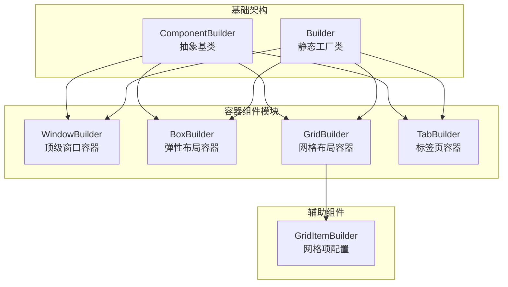
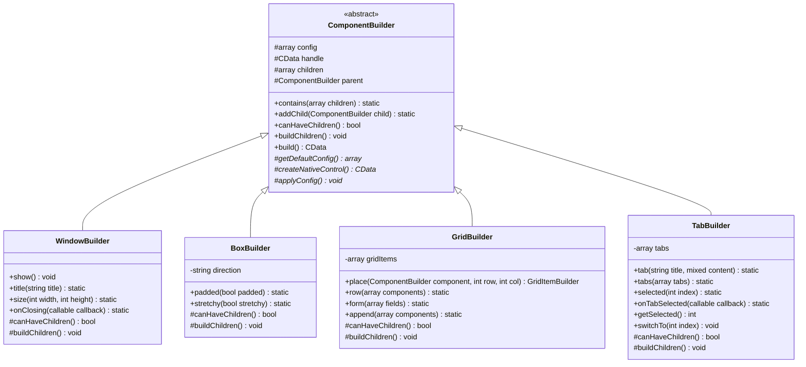
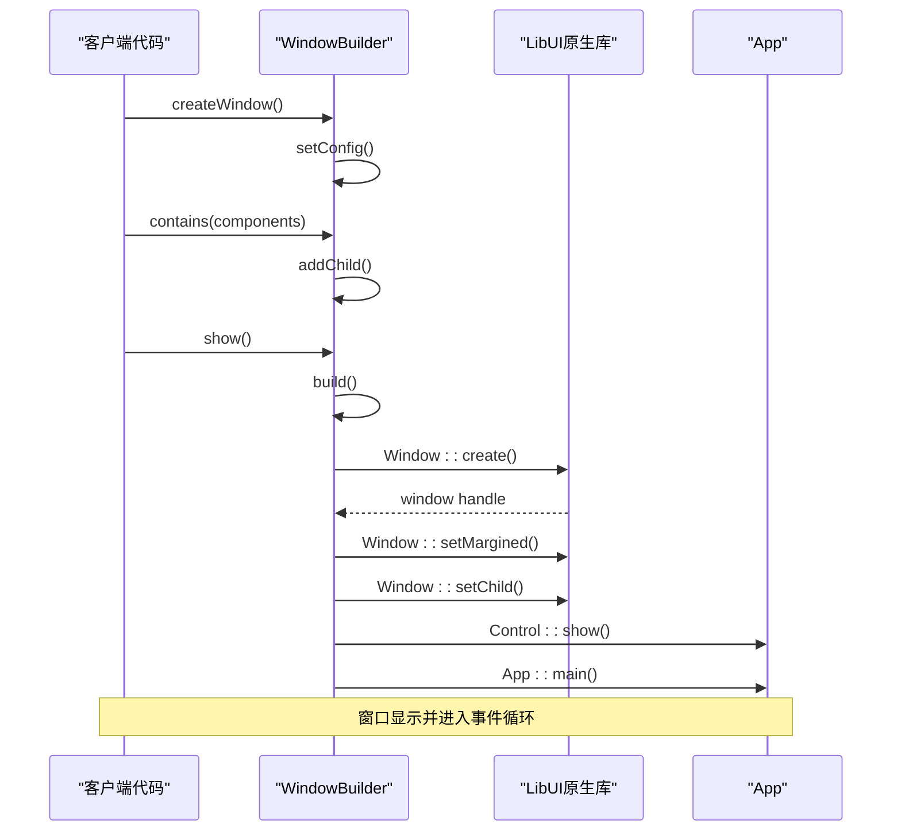
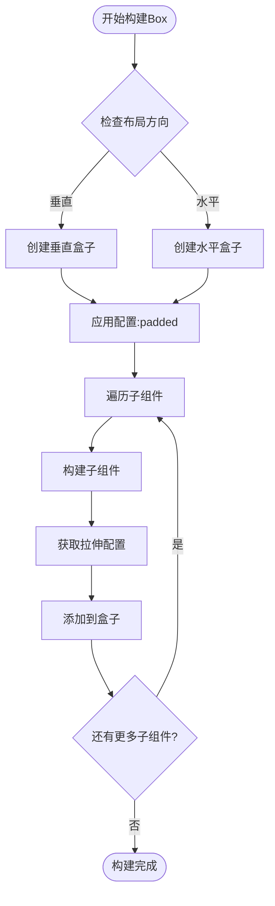
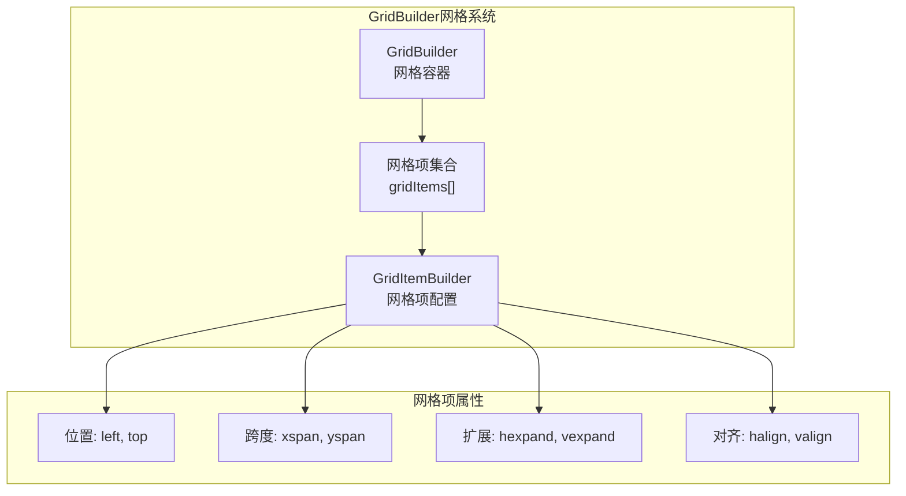
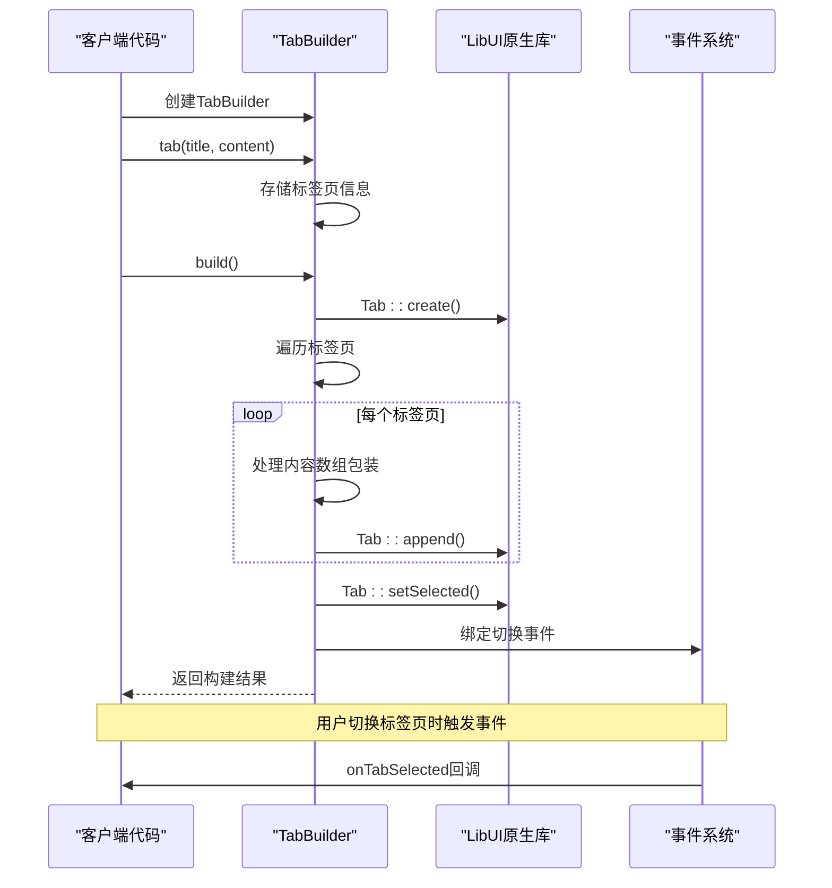
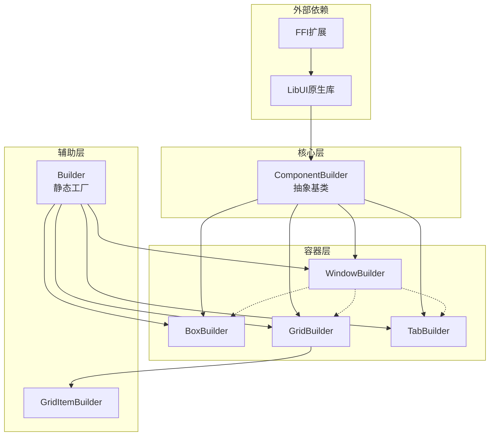

# 容器组件

<cite>
**本文档中引用的文件**
- [WindowBuilder.php](file://src/Components/WindowBuilder.php)
- [BoxBuilder.php](file://src/Components/BoxBuilder.php)
- [GridBuilder.php](file://src/Components/GridBuilder.php)
- [GridItemBuilder.php](file://src/Components/GridItemBuilder.php)
- [TabBuilder.php](file://src/Builder/TabBuilder.php)
- [ComponentBuilder.php](file://src/ComponentBuilder.php)
- [Builder.php](file://src/Builder.php)
- [simple.php](file://example/simple.php)
- [full.php](file://example/full.php)
</cite>

## 目录
1. [简介](#简介)
2. [项目结构](#项目结构)
3. [核心组件](#核心组件)
4. [架构概览](#架构概览)
5. [详细组件分析](#详细组件分析)
6. [依赖关系分析](#依赖关系分析)
7. [性能考虑](#性能考虑)
8. [故障排除指南](#故障排除指南)
9. [结论](#结论)

## 简介

libuiBuilder是一个基于PHP的GUI应用程序构建库，提供了强大的容器组件系统来构建复杂的用户界面。该系统的核心是四个主要的容器类：WindowBuilder（顶级窗口容器）、BoxBuilder（弹性布局容器）、GridBuilder（网格布局容器）和TabBuilder（标签页容器）。这些容器组件都继承自ComponentBuilder基类，并通过重写关键方法来实现不同的布局特性和子组件管理能力。

## 项目结构

libuiBuilder的容器组件采用模块化设计，每个容器都有独立的实现文件和相关的辅助类：



**图表来源**
- [ComponentBuilder.php](file://src/ComponentBuilder.php#L11-L234)
- [WindowBuilder.php](file://src/Components/WindowBuilder.php#L11-L96)
- [BoxBuilder.php](file://src/Components/BoxBuilder.php#L11-L64)
- [GridBuilder.php](file://src/Components/GridBuilder.php#L9-L120)
- [TabBuilder.php](file://src/Builder/TabBuilder.php#L10-L106)

**章节来源**
- [ComponentBuilder.php](file://src/ComponentBuilder.php#L1-L234)
- [Builder.php](file://src/Builder.php#L1-L91)

## 核心组件

### ComponentBuilder基类

ComponentBuilder是所有容器组件的抽象基类，定义了通用的组件构建模式和生命周期管理：

- **配置管理系统**：提供统一的配置存储和访问机制
- **子组件管理**：支持父子关系的建立和维护
- **生命周期控制**：包含构建、配置应用和子组件处理的标准化流程
- **状态绑定**：支持与状态管理系统的集成

### 容器组件特性对比

| 容器类型 | 主要用途 | 布局特性 | 子组件管理 | 特有方法 |
|---------|---------|---------|-----------|---------|
| WindowBuilder | 顶级窗口容器 | 单一子组件或自动包装 | 支持多个子组件 | show(), title(), size() |
| BoxBuilder | 弹性布局容器 | 水平/垂直排列 | 支持多个子组件 | padded(), stretchy() |
| GridBuilder | 网格布局容器 | 精确位置控制 | 支持多个子组件 | place(), row(), form() |
| TabBuilder | 标签页容器 | 标签页组织 | 支持多个标签页 | tab(), tabs(), selected() |

**章节来源**
- [ComponentBuilder.php](file://src/ComponentBuilder.php#L11-L234)
- [WindowBuilder.php](file://src/Components/WindowBuilder.php#L11-L96)
- [BoxBuilder.php](file://src/Components/BoxBuilder.php#L11-L64)
- [GridBuilder.php](file://src/Components/GridBuilder.php#L9-L120)
- [TabBuilder.php](file://src/Builder/TabBuilder.php#L10-L106)

## 架构概览

容器组件系统采用继承和组合的设计模式，通过重写ComponentBuilder的关键方法来实现不同的布局行为：



**图表来源**
- [ComponentBuilder.php](file://src/ComponentBuilder.php#L11-L234)
- [WindowBuilder.php](file://src/Components/WindowBuilder.php#L11-L96)
- [BoxBuilder.php](file://src/Components/BoxBuilder.php#L11-L64)
- [GridBuilder.php](file://src/Components/GridBuilder.php#L9-L120)
- [TabBuilder.php](file://src/Builder/TabBuilder.php#L10-L106)

## 详细组件分析

### WindowBuilder - 顶级窗口容器

WindowBuilder是应用程序的根容器，负责创建和管理主窗口界面。

#### 核心特性

- **默认配置**：标题为"LibUI Application"，尺寸640x480，包含菜单栏但不带边距
- **自动子组件处理**：单个子组件直接设置，多个子组件自动包装在垂直盒子中
- **事件处理**：支持窗口关闭事件，默认行为是退出应用程序
- **显示控制**：提供show()方法启动应用程序主循环

#### 关键方法实现



**图表来源**
- [WindowBuilder.php](file://src/Components/WindowBuilder.php#L26-L96)

#### 使用示例

WindowBuilder通常通过Builder静态工厂方法创建：

```php
// 基本窗口创建
$window = Builder::window()
    ->title('我的应用')
    ->size(800, 600)
    ->contains([
        Builder::label()->text('Hello World!')
    ]);

// 显示窗口
$window->show();
```

**章节来源**
- [WindowBuilder.php](file://src/Components/WindowBuilder.php#L11-L96)
- [Builder.php](file://src/Builder.php#L29-L33)

### BoxBuilder - 弹性布局容器

BoxBuilder提供水平和垂直两种方向的弹性布局能力，是最常用的布局容器之一。

#### 布局特性

- **方向控制**：支持水平（horizontal）和垂直（vertical）两种布局方向
- **弹性属性**：每个子组件可以配置是否可拉伸（stretchy）
- **间距控制**：支持内边距（padded）设置
- **灵活的子组件管理**：按顺序添加子组件，支持动态调整

#### 实现机制



**图表来源**
- [BoxBuilder.php](file://src/Components/BoxBuilder.php#L29-L64)

#### 配置参数

| 参数名 | 类型 | 默认值 | 描述 |
|-------|------|--------|------|
| padded | bool | true | 是否添加内边距 |
| stretchy | bool | false | 子组件是否可拉伸 |

#### 使用模式

BoxBuilder常用于创建复杂的嵌套布局：

```php
// 嵌套布局示例
$vbox = Builder::vbox()
    ->padded(true)
    ->contains([
        Builder::hbox()->contains([
            Builder::label()->text('左侧内容'),
            Builder::button()->text('操作按钮')->stretchy(true)
        ]),
        Builder::separator(),
        Builder::label()->text('底部信息')
    ]);
```

**章节来源**
- [BoxBuilder.php](file://src/Components/BoxBuilder.php#L11-L64)
- [Builder.php](file://src/Builder.php#L35-L44)

### GridBuilder - 网格布局容器

GridBuilder提供精确的网格定位能力，支持复杂的二维布局需求。

#### 核心功能

- **网格定位**：通过行列坐标精确定位子组件
- **跨列跨行**：支持组件跨越多个网格单元
- **对齐控制**：支持水平和垂直方向的对齐方式
- **扩展属性**：支持组件在可用空间内的扩展行为
- **模板方法**：提供form()方法快速创建表单布局

#### 网格系统架构



**图表来源**
- [GridBuilder.php](file://src/Components/GridBuilder.php#L9-L120)
- [GridItemBuilder.php](file://src/Components/GridItemBuilder.php#L8-L60)

#### 高级功能

GridBuilder提供了多种高级布局方法：

1. **place()方法**：最基础的网格定位方法
2. **row()方法**：批量添加同一行的组件
3. **form()方法**：快速创建表单布局
4. **append()方法**：在表单后追加额外组件

#### 使用示例

```php
// 复杂网格布局
$grid = Builder::grid()
    ->padded(true)
    ->columnSpacing(5)
    ->rowSpacing(3)
    ->place(Builder::label()->text('用户名:'), 0, 0)
    ->place(Builder::entry()->id('username'), 0, 1)
    ->place(Builder::label()->text('密码:'), 1, 0)
    ->place(Builder::passwordEntry()->id('password'), 1, 1)
    ->place(Builder::button()->text('登录'), 2, 0, 1, 2)
        ->expand(true, false)
        ->align('center', 'center');
```

**章节来源**
- [GridBuilder.php](file://src/Components/GridBuilder.php#L9-L120)
- [GridItemBuilder.php](file://src/Components/GridItemBuilder.php#L8-L60)
- [Builder.php](file://src/Builder.php#L45-L49)

### TabBuilder - 标签页容器

TabBuilder提供标签页式的界面组织方式，支持多个内容面板的切换显示。

#### 标签页管理

- **标签页添加**：支持单个和批量标签页添加
- **内容包装**：自动处理数组形式的内容包装
- **事件绑定**：支持标签页切换事件监听
- **程序控制**：提供API进行标签页的程序化切换

#### 生命周期管理



**图表来源**
- [TabBuilder.php](file://src/Builder/TabBuilder.php#L10-L106)

#### 配置选项

| 方法 | 参数 | 描述 |
|------|------|------|
| tab() | title, content | 添加单个标签页 |
| tabs() | array | 批量添加标签页 |
| selected() | index | 设置默认选中标签页 |
| onTabSelected() | callback | 绑定切换事件 |

#### 实际应用场景

TabBuilder非常适合需要分类展示内容的界面：

```php
// 多功能设置界面
$settingsTabs = Builder::tab()
    ->tab('基本设置', [
        Builder::label()->text('语言:'),
        Builder::combobox()->items(['中文', '英文', '日文']),
        Builder::separator(),
        Builder::label()->text('主题:'),
        Builder::combobox()->items(['浅色', '深色', '自动'])
    ])
    ->tab('高级设置', [
        Builder::label()->text('性能优化:'),
        Builder::checkbox()->text('启用缓存'),
        Builder::checkbox()->text('压缩传输'),
        Builder::separator(),
        Builder::label()->text('安全设置:'),
        Builder::checkbox()->text('启用HTTPS'),
        Builder::checkbox()->text('验证证书')
    ])
    ->selected(0)
    ->onTabSelected(function($index) {
        echo "切换到标签页: {$index}\n";
    });
```

**章节来源**
- [TabBuilder.php](file://src/Builder/TabBuilder.php#L10-L106)
- [Builder.php](file://src/Builder.php#L50-L54)

## 依赖关系分析

容器组件之间的依赖关系体现了清晰的层次结构和职责分离：



**图表来源**
- [ComponentBuilder.php](file://src/ComponentBuilder.php#L1-L234)
- [WindowBuilder.php](file://src/Components/WindowBuilder.php#L1-L96)
- [BoxBuilder.php](file://src/Components/BoxBuilder.php#L1-L64)
- [GridBuilder.php](file://src/Components/GridBuilder.php#L1-L120)
- [TabBuilder.php](file://src/Builder/TabBuilder.php#L1-L106)

### 组件间通信

容器组件通过以下机制实现相互协作：

1. **父子关系**：通过addChild()建立父子连接
2. **状态共享**：通过StateManager实现状态同步
3. **事件传播**：通过事件系统实现组件间通信
4. **引用管理**：通过ComponentRef提供组件引用

**章节来源**
- [ComponentBuilder.php](file://src/ComponentBuilder.php#L1-L234)

## 性能考虑

### 构建优化策略

1. **延迟构建**：只有在调用show()或build()时才执行实际构建
2. **配置缓存**：避免重复的配置查询操作
3. **内存管理**：及时释放不再使用的组件句柄
4. **批量操作**：支持批量添加子组件以减少系统调用

### 内存使用优化

- **弱引用**：父组件不持有子组件的强引用
- **懒加载**：非可见组件的资源延迟分配
- **资源池**：重用相似类型的组件对象

### 渲染性能

- **增量更新**：只更新发生变化的组件
- **虚拟化**：大量子组件时使用虚拟滚动
- **异步处理**：耗时操作异步执行

## 故障排除指南

### 常见问题及解决方案

#### 窗口无法显示

**问题症状**：调用show()后窗口不出现

**可能原因**：
1. 缺少根容器
2. 子组件配置错误
3. 事件循环未启动

**解决方案**：
```php
// 确保有根窗口
$window = Builder::window()
    ->contains([
        Builder::label()->text('内容') // 必须有子组件
    ]);
$window->show(); // 启动事件循环
```

#### 布局错乱

**问题症状**：组件位置不正确或大小异常

**可能原因**：
1. GridBuilder坐标错误
2. BoxBuilder方向配置错误
3. TabBuilder内容格式问题

**解决方案**：
```php
// GridBuilder调试
$grid = Builder::grid()
    ->padded(true)
    ->place(Builder::label()->text('测试'), 0, 0); // 确保坐标正确
    
// BoxBuilder方向确认
$vbox = Builder::vbox(); // 垂直布局
$hbox = Builder::hbox(); // 水平布局
```

#### 性能问题

**问题症状**：界面响应缓慢或内存占用过高

**诊断步骤**：
1. 检查组件数量是否过多
2. 验证是否有无限递归
3. 确认事件处理器是否阻塞

**优化建议**：
```php
// 减少不必要的组件嵌套
// 使用虚拟化处理大量数据
// 异步处理耗时操作
```

**章节来源**
- [WindowBuilder.php](file://src/Components/WindowBuilder.php#L73-L96)
- [GridBuilder.php](file://src/Components/GridBuilder.php#L57-L120)
- [BoxBuilder.php](file://src/Components/BoxBuilder.php#L41-L64)

## 结论

libuiBuilder的容器组件系统提供了一个强大而灵活的界面构建框架。通过WindowBuilder、BoxBuilder、GridBuilder和TabBuilder这四个核心容器，开发者可以构建从简单到复杂的各种用户界面。

### 主要优势

1. **类型安全**：强类型接口确保开发时的类型安全
2. **链式调用**：流畅的API设计提升开发体验
3. **扩展性强**：基于继承的设计便于功能扩展
4. **性能优化**：合理的内存管理和渲染策略
5. **易于调试**：清晰的错误信息和调试支持

### 最佳实践建议

1. **合理选择容器**：根据布局需求选择合适的容器类型
2. **避免过度嵌套**：保持适当的组件层级深度
3. **充分利用模板方法**：使用GridBuilder的form()等便捷方法
4. **注意性能影响**：大型列表使用虚拟化技术
5. **遵循设计原则**：保持组件职责单一，接口简洁

这个容器组件系统为PHP GUI开发提供了一个现代化、类型安全且高性能的解决方案，特别适合需要快速原型开发和复杂界面布局的应用场景。