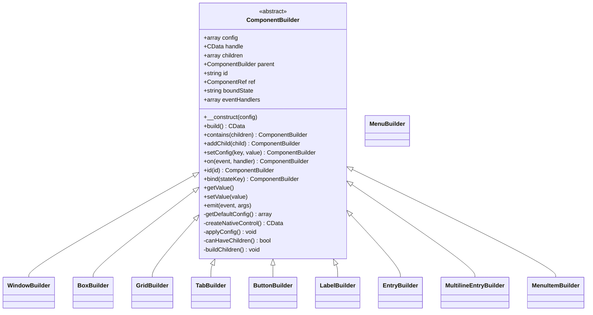

# 组件系统

<cite>
**本文档中引用的文件**  
- [ComponentBuilder.php](file://src/ComponentBuilder.php)
- [WindowBuilder.php](file://src/Components/WindowBuilder.php)
- [BoxBuilder.php](file://src/Components/BoxBuilder.php)
- [GridBuilder.php](file://src/Components/GridBuilder.php)
- [TabBuilder.php](file://src/Builder/TabBuilder.php)
- [ButtonBuilder.php](file://src/Components/ButtonBuilder.php)
- [LabelBuilder.php](file://src/Components/LabelBuilder.php)
- [EntryBuilder.php](file://src/Components/EntryBuilder.php)
- [MultilineEntryBuilder.php](file://src/Components/MultilineEntryBuilder.php)
- [MenuBuilder.php](file://src/Components/MenuBuilder.php)
- [MenuItemBuilder.php](file://src/Components/MenuItemBuilder.php)
- [Builder.php](file://src/Builder.php)
</cite>

## 目录
1. [引言](#引言)
2. [组件体系架构](#组件体系架构)
3. [容器类组件](#容器类组件)
4. [基础控件类组件](#基础控件类组件)
5. [菜单系统组件](#菜单系统组件)
6. [便捷方法与配置封装](#便捷方法与配置封装)
7. [组件构建流程](#组件构建流程)

## 引言
libuiBuilder 是一个基于 PHP 的 UI 构建库，提供了一套面向对象的组件构建系统，用于创建跨平台的桌面应用程序界面。本系统通过 Builder 模式组织 UI 组件，支持链式调用配置、事件绑定和状态管理。整个组件体系围绕 `ComponentBuilder` 抽象基类展开，所有具体组件均继承该类并实现其核心方法。

## 组件体系架构
libuiBuilder 的组件体系采用分层设计，核心为 `ComponentBuilder` 抽象类，定义了所有组件的通用行为和生命周期。具体组件分为三类：容器类（负责布局）、基础控件类（提供交互元素）和菜单系统（构建应用菜单栏）。所有组件通过静态工厂方法从 `Builder` 类统一创建，确保接口一致性。

**Diagram sources**  
- [ComponentBuilder.php](file://src/ComponentBuilder.php#L11-L234)
- [WindowBuilder.php](file://src/Components/WindowBuilder.php#L11-L96)
- [BoxBuilder.php](file://src/Components/BoxBuilder.php#L11-L64)

**Section sources**  
- [ComponentBuilder.php](file://src/ComponentBuilder.php#L11-L234)

## 容器类组件
容器类组件用于管理子组件的布局和排列，是 UI 结构的骨架。它们继承 `ComponentBuilder` 并重写 `canHaveChildren()` 返回 `true`，同时实现 `buildChildren()` 方法来构建其子组件树。

### WindowBuilder
作为顶级容器，`WindowBuilder` 用于创建应用程序窗口。它通过 `createNativeControl()` 调用底层 `Window::create()` 创建原生窗口控件，并在 `applyConfig()` 中设置边距、关闭事件等属性。

**关键配置项：**
- `title`: 窗口标题
- `width`, `height`: 窗口尺寸
- `margined`: 是否启用边距
- `onClosing`: 关闭事件处理器

**特有方法：**
- `show()`: 显示窗口并启动主事件循环
- `title()`, `size()`, `onClosing()`: 链式配置方法

**Section sources**  
- [WindowBuilder.php](file://src/Components/WindowBuilder.php#L11-L96)

### BoxBuilder
`BoxBuilder` 实现线性布局（垂直或水平），通过构造函数参数指定方向。其 `buildChildren()` 方法调用 `Box::append()` 将子组件依次添加到盒子中，并支持拉伸属性。

**关键配置项：**
- `padded`: 是否启用内边距
- `stretchy`: 子元素是否可拉伸

**特有方法：**
- `padded()`, `stretchy()`: 链式配置方法

**Section sources**  
- [BoxBuilder.php](file://src/Components/BoxBuilder.php#L11-L64)

### GridBuilder
`GridBuilder` 提供二维网格布局能力，通过 `place()` 方法将组件放置在指定行列位置。它维护一个 `gridItems` 数组，在 `buildChildren()` 中遍历并调用 `Grid::append()` 构建布局。

**关键配置项：**
- `padded`: 是否启用网格内边距
- `columnSpacing`, `rowSpacing`: 单元格间距

**特有方法：**
- `place()`: 将组件放置在指定网格位置，返回 `GridItemBuilder` 用于进一步配置对齐和扩展
- `row()`: 快速添加一行组件
- `form()`: 模板方法，快速创建表单布局
- `append()`: 在表单下方追加组件行

**Section sources**  
- [GridBuilder.php](file://src/Components/GridBuilder.php#L9-L120)

### TabBuilder
`TabBuilder` 用于创建标签页界面，内部维护一个 `tabs` 数组存储标签页信息。其 `buildChildren()` 方法遍历标签页并调用 `Tab::append()` 创建原生标签页。

**关键配置项：**
- `selectedIndex`: 默认选中的标签页索引
- `onTabSelected`: 标签页切换事件处理器

**特有方法：**
- `tab()`: 添加单个标签页
- `tabs()`: 批量添加标签页
- `selected()`: 设置默认选中页
- `onTabSelected()`: 绑定切换事件
- `getSelected()`: 获取当前选中页索引
- `switchTo()`: 程序化切换标签页

**Section sources**  
- [TabBuilder.php](file://src/Builder/TabBuilder.php#L10-L106)

## 基础控件类组件
基础控件类提供用户交互的基本元素，通常不可包含子组件。

### ButtonBuilder
按钮组件，触发用户操作。`applyConfig()` 中绑定点击事件处理器，触发时先 `emit('click')` 再调用用户定义的 `onClick` 回调。

**关键配置项：**
- `text`: 按钮显示文本
- `onClick`: 点击事件处理器

**特有方法：**
- `text()`, `onClick()`: 链式配置方法

**Section sources**  
- [ButtonBuilder.php](file://src/Components/ButtonBuilder.php#L9-L48)

### LabelBuilder
标签组件，用于显示静态文本。重写了 `getValue()` 和 `setValue()` 方法，使其能同步原生控件的文本内容。

**关键配置项：**
- `text`: 显示文本
- `align`: 文本对齐方式（left, center, right）

**特有方法：**
- `text()`, `align()`, `color()`: 链式配置方法

**Section sources**  
- [LabelBuilder.php](file://src/Components/LabelBuilder.php#L9-L62)

### EntryBuilder
单行输入框组件，支持占位符和只读模式。`applyConfig()` 中绑定 `onChanged` 事件，自动同步输入值并触发 `change` 事件。

**关键配置项：**
- `text`: 输入框初始值
- `placeholder`: 占位符文本
- `readOnly`: 是否只读
- `onChange`: 值改变事件处理器

**特有方法：**
- `text()`, `placeholder()`, `onChange()`: 链式配置方法

**Section sources**  
- [EntryBuilder.php](file://src/Components/EntryBuilder.php#L9-L80)

### MultilineEntryBuilder
多行文本输入框组件，支持换行和非换行模式。构造时根据 `wordWrap` 配置选择创建换行或非换行控件。

**关键配置项：**
- `text`: 初始文本内容
- `wordWrap`: 是否自动换行
- `readOnly`: 是否只读
- `placeholder`: 占位符

**特有方法：**
- `text()`, `readOnly()`, `wordWrap()`, `placeholder()`: 链式配置方法

**Section sources**  
- [MultilineEntryBuilder.php](file://src/Components/MultilineEntryBuilder.php#L9-L86)

## 菜单系统组件
菜单系统由 `MenuBuilder` 和 `MenuItemBuilder` 协同工作，构建应用菜单栏。

### MenuBuilder
菜单构建器，作为菜单系统的入口。其 `build()` 方法返回一个原生菜单句柄数组，供窗口使用。

**特有方法：**
- `menu()`: 创建一个顶级菜单项，返回 `MenuItemBuilder`

**Section sources**  
- [MenuBuilder.php](file://src/Components/MenuBuilder.php#L10-L29)

### MenuItemBuilder
菜单项构建器，支持多种类型的菜单项：
- 普通项 (`item`)
- 复选项 (`checkItem`)
- 分隔符 (`separator`)
- 系统项（退出、关于、偏好设置）
- 子菜单 (`submenu`)

每个菜单项类型在 `addMenuItem()` 方法中通过 `switch` 语句处理，调用相应的底层 API 创建。

**特有方法：**
- `item()`, `checkItem()`, `separator()`, `quitItem()`, `aboutItem()`, `preferencesItem()`, `submenu()`: 添加不同类型的菜单项

**Section sources**  
- [MenuItemBuilder.php](file://src/Components/MenuItemBuilder.php#L10-L126)

## 便捷方法与配置封装
`Builder` 类提供了一系列便捷静态方法，封装常用配置，简化组件创建。

### passwordEntry()
创建密码输入框，自动设置 `password` 配置项为 `true`，隐藏输入内容。

### textarea()
创建多行文本区域，实际是 `MultilineEntryBuilder` 的别名，语义更清晰。

### editableCombobox()
创建可编辑的下拉框，自动设置 `editable` 配置项。

### hSeparator / vSeparator
创建水平或垂直分隔线，通过合并配置项指定方向。

这些方法通过 `array_merge($config, [...])` 实现配置覆盖，既保留了默认行为，又允许用户自定义其他属性。

**Section sources**  
- [Builder.php](file://src/Builder.php#L82-L132)

## 组件构建流程
所有组件的构建遵循统一生命周期：
1. **构造**：调用 `__construct()`，合并默认配置与用户配置
2. **构建**：调用 `build()`，若未创建则：
   - 调用 `createNativeControl()` 创建原生控件
   - 调用 `applyConfig()` 应用配置
   - 调用 `buildChildren()` 构建子组件
3. **事件与状态**：支持 `on()` 绑定事件、`bind()` 绑定状态，通过 `emit()` 触发事件并自动同步状态。

此流程确保了组件创建的一致性和可预测性。

**Section sources**  
- [ComponentBuilder.php](file://src/ComponentBuilder.php#L210-L230)
- [Builder.php](file://src/Builder.php#L27-L153)