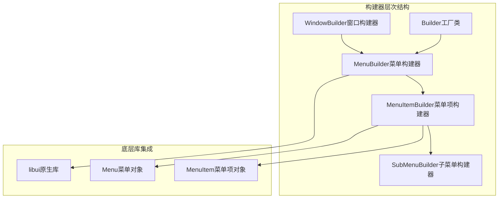
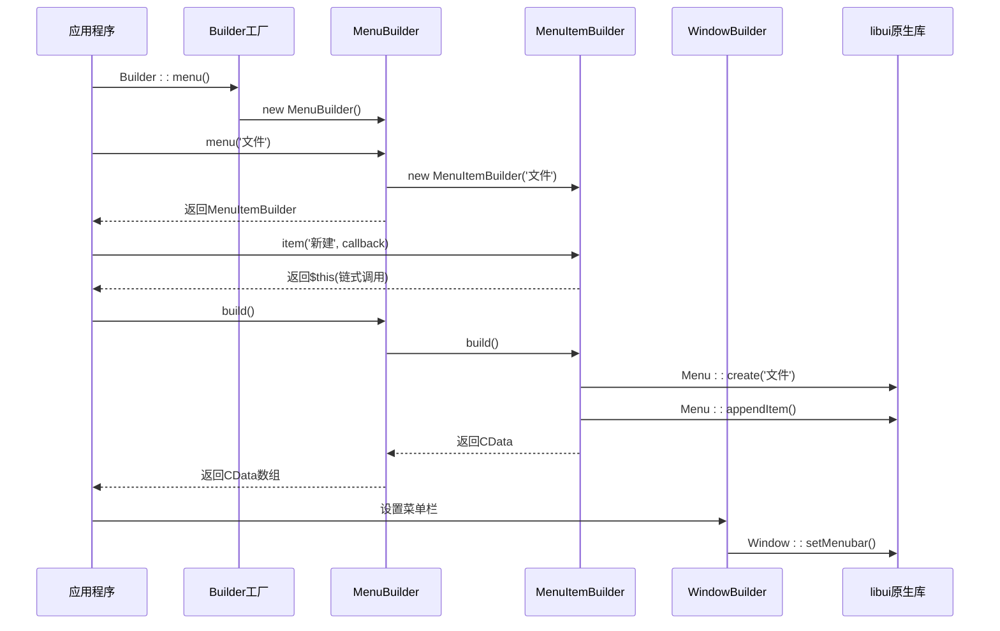
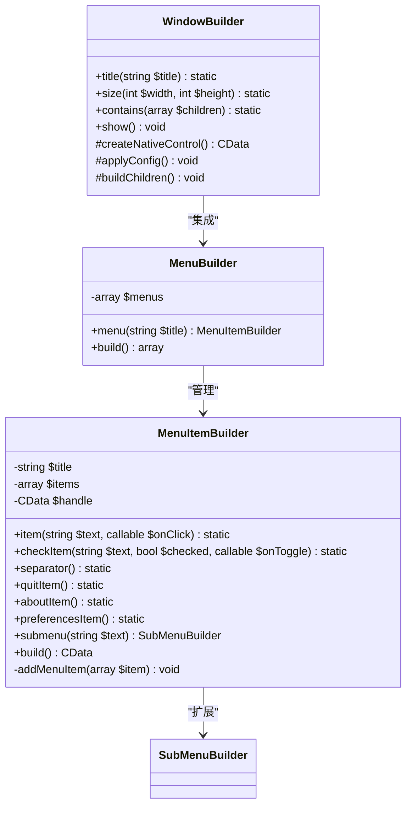
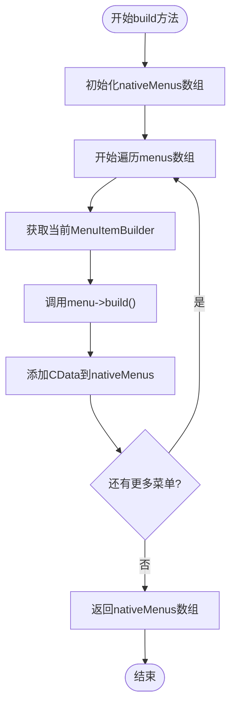
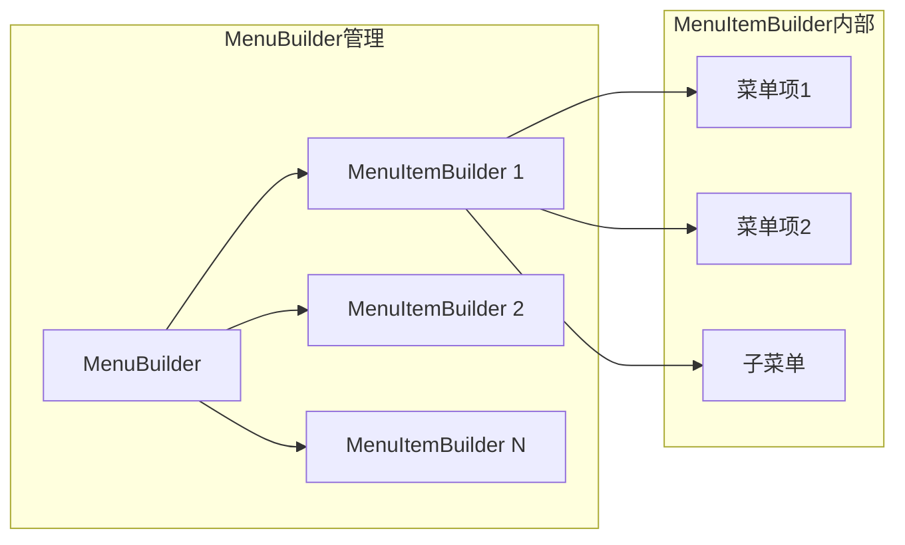
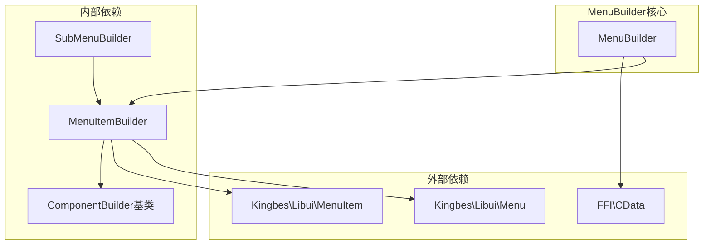

# MenuBuilder（菜单栏）

<cite>
**本文档中引用的文件**
- [MenuBuilder.php](file://src/Components/MenuBuilder.php)
- [MenuItemBuilder.php](file://src/Components/MenuItemBuilder.php)
- [WindowBuilder.php](file://src/Components/WindowBuilder.php)
- [Builder.php](file://src/Builder.php)
- [ComponentBuilder.php](file://src/ComponentBuilder.php)
- [full.php](file://example/full.php)
- [simple.php](file://example/simple.php)
</cite>

## 目录
1. [简介](#简介)
2. [项目结构](#项目结构)
3. [核心组件](#核心组件)
4. [架构概览](#架构概览)
5. [详细组件分析](#详细组件分析)
6. [依赖关系分析](#依赖关系分析)
7. [性能考虑](#性能考虑)
8. [故障排除指南](#故障排除指南)
9. [结论](#结论)

## 简介

MenuBuilder是libuiBuilder框架中负责构建应用程序菜单栏的核心类，作为顶层菜单系统的根构建器。它管理多个顶级菜单项的集合，并将其转换为底层libui可识别的CData数组结构，最终集成到WindowBuilder中以创建完整的原生UI界面。

MenuBuilder的设计遵循了构建器模式（Builder Pattern），提供了流畅的链式调用接口，使开发者能够轻松地定义复杂的菜单层次结构。通过与MenuItemBuilder、SubMenuBuilder等协作组件的配合，MenuBuilder能够构建从简单单级菜单到复杂嵌套子菜单的完整菜单系统。

## 项目结构

MenuBuilder位于libuiBuilder项目的组件层次结构中，作为菜单系统的核心协调者：



**图表来源**
- [Builder.php](file://src/Builder.php#L97-L101)
- [MenuBuilder.php](file://src/Components/MenuBuilder.php#L10-L29)
- [MenuItemBuilder.php](file://src/Components/MenuItemBuilder.php#L10-L126)

**章节来源**
- [MenuBuilder.php](file://src/Components/MenuBuilder.php#L1-L29)
- [Builder.php](file://src/Builder.php#L97-L101)

## 核心组件

MenuBuilder类的核心职责包括：

### 主要属性
- **$menus**: 私有数组属性，用于存储所有顶级菜单项的MenuItemBuilder实例集合

### 核心方法
- **menu(string $title)**: 创建并返回新的MenuItemBuilder实例，用于定义菜单标题
- **build()**: 遍历内部菜单项并调用每个MenuItemBuilder的build()方法，返回原生UI组件的CData数组

### 设计特点
- 使用私有数组管理菜单项，确保封装性和安全性
- 提供链式调用接口，支持流畅的菜单定义语法
- 延迟构建策略，仅在需要时才创建原生菜单对象

**章节来源**
- [MenuBuilder.php](file://src/Components/MenuBuilder.php#L12-L28)

## 架构概览

MenuBuilder在整个libuiBuilder架构中扮演着关键的协调角色：



**图表来源**
- [Builder.php](file://src/Builder.php#L97-L101)
- [MenuBuilder.php](file://src/Components/MenuBuilder.php#L14-L28)
- [MenuItemBuilder.php](file://src/Components/MenuItemBuilder.php#L77-L87)

## 详细组件分析

### MenuBuilder类深度分析

#### 类结构设计



**图表来源**
- [MenuBuilder.php](file://src/Components/MenuBuilder.php#L10-L29)
- [MenuItemBuilder.php](file://src/Components/MenuItemBuilder.php#L10-L126)
- [WindowBuilder.php](file://src/Components/WindowBuilder.php#L11-L96)

#### menu()方法详解

menu()方法是MenuBuilder的核心入口点，负责创建和管理菜单项：

**方法签名**: `public function menu(string $title): MenuItemBuilder`

**实现逻辑**:
1. 接收字符串参数$title，用于定义菜单标题
2. 创建新的MenuItemBuilder实例，传入标题参数
3. 将新创建的MenuItemBuilder添加到内部$menus数组
4. 返回MenuItemBuilder实例，支持链式调用

**使用场景**:
- 创建主菜单项（如"文件"、"编辑"、"视图"等）
- 支持动态菜单标题生成
- 便于单元测试和模拟

**章节来源**
- [MenuBuilder.php](file://src/Components/MenuBuilder.php#L14-L18)

#### build()方法详解

build()方法执行菜单系统的最终构建过程：

**方法签名**: `public function build(): array`

**实现逻辑**:
1. 初始化空数组$nativeMenus用于存储原生菜单对象
2. 遍历内部$menus数组中的每个MenuItemBuilder实例
3. 调用每个MenuItemBuilder的build()方法获取原生CData对象
4. 将CData对象添加到$nativeMenus数组
5. 返回完整的CData数组

**构建流程**:


**图表来源**
- [MenuBuilder.php](file://src/Components/MenuBuilder.php#L21-L28)

**章节来源**
- [MenuBuilder.php](file://src/Components/MenuBuilder.php#L21-L28)

### 与WindowBuilder的集成

MenuBuilder通过以下机制与WindowBuilder集成：

#### 配置传递
WindowBuilder维护hasMenubar配置项，控制是否启用菜单栏功能：

**默认配置**:
```php
[
    'title' => 'LibUI Application',
    'width' => 640,
    'height' => 480,
    'hasMenubar' => false,  // 默认禁用菜单栏
    'margined' => true,
    'onClosing' => null,
    'resizable' => true,
]
```

#### 构建过程
1. WindowBuilder检测hasMenubar配置
2. 如果启用，调用MenuBuilder的build()方法
3. 将返回的CData数组传递给libui的Window::setMenubar()函数
4. 设置窗口的菜单栏

**章节来源**
- [WindowBuilder.php](file://src/Components/WindowBuilder.php#L13-L23)
- [WindowBuilder.php](file://src/Components/WindowBuilder.php#L26-L33)

### MenuItemBuilder协作机制

MenuBuilder与MenuItemBuilder通过组合关系协作：



**图表来源**
- [MenuBuilder.php](file://src/Components/MenuBuilder.php#L12)
- [MenuItemBuilder.php](file://src/Components/MenuItemBuilder.php#L13-L15)

**章节来源**
- [MenuBuilder.php](file://src/Components/MenuBuilder.php#L12-L18)
- [MenuItemBuilder.php](file://src/Components/MenuItemBuilder.php#L13-L15)

## 依赖关系分析

MenuBuilder的依赖关系体现了清晰的分层架构：



**图表来源**
- [MenuBuilder.php](file://src/Components/MenuBuilder.php#L1-L9)
- [MenuItemBuilder.php](file://src/Components/MenuItemBuilder.php#L1-L9)

### 关键依赖说明

| 依赖类型 | 组件名称 | 用途 | 重要性 |
|---------|---------|------|--------|
| 外部库依赖 | FFI\CData | 原生内存指针操作 | 核心 |
| 外部库依赖 | Kingbes\Libui\Menu | 菜单创建和管理 | 核心 |
| 外部库依赖 | Kingbes\Libui\MenuItem | 菜单项操作 | 核心 |
| 内部基类 | ComponentBuilder | 构建器基类功能 | 中等 |
| 内部组件 | MenuItemBuilder | 单个菜单项构建 | 核心 |
| 内部组件 | SubMenuBuilder | 子菜单构建 | 核心 |

**章节来源**
- [MenuBuilder.php](file://src/Components/MenuBuilder.php#L1-L9)
- [MenuItemBuilder.php](file://src/Components/MenuItemBuilder.php#L1-L9)

## 性能考虑

### 延迟构建策略
MenuBuilder采用延迟构建模式，只有在实际调用build()方法时才会创建原生菜单对象，这带来了以下优势：

1. **内存效率**: 避免不必要的原生对象创建
2. **启动性能**: 减少应用初始化时间
3. **资源管理**: 更好地控制原生资源分配

### 构建缓存机制
MenuItemBuilder实现了handle缓存机制：
- 首次调用build()时创建原生菜单对象
- 后续调用直接返回缓存的CData对象
- 防止重复的原生对象创建开销

### 批量处理优化
MenuBuilder的build()方法采用批量处理：
- 一次性遍历所有菜单项
- 减少循环开销
- 提高整体构建效率

## 故障排除指南

### 常见问题及解决方案

#### 问题1: 菜单未显示

**可能原因**:
1. 未正确设置WindowBuilder的hasMenubar配置
2. 未调用MenuBuilder的build()方法
3. 菜单项为空或无效

**调试步骤**:
```php
// 检查Window配置
$window = Builder::window()
    ->title('测试应用')
    ->size(800, 600)
    ->hasMenubar(true);  // 确保启用菜单栏

// 检查菜单构建
$menu = Builder::menu()
    ->menu('文件')  // 确保至少有一个菜单项
        ->item('新建', function() { echo "新建\n"; });

// 验证构建过程
$nativeMenus = $menu->build();
var_dump($nativeMenus); // 应该输出非空数组
```

**解决方案**:
- 确保WindowBuilder配置hasMenubar为true
- 在MenuBuilder中添加至少一个有效的菜单项
- 验证build()方法被正确调用

#### 问题2: 菜单项点击事件不响应

**可能原因**:
1. 回调函数格式不正确
2. 事件绑定失败
3. 原生库版本兼容性问题

**调试方法**:
```php
// 使用简单的回调验证
$menu = Builder::menu()
    ->menu('测试')
        ->item('点击我', function() {
            echo "菜单项被点击\n"; // 应该看到输出
        });

// 检查回调函数签名
$item = MenuItemBuilder::item('测试', function($menuItem) {
    // 正确的回调签名
    var_dump($menuItem);
});
```

#### 问题3: 子菜单无法展开

**可能原因**:
1. SubMenuBuilder未正确创建
2. 子菜单项为空
3. 层级结构错误

**解决方案**:
```php
// 正确的子菜单创建
$menu = Builder::menu()
    ->menu('编辑')
        ->submenu('格式')  // 创建子菜单
            ->item('加粗', function() { /* ... */ })
            ->item('斜体', function() { /* ... */ });
```

### 调试工具和技巧

#### 菜单状态检查
```php
// 检查菜单构建状态
function debugMenu(MenuBuilder $menu) {
    $nativeMenus = $menu->build();
    echo "菜单数量: " . count($nativeMenus) . "\n";
    
    foreach ($nativeMenus as $i => $nativeMenu) {
        echo "菜单 #$i: CData对象\n";
        // libui特定的调试信息
    }
}
```

#### 事件监听器验证
```php
// 验证事件绑定
function validateEventBinding($menuItem, $callback) {
    // 模拟事件触发
    $testResult = call_user_func($callback, $menuItem);
    if ($testResult !== null) {
        echo "事件回调正常工作\n";
    }
}
```

**章节来源**
- [WindowBuilder.php](file://src/Components/WindowBuilder.php#L19)
- [MenuItemBuilder.php](file://src/Components/MenuItemBuilder.php#L77-L87)

## 结论

MenuBuilder作为libuiBuilder框架中菜单系统的核心组件，展现了优秀的软件设计原则：

### 设计优势
1. **单一职责**: 专注于菜单项的管理和构建
2. **开放封闭**: 对扩展开放，对修改封闭
3. **依赖倒置**: 依赖抽象而非具体实现
4. **组合优于继承**: 通过组合关系实现功能扩展

### 架构价值
- 提供了清晰的菜单系统构建接口
- 支持复杂的嵌套菜单结构
- 实现了高效的原生资源管理
- 保证了良好的代码可维护性

### 最佳实践建议
1. 在WindowBuilder中始终显式设置hasMenubar配置
2. 使用链式调用提高代码可读性
3. 合理组织菜单层级结构
4. 为菜单项提供有意义的回调函数
5. 定期验证菜单系统的构建状态

MenuBuilder不仅是一个功能组件，更是整个libuiBuilder框架设计理念的具体体现，为开发者提供了一个强大而易用的菜单系统构建工具。