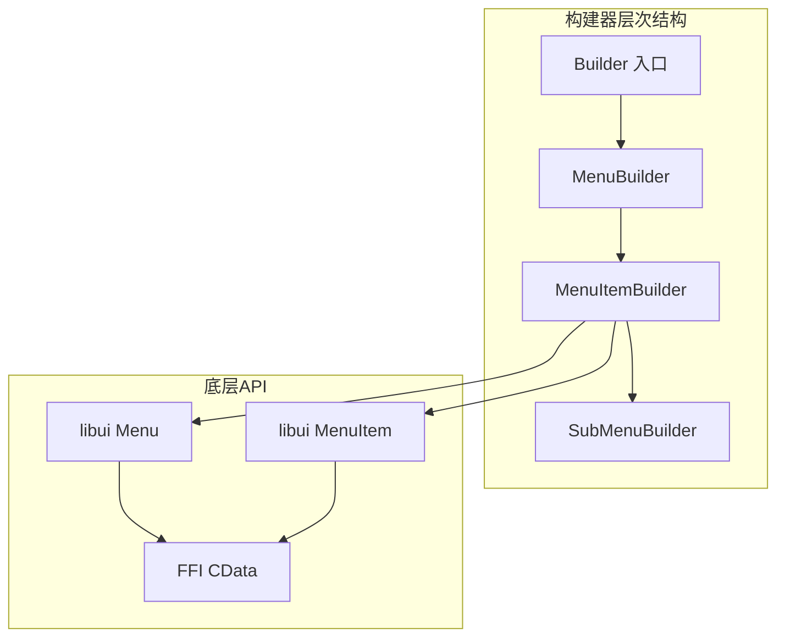
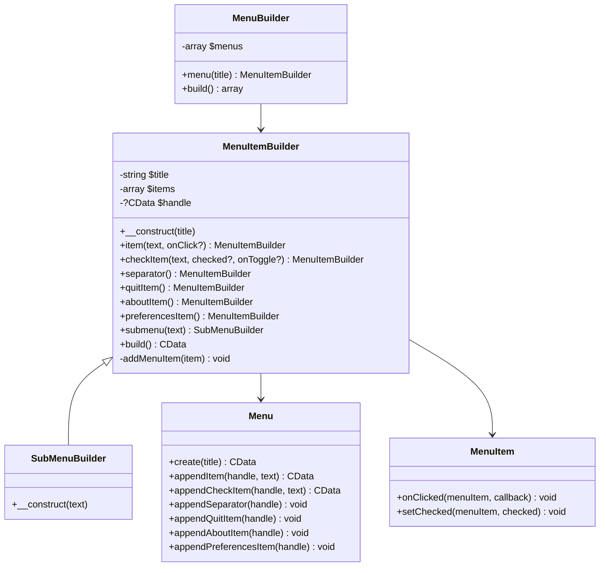
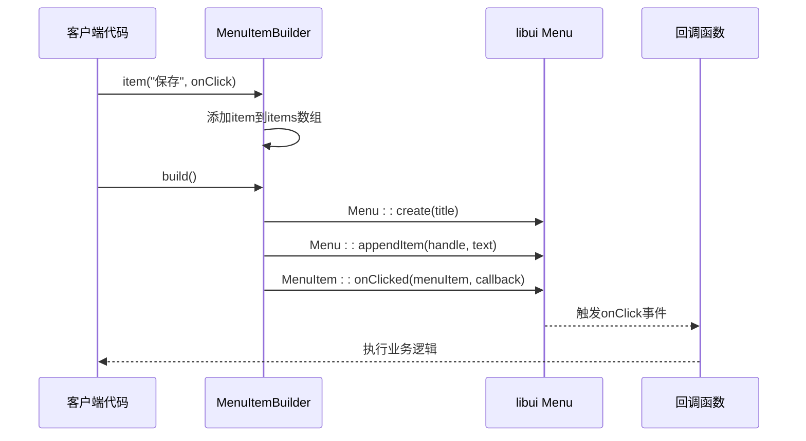
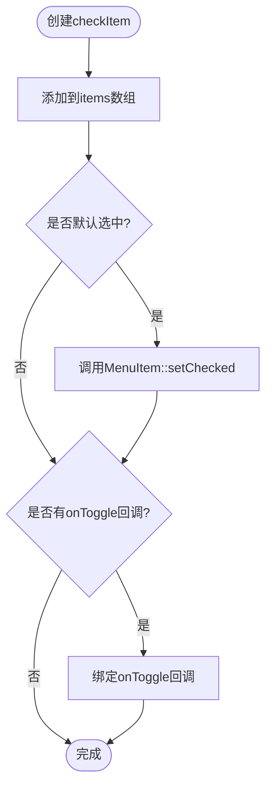
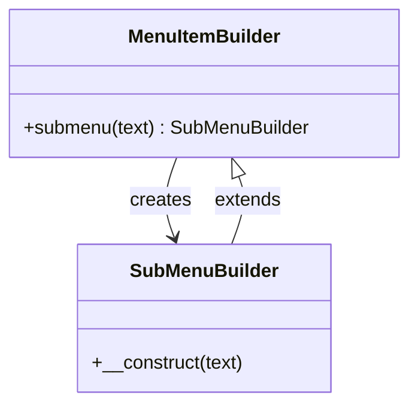
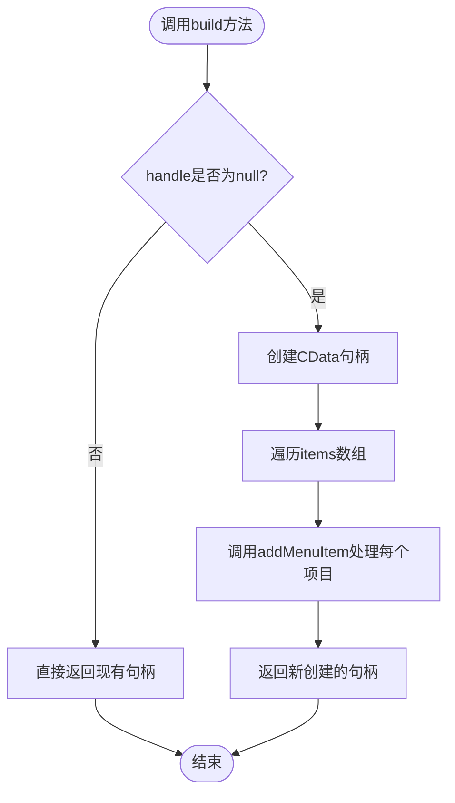
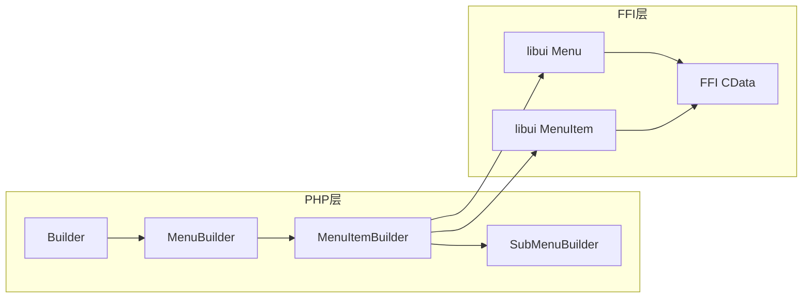

# MenuItemBuilder（菜单项）全面文档

<cite>
**本文档引用的文件**
- [MenuItemBuilder.php](file://src/Components/MenuItemBuilder.php)
- [MenuBuilder.php](file://src/Components/MenuBuilder.php)
- [SubMenuBuilder.php](file://src/Components/SubMenuBuilder.php)
- [Builder.php](file://src/Builder.php)
- [full.php](file://example/full.php)
- [composer.json](file://composer.json)
</cite>

## 目录
1. [简介](#简介)
2. [项目结构概览](#项目结构概览)
3. [核心组件分析](#核心组件分析)
4. [架构概览](#架构概览)
5. [详细组件分析](#详细组件分析)
6. [依赖关系分析](#依赖关系分析)
7. [性能考虑](#性能考虑)
8. [故障排除指南](#故障排除指南)
9. [结论](#结论)

## 简介

MenuItemBuilder是libuiBuilder框架中的核心菜单构建组件，专门负责构建和管理应用程序的菜单项。它采用流畅接口设计模式，提供了丰富的菜单项类型支持，包括普通可点击项、复选菜单项、分隔线、标准系统菜单项以及子菜单。该组件通过延迟初始化机制优化内存使用，并与底层libui API紧密集成，为开发者提供了强大而灵活的菜单构建能力。

## 项目结构概览

libuiBuilder项目采用模块化架构，MenuItemBuilder作为组件系统的重要组成部分，与其他构建器协同工作：

**图表来源**
- [Builder.php](file://src/Builder.php#L98-L101)
- [MenuBuilder.php](file://src/Components/MenuBuilder.php#L14-L18)
- [MenuItemBuilder.php](file://src/Components/MenuItemBuilder.php#L10-L15)

**章节来源**
- [Builder.php](file://src/Builder.php#L1-L153)
- [MenuBuilder.php](file://src/Components/MenuBuilder.php#L1-L29)

## 核心组件分析

### MenuItemBuilder类核心属性

MenuItemBuilder类维护以下关键属性来管理菜单项：

| 属性 | 类型 | 描述 | 默认值 |
|------|------|------|--------|
| `$title` | string | 菜单项标题 | 构造函数传入 |
| `$items` | array | 菜单项集合 | `[]` |
| `$handle` | ?CData | libui CData句柄 | `null` |

### 支持的菜单项类型

MenuItemBuilder支持以下七种菜单项类型：

| 方法 | 类型 | 参数 | 功能描述 |
|------|------|------|----------|
| `item()` | item | text, onClick? | 添加普通可点击菜单项 |
| `checkItem()` | check | text, checked?, onToggle? | 添加带复选状态的菜单项 |
| `separator()` | separator | 无 | 添加分隔线 |
| `quitItem()` | quit | 无 | 添加退出应用程序菜单项 |
| `aboutItem()` | about | 无 | 添加关于信息菜单项 |
| `preferencesItem()` | preferences | 无 | 添加首选项设置菜单项 |
| `submenu()` | submenu | text | 创建子菜单 |

**章节来源**
- [MenuItemBuilder.php](file://src/Components/MenuItemBuilder.php#L22-L75)

## 架构概览

MenuItemBuilder采用分层架构设计，实现了清晰的职责分离：

**图表来源**
- [MenuItemBuilder.php](file://src/Components/MenuItemBuilder.php#L10-L15)
- [SubMenuBuilder.php](file://src/Components/SubMenuBuilder.php#L5-L13)
- [MenuBuilder.php](file://src/Components/MenuBuilder.php#L11-L12)

## 详细组件分析

### 菜单项类型详解

#### 普通菜单项（item）

普通菜单项是最基本的交互元素，支持点击事件处理：

**图表来源**
- [MenuItemBuilder.php](file://src/Components/MenuItemBuilder.php#L22-L29)
- [MenuItemBuilder.php](file://src/Components/MenuItemBuilder.php#L92-L96)

#### 复选菜单项（checkItem）

复选菜单项支持状态切换和事件处理：

**图表来源**
- [MenuItemBuilder.php](file://src/Components/MenuItemBuilder.php#L32-L41)
- [MenuItemBuilder.php](file://src/Components/MenuItemBuilder.php#L99-L106)

#### 子菜单（submenu）

子菜单通过继承MenuItemBuilder实现递归结构：

**图表来源**
- [MenuItemBuilder.php](file://src/Components/MenuItemBuilder.php#L67-L75)
- [SubMenuBuilder.php](file://src/Components/SubMenuBuilder.php#L5-L13)

### 延迟初始化机制

build()方法实现了智能的延迟初始化机制：

**图表来源**
- [MenuItemBuilder.php](file://src/Components/MenuItemBuilder.php#L77-L87)

**章节来源**
- [MenuItemBuilder.php](file://src/Components/MenuItemBuilder.php#L77-L126)

### 内部数据结构设计

MenuItemBuilder使用统一的数组结构来存储不同类型菜单项：

| 字段 | 类型 | 必需 | 描述 |
|------|------|------|------|
| `type` | string | 是 | 菜单项类型（item/check/separator/quit/about/preferences/submenu） |
| `text` | string | 条件 | 菜单项显示文本（除separator外必需） |
| `onClick/onToggle` | callable | 可选 | 点击/切换事件回调 |
| `checked` | bool | 条件 | 复选状态（仅check类型有效） |
| `submenu` | SubMenuBuilder | 条件 | 子菜单实例（仅submenu类型有效） |

**章节来源**
- [MenuItemBuilder.php](file://src/Components/MenuItemBuilder.php#L22-L75)

## 依赖关系分析

### 组件间依赖关系

**图表来源**
- [Builder.php](file://src/Builder.php#L98-L101)
- [MenuBuilder.php](file://src/Components/MenuBuilder.php#L14-L18)
- [MenuItemBuilder.php](file://src/Components/MenuItemBuilder.php#L6-L9)

### 外部依赖

MenuItemBuilder依赖于以下外部组件：

| 依赖 | 版本要求 | 用途 |
|------|----------|------|
| kingbes/libui | * | 提供底层libui C API封装 |
| ext/ffi | * | PHP FFI扩展，用于C语言互操作 |

**章节来源**
- [composer.json](file://composer.json#L6-L7)
- [MenuItemBuilder.php](file://src/Components/MenuItemBuilder.php#L6-L9)

## 性能考虑

### 延迟初始化优势

MenuItemBuilder的延迟初始化机制带来以下性能优势：

1. **内存优化**：仅在需要时创建CData句柄
2. **按需加载**：避免不必要的底层资源分配
3. **构建效率**：支持链式调用，提高构建速度

### 最佳实践建议

1. **合理使用链式调用**：充分利用流畅接口设计
2. **及时构建**：在窗口显示前完成菜单构建
3. **避免重复构建**：利用build()方法的缓存机制

## 故障排除指南

### 常见问题及解决方案

| 问题 | 可能原因 | 解决方案 |
|------|----------|----------|
| 菜单项不显示 | handle未正确初始化 | 确保调用build()方法 |
| 回调函数不执行 | 事件绑定失败 | 检查回调函数签名和参数 |
| 子菜单异常 | 继承关系错误 | 使用SubMenuBuilder而非MenuItemBuilder |
| 内存泄漏 | CData句柄未释放 | 确保应用程序正常关闭 |

### 调试技巧

1. **检查items数组内容**：验证菜单项配置
2. **监控build方法调用**：确认延迟初始化触发
3. **验证回调函数**：测试事件响应机制

**章节来源**
- [MenuItemBuilder.php](file://src/Components/MenuItemBuilder.php#L77-L87)

## 结论

MenuItemBuilder作为libuiBuilder框架的核心组件，成功地抽象了复杂的菜单构建过程，为开发者提供了简洁而强大的API。其采用的设计模式包括：

1. **流畅接口模式**：支持链式调用，提升开发体验
2. **延迟初始化**：优化资源使用，提高性能
3. **统一数据结构**：简化不同类型菜单项的处理
4. **分层架构**：清晰的职责分离，便于维护和扩展

通过与MenuBuilder和SubMenuBuilder的协作，MenuItemBuilder构建了一个完整的菜单生态系统，为构建现代化桌面应用程序提供了坚实的基础。其设计理念和实现方式值得在类似GUI框架中借鉴和应用。